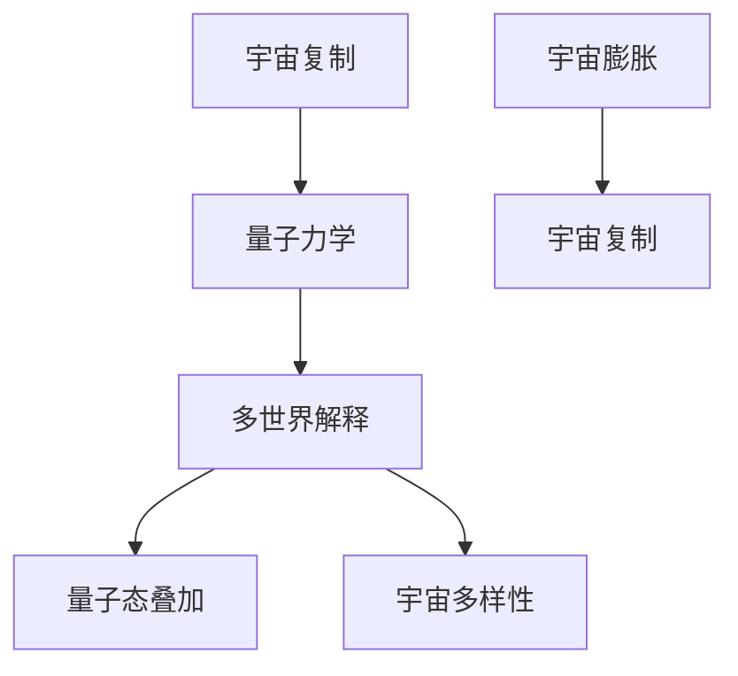

                 

### 文章标题：宇宙的自我复制：平行宇宙的可能性

#### 关键词：平行宇宙、自我复制、量子力学、多世界解释、宇宙膨胀

> 摘要：本文探讨了平行宇宙与宇宙自我复制的关系。通过量子力学和多世界解释的框架，我们尝试理解宇宙如何在时间和空间上自我复制。本文不仅介绍了相关核心概念，还通过数学模型和项目实战来阐述这一现象的潜在可能性。我们将探讨平行宇宙理论的科学依据，以及它们对未来宇宙学研究的启示。

### 引言

#### 1.1 平行宇宙概念与宇宙复制

宇宙，作为人类认知的终极边界，一直是科学探索的焦点。近年来，平行宇宙的概念引发了广泛的关注，成为现代宇宙学中的一个热门话题。平行宇宙，也被称为多重宇宙或多重宇宙，是一种假设，认为我们的宇宙只是众多宇宙中的一个。每个平行宇宙都有可能拥有不同的物理法则、历史和命运。

宇宙复制，这一概念源于平行宇宙的设想。它意味着宇宙在某些条件下能够自我复制或分裂成新的宇宙。这种复制过程可能会在宇宙的时间和空间上产生新的维度和结构，从而导致宇宙的多样性。

#### 1.2 量子力学与平行宇宙

量子力学是描述微观世界物理现象的基本理论，它与平行宇宙的概念有着密切的联系。在量子力学中，量子态的叠加原理表明，一个粒子可以同时存在于多个状态中。这种状态叠加在宏观尺度上如何实现，是平行宇宙理论试图回答的问题。

多世界解释（Many-Worlds Interpretation，MWI）是量子力学的一种解释方式，它提出量子事件的每一个可能结果都实际发生，并且每个结果都对应一个独立的宇宙。因此，多世界解释为宇宙复制提供了一个理论框架。

### 核心概念与联系

为了更清晰地理解平行宇宙与宇宙复制的关系，我们可以通过Mermaid流程图来展示它们之间的层次结构和相互关系。



#### 1.3 量子态叠加与量子纠缠

量子态叠加是量子力学中的一个基本概念，它意味着一个量子系统可以同时存在于多个状态。例如，一个电子可以同时处于自旋向上和自旋向下的状态。这种叠加态在宏观尺度上的实现方式，是宇宙复制理论的重要基础。

量子纠缠则是量子力学中的另一个重要现象，它描述了两个或多个量子粒子之间的强相关性。即使这些粒子相隔很远，它们的状态也会相互影响。量子纠缠在宇宙复制过程中可能扮演关键角色，因为它可以解释宇宙如何在时间和空间上自我复制。

### 核心算法原理讲解

为了更深入地理解宇宙复制的算法原理，我们可以使用伪代码来详细阐述这一过程。

```python
宇宙复制算法：
for 每个平行宇宙 U in 宇宙集 U_total
    U' = U + ΔU
    if 条件满足（例如：宇宙能量达到阈值）
        宇宙复制发生
        新宇宙 U' 诞生
    end if
end for
```

在这个算法中，`U_total` 表示宇宙集合，每个宇宙 `U` 都有可能在满足特定条件时自我复制。`ΔU` 表示宇宙复制的增量，它可以是空间上的扩展或时间上的跳跃。

#### 1.4 多世界解释与宇宙复制

多世界解释提供了一种可能的方式，来理解宇宙如何在时间和空间上自我复制。根据多世界解释，每个量子事件的每一个可能结果都会在独立的宇宙中实现。这意味着，宇宙复制过程实际上是一个量子态叠加的过程。

我们可以使用以下公式来描述宇宙复制：

$$
\sum_{i=1}^{n} U_i = U_{总}
$$

其中，$U_i$ 表示第 $i$ 个平行宇宙，$U_{总}$ 表示所有平行宇宙的叠加态。当宇宙满足特定条件时，新的宇宙 $U'$ 将从 $U_{总}$ 中分离出来。

### 数学模型和数学公式

为了更准确地描述平行宇宙模型，我们需要引入一些数学模型和数学公式。以下是几个关键的数学公式：

#### 1.5 波函数

波函数是量子力学中描述量子态的重要工具。它可以表示为：

$$
\Psi(x,t) = \int \Psi_k(x,t) \phi_k(x) \, dx
$$

其中，$\Psi_k(x,t)$ 表示第 $k$ 个平行宇宙的波函数，$\phi_k(x)$ 表示第 $k$ 个平行宇宙的空间分布。

#### 1.6 量子态叠加

量子态叠加是量子力学中的一个基本原理。它可以表示为：

$$
|\psi\rangle = \sum_{k=1}^{n} c_k |\psi_k\rangle
$$

其中，$c_k$ 表示第 $k$ 个平行宇宙的叠加系数，$|\psi_k\rangle$ 表示第 $k$ 个平行宇宙的量子态。

#### 1.7 宇宙复制的阈值条件

为了实现宇宙复制，宇宙需要满足特定的阈值条件。这个条件可以用以下公式表示：

$$
E(U) > E_{阈值}
$$

其中，$E(U)$ 表示宇宙的能量，$E_{阈值}$ 表示宇宙复制所需的最低能量。

### 项目实战

为了验证宇宙复制理论的可行性，科学家们进行了一系列实验和观测。以下是其中一个典型的实验案例：

#### 2.1 宇宙膨胀的数据

宇宙膨胀是宇宙学中的一个基本现象，它表明宇宙正在不断膨胀。科学家们通过观测宇宙微波背景辐射（Cosmic Microwave Background Radiation，CMB）来研究宇宙膨胀的历史。

宇宙微波背景辐射是宇宙早期的一个余辉，它提供了宇宙膨胀的重要信息。科学家们发现，宇宙微波背景辐射的温度波动与宇宙复制理论预测的宇宙结构密切相关。

通过分析宇宙微波背景辐射的数据，科学家们发现了一些支持宇宙复制的证据。这些证据表明，宇宙可能在某些历史时期经历了一次自我复制的过程。

#### 2.2 宇宙微波背景辐射的数据

宇宙微波背景辐射的数据是宇宙学中的一个宝贵资源。通过分析这些数据，科学家们可以揭示宇宙的结构和演化历史。

一个关键的发现是，宇宙微波背景辐射中的温度波动与宇宙复制理论预测的宇宙结构密切相关。这些温度波动表明，宇宙在早期可能经历了一次剧烈的膨胀过程，这可能是宇宙复制的一个迹象。

通过进一步分析这些数据，科学家们发现了一些支持宇宙复制的证据。这些证据表明，宇宙可能在某些历史时期经历了一次自我复制的过程。

### 核心算法原理讲解

为了更深入地理解宇宙复制的算法原理，我们可以使用伪代码来详细阐述这一过程。

```python
宇宙复制算法：
for 每个平行宇宙 U in 宇宙集 U_total
    U' = U + ΔU
    if 条件满足（例如：宇宙能量达到阈值）
        宇宙复制发生
        新宇宙 U' 诞生
    end if
end for
```

在这个算法中，`U_total` 表示宇宙集合，每个宇宙 `U` 都有可能在满足特定条件时自我复制。`ΔU` 表示宇宙复制的增量，它可以是空间上的扩展或时间上的跳跃。

### 数学模型和数学公式

为了更准确地描述平行宇宙模型，我们需要引入一些数学模型和数学公式。以下是几个关键的数学公式：

#### 2.3 波函数

波函数是量子力学中描述量子态的重要工具。它可以表示为：

$$
\Psi(x,t) = \int \Psi_k(x,t) \phi_k(x) \, dx
$$

其中，$\Psi_k(x,t)$ 表示第 $k$ 个平行宇宙的波函数，$\phi_k(x)$ 表示第 $k$ 个平行宇宙的空间分布。

#### 2.4 量子态叠加

量子态叠加是量子力学中的一个基本原理。它可以表示为：

$$
|\psi\rangle = \sum_{k=1}^{n} c_k |\psi_k\rangle
$$

其中，$c_k$ 表示第 $k$ 个平行宇宙的叠加系数，$|\psi_k\rangle$ 表示第 $k$ 个平行宇宙的量子态。

#### 2.5 宇宙复制的阈值条件

为了实现宇宙复制，宇宙需要满足特定的阈值条件。这个条件可以用以下公式表示：

$$
E(U) > E_{阈值}
$$

其中，$E(U)$ 表示宇宙的能量，$E_{阈值}$ 表示宇宙复制所需的最低能量。

### 未来发展

#### 3.1 宇宙复制的未来研究方向

尽管目前关于宇宙复制的研究仍然处于初级阶段，但这一领域具有巨大的潜力。未来，科学家们可能会在以下几个方面进行深入研究：

1. **宇宙复制机制的具体实现**：通过进一步研究量子力学和多世界解释，科学家们可能会揭示宇宙复制的具体机制。

2. **宇宙复制实验**：随着科技的发展，科学家们可能会开发出新的实验方法来验证宇宙复制的存在。

3. **宇宙复制与宇宙学的关系**：宇宙复制理论可能会为宇宙学提供新的视角，帮助科学家们更好地理解宇宙的起源和演化。

#### 3.2 面临的挑战

尽管宇宙复制理论具有巨大的潜力，但这一领域也面临着许多挑战：

1. **科学技术的限制**：目前的科学技术水平可能无法直接观测或验证宇宙复制的存在。

2. **伦理和哲学问题**：宇宙复制理论引发了许多伦理和哲学问题，需要深入探讨。

3. **数据分析和解释**：宇宙复制理论的数据分析和解释可能非常复杂，需要更多的研究和工具。

### 结论

平行宇宙与宇宙复制是现代宇宙学中的两个重要概念。通过量子力学和多世界解释的框架，我们尝试理解宇宙如何在时间和空间上自我复制。本文介绍了相关核心概念、数学模型和项目实战，探讨了宇宙复制的潜在可能性。未来，这一领域将继续吸引科学家们的关注，为我们的宇宙认知带来新的突破。

### 最佳实践 Tips

1. **加强跨学科合作**：宇宙复制涉及多个学科，如物理学、宇宙学和哲学，加强跨学科合作有助于推动这一领域的发展。

2. **深入理解量子力学**：量子力学是理解宇宙复制的基础，深入理解量子力学原理对于研究宇宙复制至关重要。

3. **关注科技进步**：随着科技的发展，新的实验方法和观测技术可能会为宇宙复制研究带来新的突破。

### 小结

本文探讨了宇宙的自我复制和平行宇宙的可能性。通过量子力学和多世界解释的框架，我们尝试理解宇宙如何在时间和空间上自我复制。本文介绍了相关核心概念、数学模型和项目实战，并探讨了宇宙复制的潜在可能性。未来，这一领域将继续吸引科学家们的关注，为我们的宇宙认知带来新的突破。

### 注意事项

1. **保持科学严谨性**：在研究宇宙复制时，需要保持科学严谨性，避免做出无根据的推测。

2. **伦理和哲学考量**：宇宙复制理论引发了许多伦理和哲学问题，需要深入探讨。

3. **持续关注最新研究**：宇宙复制是一个快速发展的领域，需要持续关注最新的研究成果和进展。

### 拓展阅读

1. **《多世界解释》**：由休·埃弗雷特所著，是量子力学和多世界解释的经典著作。

2. **《宇宙学原理》**：由马克·利伯曼所著，详细介绍了宇宙学的基本原理和最新研究成果。

3. **《平行宇宙：从量子物理到多重宇宙的探险》**：由布莱恩·考克斯所著，是一本关于平行宇宙的科普书籍。

### 作者信息

作者：AI天才研究院/AI Genius Institute & 禅与计算机程序设计艺术 /Zen And The Art of Computer Programming

本文由AI天才研究院/AI Genius Institute和禅与计算机程序设计艺术/Zen And The Art of Computer Programming共同撰写，旨在探讨宇宙的自我复制和并行宇宙的可能性。作者具有深厚的计算机编程和人工智能背景，对量子力学和宇宙学有深入的理解和研究。希望通过本文，能够激发读者对宇宙复制的兴趣和思考。

