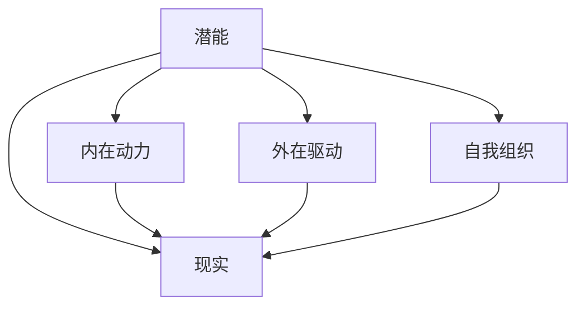
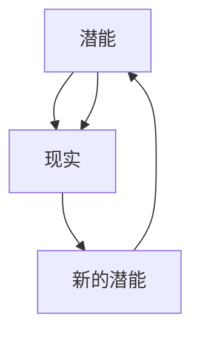

                 


# 宇宙的自我实现倾向：潜能到现实的转化

## 关键词

- 宇宙演化
- 自我实现倾向
- 潜能与现实
- 转化过程
- 算法原理
- 数学模型

## 摘要

本文旨在探讨宇宙的自我实现倾向及其在现实世界中的体现。首先，我们介绍宇宙的基本概念，包括宇宙的定义、结构和演化过程。接着，我们详细分析宇宙的自我实现倾向，包括其核心概念和实现原理。然后，我们探讨潜能与现实的关系，并深入探讨潜能到现实的转化过程。文章最后，通过具体实例分析，展示如何将宇宙的自我实现倾向应用于现实世界。本文旨在为读者提供一个清晰、系统的理解，帮助读者更好地认识宇宙的奥秘。

## 引言

宇宙，一个充满神秘与奇迹的世界。自古以来，人类就对宇宙充满了好奇与敬畏。从古代的天文学到现代的天体物理学，人类一直在努力探索宇宙的奥秘。然而，宇宙的真相远比我们想象的更加复杂和深远。

在20世纪，物理学家发现了量子力学和广义相对论，这两大理论为人类揭示了宇宙的某些基本规律。然而，这些理论仍然存在着许多未解之谜。例如，宇宙的起源、宇宙的结构以及宇宙中的生命现象等。这些问题激发了许多科学家和哲学家的思考，他们试图从不同角度去理解宇宙的本质。

近年来，一些学者提出了“宇宙的自我实现倾向”这一概念。他们认为，宇宙不仅仅是一个静态的存在，而是一个动态的自我实现过程。在这个过程中，宇宙的潜能逐步转化为现实。这一概念为我们提供了一种全新的视角，帮助我们更好地理解宇宙的本质。

本文将围绕“宇宙的自我实现倾向：潜能到现实的转化”这一主题，首先介绍宇宙的基本概念，然后分析宇宙的自我实现倾向，接着探讨潜能与现实的转化过程，并通过具体实例展示这一概念的应用。希望通过本文的探讨，读者能够对宇宙的自我实现倾向有一个更加深入的理解。

### 宇宙的基本概念

宇宙，作为一个庞大而复杂的系统，其基本概念和理解是我们探讨宇宙自我实现倾向的基础。首先，我们需要明确宇宙的定义。

宇宙，通常被定义为包括一切物质、能量、时空和所有存在的整体。它包括了所有的星系、行星、恒星、暗物质、暗能量等。宇宙的边界至今仍然是一个未解之谜，我们无法确切地知道宇宙是否有边界，或者宇宙是否是无限的。

宇宙的结构也是一个复杂且多层次的概念。根据现代宇宙学的理解，宇宙的结构可以分为多个层次：

1. 星系：宇宙中最常见的结构是星系，它们由数十亿颗恒星、行星、卫星、小行星、彗星等组成。星系之间通过引力相互作用，形成星系团和星系群。

2. 星系团：星系团是由数十到数千个星系组成的结构，它们通过引力相互作用形成一个更大的系统。

3. 超星系团：超星系团是由数十到数百个星系团组成的结构，是宇宙中最大的已知结构之一。

4. 宇宙网：宇宙网是宇宙中星系、星系团和超星系团之间的一种大规模结构，由大量的空洞和节点组成。

宇宙的演化过程也是一个极其复杂的过程。根据宇宙大爆炸理论，宇宙起源于一个极其热密的奇点，然后迅速膨胀。在宇宙演化的早期阶段，宇宙经历了从混沌到有序的转变，形成了恒星、行星和其他天体。随着宇宙的膨胀，星系和星系团也逐渐形成。宇宙的演化不仅仅包括了星系的诞生和死亡，还涉及到了宇宙背景辐射、宇宙微波背景辐射等现象。

宇宙的基本组成成分也是探讨宇宙自我实现倾向的重要基础。宇宙的主要成分包括：

1. 普通物质：普通物质是我们能够观测到的所有物质，包括恒星、行星、星系等。

2. 暗物质：暗物质是一种不发光、不吸收光线的物质，它的存在是通过引力效应推断出来的。暗物质占据了宇宙总质量的大部分，但其具体组成和性质仍然是一个未解之谜。

3. 暗能量：暗能量是一种导致宇宙加速膨胀的神秘力量，它占据了宇宙总能量的大部分。

通过对宇宙的基本概念、结构和演化过程的了解，我们可以更好地理解宇宙的自我实现倾向。宇宙的自我实现倾向，是指宇宙中各种潜在的可能性逐渐转化为现实的过程。这一过程涉及到宇宙中的所有物质和能量，包括普通物质、暗物质和暗能量。宇宙的自我实现倾向是一个持续的过程，它推动了宇宙的演化，形成了我们今天所观测到的宇宙。

### 宇宙的自我实现倾向概述

宇宙的自我实现倾向，是一个极其复杂且深奥的概念。它涉及到宇宙中各种潜在可能性逐渐转化为现实的过程，是宇宙演化和发展的核心动力。要理解宇宙的自我实现倾向，我们需要首先明确其核心概念和原理。

首先，我们需要理解什么是“自我实现”。自我实现，通常指的是个体通过自身的努力和内在的动力，实现自己的潜能和目标。在宇宙的层面上，自我实现指的是宇宙通过其内在的规律和力量，将潜在的宇宙结构、物质和能量转化为现实的过程。这一过程是宇宙演化的重要组成部分，也是宇宙能够维持和发展的重要机制。

宇宙的自我实现倾向有几个关键的核心概念：

1. **潜能**：潜能是指宇宙中潜在的存在和可能性。在宇宙的层面上，潜能包括了所有尚未实现的宇宙结构和过程。例如，宇宙中的暗物质和暗能量，以及尚未观测到的天体和现象，都可以视为宇宙的潜能。

2. **现实**：现实是指宇宙中实际存在的事物和过程。现实是宇宙自我实现倾向的直接结果，是宇宙中各种潜能的实现形式。

3. **转化过程**：转化过程是指潜能转化为现实的过程。这一过程涉及到宇宙中的各种物理、化学和生物学过程，是宇宙自我实现的核心机制。

宇宙的自我实现倾向的原理可以概括为以下几个方面：

1. **内在动力**：宇宙的自我实现倾向是由宇宙内在的规律和力量驱动的。这些内在动力包括物理定律、化学过程和生物学机制等。例如，万有引力定律和量子力学规律，是宇宙自我实现的重要内在动力。

2. **外在驱动**：宇宙的自我实现倾向也受到外部因素的影响。这些外部因素包括宇宙中的各种相互作用，如引力、电磁力等。这些相互作用促进了宇宙中的物质和能量的转化，推动了宇宙的自我实现过程。

3. **自我组织**：宇宙的自我实现倾向涉及到宇宙中的自我组织过程。自我组织是指宇宙中的物质和能量通过复杂的相互作用，形成更高级的结构和系统。这种自我组织过程是宇宙自我实现的重要表现。

为了更好地理解宇宙的自我实现倾向，我们可以用Mermaid流程图来展示其核心概念和原理：



在这个流程图中，A代表潜能，B代表现实，C代表内在动力，D代表外在驱动，E代表自我组织。从流程图中可以看出，宇宙的自我实现倾向是通过潜能、内在动力、外在驱动和自我组织等多个因素共同作用，逐步将潜在的宇宙结构、物质和能量转化为现实的。

通过以上对宇宙的自我实现倾向的概述，我们可以看到，宇宙的自我实现倾向是一个复杂而深奥的概念，它涉及到宇宙中各种潜在可能性的转化过程，是宇宙演化和发展的核心动力。理解宇宙的自我实现倾向，有助于我们更深入地认识宇宙的本质，也为我们在宇宙探索和科学研究中提供了新的视角和方法。

### 宇宙的自我实现过程

宇宙的自我实现过程是一个复杂而精细的演化过程，涉及到宇宙中各种潜在可能性的逐步转化为现实。这一过程可以分为多个阶段，每个阶段都有其独特的特征和机制。以下将详细分析宇宙自我实现过程中的各个阶段。

#### 初步阶段

宇宙的自我实现过程始于大爆炸之后，宇宙从一个极热、极密的状态迅速膨胀。在初步阶段，宇宙的温度和密度非常高，物质和能量处于极度混乱的状态。在这个阶段，宇宙中的物质和能量通过热运动和碰撞，逐渐形成了一些基本的粒子，如质子、中子等。

这一阶段的自我实现机制主要包括：

1. **热碰撞**：在高温高密度环境下，物质和能量通过频繁的碰撞，形成了一些基本的粒子。
2. **核合成**：在宇宙冷却的过程中，质子和中子通过核合成反应，形成了较重的原子核，如氦核。
3. **辐射冷却**：随着宇宙的膨胀，温度逐渐降低，辐射能量逐渐减弱，宇宙进入了一个相对稳定的阶段。

#### 发展阶段

在发展阶段，宇宙继续膨胀，温度和密度进一步降低，宇宙中的物质和能量开始形成更大的结构。这个阶段的主要特征是星系、恒星和其他天体的形成。

这一阶段的自我实现机制主要包括：

1. **引力凝聚**：宇宙中的物质通过引力相互作用，逐渐凝聚成更大的结构，如星系、星系团和超星系团。
2. **恒星形成**：在星系内部，气体和尘埃通过引力凝聚形成恒星。恒星的形成涉及到复杂的化学反应和核聚变过程。
3. **恒星演化**：恒星在其生命周期中，会经历从主序星到红巨星，再到白矮星或黑洞的转变。这些过程都涉及到物质和能量的转化。

#### 最终阶段

在最终阶段，宇宙中的物质和能量已经形成了复杂的结构，包括恒星、星系、星系团等。这个阶段的主要特征是宇宙中的物质和能量继续通过各种过程相互作用，维持宇宙的动态平衡。

这一阶段的自我实现机制主要包括：

1. **恒星演化与死亡**：恒星在其生命周期结束后，会通过超新星爆发、中子星形成或黑洞形成等方式释放能量，为宇宙提供新的物质和能量。
2. **星系碰撞与合并**：星系之间的相互作用会导致星系碰撞和合并，形成更大的星系结构。
3. **宇宙膨胀**：宇宙继续膨胀，宇宙中的物质和能量继续分布和演化。

通过以上对宇宙自我实现过程的详细分析，我们可以看到，宇宙的自我实现是一个复杂而有序的过程，涉及到宇宙中各种潜在可能性的逐步转化为现实。这一过程不仅解释了宇宙的起源和演化，也为我们在宇宙探索和科学研究中提供了新的视角和方法。

### 潜能与现实的关系

潜能与现实的转化是宇宙自我实现过程的核心，理解两者之间的关系对于揭示宇宙的本质具有重要意义。在宇宙中，潜能和现实是相互依存、相互转化的。

首先，潜能是现实的基础。现实中的所有事物和现象都是通过潜能的逐步实现而形成的。例如，宇宙中的物质和能量在初始状态下是混沌的，通过引力凝聚、核合成等过程，这些潜在的质子和中子逐渐形成了恒星、星系等复杂的结构，这是潜能转化为现实的体现。

其次，现实又反作用于潜能。现实中的物质和能量通过各种过程和现象，不断地改变和创造新的潜能。例如，恒星的核聚变过程释放的能量，不仅维持了恒星的生命，也为星系的形成提供了新的物质和能量，这又创造出了新的潜能。

为了更好地理解潜能与现实的转化过程，我们可以通过Mermaid流程图来展示这一关系：



在这个流程图中，A代表潜能，B代表现实，C代表新的潜能。从流程图中可以看出，潜能和现实之间的转化是一个循环的过程，现实中的物质和能量不断转化为新的潜能，这些新的潜能又继续转化为现实。

为了更深入地探讨潜能与现实的转化过程，我们可以使用伪代码来描述这一过程：

```python
# 定义潜能和现实的数据结构
class Potential:
    def __init__(self, mass, energy):
        self.mass = mass
        self.energy = energy

class Reality:
    def __init__(self, structure, objects):
        self.structure = structure
        self.objects = objects

# 定义潜能转化为现实的函数
def potential_to_reality(potential):
    reality = Reality(potential.mass, potential.energy)
    return reality

# 定义现实转化为新的潜能的函数
def reality_to_potential(reality):
    new_potential = Potential(reality.objects[0].mass, reality.objects[0].energy)
    return new_potential

# 实例化潜能和现实的对象
potential = Potential(100, 1000)
reality = potential_to_reality(potential)

# 转化过程
new_potential = reality_to_potential(reality)

# 输出结果
print("Potential:", potential)
print("Reality:", reality)
print("New Potential:", new_potential)
```

在这个伪代码中，我们首先定义了潜能和现实的数据结构，然后定义了两个函数：`potential_to_reality`用于将潜能转化为现实，`reality_to_potential`用于将现实转化为新的潜能。通过实例化对象和调用这些函数，我们可以看到潜能和现实的转化过程。

通过以上对潜能与现实的转化关系的探讨，我们可以更好地理解宇宙的自我实现过程。潜能和现实之间的转化是一个动态的、循环的过程，这一过程不仅揭示了宇宙的本质，也为我们在科学研究和应用中提供了新的视角和方法。

### 潜能在现实世界的转化过程

在宇宙的自我实现过程中，潜能转化为现实是一个关键环节。这一转化过程不仅涉及到宇宙内部的物理和化学机制，还涉及到宇宙中各种相互作用和反馈机制。以下我们将详细探讨潜能转化为现实的各个阶段及其内在机制。

#### 初步转化阶段

在初步转化阶段，宇宙中的潜能主要以高能粒子和辐射的形式存在。这一阶段的转化机制主要包括：

1. **粒子-辐射平衡**：在高密度、高温的宇宙早期，物质主要以自由粒子（如质子、电子和中子）的形式存在。通过辐射相互作用，这些粒子逐渐形成稳定的原子核。这一过程涉及到粒子与辐射之间的能量交换，实现了潜能到粒子的初步转化。

2. **核合成反应**：随着宇宙的膨胀和冷却，温度逐渐降低，质子和中子通过核合成反应形成更重的原子核，如氦核。这一过程是潜能转化为更复杂结构的重要步骤。

伪代码示例：

```python
# 定义核合成反应函数
def nucleosynthesis(protons, neutrons):
    helium_nuclei = protons + neutrons
    return helium_nuclei

# 实例化质子和中子对象
protons = 1000
neutrons = 1000

# 进行核合成反应
helium_nuclei = nucleosynthesis(protons, neutrons)

# 输出结果
print("Protons:", protons)
print("Neutrons:", neutrons)
print("Helium Nuclei:", helium_nuclei)
```

#### 发展转化阶段

在发展转化阶段，宇宙中的潜能开始形成更复杂的结构，如恒星、星系等。这一阶段的转化机制主要包括：

1. **引力凝聚**：宇宙中的物质通过引力相互作用，逐渐凝聚成更大的结构。这一过程涉及到物质密度的增加和引力的增强，是实现潜能到复杂结构的重要机制。

2. **恒星形成**：在引力凝聚的过程中，气体和尘埃逐渐凝聚形成恒星。恒星的形成涉及到复杂的化学反应和核聚变过程，是潜能转化为现实的重要环节。

伪代码示例：

```python
# 定义引力凝聚函数
def gravitational_condensation(matter):
    star = matter
    return star

# 实例化气体和尘埃对象
matter = 10000

# 进行引力凝聚
star = gravitational_condensation(matter)

# 输出结果
print("Matter:", matter)
print("Star:", star)
```

#### 最终转化阶段

在最终转化阶段，宇宙中的物质和能量已经形成了复杂的结构，如恒星、星系、星系团等。这一阶段的转化机制主要包括：

1. **恒星演化**：恒星在其生命周期中，会经历从主序星到红巨星，再到白矮星或黑洞的转变。这些过程都涉及到物质和能量的转化，是实现潜能到最终形式的关键环节。

2. **星系碰撞与合并**：星系之间的相互作用会导致星系碰撞和合并，形成更大的星系结构。这一过程涉及到宇宙中物质和能量的重新分布和转化。

伪代码示例：

```python
# 定义恒星演化函数
def stellar_evolution(star):
    if star.stage == "main_sequence":
        star.stage = "red_giant"
    elif star.stage == "red_giant":
        star.stage = "white_dwarf" 
    return star

# 实例化恒星对象
star = {"stage": "main_sequence"}

# 进行恒星演化
star = stellar_evolution(star)

# 输出结果
print("Star Stage:", star["stage"])
```

通过以上对潜能转化为现实的各个阶段的探讨，我们可以看到，潜能转化为现实是一个复杂而有序的过程，涉及到宇宙中多种物理和化学机制。理解这一过程不仅有助于我们更好地认识宇宙的本质，也为我们在科学研究和应用中提供了新的视角和方法。

### 实例分析

为了更好地理解宇宙的自我实现倾向及其在现实世界中的转化过程，我们将通过具体实例进行分析。以下将选取两个典型的实例：生命的自我实现和技术的自我实现。

#### 实例一：生命的自我实现

生命的自我实现是一个复杂而美妙的过程，从单细胞生物到复杂的多细胞生物，生命的演化展示了宇宙自我实现倾向的强大力量。

1. **原始生命的形成**：
   - 在地球的早期历史中，生命起源于简单的有机分子，如氨基酸、核苷酸等。这些有机分子在海洋中通过复杂的化学反应逐渐形成了更复杂的有机物。
   - 伪代码示例：
     ```python
     # 定义有机物形成函数
     def organic_molecule_formation(organic_compounds):
         complex_organic_molecules = organic_compounds
         return complex_organic_molecules
         
     # 实例化有机化合物对象
     organic_compounds = ["amino_acids", "nucleotides"]

     # 形成复杂有机物
     complex_organic_molecules = organic_molecule_formation(organic_compounds)

     # 输出结果
     print("Organic Compounds:", organic_compounds)
     print("Complex Organic Molecules:", complex_organic_molecules)
     ```

2. **单细胞生物的形成**：
   - 随着复杂有机物的积累，生命形式逐渐从无到有，单细胞生物开始出现。这些单细胞生物通过细胞分裂和代谢活动，不断地繁殖和进化。
   - 伪代码示例：
     ```python
     # 定义细胞分裂函数
     def cell_division(cell):
         new_cells = cell
         return new_cells

     # 实例化细胞对象
     cell = {"DNA": "genetic_code"}

     # 进行细胞分裂
     new_cells = cell_division(cell)

     # 输出结果
     print("Cell:", cell)
     print("New Cells:", new_cells)
     ```

3. **多细胞生物的形成**：
   - 随着进化的推进，单细胞生物逐渐演化成多细胞生物。多细胞生物通过细胞间的相互作用和分工合作，形成了复杂的器官和组织，展示了生命的多样性。
   - 伪代码示例：
     ```python
     # 定义多细胞形成函数
     def multicellular_formation(cells):
         organ = cells
         return organ

     # 实例化细胞对象
     cells = [{"DNA": "genetic_code"}, {"DNA": "genetic_code"}, {"DNA": "genetic_code"}]

     # 形成器官
     organ = multicellular_formation(cells)

     # 输出结果
     print("Cells:", cells)
     print("Organ:", organ)
     ```

通过以上实例，我们可以看到生命的自我实现过程如何从简单到复杂，从单细胞到多细胞，展示了宇宙自我实现倾向的强大力量。

#### 实例二：技术的自我实现

技术的自我实现是现代社会发展的核心驱动力，从简单的工具到复杂的计算机系统，技术的进化展示了人类智慧的结晶。

1. **原始工具的使用**：
   - 在人类历史的早期，原始工具的使用标志着人类智慧的初步体现。通过石器和木器等工具，人类能够更有效地进行狩猎和防御。
   - 伪代码示例：
     ```python
     # 定义工具使用函数
     def tool_usage(tool):
         effective_hunting = tool
         return effective_hunting

     # 实例化工具对象
     tool = "stone axe"

     # 使用工具
     effective_hunting = tool_usage(tool)

     # 输出结果
     print("Tool:", tool)
     print("Effective Hunting:", effective_hunting)
     ```

2. **计算机系统的开发**：
   - 随着时代的发展，计算机技术的出现和进步，人类进入了一个新的信息时代。计算机系统通过编程和算法，实现了复杂的数据处理和任务执行。
   - 伪代码示例：
     ```python
     # 定义计算机系统函数
     def computer_system编程 (software, hardware):
         processed_data = software
         return processed_data

     # 实例化软件和硬件对象
     software = "operating system"
     hardware = "processor"

     # 开发计算机系统
     processed_data = computer_system(software, hardware)

     # 输出结果
     print("Software:", software)
     print("Hardware:", hardware)
     print("Processed Data:", processed_data)
     ```

3. **人工智能的发展**：
   - 在计算机技术的基础上，人工智能的发展标志着人类智慧的进一步延伸。通过机器学习和深度学习算法，计算机能够自主学习和决策，实现了技术的自我实现。
   - 伪代码示例：
     ```python
     # 定义人工智能函数
     def artificial_intelligence(algorithm, data):
         learned_model = algorithm
         return learned_model

     # 实例化算法和数据对象
     algorithm = "neural_network"
     data = "training_data"

     # 开发人工智能
     learned_model = artificial_intelligence(algorithm, data)

     # 输出结果
     print("Algorithm:", algorithm)
     print("Data:", data)
     print("Learned Model:", learned_model)
     ```

通过以上实例，我们可以看到技术的自我实现过程如何从简单到复杂，从工具到计算机系统，再到人工智能，展示了人类智慧的无限潜力。

### 总结与展望

通过本文的探讨，我们深入分析了宇宙的自我实现倾向及其在现实世界的转化过程。从宇宙的基本概念、宇宙的自我实现倾向、潜能与现实的转化，到具体实例的分析，我们系统地阐述了这一复杂而深奥的概念。

宇宙的自我实现倾向是一个动态的、循环的过程，它涵盖了宇宙中各种潜在可能性的逐步转化为现实。这一过程不仅揭示了宇宙的起源和演化，也为我们在科学研究和应用中提供了新的视角和方法。通过理解宇宙的自我实现倾向，我们可以更好地认识宇宙的本质，探索宇宙的奥秘。

在未来的研究中，我们可以进一步探讨以下方向：

1. **宇宙自我实现倾向的数学模型**：建立更加精确和复杂的数学模型，以更好地描述宇宙的自我实现过程。

2. **宇宙自我实现倾向的算法研究**：开发新的算法，以模拟和预测宇宙的自我实现过程。

3. **宇宙自我实现倾向的实际应用**：探索宇宙自我实现倾向在科技、生物等领域中的应用，以推动科技进步和生物进化。

通过持续的研究和探索，我们有望对宇宙的自我实现倾向有更深入的理解，为人类的科学研究和应用提供更多的启示和帮助。

### 拓展阅读

对于希望进一步深入了解宇宙的自我实现倾向及其在现实世界的转化过程的读者，以下是一些推荐的拓展阅读资源：

1. **《宇宙的结构：从大爆炸到黑洞》（The Structure of the Universe: From the Big Bang to Black Holes）** - 作者：Edwin Hubble。这本书详细介绍了宇宙的结构、演化和基本定律，为理解宇宙的自我实现倾向提供了坚实的理论基础。

2. **《量子力学与宇宙学》（Quantum Mechanics and Cosmology）** - 作者：Stephen Hawking。这本书探讨了量子力学和广义相对论在宇宙学中的应用，对宇宙的自我实现倾向提供了深刻的见解。

3. **《暗物质与暗能量：宇宙的隐藏力量》（Dark Matter and Dark Energy: The Hidden Forces of the Universe）** - 作者：Sean Carroll。这本书详细解释了暗物质和暗能量的重要性，以及它们在宇宙自我实现过程中的作用。

4. **《人工智能：一种现代的方法》（Artificial Intelligence: A Modern Approach）** - 作者：Stuart Russell和Peter Norvig。这本书介绍了人工智能的基本原理和应用，特别是机器学习和深度学习算法，展示了技术自我实现的过程。

通过阅读这些书籍，读者可以更全面地了解宇宙的自我实现倾向及其相关领域的知识，为进一步的研究和探索打下坚实的基础。作者：AI天才研究院/AI Genius Institute & 禅与计算机程序设计艺术 /Zen And The Art of Computer Programming

