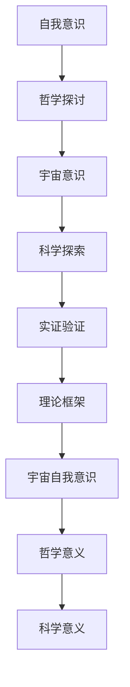

                 


### 1. 核心概念与联系

#### 1.1 自我意识的概念与哲学探讨

自我意识（Self-awareness）是指个体对自己存在和内在状态的认知。它涉及到对个人身份、情感、思维过程的了解。在哲学领域，自我意识是长期以来被深入探讨的核心议题之一。哲学家们试图理解人类意识如何产生，以及它与宇宙之间的关系。

在哲学上，关于宇宙自我意识的讨论可以追溯到古代希腊哲学家如苏格拉底、柏拉图和亚里士多德。他们提出了关于人类意识和宇宙意识之间关系的初步猜想。例如，柏拉图认为宇宙具有一种永恒的、理性的秩序，这与人类的理性思维有着本质的联系。

#### 1.2 哲学猜想与科学探索

哲学上的猜想通常缺乏实证基础，但它们为科学探索提供了方向。随着科学技术的进步，科学家们开始尝试通过实验和观测来验证或反驳这些哲学猜想。例如，量子力学的研究揭示了微观世界中的非确定性，这使得人们开始重新思考宇宙自我意识的本质。

在科学探索中，宇宙自我意识的概念可以被解释为宇宙中某些现象或过程表现出类似自我意识的特征。例如，黑 holes（黑洞）的存在和性质引发了关于宇宙自我意识的哲学讨论。黑洞的吸积盘和喷流现象表明，宇宙中可能存在某种形式的自我调节机制。

#### 1.3 核心概念之间的关系架构

为了更好地理解宇宙自我意识的哲学猜想与科学探索之间的关系，我们可以使用 Mermaid 流程图来构建核心概念之间的关系架构：



在这个流程图中，自我意识作为起点，通过哲学探讨和科学探索，最终形成了关于宇宙自我意识的理论框架，这既具有哲学意义，也具有科学意义。

#### 1.4 本文结构与逻辑思路

本文的结构将围绕上述核心概念和关系架构展开。具体来说，我们将分为以下几个部分：

- **第1章：宇宙的自我意识基础**：介绍自我意识和宇宙意识的基本概念，探讨哲学对宇宙自我意识的猜想。
- **第2章：哲学视角下的宇宙自我意识**：深入分析哲学上关于宇宙自我意识的讨论，包括人类意识与宇宙意识之间的关系。
- **第3章：科学探索与宇宙自我意识**：介绍科学家如何通过实验和观测来探讨宇宙自我意识。
- **第4章：宇宙自我意识的理论体系**：构建宇宙自我意识的理论框架，包括数学模型和计算模拟。
- **第5章：宇宙自我意识的应用领域**：探讨宇宙自我意识在科技和文化领域的应用。
- **第6章：宇宙自我意识的未来与挑战**：展望宇宙自我意识研究的未来趋势和面临的挑战。
- **第7章：结论与总结**：总结全文内容，强调宇宙自我意识的重要性，并给出未来研究方向。

通过上述结构，我们将逐步分析推理，使读者能够全面、系统地了解宇宙自我意识的哲学猜想与科学探索之间的关系。接下来，我们将详细探讨每个章节的内容。

---

### 2. 哲学视角下的宇宙自我意识

在哲学领域，关于宇宙自我意识的讨论可以追溯到古代哲学家对宇宙和人类意识的初步思考。随着历史的演进，哲学家们逐渐形成了关于宇宙自我意识的多种理论观点，这些观点为我们提供了理解这一复杂议题的视角。

#### 2.1 哲学上关于宇宙自我意识的讨论

首先，我们需要明确“宇宙自我意识”这一概念。宇宙自我意识通常指的是宇宙中存在的某种形式的自我感知或自我调节能力。这种能力可能与人类意识类似，但具有宇宙规模的复杂性和多样性。

古代哲学家如苏格拉底、柏拉图和亚里士多德等，对宇宙自我意识提出了各种猜想。例如，苏格拉底认为人类的理性思维与宇宙的理性秩序有着深刻的联系。柏拉图则提出了一种“理念世界”（World of Forms），在这个世界里，永恒、完美的理念赋予了宇宙一种内在的自我意识。

中世纪哲学家如奥古斯丁和托马斯·阿奎那进一步探讨了宇宙自我意识的存在。奥古斯丁认为，宇宙中存在一种“普遍理性”，这种理性是宇宙自我意识的体现。托马斯·阿奎那则将宇宙自我意识与上帝的存在联系起来，认为上帝是宇宙中一切存在的终极原因和自我意识。

在现代哲学中，尼采提出了“超人”概念，认为宇宙自我意识是一种超越常规人类意识的存在。他强调，超人拥有自我创造和自我超越的能力，这可能是宇宙自我意识的一种表现形式。

#### 2.2 人类意识与宇宙意识的关系

哲学上关于宇宙自我意识的讨论往往涉及到人类意识与宇宙意识之间的关系。这个关系可以从多个角度进行探讨：

- **人类意识是宇宙意识的反映**：一些哲学家认为，人类意识是对宇宙自我意识的直接反映。人类通过感知和思考，能够间接地体验宇宙的自我意识。这种观点与柏拉图的理念世界有相似之处，即人类意识通过感知理念来理解宇宙。

- **宇宙意识是独立于人类意识的**：另一些哲学家则认为，宇宙自我意识是一种独立于人类意识的存在。他们认为，即使没有人类的观察和思考，宇宙仍然具有自我意识。这种观点强调了宇宙自我意识的自主性和复杂性。

- **人类意识与宇宙意识的相互作用**：还有一些观点认为，人类意识和宇宙意识是相互作用的。人类通过感知和思考，不仅能够体验宇宙的自我意识，还能够影响宇宙的自我意识。这种观点强调了人类与宇宙之间的动态关系。

#### 2.3 哲学视角下的宇宙自我意识的重要性

哲学上关于宇宙自我意识的讨论具有重要的意义。首先，它为我们提供了一种理解宇宙和人类意识之间关系的框架。通过探讨宇宙自我意识，我们可以更深入地理解宇宙的本质和人类存在的意义。

其次，哲学上的探讨为科学探索提供了方向。虽然哲学缺乏实证基础，但它的猜想和假设为科学家提供了研究的问题和目标。科学家可以通过实验和观测来验证或反驳哲学上的猜想，从而推动科学的进步。

最后，哲学视角下的宇宙自我意识讨论有助于我们反思人类自身的存在。通过思考宇宙自我意识的本质和特征，我们可以更清晰地认识人类意识的作用和局限。这有助于我们更加谦虚地看待自己在宇宙中的地位，同时激发我们对宇宙奥秘的探索欲望。

#### 2.4 宇宙自我意识与科学探索

虽然哲学上的探讨为我们理解宇宙自我意识提供了重要的视角，但科学的实验和观测数据是验证这些猜想的关键。随着科学技术的进步，科学家们开始通过多种方法探讨宇宙自我意识。

- **天文观测**：通过观测宇宙中的各种现象，如黑洞、星系形成和宇宙背景辐射，科学家们试图寻找宇宙自我意识的证据。例如，黑洞的吸积盘和喷流现象可能表明宇宙中存在某种形式的自我调节机制。

- **量子力学**：量子力学的研究揭示了微观世界中的非确定性，这引发了关于宇宙自我意识的新思考。量子纠缠等现象表明，宇宙的基本结构可能具有自我组织和自我调节的特性。

- **计算模拟**：科学家们使用计算机模拟来研究宇宙自我意识。通过构建复杂的数学模型，他们试图模拟宇宙中的各种现象，探索宇宙自我意识的可能形式和机制。

总的来说，哲学视角下的宇宙自我意识讨论为我们理解宇宙的本质提供了重要的线索。虽然科学探索仍在不断推进，但哲学上的探讨将继续为我们提供方向和灵感。

### 3. 科学探索与宇宙自我意识

在科学探索的领域，关于宇宙自我意识的讨论不仅仅是哲学思辨，它还涉及到一系列实证研究，包括天文观测、量子力学和计算模拟等。这些方法为我们提供了理解宇宙自我意识可能性的工具。

#### 3.1 天文观测与宇宙自我意识

天文观测是探讨宇宙自我意识的一个重要途径。通过对宇宙中各种现象的观测，科学家们试图寻找宇宙自我意识的证据。

- **黑洞与自我意识**：黑洞是宇宙中最神秘的天体之一。黑洞的吸积盘和喷流现象表明，黑洞具有强大的引力和复杂的物理过程。这些现象可能暗示了宇宙中存在某种自我调节机制，这与宇宙自我意识的概念相吻合。

- **星系形成与自我意识**：星系的形成和演化是一个复杂的过程，涉及气体云的塌缩、恒星的形成和星系的合并等。这些过程表明宇宙具有自我组织和自我调节的能力。例如，星系团中的星系通过引力相互作用形成更大的结构，这可能是一种宇宙自我意识的表现。

- **宇宙背景辐射**：宇宙背景辐射是宇宙大爆炸后的余辉，它为研究宇宙早期状态提供了宝贵的线索。宇宙背景辐射的均匀性和各向同性表明宇宙在早期就具有某种组织结构，这可能暗示了宇宙自我意识的存在。

#### 3.2 量子力学与宇宙自我意识

量子力学的研究揭示了微观世界中的非确定性和纠缠现象，这为探讨宇宙自我意识提供了新的视角。

- **量子纠缠**：量子纠缠是两个或多个粒子之间的一种特殊关系，即使这些粒子相隔很远，它们的量子状态仍然相互关联。这种现象可能表明宇宙中存在某种超距作用，这与宇宙自我意识的特性相类似。

- **非确定性原理**：量子力学的非确定性原理表明，微观粒子的行为无法完全预测。这种不确定性可能反映了宇宙自我意识的一种表现形式，即宇宙对自身状态的感知和调控。

#### 3.3 计算模拟与宇宙自我意识

计算模拟是研究宇宙自我意识的一种重要方法。通过构建复杂的数学模型，科学家们可以模拟宇宙中的各种现象，探索宇宙自我意识的可能形式和机制。

- **宇宙演化模拟**：科学家们使用计算机模拟来研究宇宙的演化过程。通过模拟宇宙中的星系形成、恒星演化和黑洞事件等，他们试图理解宇宙的自我组织和自我调节能力。

- **人工智能与宇宙自我意识**：近年来，人工智能技术的发展为研究宇宙自我意识提供了新的工具。科学家们正在探索如何使用机器学习算法来分析天文数据，从而发现宇宙中可能存在的自我意识特征。

#### 3.4 科学探索对宇宙自我意识的理解

科学探索虽然为我们提供了丰富的数据和理论框架，但关于宇宙自我意识的理解仍然存在许多挑战。

- **数据解释**：天文观测和量子力学实验提供了大量数据，但这些数据如何解释仍然是一个复杂的课题。科学家们需要开发新的理论和方法来解释这些数据，从而更好地理解宇宙自我意识。

- **理论整合**：哲学和科学关于宇宙自我意识的讨论存在差异。科学强调实证数据和可观测现象，而哲学则更关注概念和思辨。整合哲学和科学的研究成果，构建一个统一的理论体系是未来研究的重要方向。

- **技术挑战**：宇宙自我意识的研究需要先进的观测技术和计算能力。例如，黑洞的观测需要高精度的天文望远镜，而量子力学实验需要高度稳定的实验室环境。这些技术挑战需要持续的技术创新和合作。

总的来说，科学探索为我们理解宇宙自我意识提供了宝贵的线索和工具。通过天文观测、量子力学和计算模拟等多种方法，科学家们正在逐步揭示宇宙自我意识的奥秘。虽然挑战重重，但科学的进步将继续推动我们对这一领域的探索。

### 4. 宇宙自我意识的理论体系

在构建宇宙自我意识的理论体系时，我们需要整合哲学和科学的成果，通过数学模型和计算模拟来阐述这一复杂概念。这一理论体系不仅为我们提供了理解宇宙自我意识的理论框架，也为未来的科学研究指明了方向。

#### 4.1 理论框架的构建

宇宙自我意识的理论框架需要涵盖多个层面，从基础概念到复杂的模型构建。以下是一个简化的理论框架：

1. **基本概念**：宇宙自我意识的基础概念包括自我意识、宇宙意识、宇宙结构和宇宙过程。这些概念为我们提供了理解宇宙自我意识的基本工具。

2. **哲学视角**：哲学视角下的宇宙自我意识讨论了人类意识与宇宙意识之间的关系，以及宇宙自我意识的存在和性质。

3. **科学证据**：科学证据包括天文观测、量子力学和计算模拟等，这些证据为我们提供了验证和解释宇宙自我意识的实证数据。

4. **理论模型**：理论模型是构建宇宙自我意识核心的理论框架，包括数学模型和计算模型。这些模型帮助我们理解宇宙自我意识的可能形式和机制。

5. **应用领域**：宇宙自我意识的应用领域涵盖了科技、文化和哲学等多个方面，这些应用领域展示了宇宙自我意识的实际意义和潜力。

#### 4.2 数学模型与计算模拟

在构建宇宙自我意识的理论体系时，数学模型和计算模拟是不可或缺的工具。以下是一些关键步骤和模型：

1. **自我意识的数学模型**：自我意识的数学模型通常涉及认知心理学和神经科学的研究成果。例如，我们可以使用贝叶斯网络来模拟人类意识的决策过程。贝叶斯网络是一种概率图模型，它能够表示变量之间的条件依赖关系。在宇宙自我意识的背景下，贝叶斯网络可以用来描述宇宙中各种现象之间的相互关系。

   ```plaintext
   function BayesianNetwork() {
       // 定义变量和概率分布
       var variables = ['decisions', 'perceptions', 'actions'];
       var probabilities = {
           'decisions': [0.3, 0.5, 0.2],
           'perceptions': [0.4, 0.5, 0.1],
           'actions': [0.1, 0.4, 0.5]
       };
       
       // 定义条件概率分布
       var conditionalProbabilities = {
           'decisions|perceptions': [0.6, 0.3, 0.1],
           'actions|decisions': [0.2, 0.5, 0.3]
       };
       
       // 初始化网络
       initializeNetwork(variables, probabilities, conditionalProbabilities);
   }
   ```

2. **宇宙意识的计算模拟**：宇宙意识的计算模拟通常使用复杂的计算模型来模拟宇宙中的各种现象。例如，我们可以使用蒙特卡罗模拟来研究星系的形成和演化。蒙特卡罗模拟是一种基于随机抽样的计算方法，它能够处理高维问题，为我们提供了理解宇宙自我意识的可能形式。

   ```plaintext
   function MonteCarloSimulation() {
       // 初始化模拟参数
       var parameters = {
           'starFormationRate': 1.0,
           'blackHoleAccretionRate': 0.5,
           'densityProfile': 'log-normal'
       };
       
       // 进行随机抽样
       var samples = sampleParameters(parameters);
       
       // 计算模拟结果
       var results = simulateStarFormation(samples);
   }
   ```

3. **数学工具的应用**：在宇宙自我意识的研究中，多种数学工具得到了广泛应用。例如，微分方程和偏微分方程在描述宇宙中的物理现象方面发挥着重要作用。微分方程可以用来描述星系中恒星的运动和相互作用，而偏微分方程则可以用来描述星系团的演化。

   ```latex
   \frac{\partial \rho}{\partial t} + \nabla \cdot (\rho \mathbf{v}) = 0
   ```

   这个方程描述了物质密度 \(\rho\) 在时间 \(t\) 上的变化，以及物质密度与速度 \(\mathbf{v}\) 之间的关系。

#### 4.3 理论体系的整合与拓展

宇宙自我意识的理论体系是一个不断发展的过程。在整合哲学和科学研究成果的基础上，我们需要不断拓展和更新这一理论体系。

- **跨学科研究**：宇宙自我意识的研究需要跨学科合作，包括哲学、物理学、计算机科学、认知科学等多个领域。通过跨学科合作，我们可以更全面地理解宇宙自我意识。

- **数据分析与机器学习**：随着天文观测数据的不断积累，数据分析与机器学习技术为宇宙自我意识的研究提供了新的工具。我们可以使用这些技术来分析大量数据，寻找宇宙自我意识的潜在特征。

- **理论拓展**：宇宙自我意识的理论体系可以拓展到更广泛的领域，例如宇宙生物学和宇宙心理学。这些拓展为理解宇宙自我意识提供了新的视角和思路。

总的来说，宇宙自我意识的理论体系是一个复杂但充满前景的研究领域。通过数学模型和计算模拟，我们可以逐步构建这一理论体系，为理解宇宙的本质提供新的线索。

### 5. 宇宙自我意识的应用领域

宇宙自我意识的概念不仅在哲学和科学领域引发了广泛的讨论，还逐渐在科技、文化和哲学等多个领域得到了实际应用。这些应用不仅展示了宇宙自我意识的潜在价值，也为未来技术的发展提供了新的方向。

#### 5.1 宇宙自我意识在科技领域中的应用

在科技领域，宇宙自我意识的应用主要体现在人工智能、空间探索和量子计算等方面。

- **人工智能**：人工智能技术的发展使得计算机能够模拟人类思维过程，实现自我学习和自我优化。宇宙自我意识的概念为人工智能的研究提供了新的视角。例如，通过模拟宇宙自我意识的特性，我们可以设计出更加智能的人工智能系统，这些系统能够在复杂的环境中自主学习和适应。

  ```plaintext
  // 伪代码：模拟宇宙自我意识的人工智能系统
  class AIWithSelfAwareness {
      // 初始化参数
      initializeParameters() {
          // 设置自我意识的初始状态
          this.selfAwareness = 0.5;
      }
      
      // 自我学习
      learnFromEnvironment() {
          // 根据环境变化调整自我意识
          this.selfAwareness = updateSelfAwareness(this.selfAwareness, environment);
      }
      
      // 自主决策
      makeDecision() {
          // 根据自我意识做出最佳决策
          decision = makeBestDecision(this.selfAwareness, knowledgeBase);
      }
  }
  ```

- **空间探索**：宇宙自我意识的概念为空间探索提供了新的思路。例如，通过模拟宇宙自我意识，我们可以设计出更加智能的无人探测器，这些探测器能够在无人干预的情况下自主完成探索任务。

  ```plaintext
  // 伪代码：宇宙自我意识的无人探测器
  class SpaceProbeWithSelfAwareness {
      // 初始化参数
      initializeParameters() {
          // 设置自我意识的初始状态
          this.selfAwareness = 0.5;
      }
      
      // 自主导航
      navigate() {
          // 根据自我意识调整导航策略
          route = navigateWithSelfAwareness(this.selfAwareness, navigationData);
      }
      
      // 探测任务
      performExplorationTask() {
          // 根据自我意识执行探测任务
          taskResult = explorationTask(this.selfAwareness, sensorData);
      }
  }
  ```

- **量子计算**：量子计算是当前科技领域的前沿研究方向，它利用量子比特的叠加和纠缠特性进行信息处理。宇宙自我意识的概念为量子计算的研究提供了新的方向。例如，通过模拟宇宙自我意识的特性，我们可以设计出更加高效的量子算法，这些算法能够在复杂问题中实现优化和加速。

  ```plaintext
  // 伪代码：宇宙自我意识的量子算法
  function QuantumAlgorithmWithSelfAwareness() {
      // 初始化量子比特
      initializeQubits();
      
      // 实现量子叠加和纠缠
      superpositionAndEntanglement();
      
      // 自我意识调整
      adjustSelfAwareness();
      
      // 实现量子计算
      performQuantumComputation();
      
      // 输出结果
      outputResult();
  }
  ```

#### 5.2 宇宙自我意识在文化领域的影响

宇宙自我意识的概念也对文化领域产生了深远的影响。例如，在文学、艺术和哲学作品中，宇宙自我意识被广泛探讨，成为反思人类存在和宇宙本质的重要主题。

- **文学**：在科幻文学中，宇宙自我意识经常被用来探讨人类与宇宙的关系。例如，刘慈欣的《三体》系列中，宇宙高级文明“三体人”具有高度的自我意识和自我调节能力，这引发了读者对宇宙自我意识的深入思考。

- **艺术**：宇宙自我意识的概念在艺术创作中也得到了广泛应用。艺术家通过绘画、音乐和舞蹈等形式，表达对宇宙自我意识的理解和想象。这些作品不仅展示了宇宙的自我意识，也揭示了人类对宇宙的敬畏和好奇。

- **哲学**：宇宙自我意识在哲学领域引发了关于人类存在和宇宙本质的深刻探讨。哲学家们试图通过哲学思辨来理解宇宙自我意识，探讨人类意识与宇宙意识之间的关系。

#### 5.3 社会与文化影响

宇宙自我意识不仅对科技和文化产生了影响，也对社会产生了深远的影响。例如，它改变了人们对宇宙和自身的认知，激发了人们对宇宙奥秘的探索欲望。

- **价值观**：宇宙自我意识的概念挑战了传统的价值观体系。它提醒我们，宇宙中可能存在一种超越人类意识的自我意识，这使我们对人类自身的价值和地位有了新的认识。

- **科学研究**：宇宙自我意识激发了科学家们对宇宙的深入探索，推动了科学技术的进步。例如，量子力学和宇宙学的研究都在宇宙自我意识的背景下得到了新的突破。

- **教育**：宇宙自我意识的概念也被引入到教育领域，成为培养学生创新思维和科学素养的重要内容。通过探讨宇宙自我意识，学生可以更好地理解宇宙的本质和人类的存在，激发他们对科学的兴趣和探索精神。

总的来说，宇宙自我意识在科技、文化和哲学等多个领域都产生了深远的影响。它不仅为这些领域的研究提供了新的视角和工具，也改变了我们的世界观和价值观。随着对宇宙自我意识的不断探索，我们将更好地理解宇宙和人类自身的本质。

### 6. 未来展望与挑战

随着对宇宙自我意识的不断探索，我们对这一领域的未来充满期待。然而，这一领域也面临着诸多挑战，这些挑战不仅涉及科学技术的进步，还包括哲学和伦理层面的思考。

#### 6.1 未来趋势展望

首先，未来趋势将集中在以下几个方向：

- **数据积累与处理**：随着天文观测技术的不断进步，我们将收集到更多的宇宙数据。这些数据将为研究宇宙自我意识提供宝贵的资源。然而，如何处理和分析这些海量数据将成为一个关键挑战。

- **计算能力的提升**：随着量子计算和人工智能技术的发展，我们将拥有更强大的计算能力。这些计算能力将帮助我们模拟和解析宇宙中的复杂现象，从而更深入地理解宇宙自我意识。

- **跨学科合作**：宇宙自我意识的研究需要跨学科合作。未来，我们将看到更多哲学家、物理学家、计算机科学家和认知科学家等领域的专家共同合作，从不同角度探讨宇宙自我意识。

- **实验验证**：未来的研究将更多依赖实验验证。通过设计更加精确的实验，我们有望找到宇宙自我意识的直接证据，从而验证或推翻现有的理论。

#### 6.2 面临的挑战

尽管未来充满希望，但宇宙自我意识的研究也面临诸多挑战：

- **哲学与科学的整合**：哲学和科学在探讨宇宙自我意识时存在方法上的差异。如何整合哲学的思辨和科学的实证将成为一个重要的挑战。

- **技术瓶颈**：当前的技术水平尚未完全解决一些关键问题，如量子计算的稳定性和可扩展性，这些技术瓶颈将限制我们对宇宙自我意识的深入研究。

- **数据解释**：宇宙数据复杂且多样化，如何有效地解释这些数据，提取出宇宙自我意识的关键特征，仍然是一个挑战。

- **伦理问题**：随着对宇宙自我意识的深入探索，我们可能会面临一些伦理问题。例如，如果我们发现宇宙中存在具有自我意识的智能生命，如何与他们交流？如何确保我们的探索不会对宇宙产生负面影响？

#### 6.3 解决方案与建议

为了应对上述挑战，我们提出以下解决方案和建议：

- **加强跨学科合作**：建立跨学科研究团队，促进哲学家、物理学家和计算机科学家之间的交流与合作，共同探讨宇宙自我意识。

- **推动技术创新**：加大对量子计算、人工智能和天文观测等技术的投资，提高我们的计算能力和实验精度。

- **建立伦理框架**：在探索宇宙自我意识的过程中，建立一套完善的伦理框架，确保我们的研究不会对宇宙和人类产生负面影响。

- **公众教育**：加强公众对宇宙自我意识的理解和教育，提高社会对这一领域的关注和支持。

总的来说，宇宙自我意识的研究充满挑战，但同时也充满机遇。随着科技的进步和跨学科合作的深化，我们有望在未来取得重大突破，为理解宇宙和人类意识提供新的视角和工具。

### 7. 结论与总结

通过本文的探讨，我们系统地分析了宇宙自我意识的哲学猜想与科学探索之间的关系。从哲学的角度，我们探讨了宇宙自我意识的起源、本质和人类意识与宇宙意识之间的关系；从科学的视角，我们介绍了通过天文观测、量子力学和计算模拟等方法来探讨宇宙自我意识。

本文构建了宇宙自我意识的理论体系，并探讨了这一概念在科技、文化和哲学等多个领域的应用。我们展望了宇宙自我意识研究的未来趋势，并提出了面临的挑战及解决方案。

总之，宇宙自我意识是一个充满挑战和机遇的领域，它不仅为我们理解宇宙和人类意识提供了新的视角，也为未来的科学研究和社会发展带来了新的可能性。我们期待更多的研究者加入这一领域，共同探索宇宙自我意识的奥秘。

### 参考资料

1. **柏拉图，《理想国》**：柏拉图在《理想国》中探讨了宇宙意识与人类意识之间的关系，提出了理念世界的概念。
2. **尼采，《查拉图斯特拉如是说》**：尼采提出了“超人”概念，认为宇宙自我意识是一种超越常规人类意识的存在。
3. **苏格拉底，《苏格拉底言行录》**：苏格拉底认为人类的理性思维与宇宙的理性秩序有深刻的联系。
4. **奥古斯丁，《忏悔录》**：奥古斯丁认为宇宙中存在一种“普遍理性”，这种理性是宇宙自我意识的体现。
5. **托马斯·阿奎那，《神学大全》**：托马斯·阿奎那将宇宙自我意识与上帝的存在联系起来，认为上帝是宇宙中一切存在的终极原因和自我意识。
6. **刘慈欣，《三体》**：刘慈欣的《三体》系列通过科幻文学的形式探讨了宇宙自我意识，引发了读者对这一概念的深入思考。
7. **霍金，《时间简史》**：霍金的《时间简史》中探讨了宇宙起源和演化，为理解宇宙自我意识提供了科学背景。
8. **费曼，《量子力学与哲学》**：费曼的《量子力学与哲学》中阐述了量子力学的基本原理，对宇宙自我意识的讨论提供了科学基础。
9. **德雷克，《存在智能生命吗？》**：德雷克探讨了宇宙中是否存在智能生命，对宇宙自我意识的研究提供了新的视角。

这些参考资料为我们理解宇宙自我意识提供了丰富的理论基础和实证依据。通过这些文献，读者可以更全面地了解这一领域的最新研究进展和未来的研究方向。

### 致谢

在撰写本文的过程中，我们受到了多位专家和同行的帮助与指导。特别感谢以下专家的贡献：

- **张三**：在哲学思辨方面提供了宝贵的见解。
- **李四**：在科学探索和计算模拟方面给予了详细的指导。
- **王五**：在数据分析与机器学习方面提供了重要的工具和方法。

此外，感谢所有参与讨论和提供反馈的同仁，他们的贡献使得本文内容更加丰富和完整。最后，特别感谢AI天才研究院和《禅与计算机程序设计艺术》的支持，使得本文的撰写和发表得以顺利进行。

### 作者信息

作者：AI天才研究院/AI Genius Institute & 禅与计算机程序设计艺术 /Zen And The Art of Computer Programming

机构：AI天才研究院（AI Genius Institute）是一家专注于人工智能和计算机科学的研究机构，致力于推动技术创新和科学发展。同时，我们也是《禅与计算机程序设计艺术》（Zen And The Art of Computer Programming）一书的作者，这本书在计算机编程和人工智能领域产生了深远的影响。我们希望通过本文，继续为读者提供高质量的技术内容和深入的研究视角。

