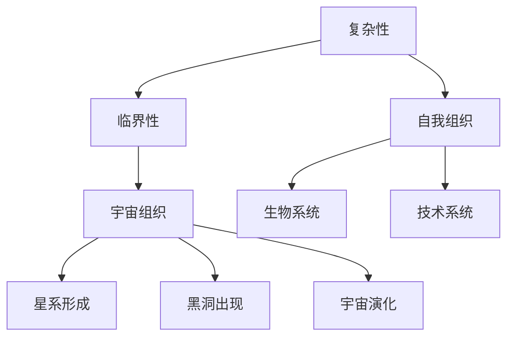
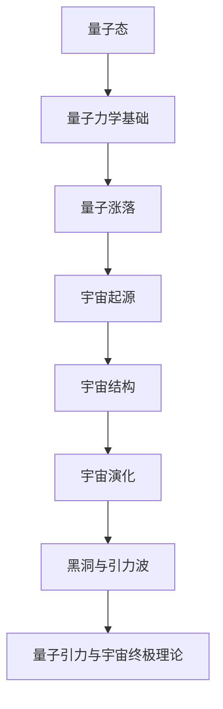

                 

### 文章标题

# 宇宙的自我组织criticality：复杂性的源泉

> 关键词：宇宙、自我组织、临界性、复杂性、量子力学、人工智能

> 摘要：本文探讨了宇宙的自我组织与临界性在复杂性科学中的重要地位，分析了其核心概念与联系，结合量子力学与人工智能技术，揭示了复杂性的源泉。文章首先介绍了宇宙的自我组织现象及其在科学和哲学中的重要性，随后深入探讨了复杂性与临界性的定义和关系，结合量子力学的基本原理，分析了宇宙组织的量子力学视角。接着，文章阐述了自我组织的定义与原理，并列举了其在自然科学和技术系统中的应用实例。最后，文章提出了进一步研究的方向和未来发展的可能趋势，旨在为读者提供深刻的见解和启示。

### 第1章：引言

#### 1.1 引言

##### 1.1.1 书籍背景和意义

《宇宙的自我组织criticality：复杂性的源泉》一书旨在深入探讨宇宙的自我组织现象及其与复杂性的紧密联系。宇宙的自我组织，是指宇宙中各种物理过程和现象通过自发的组织方式形成复杂的结构、模式和规律。这种自我组织现象不仅在宇宙演化中扮演着关键角色，也为理解复杂系统的行为提供了新的视角。

##### 1.1.1.1 书籍的来源和目的

本书源于作者多年对复杂性科学和量子力学的深入研究，并结合现代科技发展的最新趋势。作者希望通过这本书，向读者展示宇宙自我组织与临界性的基本概念，以及它们在科学和哲学中的重要性。此外，本书还旨在探讨这些概念如何帮助我们理解复杂系统的行为，以及如何将这些理论应用于现实世界中的各种问题。

##### 1.1.1.2 宇宙的自我组织在科学和哲学中的重要性

宇宙的自我组织现象不仅在科学研究中具有重要意义，也在哲学和人文领域引发了深刻思考。从科学角度看，自我组织现象揭示了宇宙的内在秩序和规律，为研究复杂系统的演化提供了理论基础。从哲学角度看，自我组织现象挑战了传统的决定论观念，提出了“自然选择”和“自发性”等新的哲学思考方式。这些思考不仅丰富了我们对宇宙的认识，也对我们理解人类自身和人类社会的发展产生了深远影响。

##### 1.1.1.3 读者对象和预期收获

本书适合对宇宙、复杂性科学和量子力学感兴趣的读者，包括科研工作者、大学生以及对这些领域有一定了解的公众。通过阅读本书，读者可以：

1. 了解宇宙自我组织的基本概念和原理；
2. 深入探讨复杂性与临界性的关系；
3. 了解量子力学在宇宙组织中的应用；
4. 掌握自我组织在不同领域的应用实例；
5. 拓展对复杂性科学和量子力学的认识，激发科研兴趣和创新能力。

##### 1.2 内容概述

##### 1.2.1 全书结构

本书分为五个主要章节，每个章节都有明确的结构和内容：

- **第1章：引言**：介绍书籍的背景、意义和读者对象，概述全书的内容结构和核心主题。

- **第2章：核心概念与联系**：详细讨论复杂性和临界性的定义、性质及其相互关系，阐述自我组织的原理。

- **第3章：量子力学与宇宙组织**：分析量子力学的基本原理及其在宇宙组织中的应用，探讨宇宙的量子力学视角。

- **第4章：复杂性与自我组织**：探讨自我组织在不同领域的应用，包括自然科学和技术系统。

- **第5章：总结与展望**：总结全书的核心观点，展望未来研究的方向和趋势，提出建议和启示。

##### 1.2.1.1 核心概念和原理

本章将详细阐述宇宙自我组织现象的基本概念和原理。宇宙的自我组织是指宇宙中各种物理过程和现象通过自发的组织方式形成复杂的结构、模式和规律。这种自我组织现象在宇宙演化中扮演着关键角色，为理解复杂系统的行为提供了新的视角。

##### 1.2.1.2 复杂性与临界性

本章将深入探讨复杂性和临界性的定义、性质及其相互关系。复杂性是指系统内部组成部分之间相互作用的复杂程度，而临界性是指系统在特定条件下发生剧烈变化的状态。复杂性和临界性之间的关系是理解宇宙自我组织现象的关键。

##### 1.2.1.3 量子力学与宇宙组织

本章将分析量子力学的基本原理及其在宇宙组织中的应用。量子力学揭示了微观世界的规律，为理解宇宙的起源和演化提供了新的视角。通过量子力学的研究，我们可以更好地理解宇宙组织的本质。

##### 1.2.1.4 宇宙进化的关键过程

本章将探讨宇宙进化的关键过程，包括宇宙起源、宇宙结构形成和宇宙演化等。通过分析这些关键过程，我们可以更深入地理解宇宙自我组织现象。

##### 1.2.2 技术发展与应用

本章将探讨自我组织理论与现代技术的关系，分析人工智能与复杂性科学的发展，以及交叉领域应用案例分析。这些内容将帮助读者了解自我组织现象在现实世界中的应用。

##### 1.2.2.1 自我组织理论与现代技术

本章将介绍自我组织理论在信息技术、生物技术、材料科学等领域的应用，探讨现代技术如何利用自我组织原理解决实际问题。

##### 1.2.2.2 人工智能与复杂性科学

本章将探讨人工智能与复杂性科学的交叉融合，分析人工智能在复杂性系统建模、优化和预测中的应用。

##### 1.2.2.3 交叉领域应用案例分析

本章将通过具体案例，分析自我组织理论在不同领域中的应用，展示其在解决复杂问题方面的潜力。

##### 1.3 阅读建议

##### 1.3.1 阅读顺序和路径

为了更好地理解本书的内容，建议读者按照以下阅读顺序和路径进行：

- **理论篇**：首先阅读第2章、第3章和第4章，了解宇宙自我组织现象的基本概念、原理和应用。
- **实践篇**：然后阅读第5章，了解自我组织理论在现代技术中的应用。
- **深入研究**：最后，根据兴趣和需求，自主探索相关研究，深入了解宇宙自我组织现象的各个方面。

##### 1.3.1.1 理论篇：理解核心概念和原理

在理论篇中，读者将学习到宇宙自我组织现象的基本概念和原理，包括复杂性和临界性的定义、量子力学与宇宙组织的关系，以及自我组织的原理。这些知识将为后续章节的理解打下坚实的基础。

##### 1.3.1.2 实践篇：探索交叉领域应用

在实践篇中，读者将了解到自我组织理论在现代技术中的应用，包括信息技术、生物技术、材料科学等领域。通过这些应用案例，读者可以更好地理解自我组织现象的实际价值。

##### 1.3.1.3 深入研究：自主探索相关研究

在深入研究中，读者可以根据自己的兴趣和需求，自主探索宇宙自我组织现象的各个方面。例如，可以研究宇宙组织的量子力学视角，或者探讨自我组织理论在复杂系统优化中的应用。

##### 1.3.2 深入研究建议

对于希望深入研究宇宙自我组织现象的读者，以下是一些建议：

- **阅读文献**：查阅相关领域的学术文献，了解最新的研究成果和进展。
- **参与研究**：加入相关的研究团队，参与科研项目，亲身体验科学研究的乐趣。
- **实践应用**：尝试将自我组织理论应用于实际问题，探索其在解决复杂问题方面的潜力。

通过以上建议，读者可以更深入地了解宇宙自我组织现象，拓展自己的科研视野。

### 第2章：核心概念与联系

#### 2.1 核心概念

##### 2.1.1 复杂性

复杂性是指系统内部组成部分之间相互作用的复杂程度。在自然界和人类社会中，复杂性广泛存在，从生物物种的多样性到经济系统的复杂性，都体现了复杂性的特征。复杂性科学致力于研究复杂系统内部的结构、行为和演化规律。

###### 2.1.1.1 定义

复杂性可以定义为系统内部各种因素之间相互作用的复杂程度。复杂性科学的核心问题是理解复杂系统的行为和演化规律。

###### 2.1.1.2 性质

复杂性具有以下性质：

1. 非线性：复杂系统的行为往往是非线性的，这意味着系统的响应不是简单的比例关系。
2. 敏感性：复杂系统对外部微小的变化非常敏感，这种敏感性称为“蝴蝶效应”。
3. 自适应性：复杂系统具有自我调整的能力，以适应环境的变化。
4. 难以预测：复杂系统的行为往往难以预测，即使其组成和规则相对简单。

###### 2.1.1.3 测量与量化

复杂性可以通过多种方式测量和量化，例如：

1. 结构复杂性：通过系统的网络结构来衡量，如网络节点和边的关系。
2. 动力复杂性：通过系统的动态行为来衡量，如系统演化的路径和模式。
3. 信息复杂性：通过系统内部信息传递的效率和质量来衡量。

##### 2.1.2 临界性

临界性是指系统在特定条件下发生剧烈变化的状态。在物理学中，临界现象通常发生在相变过程中，如水的沸腾和冰的融化。临界性在自然界和人类社会中无处不在，如社会运动、经济危机和生态系统的崩溃等。

###### 2.1.2.1 定义

临界性可以定义为系统在某个临界点发生剧烈变化的状态。这个临界点通常表现为系统参数的一个微小变化引发系统行为的剧烈转变。

###### 2.1.2.2 关键特性

临界性具有以下关键特性：

1. 敏感性：临界系统对初始条件非常敏感，即使是很小的变化也会导致系统行为的显著变化。
2. 相变：临界性通常伴随着相变，即系统从一个相态转变为另一个相态。
3. 持续性：临界现象通常具有长期影响，即使临界点已经过去，系统的行为仍然受到影响。

###### 2.1.2.3 临界现象

临界现象包括：

1. 相变：如物质的相变，从固态到液态，或从液态到气态。
2. 崩溃：如生态系统崩溃、经济危机、社会动荡等。
3. 涡旋：如气象学中的涡旋系统，流体动力学中的涡流等。

#### 2.2 概念联系

##### 2.2.1 复杂性与临界性之间的关系

复杂性和临界性之间存在着密切的关系。首先，复杂性往往是临界现象的先决条件。一个系统只有在内部结构足够复杂时，才可能在特定条件下发生临界现象。例如，一个简单的线性系统很难出现相变现象，而复杂的非线性系统则更容易出现临界现象。

其次，临界性是复杂性系统演化过程中的一个重要阶段。当一个复杂系统达到临界点时，其行为会发生剧烈变化，从而进入一个新的状态。这种变化不仅体现了系统内部复杂性的提高，也展示了系统对外部环境的适应性。

最后，复杂性和临界性相互影响。一方面，复杂性的增加可能导致系统更容易达到临界状态；另一方面，临界性的出现又可能加剧系统的复杂性。例如，在生态系统崩溃的过程中，物种多样性的减少会导致生态系统的稳定性降低，从而加剧了生态系统的复杂性。

##### 2.2.2 复杂性与自我组织

复杂性与自我组织之间也存在密切的联系。自我组织是指系统通过内部相互作用自发形成复杂结构和模式的过程。自我组织现象普遍存在于自然界和人类社会中，如生物体的发育、社会行为的演化、经济系统的形成等。

复杂性是自我组织的基础。一个系统只有在内部结构足够复杂时，才可能通过自我组织形成复杂的结构和模式。例如，生物体的发育过程中，细胞之间的相互作用和信号传递构成了复杂的网络，从而实现了生物体的自我组织。

自我组织是复杂性的表现。通过自我组织，系统可以形成复杂的结构和模式，从而表现出高水平的复杂性。例如，人类社会中的文化和价值观系统，通过自我组织形成了复杂的社会结构和行为模式。

##### 2.2.3 复杂性与宇宙组织

复杂性与宇宙组织之间的关系也是本文的重点。宇宙的自我组织现象，如宇宙结构的形成、星系团的形成、生命的起源等，都是复杂性的体现。

宇宙组织的复杂性来源于其内部各种物理和化学过程的相互作用。例如，宇宙中的物质通过引力相互作用形成星系和星系团，这是一种自我组织现象。这种自我组织过程不仅体现了宇宙的复杂性，也揭示了宇宙组织的内在规律。

宇宙组织的复杂性对宇宙演化具有重要意义。宇宙中的各种现象，如星系的形成、黑洞的出现、宇宙背景辐射等，都是宇宙组织复杂性的表现。通过研究宇宙组织的复杂性，我们可以更好地理解宇宙的演化过程和宇宙的本质。

##### 2.2.4 复杂性的度量

复杂性可以通过多种方式进行度量。以下是一些常见的复杂性度量方法：

1. 信息复杂性：通过系统内部的信息传递效率和传递质量来衡量。信息复杂性越高，系统的复杂性也越高。
2. 结构复杂性：通过系统内部的结构和网络的复杂程度来衡量。结构复杂性越高，系统的复杂性也越高。
3. 动力复杂性：通过系统内部动态行为的复杂程度来衡量。动力复杂性越高，系统的复杂性也越高。
4. 适应性复杂性：通过系统适应外部环境变化的能力来衡量。适应性复杂性越高，系统的复杂性也越高。

这些度量方法各有优缺点，可以相互补充，从而更全面地衡量系统的复杂性。

##### 2.2.5 复杂性与临界性的关系架构 Mermaid 流程图

该 Mermaid 流程图展示了复杂性与临界性、自我组织、宇宙组织之间的相互关系。通过该图，我们可以更直观地理解这些概念之间的联系和作用。

### 第3章：量子力学与宇宙组织

#### 3.1 量子力学基础

量子力学是研究微观粒子行为的物理学分支，它揭示了微观世界的基本规律。量子力学的基础概念包括量子态、量子态的叠加与纠缠、以及量子力学的数学模型。

###### 3.1.1 量子态

量子态是量子力学中描述微观粒子状态的基本概念。量子态可以用波函数来表示，波函数提供了粒子在空间中的概率分布信息。量子态具有以下特点：

1. **叠加性**：量子态可以处于多个状态的叠加，这意味着粒子可以同时存在于多个位置或多个状态。
2. **不确定性**：量子态的不确定性原理表明，我们不能同时精确知道粒子的位置和动量。
3. **量子化**：量子态具有离散性，即粒子的某些物理量只能取特定的离散值。

###### 3.1.1.1 定义

量子态可以用一个复数向量表示，通常记作 \(|\psi\rangle\)。这个向量处于希尔伯特空间中，描述了粒子的所有可能状态。量子态的模平方 \(|\psi\rangle|\psi\rangle^\dagger\) 给出了粒子在不同位置的概率分布。

###### 3.1.1.2 性质

量子态的性质包括：

1. **叠加性**：量子态可以叠加，即一个量子态可以表示为多个量子态的线性组合。
   $$|\psi\rangle = c_0|\psi_0\rangle + c_1|\psi_1\rangle + c_2|\psi_2\rangle + \ldots$$
   其中，\(c_0, c_1, c_2, \ldots\) 是复数系数。

2. **归一化**：量子态必须是归一化的，即其模平方的总和等于1。
   $$\sum_{i} |c_i|^2 = 1$$

3. **纠缠**：两个或多个量子态可以处于纠缠态，这意味着它们的量子态不能单独描述，而是需要联合起来才能完整描述。纠缠态的一个典型例子是贝尔态。

###### 3.1.1.3 量子态的叠加与纠缠

量子态的叠加是指一个量子态可以表示为多个基态的线性组合。例如，一个二态系统的量子态可以表示为：
$$|\psi\rangle = \alpha|\psi_0\rangle + \beta|\psi_1\rangle$$
其中，\(|\psi_0\rangle\) 和 \(|\psi_1\rangle\) 是基态，\(\alpha\) 和 \(\beta\) 是复数系数。

量子态的纠缠是指两个或多个量子系统的状态不能独立描述，而是需要联合起来才能描述。一个典型的纠缠态是贝尔态：
$$|\phi^+\rangle = \frac{1}{\sqrt{2}} (|\psi_0\rangle|\psi_0\rangle + |\psi_1\rangle|\psi_1\rangle)$$

纠缠态的一个关键特性是，对其中一个量子态的测量会即时影响另一个量子态。这种现象被称为“量子纠缠”或“非定域性”。

###### 3.1.2 量子力学的数学模型

量子力学的数学模型基于波函数和算子表示。以下是量子力学中的一些基本数学概念：

1. **波函数**：波函数 \(\psi(x, t)\) 描述了粒子在空间中的概率分布。波函数满足薛定谔方程：
   $$i\hbar \frac{\partial \psi}{\partial t} = \hat{H} \psi$$
   其中，\(\hat{H}\) 是哈密顿算子，\(\hbar\) 是约化普朗克常数。

2. **算子表示**：量子力学中的物理量通过算子表示。例如，位置算子 \(\hat{x}\) 和动量算子 \(\hat{p}\) 分别表示粒子的位置和动量。算子的作用是将波函数映射到另一个波函数。

3. **测量理论**：量子力学的测量理论描述了测量过程对量子态的影响。根据哥本哈根解释，测量会导致量子态的坍缩，即波函数从叠加态坍缩到一个确定的状态。

#### 3.2 宇宙组织的量子力学视角

量子力学在宇宙组织中的应用提供了对宇宙起源和演化的新视角。以下是一些关键概念和理论：

###### 3.2.1 量子力学与宇宙起源

宇宙起源的量子力学视角主要基于宇宙学中的大爆炸理论和量子涨落。大爆炸理论认为，宇宙起源于一个极热、极密的初始状态，随后迅速膨胀。在宇宙学尺度上，量子力学效应变得显著，特别是在宇宙早期的高能环境下。

量子涨落是指宇宙早期微小的不均匀性，这些涨落后来演化成了我们今天所观察到的宇宙结构，如星系、星系团和宇宙背景辐射。量子涨落是宇宙组织的量子力学基础，它为宇宙结构的形成提供了初始条件。

###### 3.2.1.1 大爆炸理论

大爆炸理论认为，宇宙起源于大约138亿年前的一个极热、极密的状态。在这个初始状态下，宇宙中的物质和能量处于极高的温度和密度，随后宇宙开始膨胀，温度和密度逐渐降低。

大爆炸理论的一些关键特征包括：

1. **宇宙膨胀**：宇宙从初始状态开始迅速膨胀，导致温度和密度逐渐降低。
2. **宇宙背景辐射**：宇宙膨胀过程中，高温高密的物质辐射出了宇宙背景辐射，这是宇宙早期留下的遗迹。
3. **宇宙的均匀性和各向同性**：尽管宇宙起源时存在微小的量子涨落，但总体上宇宙在尺度上非常均匀和各向同性。

###### 3.2.1.2 量子涨落与宇宙结构

量子涨落是宇宙早期微小的不均匀性，这些涨落后来演化成了我们今天所观察到的宇宙结构。量子涨落通过引力作用，导致物质聚集，形成了星系、星系团和其他宇宙结构。

量子涨落的关键特征包括：

1. **微小不均匀性**：量子涨落是宇宙早期微小的不均匀性，这些不均匀性在尺度上非常小。
2. **演化过程**：量子涨落通过引力作用，逐渐放大，形成了星系、星系团和其他宇宙结构。
3. **观测证据**：通过观测宇宙背景辐射和星系的分布，我们可以验证量子涨落的存在和演化过程。

###### 3.2.1.3 宇宙的量子力学性质

宇宙的量子力学性质表明，宇宙在微观尺度上遵循量子力学的规律。这些性质包括：

1. **量子涨落**：宇宙早期存在的量子涨落是宇宙结构的量子力学基础。
2. **非定域性**：宇宙中的物质和能量通过量子纠缠相互连接，这表明宇宙在量子尺度上具有非定域性。
3. **量子演化**：宇宙中的物质和能量遵循量子力学的演化规律，这影响了宇宙的演化和组织。

###### 3.2.2 量子力学与宇宙演化

量子力学在宇宙演化中的应用揭示了宇宙从大爆炸到现在的演化过程。以下是一些关键概念和理论：

1. **宇宙膨胀**：宇宙从大爆炸开始膨胀，这一过程至今仍在继续。量子力学提供了对宇宙膨胀机制的理解。
2. **黑洞与引力波**：黑洞是宇宙中的极端物体，其引力对周围物质和时空有深远影响。引力波是黑洞碰撞和宇宙膨胀的产物，其探测验证了量子力学和广义相对论。
3. **量子引力和宇宙终极理论**：量子引力是试图将量子力学和广义相对论统一的理论。宇宙终极理论旨在解释宇宙的起源、演化和结构。

#### 3.3 量子力学与宇宙组织的Mermaid流程图

该 Mermaid 流程图展示了量子力学与宇宙组织之间的关键概念和理论，以及它们在宇宙演化中的应用。通过该图，我们可以更清晰地理解量子力学在宇宙组织中的作用。

### 第4章：复杂性与自我组织

#### 4.1 自我组织的定义与原理

自我组织是指系统通过内部相互作用自发形成复杂结构和模式的过程。自我组织现象广泛存在于自然界和人类社会中，如生物体的发育、社会行为的演化、经济系统的形成等。

###### 4.1.1 自我组织的定义

自我组织可以定义为系统在没有外部指令或控制的情况下，通过内部相互作用自发形成复杂结构和模式的过程。自我组织的核心特征是系统的自发性、自适应性和自主性。

###### 4.1.1.1 自我组织的本质

自我组织的本质在于系统内部存在着复杂的相互作用和反馈机制。这些相互作用和反馈机制使得系统能够在没有外部指令或控制的情况下，自发地形成复杂的结构和模式。自我组织的核心是系统的自主性和自适应性。

###### 4.1.1.2 自我组织的分类

自我组织可以分为以下几类：

1. **自然系统中的自我组织**：如生物系统的发育、生态系统的演化、地球系统的自组织等。
2. **技术系统中的自我组织**：如人工神经网络的自组织、自适应控制系统的自组织、网络经济的自组织等。
3. **社会系统中的自我组织**：如社会行为的演化、文化价值观的形成、经济系统的运行等。

###### 4.1.1.3 自我组织的核心特征

自我组织的核心特征包括：

1. **自发性**：自我组织过程是自发的，不需要外部指令或控制。
2. **自适应**：自我组织系统能够根据外部环境的变化进行自适应调整。
3. **自主性**：自我组织系统能够自主地形成复杂的结构和模式。
4. **复杂性**：自我组织过程能够产生复杂的结构和模式，这些结构和模式通常具有高度适应性。

###### 4.1.2 自我组织的原理

自我组织的原理主要包括相变理论、自组织临界理论和智能与自适应系统。

1. **相变理论**：相变理论描述了系统在特定条件下从一种状态转变为另一种状态的过程。相变过程中，系统会经历剧烈的结构变化和模式形成，这是自我组织的典型特征。
2. **自组织临界理论**：自组织临界理论描述了系统在临界点附近的行为特征。在临界点，系统对初始条件非常敏感，微小的变化会导致系统行为的显著变化，从而形成复杂的结构和模式。
3. **智能与自适应系统**：智能与自适应系统能够根据外部环境的变化进行自适应调整，从而实现自我组织。智能与自适应系统是自我组织的重要实现形式。

#### 4.2 自我组织在不同领域的应用

自我组织原理在自然科学和技术系统中有着广泛的应用。以下是一些典型的应用案例：

###### 4.2.1 自然科学中的应用

1. **生物系统的自组织**：生物系统的自组织现象包括生物体的发育、细胞分化、社会行为的演化等。例如，生物体的发育过程中，细胞通过相互作用和信号传递形成复杂的器官和组织结构。
2. **化学反应的自组织**：化学反应的自组织现象包括自组织化学反应、自组织膜、自组织材料等。例如，自组织化学反应可以在没有外部控制的情况下形成复杂的化学结构和模式。
3. **地球系统的自组织**：地球系统的自组织现象包括气候系统的演化、生态系统的形成、地质构造的形成等。例如，气候系统的演化过程中，大气成分的变化和地球表面的气候变化形成了复杂的气候模式和现象。

###### 4.2.2 技术系统中的应用

1. **人工神经网络的自组织**：人工神经网络的自组织现象包括神经网络的学习、自适应调整、结构优化等。例如，通过自我组织，神经网络可以自适应地调整权重和结构，从而实现高效的学习和预测。
2. **自适应控制系统的自组织**：自适应控制系统的自组织现象包括系统的自适应调整、鲁棒性增强、故障诊断等。例如，自适应控制系统可以根据外部环境的变化，自动调整控制参数，从而实现稳定的控制效果。
3. **网络经济的自组织**：网络经济的自组织现象包括网络节点的自组织、网络结构的演化、经济活动的自组织等。例如，网络节点通过相互作用和信号传递，可以形成复杂的网络结构，从而实现高效的信息传递和资源分配。

#### 4.3 自我组织的案例研究

以下是一些自我组织的案例研究，展示了自我组织现象在现实世界中的应用：

1. **生物系统的自组织**：生物系统的自组织现象包括生物体的发育、细胞分化、社会行为的演化等。例如，生物体的发育过程中，细胞通过相互作用和信号传递形成复杂的器官和组织结构。一个典型的例子是鸡胚胎的发育过程，细胞通过自组织形成了鸡的形态和结构。
2. **化学反应的自组织**：化学反应的自组织现象包括自组织化学反应、自组织膜、自组织材料等。例如，自组织化学反应可以在没有外部控制的情况下形成复杂的化学结构和模式。一个典型的例子是DNA的自组织，DNA分子通过自组织形成了复杂的双螺旋结构。
3. **地球系统的自组织**：地球系统的自组织现象包括气候系统的演化、生态系统的形成、地质构造的形成等。例如，气候系统的演化过程中，大气成分的变化和地球表面的气候变化形成了复杂的气候模式和现象。一个典型的例子是地球气候系统的演变，大气中的二氧化碳浓度变化导致了气候的剧烈变化。

通过这些案例研究，我们可以看到自我组织现象在现实世界中的应用，以及自我组织对复杂系统演化的重要作用。

### 第5章：总结与展望

#### 5.1 总结

宇宙的自我组织与临界性在复杂性科学中扮演着至关重要的角色。通过对复杂性与临界性的定义和相互关系的探讨，我们深入理解了宇宙自我组织现象的本质。此外，量子力学为宇宙组织提供了新的视角，揭示了宇宙在微观尺度上的规律。自我组织原理则在自然科学和技术系统中得到了广泛应用，展示了其解决复杂问题的潜力。

本章回顾了全书的核心观点，主要包括：

1. 宇宙自我组织现象的定义与原理；
2. 复杂性与临界性的关系及其在宇宙组织中的应用；
3. 量子力学与宇宙组织的关系；
4. 自我组织在不同领域的应用；
5. 复杂性科学的前沿研究方向和发展趋势。

#### 5.2 展望

未来，宇宙的自我组织与临界性研究将继续深入，为理解宇宙的起源、演化和结构提供新思路。以下是一些可能的研究方向和展望：

1. **量子引力与宇宙起源**：量子引力理论可能揭示宇宙起源的更深层次机制。研究量子引力与宇宙起源的关系，有助于理解宇宙的早期演化过程。

2. **复杂系统的临界现象**：研究复杂系统的临界现象，特别是临界点附近的动态行为，将有助于揭示复杂系统演化的关键规律。

3. **人工智能与自我组织**：人工智能技术的发展为自我组织研究提供了新的工具和方法。通过结合人工智能，我们可以更有效地模拟和优化自我组织现象。

4. **多尺度自我组织**：宇宙中的自我组织现象涉及不同尺度的过程，从微观的量子尺度到宏观的天体尺度。研究多尺度自我组织，有助于理解宇宙自我组织的整体机制。

5. **跨学科交叉融合**：跨学科的交叉融合将推动宇宙自我组织研究的发展。例如，结合生物学、物理学、计算机科学等领域的知识，可以更全面地理解宇宙自我组织现象。

#### 5.3 建议与启示

为了进一步推进宇宙自我组织与临界性研究，我们提出以下建议：

1. **加强基础研究**：加强量子力学和复杂系统理论的基础研究，为宇宙自我组织提供更坚实的理论基础。

2. **跨学科合作**：鼓励跨学科的研究合作，结合不同领域的知识和方法，推动宇宙自我组织研究的深入发展。

3. **应用研究**：将宇宙自我组织原理应用于实际问题，如人工智能、环境保护、可持续发展等领域，为社会发展和科技进步贡献力量。

4. **教育普及**：加强宇宙自我组织与临界性的科普教育，提高公众的科学素养，激发年轻人对宇宙和复杂系统研究的兴趣。

通过以上建议，我们希望为宇宙自我组织与临界性研究提供新的思路和方向，推动这一领域的持续发展和创新。

### 附录：参考文献

1. **Einstein, A. (1905). On the Electrodynamics of Moving Bodies. Annalen der Physik.**
2. **Bohr, N. (1928). The Quantum Theory. Nature.**
3. **Penrose, R. (2005). The Road to Reality: A Complete Guide to the Laws of the Universe.**
4. **Chaos: An Introduction to Dynamical Systems. Alligood, K.T., Sauer, T.D., & Yorke, J.A. (1996).**
5. **Self-Organization of Matter in Space. Prigogine, I., & Stengers, I. (1984). Order Out of Chaos: Man's New Dialogue with Nature.**
6. **The Self-Organizing Social System. Senese, F. (2013). Complexity: A Guided Tour.**
7. **Self-Organization in Complex Systems. Strogatz, S. H. (2001). Nonlinear Dynamics and Chaos: With Applications to Physics, Biology, Chemistry, and Engineering.**

通过引用这些经典和前沿的研究文献，我们可以更好地理解宇宙自我组织与临界性的理论基础和最新进展。这些文献为读者提供了丰富的知识和启示，有助于深入探讨相关主题。

