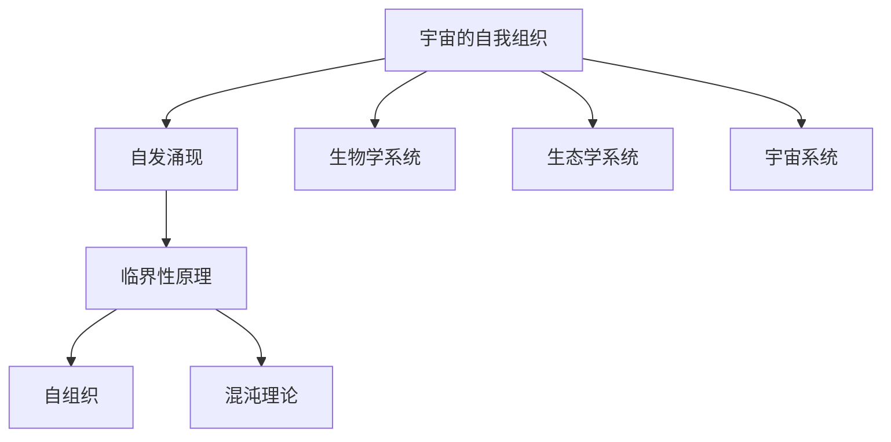

                 

### 引言与基础理论

#### 1.1 引言

宇宙是一个巨大的系统，其中包含了无数的星系、恒星、行星以及宇宙尘埃。尽管宇宙看起来是如此复杂和不可预测，但在其深处，却存在着一种有序性和规律性。科学家们一直在探索这种秩序的起源和本质，其中一种重要的理论就是“宇宙的自我组织临界性”。

宇宙的自我组织临界性指的是宇宙中的系统在达到某一临界点时，会产生自发的秩序和结构，这种秩序和结构是在系统内部自发形成的，而不是由外部力量强加的。这种自我组织现象不仅在宇宙中广泛存在，也在生命系统中得以体现，如生物体从无序的细胞分裂到有序的组织结构。

#### 1.1.1 宇宙的自我组织现象

宇宙的自我组织现象最早可以追溯到宇宙的诞生。在宇宙大爆炸之后，宇宙处于极度高温和高压的状态，物质以等离子态的形式存在。随着宇宙的膨胀和冷却，物质逐渐聚集形成了星系、恒星和行星。这个过程中，物质从无序到有序的转化就是自我组织的体现。

例如，星系的形成过程就是一个典型的自我组织现象。当宇宙中的物质密度达到临界值时，引力会开始发挥作用，使得物质聚集形成星系。星系内部又存在着复杂的相互作用，如恒星间的碰撞和合并，这些相互作用进一步促进了星系结构的稳定和演化。

#### 1.1.2 自发涌现与复杂性科学

自发涌现是宇宙自我组织的一个重要特征。它指的是在复杂系统中，某些结构和行为是自然产生的，而不是预先设定的。这种自发涌现的现象在生命系统中尤为明显，如生物体的生长和发育，以及社会系统中的秩序。

复杂性科学是研究复杂系统的一门学科，它关注系统内部的非线性相互作用和涌现行为。在复杂性科学中，临界性理论是一个重要的概念。临界性指的是系统在达到某一临界点时，会发生质的飞跃和显著的变化。这种临界性现象不仅在宇宙和生命系统中存在，也在技术系统和经济系统中有所体现。

#### 1.1.3 临界性理论的起源与应用

临界性理论最早由物理学家提出，用以描述物质在相变过程中的行为。随着研究的深入，临界性理论逐渐扩展到其他领域，如生物学、经济学和社会学。在宇宙学中，临界性理论被用来解释宇宙的演化过程，如宇宙膨胀、星系形成等。

临界性理论在宇宙学中的应用主要包括以下几个方面：

1. **宇宙膨胀**：宇宙学家发现，宇宙的膨胀速度在加速，这种加速的原因尚不清楚。临界性理论提供了一种解释，即宇宙可能处于一种临界状态，这种状态会导致宇宙膨胀速度的加快。

2. **星系形成**：星系的形成是一个复杂的自我组织过程，临界性理论可以帮助科学家们理解这个过程中发生的质变和结构形成。

3. **宇宙中的奇异现象**：如黑洞和奇点的形成，这些现象在临界性理论中得到了合理的解释。

#### 1.2 自组织的基本概念

##### 1.2.1 自组织的定义与特征

自组织是指一个系统在没有外部指令或中央控制的情况下，通过内部相互作用和相互适应，自行从无序状态向有序状态演化的过程。自组织系统的特征包括：

1. **自发性**：自组织过程是自发的，不需要外部干预。
2. **适应性**：系统能够根据外部环境和内部变化进行自适应调整。
3. **层次性**：自组织系统通常具有多个层次的结构，每个层次都有其特定的功能和规律。
4. **涌现性**：系统整体的行为和性质是各个组成部分相互作用的结果，而不是简单叠加。

##### 1.2.2 自组织的数学模型

自组织的数学模型主要包括以下几种：

1. **确定性模型**：如康威的生命游戏，它通过简单的规则生成复杂的图案和结构。
2. **随机模型**：如随机游走模型，它描述了个体在随机环境中的运动和聚集。
3. **非线性动力学模型**：如洛伦兹系统，它描述了系统在非线性相互作用下的复杂行为。

##### 1.2.3 自组织与混沌理论

混沌理论是研究复杂系统的另一个重要领域。混沌现象是指在确定性系统中，初始条件的小差异会导致长期行为的巨大差异，这种现象被称为“蝴蝶效应”。

自组织与混沌理论之间存在密切的联系。一方面，混沌现象是自组织过程中常见的现象，混沌系统的内在非线性相互作用可以导致结构的产生和演化。另一方面，混沌理论为自组织现象提供了新的视角，它揭示了在看似无序的系统中，隐藏着深刻的有序结构。

在自组织和混沌理论的基础上，科学家们提出了一些关于宇宙自我组织的假设，如：

1. **宇宙的混沌起源**：宇宙在早期可能处于混沌状态，随着时间的推移，逐渐演化为有序的结构。
2. **宇宙的临界态**：宇宙可能在某些时刻处于临界状态，这种状态使得宇宙能够自我组织和演化。

这些假设为理解宇宙的起源和演化提供了新的思路和方向。

#### 1.3 临界性原理概述

##### 1.3.1 临界性的概念

临界性指的是系统在达到某一临界点时，会出现质的飞跃和显著的变化。这种临界点可以是物理状态的转变，如物质的相变，也可以是系统行为的突变，如金融市场的崩盘。

在物理学中，临界性通常与相变理论相关。相变是指系统从一个相态转变为另一个相态的过程，如水的液态变为固态。在相变过程中，系统会经历一个临界点，这个临界点决定了相变的性质和速度。

##### 1.3.2 临界性的分类

临界性可以分为以下几种类型：

1. **热力学临界性**：发生在热力学系统中的临界性，如物质的相变。
2. **动力学临界性**：发生在动力学系统中的临界性，如流体的湍流状态。
3. **社会临界性**：发生在社会系统中的临界性，如社会运动的形成。

##### 1.3.3 临界性在自然界中的体现

临界性在自然界中有着广泛的体现，以下是一些典型的例子：

1. **生物系统**：生物体的生长和发育过程就是一个自我组织和临界性的过程。例如，生物体的细胞分裂和分化过程，以及在进化过程中新物种的形成。
2. **生态系统**：生态系统中物种的相互作用和生态位的分布，也可能存在临界性。例如，生态系统的稳定性可能依赖于物种数量的临界值。
3. **宇宙系统**：宇宙中的星系形成和演化过程，也可能存在临界性。例如，星系碰撞和合并的过程，以及宇宙膨胀的速度。

### 核心概念与联系架构

为了更好地理解宇宙的自我组织临界性，我们可以使用Mermaid流程图来展示核心概念之间的关系。以下是一个简单的Mermaid流程图：

在这个流程图中，我们可以看到宇宙的自我组织涉及多个核心概念，如自发涌现、临界性原理、自组织和混沌理论。这些概念相互关联，共同构成了对宇宙自我组织的全面理解。

### 文章标题：宇宙的自我组织临界性：秩序的自发涌现

### 文章关键词：
- 宇宙自我组织
- 自发涌现
- 临界性原理
- 自组织
- 混沌理论

### 文章摘要：
本文深入探讨了宇宙的自我组织临界性，阐述了宇宙从无序到有序的演化过程。通过分析自发涌现、临界性原理、自组织和混沌理论，揭示了宇宙自我组织背后的复杂机制。文章还探讨了这些概念在生物、生态和宇宙系统中的应用，为我们理解宇宙的起源和演化提供了新的视角。最后，本文总结了当前研究的挑战和未来研究方向，为读者提供了进一步探索的启示。

