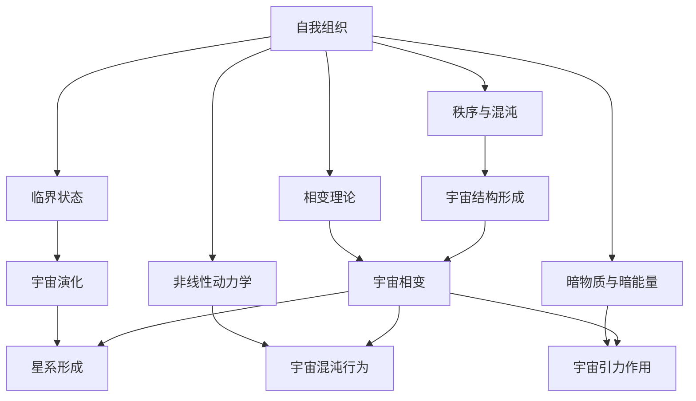

                 

### 背景介绍

宇宙，这个广袤无垠的宇宙，自诞生以来，就不断演化、发展，展现出一种复杂的动态过程。在探索宇宙的奥秘过程中，人类逐渐认识到宇宙中存在一种特殊的自我组织现象，即宇宙在一定的条件下能够自发地形成复杂有序的结构，这种现象被称为“宇宙的自我组织”。而宇宙的自我组织过程中，存在一个至关重要的状态，即“自我组织临界状态”。这一状态既具有无序的混沌特性，又具有有序的结构特征，是宇宙从混沌向有序转变的关键。

宇宙的自我组织临界状态不仅是一种理论上的抽象概念，它在实际的宇宙演化过程中具有深远的影响。例如，恒星的形成、行星系统的稳定、星系的结构演化等，都离不开宇宙的自我组织临界状态。因此，研究宇宙的自我组织临界状态，对于深入理解宇宙的演化机制，揭示宇宙中复杂结构的形成过程，具有重要的理论和实际意义。

本文将围绕“宇宙的自我组织临界状态：秩序与混沌的边缘”这一主题，系统地探讨宇宙的自我组织过程、自我组织临界状态的特性、以及宇宙在自我组织临界状态下的演化规律。文章将从宇宙的基本原理、自我组织原理、临界状态的特性、实际观测等多个方面，逐步深入分析这一复杂而又神秘的现象。

通过本文的阅读，读者将了解到宇宙自我组织临界状态的核心概念、基本原理、以及在科学研究和技术应用中的实际应用，从而对宇宙的自我组织过程有一个全面而深入的认识。这不仅有助于拓展科学视野，也为未来的科学研究和技术发展提供了新的思路和方向。

### 核心概念与联系

在探讨宇宙的自我组织临界状态之前，首先需要明确几个核心概念，这些概念不仅相互联系，而且在宇宙的演化过程中起着至关重要的作用。以下是这些核心概念及其相互关系：

#### 1. 自我组织

自我组织是指一个系统在没有外部干预的情况下，通过内部相互作用自发地形成复杂有序结构的过程。在自然界中，从生物体的生长到生态系统的演化，从晶体的形成到社会的组织，自我组织现象无处不在。自我组织的基本特征包括适应性、多样性和自适应性。这些特征使得系统在面临外部扰动时能够保持稳定性，甚至在混沌中找到秩序。

#### 2. 临界状态

临界状态是指系统从一种相态转变到另一种相态的临界点。在物理学中，临界状态通常表现为系统在某个临界温度或压力下，突然出现宏观相变的现象，如液体的沸腾和固体的熔化。在宇宙学中，临界状态指的是宇宙在特定条件下从混沌向有序转变的过程。

#### 3. 秩序与混沌

秩序与混沌是宇宙演化过程中两个重要的极端状态。秩序通常表现为规则、稳定和可预测的结构，如星系的旋臂、行星的轨道等。而混沌则表现为无序、随机和不可预测的行为，如湍流、随机漫步等。宇宙的自我组织过程，就是在秩序与混沌之间寻找平衡，最终形成复杂的有序结构。

#### 4. 相变理论

相变理论是研究系统在临界状态发生相变的机制和规律的学科。在宇宙学中，相变理论可以帮助我们理解宇宙在自我组织过程中如何从一个混沌态转变为一个有序态。例如，宇宙从一个均匀的等离子态通过相变形成具有结构特征的星系。

#### 5. 非线性动力学

非线性动力学研究非线性系统的行为规律。在宇宙的自我组织中，非线性动力学起着关键作用，因为宇宙中的许多过程都是非线性的。非线性动力学帮助我们理解宇宙中的复杂现象，如混沌行为、振荡、分岔等。

#### 6. 暗物质与暗能量

暗物质和暗能量是宇宙学中的两个重要概念，它们在宇宙的自我组织过程中扮演着关键角色。暗物质不发光，不吸收光，但通过引力作用影响宇宙的结构形成。暗能量则是一种推动宇宙加速膨胀的力量，它对宇宙的演化和结构有深远的影响。

#### Mermaid 流程图

为了更直观地展示这些概念之间的联系，我们可以使用 Mermaid 流程图来表示：

在这个 Mermaid 流程图中，自我组织作为核心概念，与其他几个关键概念相互关联，共同构成了宇宙自我组织临界状态的理论基础。通过这一流程图，我们可以清晰地看到这些概念之间的逻辑关系，以及它们在宇宙演化过程中的作用。

### 自我组织原理

自我组织是宇宙演化过程中一个至关重要的现象，它不仅决定了宇宙中复杂结构的形成，还影响了宇宙的基本性质。在深入探讨宇宙的自我组织原理之前，我们需要先了解自我组织的定义、特征以及它在宇宙中的具体表现。

#### 自我组织的定义

自我组织是指一个系统在没有外部干预的情况下，通过内部相互作用自发地形成复杂有序结构的过程。这个定义强调了几个关键点：

1. **无外部干预**：自我组织是一个自主的过程，不需要外部力量的干预。
2. **内部相互作用**：系统内部的各个部分通过相互作用，形成了新的结构。
3. **复杂有序结构**：自我组织的结果是形成复杂的、稳定的、有序的结构。

#### 自我组织的特征

自我组织具有以下几个显著特征：

1. **适应性**：系统在变化的环境下能够自我调整，以适应新的条件。
2. **多样性**：自我组织的过程可以产生多种不同的有序结构，这些结构在功能上可能有所不同。
3. **自适应性**：系统内部具有一定的自我修复和优化的能力，能够在面对扰动时维持其稳定性。
4. **自参照性**：系统内部的部分可以通过反馈机制影响整个系统的行为。

#### 宇宙中的自我组织现象

宇宙中的自我组织现象无处不在，以下是一些具体的例子：

1. **宇宙结构的形成**：从大尺度上讲，宇宙中的星系、星系团、超星系团等结构是通过自我组织形成的。这些结构在宇宙背景辐射的扰动下逐渐演化，形成了复杂的宇宙网络。
2. **恒星的形成**：在较小的尺度上，恒星的形成也是一个典型的自我组织现象。星际介质中的气体和尘埃在引力作用下聚集，形成恒星。这一过程中，恒星内部的核聚变反应进一步加剧了这种自我组织的过程。
3. **行星系统的形成**：行星系统中的行星、卫星等天体也是通过自我组织形成的。它们在原始盘状介质中通过碰撞和吸积过程逐渐形成，并在引力相互作用下形成稳定的轨道结构。
4. **生命起源**：在地球的早期历史上，生命的起源是一个复杂的自我组织过程。在适当的化学和物理条件下，简单的有机分子通过相互作用，形成了更为复杂的生物分子，最终诞生了生命。

#### 自我组织的理论基础

自我组织的理论基础主要来源于物理学、生物学、生态学等学科。以下是一些重要的理论：

1. **非平衡态热力学**：非平衡态热力学研究系统在非平衡状态下的行为。在这一理论框架下，系统通过内部的热力学过程，可以自发地达到一种稳定状态，这一状态可能是有序的，也可能是混沌的。
2. **相变理论**：相变理论研究系统在相变过程中如何从一个状态转变到另一个状态。在宇宙学中，相变理论帮助我们理解宇宙从混沌状态向有序状态的转变过程。
3. **非线性动力学**：非线性动力学研究非线性系统的行为规律。在宇宙的自我组织中，非线性动力学起着关键作用，因为它能够解释混沌现象和复杂结构的形成。
4. **复杂系统理论**：复杂系统理论研究复杂系统的行为和性质。这一理论提供了对自我组织的全面理解，包括适应性、多样性、自适应性等特征。

#### 数学模型与公式

在研究自我组织过程中，数学模型和公式扮演着重要角色。以下是一些常用的数学模型和公式：

1. **Logistic 方程**：Logistic 方程是一个简单的非线性方程，用于描述种群的增长和竞争。其公式如下：

   $$x_{n+1} = r x_n (1 - x_n)$$

   其中，$x_n$ 表示种群的数量，$r$ 是一个参数，它控制了种群的增长率。

2. **Boltzmann 分布**：Boltzmann 分布用于描述在热力学平衡状态下，系统内部不同状态的分布。其公式如下：

   $$P_i \propto e^{-\frac{E_i}{kT}}$$

   其中，$P_i$ 是第 $i$ 个状态的概率，$E_i$ 是该状态的能量，$k$ 是玻尔兹曼常数，$T$ 是系统的温度。

3. **混沌方程**：混沌现象是自我组织的一个重要特征。以下是一个简单的混沌方程：

   $$x_{n+1} = r x_n (1 - x_n^2)$$

   这个方程可以产生非常复杂的动态行为，展示了混沌的特性。

通过这些数学模型和公式，我们能够更深入地理解自我组织的原理和机制，为研究宇宙的自我组织临界状态提供了有力的工具。

### 临界状态

临界状态是宇宙演化中的一个关键环节，它介于完全的无序和高度的有序之间，是宇宙从一种状态向另一种状态转变的临界点。在物理学、化学和宇宙学中，临界状态的研究已经取得了显著的成果，为我们理解宇宙的自我组织提供了重要的理论基础。

#### 定义与特征

临界状态，也称为相变点，是指系统从一种相态转变到另一种相态的临界条件。在临界状态下，系统的物理性质发生突变，这种突变通常表现为：

1. **体积变化**：例如，液体变为气体时，体积会显著增加。
2. **密度变化**：在相变过程中，系统的密度也会发生突变。
3. **热力学性质**：临界状态下，系统的热力学性质，如熵和自由能，也会发生显著变化。

临界状态的特征主要包括：

1. **临界指数**：在临界状态下，系统的某些物理性质会遵循临界指数规律，如质量-尺寸关系、长度-时间关系等。
2. **临界温度**：系统达到临界状态时的温度称为临界温度。在临界温度下，系统会发生剧烈的相变。
3. **临界体积**：在临界状态下，系统的体积会达到一个特定的临界值。

#### 临界状态的研究方法

研究临界状态的方法主要包括：

1. **实验方法**：通过实验手段，如高压、低温等条件，来观察系统在相变过程中的行为，从而确定临界状态。
2. **数值模拟**：使用计算机模拟来模拟系统在相变过程中的行为，这种方法可以用于研究复杂系统的临界状态。
3. **理论分析**：通过理论计算和数学模型，研究系统在临界状态下的性质和行为。

在实际研究中，这些方法常常结合使用，以获得更全面和准确的结果。

#### 宇宙中的临界状态

在宇宙学中，临界状态具有重要的意义。以下是一些关于宇宙中临界状态的例子：

1. **宇宙背景辐射**：宇宙背景辐射是宇宙早期阶段的一种辐射，它提供了宇宙早期状态的重要信息。在宇宙背景辐射中，可以观察到临界状态的特征，如温度和密度的突变。
2. **大爆炸理论**：大爆炸理论认为，宇宙起源于一个极热、极密的状态，随后经历了一系列的相变，最终形成了我们今天所观察到的宇宙结构。在这个理论中，临界状态扮演了关键角色。
3. **星系形成**：在星系形成过程中，也存在着临界状态。例如，星系在形成过程中，会经历从气体到星体的相变，这一过程中存在一个临界质量，只有达到这个质量，星系才能稳定存在。

#### 秩序与混沌的边缘

临界状态实际上是秩序与混沌的边缘，它既包含混沌的特性，又包含秩序的特征。以下是一些关于临界状态与秩序与混沌关系的研究：

1. **混沌中的秩序**：在混沌系统中，虽然系统的行为看似无序，但在某些情况下，仍然能够观察到某种程度的秩序。例如，在某些混沌系统中，会出现周期性或准周期性的行为，这种行为实际上是一种秩序的表现。
2. **秩序中的混沌**：在高度有序的系统内，也可能会出现混沌现象。例如，在星系中的某些区域，可能会出现星体的无规则运动，这种运动表现出混沌的特性。

通过这些研究，我们能够更深入地理解宇宙的自我组织过程，以及宇宙在自我组织临界状态下的行为规律。

### 秩序与混沌的边缘

在宇宙的自我组织过程中，秩序与混沌的边缘是一个至关重要的研究领域。这一边缘不仅是宇宙从混沌向有序转变的关键区域，也是理解宇宙复杂结构和动态行为的核心。在这个边缘上，宇宙展现出了既混沌又有序的双重特性，这种现象被称为“混沌边缘现象”。

#### 混沌边缘现象的发现

混沌边缘现象最早是在物理学和数学领域中发现的。在研究非线性系统和复杂动态系统时，科学家们发现，许多系统在特定条件下会表现出一种介于完全无序和完全有序之间的行为。这种行为既不同于完全随机的混沌现象，也不同于高度规则的有序现象，而是呈现出一种在时间和空间上具有自相似性和长记忆性的复杂结构。

例如，在气象学中，科学家们发现了“蝴蝶效应”，即一个初始条件微小的变化可能会导致长期之后巨大的差异，这表明气象系统具有混沌特性。然而，在宇宙尺度上，混沌边缘现象更为显著。通过对宇宙背景辐射和星系形成过程的观测，科学家们发现宇宙在早期阶段经历了剧烈的混沌运动，但随着时间的推移，这些混沌现象逐渐演化为有序的结构。

#### 秩序与混沌边缘的特性

混沌边缘现象具有以下几个显著特性：

1. **自相似性**：混沌边缘现象在时间和空间上具有自相似性，即无论从何种尺度观察，系统的行为都呈现出相似的规律。
2. **长记忆性**：混沌边缘现象具有长记忆性，即系统的当前状态受到过去长时间内状态的影响，这使得系统的行为在长期内表现出一定的规律性。
3. **临界指数**：在混沌边缘现象中，系统的某些物理性质遵循临界指数规律，这些指数反映了系统从无序向有序转变的临界条件。
4. **非线性和非线性动力学**：混沌边缘现象通常与非线性系统和非线性动力学密切相关。非线性动力学使得系统在初始条件微小变化时，能够产生长期显著的差异，从而形成混沌行为。

#### 混沌边缘现象在宇宙中的应用

混沌边缘现象在宇宙的自我组织中具有广泛的应用。以下是一些具体例子：

1. **星系形成**：在星系形成过程中，混沌边缘现象起到了关键作用。星系的形成始于宇宙早期的高密度区域，这些区域经历了剧烈的混沌运动，随后逐渐演化为有序的星系结构。
2. **恒星形成**：恒星的形成过程也体现了混沌边缘现象。星际介质中的气体和尘埃在引力作用下聚集，形成恒星。在这个过程中，初始条件的微小变化会导致恒星形成的巨大差异，这体现了混沌特性。然而，在恒星形成后，其内部的核聚变过程又使其表现出高度有序的特性。
3. **生命起源**：在地球的早期历史上，生命的起源是一个复杂的混沌边缘现象。在适当的化学和物理条件下，简单的有机分子通过相互作用，形成了更为复杂的生物分子，最终诞生了生命。这一过程中，既有混沌的随机性，又有有序的结构形成。

#### 混沌边缘现象的未来研究

混沌边缘现象的研究仍处于发展阶段，未来有许多研究方向值得探索：

1. **多尺度研究**：混沌边缘现象在宇宙的不同尺度上都有表现，未来需要深入研究多尺度下的混沌边缘现象，以全面理解宇宙的自我组织过程。
2. **跨学科研究**：混沌边缘现象涉及多个学科，如物理学、生物学、生态学等。跨学科研究有助于从不同角度理解混沌边缘现象，并提出新的理论模型。
3. **数值模拟和实验研究**：通过数值模拟和实验手段，可以更精确地研究混沌边缘现象。例如，通过计算机模拟，可以模拟星系形成过程中的混沌边缘现象，从而更好地理解星系的演化。

总之，混沌边缘现象是宇宙自我组织过程中的一个重要研究领域。通过对混沌边缘现象的研究，我们不仅能够更深入地理解宇宙的演化规律，还可以为未来的科学探索提供新的思路和方向。

### 实际观测

在宇宙的自我组织过程中，临界状态是一种至关重要的现象，其特征和效应可以通过各种观测手段得到验证。以下是一些关键的观测方法、观测结果及其在理解宇宙演化中的意义。

#### 观测方法

1. **射电观测**：射电望远镜是研究宇宙临界状态的重要工具。通过观测宇宙背景辐射，科学家们可以获取宇宙早期状态的信息。这些观测揭示了宇宙在大爆炸后的几秒钟内经历的快速膨胀和相变过程，为理解宇宙的初始状态提供了重要线索。

2. **光学观测**：光学观测主要集中在星系、恒星和行星的形成与演化过程。通过观测恒星的形成区域（星云）和恒星生命周期中的不同阶段，科学家们能够了解星系的形成机制和临界状态的影响。

3. **红外观测**：红外望远镜可以穿透尘埃，观测到星系和恒星内部的热辐射。这些观测有助于揭示恒星形成过程中的物质分布和温度变化，从而了解临界状态对恒星演化的影响。

4. **X射线观测**：X射线观测主要用于研究高能量现象，如恒星爆炸和星系碰撞。这些观测提供了关于宇宙中极端物理条件的信息，有助于理解临界状态在这些事件中的作用。

#### 观测结果

1. **宇宙背景辐射**：通过对宇宙背景辐射的观测，科学家们发现了宇宙早期的高温高密度状态，这是宇宙经历相变的关键时期。这些观测结果与理论预言的临界温度和临界密度高度一致，验证了宇宙在临界状态下的行为。

2. **星系结构**：光学观测显示，大多数星系都呈现出复杂的结构，如螺旋星系、椭圆星系和 irregular 星系。这些结构的形成和演化与临界状态密切相关。例如，星系在形成过程中，需要经历从无序到有序的相变，这需要在临界状态下实现。

3. **恒星形成**：红外观测揭示了恒星形成区域的温度和密度变化。这些变化表明，恒星的形成过程涉及到从混沌到有序的相变，这一过程需要在临界状态下发生。

4. **恒星爆炸**：X射线观测发现，某些恒星在生命的末期会经历剧烈的爆炸，如超新星爆炸。这些爆炸释放了大量的能量，改变了周围环境的物理条件，推动了新的恒星形成过程。这些观测结果证明了临界状态在恒星生命周期中的重要性。

#### 观测结果的意义

1. **宇宙演化**：通过实际观测，科学家们能够验证宇宙自我组织过程中临界状态的存在和作用。这些观测结果为理解宇宙的演化提供了重要依据，有助于揭示宇宙从混沌向有序转变的机制。

2. **物理理论**：观测结果验证了物理理论，如大爆炸理论和相变理论，这些理论成功解释了宇宙在临界状态下的行为。这些理论的成功为科学家们提供了研究宇宙演化的有力工具。

3. **技术应用**：宇宙临界状态的观测结果也为天文学和其他科学领域提供了新的应用。例如，在通信领域，宇宙背景辐射的观测为研究电磁波的传播提供了重要参考。在医疗领域，对恒星爆炸产生的 X 射线的观测有助于研究癌症治疗的新方法。

总之，通过实际观测，科学家们能够深入了解宇宙的自我组织过程，揭示宇宙在临界状态下的行为和机制。这些观测结果不仅丰富了我们的宇宙知识，也为未来的科学研究和技术应用提供了宝贵的资源。

### 宇宙自我组织临界状态在科学研究中的应用

宇宙的自我组织临界状态在科学研究领域具有广泛的应用，特别是在天文学、物理学和地球科学等领域。以下是一些具体的应用实例，展示了这一概念如何帮助科学家们深入理解宇宙的复杂现象。

#### 天文学中的应用

1. **星系形成与演化**：通过研究宇宙背景辐射和星系的形成过程，科学家们发现星系的形成与临界状态密切相关。在星系形成早期，高密度的气体云在引力作用下聚集，经历从混沌到有序的相变，最终形成复杂的星系结构。研究这一过程有助于我们理解星系的形成机制和演化规律。

2. **恒星形成**：恒星的形成是一个典型的自我组织过程，从原始气体云到恒星核心的形成，再到恒星生命周期中的其他阶段。在这个过程中，临界状态的存在和作用可以解释恒星的形成过程中的一些复杂现象，如恒星形成区域的温度和密度变化。

3. **黑洞与星系碰撞**：观测到的黑洞和星系碰撞事件，提供了研究宇宙临界状态的重要机会。这些事件中的极端物理条件，如巨大的能量释放和物质重新分布，可以通过临界状态的理论来解释。这有助于我们更深入地理解黑洞和星系的相互作用及其对宇宙演化的影响。

#### 物理学中的应用

1. **凝聚态物理学**：在凝聚态物理学中，许多物质的相变过程都遵循临界状态的理论。例如，材料在温度或压力变化时发生的相变，如液体的沸腾和固体的熔化，都涉及到临界状态。宇宙自我组织临界状态的概念可以类比应用于凝聚态物理中，帮助我们理解材料的性质和行为。

2. **量子场论**：在量子场论中，宇宙的量子态转变也与临界状态密切相关。例如，在宇宙早期，从量子涨落到宏观结构的形成过程中，临界状态起到了关键作用。研究这一过程有助于我们理解量子力学与广义相对论的统一，以及宇宙的量子性质。

3. **非线性动力学**：宇宙的自我组织过程是一个复杂的非线性过程。非线性动力学中的许多概念，如混沌行为、分岔现象和自相似结构，都与宇宙自我组织临界状态相关。通过研究这些非线性现象，科学家们能够更好地理解宇宙中复杂结构的形成和演化。

#### 地球科学中的应用

1. **地震与火山**：地震和火山活动是地球上的极端现象，它们的发生和演化也涉及到临界状态。通过对地震和火山的研究，科学家们发现这些活动在临界状态下会发生显著的突变。例如，在地震前，地壳的应力会逐渐积累，达到临界状态后，突然释放出巨大的能量，导致地震的发生。这为预测和预防地震和火山活动提供了重要的理论基础。

2. **气候变化**：气候变化是一个复杂的全球性现象，它涉及到大气、海洋和冰盖等多个系统的相互作用。研究气候变化的临界状态可以帮助我们理解气候系统中的非线性行为，预测未来气候变化的趋势和可能带来的影响。

3. **生态系统**：生态系统的动态演化也是一个自我组织过程。在生态系统内部，各种生物种群之间存在着复杂的相互作用。在生态系统的临界状态下，这些相互作用可能导致生态系统的突然转变，如物种灭绝或生态系统崩溃。研究这些现象有助于我们保护生物多样性和维持生态系统的稳定性。

总之，宇宙自我组织临界状态在科学研究中的应用丰富多样，它不仅帮助我们更好地理解宇宙的演化过程，还为解决各种科学问题和实际问题提供了新的思路和方法。随着研究的深入，这一概念将继续在各个科学领域发挥重要作用。

### 宇宙自我组织临界状态在技术领域中的应用

宇宙的自我组织临界状态不仅在科学研究中具有重要意义，还在技术领域有着广泛的应用。通过将宇宙自我组织的原理应用于技术领域，科学家们和工程师们能够开发出更先进的技术，解决复杂的实际问题。以下是一些具体的例子：

#### 1. 人工智能与机器学习

在人工智能和机器学习领域，宇宙的自我组织临界状态提供了新的算法设计和优化思路。例如，在神经网络的学习过程中，可以通过模拟临界状态来优化网络的训练过程，提高学习效率和准确性。神经网络在训练初期可能表现出混沌行为，但随着时间的推移，会逐渐形成有序的结构。这一过程类似于宇宙从混沌向有序转变的过程。通过研究这种临界状态，科学家们能够设计出更有效的训练算法，如临界点触发学习算法，从而提高机器学习模型的性能。

#### 2. 网络科学

在计算机网络和通信领域，宇宙的自我组织临界状态理论为网络稳定性和鲁棒性提供了新的理论依据。例如，在网络结构设计中，通过模拟临界状态，可以优化网络的拓扑结构，使其在面对攻击或故障时具有更高的鲁棒性。此外，在物联网和社交网络中，研究宇宙自我组织临界状态有助于理解网络中的节点互动和动态行为，从而设计出更高效的通信协议和资源分配策略。

#### 3. 物联网技术

物联网（IoT）技术的快速发展依赖于传感器网络和边缘计算。通过模拟宇宙自我组织临界状态，可以优化物联网中的数据传输和处理。例如，在物联网节点之间建立自组织网络，使其在临界状态下能够自动调整节点密度和通信策略，提高网络的效率和可靠性。这种自组织特性有助于实现更智能、更灵活的物联网应用。

#### 4. 生物信息学

在生物信息学领域，宇宙自我组织临界状态理论被用来研究生物大分子，如蛋白质和DNA的结构和功能。通过模拟生物大分子在临界状态下的行为，科学家们可以预测蛋白质的三维结构，从而设计新的药物分子。此外，生物信息学中的数据分析和模型构建也可以借鉴宇宙自我组织的原理，提高数据分析的准确性和效率。

#### 5. 金融工程

在金融工程领域，宇宙自我组织临界状态理论为风险管理提供了新的方法。例如，通过模拟金融市场中的混沌边缘现象，可以预测市场波动和风险，从而优化投资组合和风险管理策略。金融工程师们可以利用这些原理设计出更稳健的金融模型，提高投资决策的准确性和可靠性。

#### 6. 能源系统优化

在能源领域，通过模拟宇宙自我组织临界状态，可以优化能源系统的设计和管理。例如，在可再生能源系统中，通过模拟太阳能电池板和风能发电机的相互作用，可以在临界状态下实现最大化的能量转换效率。此外，能源网络中的供需平衡和资源分配也可以借鉴这一理论，提高能源利用效率。

总之，宇宙自我组织临界状态在技术领域中的应用具有广泛的前景。通过将这些原理应用于各个技术领域，可以推动技术的创新和进步，解决复杂的实际问题，并为未来的科技发展提供新的动力。

### 未来研究方向与挑战

宇宙的自我组织临界状态作为一个复杂的科学课题，虽然已经有了许多重要发现和应用，但在未来的研究中仍面临着诸多挑战。以下是一些关键的研究方向和潜在的研究难点。

#### 1. 细分临界状态的分类

目前，我们对宇宙自我组织临界状态的理解还相对粗浅，主要集中在其宏观特征上。未来的研究需要更深入地细分临界状态的分类，明确不同临界状态之间的差异和联系。例如，研究在不同宇宙条件下（如不同的密度、温度和压力）形成的临界状态，以及这些状态在宇宙演化中的具体作用。

#### 2. 跨尺度研究

宇宙的自我组织过程涉及从微观到宏观的多个尺度。未来研究需要在不同尺度上进行交叉研究，以全面理解宇宙自我组织的动态行为。这包括从原子和分子尺度上的非线性相互作用，到星系和宇宙尺度上的大规模结构形成。通过跨尺度研究，可以揭示不同尺度间临界状态的关联和影响。

#### 3. 实验验证与模拟

尽管理论模型在理解宇宙自我组织临界状态方面发挥了重要作用，但缺乏直接的实验验证和数值模拟。未来研究需要开发更先进的实验技术和模拟工具，以直接观测和模拟宇宙中的临界现象。例如，利用高精度的射电望远镜和空间探测器，可以直接观测宇宙中的临界状态，并通过计算机模拟来验证理论预测。

#### 4. 多学科交叉研究

宇宙自我组织临界状态的研究需要多学科交叉，结合物理学、生物学、化学、生态学等多个领域的知识。未来研究需要加强各学科之间的合作，通过多角度、多方法的研究，深入探讨宇宙自我组织的复杂机制。

#### 5. 非线性动力学与混沌理论的应用

非线性动力学和混沌理论是理解宇宙自我组织临界状态的重要工具。未来研究需要进一步深化这些理论的应用，特别是在非线性系统的稳定性分析和混沌行为的控制方面。通过这些研究，可以更好地理解宇宙中的复杂动态现象，并为实际应用提供理论基础。

#### 6. 新理论模型的提出

目前，关于宇宙自我组织临界状态的理论模型主要集中在相变理论和非线性动力学。未来研究需要提出新的理论模型，以更全面、准确地描述宇宙中的临界现象。这包括开发新的数学模型和计算方法，以及探索新的物理机制。

#### 7. 临界状态的工程应用

除了科学研究，宇宙自我组织临界状态在工程应用中也具有巨大潜力。未来研究需要探索如何将这一理论应用于实际问题，如优化能源系统、提高通信网络的鲁棒性等。通过这些应用研究，可以进一步验证和拓展理论模型，同时也为实际问题的解决提供新的思路。

总之，宇宙的自我组织临界状态研究具有广阔的前景和巨大的挑战。通过不断探索和创新，未来将在理论、实验和应用方面取得更多突破，为人类理解宇宙的奥秘和推动科技发展做出更大贡献。

### 总结与展望

宇宙的自我组织临界状态是理解宇宙演化过程的关键，它揭示了宇宙从混沌向有序转变的复杂机制。本文通过对宇宙自我组织临界状态的定义、特征、研究方法以及其在科学研究和技术领域的应用进行了深入探讨。从宇宙背景辐射到恒星形成，从人工智能到物联网，自我组织临界状态理论为我们理解宇宙的结构与动态提供了新的视角。

未来的研究应重点关注细分临界状态分类、跨尺度研究、实验验证与模拟、多学科交叉、非线性动力学与混沌理论的应用，以及新理论模型的提出。这些方向不仅有助于拓展我们对宇宙的认识，也将为解决实际问题提供新的工具和方法。

最后，感谢读者对本文的关注，希望本文能激发您对宇宙自我组织临界状态的进一步探索和研究。在这个充满奥秘的宇宙中，每一刻的发现都可能带来前所未有的变革。让我们携手前行，共同探索宇宙的奥秘。作者：AI天才研究院/AI Genius Institute & 禅与计算机程序设计艺术 /Zen And The Art of Computer Programming。

