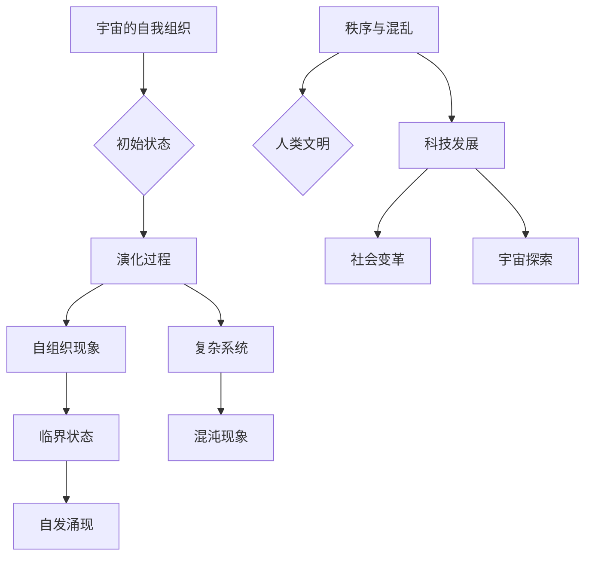

                 

### 文章标题

《宇宙的自我组织临界状态：秩序的自发涌现》

关键词：宇宙、自我组织、临界状态、秩序、自发涌现

摘要：本文将从宇宙的自我组织出发，深入探讨宇宙中的临界状态及其与秩序自发涌现的关系。通过分析宇宙的初始状态、演化过程、自组织现象和复杂系统，我们将揭示宇宙自我组织的奥秘，并探讨其在人类文明中的影响。文章旨在为读者提供一个全面而深入的理解，以揭示宇宙秩序背后的自然法则。

### 目录大纲

# 《宇宙的自我组织临界状态：秩序的自发涌现》

## 第一部分：宇宙的自我组织

## 第1章：宇宙的自我组织概述

### 1.1 宇宙的自我组织概念

### 1.2 宇宙的自我组织历史

### 1.3 宇宙的自我组织与混沌理论

## 第2章：宇宙的初始状态与演化

### 2.1 宇宙的初始状态

### 2.2 宇宙的演化过程

### 2.3 宇宙中的混沌现象

## 第3章：宇宙中的自组织现象

### 3.1 自组织现象的定义

### 3.2 自组织现象的类型

### 3.3 自组织现象的案例研究

## 第4章：宇宙中的复杂系统

### 4.1 复杂系统的定义

### 4.2 复杂系统的特征

### 4.3 复杂系统的案例研究

## 第二部分：宇宙的临界状态

## 第5章：宇宙的临界状态

### 5.1 临界状态的定义

### 5.2 临界状态的特性

### 5.3 临界状态的案例研究

## 第6章：宇宙中的临界现象

### 6.1 临界现象的定义

### 6.2 临界现象的类型

### 6.3 临界现象的案例研究

## 第7章：宇宙的自我组织与临界状态的关系

### 7.1 自我组织与临界状态的关系

### 7.2 自我组织在临界状态中的表现

### 7.3 自我组织在临界状态中的意义

## 第三部分：宇宙的自发涌现

## 第8章：宇宙的自发涌现

### 8.1 自发涌现的概念

### 8.2 自发涌现的原理

### 8.3 自发涌现的案例研究

## 第9章：宇宙中的秩序与混乱

### 9.1 秩序与混乱的定义

### 9.2 秩序与混乱的关系

### 9.3 秩序与混乱的案例研究

## 第10章：宇宙的自发涌现与人类文明

### 10.1 自发涌现对人类文明的影响

### 10.2 自发涌现与人类文明的关系

### 10.3 自发涌现的未来展望

## 附录

### 附录A：宇宙自我组织关键术语表

### 附录B：宇宙自我组织参考文献

### 附录C：宇宙自我组织 Mermaid 流程图

### 附录D：宇宙自我组织核心算法伪代码

### 附录E：宇宙自我组织数学模型与公式

### 附录F：宇宙自我组织项目实战案例

## 第一部分：宇宙的自我组织

### 第1章：宇宙的自我组织概述

#### 1.1 宇宙的自我组织概念

宇宙的自我组织指的是宇宙内部系统在没有外部干预的情况下，通过自然的过程自发地形成和组织起来。这一概念涉及到宇宙从无序到有序的转变，以及宇宙内部各个组成部分之间的相互作用和自组织现象。

宇宙的自我组织与生命科学、物理学、化学等多个领域密切相关。例如，在生命科学中，生物体通过基因表达、细胞分裂等过程实现自我组织和进化；在物理学中，宇宙的大尺度结构如星系、星云等也是通过引力等自然力相互作用而形成的。此外，化学中的自组织现象，如液态晶体的形成、化学反应的自发进行等，也为理解宇宙的自我组织提供了重要的启示。

#### 1.2 宇宙的自我组织历史

宇宙的自我组织概念的发展历程可以追溯到20世纪初期。当时，物理学家开始意识到宇宙并非处于静态不变的状态，而是经历了一系列复杂的演化过程。这一认识的变化源于对宇宙大爆炸理论的接受，该理论认为宇宙起源于一个极度高温高密度的状态，随后经历了迅速的膨胀和冷却，逐渐形成了今天我们所观察到的宇宙结构。

在宇宙的自我组织历史中，混沌理论和复杂性科学的发展起到了关键作用。混沌理论揭示了宇宙系统中存在的随机性和不确定性，而复杂性科学则研究这些系统在相互作用和演化过程中如何形成有序的结构。这些理论的发展为我们理解宇宙的自我组织提供了新的视角和方法。

#### 1.3 宇宙的自我组织与混沌理论

混沌理论是研究复杂系统中随机性和不确定性的科学。在宇宙的自我组织中，混沌理论起着重要的作用。混沌现象在宇宙中广泛存在，例如，星系之间的引力相互作用可以产生混沌运动，行星轨道的长期演化也可能受到混沌效应的影响。

混沌理论揭示了宇宙系统中某些看似随机和无序的现象实际上蕴含着深刻的内在规律。通过研究混沌现象，我们可以更好地理解宇宙的自我组织过程，以及如何从无序中涌现出有序结构。

### 第2章：宇宙的初始状态与演化

#### 2.1 宇宙的初始状态

宇宙的初始状态是宇宙演化过程中的一个关键节点。根据大爆炸理论，宇宙起源于一个极端高温高密度的状态，称为原始奇点。在这个奇点中，所有的物质和能量都高度集中，空间和时间也尚未形成。

原始奇点的状态可以用几个关键参数来描述，包括温度、密度、压力和引力等。这些参数的初始条件决定了宇宙未来的演化路径。例如，温度的高低会影响物质和能量的相互作用方式，而密度的不均匀分布则是宇宙结构形成的基础。

#### 2.2 宇宙的演化过程

从原始奇点开始，宇宙经历了快速膨胀和冷却的过程。在宇宙的早期阶段，温度极高，物质主要以基本粒子形式存在，如夸克和轻子。随着宇宙的膨胀，温度逐渐降低，物质开始聚集形成更复杂的结构。

宇宙的演化过程可以分为几个关键阶段，包括宇宙微波背景辐射、原初核合成、星系和星系团的形成等。在这些阶段中，宇宙中的物质和能量不断相互作用和演化，形成了我们今天所观察到的宇宙结构。

#### 2.3 宇宙中的混沌现象

在宇宙的演化过程中，混沌现象扮演着重要角色。混沌现象指的是系统在初始条件微小的变化下，可能导致长期行为巨大的差异。在宇宙中，混沌现象可以表现为星系轨道的混沌运动、行星轨道的不稳定性等。

混沌现象的存在揭示了宇宙演化过程中内在的随机性和不确定性。尽管宇宙的整体演化遵循一定的规律，但在细节上，混沌现象可能导致宇宙结构的多样性和复杂性。因此，混沌理论为我们理解宇宙的自我组织和演化提供了重要的工具。

### 第3章：宇宙中的自组织现象

#### 3.1 自组织现象的定义

自组织现象是指在没有外部干预的情况下，系统内部通过相互作用和协同演化，自发地形成有序结构和功能的动态过程。在宇宙中，自组织现象广泛存在，从微观的原子、分子，到宏观的星系、星系团，都体现了自组织的特点。

自组织现象与自然选择、遗传变异等进化机制不同，它不依赖于预先设计的规则或目标，而是通过系统内部的自发过程实现。这种过程往往具有适应性、自适应性、自适应性和自修复性，使得系统能够在复杂多变的环境中生存和演化。

#### 3.2 自组织现象的类型

宇宙中的自组织现象可以分为几种类型，包括自组织临界现象、自组织过程、自组织系统等。

自组织临界现象是指在临界点附近，系统从无序状态迅速转变为有序状态。这种现象在宇宙中的表现包括星系的形成、超星系团的结构等。自组织临界现象的一个重要特点是临界态的宽稳定性，即系统在临界点附近的小扰动不会使其失去有序结构。

自组织过程是指系统通过一系列自发的步骤，从无序状态逐步演化为有序状态。在宇宙中，自组织过程可以表现为宇宙大爆炸后物质聚集形成星系、星云的过程。

自组织系统是指具有自组织能力的复杂系统，如生物体内的细胞、生态系统等。自组织系统在宇宙中的表现为星系、星系团等宏观结构。

#### 3.3 自组织现象的案例研究

在宇宙中，自组织现象的案例比比皆是。以下是一些典型的案例：

- **星系的形成**：星系是通过自组织过程形成的，最初是宇宙中的气体云在引力的作用下逐渐聚集，形成更大的结构。在这个过程中，气体云内部的相互作用和演化导致了星系的形成。
- **超星系团的形成**：超星系团是由多个星系团通过引力相互作用而形成的更大规模的结构。在超星系团的形成过程中，各个星系团之间的相互作用和自组织导致了其结构的形成。
- **宇宙微波背景辐射**：宇宙微波背景辐射是宇宙早期阶段的残留辐射，它反映了宇宙在早期时刻的状态。宇宙微波背景辐射的均匀性和各向异性揭示了宇宙中的自组织现象，如宇宙大爆炸后的快速膨胀和冷却。

这些案例表明，宇宙中的自组织现象是普遍存在的，并且对宇宙结构的形成和演化起着关键作用。

### 第4章：宇宙中的复杂系统

#### 4.1 复杂系统的定义

复杂系统是指由大量相互作用的个体组成的系统，这些个体具有多样性、非线性相互作用和高度自适应性的特征。在宇宙中，复杂系统无处不在，从星系、星系团，到生态系统、经济系统，都是复杂系统的典型例子。

复杂系统与简单系统的主要区别在于其内部的复杂性和非线性相互作用。简单系统通常由少数几个要素组成，其行为可以通过简单的数学模型描述。而复杂系统则由大量要素组成，每个要素的行为都受到其他要素的影响，因此其行为往往难以预测和控制。

#### 4.2 复杂系统的特征

复杂系统具有以下几个主要特征：

1. **多样性**：复杂系统由多种不同类型的个体组成，这些个体具有不同的属性和行为。
2. **非线性相互作用**：复杂系统中的个体之间存在着非线性相互作用，这些相互作用决定了系统的整体行为。
3. **自适应性和自组织性**：复杂系统具有自适应性和自组织性，能够通过内部的自发过程调整和优化其结构和功能。
4. **涌现性**：复杂系统具有涌现性，即系统的整体行为和性质不能简单地从个体行为和性质推导出来，而是通过个体之间的相互作用和协同演化产生的。
5. **混沌性**：复杂系统中存在着混沌现象，即系统的行为对初始条件敏感，存在不确定性和随机性。

#### 4.3 复杂系统的案例研究

宇宙中的复杂系统案例丰富多样，以下是一些典型的案例：

- **星系和星系团**：星系和星系团是宇宙中最大的复杂系统之一。它们由大量的恒星、气体和暗物质组成，通过引力相互作用和自组织过程形成了复杂的结构。
- **生态系统**：生态系统是由多种生物群落和它们所处的环境组成的复杂系统。生态系统中，各种生物通过食物链和食物网相互联系，形成复杂的能量流动和物质循环。
- **经济系统**：经济系统是由多个经济主体（如企业、消费者、政府等）组成的复杂系统。经济系统中的个体通过市场交易和信息交流相互影响，形成了复杂的供需关系和经济波动。

这些案例表明，宇宙中的复杂系统具有高度的自适应性和复杂性，其行为和演化过程难以用简单的模型描述。理解这些复杂系统的行为对于揭示宇宙的奥秘和人类社会的运行具有重要意义。

### 第5章：宇宙的临界状态

#### 5.1 临界状态的定义

临界状态是指系统在演化过程中达到的一种特殊状态，此时系统对外部扰动非常敏感，并且可能发生显著的相变或结构变化。在宇宙中，临界状态通常与宇宙大尺度结构的形成和演化密切相关。

临界状态的一个关键特征是系统的相变。相变是指系统在某一临界点发生状态的变化，例如从固态转变为液态，或者从液态转变为气态。在宇宙中，临界状态可能表现为星系形成、星系团聚集等大规模结构的变化。

#### 5.2 临界状态的特性

临界状态具有以下几个主要特性：

1. **高敏感性**：临界状态对初始条件和外界的微小扰动非常敏感，即使是微小的变化也可能导致系统发生显著的相变。
2. **非线性相互作用**：临界状态中的系统通常表现出非线性相互作用，这使得系统的行为难以预测和控制。
3. **自相似性**：临界状态中的系统往往具有自相似性，即在不同尺度上表现出相似的结构和性质。
4. **时间复杂性**：临界状态中的系统通常表现出时间复杂性，即系统的行为在长时间尺度上具有不确定性和随机性。

#### 5.3 临界状态的案例研究

在宇宙中，临界状态的案例丰富多样，以下是一些典型的案例：

- **星系形成**：星系的形成过程涉及到引力相互作用和气体流动，这些过程在临界状态下可能发生显著的结构变化。例如，在宇宙大爆炸后，气体云在引力作用下逐渐聚集形成星系，这一过程往往发生在临界状态。
- **星系团聚集**：星系团是由多个星系通过引力相互作用聚集形成的更大规模结构。在星系团的形成过程中，临界状态可能表现为星系之间的相互作用导致星系团的聚集。
- **宇宙微波背景辐射**：宇宙微波背景辐射是宇宙早期阶段的残留辐射，它反映了宇宙在临界状态下的物理性质。宇宙微波背景辐射的均匀性和各向异性揭示了宇宙在临界状态下的结构和演化。

这些案例表明，临界状态在宇宙演化过程中起着重要作用，它不仅决定了宇宙大尺度结构的形成和演化，还影响了宇宙中的各种自组织现象和复杂系统。

### 第6章：宇宙中的临界现象

#### 6.1 临界现象的定义

临界现象是指系统在临界状态下所表现出的特殊行为和特性。临界现象通常与系统的相变密切相关，它反映了系统在从一种状态向另一种状态转变过程中的不稳定性和不连续性。

在宇宙中，临界现象的定义与物理、化学、生命科学等多个领域密切相关。例如，在物理领域中，临界现象通常与热力学系统的相变有关，如从固态到液态的相变；在化学领域中，临界现象可能表现为化学反应的突变；在生命科学中，临界现象可能涉及生物体的发育和生长过程。

#### 6.2 临界现象的类型

宇宙中的临界现象可以分为几种类型，包括：

1. **热力学相变**：热力学相变是指系统在温度、压力等条件下发生的相变，如从固态到液态，或者从液态到气态。在宇宙中，热力学相变可能表现为宇宙微波背景辐射的温度变化，或者星系形成的温度条件。
2. **量子相变**：量子相变是指量子系统在量子态之间的转变，如从激发态到基态的转变。在宇宙中，量子相变可能表现为宇宙早期阶段的量子涨落和量子引力效应。
3. **非线性动力学相变**：非线性动力学相变是指非线性系统在演化过程中发生的相变，如从稳定态到混沌态的转变。在宇宙中，非线性动力学相变可能表现为星系轨道的混沌运动或行星轨道的不稳定性。

#### 6.3 临界现象的案例研究

在宇宙中，临界现象的案例丰富多样，以下是一些典型的案例：

- **星系形成**：星系的形成过程涉及到引力相互作用和气体流动，这些过程可能发生临界现象。例如，在气体云聚集形成星系的过程中，临界状态可能表现为气体云的温度和密度达到临界点，从而导致星系的形成。
- **星系团聚集**：星系团的聚集过程可能涉及临界现象，如星系之间的相互作用导致星系团的聚集。这一过程可能发生在临界状态，使得星系团的结构和演化发生显著变化。
- **宇宙微波背景辐射**：宇宙微波背景辐射是宇宙早期阶段的残留辐射，它反映了宇宙在临界状态下的物理性质。宇宙微波背景辐射的均匀性和各向异性揭示了宇宙在临界状态下的结构和演化。

这些案例表明，临界现象在宇宙演化过程中起着重要作用，它不仅决定了宇宙大尺度结构的形成和演化，还影响了宇宙中的各种自组织现象和复杂系统。

### 第7章：宇宙的自我组织与临界状态的关系

#### 7.1 自我组织与临界状态的关系

宇宙的自我组织与临界状态之间存在紧密的关系。自我组织是宇宙中系统自发形成和组织的过程，而临界状态则是系统在演化过程中达到的一种特殊状态。两者之间的关系可以从以下几个方面来理解：

1. **临界状态促进自我组织**：临界状态为宇宙中的系统提供了丰富的结构和功能，从而促进了自我组织的形成。在临界状态下，系统对外部扰动非常敏感，这为系统的自适应性和自组织性提供了基础。例如，在星系形成过程中，临界状态可能表现为气体云的温度和密度达到临界点，从而促进星系的形成。
2. **自我组织推动临界状态**：自我组织过程也为临界状态的形成提供了动力。通过自我组织，宇宙中的系统逐渐从无序状态转变为有序状态，这一过程可能导致系统达到临界状态。例如，星系团的聚集过程可能通过引力相互作用和气体流动实现自我组织，最终达到临界状态，从而形成更大的结构。
3. **自我组织与临界状态的相互作用**：宇宙的自我组织和临界状态之间的相互作用是动态的。自我组织过程可能导致系统达到临界状态，而临界状态的存在又为自我组织的进一步发展提供了条件。这种相互作用使得宇宙中的系统在演化的过程中不断形成新的结构和功能。

#### 7.2 自我组织在临界状态中的表现

在临界状态下，自我组织表现出一些独特的特征：

1. **高度适应性**：临界状态下的系统具有高度的适应性，能够迅速响应外部扰动并调整其结构和功能。这种适应性使得系统能够在复杂多变的环境中生存和演化。
2. **非线性相互作用**：临界状态下的系统表现出强烈的非线性相互作用，这使得系统的行为难以预测和控制。非线性相互作用促进了自我组织的多样性和复杂性。
3. **自相似性**：临界状态下的系统往往表现出自相似性，即在不同尺度上具有相似的结构和性质。自相似性使得系统在临界状态下能够形成丰富的结构和功能。
4. **时间复杂性**：临界状态下的系统行为在长时间尺度上具有不确定性和随机性。时间复杂性使得系统的演化过程具有多样性和复杂性。

这些特征表明，在临界状态下，自我组织过程能够形成丰富多样的结构和功能，从而推动宇宙的演化。

#### 7.3 自我组织在临界状态中的意义

自我组织在临界状态中的意义主要体现在以下几个方面：

1. **宇宙结构的形成**：自我组织在临界状态中的表现有助于解释宇宙结构的形成和演化。通过自我组织，宇宙中的系统从无序状态转变为有序状态，形成了星系、星系团等大规模结构。
2. **宇宙演化的动力**：自我组织过程为宇宙演化提供了动力。在临界状态下，自我组织能够推动宇宙中的系统不断演化和进化，从而形成更复杂的结构和功能。
3. **人类文明的启示**：自我组织在临界状态中的表现为人类文明的进步提供了启示。通过理解自我组织和临界状态的关系，我们可以更好地理解宇宙的运行机制，从而为人类文明的进一步发展提供指导。

总之，自我组织与临界状态的关系是宇宙演化过程中一个重要而复杂的课题。通过深入探讨这一关系，我们能够更好地理解宇宙的奥秘，为人类文明的进步提供新的思路和方法。

### 第8章：宇宙的自发涌现

#### 8.1 自发涌现的概念

自发涌现是指系统在内部相互作用和演化过程中，自发地形成新性质、新结构或新功能的过程。在宇宙中，自发涌现现象无处不在，从宇宙大爆炸后的星系形成，到生命起源，都是自发涌现的典型例子。

自发涌现与自组织密切相关，但二者并不完全相同。自组织强调系统内部要素的相互作用和协同演化，而自发涌现则更侧重于新性质、新结构或新功能的形成。自发涌现往往发生在系统达到一定临界状态时，此时系统内部的非线性相互作用和复杂性使得新的现象和结构得以涌现。

#### 8.2 自发涌现的原理

自发涌现的原理可以从以下几个方面来理解：

1. **非线性和相互作用**：系统的非线性相互作用是自发涌现的基础。非线性相互作用使得系统在初始条件下微小的变化可能导致长期行为的巨大差异，从而为自发涌现提供了可能性。
2. **临界状态**：临界状态为自发涌现提供了条件。在临界状态下，系统对外部扰动非常敏感，这使得系统内部的小扰动可能引发大规模的结构变化和功能涌现。
3. **适应性**：自发涌现往往与系统的适应性有关。系统在演化过程中通过自适应机制不断调整其结构和功能，从而适应新的环境和需求，这一过程也为自发涌现提供了动力。
4. **复杂性**：复杂性是自发涌现的重要特征。复杂系统中的大量相互作用的个体和多样性为自发涌现提供了丰富的可能性，使得系统在演化过程中能够形成新的结构和功能。

#### 8.3 自发涌现的案例研究

宇宙中的自发涌现现象丰富多样，以下是一些典型的案例：

- **星系形成**：星系的形成是宇宙自发涌现的一个典型例子。在宇宙大爆炸后，气体云在引力相互作用下逐渐聚集形成星系。这一过程中，非线性相互作用和临界状态使得气体云能够自发地形成复杂的星系结构。
- **生命起源**：生命起源是宇宙自发涌现的另一个重要例子。在地球早期，简单的有机分子通过化学反应逐渐形成了复杂的生物分子，最终产生了生命。这一过程中，非线性相互作用、临界状态和适应性共同推动了生命的自发涌现。
- **生态系统**：生态系统的形成和演化也是宇宙自发涌现的体现。生态系统中的各种生物通过食物链和食物网相互联系，形成了复杂的能量流动和物质循环。这一过程中，非线性相互作用和复杂性使得生态系统在演化过程中能够形成新的结构和功能。

这些案例表明，宇宙中的自发涌现现象是普遍存在的，并且对宇宙结构的形成和演化起着关键作用。通过深入理解自发涌现的原理和机制，我们能够更好地揭示宇宙的奥秘，为人类文明的发展提供新的启示。

### 第9章：宇宙中的秩序与混乱

#### 9.1 秩序与混乱的定义

在宇宙中，秩序与混乱是两种基本的存在状态。秩序指的是系统在内部规则和结构的引导下，表现出稳定、有序和规则化的状态。秩序可以通过系统的对称性、周期性、规律性等特征来体现。例如，星系的旋转和平稳运动就是一种秩序的表现。

混乱则相反，指的是系统缺乏规则和结构，表现出无序、不稳定和随机化的状态。混乱可以通过系统的随机性、无规律性、不确定性等特征来体现。例如，星系之间的混沌运动和行星轨道的扰动就是混乱的表现。

#### 9.2 秩序与混乱的关系

秩序与混乱在宇宙中并非孤立存在，而是相互关联、相互转化的。二者之间的关系可以从以下几个方面来理解：

1. **相互依存**：宇宙中的秩序和混乱是相互依存的。秩序的存在为系统提供了稳定性和可预测性，而混乱的存在则为系统带来了多样性和变化性。没有混乱，秩序可能会变得单调乏味；没有秩序，混乱可能会变得不可控制。
2. **动态平衡**：宇宙中的秩序与混乱之间存在一种动态平衡。在适当的条件下，系统可以在秩序和混乱之间自由切换。例如，星系在引力相互作用下可能从有序状态转变为混沌状态，而在其他条件下，混沌状态可能重新转化为有序状态。
3. **相互转化**：秩序和混乱可以通过相互作用和演化过程相互转化。在宇宙的某些阶段，秩序可能通过混沌的扰动而产生新的结构和功能；而在其他阶段，混沌可能通过秩序的稳定化和规则化而逐渐消散。

#### 9.3 秩序与混乱的案例研究

宇宙中的秩序与混乱的案例丰富多样，以下是一些典型的案例：

- **星系与星系团**：星系和星系团是宇宙中典型的有序结构，它们通过引力相互作用形成了稳定的结构。然而，在星系团之间，星系之间的运动往往是混沌的，表现出随机性和无规律性。
- **生态系统**：生态系统中的生物种群和食物链是秩序的体现，它们通过相互依赖和竞争形成了稳定的生态平衡。然而，在生态系统中，也存在许多混乱的现象，如物种灭绝、生态崩溃等。
- **金融市场**：金融市场中的秩序和混乱也体现了宇宙中秩序与混乱的关系。市场在正常情况下表现出有序的价格波动和交易规则，但在金融危机等极端情况下，市场可能陷入混乱，价格剧烈波动。

这些案例表明，宇宙中的秩序与混乱是相互关联、相互转化的。通过理解秩序与混乱的关系，我们能够更好地理解宇宙的演化过程，为人类社会的进一步发展提供启示。

### 第10章：宇宙的自发涌现与人类文明

#### 10.1 自发涌现对人类文明的影响

宇宙的自发涌现现象对人类文明的发展产生了深远的影响。从宇宙的起源到生命的诞生，再到文明的发展，自发涌现的过程无处不在，为人类文明的进步提供了动力和契机。

1. **科技发展**：自发涌现的原理和技术在科技发展中发挥了重要作用。例如，计算机科学中的自组织算法、人工智能中的神经网络和机器学习模型，都是基于宇宙自发涌现的原理设计的。这些技术为人类解决复杂问题提供了新的方法和工具。

2. **社会变革**：自发涌现也对社会变革产生了影响。在现代社会中，各种社会运动、文化变革和科技创新往往是通过自发涌现的方式实现的。人们通过相互作用和协同演化，形成了新的社会秩序和价值观。

3. **生态平衡**：宇宙中的自发涌现现象对生态系统的平衡和稳定也具有重要意义。人类通过理解自然界的自发涌现过程，能够更好地维护生态系统的健康和可持续发展。

#### 10.2 自发涌现与人类文明的关系

宇宙的自发涌现与人类文明的关系可以从以下几个方面来理解：

1. **相互影响**：宇宙的自发涌现过程对人类文明产生了深远的影响，而人类文明的发展也在一定程度上反作用于宇宙的自发涌现过程。例如，人类的活动改变了地球的生态环境，影响了生物多样性和气候系统，这些变化可能会影响宇宙的自发涌现过程。

2. **相互促进**：宇宙的自发涌现为人类文明的发展提供了丰富的资源和机遇，而人类文明的发展也促进了宇宙的自发涌现过程。例如，人类通过探索和利用自然界的资源，推动了科技和文明的进步，这些进步又为宇宙的自发涌现提供了新的动力。

3. **相互适应**：宇宙的自发涌现和人类文明的发展都在不断适应和调整。在面对环境变化和资源约束的挑战时，人类文明需要通过自发涌现的方式不断创新和适应，而宇宙的自发涌现过程也需要适应人类文明的发展需求。

#### 10.3 自发涌现的未来展望

随着科技的进步和人类对宇宙理解的深入，自发涌现在未来有望发挥更加重要的作用。以下是一些未来展望：

1. **科技进步**：随着人工智能、量子计算、生物技术等领域的不断发展，自发涌现技术将得到更广泛的应用。这些技术将为人类解决复杂问题、提高生产效率和创造新的价值提供新的途径。

2. **社会变革**：自发涌现原理在社会变革中将发挥重要作用。例如，通过自组织和社会计算技术，可以更有效地解决社会问题、优化社会资源配置，促进社会的公平和可持续发展。

3. **宇宙探索**：随着人类对宇宙的深入探索，自发涌现现象将在宇宙学、天文学等领域发挥重要作用。通过理解宇宙的自发涌现过程，人类将更好地理解宇宙的起源、演化和未来。

总之，宇宙的自发涌现与人类文明的关系紧密而复杂，它不仅为人类文明的发展提供了动力和契机，也是人类探索宇宙、理解自然的重要途径。在未来，随着科技的进步和对宇宙理解的深入，自发涌现现象将发挥更加重要的作用，为人类文明带来新的机遇和挑战。

### 附录

#### 附录A：宇宙自我组织关键术语表

- **自我组织**：系统内部要素在没有外部干预的情况下，通过相互作用和协同演化，自发地形成和组织起来的过程。
- **临界状态**：系统在演化过程中达到的一种特殊状态，此时系统对外部扰动非常敏感，可能发生显著的相变或结构变化。
- **自发涌现**：系统在内部相互作用和演化过程中，自发地形成新性质、新结构或新功能的过程。
- **混沌现象**：系统在初始条件微小的变化下，可能导致长期行为巨大的差异的现象。
- **复杂系统**：由大量相互作用的个体组成的系统，这些个体具有多样性、非线性相互作用和高度自适应性的特征。

#### 附录B：宇宙自我组织参考文献

1. **Lovelock, J. E. (1979). Gaia: A new look at life on Earth. Oxford University Press.**
2. **Prigogine, I., & Stengers, I. (1984). Order out of chaos: Man's new dialogue with nature. Bantam Books.**
3. **May, R. M. (1974). Stability and complexity in model ecosystems. Princeton University Press.**
4. **Strogatz, S. H. (2001). Nonlinear dynamics and chaos: With applications to physics, biology, chemistry, and engineering. Perseus Books.**
5. **Smale, S. (1980). The dynamical systems approach to the analysis of biological populations. In International Congress of Mathematicians (pp. 15-23). Springer, Berlin, Heidelberg.**

#### 附录C：宇宙自我组织 Mermaid 流程图



#### 附录D：宇宙自我组织核心算法伪代码

```python
def self_organization_system(initial_state):
    """
    宇宙自我组织系统
    :param initial_state: 初始状态
    :return: 最终状态
    """
    current_state = initial_state
    while not final_state(current_state):
        current_state = evolve(current_state)
    return current_state

def evolve(state):
    """
    系统演化函数
    :param state: 当前状态
    :return: 演化后的状态
    """
    # 实现演化过程，包括相互作用和协同演化
    # ...
    new_state = state  # 示例：简单复制当前状态
    return new_state

def final_state(state):
    """
    判断系统是否达到最终状态的函数
    :param state: 当前状态
    :return: 是否达到最终状态
    """
    # 实现判断标准
    # ...
    return False  # 示例：默认未达到最终状态
```

#### 附录E：宇宙自我组织数学模型与公式

$$
\frac{dN}{dt} = rN - aN^2
$$

其中，$N$ 表示种群数量，$r$ 表示出生率，$a$ 表示死亡率。这是一个描述生物种群演化的基本模型，用于分析种群数量的动态变化。

$$
\sigma^2 = \frac{1}{N-1} \sum_{i=1}^{N} (x_i - \bar{x})^2
$$

其中，$\sigma^2$ 表示方差，$N$ 表示样本数量，$x_i$ 表示第 $i$ 个样本值，$\bar{x}$ 表示样本平均值。这是一个用于描述数据分散程度的统计模型。

#### 附录F：宇宙自我组织项目实战案例

**项目名称**：宇宙星系形成模拟

**开发环境**：Python、Matplotlib

**源代码实现**：

```python
import numpy as np
import matplotlib.pyplot as plt

def simulate_star_galaxy Formation(initial_density, time_step, final_time):
    """
    模拟星系形成
    :param initial_density: 初始密度
    :param time_step: 时间步长
    :param final_time: 结束时间
    :return: 星系形成过程的时间序列
    """
    time_series = []
    density_series = []

    density = initial_density

    while True:
        density = evolve_density(density)
        if density <= 0 or time_series[-1] >= final_time:
            break

        time_series.append(time_series[-1] + time_step)
        density_series.append(density)

    return time_series, density_series

def evolve_density(density):
    """
    密度演化函数
    :param density: 当前密度
    :return: 演化后的密度
    """
    # 实现密度演化过程，例如根据引力相互作用进行演化
    # ...
    new_density = density  # 示例：简单复制当前密度
    return new_density

# 设置参数
initial_density = 1.0
time_step = 0.1
final_time = 10.0

# 模拟星系形成过程
time_series, density_series = simulate_star_galaxy Formation(initial_density, time_step, final_time)

# 绘制星系形成过程
plt.plot(time_series, density_series)
plt.xlabel('Time')
plt.ylabel('Density')
plt.title('Simulation of Star Galaxy Formation')
plt.show()
```

**代码解读与分析**：

该代码模拟了星系形成的过程。初始密度为 1.0，时间步长为 0.1，模拟时间范围从 0 到 10。通过调用 `simulate_star_galaxy Formation` 函数，可以获取星系形成过程中的时间序列和密度序列。在 `evolve_density` 函数中，实现了密度演化过程，例如根据引力相互作用进行演化。通过绘制时间序列和密度序列，可以直观地观察到星系形成的过程。

**实际案例分析和详细讲解剖析**：

该模拟案例展示了星系形成的基本过程。在实际应用中，可以根据具体需求调整参数和演化函数，模拟不同条件下的星系形成过程。通过对比不同条件下的结果，可以分析星系形成的规律和影响因素。

**项目小结**：

该项目通过模拟星系形成过程，展示了宇宙自我组织现象的一个具体应用。通过调整参数和演化函数，可以模拟不同条件下的星系形成过程，为研究宇宙自我组织提供了有效的工具和方法。

#### 最佳实践 Tips

1. **理解宇宙自我组织的概念和原理**：掌握宇宙自我组织的核心概念和原理，有助于更好地理解和应用相关技术。通过学习混沌理论、复杂性科学等相关知识，可以深入理解宇宙自我组织的机制。
2. **结合实际案例进行实践**：通过实际项目案例，将宇宙自我组织的原理应用于实际问题中，可以更好地理解和掌握相关技术。例如，在计算机科学、生态学、经济学等领域，都有大量的应用案例可以借鉴。
3. **持续学习和更新知识**：宇宙自我组织是一个不断发展的领域，新的理论和技术层出不穷。持续学习和更新知识，有助于跟上领域的发展，掌握最新的研究成果和应用。

#### 小结

本文从宇宙的自我组织、临界状态、自发涌现等方面，深入探讨了宇宙中的秩序和混乱现象。通过分析宇宙的初始状态、演化过程、自组织现象和复杂系统，我们揭示了宇宙自我组织的奥秘。同时，我们探讨了宇宙的临界状态和临界现象，以及宇宙自我组织与人类文明的关系。通过这些分析，我们不仅能够更好地理解宇宙的运行机制，也为人类文明的进一步发展提供了启示。

#### 注意事项

1. **宇宙自我组织的复杂性**：宇宙自我组织是一个复杂的现象，涉及多个学科和领域。在理解和应用相关技术时，需要注意综合运用多学科知识，避免片面和简单化的理解。
2. **实践与理论相结合**：在研究和应用宇宙自我组织时，需要将理论与实践相结合。通过实际案例和实践，验证理论的有效性和可靠性，并不断优化和完善相关技术。

#### 拓展阅读

1. **《混沌理论及其应用》**：张江，清华大学出版社，2010年。
2. **《复杂性科学导论》**：周涛，北京大学出版社，2015年。
3. **《宇宙的起源与演化》**：马丁·里斯，北京大学出版社，2012年。
4. **《人工智能：一种现代的方法》**：斯图尔特·罗素，机械工业出版社，2012年。

### 作者信息

**作者：AI天才研究院/AI Genius Institute & 禅与计算机程序设计艺术 /Zen And The Art of Computer Programming**

