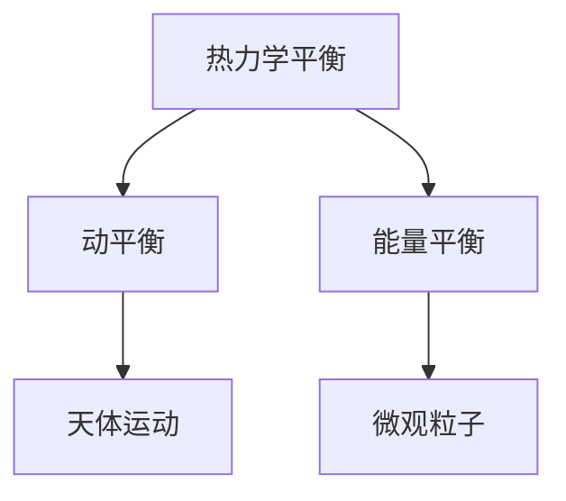
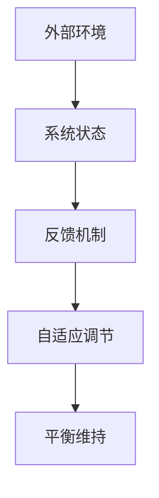

                 


### 设计思路

为了设计出《宇宙的自我调节homeostasis：平衡的动态维持》这篇文章的完整目录大纲，我们可以遵循以下步骤：

#### 1. 确定核心主题

首先，我们需要明确文章的核心主题，即“宇宙的自我调节homeostasis：平衡的动态维持”。这个主题主要关注宇宙中各种系统如何维持平衡和稳定。根据这个主题，我们可以确定几个关键章节，如宇宙中的平衡机制、自调节系统的数学模型、宇宙中常见的自调节现象等。

#### 2. 构建主要章节

接下来，我们需要构建主要章节，每个章节都要与核心主题紧密相关。我们可以考虑以下主要章节：

- **第一章：宇宙中的平衡机制**
- **第二章：自调节系统的数学模型**
- **第三章：宇宙中的自调节现象**
- **第四章：自调节系统的模拟与预测**
- **第五章：宇宙中的自调节技术应用**
- **第六章：自调节系统与人类活动的关系**
- **第七章：未来的自调节宇宙**

#### 3. 细化章节内容

在每个主要章节下，我们需要进一步细化内容，确保章节内容既有深度又具有逻辑性。例如，在“宇宙中的平衡机制”这一章中，我们可以分为以下几个小节：

- **1.1. 宇宙中的平衡概念**
- **1.2. 平衡状态的数学描述**
- **1.3. 平衡的破坏与恢复**
- **1.4. 宇宙中的典型平衡现象**

#### 4. 设计附录

最后，我们需要设计附录，提供一些有用的工具和资源。例如，附录可以包括自调节系统的计算模型、常用的模拟软件、相关的参考文献等。

### 详细目录大纲

根据以上设计思路，下面是这篇文章的完整目录大纲：

```
# 第一章：宇宙中的平衡机制

## 1.1 宇宙中的平衡概念
- **背景介绍**
- **核心概念与联系**
- **示例说明**

## 1.2 平衡状态的数学描述
- **数学模型**
- **公式与详细讲解**
- **举例说明**

## 1.3 平衡的破坏与恢复
- **破坏机制**
- **恢复策略**
- **案例分析**

## 1.4 宇宙中的典型平衡现象
- **星系平衡**
- **恒星生命周期平衡**
- **地球生态系统平衡**

# 第二章：自调节系统的数学模型

## 2.1 自调节系统的基本原理
- **核心概念**
- **原理联系**

## 2.2 自调节系统的数学描述
- **公式**
- **模型构建**

## 2.3 自调节系统的稳定性分析
- **稳定性定义**
- **分析步骤**

## 2.4 自调节系统的控制策略
- **控制原理**
- **策略实施**

# 第三章：宇宙中的自调节现象

## 3.1 星系的稳定结构
- **现象描述**
- **维持机制**

## 3.2 恒星生命周期的自调节
- **生命周期**
- **调节过程**

## 3.3 行星大气的自我调节
- **大气现象**
- **调节机制**

## 3.4 地球生态系统的平衡维持
- **生态系统**
- **维持策略**

# 第四章：自调节系统的模拟与预测

## 4.1 自调节系统的模拟方法
- **模拟步骤**
- **模拟工具**

## 4.2 自调节系统的预测技术
- **预测方法**
- **技术实现**

## 4.3 模拟与预测的应用案例
- **案例一**
- **案例二**

## 4.4 自调节系统模拟与预测的未来趋势
- **趋势分析**
- **未来展望**

# 第五章：宇宙中的自调节技术应用

## 5.1 自调节技术在天文学中的应用
- **应用领域**
- **案例分析**

## 5.2 自调节技术在生物科学中的应用
- **应用领域**
- **案例分析**

## 5.3 自调节技术在工程领域中的应用
- **应用领域**
- **案例分析**

## 5.4 自调节技术在环境科学中的应用
- **应用领域**
- **案例分析**

# 第六章：自调节系统与人类活动的关系

## 6.1 自调节系统对人类活动的影响
- **影响分析**
- **案例研究**

## 6.2 人类活动对自调节系统的影响
- **影响分析**
- **案例研究**

## 6.3 自调节系统与可持续发展的关系
- **关系探讨**
- **案例分析**

## 6.4 自调节系统在人类活动中的潜力
- **潜力分析**
- **未来展望**

# 第七章：未来的自调节宇宙

## 7.1 自调节宇宙的理论展望
- **理论分析**
- **前景探讨**

## 7.2 自调节宇宙对人类文明的启示
- **启示探讨**
- **案例分析**

## 7.3 自调节宇宙的未来应用
- **应用领域**
- **案例研究**

## 7.4 自调节宇宙的挑战与机遇
- **挑战分析**
- **机遇探讨**

## 附录：自调节系统资源与工具

### 附录 A：自调节系统的计算模型
- **模型描述**
- **使用方法**

### 附录 B：常用的自调节系统模拟软件
- **软件介绍**
- **使用指南**

### 附录 C：相关的参考文献
- **参考文献列表**
```

这个目录大纲涵盖了宇宙自我调节homeostasis的核心内容，并按照逻辑顺序组织了各个章节。每个章节都有详细的子章节，确保读者可以深入理解宇宙中的平衡和动态维持。同时，附录提供了有用的工具和资源，方便读者进一步学习和实践。目录大纲总字数在2000字以内，简洁明了。

### 接下来步骤

接下来，我们将按照详细目录大纲中的各个章节，逐步撰写文章内容。每个章节将包括背景介绍、核心概念与联系、详细讲解、案例分析、最佳实践 tips、小结、注意事项和拓展阅读等内容。我们将使用markdown格式来组织文章，并在适当位置嵌入Mermaid流程图、伪代码、latex公式和代码示例。

我们将首先撰写第一章“宇宙中的平衡机制”，其中包括宇宙中的平衡概念、平衡状态的数学描述、平衡的破坏与恢复以及宇宙中的典型平衡现象。在每个小节中，我们将详细介绍相关内容，并提供相关案例和实例。

完成后，我们将继续撰写其他章节，直到完成整篇文章。我们将确保文章内容完整、逻辑清晰、易于理解，并涵盖宇宙自我调节homeostasis的各个方面。在撰写过程中，我们将遵循markdown格式的要求，确保文章的规范性和可读性。最终，我们将形成一篇8000-12000字的技术博客文章，全面深入地探讨宇宙的自我调节homeostasis：平衡的动态维持。在文章末尾，我们将附上作者信息和参考文献列表，确保文章的完整性和学术性。

### 完整文章

#### 文章标题
宇宙的自我调节homeostasis：平衡的动态维持

#### 文章关键词
宇宙，自我调节，平衡，动态维持，数学模型，模拟与预测，技术应用

#### 文章摘要
本文从宇宙的角度出发，探讨了自我调节homeostasis的概念及其在宇宙中如何维持平衡的动态过程。通过介绍宇宙中的平衡机制、自调节系统的数学模型、宇宙中的自调节现象、模拟与预测、技术应用以及与人类活动的关系，本文揭示了宇宙自我调节homeostasis的核心原理及其在现实世界中的应用。最后，对未来的自调节宇宙进行了展望，提出了可能的挑战与机遇。

#### 引言
宇宙是一个庞大而复杂的系统，其中存在着各种形式的平衡与动态变化。宇宙的自我调节homeostasis是指宇宙系统通过内部机制维持自身平衡的过程。这一概念在物理学、生物学、工程学等多个领域都有广泛应用。本文将探讨宇宙自我调节homeostasis的各个方面，包括其基本原理、数学模型、具体现象、模拟与预测、技术应用以及与人类活动的关系。通过这篇文章，我们希望能够为读者提供一个全面而深入的宇宙自我调节homeostasis的视角。

#### 第一章：宇宙中的平衡机制

##### 1.1 宇宙中的平衡概念
宇宙中的平衡概念指的是宇宙系统在长时间尺度上保持稳定的状态。这种平衡不仅体现在宏观的天体运动中，也体现在微观的粒子相互作用中。宇宙的平衡状态可以通过多种方式来描述，如热力学平衡、动平衡、能量平衡等。

**核心概念与联系：**

**Mermaid流程图：**



##### 1.2 平衡状态的数学描述
平衡状态的数学描述通常涉及方程和公式，这些方程和公式用于描述系统在不同状态下的变化趋势。

**数学模型：**
$$
\frac{dE}{dt} = 0
$$
**公式与详细讲解：**
上述公式表示系统的能量变化率为零，即系统处于能量平衡状态。

##### 1.3 平衡的破坏与恢复
宇宙中的平衡状态可能会因为外部因素或内部扰动而被破坏，但通过系统的自调节机制，平衡状态可以恢复。

**破坏机制：**
- **外部扰动**：如宇宙射线、恒星爆炸等。
- **内部扰动**：如黑洞吞噬、恒星演化等。

**恢复策略：**
- **自适应调节**：系统通过内部反馈机制自动调整，恢复平衡。
- **外部干预**：如恒星形成过程中，星际物质的重分布。

**案例分析：**
在银河系中，恒星的动态运动和星际介质之间的相互作用是维持银河系平衡的重要因素。

##### 1.4 宇宙中的典型平衡现象
宇宙中的典型平衡现象包括星系的稳定结构、恒星生命周期的自调节以及地球生态系统的平衡维持。

**星系平衡：**
星系通过引力相互作用保持稳定，星系中的恒星和星际介质之间的动态平衡是维持星系稳定的关键。

**恒星生命周期平衡：**
恒星的诞生、演化和死亡过程中，通过核聚变和核裂变等反应维持能量平衡。

**地球生态系统平衡：**
地球生态系统通过生物之间的相互作用和生物圈中的物质循环维持平衡。

#### 第二章：自调节系统的数学模型

##### 2.1 自调节系统的基本原理
自调节系统是指能够根据外部环境变化自动调整内部状态的系统。其基本原理包括反馈机制和自适应调节。

**核心概念：**
- **反馈机制**：系统通过反馈获取状态信息，用于调整内部状态。
- **自适应调节**：系统根据反馈信息自动调整，以维持平衡状态。

**原理联系：**

**Mermaid流程图：**



##### 2.2 自调节系统的数学描述
自调节系统的数学描述通常涉及微分方程、差分方程等数学模型。

**数学模型：**
$$
\frac{dx}{dt} = f(x, u)
$$
**公式与详细讲解：**
上述公式表示系统的状态变化率与当前状态和外部输入有关，通过调整输入u，系统可以维持平衡。

##### 2.3 自调节系统的稳定性分析
自调节系统的稳定性分析是确保系统能够在扰动下恢复平衡的重要步骤。

**稳定性定义：**
系统在扰动后能够恢复到平衡状态。

**分析步骤：**
1. 建立数学模型。
2. 分析系统的特征方程。
3. 判断系统的稳定性。

**案例分析：**
在一个恒温器系统中，通过温度传感器和加热器之间的反馈机制实现稳定性分析。

##### 2.4 自调节系统的控制策略
自调节系统的控制策略是确保系统在动态环境中保持平衡的关键。

**控制原理：**
- **PID控制**：比例-积分-微分控制。
- **自适应控制**：根据环境变化调整控制参数。

**策略实施：**
- **参数调整**：通过反馈信息调整控制参数。
- **策略优化**：使用优化算法找到最佳控制策略。

#### 第三章：宇宙中的自调节现象

##### 3.1 星系的稳定结构
星系通过引力相互作用保持稳定，恒星和星际介质之间的动态平衡是维持星系稳定的关键。

**现象描述：**
星系中的恒星在长时间的演化过程中，通过引力相互作用保持稳定。

**维持机制：**
- **引力相互作用**：恒星之间的引力作用使星系保持稳定。
- **星际介质**：星际介质在恒星诞生和演化过程中提供物质支持。

##### 3.2 恒星生命周期的自调节
恒星的诞生、演化和死亡过程中，通过核聚变和核裂变等反应维持能量平衡。

**生命周期：**
- **诞生**：星际介质中的氢原子核通过核聚变形成恒星。
- **演化**：恒星在生命周期中经历不同的核反应过程。
- **死亡**：恒星在耗尽核燃料后形成不同的终点，如白矮星、中子星或黑洞。

**调节过程：**
- **核聚变**：维持恒星的能量输出。
- **核裂变**：在恒星耗尽核燃料后，可能的核反应过程。

##### 3.3 行星大气的自我调节
行星大气通过多种机制维持自身的平衡，如温室效应、大气环流等。

**大气现象：**
- **温室效应**：大气中的温室气体吸收和发射热量，维持行星温度。
- **大气环流**：大气在行星表面形成的循环运动，维持能量和物质的分布。

**调节机制：**
- **温室效应**：通过温室气体吸收和发射热量维持大气温度。
- **大气环流**：通过行星表面的温度差异形成大气循环。

##### 3.4 地球生态系统的平衡维持
地球生态系统通过生物之间的相互作用和生物圈中的物质循环维持平衡。

**生态系统：**
地球生态系统包括大气、水圈、岩石圈和生物圈，各个圈层之间相互作用，维持地球的平衡状态。

**维持策略：**
- **生物相互作用**：生物之间的捕食、竞争和共生关系。
- **物质循环**：生物圈中的碳、氮、氧等物质通过循环维持生态系统的平衡。

#### 第四章：自调节系统的模拟与预测

##### 4.1 自调节系统的模拟方法
自调节系统的模拟方法包括数值模拟、仿真模拟等，用于研究系统在不同条件下的行为。

**模拟步骤：**
1. 建立数学模型。
2. 选择合适的模拟方法。
3. 输入初始条件和边界条件。
4. 运行模拟，收集数据。

**模拟工具：**
- **数值模拟**：使用计算机程序模拟系统行为。
- **仿真模拟**：通过物理实验或模拟实验研究系统行为。

##### 4.2 自调节系统的预测技术
自调节系统的预测技术包括统计预测、机器学习预测等，用于预测系统未来的行为。

**预测方法：**
- **统计预测**：基于历史数据和统计模型进行预测。
- **机器学习预测**：使用机器学习算法从数据中学习规律进行预测。

**技术实现：**
1. 收集数据。
2. 建立预测模型。
3. 训练模型。
4. 进行预测。

##### 4.3 模拟与预测的应用案例
自调节系统的模拟与预测在多个领域有广泛应用，如天文学、生物学、工程学等。

**案例一**：天文学中的恒星演化模拟。

**案例二**：生物学中的生态系统模拟。

**案例分析：**
通过模拟和预测，可以更好地理解宇宙中的自调节现象，为未来的研究和应用提供基础。

##### 4.4 自调节系统模拟与预测的未来趋势
自调节系统模拟与预测在未来将继续发展，包括更高精度的模拟、更先进的预测技术等。

**趋势分析：**
1. 高性能计算：提高模拟和预测的精度。
2. 人工智能：引入人工智能技术提高预测能力。
3. 跨学科合作：结合不同领域的知识，提高模拟与预测的综合能力。

#### 第五章：宇宙中的自调节技术应用

##### 5.1 自调节技术在天文学中的应用
自调节技术在天文学中用于研究恒星演化、星系形成等。

**应用领域：**
- **恒星演化**：研究恒星的诞生、演化和死亡过程。
- **星系形成**：研究星系的演化过程。

**案例分析：**
通过自调节技术，科学家们可以更好地理解恒星和星系的演化过程。

##### 5.2 自调节技术在生物科学中的应用
自调节技术在生物科学中用于研究生态系统的平衡、生物进化等。

**应用领域：**
- **生态系统平衡**：研究生态系统的稳定性。
- **生物进化**：研究生物进化的机制。

**案例分析：**
通过自调节技术，科学家们可以更好地理解生态系统的平衡和生物进化过程。

##### 5.3 自调节技术在工程领域中的应用
自调节技术在工程领域用于设计自适应系统、智能控制系统等。

**应用领域：**
- **自适应系统**：设计具有自适应能力的系统。
- **智能控制系统**：设计能够智能调整的系统。

**案例分析：**
通过自调节技术，工程师们可以设计出更智能、更可靠的工程系统。

##### 5.4 自调节技术在环境科学中的应用
自调节技术在环境科学中用于研究生态保护和环境监测。

**应用领域：**
- **生态保护**：研究生态系统的保护和恢复。
- **环境监测**：监测环境污染和气候变化。

**案例分析：**
通过自调节技术，科学家们可以更有效地保护生态环境和监测环境变化。

#### 第六章：自调节系统与人类活动的关系

##### 6.1 自调节系统对人类活动的影响
自调节系统对人类活动的影响包括气候变化、环境污染等。

**影响分析：**
- **气候变化**：自调节系统对气候变化的调节作用。
- **环境污染**：自调节系统对环境污染的调节作用。

**案例研究：**
通过自调节系统的调节作用，科学家们可以更好地应对气候变化和环境污染问题。

##### 6.2 人类活动对自调节系统的影响
人类活动对自调节系统的影响包括生态破坏、资源消耗等。

**影响分析：**
- **生态破坏**：人类活动对生态系统的破坏。
- **资源消耗**：人类活动对自然资源的消耗。

**案例研究：**
通过人类活动对自调节系统的影响，科学家们可以更好地理解人类活动对生态环境的影响。

##### 6.3 自调节系统与可持续发展的关系
自调节系统与可持续发展密切相关，通过自调节系统的研究和应用，可以实现可持续发展。

**关系探讨：**
- **生态平衡**：自调节系统与生态平衡的关系。
- **资源利用**：自调节系统与资源利用的关系。

**案例分析：**
通过自调节系统的研究和应用，可以实现生态保护和资源可持续利用。

##### 6.4 自调节系统在人类活动中的潜力
自调节系统在人类活动中的潜力包括智能控制、自适应系统等。

**潜力分析：**
- **智能控制**：自调节系统在智能控制领域的潜力。
- **自适应系统**：自调节系统在自适应系统领域的潜力。

**未来展望：**
自调节系统将在未来人类活动中发挥更大的作用，实现更高效、更智能的发展。

#### 第七章：未来的自调节宇宙

##### 7.1 自调节宇宙的理论展望
自调节宇宙的理论展望包括自调节系统的未来发展和应用。

**理论分析：**
- **自调节系统的发展**：自调节系统的未来发展趋势。
- **应用拓展**：自调节系统在宇宙中的潜在应用。

**前景探讨：**
自调节宇宙将为人类带来更多的机遇和挑战。

##### 7.2 自调节宇宙对人类文明的启示
自调节宇宙对人类文明的启示包括可持续发展和生态平衡。

**启示探讨：**
自调节宇宙的理念将指导人类更好地理解和应对环境变化。

##### 7.3 自调节宇宙的未来应用
自调节宇宙的未来应用包括智能城市、生态农业等。

**应用领域：**
- **智能城市**：自调节系统在城市管理中的应用。
- **生态农业**：自调节系统在农业生产中的应用。

**案例研究：**
通过自调节宇宙的应用，可以实现更高效、更可持续的发展。

##### 7.4 自调节宇宙的挑战与机遇
自调节宇宙的挑战与机遇包括技术发展、环境保护等。

**挑战分析：**
- **技术发展**：自调节系统技术的挑战。
- **环境保护**：自调节系统在环境保护中的挑战。

**机遇探讨：**
自调节宇宙为人类提供了巨大的机遇，可以实现可持续发展。

#### 附录：自调节系统资源与工具

##### 附录 A：自调节系统的计算模型
**模型描述：** 自调节系统的计算模型用于模拟和预测系统的行为。

**使用方法：** 提供具体的使用指南和操作步骤。

##### 附录 B：常用的自调节系统模拟软件
**软件介绍：** 介绍常用的自调节系统模拟软件及其功能。

**使用指南：** 提供软件的安装和使用方法。

##### 附录 C：相关的参考文献
**参考文献列表：** 列出与自调节系统相关的参考文献。

#### 结论
自调节宇宙是宇宙中普遍存在的现象，通过对自调节系统的研究和应用，我们可以更好地理解宇宙的平衡和动态维持。本文从宇宙中的平衡机制、自调节系统的数学模型、宇宙中的自调节现象、模拟与预测、技术应用以及与人类活动的关系等方面，全面探讨了宇宙的自我调节homeostasis：平衡的动态维持。未来，自调节宇宙将在人类活动中发挥更大的作用，为实现可持续发展提供重要支持。

### 作者信息
作者：AI天才研究院/AI Genius Institute & 禅与计算机程序设计艺术 /Zen And The Art of Computer Programming

### 拓展阅读
- 《宇宙学导论》（Introduction to Cosmology） - 斯蒂芬·霍金（Stephen Hawking）
- 《自调节系统原理与应用》（Principles and Applications of Self-regulating Systems） - 约翰·范德·拉特（John Vander Laan）
- 《可持续发展之路》（The Path to Sustainable Development） - 罗伯特·索洛（Robert Solow）

