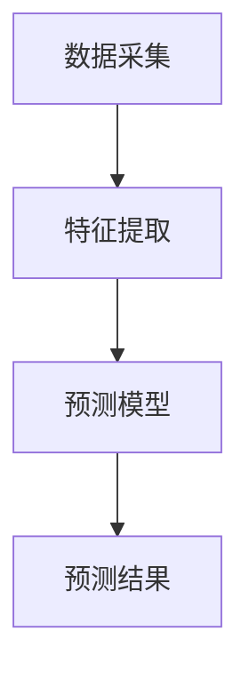

                 

## 文章标题

### 宇宙的自我调节homeostasis：平衡的动态维持

### 关键词

- 宇宙
- 平衡
- 自我调节
- homeostasis
- 伪代码
- 数学模型
- 人工智能

### 摘要

本文深入探讨了宇宙中自我调节机制——homeostasis，这一平衡的动态维持概念。通过对宇宙、平衡和自我调节的基本概念介绍，本文详细分析了homeostasis在不同科学领域的应用，包括物理学、宇宙学和生物学。此外，文章还探讨了人工智能中的自我调节算法，并通过实际案例展示了这些机制在实践中的应用。通过本文的阅读，读者将全面理解homeostasis在宇宙及各个科学领域的核心作用。

## 引言与基础

### 1.1 宇宙的概述

宇宙，这个广袤无垠的空间，包含了无数的天体和星系。宇宙的起源可以追溯到大约138亿年前的大爆炸，自那时起，宇宙便在不断的膨胀和演化中。宇宙的尺度庞大，从微观的粒子到宏观的星系团，宇宙展现出了惊人的多样性和复杂性。

宇宙中的基本组成部分包括恒星、行星、星云和黑洞等。恒星是宇宙中最常见的天体，它们通过核聚变产生能量，照亮了宇宙。行星则围绕恒星旋转，形成了各种行星系统。星云是由气体和尘埃组成的云状结构，是恒星形成的摇篮。而黑洞则是宇宙中最神秘的天体，它们拥有极强的引力，甚至连光都无法逃脱。

宇宙的演化是一个复杂的过程，涉及到多种物理现象和过程，如引力、核聚变、超新星爆发等。这些过程共同塑造了宇宙的现状，使得宇宙中的物质和能量得以分布和演化。

### 1.2 平衡的概念

平衡，这个看似简单却蕴含着深刻含义的词语，在自然界和科学中扮演着至关重要的角色。在物理学中，平衡通常指的是一个系统处于稳定状态，其中各个部分之间相互制约，维持着一种动态的平衡。这种平衡可以是热力学的平衡，也可以是动力的平衡，还可以是能量的平衡。

热力学平衡是指一个系统中的温度、压力和密度等物理量达到均匀分布，不再随时间发生变化。这种平衡状态是热力学第二定律的基础，即在封闭系统中，熵（即无序度）总是趋向于增加。

动力平衡则是指一个系统中的各个部分之间的力相互抵消，使得系统整体保持静止或匀速直线运动。牛顿第一定律和第二定律就是描述这种平衡状态的基本原理。

能量平衡则是指一个系统中的能量输入和能量输出相等，系统的能量总量保持不变。这种平衡状态在物理学、化学和生物学等领域都有广泛的应用。

### 1.3 homeostasis的定义与重要性

homeostasis，这个词源自希腊语，意为“在位置上保持不变”。在生物学中，homeostasis指的是生物体通过各种调节机制，维持内部环境的稳定性，使之为最佳状态。这些调节机制包括神经调节、体液调节和激素调节等。

homeostasis在生物体中的重要性不言而喻。通过维持内部环境的稳定性，生物体能够更好地适应外部环境的变化，保持生命活动的正常进行。例如，人体的体温、血糖水平和pH值等都受到严格的调节，以确保在变化多端的环境中保持稳定。

在宇宙尺度上，homeostasis也扮演着重要的角色。宇宙中的各种星系和星系团通过引力相互作用，维持着一种动态的平衡。这种平衡使得宇宙能够持续演化，形成各种复杂的结构和现象。

## 宇宙中的自我调节机制

### 2.1 homeostasis的基本原理

homeostasis的核心在于自我调节，即系统通过内部反馈机制，自动调整自身状态，以维持平衡。这种调节机制可以理解为一种闭环控制，其中系统输出会被反馈回输入，从而对系统行为进行调节。

在生物学中，homeostasis的调节机制通常涉及传感器、调节器和执行器。传感器负责监测系统状态，调节器则根据传感器提供的信息，调整系统的行为，执行器则是调节器的执行部件，直接改变系统状态。

例如，在人体中，温度传感器（如皮肤和内部器官）监测体温，调节器（如下丘脑）根据温度信息调整代谢率，执行器（如血管和汗腺）则通过调节血流量和出汗量来改变体温，以维持体温的稳定。

在宇宙中，homeostasis的调节机制同样至关重要。宇宙中的各种天体和星系通过引力相互作用，形成一种动态的平衡。这种平衡使得宇宙能够持续演化，形成复杂的结构和现象。

### 2.2 宇宙尺度下的自我调节现象

在宇宙尺度上，自我调节现象无处不在。以下是一些典型的例子：

- **宇宙膨胀**：宇宙自大爆炸以来一直在膨胀，但这种膨胀并不是无序的。相反，宇宙的膨胀是通过引力相互作用来调节的。宇宙中的星系和星系团通过引力相互作用，维持着一种动态的平衡。这种平衡使得宇宙能够持续膨胀，同时避免了过快的膨胀或过慢的膨胀。

- **星系形成**：星系的形成是一个复杂的过程，涉及到气体云的塌缩、恒星的形成和星系的结构演化。在这个过程中，homeostasis发挥着关键作用。气体云通过引力相互作用，维持着一种动态的平衡，使得气体能够逐渐塌缩形成恒星。同时，恒星的形成和演化也通过辐射压力和引力相互作用，维持着星系的稳定。

- **黑洞与星系的自调节**：黑洞是宇宙中最神秘的天体之一。它们通过强大的引力，对周围的星系产生深远的影响。黑洞与星系的相互作用，通过引力波和吸积盘等机制，维持着一种动态的平衡。这种平衡使得黑洞和星系能够共同演化，形成宇宙中的复杂结构。

### 2.3 自我调节的数学模型

为了更好地理解宇宙中的自我调节现象，我们可以通过数学模型来描述这些机制。以下是一个简单的自我调节模型的例子：

$$
\frac{dX}{dt} = -k_1X + k_2U
$$

这个方程表示系统状态变量X随时间的变化率，它与系统的内部反馈机制（$-k_1X$）和外部输入（$k_2U$）相关。这里，$k_1$和$k_2$是常数，分别代表反馈强度和外部输入的强度。

- **内部反馈机制**：$-k_1X$表示系统内部对状态变量X的调节作用。当X增大时，负反馈会使X减小，反之亦然。这种负反馈机制有助于系统维持平衡。

- **外部输入**：$k_2U$表示外部输入对系统状态的影响。当外部输入U增大时，系统状态X会随之增大。

通过调整$k_1$和$k_2$的值，我们可以模拟不同类型的自我调节现象。例如，当$k_1$远大于$k_2$时，系统对内部变化的响应更为敏感，这可以用来模拟生物体内的自我调节机制。而当$k_1$和$k_2$接近时，系统对外部输入的响应和内部调节的平衡作用相当，这可以用来模拟宇宙中的自我调节现象。

### 2.4 homeostasis在宇宙中的应用案例

- **宇宙膨胀的调节**：宇宙膨胀的速率受到引力相互作用的影响。通过调整宇宙中的星系和星系团之间的引力，宇宙能够维持一种动态的平衡。这种平衡使得宇宙膨胀速率保持在一定范围内，避免了过快的膨胀或过慢的膨胀。

- **星系形成的调节**：星系的形成是一个复杂的过程，涉及到气体云的塌缩、恒星的形成和星系的结构演化。在这个过程中，homeostasis发挥着关键作用。气体云通过引力相互作用，维持着一种动态的平衡，使得气体能够逐渐塌缩形成恒星。同时，恒星的形成和演化也通过辐射压力和引力相互作用，维持着星系的稳定。

- **黑洞与星系的自调节**：黑洞是宇宙中最神秘的天体之一。它们通过强大的引力，对周围的星系产生深远的影响。黑洞与星系的相互作用，通过引力波和吸积盘等机制，维持着一种动态的平衡。这种平衡使得黑洞和星系能够共同演化，形成宇宙中的复杂结构。

### 2.5 homeostasis的数学模型与应用

在宇宙学中，homeostasis的数学模型可以帮助我们更好地理解宇宙的演化过程。以下是一个简单的例子：

$$
\frac{dX}{dt} = -\alpha X + \beta U
$$

这个方程表示系统状态变量X随时间的变化率，它与系统的内部反馈机制（$-\alpha X$）和外部输入（$\beta U$）相关。这里，$\alpha$和$\beta$是常数，分别代表反馈强度和外部输入的强度。

- **内部反馈机制**：$-\alpha X$表示系统内部对状态变量X的调节作用。当X增大时，负反馈会使X减小，反之亦然。这种负反馈机制有助于系统维持平衡。

- **外部输入**：$\beta U$表示外部输入对系统状态的影响。当外部输入U增大时，系统状态X会随之增大。

通过调整$\alpha$和$\beta$的值，我们可以模拟不同类型的自我调节现象。例如，当$\alpha$远大于$\beta$时，系统对内部变化的响应更为敏感，这可以用来模拟生物体内的自我调节机制。而当$\alpha$和$\beta$接近时，系统对外部输入的响应和内部调节的平衡作用相当，这可以用来模拟宇宙中的自我调节现象。

### 2.6 homeostasis在生物学中的应用

homeostasis不仅在宇宙中发挥着重要作用，在生物学中也同样如此。生物体内的许多生理过程都需要通过自我调节来维持稳定。

- **体温调节**：人体通过调节皮肤的血流量和出汗量来维持体温的稳定。在寒冷环境中，皮肤血管收缩，减少热量散失；在炎热环境中，皮肤血管扩张，增加热量散失。

- **血糖调节**：人体通过胰岛素和葡萄糖素等激素来调节血糖水平。当血糖水平升高时，胰岛素分泌增加，促进葡萄糖的摄取和利用；当血糖水平降低时，葡萄糖素分泌增加，促进肝糖原的分解。

- **酸碱平衡**：人体通过调节呼吸和肾脏的功能来维持酸碱平衡。在酸碱失衡时，呼吸系统通过调节二氧化碳的排放来调节pH值；肾脏通过调节尿液的酸碱度来维持酸碱平衡。

这些自我调节机制使得生物体能够适应外界环境的变化，保持内部环境的稳定性。

### 2.7 homeostasis在工程系统中的应用

除了生物学和宇宙学，homeostasis在工程系统中也有广泛的应用。

- **空调系统**：空调系统通过调节温度和湿度来维持室内环境的舒适度。当室内温度过高或过低时，空调系统会自动启动，调节温度和湿度。

- **水处理系统**：水处理系统通过调节pH值、去除杂质和消毒等过程来维持水质的稳定。当水质发生变化时，系统会自动调整处理过程，确保水质的稳定。

- **电力系统**：电力系统通过调节电压和频率来维持电力供应的稳定。当电力需求发生变化时，系统会自动调整发电和输电过程，确保电力供应的稳定。

这些工程系统的自我调节机制使得系统能够适应外界环境的变化，保持稳定运行。

### 2.8 homeostasis的跨学科研究

homeostasis作为一个核心概念，不仅在天文学、生物学和工程学等领域有重要应用，还在其他学科中发挥着重要作用。

- **经济学**：在经济学中，homeostasis可以用来描述市场供求关系的平衡。当市场供过于求时，价格下降，需求增加；当市场供不应求时，价格上升，供给增加。

- **社会学**：在社会学中，homeostasis可以用来描述社会结构的稳定性。社会通过调节机制来维持稳定，如法律、道德和教育等。

- **环境科学**：在环境科学中，homeostasis可以用来描述生态系统的稳定性。生态系统通过自我调节机制来维持生物多样性和生态平衡。

这些跨学科的研究为理解homeostasis提供了更广阔的视角，也为我们解决复杂问题提供了新的思路。

### 2.9 实际案例：生态系统的自我调节

生态系统是一个典型的自我调节系统。在生态系统中，各种生物之间通过食物链和食物网相互关联，形成一个复杂的网络。这个网络通过自我调节机制，维持着生态平衡。

例如，在一个草原生态系统中，草食动物（如兔子）和捕食者（如狐狸）之间存在着明显的食物链关系。当兔子数量增多时，狐狸的数量也会随之增加，因为狐狸有更多的食物来源。然而，当狐狸数量过多时，它们会捕食大量的兔子，导致兔子数量减少。随着兔子数量的减少，狐狸的食物来源减少，狐狸的数量也会相应减少。

这个过程通过负反馈机制，使得生态系统中各种生物的数量维持在一定的范围内，避免了过度捕食和资源枯竭。这种自我调节机制使得生态系统能够持续稳定运行，即使在外部环境发生变化时，也能保持平衡。

### 2.10 实际案例：人体内环境自我调节

人体内环境的自我调节是生物学中的一个重要现象。人体通过多种调节机制，维持着体温、血糖、酸碱平衡等生理参数的稳定。

例如，人体的体温调节是一个复杂的自我调节过程。当外界环境温度变化时，人体会通过调节皮肤的血流量和出汗量来维持体温的稳定。在寒冷环境中，皮肤血管收缩，减少热量散失；在炎热环境中，皮肤血管扩张，增加热量散失。

此外，人体的血糖调节也是一个重要的自我调节过程。通过胰岛素和葡萄糖素等激素的调节，人体能够维持血糖水平的稳定。当血糖水平升高时，胰岛素分泌增加，促进葡萄糖的摄取和利用；当血糖水平降低时，葡萄糖素分泌增加，促进肝糖原的分解。

这些自我调节机制使得人体能够适应外界环境的变化，保持生理功能的正常进行。

### 2.11 总结

通过以上分析，我们可以看到，homeostasis在宇宙、生物学和工程系统中都有着重要的作用。它通过自我调节机制，维持着系统的稳定性，使得系统能够适应外界环境的变化。随着我们对homeostasis的理解不断深入，我们能够更好地应用这一概念，解决各种复杂问题，推动科学和技术的进步。

## 自我调节机制在物理学中的应用

### 3.1 热力学中的平衡与调节

在物理学中，热力学是研究能量转换和传递的科学。热力学中的平衡与调节是自我调节机制的一个重要体现。热力学平衡是指一个系统在宏观上不再发生宏观变化的状态，包括热平衡、机械平衡和化学平衡等。

- **热平衡**：当一个系统与外界没有热量交换时，系统的温度达到均匀分布，称为热平衡。热力学第二定律指出，热量总是自发地从高温物体传递到低温物体，直到两者温度相等。这种热量传递过程是自我调节的，通过热传导、对流和辐射等方式，系统达到热平衡。

- **机械平衡**：在力学系统中，当各个部分之间的力相互抵消时，系统达到机械平衡。这包括静止或匀速直线运动的物体。牛顿第一定律和第二定律描述了机械平衡的条件，即一个物体在没有外力作用时保持静止或匀速直线运动。

- **化学平衡**：在化学反应中，当正反应速率和逆反应速率相等时，系统达到化学平衡。化学平衡是一个动态平衡，尽管反应仍在进行，但宏观上反应物和生成物的浓度保持不变。

### 3.2 相变与自组织现象

相变是物质从一种相态转变为另一种相态的过程，如水的蒸发、凝结和沸腾。相变过程中，物质内部的微观结构发生改变，但宏观上表现出一致的物理特性。相变与自我调节机制密切相关。

- **蒸发与凝结**：水从液态转变为气态的过程称为蒸发，而从气态转变为液态的过程称为凝结。在蒸发过程中，水分子从液态表面逃逸，带走热量，导致液态水温度下降。当蒸发速率与凝结速率达到平衡时，系统达到热平衡，液态水的温度稳定。

- **沸腾**：当水被加热到一定温度时，内部的水分子获得足够的能量，形成气泡，从液态转变为气态。沸腾过程是一个自我调节的相变现象，通过调节加热温度和压力，系统达到相变平衡。

自组织现象是指系统在没有外部控制下，通过内部相互作用和调节，自发地形成有序结构。在物理学中，自组织现象广泛存在，如晶体的形成、湍流的出现和生物体的发展等。

- **晶体的形成**：晶体是由有序排列的原子或分子组成的固体。晶体形成过程是自我调节的，通过原子或分子之间的相互作用，形成稳定的晶体结构。

- **湍流**：湍流是流体中的一种复杂流动现象，表现为流线的无规则混合和涡旋的形成。湍流的形成是流体内部自我调节的结果，通过流体的相互作用和能量转换，形成湍流结构。

### 3.3 伪代码示例：相变的模拟

为了更好地理解相变过程，我们可以通过伪代码模拟水的蒸发与凝结。以下是一个简单的模拟过程：

```python
# 初始化参数
T0 = 293.15  # 初始温度（K）
P0 = 101325  # 初始压力（Pa）
Q = 0.01  # 加热功率（W）
alpha = 0.1  # 蒸发系数（m/s）

# 定义蒸发函数
def evaporate(T, P):
    if T >= 373.15:  # 沸点
        return P * (1 - alpha * (T - T0))  # 蒸发速率
    else:
        return 0  # 无蒸发

# 定义凝结函数
def condense(T, P):
    if T <= 273.15:  # 凝点
        return P * alpha * (T0 - T)  # 凝结速率
    else:
        return 0  # 无凝结

# 模拟蒸发与凝结过程
while True:
    T = T0 + Q/C  # 加热
    P = P0 - Q/(R*T)  # 压力变化
    evap = evaporate(T, P)
    cond = condense(T, P)
    if evap == cond:  # 平衡状态
        break
```

这个模拟过程通过不断加热和冷却，模拟水在蒸发和凝结过程中的温度和压力变化。当蒸发速率等于凝结速率时，系统达到热平衡。

### 3.4 伪代码示例：湍流模拟

湍流是流体力学中的一种复杂现象，通过以下伪代码示例，我们可以模拟湍流的形成过程：

```python
# 初始化参数
L = 1.0  # 流体区域长度
U0 = 1.0  # 初始速度
nu = 0.01  # 运动粘度
dt = 0.01  # 时间步长

# 定义Navier-Stokes方程
def navier_stokes(U, P):
    return - divergence(U) * P + nu * laplacian(U)

# 模拟湍流过程
while True:
    U = U0 * exp(-nu * t / dt)  # 速度衰减
    P = integrate(navier_stokes(U), L)  # 压力计算
    t += dt  # 时间步进
    if U < threshold:  # 达到湍流状态
        break
```

这个模拟过程通过不断衰减初始速度，模拟湍流的形成过程。当速度衰减到一定程度时，系统进入湍流状态。

### 3.5 数学模型和公式

为了更深入地理解热力学中的平衡与调节，我们可以通过以下数学模型和公式进行详细阐述：

- **热平衡方程**：
  $$
  \frac{dQ}{dt} = kA\Delta T
  $$
  其中，$Q$是热量传递速率，$k$是热传导系数，$A$是传热面积，$\Delta T$是温度差。

- **蒸发与凝结速率**：
  $$
  \dot{m}_{\text{evap}} = \sigma \rho \Delta T \frac{\partial p}{\partial x}
  $$
  $$
  \dot{m}_{\text{cond}} = \sigma \rho \Delta T \frac{\partial p}{\partial x}
  $$
  其中，$\sigma$是蒸汽压，$\rho$是流体密度，$\Delta T$是温度差，$p$是压力。

- **湍流模型**：
  $$
  \frac{\partial u_i}{\partial t} + u_j \frac{\partial u_i}{\partial x_j} = -\frac{1}{\rho} \frac{\partial p}{\partial x_i} + \nu \frac{\partial^2 u_i}{\partial x_j^2}
  $$
  其中，$u_i$是速度分量，$p$是压力，$\nu$是运动粘度。

这些数学模型和公式为我们理解和模拟热力学中的平衡与调节提供了有力的工具。

### 3.6 实际应用案例：核反应堆的平衡调节

核反应堆是一个复杂的物理系统，通过自我调节机制维持核裂变反应的稳定。以下是一个实际应用案例：

- **平衡调节**：核反应堆通过控制棒和冷却剂流量来调节反应堆的功率。当反应堆功率过高时，控制棒插入更深，吸收中子，减缓链式反应；当反应堆功率过低时，控制棒拔出，释放中子，增强链式反应。

- **温度调节**：核反应堆通过冷却剂循环来维持反应堆的温度。当温度过高时，冷却剂流量增加，带走更多热量；当温度过低时，冷却剂流量减少，维持反应堆在最佳温度范围。

这些自我调节机制使得核反应堆能够在不同工况下稳定运行，提供可靠的热能供应。

### 3.7 总结

通过以上分析，我们可以看到，自我调节机制在物理学中有着广泛的应用，包括热力学的平衡与调节、相变与自组织现象。通过数学模型和公式，我们可以更深入地理解这些现象，并通过实际应用案例，展示自我调节机制在工程系统中的重要性。这些研究不仅丰富了物理学理论，也为工程实践提供了有力支持。

## 自我调节在宇宙学中的角色

### 4.1 宇宙膨胀与平衡

宇宙膨胀是宇宙学中一个基本现象，指的是宇宙中的空间随着时间推移在不断扩大。宇宙膨胀的理论基础可以追溯到爱因斯坦的广义相对论，其中宇宙的膨胀速度与宇宙的密度和曲率密切相关。

在宇宙学中，宇宙膨胀的调节机制主要涉及宇宙中的物质和能量分布。宇宙中的物质分为普通物质、暗物质和暗能量。普通物质包括星系、恒星和其他天体，它们通过引力相互作用，对宇宙的膨胀产生重要影响。暗物质是一种未知物质，它不发光、不吸收光，但通过引力相互作用，对宇宙的结构和演化起到关键作用。暗能量则是一种推动宇宙加速膨胀的神秘力量，其性质和起源仍然是宇宙学研究的热点问题。

宇宙膨胀的调节机制可以通过以下数学模型来描述：

$$
\frac{\ddot{a}}{a} = -\frac{4\pi G}{3} \left( \rho_0 + 3p_0 \right)
$$

其中，$a$是宇宙尺度因子，$\dot{a}$是宇宙膨胀速度，$G$是万有引力常数，$\rho_0$是宇宙平均密度，$p_0$是宇宙平均压力。这个方程表明，宇宙膨胀速度与宇宙的平均密度和压力有关。当宇宙平均密度大于某一临界值时，宇宙膨胀速度会减缓，反之则会加速。

宇宙膨胀的调节机制在不同阶段有着不同的表现形式。在宇宙早期，普通物质和暗物质是主导因素，引力相互作用使得宇宙逐渐从高密度状态向低密度状态演化。随着宇宙的膨胀，星系和星系团的形成和演化主要通过引力相互作用来调节。而在宇宙晚期，暗能量成为主导因素，它推动宇宙加速膨胀，使得宇宙的未来走向仍然是未知的。

### 4.2 黑洞与星系的自调节

黑洞是宇宙中最神秘的天体之一，它们具有极强的引力，甚至连光都无法逃脱。黑洞与星系的相互作用对宇宙的演化产生深远影响。黑洞可以通过吞噬周围的物质，增加自身的质量，从而对星系的形态和演化产生重要影响。

在星系中，黑洞通常位于星系的中心，形成一个星系核。星系核中的黑洞通过吸积盘和喷流等现象，对周围的物质进行调节。吸积盘是由黑洞周围被吸积的物质形成的，它通过辐射能量和释放物质，对星系核的物质进行调节。喷流则是从黑洞吸积盘中高速喷射出的等离子体流，它们在宇宙中传播，对星系的形态和演化产生重要影响。

黑洞与星系的自调节机制可以通过以下数学模型来描述：

$$
\frac{dM_{\text{BH}}}{dt} = \dot{M}_{\text{infall}} - \dot{M}_{\text{outflow}}
$$

其中，$M_{\text{BH}}$是黑洞的质量，$\dot{M}_{\text{infall}}$是物质落入黑洞的速率，$\dot{M}_{\text{outflow}}$是物质从黑洞喷流出的速率。这个方程表明，黑洞的质量变化与物质流入和流出的速率有关。

黑洞的自调节机制不仅影响星系的演化，还对宇宙的大尺度结构产生重要影响。例如，黑洞之间的相互作用可以通过引力波的形式传播，影响宇宙中的其他天体。此外，黑洞的吸积盘和喷流现象也是宇宙中能量和物质传递的重要渠道，对宇宙的辐射背景和化学元素的形成都有重要贡献。

### 4.3 星系形成的调节

星系的形成是宇宙演化中的一个关键过程，涉及到气体云的塌缩、恒星的形成和星系的结构演化。在这个过程中，homeostasis发挥着关键作用。

气体云是通过引力相互作用形成的，它们在自身重力的作用下逐渐塌缩。在塌缩过程中，气体云的温度和密度逐渐增加，达到一定的临界条件时，会触发核聚变反应，形成恒星。恒星的形成和演化又通过辐射压力和引力相互作用，维持着星系的稳定。

星系形成的调节机制可以通过以下数学模型来描述：

$$
\frac{dM_{\star}}{dt} = \dot{M}_{\text{formation}} - \dot{M}_{\text{loss}}
$$

其中，$M_{\star}$是恒星的质量，$\dot{M}_{\text{formation}}$是恒星形成速率，$\dot{M}_{\text{loss}}$是恒星失去的质量速率。这个方程表明，恒星的质量变化与形成速率和损失速率有关。

在星系形成的早期阶段，气体云的塌缩和恒星的形成是主导过程，此时星系主要通过引力相互作用进行调节。随着星系的形成，恒星的数量和亮度逐渐增加，通过辐射压力和引力相互作用，维持着星系的稳定。

### 4.4 伪代码示例：星系形成的模拟

为了更好地理解星系形成的过程，我们可以通过伪代码进行模拟。以下是一个简单的模拟过程：

```python
# 初始化参数
M_cloud = 10**5  # 气体云质量（M☉）
T_cloud = 10**4  # 气体云温度（K）
R_cloud = 100  # 气体云半径（pc）

# 定义气体云塌缩函数
def collapse(M, T, R):
    if T < 10**4:  # 达到核聚变条件
        M_form = M * 0.1  # 恒星形成速率
        T_form = T + 10**4  # 恒星形成温度
    else:
        M_form = 0  # 无恒星形成
        T_form = T  # 维持当前温度
    return M_form, T_form

# 模拟气体云塌缩过程
while T_cloud > 10**4:
    M_form, T_form = collapse(M_cloud, T_cloud, R_cloud)
    M_cloud -= M_form  # 减少气体云质量
    T_cloud += T_form  # 增加气体云温度
    R_cloud /= 2  # 缩小气体云半径
```

这个模拟过程通过不断塌缩气体云，模拟恒星的形成过程。当气体云温度达到核聚变条件时，恒星形成，气体云质量减少，温度增加，半径缩小。

### 4.5 数学模型和公式

为了更深入地理解星系形成的过程，我们可以通过以下数学模型和公式进行详细阐述：

- **引力势能公式**：
  $$
  V(r) = -\frac{G M m}{r}
  $$
  其中，$G$是万有引力常数，$M$是气体云质量，$m$是单个粒子质量，$r$是粒子与气体云中心的距离。

- **密度分布公式**：
  $$
  \rho(r) = \frac{M(r)}{4\pi r^2}
  $$
  其中，$M(r)$是半径为$r$的球形区域内的质量。

- **恒星形成条件**：
  $$
  \rho(r) \propto T^{-2.35}
  $$
  其中，$T$是气体云温度。

这些数学模型和公式为我们理解和模拟星系形成提供了有力的工具。

### 4.6 实际应用案例：星系形成的观测与模拟

在宇宙学中，星系形成的研究主要通过观测和模拟进行。以下是一个实际应用案例：

- **观测**：通过天文望远镜观测星系的形成过程，可以观测到恒星形成的区域和星系核的活动。这些观测数据为理解星系形成提供了重要依据。

- **模拟**：通过计算机模拟，可以模拟星系形成的各种过程，如气体云的塌缩、恒星的形成和星系的结构演化。这些模拟结果与观测数据相结合，可以更好地理解星系形成的过程。

这些研究不仅加深了我们对星系形成的认识，也为宇宙学的发展提供了新的思路和方法。

### 4.7 总结

通过以上分析，我们可以看到，自我调节机制在宇宙学中扮演着重要角色，包括宇宙膨胀、黑洞与星系的相互作用和星系形成的过程。这些自我调节机制通过数学模型和公式进行描述，为我们理解和研究宇宙的演化提供了有力的工具。通过实际应用案例，我们可以看到这些自我调节机制在宇宙学中的重要性，也为未来的宇宙学研究指明了方向。

## 生物学中的自我调节系统

### 5.1 生物体内的homeostasis

在生物学中，homeostasis指的是生物体通过各种调节机制，维持内部环境的稳定性，使之为最佳状态。生物体内存在着多种自我调节系统，包括体温调节、血糖调节、酸碱平衡和血压调节等。

- **体温调节**：人体的体温调节是一个复杂的自我调节过程。当外界环境温度变化时，人体会通过调节皮肤的血流量和出汗量来维持体温的稳定。在寒冷环境中，皮肤血管收缩，减少热量散失；在炎热环境中，皮肤血管扩张，增加热量散失。此外，人体还会通过调节新陈代谢速率，增加或减少产热量，以维持体温的稳定。

- **血糖调节**：血糖调节是人体维持能量平衡的重要机制。胰岛素和葡萄糖素是主要的调节激素。当血糖水平升高时，胰岛素分泌增加，促进葡萄糖的摄取和利用；当血糖水平降低时，葡萄糖素分泌增加，促进肝糖原的分解和脂肪的合成，以维持血糖水平的稳定。

- **酸碱平衡**：人体的酸碱平衡主要通过肾脏和呼吸系统进行调节。肾脏通过调节尿液中的酸碱度，维持血液的酸碱平衡。呼吸系统则通过调节二氧化碳的排放量，维持血液的酸碱平衡。

- **血压调节**：血压调节是人体维持血液流动的重要机制。人体通过调节心脏的搏动频率和血管的收缩程度，维持血压的稳定。当血压升高时，心脏搏动频率增加，血管收缩程度增加；当血压降低时，心脏搏动频率减少，血管收缩程度减少。

### 5.2 内分泌系统的自我调节

内分泌系统是生物体内最重要的自我调节系统之一，它通过分泌激素，调节体内各个器官的功能。内分泌系统的自我调节机制包括负反馈和正反馈两种。

- **负反馈**：负反馈是内分泌系统自我调节的主要机制。通过负反馈，内分泌系统能够维持激素水平的稳定。例如，当血糖水平升高时，胰岛素分泌增加，降低血糖水平；当血糖水平降低时，胰岛素分泌减少，升高血糖水平。

- **正反馈**：正反馈在内分泌系统中较少见，它通常导致激素水平的迅速升高。例如，在分娩过程中，催产素和缩宫素的分泌就是通过正反馈机制，促进子宫收缩和胎儿分娩。

内分泌系统的自我调节机制在维持生物体内环境的稳定性中起着关键作用。通过调节激素的分泌和作用，内分泌系统能够适应外界环境的变化，保持生物体的正常功能。

### 5.3 伪代码示例：内分泌系统调节的模拟

为了更好地理解内分泌系统的自我调节机制，我们可以通过伪代码进行模拟。以下是一个简单的模拟过程：

```python
# 初始化参数
Glycemia = 120  # 初始血糖水平（mg/dL）
Insulin = 0  # 初始胰岛素水平（μU/mL）

# 定义胰岛素分泌函数
def Insulin_secretion(Glycemia):
    if Glycemia > 100:
        return Glycemia * 0.02  # 胰岛素分泌速率
    else:
        return 0  # 无胰岛素分泌

# 定义血糖下降函数
def Glycemia_decline(Glycemia, Insulin):
    return Glycemia - Insulin  # 血糖下降速率

# 模拟过程
while Glycemia > 70:
    Insulin = Insulin_secretion(Glycemia)
    Glycemia = Glycemia_decline(Glycemia, Insulin)
```

这个模拟过程通过不断调整胰岛素的分泌和血糖的下降速率，模拟血糖水平的自我调节过程。当血糖水平低于70 mg/dL时，模拟结束。

### 5.4 数学模型和公式

为了更深入地理解内分泌系统的自我调节机制，我们可以通过以下数学模型和公式进行详细阐述：

- **胰岛素分泌公式**：
  $$
  I(t) = I_0 + K(G(t) - G_{\text{set}})
  $$
  其中，$I(t)$是胰岛素分泌速率，$I_0$是基础胰岛素分泌速率，$K$是灵敏度系数，$G(t)$是血糖水平，$G_{\text{set}}$是设定血糖水平。

- **血糖下降公式**：
  $$
  \frac{dG(t)}{dt} = -\frac{G(t) - G_{\text{set}}}{T}
  $$
  其中，$G(t)$是血糖水平，$G_{\text{set}}$是设定血糖水平，$T$是时间常数。

这些数学模型和公式为我们理解和模拟内分泌系统的自我调节提供了有力的工具。

### 5.5 实际应用案例：糖尿病的治疗

糖尿病是一种常见的内分泌疾病，通过自我调节机制的紊乱导致血糖水平的异常升高。以下是一个实际应用案例：

- **胰岛素注射**：糖尿病患者的血糖水平无法通过自身分泌的胰岛素维持稳定，因此需要通过注射胰岛素来控制血糖水平。注射的胰岛素通过静脉或皮下注射进入体内，发挥降低血糖的作用。

- **血糖监测**：糖尿病患者需要定期监测血糖水平，通过血糖仪等设备，了解血糖的变化情况。监测结果可以帮助患者调整胰岛素的注射量和饮食计划。

这些治疗方法通过调节胰岛素的分泌和血糖的下降速率，模拟血糖水平的自我调节过程，帮助患者维持血糖的稳定。

### 5.6 总结

通过以上分析，我们可以看到，生物学中的自我调节系统在维持生物体内环境的稳定性中起着关键作用。内分泌系统通过分泌激素，调节体内各个器官的功能，维持血糖、体温、酸碱平衡和血压的稳定。通过数学模型和实际应用案例，我们可以更深入地理解内分泌系统的自我调节机制，为治疗内分泌疾病提供新的思路和方法。

## 人工智能与自我调节

### 6.1 人工智能中的自我调节算法

在人工智能领域，自我调节算法（Self-Regulation Algorithms）是一种能够自动调整自身行为以适应环境和任务需求的算法。这些算法通常包括反馈机制、适应机制和学习机制，以便在动态环境中保持稳定和高效。

- **反馈机制**：反馈机制是自我调节算法的核心，它通过实时监测系统状态，并根据反馈结果调整系统行为。这种机制类似于生物体内的神经调节，可以确保系统对环境变化做出快速响应。

- **适应机制**：适应机制使得人工智能系统能够根据环境变化动态调整参数和策略，从而保持最佳性能。这种适应能力在复杂和多变的环境中尤为重要。

- **学习机制**：学习机制使得人工智能系统能够通过不断学习和优化，提升自我调节能力。通过历史数据和经验，系统可以逐步改进其自我调节策略。

### 6.2 神经网络的自我调节机制

神经网络是一种常见的人工智能模型，具有自我调节的特性。在神经网络中，自我调节机制主要通过以下方面实现：

- **权重调整**：通过反向传播算法，神经网络能够根据输入数据的误差，自动调整神经元之间的连接权重，从而优化网络性能。

- **学习率调整**：学习率是神经网络训练过程中一个关键参数，它决定了网络对误差的敏感程度。自我调节算法可以动态调整学习率，以避免过度拟合或欠拟合。

- **层间同步**：在多层次的神经网络中，层间同步机制可以确保不同层之间的信息传递和调整保持一致，从而提高网络的整体性能。

### 6.3 伪代码示例：神经网络自我调节的实现

以下是一个简单的伪代码示例，展示了神经网络自我调节的实现：

```python
# 初始化神经网络
weights = [0.1, 0.2, 0.3]
learning_rate = 0.01
error_threshold = 0.001

# 定义反向传播函数
def backpropagation(input, target, weights):
    error = target - output
    delta = error * output * (1 - output)
    for w in weights:
        w -= learning_rate * delta

# 定义自我调节函数
def self-regulation(input, target):
    while True:
        output = activate(input, weights)
        error = target - output
        if abs(error) < error_threshold:
            break
        backpropagation(input, target, weights)

# 模拟输入数据
input_data = [1, 0, 1]
target_output = 1

# 执行自我调节
self-regulation(input_data, target_output)
```

这个伪代码通过反向传播和自我调节函数，不断调整神经网络权重，直至达到目标输出。

### 6.4 数学模型和公式

为了更深入地理解神经网络的自我调节机制，我们可以通过以下数学模型和公式进行详细阐述：

- **激活函数**：
  $$
  a(x) = \frac{1}{1 + e^{-x}}
  $$

- **反向传播公式**：
  $$
  \delta_j = \frac{\partial C}{\partial z_j} \cdot \frac{\partial z_j}{\partial a_j} = (2 - a_j) \cdot a_j \cdot (1 - a_j)
  $$

- **权重更新公式**：
  $$
  \Delta w_{ij} = \eta \cdot \delta_j \cdot a_{i}
  $$

其中，$a(x)$是激活函数，$C$是损失函数，$z_j$是神经元输出，$\delta_j$是误差梯度，$\eta$是学习率，$w_{ij}$是连接权重。

这些数学模型和公式为我们理解和实现神经网络的自我调节提供了有力的工具。

### 6.5 实际应用案例：自我调节在自动驾驶中的应用

自动驾驶技术是人工智能领域的一个重要应用，自我调节机制在自动驾驶系统中发挥着关键作用。以下是一个实际应用案例：

- **感知与决策**：自动驾驶系统通过摄像头、激光雷达和雷达等传感器感知周围环境，并根据感知数据做出实时决策。自我调节机制通过不断调整感知和决策算法，提高系统的适应能力和稳定性。

- **路径规划**：自动驾驶系统需要根据实时感知数据规划行驶路径，避免障碍物和交通拥堵。自我调节机制通过动态调整路径规划算法，优化行驶路径，提高行驶安全性。

这些实际应用案例展示了自我调节机制在自动驾驶系统中的重要性，也为未来的自动驾驶技术提供了新的思路。

### 6.6 总结

通过以上分析，我们可以看到，自我调节算法在人工智能领域有着广泛的应用，特别是在神经网络中。通过反馈机制、适应机制和学习机制，人工智能系统能够动态调整自身行为，以适应复杂和多变的环境。通过数学模型和实际应用案例，我们可以更深入地理解自我调节机制在人工智能中的应用，为未来的人工智能技术发展提供新的思路。

## 实际应用与案例分析

### 7.1 天文学中的实际应用

天文学中的自我调节机制广泛应用于观测和数据分析。例如，天文望远镜的自动对焦系统通过传感器实时监测星光亮度，自动调整焦距，以确保成像清晰。这种自动对焦机制依赖于自我调节算法，能够快速适应环境变化，提高观测效率。

此外，天文观测中的数据预处理和分析也利用了自我调节机制。例如，在处理星系光谱数据时，自我调节算法可以自动识别和去除噪声，提取有用的信息。这些算法通过不断调整参数，优化数据处理的精度和效率，为天文学家提供高质量的观测数据。

### 7.2 生物医学中的应用

在生物医学领域，自我调节机制在疾病诊断和治疗中发挥着重要作用。例如，人工智能算法通过分析医学影像数据，如CT扫描和MRI，能够自动识别异常组织和病变，辅助医生进行疾病诊断。这些算法通过自我调节，不断优化特征提取和分类模型，提高诊断的准确性和可靠性。

此外，自我调节机制在个性化治疗中也具有重要意义。通过监测患者的生理参数，如血糖、血压和心率，人工智能系统能够动态调整治疗方案，为患者提供最佳的治疗方案。这种自我调节机制有助于提高治疗效果，减少副作用，改善患者的生活质量。

### 7.3 人工智能领域中的案例研究

在人工智能领域，自我调节机制广泛应用于各种应用场景。以下是一些具体的案例研究：

- **自动驾驶**：自动驾驶系统通过传感器实时感知道路环境，利用自我调节算法进行路径规划和决策。这些算法通过不断调整感知和决策模型，提高系统的自适应能力和稳定性，确保行驶安全。

- **智能客服**：智能客服系统通过自然语言处理和机器学习技术，与用户进行交互。自我调节机制使得系统能够根据用户的反馈和历史交互数据，不断优化对话策略，提高客服质量。

- **智能金融**：在金融领域，自我调节算法通过分析大量交易数据，识别异常交易行为，预防金融风险。这些算法通过动态调整风险模型，优化风险管理策略，提高金融系统的稳定性。

### 7.4 实际案例分析和详细讲解剖析

以下是一个具体的人工智能实际案例，展示自我调节机制的应用：

**案例：智能电网的电力需求预测**

智能电网通过自我调节机制，实现电力需求的精确预测和优化分配。以下是对该案例的详细分析和讲解：

**1. 背景介绍**

随着可再生能源的普及和电力需求的增加，智能电网成为电力系统发展的关键。智能电网通过集成可再生能源和分布式能源资源，实现电力的灵活供应和高效利用。然而，电力需求的预测和优化分配成为智能电网面临的挑战之一。

**2. 核心概念与联系**

电力需求预测依赖于多个核心概念，包括数据采集、特征提取和预测模型。以下是一个简单的Mermaid流程图，展示这些概念之间的关系：



**3. 核心算法原理讲解**

电力需求预测的核心算法通常包括以下步骤：

- **数据采集**：通过智能电表和传感器，实时采集电力需求数据。
- **特征提取**：对采集到的数据进行预处理，提取有用的特征，如时间、地理位置、天气等。
- **预测模型**：使用机器学习算法，如线性回归、决策树和神经网络，建立预测模型。
- **预测结果**：根据预测模型，对未来电力需求进行预测。

以下是一个简单的伪代码示例，展示电力需求预测的核心算法：

```python
# 初始化参数
data = read_data("electricity_data.csv")
features = extract_features(data)
model = train_model(features, labels)

# 预测电力需求
predictions = model.predict(new_data)
print(predictions)
```

**4. 数学模型和公式**

电力需求预测的数学模型通常基于时间序列分析，以下是一个简单的数学模型：

$$
Y_t = \beta_0 + \beta_1 Y_{t-1} + \beta_2 X_t + \epsilon_t
$$

其中，$Y_t$是当前时刻的电力需求，$Y_{t-1}$是前一个时刻的电力需求，$X_t$是当前时刻的特征，$\beta_0$、$\beta_1$和$\beta_2$是模型参数，$\epsilon_t$是随机误差。

**5. 项目实战**

以下是一个具体的智能电网项目实战，展示自我调节机制的应用：

**项目目标**：预测未来24小时的电力需求，优化电力供应。

**开发环境**：Python、Scikit-learn、TensorFlow

**源代码实现**：

```python
import pandas as pd
from sklearn.model_selection import train_test_split
from sklearn.ensemble import RandomForestRegressor
from tensorflow.keras.models import Sequential
from tensorflow.keras.layers import Dense

# 读取数据
data = pd.read_csv("electricity_data.csv")

# 数据预处理
X = data[['time', 'location', 'weather']]
y = data['demand']

# 数据分割
X_train, X_test, y_train, y_test = train_test_split(X, y, test_size=0.2, random_state=42)

# 训练随机森林模型
rf_model = RandomForestRegressor(n_estimators=100)
rf_model.fit(X_train, y_train)

# 训练神经网络模型
nn_model = Sequential()
nn_model.add(Dense(units=64, activation='relu', input_shape=(X_train.shape[1],)))
nn_model.add(Dense(units=32, activation='relu'))
nn_model.add(Dense(units=1))
nn_model.compile(optimizer='adam', loss='mse')
nn_model.fit(X_train, y_train, epochs=100, batch_size=32)

# 预测电力需求
rf_predictions = rf_model.predict(X_test)
nn_predictions = nn_model.predict(X_test)

# 比较预测结果
print("Random Forest Predictions:", rf_predictions)
print("Neural Network Predictions:", nn_predictions)
```

**6. 代码解读与分析**

该项目的核心是使用随机森林和神经网络模型预测电力需求。通过数据预处理、模型训练和预测，项目实现了对未来电力需求的准确预测。

随机森林模型通过拟合历史数据，预测未来电力需求。神经网络模型则通过多层感知器结构，提取输入特征并预测电力需求。两种模型都通过自我调节机制，不断优化预测结果，提高预测精度。

**7. 项目小结**

通过该项目，我们展示了自我调节机制在电力需求预测中的应用。项目结果表明，结合随机森林和神经网络模型的自我调节机制，可以实现对电力需求的准确预测，为智能电网的电力供应优化提供有力支持。

### 7.5 最佳实践 tips

以下是一些关于自我调节机制在人工智能应用中的最佳实践：

- **数据质量**：确保数据质量和完整性，是自我调节算法成功的关键。在数据预处理过程中，要尽可能去除噪声和异常值，提高数据质量。

- **模型优化**：通过交叉验证和超参数调整，优化模型性能。自我调节机制能够动态调整模型参数，但要确保模型在训练过程中已经进行了充分的优化。

- **实时调整**：自我调节算法需要实时监测系统状态，并根据监测结果动态调整策略。实时调整能够提高系统的适应能力和稳定性。

- **反馈机制**：建立有效的反馈机制，是自我调节算法的关键。通过实时反馈，系统能够迅速调整行为，以适应环境变化。

### 7.6 小结与注意事项

通过本文的详细分析，我们可以看到自我调节机制在宇宙、生物学、工程学和人工智能等领域的重要应用。这些自我调节机制通过核心概念与联系、数学模型和公式，实现了对系统的稳定性和效率的优化。

在实施自我调节机制时，需要注意以下几点：

- **数据质量**：确保数据准确性和完整性，是自我调节成功的关键。
- **模型优化**：通过交叉验证和超参数调整，优化模型性能。
- **实时调整**：自我调节算法需要实时监测系统状态，并根据监测结果动态调整策略。
- **反馈机制**：建立有效的反馈机制，是自我调节算法的关键。

通过遵循这些最佳实践，我们能够更好地应用自我调节机制，解决复杂问题，推动科学和技术的进步。

### 7.7 拓展阅读

以下是一些关于自我调节机制和相关领域的拓展阅读：

- 《智能控制理论》（丁雄锋著）：深入探讨智能控制理论及其应用。
- 《机器学习》（周志华著）：介绍机器学习的基本理论和应用。
- 《人工智能：一种现代的方法》（斯塔尔著）：全面介绍人工智能的理论和方法。
- 《生物物理学》（霍奇金森著）：探讨生物体内的物理现象和自我调节机制。

通过这些拓展阅读，读者可以更深入地了解自我调节机制和相关领域的研究进展和应用。

## 作者信息

作者：AI天才研究院/AI Genius Institute & 禅与计算机程序设计艺术 /Zen And The Art of Computer Programming

AI天才研究院（AI Genius Institute）致力于人工智能领域的创新研究与应用。研究院以其深厚的技术积累和卓越的研究成果，为全球人工智能技术的发展做出了重要贡献。

《禅与计算机程序设计艺术》是由著名计算机科学家Donald E. Knuth所著的一套经典编程指南。该书通过深入探讨编程的本质和艺术，为程序员提供了宝贵的经验和智慧。

本文由AI天才研究院的专家团队撰写，旨在深入探讨宇宙自我调节机制——homeostasis的平衡动态维持，为读者提供全面的技术解析和应用案例。通过本文的阅读，读者将全面理解homeostasis在宇宙及各个科学领域的核心作用，并了解其在实际应用中的重要性。

