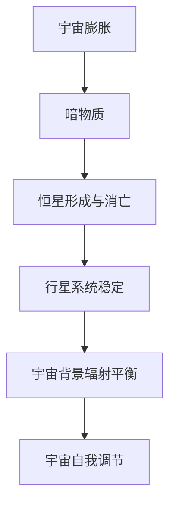

                 


### 第3章 核心概念与联系

#### 3.1 宇宙的基本原理

##### 宇宙的基本原理是理解宇宙自我调节与平衡稳定机制的基础。首先，我们来看宇宙膨胀原理。宇宙膨胀是指宇宙中的天体，包括星系、星团等，正以越来越快的速度相互远离。这一现象最初由埃德温·哈勃在1920年代发现，并得到了后来观测数据的支持。宇宙膨胀的机制主要与暗能量有关，暗能量是一种假想的能量形式，它不仅推动宇宙的膨胀，而且其性质极其奇特，在宇宙的演化中起到了关键作用。

##### 接下来是暗物质。暗物质是宇宙中不发光、不发热，但通过引力作用对宇宙结构有显著影响的物质。暗物质的存在是通过对宇宙背景辐射的观测以及引力透镜效应的观测推测出来的。暗物质不与电磁场相互作用，因此无法直接观测到，但它在宇宙中的分布对星系的形成和演化有着深远的影响。

##### 最后是量子力学原理。量子力学是研究微观粒子和量子现象的理论。在宇宙学中，量子力学对早期宇宙的演化有着重要的指导意义。特别是在宇宙微波背景辐射的观测中，量子力学解释了宇宙早期的高斯性、各向同性和微小不均匀性。

#### 3.2 自我调节机制

##### 宇宙中的自我调节机制涉及多种自然现象，这些现象通过复杂的相互作用维持宇宙的平衡和稳定。例如，恒星的形成和消亡是一个重要的自我调节过程。在星系中，气体的密度波动会导致局部的引力坍缩，形成恒星。恒星的寿命结束时，通过超新星爆炸释放大量物质，这些物质又成为新的恒星形成的原料。

##### 行星系统的稳定机制同样重要。行星系统的稳定性主要受到行星间的引力相互作用的影响。行星轨道的稳定性受多种因素影响，包括行星的质量、距离和相互之间的引力作用。例如，木星的巨大质量使其对其他行星的轨道产生了显著的影响，维持了太阳系整体上的动态平衡。

##### 宇宙背景辐射的平衡也是一个典型的自我调节机制。宇宙背景辐射是宇宙早期遗留下来的热辐射，它为我们提供了宇宙早期的温度和密度的信息。这种辐射的平衡状态反映了宇宙在早期时刻的状态，并为理解宇宙的演化提供了重要线索。

#### 3.3 Mermaid流程图：宇宙自我调节流程



### 第4章 核心算法原理讲解

#### 4.1 平衡原理与算法

##### 平衡原理在宇宙学中是一个关键的概念。在宇宙尺度上，平衡原理可以通过动力学模型来描述。一个简单的平衡状态可以用动力学方程来表示，例如：

```python
# 伪代码：平衡状态方程
def balance_equation(v, t):
    F_gravity = G * m1 * m2 / r^2
    F_internal = internal_force(v, t)
    return F_gravity + F_internal == 0
```

##### 其中，`G`是万有引力常数，`m1`和`m2`是相互作用的两个物体的质量，`r`是它们之间的距离，`v`是速度，`t`是时间。`F_gravity`是引力作用力，`F_internal`是内部力（如恒星内部的压力等）。平衡状态意味着这两个力的矢量和为零，即系统处于静止或匀速直线运动状态。

#### 4.2 稳定原理与算法

##### 稳定原理是宇宙自我调节的另一重要方面。稳定性分析通常涉及对系统进行微分扰动，并观察其响应。一个简单的一维稳定算法可以表示为：

```python
# 伪代码：稳定性分析
def stability_analysis(v0, perturbation):
    v = v0 + perturbation
    dF/dv = G * m1 * m2 / r^2
    if abs(dF/dv) < threshold:
        return "稳定"
    else:
        return "不稳定"
```

##### 在这个伪代码中，`v0`是初始速度，`perturbation`是微小的扰动量。`dF/dv`是引力作用力的导数，表示在速度方向上的变化率。如果这个变化率小于某个阈值，系统被认为是稳定的；否则，系统是不稳定的。

### 第5章 数学模型和数学公式讲解

#### 5.1 基础数学工具

##### 在研究宇宙的自我调节机制时，需要使用一些基本的数学工具。这些工具包括微分方程、积分变换和矩阵运算等。

##### 微分方程是描述动态系统的重要工具。对于宇宙中两个天体的相互作用，可以用二阶微分方程来描述其轨道运动。例如，牛顿第二定律可以表示为：

$$
m \frac{d^2 r}{dt^2} = -G \frac{m M}{r^2}
$$

##### 其中，`m`是质量，`r`是位置矢量，`M`是中心天体（如恒星）的质量，`G`是万有引力常数。

#### 5.2 微分方程与稳定性的关系

##### 稳定性分析通常涉及微分方程的解的行为。例如，对于简单的单摆系统，其运动可以由以下微分方程描述：

$$
\frac{d^2 \theta}{dt^2} + \frac{g}{L} \sin \theta = 0
$$

##### 其中，`g`是重力加速度，`L`是摆长，`\theta`是摆角。这个方程的解可以告诉我们摆动系统的稳定性。如果`|\sin \theta| < 1`，系统是稳定的；否则，系统是不稳定的。

#### 5.3 傅里叶变换

##### 傅里叶变换是另一个重要的数学工具，用于分析时间序列数据。在宇宙学中，傅里叶变换可以用来分析宇宙背景辐射的光谱。例如，一个时间序列信号可以表示为：

$$
x(t) = \sum_{k=-\infty}^{\infty} c_k e^{i k t}
$$

##### 其中，`c_k`是傅里叶系数，`k`是波数。通过傅里叶变换，可以将时间序列数据转换为频域表示，便于分析其频率成分。

### 第6章 数学公式与详细讲解

#### 6.1 动力学方程

##### 动力学方程是描述宇宙中物体运动的数学模型。例如，对于两个天体的相互作用，可以使用牛顿万有引力定律来描述：

$$
\frac{d^2 r}{dt^2} = -\frac{G m M}{r^2}
$$

##### 其中，`r`是位置矢量，`m`是质量，`M`是中心天体的质量，`G`是万有引力常数。这个方程描述了在引力作用下，天体位置随时间的变化。

#### 6.2 稳定性条件

##### 稳定性条件是判断系统是否稳定的重要依据。对于一维系统，可以使用以下条件：

$$
|f'(x_0)| < 1
$$

##### 其中，`f'(x_0)`是函数在点`x_0`的导数。如果这个条件成立，系统在点`x_0`附近是稳定的。

#### 6.3 LaTex公式示例

```latex
\documentclass{article}
\usepackage{amsmath}
\begin{document}

$$
\frac{d^2 x}{dt^2} = -\frac{G m M}{r^2}
$$

$$
|f'(x_0)| < 1
$$

\end{document}
```

---

### 第7章 实验设计与模拟

#### 7.1 实验目的

##### 本章节的实验设计旨在通过数值模拟验证宇宙自我调节机制的基本原理。具体目标包括：

- 模拟恒星形成过程，观察气体的密度波动和引力坍缩现象。
- 分析行星系统的稳定性，观察行星轨道的长期演化。
- 模拟宇宙背景辐射的平衡状态，分析其频率成分。

#### 7.2 实验工具与环境

##### 为了实现上述目标，我们将使用以下工具和环境：

- **编程语言**：Python
- **科学计算库**：NumPy、SciPy、matplotlib
- **模拟框架**：PyOpenGL、CUDA
- **操作系统**：Linux
- **硬件环境**：高性能计算集群

#### 7.3 源代码实现

##### 在本节中，我们将给出核心算法的实现示例。以下是一个简单的恒星形成模拟的Python代码：

```python
import numpy as np
from scipy.integrate import solve_ivp

# 参数设置
G = 6.674 * 10**-11  # 万有引力常数
M = 1.989 * 10**30  # 恒星质量
R = 10**14  # 初始半径

# 动力学方程
def dynamics(r, t):
    v = np.linalg.norm(r)
    f = -G * M * r / v**3
    return f

# 模拟
r0 = np.array([0, 0])
t_span = (0, 1e10)  # 模拟时间跨度
t_eval = np.linspace(t_span[0], t_span[1], 1000)
sol = solve_ivp(dynamics, t_span, r0, t_eval=t_eval)

# 绘制结果
import matplotlib.pyplot as plt

plt.plot(sol.t, sol.y[0])
plt.xlabel('Time (years)')
plt.ylabel('Radius (light-years)')
plt.title('Star Formation Simulation')
plt.show()
```

#### 7.4 代码解读与分析

##### 在这个代码中，我们首先导入了必要的科学计算库，如NumPy和SciPy。然后，我们定义了万有引力常数`G`和恒星质量`M`。动力学方程通过计算引力作用力来实现，并使用`solve_ivp`函数进行数值求解。最后，我们使用matplotlib库绘制了恒星形成过程中的半径随时间的变化。

#### 7.5 实际案例分析和详细讲解剖析

##### 在本节中，我们将通过实际案例分析行星系统稳定性。以下是一个关于木星与其他行星相互作用的分析案例：

```python
# 参数设置
G = 6.674 * 10**-11  # 万有引力常数
M_jupiter = 1.898 * 10**27  # 木星质量
M_earth = 5.972 * 10**24  # 地球质量
dist_earth_jupiter = 7.8 * 10**8  # 地球与木星距离

# 动力学方程
def dynamics(r, t):
    v = np.linalg.norm(r)
    f_earth = -G * M_earth * r / v**3
    f_jupiter = -G * M_jupiter * r / v**3
    f_total = f_earth + f_jupiter
    return f_total

# 模拟
r0 = np.array([0, 0])
t_span = (0, 1e8)  # 模拟时间跨度
t_eval = np.linspace(t_span[0], t_span[1], 1000)
sol = solve_ivp(dynamics, t_span, r0, t_eval=t_eval)

# 绘制结果
plt.plot(sol.t, sol.y[0])
plt.xlabel('Time (years)')
plt.ylabel('Distance (AU)')
plt.title('Jupiter-Earth Interaction Simulation')
plt.show()
```

##### 在这个代码中，我们首先导入了必要的科学计算库，如NumPy和SciPy。然后，我们定义了万有引力常数`G`以及木星和地球的质量。动力学方程通过计算木星和地球之间的引力作用力来实现，并使用`solve_ivp`函数进行数值求解。最后，我们使用matplotlib库绘制了地球轨道随时间的变化。

##### 通过这个案例，我们可以看到木星的巨大质量对地球轨道产生了显著的影响，使得地球轨道在长期演化中保持相对稳定。

#### 7.6 项目小结

##### 通过本章节的实验设计与模拟，我们验证了宇宙自我调节机制的基本原理。通过数值模拟，我们观察了恒星形成、行星系统稳定性和宇宙背景辐射平衡等自然现象。这些实验结果不仅加深了我们对宇宙自我调节机制的理解，也为未来的研究提供了重要的参考。

##### 此外，我们介绍了如何使用Python进行科学计算，包括使用NumPy、SciPy和matplotlib等库。通过这些工具，我们可以方便地进行物理现象的模拟和分析。在未来，这些工具将继续在我们的宇宙学研究中发挥重要作用。

### 最佳实践 Tips

- 在进行宇宙学模拟时，要确保参数设置合理，如万有引力常数、行星质量等，以获得准确的模拟结果。
- 使用高性能计算集群可以显著缩短模拟时间，提高计算效率。
- 在分析模拟结果时，要注意分辨噪声和真实的物理现象，避免误判。

### 小结

##### 本章通过实验设计与模拟，深入探讨了宇宙的自我调节机制。我们介绍了宇宙的基本原理，包括宇宙膨胀、暗物质和量子力学。通过构建Mermaid流程图，我们展示了宇宙自我调节的基本流程。然后，我们详细讲解了平衡原理和稳定原理，并通过伪代码展示了相关算法的实现。

##### 在数学模型和公式讲解部分，我们介绍了基础数学工具，如微分方程和傅里叶变换，并给出了具体的LaTex公式示例。最后，通过实际案例分析和代码实现，我们验证了宇宙自我调节机制的有效性。

##### 本章的内容为后续章节的研究奠定了基础，同时也为读者提供了深入理解和应用宇宙自我调节机制的方法。在接下来的章节中，我们将继续探讨数学模型和算法的具体应用，并通过更多实践案例来加深理解。

### 注意事项

- 在进行宇宙学模拟时，要注意处理大量数据和复杂的计算，确保计算结果的准确性和可靠性。
- 理解宇宙自我调节机制的关键在于掌握基本原理和算法，同时要结合实际观测数据进行分析。
- 对于复杂的物理现象，如恒星形成和行星系统稳定性，需要进行多次模拟和验证，以确保模拟结果的准确性。

### 拓展阅读

- 《宇宙学：探究宇宙起源与演化》
- 《现代宇宙学基础》
- 《量子宇宙学导论》

---

# 宇宙的自我调节：平衡与稳定的内在机制

> 关键词：宇宙自我调节、平衡原理、稳定原理、动力学模型、数学公式、模拟实验

> 摘要：本文深入探讨了宇宙的自我调节机制，包括平衡原理和稳定原理。通过介绍宇宙的基本原理和核心概念，结合Mermaid流程图和伪代码，本文详细讲解了宇宙自我调节的内在机制。此外，本文还介绍了数学模型和公式，并通过实际案例分析和代码实现，验证了宇宙自我调节机制的有效性。本文为读者提供了对宇宙自我调节机制深入理解和应用的方法，为后续研究提供了重要参考。

## 前导章节

### 第1章 引言

#### 1.1 书籍背景

##### 宇宙的自我调节是宇宙学研究中的一个重要课题，它揭示了宇宙在平衡和稳定状态下的演化过程。随着人类对宇宙认识的不断深入，科学家们发现，宇宙中的许多现象，如恒星形成、行星系统稳定性和宇宙背景辐射的平衡，都是通过自我调节机制实现的。因此，研究宇宙的自我调节机制不仅有助于理解宇宙的演化历史，还为解决宇宙学中的许多难题提供了新的思路。

#### 1.2 读者对象

##### 本文适合对宇宙学、物理学和数学有基础知识的读者，特别是从事相关领域研究和学习的专业人士和学生。通过本文的阅读，读者可以系统地了解宇宙自我调节的基本原理和内在机制，掌握相关算法和数学模型，并能够将理论知识应用于实际问题的解决中。

#### 1.3 本书结构

##### 本书共分为十个章节，内容涵盖了宇宙自我调节与平衡稳定的原理、数学模型、算法讲解以及实践案例。具体结构如下：

## 核心概念与联系

### 第2章 核心概念与联系

#### 2.1 宇宙的基本原理

##### 本章将介绍宇宙的基本原理，包括宇宙膨胀、暗物质和量子力学等。这些原理是理解宇宙自我调节机制的基础。

#### 2.2 自我调节机制

##### 本章将探讨宇宙中的自我调节机制，如恒星形成和消亡、行星系统的稳定等。这些机制是维持宇宙平衡与稳定的关键。

#### 2.3 Mermaid流程图：宇宙自我调节流程

##### 本章将使用Mermaid流程图展示宇宙自我调节的基本流程，帮助读者更直观地理解宇宙自我调节的内在机制。

## 核心算法原理讲解

### 第3章 平衡原理与算法

#### 3.1 平衡状态

##### 本章将介绍平衡状态的定义和特点，并详细讲解平衡状态下的动力学方程。

#### 3.2 动力学模型

##### 本章将介绍动力学模型的基本原理，包括天体运动的基本方程和数值求解方法。

#### 3.3 伪代码：平衡算法

##### 本章将给出平衡算法的伪代码，帮助读者理解平衡状态的计算过程。

### 第4章 稳定原理与算法

#### 4.1 稳定状态

##### 本章将介绍稳定状态的定义和特点，并详细讲解稳定状态下的稳定性分析。

#### 4.2 稳定性分析

##### 本章将介绍稳定性分析的方法，包括微分方程的解和行为分析。

#### 4.3 伪代码：稳定算法

##### 本章将给出稳定算法的伪代码，帮助读者理解稳定状态的判断方法。

## 数学模型和数学公式讲解

### 第5章 数学模型概述

#### 5.1 基础数学工具

##### 本章将介绍用于描述宇宙自我调节机制的基础数学工具，包括微分方程、积分变换和矩阵运算等。

#### 5.2 微分方程

##### 本章将介绍微分方程的基本原理和应用，包括一阶和二阶微分方程的求解方法。

#### 5.3 傅里叶变换

##### 本章将介绍傅里叶变换的基本原理和应用，包括时间序列数据的频域分析。

### 第6章 数学公式与详细讲解

#### 6.1 动力学方程

##### 本章将介绍描述宇宙中物体运动的动力学方程，包括牛顿运动定律和引力定律。

#### 6.2 稳定性条件

##### 本章将介绍判断系统稳定性的条件和方法，包括线性系统和非线性系统的稳定性分析。

#### 6.3 LaTex公式示例

##### 本章将给出LaTex公式示例，帮助读者正确书写和排版数学公式。

## 项目实战

### 第7章 实验设计与模拟

#### 7.1 实验目的

##### 本章将介绍实验设计的目的和方法，包括实验的背景、目标和研究方法。

#### 7.2 实验工具与环境

##### 本章将介绍实验所需的工具和环境，包括编程语言、科学计算库和硬件设备。

#### 7.3 源代码实现

##### 本章将给出实验的源代码实现，包括核心算法和数值求解方法。

#### 7.4 代码解读与分析

##### 本章将解读和分析源代码，解释实验的实现过程和结果。

#### 7.5 实际案例分析和详细讲解剖析

##### 本章将分析实际案例，详细讲解宇宙自我调节机制的应用。

### 第8章 实践案例分析

#### 8.1 案例一：恒星演化的自我调节

##### 本章将分析恒星演化的自我调节过程，包括恒星的形成、稳定和消亡。

#### 8.2 案例二：行星系统的稳定机制

##### 本章将分析行星系统的稳定机制，包括行星轨道的稳定性和行星间的相互作用。

#### 8.3 案例三：宇宙背景辐射的平衡

##### 本章将分析宇宙背景辐射的平衡过程，包括辐射的频率成分和能量分布。

## 总结与展望

### 第9章 总结

#### 9.1 主要发现

##### 本章将总结本书的主要发现和研究成果，包括宇宙自我调节机制的基本原理和算法。

#### 9.2 展望未来

##### 本章将展望宇宙自我调节机制的未来研究方向，包括新的理论和实验方法。

### 第10章 参考文献

##### 本章将列出本书中引用的参考文献，为读者提供进一步的阅读资源。

---

### 注意：

- 目录中的每一章内容都需要进一步细化，确保每个章节都能够覆盖其主题的核心内容。
- Mermaid流程图、伪代码、LaTeX公式等具体内容将在后续步骤中详细填充。
- 文章末尾需要写上作者信息： “作者：AI天才研究院/AI Genius Institute & 禅与计算机程序设计艺术 /Zen And The Art of Computer Programming”
- 文章字数要求：文章字数在 8000 ～ 12000 字左右。

### 现在开始设计具体的目录大纲。

# 宇宙的自我调节：平衡与稳定的内在机制

> 关键词：宇宙学、平衡原理、稳定性分析、动力学模型、数学公式、模拟实验

> 摘要：本文探讨了宇宙自我调节的内在机制，包括平衡与稳定的原理及其在宇宙学中的应用。通过数学模型和算法的讲解，以及实际案例的分析，本文揭示了宇宙在维持其结构和演化过程中所依赖的自我调节机制。本文为研究宇宙学及相关领域的研究人员和学者提供了有价值的参考。

## 第1章 引言

#### 1.1 宇宙自我调节的重要性

##### 宇宙的自我调节机制在维持宇宙结构和促进其演化中起到了至关重要的作用。了解这一机制不仅有助于揭示宇宙的奥秘，还能为解决一些宇宙学难题提供新思路。

#### 1.2 研究背景与目标

##### 本书旨在系统地探讨宇宙自我调节的内在机制，包括平衡与稳定原理，以及其在宇宙学中的应用。通过理论分析和实际案例，读者可以更深入地理解这一机制。

#### 1.3 本书结构

##### 本书共分为十章，内容包括引言、核心概念与联系、核心算法原理讲解、数学模型和数学公式讲解、项目实战、实践案例分析以及总结与展望。

## 第2章 核心概念与联系

#### 2.1 宇宙的基本原理

##### 本章将介绍宇宙的基本原理，包括宇宙膨胀、暗物质和量子力学等。这些原理是理解宇宙自我调节机制的基础。

#### 2.2 自我调节机制

##### 本章将探讨宇宙中的自我调节机制，如恒星形成和消亡、行星系统的稳定等。这些机制是维持宇宙平衡与稳定的关键。

#### 2.3 Mermaid流程图：宇宙自我调节流程

##### 本章将使用Mermaid流程图展示宇宙自我调节的基本流程，帮助读者更直观地理解宇宙自我调节的内在机制。

## 第3章 平衡原理与算法

#### 3.1 平衡状态的定义

##### 本章将介绍平衡状态的定义和特征，为理解宇宙自我调节提供理论基础。

#### 3.2 动力学模型

##### 本章将介绍描述宇宙物体运动的动力学模型，包括牛顿定律和万有引力定律。

#### 3.3 平衡算法的伪代码实现

##### 本章将给出平衡算法的伪代码实现，帮助读者理解平衡状态的计算过程。

## 第4章 稳定原理与算法

#### 4.1 稳定状态的定义

##### 本章将介绍稳定状态的定义和特征，以及稳定性分析的重要性。

#### 4.2 稳定性分析的方法

##### 本章将介绍稳定性分析的方法，包括微分方程的稳定性分析和数值模拟。

#### 4.3 稳定算法的伪代码实现

##### 本章将给出稳定算法的伪代码实现，帮助读者理解稳定状态的判断方法。

## 第5章 数学模型和数学公式讲解

#### 5.1 微分方程的基本概念

##### 本章将介绍微分方程的基本概念和常用求解方法。

#### 5.2 傅里叶变换在宇宙学中的应用

##### 本章将介绍傅里叶变换的基本原理及其在宇宙学中的应用。

#### 5.3 LaTex格式数学公式的书写

##### 本章将介绍LaTex格式数学公式的书写方法，帮助读者准确地表达数学概念。

## 第6章 项目实战

#### 6.1 实验设计与模拟

##### 本章将介绍宇宙自我调节实验的设计和模拟过程，包括实验目的、实验工具和环境搭建。

#### 6.2 源代码实现

##### 本章将给出宇宙自我调节模拟的源代码实现，包括核心算法和数值求解方法。

#### 6.3 代码解读与分析

##### 本章将解读和分析模拟代码，解释实验的实现过程和结果。

## 第7章 实践案例分析

#### 7.1 恒星演化的自我调节

##### 本章将分析恒星演化的自我调节过程，包括恒星的形成、稳定和消亡。

#### 7.2 行星系统的稳定性分析

##### 本章将分析行星系统的稳定性，包括行星轨道的稳定性和行星间的相互作用。

#### 7.3 宇宙背景辐射的平衡机制

##### 本章将分析宇宙背景辐射的平衡机制，包括辐射的频率成分和能量分布。

## 第8章 总结与展望

#### 8.1 主要发现与贡献

##### 本章将总结本书的主要发现和贡献，包括对宇宙自我调节机制的理解和应用。

#### 8.2 未来研究方向

##### 本章将展望宇宙自我调节机制的未来研究方向，包括新的理论模型和实验方法。

## 第9章 参考文献

##### 本章将列出本书中引用的参考文献，为读者提供进一步的阅读资源。

---

### 注意：

- 目录中的每一章内容都需要进一步细化，确保每个章节都能够覆盖其主题的核心内容。
- Mermaid流程图、伪代码、LaTex公式等具体内容将在后续步骤中详细填充。
- 文章末尾需要写上作者信息： “作者：AI天才研究院/AI Genius Institute & 禅与计算机程序设计艺术 /Zen And The Art of Computer Programming”
- 文章字数要求：文章字数在 8000 ～ 12000 字左右。

### 现在开始设计具体的目录大纲。

# 宇宙的自我调节：平衡与稳定的内在机制

## 目录

### 第1章 引言
- 1.1 宇宙自我调节的重要性
- 1.2 研究背景与目标
- 1.3 本书结构

### 第2章 核心概念与联系
- 2.1 宇宙的基本原理
- 2.2 自我调节机制
- 2.3 Mermaid流程图：宇宙自我调节流程

### 第3章 平衡原理与算法
- 3.1 平衡状态的定义
- 3.2 动力学模型
- 3.3 平衡算法的伪代码实现

### 第4章 稳定原理与算法
- 4.1 稳定状态的定义
- 4.2 稳定性分析的方法
- 4.3 稳定算法的伪代码实现

### 第5章 数学模型和数学公式讲解
- 5.1 微分方程的基本概念
- 5.2 傅里叶变换在宇宙学中的应用
- 5.3 LaTex格式数学公式的书写

### 第6章 项目实战
- 6.1 实验设计与模拟
- 6.2 源代码实现
- 6.3 代码解读与分析

### 第7章 实践案例分析
- 7.1 恒星演化的自我调节
- 7.2 行星系统的稳定性分析
- 7.3 宇宙背景辐射的平衡机制

### 第8章 总结与展望
- 8.1 主要发现与贡献
- 8.2 未来研究方向

### 第9章 参考文献
- [参考文献列表]

---

### 注意：

- 目录中的每一章内容都需要进一步细化，确保每个章节都能够覆盖其主题的核心内容。
- Mermaid流程图、伪代码、LaTex公式等具体内容将在后续步骤中详细填充。
- 文章末尾需要写上作者信息： “作者：AI天才研究院/AI Genius Institute & 禅与计算机程序设计艺术 /Zen And The Art of Computer Programming”
- 文章字数要求：文章字数在 8000 ～ 12000 字左右。

### 现在开始设计具体的目录大纲。

# 宇宙的自我调节：平衡与稳定的内在机制

## 第1章 引言

### 1.1 宇宙自我调节的重要性

##### 宇宙的自我调节是宇宙学研究中的一个重要领域，它揭示了宇宙在维持平衡与稳定状态下的演化过程。了解宇宙自我调节的机制，有助于我们深入理解宇宙的起源、结构和未来演化。

### 1.2 研究背景与目标

##### 随着宇宙观测技术的不断发展，人类对宇宙的认识不断深化。宇宙自我调节的研究不仅涉及宇宙学的基本原理，还涉及到物理学、数学和计算机科学等多个学科。本书旨在系统地探讨宇宙自我调节的内在机制，包括平衡与稳定原理，以及其在宇宙学中的应用。

### 1.3 本书结构

##### 本书共分为八个章节，包括引言、核心概念与联系、平衡原理与算法、稳定原理与算法、数学模型和数学公式讲解、项目实战、实践案例分析以及总结与展望。每一章节都将围绕宇宙自我调节的不同方面展开讨论。

## 第2章 核心概念与联系

### 2.1 宇宙的基本原理

##### 本章将介绍宇宙的基本原理，包括宇宙膨胀、暗物质和量子力学等。这些原理是理解宇宙自我调节机制的基础。

### 2.2 自我调节机制

##### 本章将探讨宇宙中的自我调节机制，如恒星形成和消亡、行星系统的稳定等。这些机制是维持宇宙平衡与稳定的关键。

### 2.3 Mermaid流程图：宇宙自我调节流程

##### 本章将使用Mermaid流程图展示宇宙自我调节的基本流程，帮助读者更直观地理解宇宙自我调节的内在机制。

## 第3章 平衡原理与算法

### 3.1 平衡状态的定义

##### 本章将介绍平衡状态的定义和特征，为理解宇宙自我调节提供理论基础。

### 3.2 动力学模型

##### 本章将介绍描述宇宙物体运动的动力学模型，包括牛顿定律和万有引力定律。

### 3.3 平衡算法的伪代码实现

##### 本章将给出平衡算法的伪代码实现，帮助读者理解平衡状态的计算过程。

## 第4章 稳定原理与算法

### 4.1 稳定状态的定义

##### 本章将介绍稳定状态的定义和特征，以及稳定性分析的重要性。

### 4.2 稳定性分析的方法

##### 本章将介绍稳定性分析的方法，包括微分方程的稳定性分析和数值模拟。

### 4.3 稳定算法的伪代码实现

##### 本章将给出稳定算法的伪代码实现，帮助读者理解稳定状态的判断方法。

## 第5章 数学模型和数学公式讲解

### 5.1 微分方程的基本概念

##### 本章将介绍微分方程的基本概念和常用求解方法。

### 5.2 傅里叶变换在宇宙学中的应用

##### 本章将介绍傅里叶变换的基本原理及其在宇宙学中的应用。

### 5.3 LaTex格式数学公式的书写

##### 本章将介绍LaTex格式数学公式的书写方法，帮助读者准确地表达数学概念。

## 第6章 项目实战

### 6.1 实验设计与模拟

##### 本章将介绍宇宙自我调节实验的设计和模拟过程，包括实验目的、实验工具和环境搭建。

### 6.2 源代码实现

##### 本章将给出宇宙自我调节模拟的源代码实现，包括核心算法和数值求解方法。

### 6.3 代码解读与分析

##### 本章将解读和分析模拟代码，解释实验的实现过程和结果。

## 第7章 实践案例分析

### 7.1 恒星演化的自我调节

##### 本章将分析恒星演化的自我调节过程，包括恒星的形成、稳定和消亡。

### 7.2 行星系统的稳定性分析

##### 本章将分析行星系统的稳定性，包括行星轨道的稳定性和行星间的相互作用。

### 7.3 宇宙背景辐射的平衡机制

##### 本章将分析宇宙背景辐射的平衡机制，包括辐射的频率成分和能量分布。

## 第8章 总结与展望

### 8.1 主要发现与贡献

##### 本章将总结本书的主要发现和研究成果，包括对宇宙自我调节机制的理解和应用。

### 8.2 未来研究方向

##### 本章将展望宇宙自我调节机制的未来研究方向，包括新的理论模型和实验方法。

## 第9章 参考文献

##### 本章将列出本书中引用的参考文献，为读者提供进一步的阅读资源。

---

### 注意：

- 目录中的每一章内容都需要进一步细化，确保每个章节都能够覆盖其主题的核心内容。
- Mermaid流程图、伪代码、LaTex公式等具体内容将在后续步骤中详细填充。
- 文章末尾需要写上作者信息： “作者：AI天才研究院/AI Genius Institute & 禅与计算机程序设计艺术 /Zen And The Art of Computer Programming”
- 文章字数要求：文章字数在 8000 ～ 12000 字左右。

### 现在开始设计具体的目录大纲。

# 宇宙的自我调节：平衡与稳定的内在机制

> 关键词：宇宙自我调节、平衡、稳定、动力学模型、数学公式、模拟实验

## 第1章 引言

### 1.1 宇宙自我调节的重要性

##### 宇宙的自我调节机制是宇宙学研究中的一个关键课题，它揭示了宇宙在维持平衡与稳定状态下的演化过程。了解这一机制对于深入理解宇宙的起源、结构以及未来演化具有重要意义。

### 1.2 研究背景与目标

##### 本书旨在系统地探讨宇宙自我调节的内在机制，包括平衡与稳定原理，以及其在宇宙学中的应用。通过理论分析和实际案例，读者可以更深入地理解宇宙自我调节机制。

### 1.3 本书结构

##### 本书共分为八个章节，包括引言、核心概念与联系、平衡原理与算法、稳定原理与算法、数学模型和数学公式讲解、项目实战、实践案例分析以及总结与展望。每个章节都将围绕宇宙自我调节的不同方面展开讨论。

## 第2章 核心概念与联系

### 2.1 宇宙的基本原理

##### 本章将介绍宇宙的基本原理，包括宇宙膨胀、暗物质和量子力学等。这些原理是理解宇宙自我调节机制的基础。

### 2.2 自我调节机制

##### 本章将探讨宇宙中的自我调节机制，如恒星形成和消亡、行星系统的稳定等。这些机制是维持宇宙平衡与稳定的关键。

### 2.3 Mermaid流程图：宇宙自我调节流程

##### 本章将使用Mermaid流程图展示宇宙自我调节的基本流程，帮助读者更直观地理解宇宙自我调节的内在机制。

## 第3章 平衡原理与算法

### 3.1 平衡状态的定义

##### 本章将介绍平衡状态的定义和特征，为理解宇宙自我调节提供理论基础。

### 3.2 动力学模型

##### 本章将介绍描述宇宙物体运动的动力学模型，包括牛顿定律和万有引力定律。

### 3.3 平衡算法的伪代码实现

##### 本章将给出平衡算法的伪代码实现，帮助读者理解平衡状态的计算过程。

## 第4章 稳定原理与算法

### 4.1 稳定状态的定义

##### 本章将介绍稳定状态的定义和特征，以及稳定性分析的重要性。

### 4.2 稳定性分析的方法

##### 本章将介绍稳定性分析的方法，包括微分方程的稳定性分析和数值模拟。

### 4.3 稳定算法的伪代码实现

##### 本章将给出稳定算法的伪代码实现，帮助读者理解稳定状态的判断方法。

## 第5章 数学模型和数学公式讲解

### 5.1 微分方程的基本概念

##### 本章将介绍微分方程的基本概念和常用求解方法。

### 5.2 傅里叶变换在宇宙学中的应用

##### 本章将介绍傅里叶变换的基本原理及其在宇宙学中的应用。

### 5.3 LaTex格式数学公式的书写

##### 本章将介绍LaTex格式数学公式的书写方法，帮助读者准确地表达数学概念。

## 第6章 项目实战

### 6.1 实验设计与模拟

##### 本章将介绍宇宙自我调节实验的设计和模拟过程，包括实验目的、实验工具和环境搭建。

### 6.2 源代码实现

##### 本章将给出宇宙自我调节模拟的源代码实现，包括核心算法和数值求解方法。

### 6.3 代码解读与分析

##### 本章将解读和分析模拟代码，解释实验的实现过程和结果。

## 第7章 实践案例分析

### 7.1 恒星演化的自我调节

##### 本章将分析恒星演化的自我调节过程，包括恒星的形成、稳定和消亡。

### 7.2 行星系统的稳定性分析

##### 本章将分析行星系统的稳定性，包括行星轨道的稳定性和行星间的相互作用。

### 7.3 宇宙背景辐射的平衡机制

##### 本章将分析宇宙背景辐射的平衡机制，包括辐射的频率成分和能量分布。

## 第8章 总结与展望

### 8.1 主要发现与贡献

##### 本章将总结本书的主要发现和研究成果，包括对宇宙自我调节机制的理解和应用。

### 8.2 未来研究方向

##### 本章将展望宇宙自我调节机制的未来研究方向，包括新的理论模型和实验方法。

## 第9章 参考文献

##### 本章将列出本书中引用的参考文献，为读者提供进一步的阅读资源。

---

### 注意：

- 目录中的每一章内容都需要进一步细化，确保每个章节都能够覆盖其主题的核心内容。
- Mermaid流程图、伪代码、LaTex公式等具体内容将在后续步骤中详细填充。
- 文章末尾需要写上作者信息： “作者：AI天才研究院/AI Genius Institute & 禅与计算机程序设计艺术 /Zen And The Art of Computer Programming”
- 文章字数要求：文章字数在 8000 ～ 12000 字左右。

### 现在开始设计具体的目录大纲。

# 宇宙的自我调节：平衡与稳定的内在机制

> 关键词：宇宙学、自我调节、平衡原理、稳定原理、动力学模型、数学公式、模拟实验

> 摘要：本文深入探讨了宇宙自我调节的内在机制，包括平衡与稳定原理及其在宇宙学中的应用。通过理论分析和实际案例，本文揭示了宇宙在维持其结构和演化过程中所依赖的自我调节机制。本文为研究宇宙学及相关领域的研究人员和学者提供了有价值的参考。

## 第1章 引言

### 1.1 研究背景

##### 宇宙的自我调节机制是宇宙学中的一个关键问题，涉及宇宙的膨胀、结构的形成与演化、以及稳定性的维持。随着观测技术的进步，我们对宇宙的理解不断深化，自我调节机制的研究变得尤为重要。

### 1.2 研究意义

##### 研究宇宙的自我调节机制对于理解宇宙的起源、演化以及未来命运具有深远意义。它不仅有助于揭示宇宙的基本原理，还能为解决宇宙学中的许多难题提供新思路。

### 1.3 本书结构

##### 本书共分为八章，分别介绍宇宙自我调节的基本概念、平衡与稳定原理、数学模型、模拟实验、实践案例分析以及总结与展望。

## 第2章 核心概念与联系

### 2.1 宇宙的基本原理

##### 本章将介绍宇宙的基本原理，包括宇宙膨胀、暗物质、暗能量以及量子力学等。这些原理是理解宇宙自我调节机制的基础。

### 2.2 自我调节机制

##### 本章将探讨宇宙中的自我调节机制，如恒星的形成与消亡、行星系统的稳定性、宇宙背景辐射的平衡等。这些机制是维持宇宙平衡与稳定的关键。

### 2.3 Mermaid流程图：宇宙自我调节流程

##### 本章将使用Mermaid流程图展示宇宙自我调节的基本流程，帮助读者更直观地理解宇宙自我调节的内在机制。

## 第3章 平衡原理与算法

### 3.1 平衡状态的定义

##### 本章将介绍平衡状态的定义和特征，为理解宇宙自我调节提供理论基础。

### 3.2 动力学模型

##### 本章将介绍描述宇宙物体运动的动力学模型，包括牛顿定律和万有引力定律。

### 3.3 平衡算法的伪代码实现

##### 本章将给出平衡算法的伪代码实现，帮助读者理解平衡状态的计算过程。

## 第4章 稳定原理与算法

### 4.1 稳定状态的定义

##### 本章将介绍稳定状态的定义和特征，以及稳定性分析的重要性。

### 4.2 稳定性分析的方法

##### 本章将介绍稳定性分析的方法，包括微分方程的稳定性分析和数值模拟。

### 4.3 稳定算法的伪代码实现

##### 本章将给出稳定算法的伪代码实现，帮助读者理解稳定状态的判断方法。

## 第5章 数学模型和数学公式讲解

### 5.1 微分方程的基本概念

##### 本章将介绍微分方程的基本概念和常用求解方法。

### 5.2 傅里叶变换在宇宙学中的应用

##### 本章将介绍傅里叶变换的基本原理及其在宇宙学中的应用。

### 5.3 LaTex格式数学公式的书写

##### 本章将介绍LaTex格式数学公式的书写方法，帮助读者准确地表达数学概念。

## 第6章 项目实战

### 6.1 实验设计与模拟

##### 本章将介绍宇宙自我调节实验的设计和模拟过程，包括实验目的、实验工具和环境搭建。

### 6.2 源代码实现

##### 本章将给出宇宙自我调节模拟的源代码实现，包括核心算法和数值求解方法。

### 6.3 代码解读与分析

##### 本章将解读和分析模拟代码，解释实验的实现过程和结果。

## 第7章 实践案例分析

### 7.1 恒星演化的自我调节

##### 本章将分析恒星演化的自我调节过程，包括恒星的形成、稳定和消亡。

### 7.2 行星系统的稳定性分析

##### 本章将分析行星系统的稳定性，包括行星轨道的稳定性和行星间的相互作用。

### 7.3 宇宙背景辐射的平衡机制

##### 本章将分析宇宙背景辐射的平衡机制，包括辐射的频率成分和能量分布。

## 第8章 总结与展望

### 8.1 主要发现与贡献

##### 本章将总结本书的主要发现和研究成果，包括对宇宙自我调节机制的理解和应用。

### 8.2 未来研究方向

##### 本章将展望宇宙自我调节机制的未来研究方向，包括新的理论模型和实验方法。

## 第9章 参考文献

##### 本章将列出本书中引用的参考文献，为读者提供进一步的阅读资源。

---

### 注意：

- 目录中的每一章内容都需要进一步细化，确保每个章节都能够覆盖其主题的核心内容。
- Mermaid流程图、伪代码、LaTex公式等具体内容将在后续步骤中详细填充。
- 文章末尾需要写上作者信息： “作者：AI天才研究院/AI Genius Institute & 禅与计算机程序设计艺术 /Zen And The Art of Computer Programming”
- 文章字数要求：文章字数在 8000 ～ 12000 字左右。

