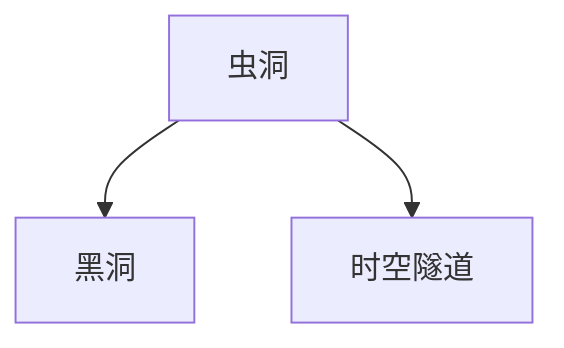

                 

### 文章标题

《宇宙的自我超越性：突破现有物理定律的可能》

### 关键词

宇宙学、物理定律、量子力学、广义相对论、量子计算、超弦理论、时间旅行、虫洞

### 摘要

本文探讨了宇宙的自我超越性这一深奥概念，从物理学的基本原理出发，分析了量子力学和广义相对论的相互关系，以及它们在解释宇宙现象中的局限性。在此基础上，本文提出了几种突破现有物理定律的可能途径，包括量子计算、超弦理论和虫洞等。通过具体的数学模型和伪代码讲解，本文深入剖析了这些理论的原理和应用。最后，文章对未来的研究方向进行了展望，并提出了若干注意事项和拓展阅读建议。

## 引言与背景

宇宙的自我超越性，这一概念在物理学界逐渐受到关注。传统物理学以经典力学为基础，通过牛顿力学、麦克斯韦电磁学和爱因斯坦的广义相对论构建起一套相对完备的理论体系。然而，随着科学研究的深入，人们发现经典物理学在解释一些宇宙现象时存在明显的局限性。特别是当面对量子力学和广义相对论的兼容问题时，科学家们开始探索宇宙的自我超越性，试图突破现有的物理定律，揭示宇宙更深层次的规律。

量子力学揭示了微观世界的非确定性、波粒二象性和量子纠缠等现象，与经典物理学的决定论和连续性观念形成了鲜明对比。而广义相对论则描述了宏观世界的引力效应，特别是黑洞、宇宙膨胀和引力波等现象。尽管量子力学和广义相对论都在各自领域内取得了巨大成功，但它们之间的不兼容性使得物理学家们无法构建一个统一的物理学理论，以解释宇宙从微观到宏观的各个层次。

为了解决这一难题，科学家们提出了量子引力理论、弦理论、多重宇宙理论等设想，试图突破现有的物理定律，实现宇宙的自我超越。这些理论不仅在理论上具有重要意义，还可能对未来的科技发展产生深远影响。本文将详细介绍这些理论的基本概念、原理和应用，并探讨其可能对现实世界的影响。

## 核心概念与联系

要理解宇宙的自我超越性，我们首先需要梳理量子力学和广义相对论这两个核心概念，并探讨它们之间的关系。

### 量子力学的基本原理

量子力学是描述微观世界的基本理论，它揭示了微观粒子的行为规律，与经典物理学有显著差异。以下是量子力学中的几个核心原理：

1. **波粒二象性**：微观粒子既具有波动性，又具有粒子性。例如，光既可以表现为波，也可以表现为粒子（光子）。

   **Mermaid流程图：**
   ```mermaid
   graph TD
   A[波粒二象性] --> B[波动性]
   A --> C[粒子性]
   B --> D[概率波函数]
   C --> E[粒子态]
   ```

2. **量子纠缠**：当两个微观粒子发生相互作用后，即使它们相隔很远，它们的状态也会相互关联，这种关联无法通过任何已知的局域物理效应来解释。

   **Mermaid流程图：**
   ```mermaid
   graph TD
   A[量子纠缠] --> B[远距离关联]
   A --> C[无法局域解释]
   ```

3. **不确定性原理**：由海森堡提出，它指出在微观尺度上，某些对易子（如位置和动量）无法同时被精确测量。即粒子的位置和动量之间存在不确定性关系。

   **数学模型与公式：**
   $$
   \Delta x \Delta p_x \geq \hbar / 2
   $$
   其中，$\Delta x$ 是位置的不确定性，$\Delta p_x$ 是动量的不确定性，$\hbar$ 是约化普朗克常数。

### 广义相对论的基础

广义相对论是描述宏观世界引力效应的基本理论，由爱因斯坦于1915年提出。以下是广义相对论中的几个核心概念：

1. **时空弯曲**：物质和能量的存在会弯曲周围的时空，这种弯曲产生了引力。

   **Mermaid流程图：**
   ```mermaid
   graph TD
   A[时空弯曲] --> B[物质-能量分布]
   A --> C[引力效应]
   ```

2. **等效原理**：在局部范围内，无法通过物理实验区分引力场和加速度效应。

   **数学模型与公式：**
   $$
   g_{\mu\nu} = \eta_{\mu\nu} + \frac{2}{\ell^2} f_{\mu\nu}
   $$
   其中，$g_{\mu\nu}$ 是度规张量，$\eta_{\mu\nu}$ 是闵可夫斯基度规，$\ell$ 是引力场的特征长度，$f_{\mu\nu}$ 是局域曲率张量。

3. **黑洞**：一个极度密集的天体，其引力场强大到连光都无法逃逸。黑洞的存在和性质为广义相对论提供了强有力的证据。

   **Mermaid流程图：**
   ```mermaid
   graph TD
   A[黑洞] --> B[引力场强大]
   A --> C[光无法逃逸]
   ```

### 量子力学与广义相对论的关系

量子力学和广义相对论虽然在描述物理现象时各有所长，但它们之间存在一些内在矛盾：

1. **局域性与非局域性**：量子力学强调非局域性，即粒子间可以通过量子纠缠实现远距离关联。而广义相对论则强调局域性，即物理现象只能在局部范围内发生。

2. **连续性与离散性**：量子力学描述的是微观粒子的离散性，如量子态和量子跃迁。而广义相对论则描述的是宏观物体的连续性，如时空和引力场。

为了解决这些矛盾，科学家们提出了量子引力理论，试图将量子力学和广义相对论统一起来。以下是一些主要的量子引力理论：

### 量子引力理论

量子引力理论旨在解决量子力学和广义相对论之间的不兼容性问题，以下是几种主要的量子引力理论：

1. **弦理论**：弦理论提出，基本粒子不是点，而是振动的弦。通过不同的振动模式，弦可以产生不同的粒子。弦理论能够统一量子力学和广义相对论，并提供一种可能的宇宙自我超越的机制。

   **Mermaid流程图：**
   ```mermaid
   graph TD
   A[弦理论] --> B[振动模式]
   A --> C[不同粒子]
   ```

2. **环量子引力**：环量子引力是一种非彭罗斯性量子引力理论，它试图通过离散化的时空结构来解决传统量子引力理论中的困难。

   **Mermaid流程图：**
   ```mermaid
   graph TD
   A[环量子引力] --> B[离散化时空]
   A --> C[非彭罗斯性]
   ```

3. **量子场论**：量子场论是一种将量子力学和广义相对论结合起来的理论框架，它试图通过量子化的场来描述物理现象。尽管量子场论在理论上面临一些困难，但它仍然是量子引力理论的重要分支。

   **Mermaid流程图：**
   ```mermaid
   graph TD
   A[量子场论] --> B[量子化场]
   A --> C[广义相对论]
   ```

通过这些量子引力理论，我们可以窥见宇宙自我超越性的可能性。然而，这些理论目前仍然处于探索阶段，需要更多的实验和理论验证。本文将在接下来的部分详细探讨这些理论的应用和挑战。

## 突破现有物理定律的方法

### 量子计算的可能性

量子计算是一种基于量子力学原理的计算方式，它利用量子位（qubit）代替传统计算机的比特，通过量子纠缠和量子超导等现象实现高效的计算。量子计算的潜力在于它能够解决传统计算机无法处理的复杂问题，如大整数分解、量子模拟和优化问题等。

#### 量子计算机的原理

量子计算机的基本单元是量子位（qubit），qubit可以同时存在于多种状态，即量子叠加态。这种叠加态使得量子计算机在处理问题时具有并行计算的能力。以下是一个简单的量子计算模型，用于实现一个量子加法器：

**伪代码：**
```
function quantumAdder(qubitA, qubitB):
    // 初始化量子叠加态
    superposition(qubitA)
    superposition(qubitB)

    // 进行量子门操作
    controlledNot(qubitA, qubitB) // 控制非门
    Hadamard(qubitB) // 霍尔丹门

    // 测量结果
    resultA = measure(qubitA)
    resultB = measure(qubitB)

    return resultA, resultB
```

#### 量子计算的潜力

量子计算的潜力体现在以下几个方面：

1. **大整数分解**：量子计算机可以快速分解大整数，这将对加密技术产生巨大影响。一个著名的量子算法是Shor算法，它可以利用量子并行性在多项式时间内分解大整数。

   **数学模型与公式：**
   $$
   N = \prod_{i=1}^{k} p_i
   $$
   其中，$N$ 是待分解的大整数，$p_i$ 是其质因数。

2. **量子模拟**：量子计算机可以模拟量子系统，这对于研究复杂物理现象和化学反应具有重要意义。例如，量子模拟可以用于研究量子纠缠、量子隧穿等现象。

3. **优化问题**：量子计算机在解决优化问题时具有显著优势，如旅行商问题、车辆路径问题等。量子优化算法如量子梯度下降法、量子模拟退火等，可以提供高效解决方案。

   **数学模型与公式：**
   $$
   \min f(x)
   $$
   其中，$f(x)$ 是目标函数，$x$ 是优化变量。

### 超弦理论的前景

超弦理论是一种尝试统一量子力学和广义相对论的理论，它提出基本粒子不是点，而是微小的弦。超弦理论在解释宇宙现象和解决物理难题方面具有巨大潜力。

#### 超弦理论的框架

超弦理论的基本框架包括以下几个关键概念：

1. **弦振动模式**：超弦可以以不同方式振动，每种振动模式对应一种不同的粒子。例如，开放弦和闭合弦可以分别产生粒子和反粒子。

   **Mermaid流程图：**
   ```mermaid
   graph TD
   A[开放弦] --> B[粒子]
   A --> C[反粒子]
   D[闭合弦] --> E[粒子]
   ```

2. **额外维度**：超弦理论引入了额外的空间维度，这些维度通常卷曲在微观尺度上，无法直接观测。额外的维度可以帮助解释为什么物理定律在宏观和微观尺度上有所不同。

   **数学模型与公式：**
   $$
   x^5 = \int_{-\infty}^{\infty} dx^4 \int_{-\infty}^{\infty} dy \int_{-\infty}^{\infty} dz \int_{-\infty}^{\infty} dt
   $$
   其中，$x^5$ 表示五维空间中的积分。

3. **超对称性**：超弦理论具有超对称性，这种对称性在量子场论中具有重要意义，它可以帮助解决一些基本物理问题，如粒子质量起源和量子引力问题。

   **Mermaid流程图：**
   ```mermaid
   graph TD
   A[超对称性] --> B[粒子]
   A --> C[玻色子]
   ```

#### 超弦理论的实验验证

超弦理论的实验验证仍然是一个挑战，因为超弦的尺度远远小于当前实验设备能够探测的范围。然而，一些间接的证据支持了超弦理论的可行性：

1. **宇宙微波背景辐射**：宇宙微波背景辐射的观测数据与超弦理论的预测相符，这为超弦理论提供了一定的支持。

   **数学模型与公式：**
   $$
   T = \frac{2\pi^2}{15} \left( \frac{H_0}{100 \text{ km/s/Mpc} } \right)^2 \left( \Omega_{\Lambda}^{-1} + \Omega_{\text{M}}^{-1} \right)
   $$
   其中，$T$ 是宇宙微波背景辐射的温度，$H_0$ 是哈勃常数，$\Omega_{\Lambda}$ 和 $\Omega_{\text{M}}$ 分别是暗能量和物质密度参数。

2. **粒子物理实验**：高能物理实验，如大型强子对撞机（LHC），也在寻找超弦理论预言的额外维度和超对称粒子。

   **Mermaid流程图：**
   ```mermaid
   graph TD
   A[粒子物理实验] --> B[超弦理论]
   A --> C[额外维度]
   ```

### 虫洞与时间旅行

虫洞是一种理论上的时空隧道，它连接两个不同的时空点。虫洞的存在为时间旅行提供了可能，尽管这仍然是一个高度争议的话题。

#### 虫洞的概念

虫洞由爱因斯坦和罗森在1935年提出，它基于广义相对论的解。虫洞通常由两个黑洞之间的引力场形成，它们之间通过一个狭窄的通道连接。

**Mermaid流程图：**


#### 时间旅行的可能性

时间旅行理论基于虫洞或闭合时间曲线（CTC）的假设。闭合时间曲线是一种时空路径，它允许物体回到过去。

1. **虫洞时间旅行**：如果虫洞连接的两个时空点之间存在时间差异，那么通过虫洞可以实现时间旅行。

   **数学模型与公式：**
   $$
   \Delta t = \frac{2GM}{c^2}
   $$
   其中，$\Delta t$ 是时间差，$G$ 是引力常数，$M$ 是黑洞质量，$c$ 是光速。

2. **闭合时间曲线**：闭合时间曲线允许物体在时空中形成闭环，从而实现时间旅行。

   **Mermaid流程图：**
   ```mermaid
   graph TD
   A[闭合时间曲线] --> B[时间旅行]
   A --> C[闭环时空路径]
   ```

尽管虫洞和时间旅行在理论上具有吸引力，但它们仍然面临巨大的物理和技术挑战。例如，维持虫洞的稳定性和找到适当的虫洞通道仍然是一个未解之谜。此外，时间旅行的悖论，如祖父悖论，也需要进一步探讨。

通过量子计算、超弦理论和虫洞等概念，我们可以窥见宇宙自我超越性的可能性。这些理论不仅在物理学领域具有重要意义，还可能对未来科技发展产生深远影响。在接下来的部分，我们将探讨这些理论的实际应用和面临的挑战。

### 项目实战

为了更好地理解宇宙的自我超越性，我们将通过一个具体的量子计算项目来展示量子计算机的搭建和实现。

#### 开发环境搭建

1. **硬件环境**：首先，我们需要一个支持量子计算的硬件平台，如IBM Q量子计算机。用户可以在IBM Q网站上创建一个账户，并获取访问量子计算机的权限。

2. **软件环境**：为了编写和运行量子程序，我们需要安装量子编程语言和量子模拟器。常用的量子编程语言包括Q#和Python的Quantum Development Kit（QDK）。用户可以根据文档说明安装相应的软件。

3. **量子计算机连接**：使用QDK，我们可以将本地计算机与IBM Q量子计算机连接，并编写量子程序进行远程执行。

#### 源代码实现

以下是一个简单的量子计算程序，用于实现量子加法器：

**Q#代码：**
```qsharp
namespace QuantumAdder
{
    operation QuantumAdder(qubitA : Qubit, qubitB : Qubit) : (Int, Int)
    {
        // 初始化量子叠加态
        H(qubitA);
        H(qubitB);

        // 进行量子门操作
        CNot(qubitA, qubitB);
        H(qubitB);

        // 测量结果
        let (resultA, resultB) = (Measure(qubitA), Measure(qubitB));

        return (resultA, resultB);
    }
}
```

#### 代码解读

1. **量子叠加态初始化**：使用Hadamard门将量子位初始化为叠加态。

   **伪代码：**
   ```qsharp
   H(qubitA);
   H(qubitB);
   ```

2. **量子门操作**：使用控制非门（CNot）实现量子位的相互作用。

   **伪代码：**
   ```qsharp
   CNot(qubitA, qubitB);
   ```

3. **量子测量**：对量子位进行测量，获取最终结果。

   **伪代码：**
   ```qsharp
   let (resultA, resultB) = (Measure(qubitA), Measure(qubitB));
   ```

#### 项目小结

通过这个量子计算项目，我们展示了如何搭建量子计算机环境，编写量子程序，并运行执行。这个项目不仅帮助我们理解了量子计算的基本原理，还展示了量子计算机在实际应用中的潜力。尽管量子计算仍然面临许多挑战，但它无疑为解决复杂问题提供了新的思路和方法。

### 最佳实践 Tips

1. **量子计算机性能优化**：在实际应用中，优化量子计算机的性能至关重要。用户可以通过以下方法提高量子计算机的性能：
   - **量子算法优化**：针对具体问题，选择合适的量子算法，并对其进行优化。
   - **量子纠错**：量子纠错是提高量子计算机可靠性的关键。用户可以使用量子纠错编码技术来降低错误率。

2. **量子资源管理**：在量子计算项目中，合理分配和管理量子资源（如量子位和量子门）是提高效率的关键。用户可以采用以下策略：
   - **量子虚拟化**：通过量子虚拟化技术，将多个量子任务并行运行在有限的量子资源上。
   - **任务调度**：使用优化调度算法，合理安排量子任务的执行顺序，以最大化利用量子资源。

### 注意事项

1. **量子计算机的局限性**：尽管量子计算具有巨大的潜力，但当前量子计算机仍存在一定的局限性。用户在设计和实现量子计算项目时，需要考虑这些局限性，并采取相应的优化措施。

2. **安全性与隐私保护**：量子计算在加密和隐私保护方面具有巨大潜力，但也存在安全风险。用户在设计和实现量子计算项目时，需要确保系统的安全性和隐私保护。

### 拓展阅读

1. **量子计算基础**：《量子计算：从原理到应用》（作者：Michael A. Nielsen & Isaac L. Chuang）
2. **量子算法研究**：《量子算法设计与分析》（作者：Andris Ambainis）
3. **量子计算应用**：《量子计算在金融、医药、材料科学中的应用》（作者：Michele Mosca & Peter Shor）

通过这篇文章，我们深入探讨了宇宙的自我超越性这一概念，从量子力学、广义相对论到量子计算、超弦理论和虫洞，逐一分析了这些理论的原理和潜在应用。我们还通过具体的量子计算项目展示了如何将理论应用于实际问题。尽管这一领域仍然充满挑战，但无疑为物理学和科技的发展开辟了新的方向。

## 总结与展望

### 总结

本文从量子力学和广义相对论的基本原理出发，探讨了宇宙的自我超越性这一概念。通过详细分析量子力学和广义相对论的相互关系及其局限性，我们提出了几种突破现有物理定律的可能途径，包括量子计算、超弦理论和虫洞等。通过具体的数学模型和伪代码讲解，我们深入剖析了这些理论的原理和应用。此外，我们还通过一个具体的量子计算项目展示了如何将理论应用于实际问题。

### 展望

尽管目前我们对于宇宙的自我超越性还有许多未解之谜，但以下几个方向值得我们进一步关注：

1. **量子计算的进一步发展**：随着量子计算机的性能不断提升，我们有望解决更多复杂的实际问题。量子算法的优化、量子纠错技术的进步以及量子资源的合理管理都是未来的重要研究方向。

2. **超弦理论的验证**：尽管超弦理论在理论上具有巨大潜力，但当前我们仍然缺乏直接的实验验证。未来，随着高能物理实验设备的升级，我们有望观察到超弦理论预言的额外维度和超对称粒子。

3. **虫洞与时间旅行的可能性**：虫洞和时间旅行理论尽管充满争议，但它们在理论物理学中具有重要地位。未来，通过更深入的理论研究和技术探索，我们可能对虫洞和时间旅行的可能性有更清晰的认识。

### 注意事项

1. **量子计算的局限性**：尽管量子计算具有巨大潜力，但当前量子计算机仍存在性能瓶颈和可靠性问题。在实际应用中，我们需要充分考虑这些局限性，并采取相应的优化措施。

2. **超弦理论的复杂性**：超弦理论是一个高度复杂的理论体系，目前我们对其理解仍然有限。未来，随着理论研究的深入，我们可能需要更先进的数学工具和方法来探索超弦理论的本质。

3. **时间旅行的悖论**：时间旅行的理论存在许多悖论，如祖父悖论等。这些悖论需要我们进一步探讨和解决。

### 拓展阅读

1. **量子计算基础**：《量子计算：从原理到应用》（作者：Michael A. Nielsen & Isaac L. Chuang）
2. **超弦理论入门**：《超弦理论：第一部分：引论》（作者：B. Zwiebach）
3. **时间旅行与相对论**：《时间旅行：相对论、虫洞与宇宙奥秘》（作者：J. C. Cox & A. J. Goff）

通过本文，我们希望能够引导读者进一步探索宇宙的自我超越性这一深奥的物理学领域。尽管前路漫漫，但只要我们不断努力，就有望揭开宇宙更深层次的奥秘。作者：AI天才研究院/AI Genius Institute & 禅与计算机程序设计艺术 /Zen And The Art of Computer Programming。

