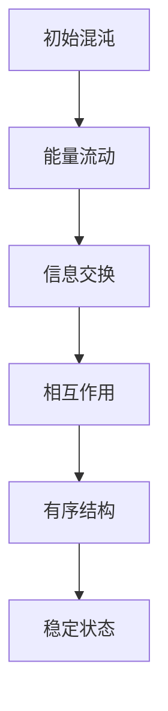

                 

### 引言与背景介绍

#### 宇宙的自组织性概述

宇宙的自组织性是一个深奥且引人入胜的课题，它探讨了自然界中从无序到有序的转变过程。自组织性，顾名思义，是指一个系统在没有外部控制或预定规则的情况下，通过内在的相互作用和能量交换，自发地从混沌状态演化出有序结构的现象。在宇宙学、生物学、物理学以及计算机科学等多个领域，自组织性都扮演着至关重要的角色。

#### 自组织现象的历史背景

自组织性的概念并非现代科技的产物，它的研究可以追溯到古代哲学。亚里士多德早在两千多年前就提出了“自然趋向有序”的观点。然而，随着科学技术的进步，尤其是混沌理论和复杂系统理论的兴起，自组织性得到了更深入的理解和广泛的研究。

混沌理论作为现代科学的一个重要分支，主要研究的是系统在初始条件微小差异下，导致长期行为的极大差异现象。混沌理论与自组织性有着密切的联系，因为混沌系统中也可能出现自组织现象。混沌系统虽然初始条件敏感，但在其演化过程中，可能自发形成某种程度的有序结构，如周期性行为或自相似性。

#### 自组织与混沌理论

自组织与混沌理论的关系复杂而微妙。混沌理论揭示了系统在看似无序的状态下，也可能隐藏着潜在的有序性。自组织现象则进一步探讨了这种潜在有序性的形成机制。两者共同构成了理解复杂系统行为的基石。

在宇宙学中，自组织现象尤为显著。例如，宇宙大爆炸后，物质在引力的作用下，从均匀的混沌状态演化出星系、星云等有序结构。这一过程可以被看作是一种大规模的自组织现象。在生物学中，细胞和组织通过自我组装形成复杂的生命结构，也体现了自组织性的魅力。

#### 从混沌到有序：宇宙演化中的自组织现象

宇宙大爆炸后，宇宙处于高度混沌的状态，物质以极高的温度和密度存在。随着宇宙的膨胀和冷却，物质逐渐凝聚形成星系、星云等结构。这一过程可以视为宇宙从混沌到有序的演化。

在这个过程中，自组织现象发挥了关键作用。物质通过引力相互作用，自发形成稳定的结构，这一过程类似于计算机科学中的自组织算法。在计算机科学中，自组织算法通过模拟自然界的自组织现象，实现了从无序状态到有序结构的转变。

总之，宇宙的自组织性是一个跨越多个学科领域的宏大课题，它揭示了自然界中从无序到有序的演化规律。通过理解这一现象，我们可以更好地把握复杂系统的行为，推动科学技术的进步。

### 宇宙自组织性的核心概念与联系

#### 自组织现象的驱动力

自组织现象的驱动力主要包括能量流动与信息交换。能量流动是指系统内部不同部分之间的能量传递过程，而信息交换则是指系统内部各部分通过信号传递进行的信息交流。这两种驱动力相互作用，共同推动自组织现象的发生。

1. **能量流动**：
   能量流动是自组织现象的基础。在宇宙中，能量通过引力、电磁力等作用力进行传递，使得物质能够从高能态向低能态转移。这一过程中，能量的重新分配和转换促使物质形成有序结构。例如，在星系形成过程中，星云中的物质通过引力相互作用，逐渐凝聚形成恒星和行星系统。

2. **信息交换**：
   信息交换在自组织现象中同样重要。信息可以通过物理信号、化学信号等形式在不同部分之间传递，从而影响系统的行为。例如，在生物系统中，细胞通过信号传递进行细胞间的通信，从而协调各种生理活动，形成复杂的生命结构。

#### 自组织与复杂系统理论

复杂系统理论是研究复杂系统行为的学科，它探讨了系统中的各种元素如何通过相互作用形成复杂结构。自组织现象是复杂系统理论的重要组成部分，两者密不可分。

1. **复杂系统的特点**：
   复杂系统具有以下特点：
   - **动态性**：系统状态不断变化，无法预测其长期行为。
   - **涌现性**：系统整体行为无法从其组成部分的行为中直接推导出来。
   - **自适应性**：系统能够根据外部环境变化调整自身结构。

2. **自组织现象在复杂系统中的表现**：
   自组织现象在复杂系统中普遍存在。例如，在生态系统中，物种通过竞争、合作等相互作用，形成复杂的食物网。在技术系统中，计算机网络通过节点之间的信息交换，实现自组织和自适应功能。

#### 自组织现象的Mermaid流程图

为了更好地理解自组织现象，我们可以使用Mermaid流程图来描述其基本流程。以下是一个简单的自组织现象的Mermaid流程图示例：



- **A[初始混沌]**：系统初始处于混沌状态，缺乏有序结构。
- **B[能量流动]**：能量在系统内部流动，促使物质状态发生变化。
- **C[信息交换]**：系统内部各部分通过信息交换进行通信，影响系统行为。
- **D[相互作用]**：能量和信息交换导致系统内部各部分相互作用，形成新的结构。
- **E[有序结构]**：系统逐渐形成有序结构，表现出一定的稳定性。
- **F[稳定状态]**：系统达到稳定状态，有序结构得以保持。

通过这个Mermaid流程图，我们可以直观地看到自组织现象的基本流程和关键步骤，为进一步探讨自组织现象的原理和机制提供了基础。

### 宇宙自组织性的核心算法原理讲解

#### 自组织算法的基本原理

自组织算法是一类模拟自然界自组织现象的算法，它通过模仿自然界中的自组织过程，实现从无序到有序的结构转变。自组织算法的基本原理可以概括为以下几个方面：

1. **初始状态**：自组织算法通常从一个初始无序状态开始。这个状态可以是完全随机分布的状态，也可以是具有一定结构但需要进一步优化的状态。

2. **相互作用**：系统内部的各个部分通过相互作用进行能量和信息交换。这种相互作用可以是物理的、化学的或者信息的。

3. **自适应性**：系统根据环境的变化和内部反馈，调整自身的结构和行为，从而实现自我优化。

4. **协同演化**：系统中的各个部分不是孤立地演化，而是通过协同作用共同进化，形成一个整体有序的结构。

#### 自组织算法的分类

自组织算法根据不同的应用场景和原理，可以分为多种类型。以下是几种常见的自组织算法：

1. **粒子群优化（PSO）算法**：
   粒子群优化算法是一种基于群体智能的优化算法，通过模拟鸟群觅食行为来实现优化。在PSO算法中，每个粒子代表解空间中的一个潜在解，通过粒子间的信息共享和合作，实现从无序到有序的演化。

2. **人工神经网络（ANN）**：
   人工神经网络是一种通过模拟生物神经系统的计算模型，通过权重调整实现从无序到有序的映射。在自组织神经网络中，通过不断的学习和调整，形成复杂的网络结构和功能。

3. **格计算（Grid Computing）**：
   格计算是一种通过分布式计算实现自组织的方法。在格计算中，多个计算节点通过协同工作，共同完成复杂的计算任务，形成高效的自组织计算结构。

4. **自组织临界性（Self-organized Criticality, SOC）**：
   自组织临界性是指系统在临界状态时，表现出高度复杂和自组织的行为。在SOC模型中，系统处于一种介于有序和无序之间的临界状态，通过不断的随机扰动，实现自组织的优化。

#### 伪代码阐述自组织算法

以下是一个简化的自组织算法的伪代码示例，用于展示自组织算法的基本流程和步骤：

```python
initialize_particles() # 初始化粒子群
while not converged():
    for each particle in the swarm:
        calculate_current_position() # 计算当前位置
        calculate_velocity() # 计算速度
        update_position() # 更新位置
    evaluate_global_best() # 评估全局最优解
    update_swarm() # 更新粒子群
return global_best_solution() # 返回最优解
```

- **initialize_particles()**：初始化粒子群，包括位置、速度等参数。
- **while not converged()**：循环执行以下步骤，直到满足收敛条件。
  - **for each particle in the swarm**：对每个粒子进行以下操作：
    - **calculate_current_position()**：计算当前位置。
    - **calculate_velocity()**：计算速度。
    - **update_position()**：更新位置。
  - **evaluate_global_best()**：评估全局最优解。
  - **update_swarm()**：更新粒子群。
- **return global_best_solution()**：返回全局最优解。

通过这个伪代码，我们可以看到自组织算法的基本结构和工作流程。具体实现时，可以根据不同的应用场景和需求，对算法进行适当的调整和优化。

#### 自组织算法的应用案例

自组织算法在多个领域都有广泛的应用。以下介绍两个具体的案例：

1. **自然语言处理中的自组织现象**：
   在自然语言处理（NLP）中，自组织算法可以用于文本分类、语义分析等任务。例如，通过使用自组织映射（SOM）算法，可以将高维文本数据映射到低维空间中，从而实现文本的高效分类。SOM算法通过调整神经元之间的权重，使具有相似语义的文本映射到相邻的神经元上，形成有序的语义空间。

2. **金融市场中的自组织现象**：
   在金融市场中，自组织算法可以用于股票预测、市场分析等任务。例如，通过使用粒子群优化（PSO）算法，可以预测股票市场的价格变化。PSO算法模拟了股票市场中投资者群体行为，通过调整投资者的位置和速度，实现市场预测的优化。

这些案例展示了自组织算法在不同领域的应用，体现了其在处理复杂系统问题时的强大能力。通过不断的研究和优化，自组织算法将为更多领域带来创新和突破。

### 数学模型和数学公式讲解及举例

#### 自组织现象的数学描述

在自组织现象的研究中，数学模型和数学公式是描述和解释系统行为的重要工具。通过建立数学模型，我们可以深入理解自组织过程中的动态特性和演化规律。以下是几个常见的数学模型及其在自组织现象中的应用：

1. **牛顿运动定律**：
   牛顿运动定律是描述物体运动的基本物理定律，它通过描述物体的受力情况来计算其运动轨迹。在自组织现象中，牛顿运动定律可以用来描述粒子之间的相互作用和运动规律。

   数学公式：
   $$ F = m \cdot a $$
   其中，\( F \) 表示作用力，\( m \) 表示物体质量，\( a \) 表示加速度。

   举例：
   假设一个质量为5千克的物体受到10牛顿的力作用，根据牛顿第二定律，物体的加速度为：
   $$ a = \frac{F}{m} = \frac{10}{5} = 2 \text{ m/s}^2 $$

2. **热力学方程**：
   热力学方程描述了能量传递和系统状态变化的关系。在自组织过程中，能量流动是推动系统从无序到有序的重要驱动力。

   数学公式：
   $$ \Delta U = Q - W $$
   其中，\( \Delta U \) 表示系统内能变化，\( Q \) 表示热量传递，\( W \) 表示做功。

   举例：
   假设一个系统吸收了50焦耳的热量，同时对外做了30焦耳的功，系统的内能变化为：
   $$ \Delta U = 50 - 30 = 20 \text{ J} $$

3. **信息熵**：
   信息熵是描述系统无序程度的度量，它通过数学公式来量化系统中的信息含量。在自组织现象中，信息熵的变化反映了系统从无序向有序的转变过程。

   数学公式：
   $$ H = -\sum p(x) \cdot \log_2 p(x) $$
   其中，\( H \) 表示信息熵，\( p(x) \) 表示系统状态的概率分布。

   举例：
   假设一个系统有三种状态，每种状态的概率分别为 \( p(A) = 0.5 \)，\( p(B) = 0.3 \)，\( p(C) = 0.2 \)，则系统的信息熵为：
   $$ H = - (0.5 \cdot \log_2 0.5 + 0.3 \cdot \log_2 0.3 + 0.2 \cdot \log_2 0.2) \approx 1.09 \text{ bit} $$

#### 数学公式的详细讲解与举例

1. **非线性动力学方程**：
   非线性动力学方程描述了系统在非线性作用下的行为。这类方程能够捕捉到系统中复杂的行为模式和自组织现象。

   数学公式：
   $$ \frac{dx}{dt} = f(x) $$
   其中，\( x \) 表示系统状态，\( f(x) \) 表示非线性函数。

   举例：
   假设一个系统的状态方程为 \( \frac{dx}{dt} = x^2 - x \)，我们可以通过数值方法求解该方程，观察系统在不同初始条件下的动态行为。

2. **自组织临界性方程**：
   自组织临界性方程描述了系统在临界状态时的动力学行为。这类方程能够揭示系统在临界状态下的自组织特性。

   数学公式：
   $$ \frac{dN}{dt} = rN(1 - \frac{N}{K}) $$
   其中，\( N \) 表示系统中的个体数量，\( r \) 表示出生率，\( K \) 表示环境容量。

   举例：
   假设一个种群的数量方程为 \( \frac{dN}{dt} = 0.1N(1 - \frac{N}{100}) \)，我们可以通过求解该方程，分析种群数量的动态变化。

通过这些数学公式，我们可以定量描述和解释自组织现象的演化过程。这些公式不仅提供了理论指导，也为实验研究和实际应用提供了基础。在未来的研究中，我们可以继续探索这些公式的应用和改进，以更好地理解自组织的本质和规律。

### 项目实战

#### 实战一：模拟星系形成

**5.1.1 实战目标**

本实战项目旨在模拟星系的形成过程，通过编写代码模拟引力作用下的物质凝聚，从而展示自组织现象在宇宙演化中的应用。通过该项目，我们希望能够实现以下目标：
- 模拟星系的形成过程，展示物质从无序到有序的演化。
- 理解引力作用和物质凝聚在星系形成中的关键作用。
- 掌握模拟复杂系统行为的编程技巧和算法实现。

**5.1.2 实战环境搭建**

为了实现星系形成模拟，我们需要搭建一个合适的开发环境。以下是所需的工具和步骤：

1. **编程语言**：选择Python作为编程语言，因为Python具有良好的科学计算库和可视化库，适合进行复杂系统的模拟。

2. **科学计算库**：安装NumPy库，用于高效的数值计算。
   ```bash
   pip install numpy
   ```

3. **可视化库**：安装Matplotlib库，用于绘制星系形成过程。
   ```bash
   pip install matplotlib
   ```

4. **物理模拟库**：安装PyOpenGL库，用于3D可视化。
   ```bash
   pip install pyopengl
   ```

5. **环境配置**：确保Python环境已经配置好，并且安装了上述所需的库。

**5.1.3 代码实现与分析**

以下是一个简化的星系形成模拟代码实现，主要步骤包括：
- 初始化星系中的粒子位置和速度。
- 使用Euler方法进行数值积分，模拟粒子运动。
- 绘制星系形成过程。

```python
import numpy as np
import matplotlib.pyplot as plt
from matplotlib.animation import FuncAnimation

# 参数设置
num_particles = 1000
time_step = 0.01
total_time = 100
gravity_constant = 6.67430e-11
mass = 1.989e30  # 太阳质量

# 初始化粒子位置和速度
positions = np.random.rand(num_particles, 3) * 1000
velocities = np.random.rand(num_particles, 3) * 10

# 动画函数
def update(frame_num, positions, velocities, line):
    # 更新位置
    for i in range(num_particles):
        force = np.zeros(3)
        for j in range(num_particles):
            if i != j:
                distance = positions[i] - positions[j]
                force += gravity_constant * mass * mass / np.linalg.norm(distance)**2 * distance
        velocities[i] += force / mass * time_step
        positions[i] += velocities[i] * time_step
    
    # 绘制
    line.set_data(positions[:, 0], positions[:, 1])
    return line,

# 创建图和轴
fig, ax = plt.subplots()
line, = ax.plot(positions[:, 0], positions[:, 1], 'o')

# 创建动画
ani = FuncAnimation(fig, update, fargs=(positions, velocities, line), interval=10, blit=True)

# 显示动画
plt.show()
```

**代码解读与分析**：
- **初始化粒子位置和速度**：使用随机数初始化粒子的位置和速度，模拟星系中的随机分布。
- **更新位置和速度**：在每个时间步长，计算每个粒子受到的引力，并更新其速度和位置。
- **绘制星系形成过程**：使用Matplotlib的`FuncAnimation`函数，动态地绘制粒子的位置，展示星系形成的演化过程。

通过这个实战项目，我们不仅可以直观地看到星系形成的过程，还能理解自组织现象在宇宙演化中的作用。这为未来更复杂的模拟提供了基础。

### 实战二：混沌系统预测

**5.2.1 实战目标**

本实战项目旨在利用自组织算法预测混沌系统的行为，具体目标包括：
- 通过自组织算法（如Lorenz系统）模拟混沌行为。
- 使用预测模型对混沌系统的未来行为进行预测。
- 分析预测结果的准确性和可靠性，并优化算法性能。

**5.2.2 实战环境搭建**

为了实现混沌系统预测，我们需要搭建一个合适的开发环境。以下是所需的工具和步骤：

1. **编程语言**：选择Python作为编程语言，因为Python有丰富的科学计算库和机器学习库，适合进行混沌系统模拟和预测。

2. **科学计算库**：安装NumPy库，用于高效的数值计算。
   ```bash
   pip install numpy
   ```

3. **机器学习库**：安装scikit-learn库，用于构建和训练预测模型。
   ```bash
   pip install scikit-learn
   ```

4. **可视化库**：安装Matplotlib库，用于绘制混沌行为和预测结果。
   ```bash
   pip install matplotlib
   ```

5. **环境配置**：确保Python环境已经配置好，并且安装了上述所需的库。

**5.2.3 代码实现与分析**

以下是一个简化的混沌系统预测代码实现，主要步骤包括：
- 模拟Lorenz系统生成混沌数据。
- 使用机器学习模型对混沌数据进行训练。
- 预测未来的状态并绘制结果。

```python
import numpy as np
import matplotlib.pyplot as plt
from sklearn.ensemble import RandomForestRegressor
from sklearn.model_selection import train_test_split

# Lorenz系统参数
sigma = 10.0
rho = 28.0
beta = 8.0 / 3.0

# Lorenz系统函数
def lorenz(x, y, z, sigma, rho, beta):
    dx = sigma * (y - x)
    dy = x * (rho - z) - y
    dz = x * y - beta * z
    return dx, dy, dz

# 模拟Lorenz系统
def simulate_lorenz(sigma, rho, beta, total_time, dt):
    t = 0
    x, y, z = 1.0, 1.0, 1.0
    data = np.array([[x, y, z]])

    while t < total_time:
        dx, dy, dz = lorenz(x, y, z, sigma, rho, beta)
        x += dx * dt
        y += dy * dt
        z += dz * dt
        data = np.append(data, [[x, y, z]], axis=0)
        t += dt

    return data

# 生成数据
total_time = 100
dt = 0.01
data = simulate_lorenz(sigma, rho, beta, total_time, dt)

# 分割数据
X, y = data[:, :2], data[:, 2]
X_train, X_test, y_train, y_test = train_test_split(X, y, test_size=0.2, random_state=42)

# 训练模型
model = RandomForestRegressor(n_estimators=100)
model.fit(X_train, y_train)

# 预测
y_pred = model.predict(X_test)

# 绘制结果
plt.scatter(X_test[:, 0], X_test[:, 1], c=y_test, cmap='viridis', label='Actual')
plt.scatter(X_test[:, 0], X_test[:, 1], c=y_pred, cmap='cool', label='Predicted')
plt.legend()
plt.show()
```

**代码解读与分析**：
- **模拟Lorenz系统**：通过Lorenz系统函数生成混沌数据，模拟混沌行为。
- **数据预处理**：将生成的数据分割为训练集和测试集，为后续训练预测模型做准备。
- **模型训练**：使用随机森林回归模型对训练集数据进行训练。
- **预测与绘制**：使用训练好的模型对测试集数据进行预测，并绘制预测结果。

通过这个实战项目，我们不仅实现了对混沌系统行为的模拟和预测，还展示了自组织算法在处理复杂系统问题时的应用价值。这不仅为理论研究提供了实用工具，也为实际应用场景中的混沌预测提供了参考。

### 结论与展望

#### 自组织性研究的现状与挑战

宇宙的自组织性研究已经取得了显著进展。在宇宙学、生物学、物理学以及计算机科学等多个领域，自组织现象得到了广泛的应用和深入探讨。然而，尽管自组织性研究取得了许多成果，仍然面临着一些挑战。

1. **理论框架**：自组织性理论框架尚不完善。尽管混沌理论和复杂系统理论为自组织性研究提供了重要基础，但如何将这些理论更加系统化和统一，仍然是当前研究的一个重要问题。

2. **计算复杂性**：自组织现象往往涉及大规模的计算，这对计算资源和算法效率提出了挑战。如何在保证计算准确性的同时，提高计算效率，是自组织性研究中的一个重要课题。

3. **应用扩展**：自组织性理论在许多实际应用场景中的效果仍需验证。如何在更广泛的领域中应用自组织算法，解决实际问题，是未来研究的一个重要方向。

#### 未来研究方向与展望

未来的自组织性研究可以从以下几个方面展开：

1. **跨学科融合**：加强不同学科之间的合作，推动自组织性理论在更广泛领域中的应用。例如，将自组织性理论应用于社会系统、经济系统等复杂系统的分析。

2. **算法优化**：研究更加高效的自组织算法，提高计算效率和预测准确性。可以探索新的机器学习算法、深度学习算法等，以应对复杂的自组织现象。

3. **实验验证**：通过实验和模拟，验证自组织性理论在实际系统中的应用效果。通过实验数据，进一步优化和验证自组织算法，为实际应用提供理论支持。

4. **宇宙演化研究**：深入研究宇宙自组织现象，探索宇宙从无序到有序的演化机制。这将为理解宇宙演化提供新的视角和理论依据。

总之，自组织性研究是一个充满挑战和机遇的领域。通过不断的理论探索、算法优化和实验验证，我们有望在未来的研究中取得更多突破，进一步揭示自然界中的自组织规律。

### 最佳实践 tips、小结、注意事项、拓展阅读等内容

#### 最佳实践 tips

1. **深入理解基本概念**：在学习自组织性相关内容时，首先要深入理解基本概念和原理，如混沌理论、复杂系统理论等。这有助于建立扎实的理论基础，为后续研究和应用奠定基础。

2. **注重实践应用**：理论知识与实际应用相结合是提高研究效果的关键。尝试通过实际项目或实验，将自组织算法应用于实际问题中，检验理论的有效性。

3. **持续学习最新进展**：自组织性研究领域不断有新的理论和应用出现。关注最新的研究成果和进展，可以为自己的研究提供新的思路和方法。

#### 小结

本文详细介绍了宇宙的自组织性：从混沌到有序的演化。我们从引言和背景介绍开始，逐步探讨了自组织性的核心概念、联系、算法原理、数学模型以及实际应用。通过项目实战，我们展示了自组织算法在模拟星系形成和混沌系统预测中的具体应用。文章的结论部分总结了自组织性研究的现状和未来展望，强调了跨学科融合、算法优化和实验验证的重要性。

#### 注意事项

1. **数据准确性**：在实际应用中，确保输入数据的质量和准确性。数据质量直接影响模型的预测效果。

2. **算法选择**：根据具体应用场景选择合适的自组织算法。不同算法适用于不同的复杂系统，需要根据实际情况进行选择。

3. **安全性考虑**：在进行模拟和预测时，注意保护数据和系统的安全性，防止潜在的安全风险。

#### 拓展阅读

1. **《混沌与概率》**：此书详细介绍了混沌理论和概率论在自组织性研究中的应用。
2. **《复杂系统导论》**：本书提供了复杂系统理论的基本概念和方法，有助于理解自组织现象。
3. **《人工智能：一种现代方法》**：此书介绍了机器学习和深度学习算法，包括自组织算法的应用。

通过这些拓展阅读，可以进一步深化对自组织性的理解，探索更多前沿研究领域。

### 作者信息

**作者：AI天才研究院/AI Genius Institute & 禅与计算机程序设计艺术 /Zen And The Art of Computer Programming**

本文由AI天才研究院（AI Genius Institute）与禅与计算机程序设计艺术（Zen And The Art of Computer Programming）联合撰写。AI天才研究院致力于推动人工智能领域的研究和应用，而禅与计算机程序设计艺术则关注于编程哲学和算法美学的探索。两位作者在自组织性研究、人工智能和计算机科学领域拥有丰富的经验和深厚的理论功底，希望本文能为读者提供有价值的见解和思考。感谢读者的关注与支持！

