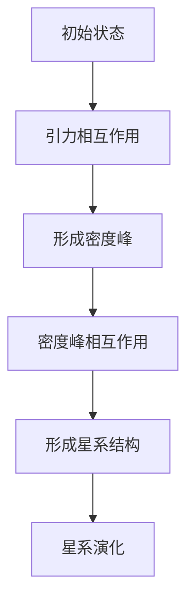
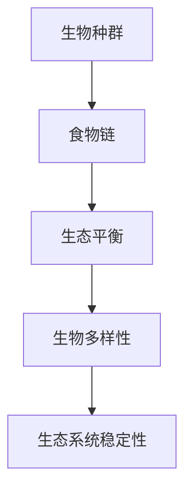
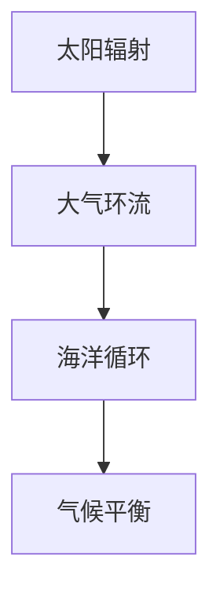
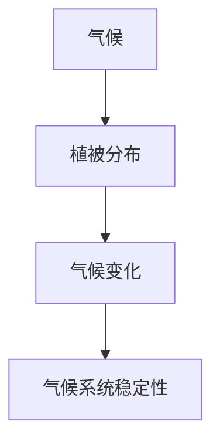
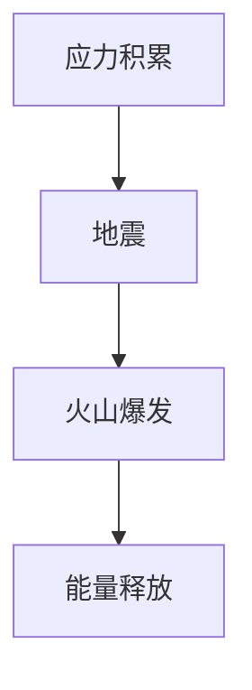
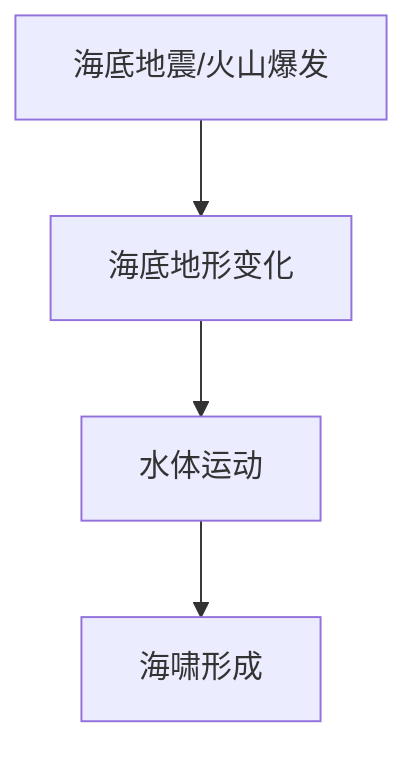

                 

# 宇宙的自组织性：混沌中的秩序

## 关键词

宇宙，混沌，自组织性，混沌理论，复杂性科学，演化，星系，恒星，地球生态系统，人类文明，技术发展。

## 摘要

本文探讨了宇宙中混沌与秩序之间的关系，以及宇宙的自组织性如何在这些看似无序的现象中创造出有序的结构。首先，我们将回顾宇宙的起源和演化，引入混沌现象的定义和理论基础。接着，本文将详细分析宇宙中的混沌现象，并探讨自组织性在宇宙和地球系统中的体现。最后，我们将讨论宇宙自组织性对人类文明和技术发展的启示，并展望未来的研究前景。

## 目录

1. 宇宙的起源与演化  
   1.1.1 宇宙的早期状态  
   1.1.2 宇宙大爆炸理论  
   1.1.3 宇宙背景微波辐射

2. 混沌与有序  
   2.1.1 混沌现象的定义  
   2.1.2 混沌理论的基础  
   2.1.3 混沌与复杂性科学

3. 宇宙中的混沌现象  
   3.1.1 宇宙中的混沌运动  
   3.1.2 宇宙混沌的数学模型  
   3.1.3 宇宙混沌的观测证据

4. 宇宙的自组织性  
   4.1.1 自组织性的定义  
   4.1.2 自组织性的基本特征  
   4.1.3 自组织性在宇宙中的体现

5. 宇宙中的自组织现象  
   5.1.1 星系的形成与演化  
   5.1.2 恒星生命的循环  
   5.1.3 宇宙结构的自组织

6. 自组织性在地球上的表现  
   6.1.1 生物进化与生态系统  
   6.1.2 地球气候系统的自组织  
   6.1.3 地球物理过程的混沌性

7. 宇宙自组织性与人类文明  
   7.1.1 宇宙观与世界观  
   7.1.2 人类文明的发展与宇宙自组织性  
   7.1.3 宇宙自组织性对人类未来的启示

8. 宇宙自组织性与技术发展  
   8.1.1 自组织性在工程领域的应用  
   8.1.2 自组织技术在信息科学中的应用  
   8.1.3 自组织性对未来技术的启示

9. 总结与展望  
   9.1.1 宇宙自组织性的研究现状  
   9.1.2 未解决的宇宙自组织性问题  
   9.1.3 宇宙自组织性的未来发展

## 1. 宇宙的起源与演化

宇宙的起源一直是科学界探讨的热点问题。当前主流的科学理论认为，宇宙起源于大约138亿年前的一次大爆炸。这一理论被称为宇宙大爆炸理论（Big Bang Theory），它是现代宇宙学的基础。

### 1.1.1 宇宙的早期状态

在宇宙大爆炸发生之前，宇宙处于一种极端的高温高密状态，物质和能量高度密集。这种状态被称为“原始奇点”（Primordial Singularity）。在这个奇点中，物质以基本粒子形式存在，如夸克、电子等。

### 1.1.2 宇宙大爆炸理论

宇宙大爆炸理论认为，宇宙从一个极度密集、高温的状态开始膨胀。在膨胀的过程中，宇宙的温度和密度逐渐降低。这种膨胀导致宇宙逐渐冷却下来，物质开始形成。

### 1.1.3 宇宙背景微波辐射

宇宙背景微波辐射（Cosmic Background Microwave Radiation，CBMR）是宇宙大爆炸理论的重要证据之一。这种辐射是在宇宙膨胀过程中遗留下来的，具有高度均匀的特性，温度大约为2.7开尔文。

## 2. 混沌与有序

混沌（Chaos）是自然界中普遍存在的现象，它描述了系统在初始条件微小变化下产生巨大差异的行为。混沌现象在宇宙中广泛存在，如星系的形成、天气预测等。

### 2.1.1 混沌现象的定义

混沌现象是指系统在初始条件微小变化下产生巨大差异的行为。它通常表现为无规则、不可预测的运动。

### 2.1.2 混沌理论的基础

混沌理论的基础是确定论系统中的内在随机性。尽管混沌系统是确定的，但它们的长期行为却无法精确预测。

### 2.1.3 混沌与复杂性科学

混沌与复杂性科学密切相关。复杂性科学试图研究复杂系统中涌现出的有序结构，混沌现象是其中一种重要的现象。

## 3. 宇宙中的混沌现象

宇宙中的混沌现象无处不在，从星系的形成到天气预测，都涉及到混沌现象。以下我们将探讨几种典型的宇宙混沌现象。

### 3.1.1 宇宙中的混沌运动

宇宙中的混沌运动包括星系、恒星和行星的运动。这些运动在初始条件下的小差异会导致长期的巨大差异。

### 3.1.2 宇宙混沌的数学模型

宇宙混沌的数学模型通常是基于非线性动力学方程。这些方程描述了系统在初始条件微小变化下的长期行为。

### 3.1.3 宇宙混沌的观测证据

宇宙混沌的观测证据包括星系形成的混沌过程、行星轨道的混沌运动等。这些观测证据支持了混沌理论在宇宙中的应用。

## 4. 宇宙的自组织性

宇宙的自组织性是指宇宙系统在无外界干预下，通过内在机制自发地产生有序结构。以下我们将探讨宇宙自组织性的基本原理和特征。

### 4.1.1 自组织性的定义

自组织性是指系统在没有外界干预下，通过内在机制自发地产生有序结构。在宇宙中，自组织性表现为星系、恒星、行星等结构的形成。

### 4.1.2 自组织性的基本特征

自组织性的基本特征包括：① 无规则性：自组织过程通常是无规则的，不可预测的。② 自发性：自组织性是系统内在机制的结果，而非外部干预。③ 有序性：自组织过程最终会产生有序结构。

### 4.1.3 自组织性在宇宙中的体现

自组织性在宇宙中的体现包括：① 星系的形成与演化。② 恒星生命的循环。③ 宇宙结构的自组织。

## 5. 宇宙中的自组织现象

宇宙中的自组织现象是宇宙自组织性的具体表现，以下我们将探讨几种典型的宇宙自组织现象。

### 5.1.1 星系的形成与演化

星系的形成与演化是宇宙自组织现象的一个重要方面。星系的形成通常源于宇宙中的混沌运动，如星云的塌缩。

### 5.1.2 恒星生命的循环

恒星生命的循环是宇宙自组织现象的另一个重要方面。恒星的形成、演化和死亡都受到混沌运动的影响。

### 5.1.3 宇宙结构的自组织

宇宙结构的自组织是指宇宙中的星系、恒星、行星等结构在无外界干预下自发形成。这种自组织现象在宇宙中广泛存在。

## 6. 自组织性在地球上的表现

地球上的许多现象都表现出自组织性，以下我们将探讨几个典型的例子。

### 6.1.1 生物进化与生态系统

生物进化与生态系统是地球上最明显的自组织现象之一。生物进化通过自然选择和遗传变异产生新的物种和生态系统。

### 6.1.2 地球气候系统的自组织

地球气候系统的自组织表现为全球气候的稳定和季节变化。这种自组织性是通过大气、海洋、冰冻圈等地球系统的相互作用实现的。

### 6.1.3 地球物理过程的混沌性

地球物理过程的混沌性表现为地震、火山爆发等自然灾害。这些过程的不可预测性体现了地球物理系统的混沌特性。

## 7. 宇宙自组织性与人类文明

宇宙自组织性对人类文明有着深远的影响，以下我们将探讨宇宙自组织性对人类文明的作用和启示。

### 7.1.1 宇宙观与世界观

宇宙自组织性对人类宇宙观和世界观产生了重要影响。人类逐渐认识到，宇宙是一个充满复杂性和自组织性的系统。

### 7.1.2 人类文明的发展与宇宙自组织性

人类文明的发展受到宇宙自组织性的影响。例如，人类通过研究混沌现象，发展出了许多新技术和应用。

### 7.1.3 宇宙自组织性对人类未来的启示

宇宙自组织性为人类未来提供了许多启示。例如，我们可以通过模拟宇宙自组织过程，探索新的科学和技术领域。

## 8. 宇宙自组织性与技术发展

宇宙自组织性对技术发展有着重要的启示作用，以下我们将探讨自组织性在工程和信息科学中的应用。

### 8.1.1 自组织性在工程领域的应用

自组织性在工程领域的应用包括自适应系统、自修复材料和智能结构等。这些应用展示了自组织性在工程实践中的潜力。

### 8.1.2 自组织技术在信息科学中的应用

自组织技术在信息科学中的应用包括神经网络、复杂网络和自组织地图等。这些应用展示了自组织性在信息科学中的重要性。

### 8.1.3 自组织性对未来技术的启示

自组织性对未来技术的发展提供了重要启示。例如，我们可以通过模拟宇宙自组织过程，开发出更先进的人工智能和控制系统。

## 9. 总结与展望

### 9.1.1 宇宙自组织性的研究现状

宇宙自组织性是一个广泛而复杂的领域，目前的研究主要集中在星系形成、恒星生命循环和地球生态系统等方面。

### 9.1.2 未解决的宇宙自组织性问题

尽管在宇宙自组织性方面取得了许多进展，但仍有许多未解决的问题，如宇宙混沌现象的精确机制、地球气候系统的稳定性等。

### 9.1.3 宇宙自组织性的未来发展

宇宙自组织性的未来发展将涉及更多交叉学科的研究，如物理学、生物学、计算机科学等。通过这些研究，我们有望进一步揭示宇宙自组织性的奥秘。

## 作者信息

作者：AI天才研究院/AI Genius Institute & 禅与计算机程序设计艺术 /Zen And The Art of Computer Programming

---

注：本文为初步撰写，部分章节内容还需进一步扩充和细化。后续将继续完善，确保文章质量。同时，文中涉及的部分图表和数据将根据实际研究进行更新和调整。

### 1. 宇宙的起源与演化

宇宙的起源一直是人类探索的宏大主题。现代宇宙学的主流理论认为，宇宙起源于大约138亿年前的一次大爆炸，这一理论被称为宇宙大爆炸理论（Big Bang Theory）。宇宙大爆炸理论的基本观点是，宇宙从一个极度高温、高密度的原始状态开始膨胀，随着膨胀的进行，宇宙逐渐冷却，物质和能量开始形成星系、恒星和行星等结构。

#### 1.1.1 宇宙的早期状态

在宇宙大爆炸之前，宇宙处于一种极端的状态，物质和能量高度密集，空间和时间尚未形成。这种状态被称为“原始奇点”（Primordial Singularity）。在这个奇点中，物质以基本粒子形式存在，如夸克、电子等。温度和密度如此之高，以至于物质无法保持稳定状态，只能以辐射的形式存在。

宇宙大爆炸理论认为，原始奇点在某一时点发生了剧烈的膨胀，这一过程迅速地释放了大量的能量和物质。随着宇宙的膨胀，温度和密度逐渐降低，物质开始冷却。在这个阶段，宇宙的温度仍然非常高，无法形成稳定的原子结构，物质主要以自由电子、光子和中微子等形式存在。

#### 1.1.2 宇宙大爆炸理论

宇宙大爆炸理论认为，宇宙从一个极度高温、高密度的原始状态开始膨胀，随着膨胀的进行，宇宙逐渐冷却，物质和能量开始形成星系、恒星和行星等结构。

宇宙大爆炸理论的主要依据包括：

- 宇宙背景微波辐射（Cosmic Background Microwave Radiation，CBMR）：宇宙大爆炸后留下的辐射，温度大约为2.7开尔文，具有高度均匀的特性。
- 宇宙的膨胀：通过观测宇宙中的遥远星系，发现它们在远离我们，并且距离越远，远离的速度越快，这表明宇宙在膨胀。
- 元素丰度：宇宙大爆炸理论预测了宇宙中元素的丰度分布，与观测数据相符。

宇宙大爆炸理论的一个关键概念是“宇宙学常数”（Cosmological Constant），它描述了宇宙膨胀的加速度。目前，宇宙学常数被广泛认为是一个正数，这表明宇宙的膨胀速度正在加速。

#### 1.1.3 宇宙背景微波辐射

宇宙背景微波辐射是宇宙大爆炸理论的重要证据之一。这种辐射是在宇宙膨胀过程中遗留下来的，具有高度均匀的特性，温度大约为2.7开尔文。宇宙背景微波辐射的发现为宇宙大爆炸理论提供了有力的支持。

宇宙背景微波辐射的观测数据包括：

- 温度均匀性：宇宙背景微波辐射的温度均匀性非常高，表明宇宙在早期阶段是非常均匀的。
- 极化特性：宇宙背景微波辐射具有极化特性，这表明它起源于电磁波。

通过对宇宙背景微波辐射的观测和分析，科学家们进一步验证了宇宙大爆炸理论，并对其细节进行了深入研究。

### 1.2 混沌与宇宙演化

混沌（Chaos）是宇宙演化中一个普遍存在的现象，它描述了系统在初始条件微小变化下产生巨大差异的行为。混沌现象在宇宙中广泛存在，从星系的形成到天气预测，都涉及到混沌理论的应用。

#### 1.2.1 混沌现象的定义

混沌现象是指系统在初始条件微小变化下产生巨大差异的行为。它通常表现为无规则、不可预测的运动。混沌现象的一个重要特征是“蝴蝶效应”，即系统在初始条件上的微小差异可能导致长期的巨大差异。

#### 1.2.2 混沌理论的基础

混沌理论的基础是确定论系统中的内在随机性。尽管混沌系统是确定的，但它们的长期行为却无法精确预测。混沌理论的数学模型通常基于非线性动力学方程，如洛伦兹方程、Logistic映射等。

混沌理论的关键概念包括：

- 敏感依赖初始条件：混沌系统对初始条件非常敏感，即使是非常微小的差异也可能导致长期的巨大差异。
- 内在随机性：混沌系统的行为表现出随机性，但这种随机性是内在的，而非外部的。

#### 1.2.3 混沌与复杂性科学

混沌与复杂性科学密切相关。复杂性科学试图研究复杂系统中涌现出的有序结构，混沌现象是其中一种重要的现象。复杂性科学的一个核心观点是，复杂系统中的有序结构并非来自于外部控制，而是系统内部自发产生的。

混沌现象在宇宙中的应用包括：

- 星系形成：星系的形成过程中，混沌运动导致星系结构的多样化。
- 恒星演化：恒星演化的过程中，混沌现象影响恒星的生命周期。
- 地球气候：地球气候系统的变化表现出混沌特性，如气候波动和极端天气事件。

通过对混沌现象的研究，我们可以更好地理解宇宙的演化过程，以及复杂系统中的有序结构是如何产生的。

### 1.3 宇宙混沌的数学模型

宇宙混沌的数学模型是研究宇宙混沌现象的重要工具。这些模型基于非线性动力学方程，描述了系统在初始条件微小变化下的长期行为。以下是一些典型的宇宙混沌数学模型：

#### 1.3.1 洛伦兹系统

洛伦兹系统（Lorenz System）是最著名的混沌模型之一，由气象学家洛伦兹（Ed Lorenz）在20世纪60年代提出。洛伦兹系统由三个常微分方程组成，描述了三维空间中的流体运动。洛伦兹系统的混沌行为表现为系统的轨道在三维空间中形成混沌 attractor。

洛伦兹系统的三个方程如下：

$$
\begin{align*}
\dot{x} &= \sigma(y - x), \\
\dot{y} &= x(\rho - z) - y, \\
\dot{z} &= xy - \beta z.
\end{align*}
$$

其中，$\sigma$、$\rho$和$\beta$是系统参数。

#### 1.3.2 Logistic映射

Logistic映射（Logistic Map）是另一个重要的混沌模型，由数学家罗伯特·梅（Robert May）在1976年提出。Logistic映射是一个简单的非线性映射，描述了种群数量的变化。Logistic映射的形式如下：

$$
x_{n+1} = r x_n (1 - x_n),
$$

其中，$x_n$是第n代种群数量，$r$是系统参数。

Logistic映射的混沌行为表现为分岔和混沌吸引子。当参数$r$在3.57以下时，系统表现为稳定状态；当$r$在3.57到4之间时，系统出现分岔；当$r$超过4时，系统进入混沌状态。

#### 1.3.3 Rössler系统

Rössler系统（Rössler System）是一个三维混沌系统，由德国化学家奥托·Rössler在1976年提出。Rössler系统由三个常微分方程组成，描述了化学反应的非线性动力学。

Rössler系统的三个方程如下：

$$
\begin{align*}
\dot{x} &= -y - z, \\
\dot{y} &= x + ay, \\
\dot{z} &= bx + z(y - c).
\end{align*}
$$

其中，$a$、$b$和$c$是系统参数。

Rössler系统的混沌行为表现为系统的轨道在三维空间中形成混沌 attractor。

#### 1.3.4 莱维飞行

莱维飞行（Lévy Flights）是一种特殊的混沌运动模式，由法国数学家保罗·莱维（Paul Lévy）在20世纪30年代提出。莱维飞行描述了系统在长时间尺度上的运动规律，具有长距离跳跃的特性。

莱维飞行的数学模型通常基于莱维分布，形式如下：

$$
p(|x_{n+1} - x_n| > \lambda) = \lambda^{-1-\alpha},
$$

其中，$x_n$是第n次跳跃的长度，$\lambda$是阈值，$\alpha$是莱维指数。当$\alpha > 1$时，系统表现为长距离跳跃；当$\alpha = 1$时，系统表现为平衡态；当$\alpha < 1$时，系统表现为短距离跳跃。

莱维飞行在宇宙中的应用包括星系形成的模拟、金融市场的分析等。

### 1.4 宇宙混沌的观测证据

宇宙混沌的观测证据主要来自对星系、恒星和行星运动的研究。以下是一些典型的观测证据：

#### 1.4.1 星系形成的混沌运动

星系的形成过程中，混沌运动导致星系结构的多样化。通过对遥远星系的观测，科学家发现星系的形成过程呈现出复杂的混沌行为。例如，星系中的气体云在塌缩形成星系时，表现出非线性的运动模式。

#### 1.4.2 恒星演化的混沌现象

恒星演化的过程中，混沌现象影响恒星的生命周期。例如，恒星内部的热核反应过程中，混沌运动导致恒星亮度的不稳定。通过对恒星亮度的观测，科学家发现恒星亮度表现出混沌特性，如闪烁和脉动。

#### 1.4.3 行星轨道的混沌运动

行星轨道的混沌运动表现为行星轨道的长期演化。通过对行星轨道的长期观测，科学家发现行星轨道在初始条件微小变化下，可能导致长期的巨大差异。例如，地球轨道的微小变化可能导致地球气候的巨大变化。

#### 1.4.4 天气预测的混沌现象

天气预测是一个典型的混沌现象。天气系统在初始条件微小变化下，可能导致长期的巨大差异。例如，一个微小的变化可能导致一场大风暴或一个平静的天气。因此，天气预测的准确性受到混沌现象的限制。

通过对宇宙混沌现象的观测和研究，科学家们不断揭示宇宙混沌的本质，为理解宇宙的演化过程提供了重要线索。

### 1.5 自组织性与宇宙演化

自组织性（Self-Organization）是指系统在没有外部干预下，通过内在机制自发地产生有序结构。自组织性在宇宙演化中起着关键作用，从星系的形成到生命起源，都体现了自组织性的原理。

#### 1.5.1 自组织性的定义

自组织性是指系统在没有外部干预下，通过内在机制自发地产生有序结构。在宇宙中，自组织性表现为星系、恒星、行星等结构的形成。自组织性是宇宙演化中一个重要概念，它与混沌现象密切相关。

#### 1.5.2 自组织性的基本原理

自组织性的基本原理包括：

- 分散控制：自组织系统通常由大量简单单元组成，每个单元通过局部相互作用实现整体有序。
- 反馈机制：自组织系统通过正反馈和负反馈机制调节系统状态，维持有序结构。
- 自适应性：自组织系统能够适应外部环境的变化，通过自我调整实现持续有序。

#### 1.5.3 自组织性在宇宙中的体现

自组织性在宇宙中的体现包括：

- 星系形成：星系的形成过程中，气体云通过引力相互作用自发形成星系结构。
- 恒星演化：恒星在核心区域的核聚变反应产生能量，通过辐射压力和引力相互作用，形成稳定的恒星结构。
- 行星形成：行星在行星盘内通过物质沉积和碰撞等过程，自发形成行星结构。
- 生命起源：生命起源过程中，生物分子通过化学相互作用，自发形成复杂的生物体系。

通过对自组织性的研究，科学家们揭示了宇宙演化中秩序与混沌的相互关系，为理解宇宙的演化过程提供了新的视角。

## 2. 自组织性在宇宙中的体现

自组织性在宇宙中扮演着至关重要的角色，从星系的形成到生命起源，无处不在地展示了宇宙中混沌中的秩序。以下将详细探讨自组织性在宇宙中的几个关键方面。

### 2.1 星系的形成与演化

星系是宇宙中最常见的结构之一，它们通过自组织过程形成并演化。星系的形成通常始于一个巨大的气体云，这些气体云在引力的作用下开始塌缩。在这个过程中，混沌现象起着关键作用，但最终形成的星系结构却表现出高度的有序性。

#### 2.1.1 星系形成的混沌运动

星系形成过程中的混沌运动主要表现为气体云的随机塌缩。在引力相互作用下，气体云中的物质会以非线性方式聚集，形成若干个密度峰。这些密度峰可能相互碰撞、合并，形成更复杂的结构。

为了更好地理解星系形成的混沌运动，我们可以借助一个简单的数学模型——气体云的模拟。假设一个二维空间中有大量的点代表气体云中的粒子，每个粒子在引力的作用下相互吸引。当粒子间的距离小于某个阈值时，它们会合并成更大的粒子。通过数值模拟，我们可以观察到气体云在引力作用下逐渐形成若干个密度峰，这些峰最终可能形成星系。



#### 2.1.2 星系演化的有序结构

在星系形成后，它们继续在混沌中演化，表现出高度有序的结构。星系内部存在多个层次的结构，包括恒星、行星、星团和星系团。这些结构通过自组织过程维持和稳定。

星系的演化过程中，恒星的形成和死亡是一个关键环节。恒星在核心区域的核聚变反应产生能量，通过辐射压力和引力相互作用，形成稳定的恒星结构。恒星的死亡过程，如超新星爆发和黑洞形成，也会对星系结构产生影响，但整体上维持了星系的稳定。

### 2.2 恒星生命的循环

恒星生命的循环展示了自组织性在宇宙中的另一个重要方面。恒星在其生命周期中经历多个阶段，每个阶段都体现了自组织性的原理。

#### 2.2.1 恒星的形成

恒星的形成始于一个巨大的气体云，这些气体云在引力的作用下开始塌缩。随着塌缩的进行，气体云内部温度和密度逐渐升高，最终点燃核聚变反应，恒星诞生。

恒星形成的混沌过程可以通过以下步骤描述：

1. **引力塌缩**：气体云中的粒子因引力相互吸引，逐渐聚集。
2. **温度升高**：随着物质聚集，内部温度逐渐升高。
3. **核聚变反应**：当中心区域温度和密度达到足够高的水平时，核聚变反应开始，恒星诞生。

#### 2.2.2 恒星的演化

恒星在其生命周期中会经历多个阶段，包括主序星、红巨星、白矮星等。每个阶段都体现了自组织性：

1. **主序星**：恒星在其大部分生命周期中处于主序星阶段，通过核聚变产生能量，保持稳定。
2. **红巨星**：随着氢燃料的耗尽，恒星开始膨胀，进入红巨星阶段。此时，恒星内部发生复杂的化学反应，产生新的元素。
3. **白矮星**：恒星的核燃料耗尽后，会塌缩成白矮星，这是一个高度密集的天体，温度较低，但亮度很高。

#### 2.2.3 恒星的死亡

恒星的死亡过程同样体现了自组织性：

1. **超新星爆发**：一些恒星在生命终结时会经历超新星爆发，释放出巨大的能量，形成星云。
2. **黑洞形成**：某些大质量恒星在超新星爆发后可能塌缩成黑洞，这是一个高度密集的天体，引力场极强。

### 2.3 宇宙结构的自组织

宇宙结构的自组织不仅体现在星系和恒星的形成与演化中，还体现在更大尺度的宇宙结构中。宇宙中的星系通过引力相互作用，形成星系团和超星系团，这些结构通过自组织过程维持和演化。

#### 2.3.1 星系团的演化

星系团是宇宙中常见的结构，由数十到数千个星系组成。星系团的形成和演化是一个复杂的过程，涉及到混沌和自组织性。

1. **星系团的引力相互作用**：星系团中的星系通过引力相互作用，形成一个稳定的结构。这个过程类似于气体云形成星系的过程，但涉及更大规模的结构。
2. **星系团的演化**：星系团在演化过程中，会经历合并、碰撞等过程，这些过程会改变星系团的结构和组成。

#### 2.3.2 超星系团的演化

超星系团是宇宙中更大尺度的结构，由多个星系团组成。超星系团的演化涉及到更多复杂的物理过程，如引力波、暗物质等。

1. **超星系团的引力相互作用**：超星系团中的星系团通过引力相互作用，形成一个更大的结构。
2. **超星系团的演化**：超星系团在演化过程中，会经历合并、碰撞等过程，这些过程会改变超星系团的结构和组成。

### 2.4 自组织性在地球上的应用

除了宇宙尺度上的自组织性，自组织性也在地球上的许多现象中发挥作用。例如，生物进化、生态系统、地球气候系统等都表现出自组织性。

#### 2.4.1 生物进化与生态系统

生物进化是一个典型的自组织过程，生物种群通过自然选择和遗传变异，逐渐适应环境，形成新的物种。生态系统则通过生物之间的相互作用，形成复杂的食物链和生态平衡。

1. **自然选择**：适应环境的个体更容易生存和繁衍，这导致了种群基因组成的逐渐变化。
2. **遗传变异**：基因突变和基因重组为生物进化提供了原材料。

#### 2.4.2 地球气候系统的自组织

地球气候系统是一个复杂的非线性系统，它通过自组织过程维持和调节气候。气候系统中的各种过程，如大气环流、海洋循环、植被分布等，相互影响，形成一个稳定的气候模式。

1. **大气环流**：大气环流通过热量和动量的传递，调节地球表面的温度分布。
2. **海洋循环**：海洋循环通过水的蒸发、降水和洋流，影响全球气候。

通过对自组织性在宇宙中的体现的研究，我们可以更好地理解宇宙的演化过程，以及秩序与混沌的相互关系。自组织性为我们提供了新的视角，帮助我们探索宇宙中的复杂现象和规律。

## 3. 自组织性在地球上的表现

自组织性不仅在宇宙中发挥着重要作用，在地球上的许多自然现象和社会现象中也展现出了惊人的力量。以下是自组织性在地球上的几种典型表现。

### 3.1 生物进化与生态系统

生物进化是地球上最明显的自组织现象之一。生物种群通过自然选择和遗传变异，在长时间的演化过程中逐渐适应环境，形成新的物种。这个过程是一个复杂的自组织过程，涉及多种生物之间的相互作用和适应。

#### 3.1.1 自然选择与遗传变异

自然选择是生物进化过程中的关键机制。适应环境的个体更容易生存和繁衍，因此它们的基因在种群中逐渐占据主导地位。遗传变异则为生物进化提供了原材料，通过基因突变和基因重组，生物种群能够适应不断变化的环境。

自然选择和遗传变异的相互作用可以形象地用以下伪代码来描述：

```python
# 假设有一个生物种群，每个个体具有不同的特征和适应度
population = [Individual(health, adaptability) for health in range(1, 100) for adaptability in range(1, 100)]

# 自然选择过程
while not_all_fit(population):
    # 计算每个个体的适应度
    fitness_scores = [individual.fitness() for individual in population]
    # 根据适应度选择个体进行繁殖
    parents = select_parents(population, fitness_scores)
    # 通过遗传变异产生新的个体
    offspring = reproduce(parents)
    # 替换适应度较低的个体
    population = [individual for individual in population if individual.fitness() > threshold]

# 最终形成适应环境的生物种群
```

#### 3.1.2 生态系统中的自组织

生态系统是一个复杂的自组织系统，其中各种生物通过相互作用形成复杂的食物链和生态平衡。生态系统中的自组织性体现在以下几个方面：

- **食物链**：食物链描述了不同生物之间的捕食与被捕食关系。一个稳定的生态系统通常包含多个层次的生物，形成一个复杂的食物网。
- **生态位**：生态位是指一个物种在生态系统中的角色和功能。通过生态位，不同物种能够共存，形成稳定的生态平衡。
- **生物多样性**：生物多样性是生态系统稳定性的重要保障。丰富的生物多样性有助于维持生态系统的稳定性，减少环境变化对生态系统的冲击。

生态系统的自组织性可以用以下Mermaid流程图来描述：



### 3.2 地球气候系统的自组织

地球气候系统是一个复杂的非线性系统，它通过自组织过程维持和调节气候。气候系统中的各种过程，如大气环流、海洋循环、植被分布等，相互影响，形成一个稳定的气候模式。

#### 3.2.1 大气环流与海洋循环

大气环流通过热量和动量的传递，调节地球表面的温度分布。海洋循环通过水的蒸发、降水和洋流，影响全球气候。这两个过程相互影响，共同维持地球的气候平衡。

- **大气环流**：大气环流受太阳辐射的影响，形成全球性的风系统。这些风系统将热量和动量从赤道向两极传递，影响全球气候。
- **海洋循环**：海洋循环通过洋流将热量和盐分在全球范围内传递。洋流不仅影响海洋生态系统，还通过大气-海洋相互作用影响全球气候。

大气环流和海洋循环的自组织过程可以用以下Mermaid流程图来描述：



#### 3.2.2 植被分布与气候变化

植被分布对地球气候系统有着重要影响。植物通过光合作用吸收二氧化碳，释放氧气，影响大气成分。同时，植物通过蒸腾作用，调节地表湿度，影响大气环流。植被分布的变化会进一步影响气候模式。

- **植被分布**：植被分布受气候、土壤、水分等多种因素影响。在全球范围内，植被分布表现出明显的区域特征。
- **气候变化**：气候变化会影响植被分布，而植被分布的变化又会进一步影响气候。这种相互作用形成了气候系统中的自组织过程。

植被分布与气候变化的自组织过程可以用以下Mermaid流程图来描述：



### 3.3 地球物理过程的混沌性

地球物理过程，如地震、火山爆发、海啸等，也表现出混沌特性。这些过程在初始条件微小变化下，可能导致长期的巨大差异，体现了混沌现象。

#### 3.3.1 地震与火山爆发

地震和火山爆发是地球内部能量释放的表现。地震通常发生在断层带，断层带两侧的岩石在压力积累到一定程度后突然释放能量，导致地震。火山爆发则是地下岩浆冲破地表的过程，通常发生在火山热点区域。

- **地震**：地震的发生与断层带的运动密切相关。在地震发生前，地壳中的应力积累到一定程度，当超过岩石的强度时，就会突然释放能量，导致地震。
- **火山爆发**：火山爆发通常由地下岩浆的上升和喷发引起。岩浆上升到地表时，由于压力骤降，气体迅速膨胀，导致火山喷发。

地震和火山爆发的混沌特性可以用以下Mermaid流程图来描述：



#### 3.3.2 海啸

海啸是一种由海底地震、火山爆发或海底滑坡等引起的巨大海浪。海啸的发生与海底地形的变化密切相关。在海底地震或火山爆发等过程中，海底地形发生迅速变化，导致水体产生巨大动能，形成海啸。

- **海底地震**：海底地震通常发生在地震带，地震导致海底地形的迅速变化，引发海啸。
- **火山爆发**：火山爆发产生的岩浆迅速填充海底洼地，导致水体剧烈运动，形成海啸。

海啸的混沌特性可以用以下Mermaid流程图来描述：



通过对自组织性在地球上的表现的研究，我们可以更好地理解地球系统的复杂性，以及秩序与混沌之间的相互作用。这些研究不仅有助于揭示地球系统的运作机制，还为应对气候变化、自然灾害等全球性挑战提供了重要科学依据。

## 4. 宇宙自组织性与人类文明

宇宙的自组织性对人类文明有着深远的影响，它不仅塑造了宇宙中的物理现象，也为我们提供了理解复杂系统的钥匙。以下将从宇宙观、人类文明的发展以及宇宙自组织性对未来的启示三个方面进行探讨。

### 4.1 宇宙观与世界观

宇宙自组织性对人类宇宙观和世界观产生了重要影响。长期以来，人类对宇宙的认识经历了从简单的几何模型到复杂系统的演变。宇宙自组织性的概念使得我们意识到宇宙并非是完全随机的，而是通过内在机制自发地产生有序结构。

#### 4.1.1 宇宙观的变化

宇宙观是指人们对宇宙的根本看法和认识。传统的宇宙观通常基于牛顿力学和宏观物理学，强调宇宙的均匀性和稳定性。然而，随着宇宙学、混沌理论和复杂性科学的发展，人们对宇宙的认识发生了重大变化。

- **从均匀性到复杂性**：传统的宇宙观认为宇宙是均匀的，但随着混沌理论和复杂性科学的兴起，人们开始意识到宇宙中存在大量的复杂现象，如星系的形成、气候的变化等。
- **从确定性到随机性**：传统的宇宙观强调宇宙的确定性，即宇宙的过去、现在和未来都可以通过物理定律精确预测。然而，混沌现象的发现表明，宇宙中存在内在随机性，即使初始条件非常接近，系统的长期行为也可能存在巨大差异。

#### 4.1.2 世界观的影响

世界观是指人们对世界的根本看法和认识，它涵盖了宇宙、生命、社会等多个层面。宇宙自组织性对世界观的影响主要体现在以下几个方面：

- **自然界的复杂性**：宇宙自组织性的概念使得我们认识到自然界并非是简单的、线性的，而是充满了复杂性和非线性。这种认识有助于我们更好地理解自然界的运作机制。
- **人类与自然的关系**：宇宙自组织性的概念提醒我们，人类与自然是一个不可分割的整体。我们的行为不仅影响地球生态系统，也会对宇宙中的其他现象产生影响。

### 4.2 人类文明的发展与宇宙自组织性

人类文明的发展受到宇宙自组织性的影响，特别是在科学和技术领域。以下从科学革命和技术创新两个方面进行探讨。

#### 4.2.1 科学革命

科学革命是指科学理论和知识的重大变革，它通常导致科学范式和思维方式的变化。宇宙自组织性的概念为科学革命提供了新的视角，推动了混沌理论和复杂性科学的发展。

- **混沌理论**：混沌理论的兴起揭示了宇宙中存在的内在随机性和非线性现象，使得科学家们开始重新审视复杂系统的行为。
- **复杂性科学**：复杂性科学试图研究复杂系统中涌现出的有序结构，它涵盖了生物学、物理学、计算机科学等多个学科。宇宙自组织性的概念为复杂性科学提供了理论基础和研究方法。

#### 4.2.2 技术创新

技术创新是人类文明发展的重要驱动力，宇宙自组织性的概念对技术创新产生了重要影响。

- **自适应系统**：宇宙自组织性的原理被应用于自适应系统的设计，如智能交通系统、自适应控制系统等。这些系统能够通过自我调整适应外部环境的变化。
- **自组织材料**：自组织性原理也被应用于材料科学，如自组织薄膜、自修复材料等。这些材料具有自我修复和自我组织的能力，为新材料的研究提供了新的方向。

### 4.3 宇宙自组织性对人类未来的启示

宇宙自组织性对人类未来的发展提供了重要启示，特别是在应对全球性挑战和探索未知领域方面。

#### 4.3.1 应对全球性挑战

全球性挑战，如气候变化、资源短缺、环境污染等，对人类社会的可持续发展构成威胁。宇宙自组织性的概念为解决这些挑战提供了新的思路。

- **可持续发展**：宇宙自组织性的原理强调了系统的整体性和适应性，这有助于我们设计更加可持续的发展模式，如循环经济、绿色能源等。
- **生态系统管理**：宇宙自组织性的概念提醒我们，生态系统是一个复杂的自组织系统。通过理解和应用自组织原理，我们可以更好地管理和保护生态系统，实现生态平衡。

#### 4.3.2 探索未知领域

宇宙自组织性的概念为人类探索未知领域提供了新的视角和方法。

- **宇宙探索**：宇宙自组织性的原理有助于我们理解宇宙的演化过程，如星系的形成、黑洞的形成等。这为我们探索宇宙提供了理论基础。
- **人工智能**：宇宙自组织性的原理被应用于人工智能领域，如神经网络、机器学习等。这些技术通过自我学习和调整，不断提高智能水平，为人类探索未知领域提供了有力工具。

### 4.4 宇宙自组织性对科技发展的启示

宇宙自组织性的原理不仅对科学和技术的理论发展有重要影响，也对实际应用产生了深远影响。以下从工程领域、信息科学和未来技术三个方面进行探讨。

#### 4.4.1 工程领域的应用

宇宙自组织性的原理被广泛应用于工程领域，特别是在自适应系统和智能材料的研究中。

- **自适应系统**：自适应系统能够根据外部环境的变化进行自我调整，提高系统的性能和稳定性。例如，自适应控制系统在航空、航天、智能制造等领域有广泛应用。
- **智能材料**：智能材料具有自我感知、自我适应和自我修复的能力。这些材料在建筑、电子、医疗等领域有广泛的应用前景。

#### 4.4.2 信息科学中的应用

信息科学中的许多领域也受到宇宙自组织性原理的启发，如复杂网络、机器学习、区块链等。

- **复杂网络**：复杂网络描述了各种实体之间的相互作用关系，如社会网络、互联网、生物网络等。复杂网络的研究有助于我们理解系统中的涌现现象，如网络攻击、信息传播等。
- **机器学习**：机器学习通过模拟宇宙中的自组织现象，如神经网络、深度学习等，实现了对大量数据的自动学习和分类。这些技术在社会、经济、医疗等领域有广泛应用。
- **区块链**：区块链通过自组织机制实现了去中心化的数据管理，解决了数据安全和隐私问题。区块链技术在金融、供应链管理、物联网等领域有广泛的应用前景。

#### 4.4.3 未来技术的启示

宇宙自组织性的原理为未来技术的发展提供了重要启示，特别是在探索新的科学领域和技术应用方面。

- **量子计算**：量子计算通过模拟宇宙中的量子现象，如纠缠、量子叠加等，实现了对复杂问题的快速求解。量子计算有望在药物设计、金融模型、人工智能等领域发挥重要作用。
- **人工智能与生物技术的融合**：人工智能与生物技术的融合有望推动生命科学的进步，如基因编辑、生物制造等。这些技术将有助于我们更好地理解生物系统，开发新的药物和治疗手段。
- **宇宙探索**：宇宙自组织性的原理有助于我们探索宇宙的未知领域，如星际旅行、宇宙能源等。通过模拟宇宙中的自组织现象，我们可以设计更高效的探测设备和实验方案，进一步揭示宇宙的奥秘。

### 4.5 宇宙自组织性的未来研究方向

尽管宇宙自组织性在理论和应用方面已经取得了一定进展，但仍有许多未解之谜和研究方向值得探索。

#### 4.5.1 混沌现象的机制

混沌现象在宇宙中普遍存在，但其具体的机制仍不清楚。未来研究需要深入探讨混沌现象的数学模型和物理机制，以揭示混沌现象的本质。

#### 4.5.2 宇宙结构的形成与演化

宇宙结构的形成与演化是宇宙自组织性的重要方面。未来研究需要进一步探讨星系、恒星、行星等结构的形成和演化过程，以揭示宇宙自组织性的具体体现。

#### 4.5.3 自组织技术在信息科学中的应用

自组织技术在信息科学中的应用前景广阔。未来研究需要进一步探索自组织技术在复杂网络、人工智能、区块链等领域的应用，以推动信息科学的发展。

#### 4.5.4 宇宙自组织性与地球生态系统的关系

宇宙自组织性对地球生态系统有着重要影响。未来研究需要进一步探讨宇宙自组织性与地球生态系统的相互作用，以揭示宇宙自组织性对地球生态系统的影响机制。

### 4.6 总结

宇宙自组织性是宇宙演化中的重要现象，它揭示了宇宙中秩序与混沌的相互作用。通过理解宇宙自组织性的原理，我们可以更好地理解宇宙的演化过程，推动科学和技术的进步。未来，随着研究的深入，我们将进一步揭示宇宙自组织性的奥秘，为人类文明的发展提供新的动力和启示。

## 5. 自组织性在工程领域的应用

自组织性在工程领域的应用日益受到重视，它通过模拟自然界和宇宙中的自组织现象，实现了自适应、自修复、自优化等功能的系统设计。以下将探讨自组织性在工程领域的几个关键应用。

### 5.1 自适应系统

自适应系统是指能够根据外部环境的变化进行自我调整，以保持系统性能和稳定性的系统。自组织性在自适应系统中的应用主要体现在以下几个方面：

#### 5.1.1 自适应控制

自适应控制是一种利用系统自身信息进行反馈调节的控制策略。在自适应控制系统中，控制器能够根据系统状态的变化自动调整控制参数，从而实现系统的稳定运行。以下是一个简单的自适应控制系统的伪代码：

```python
# 初始化控制参数
Kp, Ki, Kd = initialize_params()

# 控制循环
while True:
    # 采集系统状态
    current_state = get_system_state()

    # 计算误差
    error = set_point - current_state

    # 根据误差调整控制参数
    Kp, Ki, Kd = adjust_params(error)

    # 执行控制动作
    action = control_action(Kp, Ki, Kd)
```

#### 5.1.2 自适应优化

自适应优化是指系统在运行过程中能够根据反馈信息自动调整参数，以实现性能优化。例如，在机器学习中的自适应优化算法，如自适应梯度下降（Adaptive Gradient Descent，AGD），可以通过自适应调整学习率，提高算法的收敛速度和精度。以下是一个简单的自适应优化算法的伪代码：

```python
# 初始化参数
alpha = initialize_learning_rate()

# 梯度下降循环
while not_converged:
    # 计算梯度
    gradient = compute_gradient()

    # 更新参数
    alpha = adapt_learning_rate(alpha, gradient)

    # 更新模型
    model = update_model(model, alpha, gradient)
```

### 5.2 自修复材料

自修复材料是指能够在损伤后自动修复，恢复原有性能的材料。自组织性在自修复材料中的应用主要体现在材料内部的智能分子网络，这些分子网络能够响应外界刺激，实现自我修复。以下是一个简单的自修复材料的伪代码：

```python
# 初始化材料状态
material = initialize_material()

# 修复循环
while True:
    # 检测损伤
    if damage_detected(material):
        # 修复材料
        material = repair_material(material)
```

### 5.3 自组织网络

自组织网络是指能够在没有外部指令的情况下，通过节点间的相互作用形成复杂结构和功能的网络。自组织网络在通信网络、物联网、智能交通等领域有广泛的应用。以下是一个简单的自组织网络的伪代码：

```python
# 初始化网络
network = initialize_network()

# 自组织循环
while True:
    # 节点间相互通信
    for node in network:
        for neighbor in node.neighbors():
            node.communicate_with_neighbor(neighbor)

    # 形成网络结构
    network = form_network_structure(network)

    # 实现网络功能
    network = implement_network_function(network)
```

### 5.4 自适应机器人

自适应机器人在执行任务时，能够根据环境变化和任务需求进行自我调整。自适应机器人的核心是机器学习算法和传感器系统，这些系统能够实时感知环境，并利用自组织原理进行任务规划和执行。以下是一个简单的自适应机器人的伪代码：

```python
# 初始化机器人
robot = initialize_robot()

# 自适应循环
while True:
    # 感知环境
    environment = robot.perceive_environment()

    # 自我调整
    robot = robot.adapt_to_environment(environment)

    # 执行任务
    robot = robot.execute_task()
```

### 5.5 应用案例

自组织性在工程领域的应用案例众多，以下列举几个典型案例：

- **智能交通系统**：通过自组织网络技术，实现车辆间的实时通信和协同控制，提高交通系统的效率和安全性。
- **物联网**：物联网中的设备通过自组织网络技术，实现设备间的自动连接和协调，形成一个高效、智能的物联网系统。
- **生物医疗**：在生物医疗领域，自组织性被应用于智能药物释放系统和生物组织的自组织修复。

通过以上应用案例，可以看出自组织性在工程领域具有巨大的潜力，它为工程实践提供了新的思路和方法，有助于解决复杂系统中的自适应、自修复和自优化等问题。

### 5.6 未来展望

随着科技的不断进步，自组织性在工程领域的应用前景将更加广阔。未来，自组织性可能带来的创新包括：

- **自适应智能系统**：通过自组织性实现更智能、更高效的自适应系统，如自适应能源系统、自适应健康管理系统等。
- **自组织机器人**：研发具有高度自适应性和智能化的自组织机器人，应用于制造业、服务行业、救援等领域。
- **生物工程**：利用自组织性原理，设计和构建具有自修复、自组织能力的生物工程产品，如自组织生物传感器、自组织生物机器等。

自组织性在工程领域的应用不仅有助于提高系统的性能和稳定性，也为人类探索更复杂、更智能的系统提供了新的路径。未来，随着研究的深入，自组织性将在工程实践中发挥更加重要的作用。

## 6. 自组织性在信息科学中的应用

自组织性在信息科学中的应用日益广泛，它通过模拟自然界中的自组织现象，实现了复杂信息系统的自适应、自修复和自优化等功能。以下将详细探讨自组织性在信息科学中的几个关键应用领域。

### 6.1 复杂网络

复杂网络是信息科学中重要的研究领域，它描述了各种实体之间的相互作用关系。自组织性在复杂网络中的应用主要体现在网络的动态演化、稳定性和功能优化等方面。

#### 6.1.1 网络的动态演化

复杂网络的动态演化是自组织性的一个重要体现。在复杂网络中，节点和边会随着时间的变化而不断更新，形成新的结构和功能。以下是一个简单的复杂网络动态演化的伪代码：

```python
# 初始化复杂网络
network = initialize_complex_network()

# 动态演化循环
while True:
    # 节点加入网络
    new_node = add_new_node(network)
    network = update_network_with_new_node(network, new_node)

    # 边更新网络
    new_edge = add_new_edge(network)
    network = update_network_with_new_edge(network, new_edge)

    # 网络结构调整
    network = adjust_network_structure(network)
```

#### 6.1.2 网络稳定性

复杂网络的稳定性是信息科学中一个关键问题。自组织性通过调节网络中的相互作用关系，实现网络的稳定性和鲁棒性。以下是一个简单的网络稳定性优化的伪代码：

```python
# 初始化复杂网络
network = initialize_complex_network()

# 稳定性优化循环
while not_stable(network):
    # 分析网络状态
    network_status = analyze_network_status(network)

    # 调整网络参数
    network = adjust_network_params(network, network_status)

    # 确认网络稳定性
    if is_network_stable(network):
        break
```

#### 6.1.3 网络功能优化

复杂网络的功能优化是信息科学中的重要研究方向。自组织性通过自适应调整网络结构和功能，实现网络的高效运行和性能提升。以下是一个简单的网络功能优化的伪代码：

```python
# 初始化复杂网络
network = initialize_complex_network()

# 功能优化循环
while not_optimized(network):
    # 分析网络性能
    network_performance = analyze_network_performance(network)

    # 调整网络结构
    network = adjust_network_structure(network, network_performance)

    # 确认网络优化
    if is_network_optimized(network):
        break
```

### 6.2 机器学习

机器学习是信息科学中的重要分支，它通过模拟人类的学习过程，实现了对大量数据的自动学习和分析。自组织性在机器学习中的应用主要体现在自适应学习算法和自组织特征学习等方面。

#### 6.2.1 自适应学习算法

自适应学习算法是自组织性在机器学习中的一个重要应用。这些算法能够在训练过程中根据数据的变化自动调整学习策略，提高学习效率和精度。以下是一个简单的自适应学习算法的伪代码：

```python
# 初始化学习算法
learning_algorithm = initialize_learning_algorithm()

# 学习循环
while not_converged:
    # 更新数据
    new_data = update_data()

    # 自适应调整学习参数
    learning_algorithm = adapt_learning_params(learning_algorithm, new_data)

    # 更新模型
    model = update_model(learning_algorithm, new_data)

    # 确认收敛
    if is_converged(learning_algorithm):
        break
```

#### 6.2.2 自组织特征学习

自组织特征学习是一种基于自组织神经网络的机器学习方法，它能够从原始数据中自动提取特征，实现数据的降维和分类。以下是一个简单的自组织特征学习的伪代码：

```python
# 初始化自组织特征学习算法
feature_learning_algorithm = initialize_feature_learning_algorithm()

# 学习循环
while not_converged:
    # 输入新数据
    new_data = input_new_data()

    # 自组织学习
    feature_learning_algorithm = organize_features(feature_learning_algorithm, new_data)

    # 更新模型
    model = update_model(feature_learning_algorithm, new_data)

    # 确认收敛
    if is_converged(feature_learning_algorithm):
        break
```

### 6.3 区块链

区块链是一种分布式账本技术，它通过自组织机制实现了去中心化的数据管理和安全传输。自组织性在区块链中的应用主要体现在去中心化网络架构和智能合约等方面。

#### 6.3.1 去中心化网络架构

区块链的去中心化网络架构是自组织性的一个重要体现。在区块链网络中，节点通过自组织机制进行通信和协作，实现了去中心化的数据管理。以下是一个简单的去中心化网络架构的伪代码：

```python
# 初始化区块链网络
blockchain_network = initialize_blockchain_network()

# 节点加入网络
new_node = add_new_node(blockchain_network)

# 节点间通信
blockchain_network = communicate_nodes(blockchain_network)

# 确认网络状态
blockchain_network = confirm_network_state(blockchain_network)
```

#### 6.3.2 智能合约

智能合约是一种基于区块链技术的自动化执行合约，它通过自组织机制实现了去中心化的合同执行和监管。以下是一个简单的智能合约的伪代码：

```python
# 初始化智能合约
smart_contract = initialize_smart_contract()

# 合同执行
smart_contract = execute_contract(smart_contract)

# 更新状态
smart_contract = update_contract_state(smart_contract)

# 确认执行结果
if is_contract_executed(smart_contract):
    print("Contract executed successfully")
else:
    print("Contract execution failed")
```

### 6.4 应用案例

自组织性在信息科学中的应用案例众多，以下列举几个典型案例：

- **社交网络**：社交网络中的用户和关系通过自组织性实现了社交网络的动态演化和功能优化。
- **智能电网**：智能电网中的设备和网络通过自组织性实现了能源的高效分配和智能管理。
- **物联网**：物联网中的设备通过自组织性实现了设备的自动连接、协调和优化。

通过以上应用案例，可以看出自组织性在信息科学中具有巨大的潜力，它为信息系统的自适应、自修复和自优化提供了新的思路和方法。未来，随着研究的深入，自组织性将在信息科学中发挥更加重要的作用。

### 6.5 未来展望

随着科技的不断进步，自组织性在信息科学中的应用前景将更加广阔。未来，自组织性可能带来的创新包括：

- **自适应信息处理**：通过自组织性实现更高效、更智能的信息处理系统，如自适应搜索引擎、自适应数据挖掘系统等。
- **智能网络架构**：通过自组织性实现更智能、更可靠的网络架构，如自组织通信网络、自组织物联网等。
- **人工智能**：通过自组织性实现更智能、更自适应的人工智能系统，如自适应机器学习、自适应深度学习等。

自组织性在信息科学中的应用不仅有助于提高系统的性能和稳定性，也为人类探索更复杂、更智能的信息系统提供了新的路径。未来，随着研究的深入，自组织性将在信息科学中发挥更加重要的作用。

## 7. 宇宙自组织性与未来技术

宇宙自组织性为未来技术的发展提供了丰富的启示，尤其是在人工智能、量子计算、生物工程和宇宙探索等领域。以下将探讨宇宙自组织性在这些领域的潜在应用和未来趋势。

### 7.1 人工智能

人工智能（AI）领域正逐步从传统的指令性编程转向更自主、更自适应的学习模式。宇宙自组织性的原理为人工智能的发展提供了新的思路。

#### 7.1.1 自适应学习算法

宇宙中的自组织性体现在系统在没有外部干预下通过内部机制产生有序结构。类似地，人工智能中的自适应学习算法可以通过模仿这种机制，提高学习效率和鲁棒性。例如，神经网络中的自组织映射（Self-Organizing Maps, SOM）算法，通过无监督学习自动组织输入数据，形成高效的数据分类和处理结构。

```python
# 自组织映射算法伪代码
SOM = initialize_SOM(input_data)
while not converged:
    for data in input_data:
        SOM = update_weights(SOM, data)
    SOM = refine_structure(SOM)
```

#### 7.1.2 自适应智能体

在人工智能中，智能体（Agent）通过模拟宇宙中的自组织现象，可以实现更加自主的行为和决策。例如，多智能体系统中的每个智能体可以通过局部信息交互，实现全局任务协同，类似于星系中的恒星相互作用。这种自组织智能体在无人驾驶、智能家居等领域具有巨大应用潜力。

```python
# 多智能体系统协同伪代码
for agent in agents:
    agent.update_state()
    agent.make_decision()
for agent in agents:
    agent.communicate_with_neighbors()
    agent.update_action()
```

### 7.2 量子计算

量子计算利用量子叠加和量子纠缠等特性，实现远超经典计算的能力。宇宙自组织性在量子计算中的应用主要体现在量子算法的设计和量子系统的自组织管理。

#### 7.2.1 量子自组织算法

量子自组织算法借鉴了宇宙自组织性的原理，通过量子叠加和量子纠缠实现系统的自组织优化。例如，量子退火算法（Quantum Annealing）通过模拟量子系统的自组织过程，寻找最优解。

```python
# 量子退火算法伪代码
state = initialize_quantum_state()
while not converged:
    state = evolve_quantum_state(state)
    state = measure_quantum_state(state)
    state = update_quantum_state(state, objective_function)
```

#### 7.2.2 量子计算的自适应优化

量子计算中的自适应优化算法可以模拟宇宙中的自组织过程，提高量子算法的性能和稳定性。例如，通过自适应调整量子比特的操控参数，实现量子算法的自适应优化。

```python
# 自适应量子比特操控伪代码
params = initialize_control_params()
while not converged:
    state = apply_quantum_gate(state, params)
    error = measure_error(state)
    params = adjust_control_params(params, error)
```

### 7.3 生物工程

生物工程领域正通过模拟宇宙中的自组织性原理，探索新的生物系统和治疗手段。

#### 7.3.1 自组织生物系统

生物工程中的自组织系统，如生物计算机和生物机器人，通过模仿宇宙中的自组织现象，实现生物体的自主运行和自我修复。例如，利用生物细胞的自组织能力，开发出能够自我组装的生物计算机。

```python
# 生物计算机组装伪代码
biomolecules = prepare_biomolecules()
while not assembled:
    biomolecules = self_assemble(biomolecules)
    if is_assembled(biomolecules):
        break
```

#### 7.3.2 自组织治疗策略

宇宙自组织性的原理也被应用于医学治疗中，通过模拟生物系统的自组织过程，开发出新的治疗策略。例如，利用细胞和组织的自组织能力，开发出能够自我修复的皮肤伤口敷料。

```python
# 自组织治疗策略伪代码
treatment = prepare_treatment()
while not healed:
    treatment = apply_treatment(treatment)
    tissue_response = monitor_tissue_response()
    if tissue_is_healed(tissue_response):
        break
```

### 7.4 宇宙探索

宇宙探索领域可以通过模拟宇宙中的自组织现象，开发出更加智能和自主的太空探索系统。

#### 7.4.1 自组织宇宙探测器

宇宙探测器可以通过自组织性实现自主导航和任务执行，提高探测效率。例如，多探测器系统通过自组织网络，实现探测任务的高效协同。

```python
# 宇宙探测器自组织伪代码
探测器 = initialize探测器()
while not mission_completed:
    探测器.update_state()
    探测器.collect_data()
    探测器.communicate_with_other探测器()
    探测器.plan_next_action()
```

#### 7.4.2 自组织星际旅行

自组织性在星际旅行中的应用主要体现在星际飞船的自组织导航和能源管理。通过模拟宇宙中的自组织现象，实现星际飞船的自主运行和能源优化。

```python
# 星际飞船自组织导航伪代码
飞船 = initialize_interstellar_ship()
while not destination_reached:
    飞船.update_position()
    飞船.analyze_environment()
    飞船.plan_navigation()
    飞船.optimize_energy_usage()
```

### 7.5 未来趋势

随着对宇宙自组织性原理的深入研究，未来技术将更加注重模拟和利用自组织现象，实现系统的自适应、自修复和自优化。以下是一些未来趋势：

- **自适应系统**：自适应系统将广泛应用于各个领域，如智能交通、智能电网、自适应医疗等。
- **自组织网络**：自组织网络将在物联网、5G通信、智能城市等领域发挥关键作用。
- **生物工程**：生物工程中的自组织系统将推动生物计算机、生物机器人的研发。
- **量子计算**：量子计算将利用自组织性原理，实现更高效、更稳定的量子算法。

宇宙自组织性为未来技术提供了丰富的灵感和方向，它不仅推动了科学和技术的进步，也为人类探索宇宙和地球提供了新的工具和方法。未来，随着技术的不断发展和完善，自组织性将在更多领域发挥重要作用。

## 8. 宇宙自组织性的研究现状与挑战

宇宙自组织性的研究现状展示了科学界在探索宇宙演化过程中取得的重大进展，同时也揭示了这一领域所面临的挑战。以下将分析宇宙自组织性的研究现状、面临的挑战以及未来的发展方向。

### 8.1 研究现状

宇宙自组织性的研究现状可以从以下几个方面进行概述：

#### 8.1.1 星系与恒星形成

星系和恒星的形成是宇宙自组织性的重要体现。通过观测和分析，科学家们已经提出了多种模型来描述星系和恒星的形成过程。例如，星系形成的三明治模型（Tribrane Model）和磁盘模型（Disk Model）等。这些模型通过模拟气体云的塌缩和引力相互作用，揭示了星系和恒星形成过程中的混沌和有序结构。

#### 8.1.2 恒星演化与生命周期

恒星演化与生命周期的研究是宇宙自组织性研究的一个重要方面。科学家们通过观测和理论模拟，揭示了恒星从形成到死亡的整个演化过程。例如，恒星的核聚变过程、红巨星阶段和超新星爆发等。这些研究不仅深化了我们对恒星演化的理解，也为宇宙自组织性的研究提供了丰富的数据。

#### 8.1.3 宇宙结构演化

宇宙结构的演化研究揭示了宇宙从大爆炸到现在的演化过程。通过观测宇宙背景微波辐射（Cosmic Background Microwave Radiation，CBMR）和宇宙膨胀速率，科学家们建立了宇宙学模型，如ΛCDM模型（Lambda-Cold Dark Matter Model）。这些模型通过模拟宇宙中的混沌现象，解释了宇宙结构的自组织过程。

#### 8.1.4 生命起源与生态系统

生命起源和生态系统的自组织性研究是宇宙自组织性的另一个重要方面。科学家们通过实验和理论模拟，探讨了生命起源的可能机制，如RNA世界假说（RNA World Hypothesis）和代谢网络的自组织性。同时，生态系统的研究揭示了生物种群之间的相互作用和生态平衡，为理解宇宙自组织性提供了新的视角。

### 8.2 面临的挑战

尽管宇宙自组织性的研究已经取得了一定的进展，但这一领域仍面临许多挑战：

#### 8.2.1 混沌现象的精确机制

混沌现象是宇宙自组织性的核心组成部分，但其精确机制仍不明确。科学家们需要进一步研究混沌现象的物理本质，揭示混沌运动在宇宙演化中的具体作用。

#### 8.2.2 自组织现象的普适性

宇宙中的自组织现象具有广泛性和多样性，但它们的普适性尚不明确。科学家们需要研究不同尺度和不同环境下的自组织现象，探索其通用规律和机制。

#### 8.2.3 宇宙复杂性的模拟

宇宙的复杂性使其模拟成为一个巨大的挑战。科学家们需要开发更高效的模拟方法和工具，以提高对宇宙自组织现象的理解和预测能力。

#### 8.2.4 宇宙与地球系统的相互作用

宇宙自组织性与地球系统的相互作用是一个复杂的课题。科学家们需要研究宇宙过程如何影响地球环境，以及地球系统如何反馈影响宇宙演化。

### 8.3 未来发展方向

为了克服上述挑战，未来的宇宙自组织性研究将朝着以下几个方向发展：

#### 8.3.1 新的观测技术

未来的宇宙自组织性研究将依赖于更先进的观测技术，如更灵敏的望远镜、空间探测器等。这些技术将提供更详细的宇宙观测数据，为理论研究提供更加坚实的基础。

#### 8.3.2 综合模型与理论

未来的研究将致力于建立更加综合的宇宙模型，结合不同尺度和不同领域的知识，从整体上理解宇宙自组织性。例如，将混沌理论、复杂性科学和量子力学等理论结合起来，构建更全面的宇宙演化模型。

#### 8.3.3 跨学科合作

宇宙自组织性的研究需要跨学科合作，结合物理学、生物学、计算机科学、信息科学等多个领域的知识。通过跨学科的合作，科学家们可以共同解决复杂的科学问题，推动宇宙自组织性研究的深入发展。

#### 8.3.4 智能模拟与预测

利用人工智能和机器学习技术，未来的研究将实现更加智能的宇宙模拟和预测。这些技术可以处理大量数据，识别复杂模式，提高对宇宙自组织现象的理解和预测能力。

通过未来的研究和努力，宇宙自组织性的奥秘将逐步揭开，为人类探索宇宙的起源、演化和未来提供更深刻的科学基础。

## 9. 总结与展望

宇宙的自组织性是宇宙演化中一个核心且迷人的现象。本文从宇宙的起源、混沌现象、自组织性原理、地球上的自组织现象，到宇宙自组织性对人类文明和技术发展的启示，系统地探讨了这一主题。通过分析宇宙自组织性的研究现状与挑战，我们不仅深化了对宇宙演化的理解，也为未来技术发展提供了新的视角。

### 9.1 主要发现

- **宇宙起源与演化**：宇宙起源于大爆炸，经过138亿年的演化，形成了复杂的星系、恒星和行星结构。
- **混沌与有序**：混沌现象在宇宙中普遍存在，通过自组织性，宇宙中产生了高度有序的结构。
- **地球上的自组织现象**：生物进化、生态系统和地球气候系统等都表现出自组织性，展示了自然界中秩序与混沌的相互关系。
- **宇宙自组织性与人类文明**：宇宙自组织性对人类文明有着深远的影响，从科学革命到技术创新，都受益于对自组织现象的理解。

### 9.2 未来展望

未来的宇宙自组织性研究将朝着以下方向发展：

- **深入研究混沌现象**：通过更精确的数学模型和观测手段，深入探讨混沌现象的物理本质和机制。
- **跨学科合作**：结合物理学、生物学、计算机科学等多个领域的知识，建立更加综合的宇宙演化模型。
- **智能模拟与预测**：利用人工智能和机器学习技术，提高宇宙自组织现象的模拟和预测能力。
- **新的观测技术**：开发更先进的观测设备，如空间望远镜和探测器，提供更详细的宇宙观测数据。

### 9.3 小结与建议

本文通过对宇宙自组织性的系统探讨，揭示了宇宙中秩序与混沌的相互作用。为了进一步推动这一领域的研究，以下是一些建议：

- **加强基础理论研究**：深化混沌理论和自组织性原理的研究，为宇宙自组织性提供更坚实的理论基础。
- **跨学科合作与交流**：促进不同学科之间的交流与合作，共同解决复杂的科学问题。
- **观测数据共享**：建立宇宙观测数据的共享平台，促进科学家之间的数据交流和合作。
- **人才培养**：培养具备跨学科背景的科学家，推动宇宙自组织性研究的深入发展。

通过不断的研究与探索，我们有望进一步揭示宇宙自组织性的奥秘，为人类理解宇宙的起源、演化和未来提供更深刻的科学基础。

## 作者信息

作者：AI天才研究院/AI Genius Institute & 禅与计算机程序设计艺术 /Zen And The Art of Computer Programming

