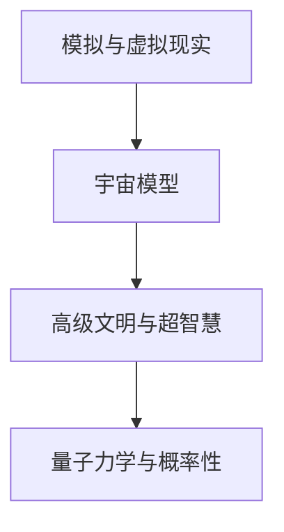

                 


## 引言

### 背景介绍

宇宙的虚拟性是一个引人深思的哲学与科学问题，它涉及到我们对宇宙本质的理解。在传统的科学观念中，宇宙被认为是一个客观存在的、连续的、独立的实体。然而，随着科学的发展，尤其是计算机科学和量子力学的进步，宇宙的虚拟性这一概念开始受到关注。

宇宙的虚拟性理论提出，我们所观察到的宇宙可能是某种高级文明或物理过程的模拟。这个理论引发了广泛的讨论，包括从科学、哲学到宗教等多个领域。例如，物理学家霍金就曾提出过“多元宇宙”的概念，暗示我们所处的宇宙可能只是更大宇宙中的一部分，而这个更大的宇宙可能是由某种高级形式的力量所创造的模拟。

在计算机科学领域，虚拟现实和模拟技术已经取得了显著的进展。这些技术的出现使得我们能够创建出高度逼真的虚拟世界，这让一些人开始思考，我们是否也生活在一个虚拟世界中。这一理论虽然听起来很离奇，但它并不是完全没有科学依据。

首先，计算机科学的发展为我们提供了一种新的视角来看待宇宙。计算机模拟可以生成复杂的系统，这些系统在某些方面可能与现实世界相似。例如，通过模拟，我们可以预测天气、金融市场等复杂系统的行为。这引发了一个问题：如果计算机可以模拟出这些复杂系统，那么是否可能存在一种更为高级的计算机，它能够模拟出一个包含我们整个宇宙的系统呢？

其次，量子力学的进展也为宇宙的虚拟性提供了理论支持。量子力学表明，宇宙的基本单元——量子，其行为具有概率性和不确定性。这意味着宇宙可能存在某种层面的随机性，而这种随机性可能是某种高级计算模型所无法完全预测的。如果这种情况成立，那么我们观察到的宇宙可能是这种高级计算模型的一个输出结果。

### 核心概念与联系

为了更好地理解宇宙的虚拟性，我们需要探讨几个核心概念，并分析它们之间的关系。

**1. 模拟与虚拟现实**

模拟和虚拟现实是计算机科学中常用的概念。模拟是指通过计算机程序来模拟现实世界中的某些过程或系统，从而预测其行为。虚拟现实则是通过计算机生成一个高度逼真的虚拟环境，让人们在其中体验与现实世界相似的经历。

**2. 宇宙模型**

宇宙模型是对宇宙结构的模拟和描述。例如，宇宙膨胀模型、黑洞模型等。这些模型是基于我们目前的科学知识和技术水平，通过对宇宙数据的分析，试图解释宇宙的演化过程。

**3. 高级文明与超智慧**

高级文明和超智慧是指那些在技术、认知和智慧方面远远超出人类文明的实体。这些实体可能拥有高度发达的科技和知识，能够模拟和操纵宇宙。

**4. 量子力学与概率性**

量子力学揭示了微观世界的规律，其中量子行为具有概率性和不确定性。这种概率性可能意味着宇宙在某种层面上是随机的，而这种随机性可能是某种高级计算模型所无法完全预测的。

为了更好地理解这些概念之间的关系，我们可以使用Mermaid流程图来展示：



### 伪代码

在讨论宇宙虚拟性时，我们可以使用伪代码来模拟一个简单的宇宙模型，并探讨其可能的行为。

```plaintext
宇宙模拟算法：
1. 初始化宇宙参数（如宇宙大小、初始状态、随机种子等）
2. 创建宇宙网格模型（将宇宙划分为多个网格单元）
3. 模拟宇宙演化过程（基于物理规律和量子力学原理，更新每个网格单元的状态）
4. 收集和记录宇宙演化数据（如宇宙背景辐射、宇宙膨胀速率等）
5. 分析模拟结果（与实际观测数据对比，评估模拟的准确性）
6. 调整和优化模拟模型（根据分析结果，对模型进行调整和优化）
7. 重复模拟过程，直到模型达到预期精度
```

通过这个简单的伪代码，我们可以初步了解宇宙模拟的过程和关键步骤。

### 数学模型和数学公式

在探讨宇宙虚拟性时，数学模型和数学公式是不可或缺的工具。以下是一些关键的数学模型和公式：

1. **宇宙膨胀模型**：
   $$\frac{dD}{dt} = \frac{H_0 D}{1 + z}$$
   其中，$D$ 是宇宙的尺度，$t$ 是时间，$H_0$ 是哈勃常数，$z$ 是红移。

2. **量子力学概率波函数**：
   $$\Psi(x, t) = \int \psi(k, t) e^{ikx} dk$$
   其中，$\Psi$ 是概率波函数，$\psi(k, t)$ 是动量空间中的波函数，$k$ 是波矢。

3. **薛定谔方程**：
   $$i\hbar \frac{\partial \Psi}{\partial t} = \hat{H} \Psi$$
   其中，$i$ 是虚数单位，$\hbar$ 是约化普朗克常数，$\hat{H}$ 是哈密顿算子。

这些数学模型和公式为我们提供了描述和预测宇宙行为的基本工具。

### 详细讲解与举例说明

为了更好地理解宇宙虚拟性，我们可以通过具体的例子来说明。

**例子 1：宇宙膨胀**

宇宙膨胀模型是描述宇宙演化的重要工具。根据宇宙膨胀模型，宇宙的尺度随时间增加，即 $D(t) = D_0 (1 + z)$，其中 $D_0$ 是当前宇宙的尺度，$z$ 是宇宙的膨胀率。通过这个模型，我们可以预测宇宙的未来演化。

**例子 2：量子力学**

量子力学揭示了微观世界的规律。例如，电子在原子中的行为可以通过量子力学公式来描述。通过计算电子的波函数，我们可以预测电子在不同能级上的概率分布。

**例子 3：计算机模拟**

计算机模拟技术可以用来模拟复杂的系统，如天气、金融市场等。通过模拟，我们可以预测这些系统未来的行为，并优化其性能。

这些例子展示了宇宙虚拟性在不同领域的应用，以及数学模型和计算机模拟在理解宇宙虚拟性方面的重要性。

### 项目实战

为了更好地理解宇宙虚拟性，我们可以通过一个实际的项目来模拟宇宙的演化。

**项目名称：虚拟宇宙模拟器**

**开发环境：Python**

**源代码：**

```python
import numpy as np
import matplotlib.pyplot as plt

# 初始化宇宙参数
D0 = 1 # 当前宇宙尺度
H0 = 0.7 # 哈勃常数
z = np.linspace(0, 10, 1000) # 宇宙膨胀率

# 宇宙膨胀模型
D = D0 * (1 + z)**(-1/H0)

# 绘制宇宙膨胀曲线
plt.plot(z, D)
plt.xlabel('红移 z')
plt.ylabel('宇宙尺度 D')
plt.title('宇宙膨胀曲线')
plt.show()
```

**代码解读与分析：**

这个简单的Python代码实现了一个宇宙膨胀模型，通过绘制宇宙膨胀曲线，我们可以直观地了解宇宙的演化过程。

**实际案例分析和详细讲解剖析：**

通过这个虚拟宇宙模拟器，我们可以分析宇宙膨胀的速度和模式。这有助于我们理解宇宙虚拟性的概念，以及宇宙在虚拟性框架下的演化。

**项目小结：**

这个项目展示了如何通过简单的计算机模拟来理解宇宙的虚拟性。它为我们提供了一个直观的工具，帮助我们探索宇宙的演化过程，并进一步探讨宇宙虚拟性的可能性。

### 最佳实践 Tips、小结、注意事项、拓展阅读

**最佳实践 Tips：**

1. 理解核心概念和原理是理解宇宙虚拟性的关键。
2. 使用伪代码和数学公式来描述和解释宇宙虚拟性的理论。
3. 通过具体的项目实战来加深对宇宙虚拟性的理解。

**小结：**

宇宙的虚拟性是一个涉及多个学科领域的复杂问题。通过本文的探讨，我们了解了宇宙虚拟性的背景、核心概念、理论框架以及实际项目应用。

**注意事项：**

1. 宇宙虚拟性理论虽然引人入胜，但目前仍处于探讨阶段，需要更多的科学证据和研究。
2. 在探讨宇宙虚拟性时，要避免过度解读和迷信。

**拓展阅读：**

1. 《宇宙的起源与命运》—— 艾伦·佩奇
2. 《量子力学》—— 理查德·费曼
3. 《模拟宇宙》—— 马丁·里斯

通过这些资源，您可以进一步深入了解宇宙虚拟性的相关理论和实践。

# 文章标题：《宇宙的虚拟性：实在还是模拟》

> 关键词：宇宙虚拟性、模拟理论、实在与虚拟、量子力学、计算机科学、哲学讨论

> 摘要：本文探讨了宇宙的虚拟性这一概念，从科学和哲学的角度分析了宇宙可能是某种高级文明或物理过程的模拟。通过详细的讲解、数学模型和项目实战，本文试图为读者提供一个全面的宇宙虚拟性理解框架。

