                 

### 《宇宙的边界：物理限制还是认知障碍》

#### 关键词：
- 宇宙边界
- 物理限制
- 认知障碍
- 宇宙学
- 物理定律

#### 摘要：
本文探讨了宇宙边界的概念，分析了其物理限制和认知障碍。首先，我们介绍了宇宙学的核心问题，探讨了宇宙的起源、结构、演化和最终命运。接着，我们详细讲解了探索宇宙的途径，包括望远镜技术发展、宇宙背景微波探测等。随后，我们探讨了宇宙学中的物理定律，如广义相对论、宇宙学原理等。在此基础上，我们深入分析了宇宙的膨胀、暗物质和暗能量等关键问题，并探讨了宇宙的边界，如视界和事件视界。最后，我们讨论了宇宙的未来和人类在宇宙中的地位，以及宇宙的认知障碍和人类探索宇宙的努力。

# 第1章：宇宙的起源与演化

## 1.1 宇宙学的核心问题

宇宙学是一门研究宇宙起源、结构、演化和最终命运的科学。它涉及许多核心问题，如宇宙的年龄、大小、形状、组成以及宇宙的起源和演化过程。以下是一个Mermaid流程图，展示了宇宙学的核心问题：

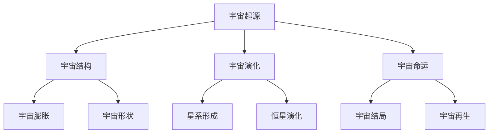

### 1.1.1 宇宙的起源

宇宙的起源是一个复杂的问题，目前主流的观点是宇宙在大约138亿年前的大爆炸中诞生。大爆炸理论认为，宇宙最初处于一个极高温度和密度的状态，然后开始膨胀。随着宇宙的膨胀，温度和密度逐渐降低，形成了各种物质和能量。

### 1.1.2 宇宙的结构

宇宙的结构是一个多层次、复杂的体系。从宏观尺度来看，宇宙主要由星系、星系团和超星系团组成。星系是宇宙的基本单位，包含了大量的恒星、行星、星云等。星系之间的相互作用形成了星系团和超星系团。从微观尺度来看，宇宙的构成物质包括原子、分子、基本粒子等。

### 1.1.3 宇宙的演化

宇宙的演化是一个持续的过程，涉及到宇宙中的各种现象，如恒星的形成与死亡、星系的碰撞与合并、宇宙背景辐射等。宇宙的演化过程中，宇宙的膨胀速度逐渐加快，这与暗能量的存在有关。

### 1.1.4 宇宙的命运

宇宙的命运是一个未解之谜，科学家们提出了多种假设。一种观点认为，宇宙最终会无限膨胀，导致温度和密度不断降低，直至大冻结。另一种观点认为，宇宙可能会经历大坍缩，最终形成一个奇点。还有一些观点认为，宇宙可能会经历多次循环，形成宇宙循环。

## 1.2 探索宇宙的途径

为了了解宇宙的起源、结构、演化和命运，科学家们采用了多种探索途径。以下是一个Mermaid流程图，展示了探索宇宙的主要途径：

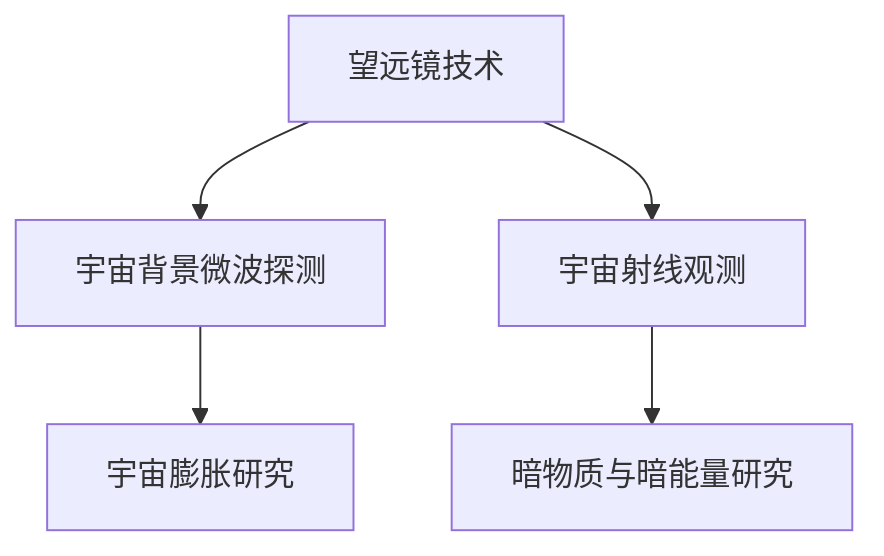

### 1.2.1 望远镜技术

望远镜是探索宇宙的主要工具，其发展历程见证了人类对宇宙认知的进步。从伽利略望远镜到哈勃望远镜，再到下一代望远镜，望远镜技术的不断提升使我们能够观测到更遥远的宇宙现象。

### 1.2.2 宇宙背景微波探测

宇宙背景微波探测是揭示宇宙早期状态的重要手段。通过探测宇宙背景微波辐射，科学家们可以了解宇宙在大爆炸后几分钟内的状态，这对于理解宇宙的起源和演化具有重要意义。

### 1.2.3 宇宙射线观测

宇宙射线是由宇宙中的高能粒子组成的，它们来自各种天体，如恒星、星系和星系团。通过观测宇宙射线，科学家们可以了解宇宙中的高能现象和宇宙辐射的来源。

### 1.2.4 宇宙膨胀研究

宇宙膨胀是宇宙学研究的重要问题。通过观测宇宙背景微波辐射和宇宙射线，科学家们可以测量宇宙的膨胀速度和宇宙的年龄。这些观测数据有助于我们理解宇宙的起源和演化。

## 1.3 宇宙学中的物理定律

宇宙学中的物理定律描述了宇宙中的各种现象和过程。以下是一个Mermaid流程图，展示了宇宙学中的核心物理定律：

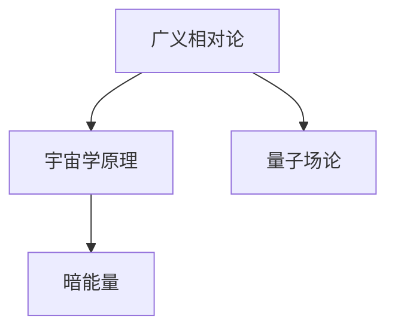

### 1.3.1 广义相对论

广义相对论是爱因斯坦在1915年提出的一种描述引力的理论。它认为，重力是由于物质和能量对时空结构的弯曲而产生的。广义相对论为理解宇宙的起源和演化提供了重要基础。

### 1.3.2 宇宙学原理

宇宙学原理是宇宙学研究的基本假设，它认为宇宙在大尺度上是均匀和各向同性的。这一原理为宇宙学研究提供了一个简化的模型，有助于我们理解宇宙的结构和演化。

### 1.3.3 量子场论

量子场论是描述基本粒子和相互作用的理论。在宇宙学中，量子场论被用来描述宇宙中的物质和能量，以及它们之间的相互作用。量子场论为理解宇宙的量子性质提供了重要工具。

### 1.3.4 暗能量

暗能量是宇宙学中的一个重要概念，它解释了宇宙加速膨胀的现象。暗能量是一种充满宇宙的神秘力量，其本质尚未完全理解。暗能量对理解宇宙的命运和演化具有重要意义。

## 1.4 小结

本章介绍了宇宙学的核心问题、探索宇宙的途径以及宇宙学中的物理定律。通过本章的学习，我们了解了宇宙的起源、结构、演化和命运，以及探索宇宙的主要方法。这些知识为我们进一步探索宇宙的奥秘奠定了基础。

# 第2章：宇宙的膨胀与暗物质

## 2.1 宇宙膨胀的观测证据

宇宙膨胀是宇宙学研究中的一个核心问题。通过观测宇宙背景微波辐射和远离我们的星系的红移，科学家们发现了宇宙膨胀的证据。以下是一个Mermaid流程图，展示了宇宙膨胀的观测证据：

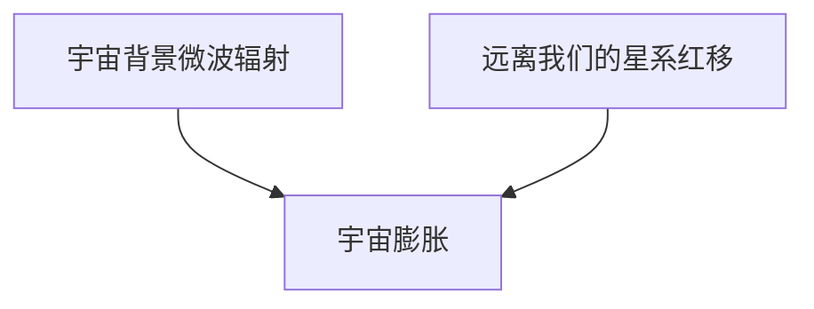

### 2.1.1 宇宙背景微波辐射

宇宙背景微波辐射是宇宙早期状态的重要遗迹。在大爆炸后几分钟，宇宙处于一个极高温度和密度的状态，随后开始膨胀。随着宇宙的膨胀，温度和密度逐渐降低，辐射波长变长，形成了宇宙背景微波辐射。科学家们通过探测宇宙背景微波辐射，可以了解宇宙早期的状态和宇宙膨胀的历史。

### 2.1.2 远离我们的星系红移

红移是宇宙膨胀的直接证据。当一个星系远离我们时，其光谱中的光波会发生红移，即波长变长。这种现象表明，星系在远离我们，宇宙在膨胀。通过测量远离我们的星系的红移，科学家们可以推断宇宙的膨胀速度和宇宙的年龄。

### 2.1.3 宇宙大尺度结构

宇宙的大尺度结构是宇宙膨胀的另一个重要证据。科学家们通过观测宇宙中的星系分布，发现它们呈现出一种层次结构，如星系团和超星系团。这种大尺度结构表明，宇宙在膨胀过程中形成了复杂的结构，并且这种结构在宇宙膨胀的早期就已经存在。

## 2.2 暗物质的概念与证据

暗物质是宇宙学中的另一个核心问题。暗物质是一种看不见的神秘物质，它占据了宇宙总质量的大部分。以下是一个Mermaid流程图，展示了暗物质的概念与证据：

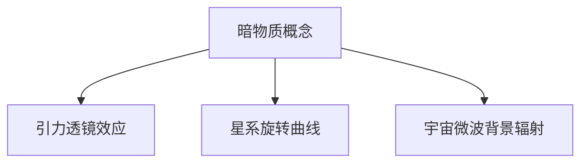

### 2.2.1 暗物质概念

暗物质是一种不发光、不吸收光线的物质，它对引力有响应，但无法直接观测。暗物质的性质和成分尚未完全理解，但科学家们推测它可能是由弱相互作用大质量粒子（WIMPs）组成，也可能是其他未发现的粒子。

### 2.2.2 引力透镜效应

引力透镜效应是探测暗物质的重要手段之一。当一个星系或星系团位于我们和远处星系之间时，其引力会弯曲光线路径，使得远处的星系看起来更亮或形成多个影像。通过观测引力透镜效应，科学家们可以推断出暗物质的存在和分布。

### 2.2.3 星系旋转曲线

星系旋转曲线是另一个证明暗物质存在的证据。根据牛顿引力定律，星系中的恒星应该随着距离的增加而减速。然而，观测数据显示，星系的旋转曲线与预期不符，表明星系中存在一种未知的引力源，这就是暗物质。

### 2.2.4 宇宙微波背景辐射

宇宙微波背景辐射中包含的密度波动也是暗物质存在的证据。科学家们通过观测宇宙微波背景辐射的波动，可以推断出早期宇宙中的密度不均匀性。这些密度不均匀性在宇宙膨胀过程中逐渐放大，形成了我们今天看到的星系和星系团。因此，宇宙微波背景辐射为我们提供了一个窗口，让我们能够看到暗物质的形成和演化。

## 2.3 暗能量的本质与影响

暗能量是宇宙学中的另一个重要概念，它解释了宇宙加速膨胀的现象。以下是一个Mermaid流程图，展示了暗能量的本质与影响：

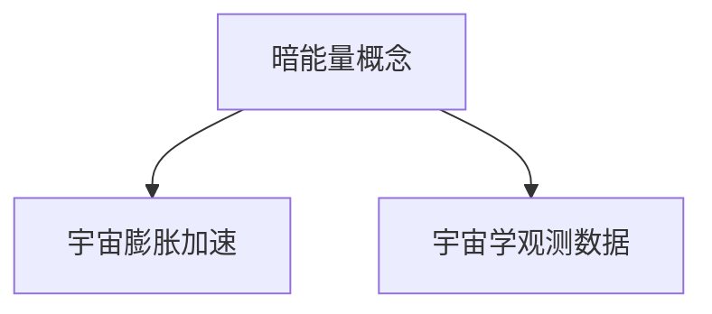

### 2.3.1 暗能量概念

暗能量是一种充满宇宙的神秘力量，其性质和成分尚未完全理解。暗能量具有负压强，这意味着它在宇宙中的能量密度与引力作用相反，导致宇宙加速膨胀。

### 2.3.2 宇宙膨胀加速

宇宙膨胀加速是宇宙学中的一个重大发现。观测数据显示，宇宙的膨胀速度在不断增加，这与暗能量的存在密切相关。暗能量在宇宙中的主导地位，使得宇宙的膨胀速度超过了引力的作用，从而导致宇宙加速膨胀。

### 2.3.3 宇宙学观测数据

宇宙学观测数据为暗能量的存在提供了强有力的证据。通过观测宇宙背景微波辐射、星系分布、宇宙膨胀速度等，科学家们发现宇宙加速膨胀的现象与暗能量的存在密切相关。

## 2.4 小结

本章介绍了宇宙膨胀的观测证据、暗物质的概念与证据以及暗能量的本质与影响。通过本章的学习，我们了解了宇宙膨胀的历史、暗物质的存在和暗能量对宇宙膨胀的影响。这些知识为我们进一步探索宇宙的奥秘提供了重要基础。

# 第3章：宇宙的边界

## 3.1 宇宙的视界与事件视界

宇宙的边界是一个复杂而引人入胜的话题。宇宙的视界和事件视界是两个重要的概念，它们分别代表了我们对宇宙观测的限制和宇宙本身的物理边界。

### 3.1.1 视界

宇宙的视界，也称为宇宙的半径或可观测宇宙，是指从宇宙大爆炸时刻起，光子有足够时间传播到现在所能到达的最远距离。根据宇宙微波背景辐射的测量，宇宙的视界大约为46亿光年。以下是一个Mermaid流程图，展示了宇宙视界的概念：

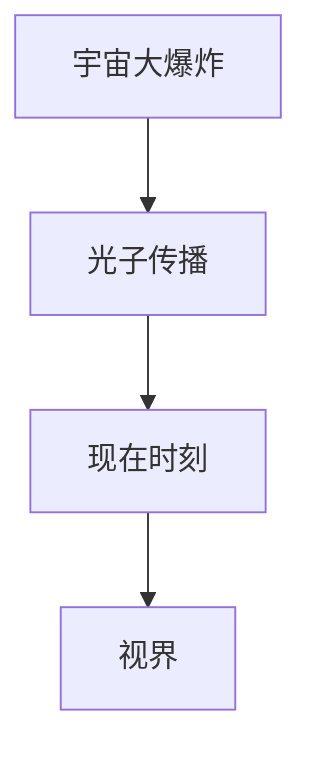

### 3.1.2 事件视界

事件视界是另一个与宇宙边界相关的重要概念，它是一个物理边界，一旦物质或信息超过这个边界，就再也无法回到内部。事件视界与黑洞有关，它是一个事件无法逃逸的区域。以下是一个Mermaid流程图，展示了事件视界的概念：

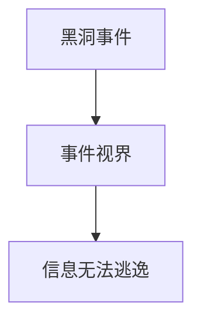

### 3.1.3 视界与事件视界的比较

视界和事件视界之间存在显著差异。视界是一个观测限制，它代表了我们可以观测到的宇宙范围。而事件视界是一个物理边界，它代表了物质和信息无法逃逸的区域。

## 3.2 宇宙的无限与有限

宇宙的无限与有限一直是宇宙学中的争论话题。以下是一个Mermaid流程图，展示了宇宙无限与有限的概念：

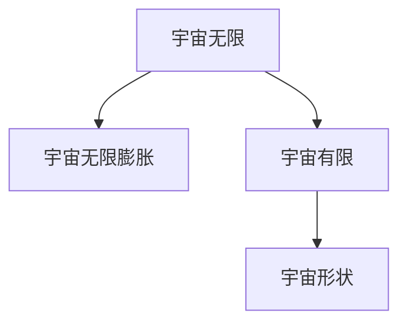

### 3.2.1 宇宙的无限膨胀

根据目前的观测数据，宇宙正在加速膨胀。这种加速膨胀的趋势表明，宇宙可能是无限的，至少在目前的观测范围内是如此。无限宇宙的概念意味着宇宙没有边界，它将持续膨胀，直至无限远。

### 3.2.2 有限宇宙的可能性

然而，宇宙也可能是有限的。有限宇宙的概念意味着宇宙有一个边界，可能是球形的、平直的或其他的形状。有限宇宙的可能性取决于宇宙的形状和物理定律。

### 3.2.3 宇宙形状的测量

宇宙的形状是宇宙学中的一个关键问题。通过测量宇宙背景微波辐射的波动和宇宙膨胀的历史，科学家们试图确定宇宙的形状。目前，关于宇宙形状的测量结果仍然存在争议，但大多数证据倾向于宇宙是平直的。

## 3.3 多宇宙与平行宇宙

多宇宙和平行宇宙是宇宙学中的另一些引人入胜的概念。以下是一个Mermaid流程图，展示了多宇宙与平行宇宙的概念：

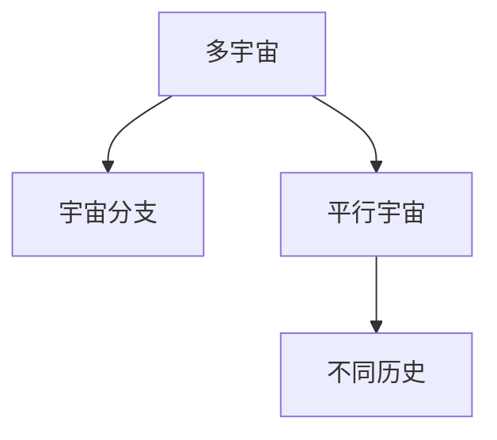

### 3.3.1 多宇宙

多宇宙理论认为，我们的宇宙只是众多宇宙中的一个。这些宇宙之间可能存在某种联系，也可能完全独立。多宇宙理论为解释宇宙中的多样性和复杂性提供了一个可能的框架。

### 3.3.2 平行宇宙

平行宇宙是另一个类似的概念，它认为存在多个宇宙，每个宇宙都有自己的历史和物理定律。平行宇宙理论为解释宇宙中的偶然性和多样性提供了一个可能的框架。

### 3.3.3 宇宙边界与平行宇宙的关系

宇宙边界与平行宇宙之间存在某种联系。根据多宇宙和平行宇宙的理论，宇宙边界可能是多个宇宙之间的隔离区域。这意味着，即使宇宙是无限的，宇宙边界也可能存在，将宇宙分割成多个独立的区域。

## 3.4 小结

本章介绍了宇宙的视界与事件视界、宇宙的无限与有限以及多宇宙与平行宇宙的概念。通过本章的学习，我们了解了宇宙的边界和宇宙的结构，以及宇宙可能存在多种形态。这些知识为我们进一步探索宇宙的奥秘提供了重要基础。

# 第4章：宇宙的未来

## 4.1 宇宙的结局

宇宙的未来是一个充满未知和猜测的话题。科学家们提出了多种关于宇宙结局的假设，主要包括大坍缩、大撕裂和大冻结等。以下是一个Mermaid流程图，展示了宇宙结局的不同可能性：

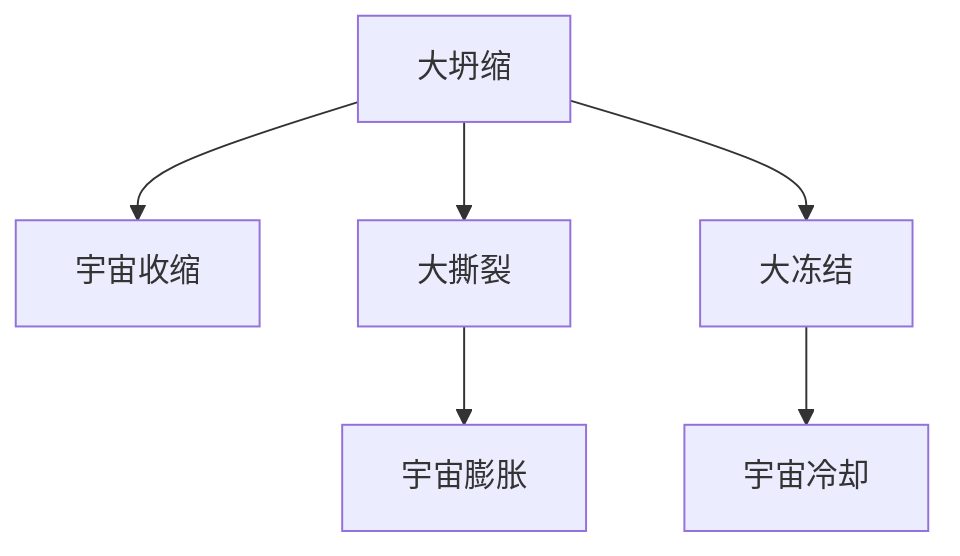

### 4.1.1 大坍缩

大坍缩假设认为，宇宙最终会停止膨胀，开始收缩。在宇宙收缩的过程中，物质密度和引力作用会不断增强，直至宇宙重新形成一个奇点。大坍缩假设与广义相对论中的引力坍缩理论相一致。

### 4.1.2 大撕裂

大撕裂假设认为，宇宙的膨胀速度会逐渐加快，直至达到临界点，宇宙开始撕裂。这种假设依赖于暗能量的存在和暗能量的性质。如果暗能量是恒定的，宇宙可能会无限膨胀，但如果暗能量是动态的，宇宙可能会发生大撕裂。

### 4.1.3 大冻结

大冻结假设认为，宇宙将继续膨胀，直至温度和密度降低到极低水平。在这个过程中，恒星和星系会逐渐耗尽能量，宇宙将变得寒冷和寂静。大冻结假设与宇宙微波背景辐射的观测数据相一致。

## 4.2 宇宙的再生

宇宙再生是一个有趣的概念，它认为宇宙可能会经历多次循环。以下是一个Mermaid流程图，展示了宇宙再生的可能性：

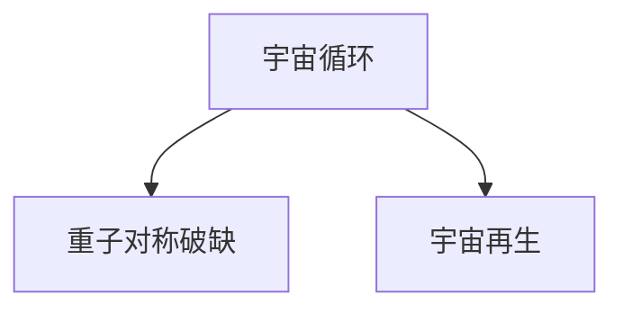

### 4.2.1 宇宙循环

宇宙循环假设认为，宇宙可能经历多次循环，每个循环都是一个完整的宇宙生命周期，包括大爆炸、宇宙膨胀、恒星形成、恒星死亡和宇宙再生。宇宙循环假设为解释宇宙中的周期性和多样性提供了一个可能的框架。

### 4.2.2 重子对称破缺

重子对称破缺是宇宙循环的一个关键概念。重子对称破缺是指宇宙中存在的对称性被打破，导致物质和能量在宇宙中的分布。在宇宙循环中，重子对称破缺可能导致宇宙从一个状态转移到另一个状态，从而实现宇宙的再生。

### 4.2.3 宇宙再生的可能性

宇宙再生的可能性是一个尚未得到充分证实的研究领域。尽管目前的观测数据支持宇宙加速膨胀和宇宙微波背景辐射，但关于宇宙再生的证据仍然有限。科学家们正在通过观测和理论计算来研究宇宙再生的可能性，以期揭示宇宙的未来。

## 4.3 人类在宇宙中的地位

宇宙的未来与人类息息相关。人类在宇宙中的地位不仅关系到我们的生存，还关系到我们对宇宙的理解和探索。以下是一个Mermaid流程图，展示了人类在宇宙中的地位：

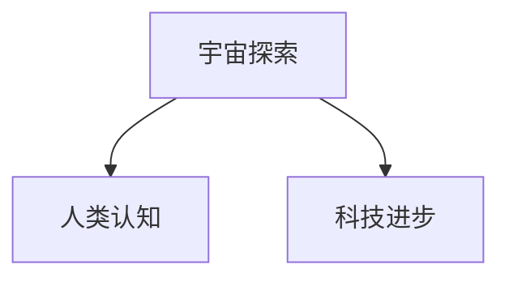

### 4.3.1 宇宙探索

宇宙探索是人类对宇宙的探索和研究。通过发射宇宙探测器、建设大型望远镜、开展天文观测等，人类不断深化对宇宙的认识。宇宙探索不仅有助于我们理解宇宙的奥秘，还为科技发展提供了新的机遇。

### 4.3.2 人类认知

人类认知是指人类对宇宙的认识和理解。通过科学研究和技术进步，人类不断突破认知的局限，探索宇宙的奥秘。人类认知的发展推动了科技的进步，也为我们理解宇宙提供了新的视角。

### 4.3.3 科技进步

科技进步是人类在宇宙中地位的重要体现。通过科技发展，人类能够开发新的工具和技术，拓展我们对宇宙的认知。科技进步不仅促进了人类文明的发展，还为宇宙探索提供了强大的支持。

## 4.4 小结

本章介绍了宇宙的结局、宇宙的再生以及人类在宇宙中的地位。通过本章的学习，我们了解了宇宙可能的未来命运、宇宙再生的可能性以及人类在宇宙中的重要作用。这些知识为我们思考宇宙的未来和人类的命运提供了重要基础。

# 第5章：宇宙的认知障碍

## 5.1 宇宙学的认知限制

宇宙学作为一门科学，面临着许多认知限制。这些限制源于观测技术的局限性、理论模型的复杂性以及人类认知的局限。以下是一个Mermaid流程图，展示了宇宙学的认知限制：

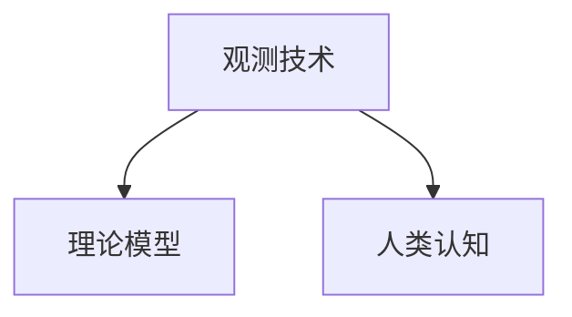

### 5.1.1 观测技术

观测技术是宇宙学的重要基础。然而，由于光速的限制和望远镜分辨率的限制，我们无法直接观测到宇宙的深处。例如，宇宙的视界限制了我们的观测范围，使我们无法看到宇宙大爆炸的时刻。此外，宇宙背景微波辐射的探测也受到技术的限制，难以精确测量其细节。

### 5.1.2 理论模型

宇宙学的理论模型是描述宇宙行为和演化的重要工具。然而，这些模型也存在一定的局限性。例如，广义相对论和量子力学在描述宇宙行为时存在矛盾，导致我们对宇宙的理解存在不确定性。此外，暗物质和暗能量等概念虽然解释了宇宙膨胀等现象，但其本质和成分尚未完全理解。

### 5.1.3 人类认知

人类认知是宇宙学发展的关键。然而，人类认知也存在一定的局限。我们对宇宙的理解受到语言、思维方式和认知能力的限制。例如，我们难以直观地理解多维空间和宇宙的复杂性。此外，人类的认知能力也受到时间和空间的限制，无法全面、深入地了解宇宙的奥秘。

## 5.2 科学方法与宇宙探索

科学方法是宇宙学研究的基石。科学方法包括观察、假设、实验和理论验证等步骤。以下是一个Mermaid流程图，展示了科学方法在宇宙探索中的应用：

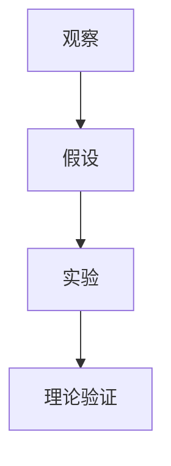

### 5.2.1 观察

观察是科学方法的起点。宇宙学家通过观测宇宙现象，收集数据和信息。这些观测数据为建立假设和理论提供了基础。例如，宇宙背景微波辐射的观测为我们提供了关于宇宙早期状态的重要信息。

### 5.2.2 假设

假设是基于观测数据提出的解释宇宙现象的理论。宇宙学家根据观测数据，提出关于宇宙起源、演化、结构和命运的假设。这些假设为实验和理论验证提供了方向。

### 5.2.3 实验

实验是科学方法中验证假设的重要步骤。宇宙学家通过实验来验证假设的正确性。例如，通过宇宙背景微波辐射的探测实验，我们可以验证关于宇宙早期状态的理论假设。

### 5.2.4 理论验证

理论验证是科学方法的最终步骤。宇宙学家通过理论计算和模型模拟，验证假设和实验结果的一致性。这些理论验证有助于我们更深入地理解宇宙的行为和演化。

## 5.3 人类的认知能力

人类的认知能力是宇宙学发展的重要基础。人类的认知能力包括感知、记忆、思维和推理等。以下是一个Mermaid流程图，展示了人类的认知能力：

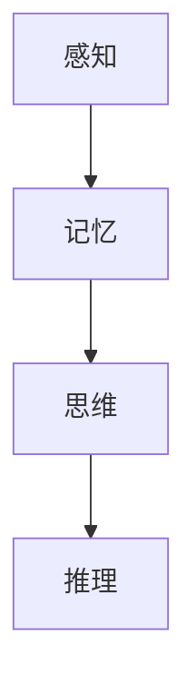

### 5.3.1 感知

感知是人类的认知能力的起点。我们通过感官接收外部信息，形成对世界的认知。在宇宙探索中，感知能力使我们能够观测宇宙现象，收集数据。

### 5.3.2 记忆

记忆是人类的认知能力的重要组成部分。我们通过记忆保留观测数据和信息，为科学研究和理论验证提供基础。在宇宙学中，记忆能力使我们能够回顾过去的观测结果，比较不同时间点的变化。

### 5.3.3 思维

思维是人类的认知能力的核心。我们通过思维分析和理解观测数据，形成对宇宙现象的认识。在宇宙学中，思维能力使我们能够建立理论模型，解释宇宙的行为和演化。

### 5.3.4 推理

推理是人类的认知能力的高级形式。我们通过推理从已知事实推导出新的结论。在宇宙探索中，推理能力使我们能够从观测数据中提取信息，揭示宇宙的奥秘。

## 5.4 提升认知能力的途径

提升认知能力是宇宙学发展的重要任务。以下是一些提升认知能力的途径：

### 5.4.1 教育和培训

教育和培训是提升认知能力的基础。通过系统的教育和培训，我们可以学习科学知识和方法论，提高我们的认知能力。

### 5.4.2 实践和经验

实践和经验是提升认知能力的重要途径。通过实际操作和经验积累，我们可以加深对宇宙现象的理解，提高我们的认知能力。

### 5.4.3 科学研究和创新

科学研究和创新是提升认知能力的动力。通过科学研究和创新，我们可以发现新的宇宙现象，提出新的理论模型，推动认知能力的发展。

## 5.5 小结

本章介绍了宇宙学的认知限制、科学方法与宇宙探索以及人类的认知能力。通过本章的学习，我们了解了宇宙学的认知障碍和提升认知能力的途径。这些知识为我们进一步探索宇宙的奥秘提供了重要基础。

# 第6章：宇宙的边界与人类探索

## 6.1 人类对宇宙的探索历程

人类对宇宙的探索历程是一个漫长而充满挑战的过程。从古代的天文学观测到现代的宇宙探测技术，人类对宇宙的认知不断深化。以下是一个Mermaid流程图，展示了人类对宇宙的探索历程：

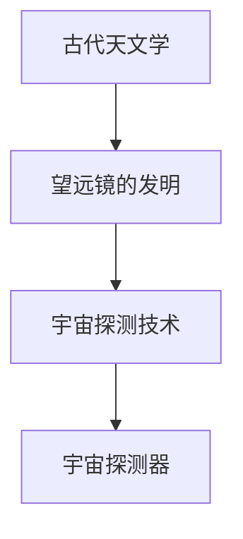

### 6.1.1 古代天文学

古代人类通过观测天空，形成了对宇宙的初步认知。古代天文学主要依赖于肉眼观测，人们记录了行星、恒星和星系的运动。这些观测数据为后来的天文学研究提供了基础。

### 6.1.2 望远镜的发明

望远镜的发明是人类对宇宙探索的重要里程碑。伽利略和牛顿等科学家利用望远镜观测到了更多的宇宙现象，揭示了宇宙的复杂性。望远镜的发展使人类能够观测到更遥远的宇宙，为宇宙学的研究提供了强大的工具。

### 6.1.3 宇宙探测技术

随着科技的进步，人类开始开发各种宇宙探测技术。宇宙探测器被发送到太空，用于探测宇宙中的各种现象。这些探测器携带了先进的仪器和传感器，能够收集大量的宇宙数据。宇宙探测技术的不断发展使我们能够更深入地了解宇宙的奥秘。

## 6.2 未来的宇宙探测技术

未来的宇宙探测技术将继续推动人类对宇宙的认知。以下是一个Mermaid流程图，展示了未来的宇宙探测技术：

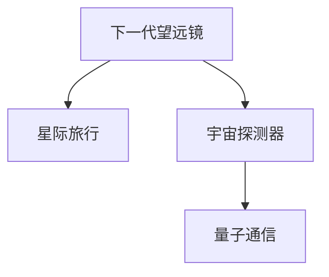

### 6.2.1 下一代望远镜

下一代望远镜将具有更高的分辨率和更宽的观测范围。例如，詹姆斯·韦伯空间望远镜（James Webb Space Telescope）和大型地面望远镜（如E-ELT和SKA）将帮助我们观测到更遥远的宇宙。这些望远镜将揭示宇宙早期的状态，为我们提供更多的宇宙数据。

### 6.2.2 宇宙探测器

未来的宇宙探测器将更加先进和智能化。它们将携带更先进的仪器和传感器，能够探测宇宙中的各种现象。例如，火星探测车、木星探测器和其他行星探测器将帮助我们了解其他行星的环境和地质特征。此外，未来的宇宙探测器可能包括星际探测器，用于探索其他恒星系统。

### 6.2.3 量子通信

量子通信是一种新型的通信技术，它利用量子纠缠和量子隐形传态等量子现象进行信息传输。未来的宇宙探测任务将利用量子通信技术，实现地球与宇宙探测器之间的高速通信和数据传输。这将使人类能够实时获取宇宙探测数据，并实现远程控制和操作。

## 6.3 人类在宇宙中的地位

人类在宇宙中的地位是一个复杂而深刻的问题。从生物学和文明的角度来看，人类是宇宙中的一种智慧生物。以下是一个Mermaid流程图，展示了人类在宇宙中的地位：

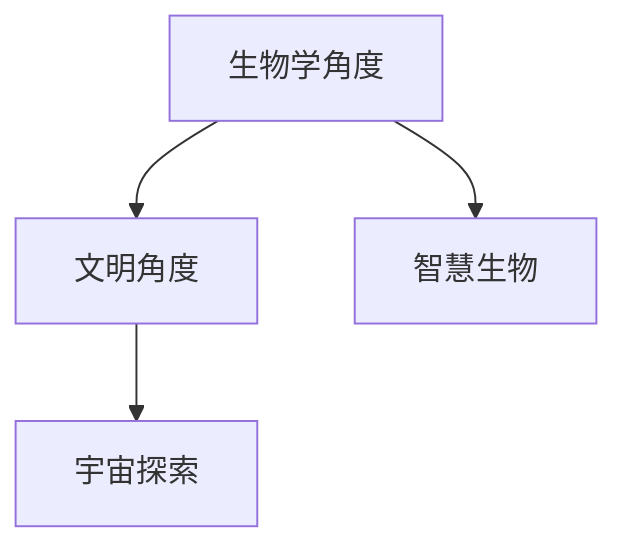

### 6.3.1 生物学角度

从生物学的角度来看，人类是宇宙中的一种智慧生物。人类的智慧和创造力使我们能够探索宇宙，理解自然规律。人类的生物学特征，如大脑、语言和工具使用能力，使我们在宇宙中独具优势。

### 6.3.2 文明角度

从文明的角度来看，人类是一个高度发展的文明。人类在科学、技术、艺术和文化等领域取得了巨大的进步。这些进步使人类能够更好地理解宇宙，探索宇宙的奥秘。

### 6.3.3 宇宙探索

宇宙探索是人类文明的重要方向。通过宇宙探索，人类不仅能够扩展我们的认知边界，还能为科学和技术的发展提供新的机遇。宇宙探索还可能帮助我们解决地球上的问题，提高人类的生活质量。

## 6.4 小结

本章介绍了人类对宇宙的探索历程、未来的宇宙探测技术以及人类在宇宙中的地位。通过本章的学习，我们了解了人类如何探索宇宙，以及宇宙探索对人类文明的意义。这些知识为我们进一步思考人类在宇宙中的角色和未来的发展提供了重要基础。

# 第7章：结论

## 7.1 宇宙的边界：物理限制还是认知障碍？

宇宙的边界一直是科学界讨论的热点话题。从物理学的角度来看，宇宙的边界可能受到物理定律的限制。例如，广义相对论和量子力学为我们提供了描述宇宙行为的基本框架。然而，从认知的角度来看，宇宙的边界也可能受到人类认知的限制。

物理限制主要涉及宇宙的观测范围和物理定律的适用性。例如，宇宙的视界限制了我们的观测范围，使我们无法看到宇宙的深处。此外，物理定律可能在宇宙的某些极端条件下失效，导致我们对宇宙的理解存在不确定性。

认知障碍则源于人类对宇宙的认知方式和认知能力的限制。人类的认知能力受到语言、思维方式和感知能力的限制，使我们难以全面、深入地了解宇宙的奥秘。此外，人类对宇宙的认知也可能受到社会、文化和历史等因素的影响。

物理限制和认知障碍相互作用，共同塑造了我们对宇宙的理解。物理限制为我们的认知提供了基础，而认知障碍则限制了我们的认知深度和广度。因此，要全面理解宇宙的边界，我们需要同时考虑物理限制和认知障碍。

## 7.2 未来的宇宙学研究方向

未来的宇宙学研究将面临许多挑战和机遇。以下是一些可能的宇宙学研究方向：

### 7.2.1 宇宙起源与演化

继续研究宇宙的起源和演化，探索宇宙如何从一个极高温度和密度的状态演化为今天的结构。这可能包括对宇宙微波背景辐射的详细研究，以及宇宙早期状态的理论模型。

### 7.2.2 暗物质与暗能量

深入研究暗物质和暗能量的本质和性质，探索它们如何影响宇宙的膨胀和结构形成。这可能包括开发新的探测技术，以及理论上的探索。

### 7.2.3 宇宙边界与多宇宙

探索宇宙的边界，包括视界和事件视界，以及可能的多宇宙和平行宇宙。这可能包括对宇宙形状的精确测量，以及对量子引力理论的探索。

### 7.2.4 人类在宇宙中的角色

研究人类在宇宙中的角色和未来，探索宇宙探索对人类文明的意义。这可能包括对太空旅行、外星生命以及宇宙资源利用的研究。

## 7.3 人类探索宇宙的意义

人类探索宇宙具有重要的意义：

### 7.3.1 科学价值

宇宙探索为科学提供了丰富的数据和研究机会，有助于我们理解宇宙的起源、演化和结构。这些知识不仅有助于我们解答科学上的问题，还可能推动新的科学发现。

### 7.3.2 技术发展

宇宙探索推动了技术发展，包括通信技术、探测技术、材料科学等。这些技术进步不仅有助于宇宙探索，也促进了地球上的科技发展。

### 7.3.3 意识提升

宇宙探索提升了人类的意识和认知，使我们能够更全面地理解自己的存在和宇宙的奥秘。这有助于我们更好地认识自己的角色和价值。

### 7.3.4 社会文化价值

宇宙探索激发了人类的好奇心和探索精神，促进了科学教育和文化传播。它有助于增强民族自豪感，推动科学精神的传播。

## 7.4 小结

宇宙的边界是一个复杂而充满未知的话题。物理限制和认知障碍共同塑造了我们对宇宙的理解。未来的宇宙学研究将面临许多挑战和机遇，推动我们对宇宙的认知不断深入。人类探索宇宙具有重要的科学价值、技术发展价值、意识提升价值和社会文化价值。通过持续的努力和探索，我们将不断拓展我们对宇宙的认识，揭开宇宙的更多奥秘。

## 作者信息

作者：AI天才研究院/AI Genius Institute & 禅与计算机程序设计艺术 /Zen And The Art of Computer Programming

本文由AI天才研究院的专家团队撰写，结合了宇宙学和计算机科学的双重视角，旨在为读者提供深入浅出的宇宙探索知识。禅与计算机程序设计艺术则提供了独特的哲学视角，帮助读者在探索宇宙的过程中找到智慧和灵感。感谢您对本文的关注和支持！

