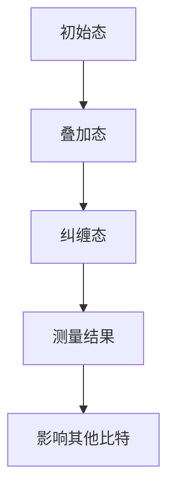

                 

### 文章标题

《宇宙的量子纠缠网络：超越时空的联系》

> 关键词：量子纠缠，量子网络，宇宙，时空，量子通信，量子计算，量子引力

> 摘要：本文深入探讨了量子纠缠网络的概念、原理及其在宇宙中的作用。通过介绍量子纠缠的基础知识，我们揭示了量子纠缠网络如何超越时空限制，实现宇宙中信息的高效传递和计算。本文旨在为读者提供一个全面而详细的量子纠缠网络技术解析，展示其在现代科技和宇宙学研究中的重要地位。

### 引言

量子纠缠是一种奇异的量子力学现象，最早由爱因斯坦、波多尔斯基和罗森（EPR paradox）提出，并被视为“鬼魅似的远距离作用”。然而，随着量子信息科学的发展，量子纠缠的重要性逐渐显现。量子纠缠网络，作为量子信息科学的核心技术之一，将量子纠缠应用于通信、计算和加密等领域，展现出巨大的潜力。

宇宙的量子纠缠网络，是指通过量子纠缠技术，构建起连接宇宙中各个粒子的网络。这种网络不仅能够实现超越时空的信息传递，还可能揭示宇宙的本质规律。本文将围绕量子纠缠网络展开讨论，从基础概念到实际应用，逐步揭示这一技术的奇妙世界。

首先，我们将介绍量子纠缠的基础知识，包括量子力学的基本概念和量子纠缠的定义。接着，我们将深入探讨量子纠缠网络的基本结构和工作原理。在此基础上，本文将分析量子纠缠网络在量子通信和量子计算中的应用，揭示其在信息传递和计算速度上的优势。最后，我们将探讨量子纠缠与宇宙学的关系，探索量子纠缠网络在宇宙学研究中的潜在应用。

通过本文的探讨，读者将全面了解量子纠缠网络的基本原理、应用前景和未来发展方向，进一步认识其在现代科技和宇宙学研究中的重要地位。

### 量子纠缠基础

要理解量子纠缠网络，我们首先需要了解量子力学的基本概念，特别是量子态的叠加、测量以及量子纠缠原理。

#### 量子态的叠加

在经典物理学中，物体的状态是确定的，如一个粒子处于某个具体的速度或位置。然而，在量子力学中，粒子的状态是概率性的，可以用波函数来描述。量子态的叠加原理指出，一个量子系统可以同时处于多个状态的叠加。例如，一个电子的自旋状态可以同时是“向上”和“向下”的叠加态。这一现象可以用薛定谔方程来描述，波函数的平方表示粒子在不同状态下出现的概率。

#### 量子态的测量

当对量子系统进行测量时，量子态会发生坍缩，从叠加态变为某个具体的单一状态。测量结果具有随机性，但整体上符合波函数描述的概率分布。这一过程违背了经典物理学的决定论，使得量子力学在解释微观现象时具有独特的优势。

#### 量子纠缠原理

量子纠缠是量子力学中更为奇特的现象。当两个或多个粒子发生纠缠时，它们的量子态将不可分割地相互关联，即使它们相隔很远。这种关联表现为一个粒子的测量结果可以即时影响另一个粒子的状态，无论两者之间的距离有多远。这种现象违背了经典物理学的局域实在论，被认为是量子信息科学的核心。

为了更直观地理解量子纠缠，我们可以通过一个经典例子——贝尔实验（Bell Test）来说明。在贝尔实验中，通过测量两个纠缠粒子的某种物理量（如自旋），可以发现它们的测量结果具有超定的相关性。即使两个粒子相隔很远，它们的测量结果也呈现出强相关性，这一现象无法用经典物理学的理论来解释。

#### 量子态的叠加与纠缠

量子态的叠加和纠缠是量子力学中两个重要的概念，它们共同揭示了量子世界的奇异性质。量子态的叠加使得一个量子系统可以同时处于多个状态，而量子纠缠则使得这些状态之间产生不可分割的关联。

为了更好地理解这两个概念之间的关系，我们可以使用一个简化的 Mermaid 流程图来描述。假设我们有两个量子比特（qubit），它们可以分别处于“0”和“1”的状态，以及叠加态 $|0\rangle + |1\rangle$。当这两个量子比特发生纠缠时，它们的叠加态将变成一个整体的纠缠态 $|\psi\rangle = \frac{1}{\sqrt{2}}(|00\rangle + |11\rangle)$。在这个纠缠态中，任意一个量子比特的测量结果将立即影响到另一个量子比特的状态，即使它们相隔很远。



通过这个 Mermaid 流程图，我们可以直观地看到量子态的叠加和纠缠之间的关系。量子态的叠加使得系统可以处于多个状态，而量子纠缠则将这些状态紧密地联系在一起，形成一个统一的整体。

#### 量子纠缠的数学描述

为了更深入地理解量子纠缠，我们可以使用数学语言来描述量子态的叠加和纠缠。在量子力学中，一个量子态可以用波函数或态矢量来表示。对于一个两量子比特的系统，其状态可以表示为：

$$
|\psi\rangle = a|00\rangle + b|01\rangle + c|10\rangle + d|11\rangle
$$

其中，$a, b, c, d$ 是复数系数，满足 $|a|^2 + |b|^2 + |c|^2 + |d|^2 = 1$。当系统处于叠加态时，各个量子比特的状态是独立的，但它们之间通过纠缠实现了整体性。

当两个量子比特发生纠缠时，它们的状态将变成一个整体的纠缠态。例如，一个常见的纠缠态是贝尔态（Bell State），表示为：

$$
|\psi\rangle = \frac{1}{\sqrt{2}}(|00\rangle + |11\rangle)
$$

在这个纠缠态中，无论一个量子比特处于“0”状态还是“1”状态，另一个量子比特的状态都会立即改变，表现出量子纠缠的特性。

#### 量子态的叠加与纠缠：伪代码

为了更直观地展示量子态的叠加与纠缠，我们可以使用伪代码来描述这个过程。以下是一个简单的伪代码示例：

```python
# 初始化两个量子比特
qubit1 = QuantumRegister(1)
qubit2 = QuantumRegister(1)

# 将量子比特初始化为叠加态
circuit.h(qubit1)
circuit.cnot(qubit1, qubit2)

# 测量量子比特
result = circuit.measure(qubit1, qubit2)

# 输出测量结果
print("测量结果：", result)
```

在这个伪代码中，我们首先初始化两个量子比特，然后通过 Hadamard 门（H门）将第一个量子比特初始化为叠加态。接着，通过 CNOT 门将两个量子比特连接起来，形成纠缠态。最后，测量这两个量子比特，输出测量结果。

通过上述伪代码，我们可以看到量子态的叠加与纠缠是如何在量子计算中实现的。这一过程不仅展示了量子态的叠加与纠缠原理，也为量子通信和量子计算的应用奠定了基础。

### 量子纠缠网络

量子纠缠网络是量子信息科学中的一个重要概念，它通过量子纠缠技术，将多个量子比特连接成一个高度互联的网络。这个网络不仅能够实现高效的信息传递和计算，还可能在宇宙学中揭示出关于时空和物质的基本规律。

#### 量子纠缠网络的基本结构

量子纠缠网络的基本结构可以看作是由多个量子比特通过量子纠缠连接而成的复杂网络。每个量子比特都可以独立地进行量子计算，而通过量子纠缠，这些量子比特之间的状态紧密关联，形成一个统一的整体。

一个典型的量子纠缠网络可能包括以下几个部分：

1. **量子比特（Quantum Bits，Qubits）**：量子比特是量子计算机的基本单元，可以同时处于多种状态，这是量子计算与经典计算的根本区别。

2. **量子纠缠生成器（Quantum Entanglement Generators）**：这些设备用于生成量子纠缠态，通过物理过程（如贝尔态产生器、量子干涉仪等）实现量子比特之间的纠缠。

3. **量子通信线路（Quantum Communication Lines）**：量子比特通过这些线路进行信息传递和纠缠。量子通信线路可以是光纤、量子中继器或其他量子通信设备。

4. **量子逻辑门（Quantum Logic Gates）**：量子逻辑门用于对量子比特进行操作，包括量子比特之间的纠缠操作、量子态的变换等。

5. **量子纠错系统（Quantum Error Correction）**：量子纠错系统用于检测和纠正量子计算中的错误，保证量子信息的准确传递和处理。

#### 量子纠缠网络的工作原理

量子纠缠网络的工作原理可以概括为以下几个步骤：

1. **量子比特初始化**：通过特定的量子态初始化设备，将量子比特初始化为特定的量子态，如叠加态或纠缠态。

2. **量子纠缠生成**：利用量子纠缠生成器，将多个量子比特之间产生量子纠缠。这一过程可以通过物理过程（如光子对生成）或量子逻辑门（如CNOT门）实现。

3. **量子信息传递**：通过量子通信线路，将量子比特之间的纠缠态传递到需要的地方。在量子通信中，这种传递可以用来实现量子隐形传态（Quantum teleportation）或量子密钥分发（Quantum Key Distribution，QKD）。

4. **量子计算**：利用量子逻辑门对量子比特进行操作，实现量子计算任务。量子计算的优势在于其并行性和高速性，能够解决一些经典计算机无法解决的问题。

5. **量子纠错**：在量子计算过程中，由于量子比特的脆弱性，可能会出现错误。量子纠错系统用于检测和纠正这些错误，保证量子计算的准确性。

6. **量子信息读取**：最后，通过测量量子比特的状态，读取量子计算的结果。

#### 量子纠缠网络的应用

量子纠缠网络在多个领域都有广泛的应用，包括量子通信、量子计算和量子加密等。

1. **量子通信**：量子纠缠网络在量子通信中发挥着关键作用。通过量子纠缠，可以实现量子隐形传态和量子密钥分发。量子隐形传态允许我们在量子比特之间传递信息，而不需要物理传输媒介。量子密钥分发则提供了一种安全的加密通信方式，可以有效抵抗量子计算攻击。

2. **量子计算**：量子纠缠网络为量子计算提供了强大的计算资源。通过量子并行计算，量子计算机可以在极短的时间内解决一些复杂的问题，如因数分解、搜索算法等。量子纠缠网络还用于实现量子纠错和量子算法优化，提高量子计算的效率和准确性。

3. **量子加密**：量子纠缠网络在量子加密中也具有重要应用。通过量子纠缠，可以实现量子密钥分发，提供一种安全的加密通信方式。此外，量子纠缠网络还可以用于量子密码术，实现对加密算法的量子优化和安全性提升。

总之，量子纠缠网络作为一种全新的信息处理技术，具有超越经典通信和计算的能力。通过量子纠缠网络，我们不仅可以实现高效的信息传递和计算，还可能深入探索宇宙的奥秘，揭示时空和物质的基本规律。

### 量子纠缠网络在量子通信中的应用

量子纠缠网络在量子通信中扮演着至关重要的角色，它不仅提升了通信的效率，还极大地增强了通信的安全性。量子通信的核心在于量子隐形传态和量子密钥分发，这两者都是基于量子纠缠实现的。以下我们将详细探讨这两项技术的原理及其在量子通信中的应用。

#### 量子隐形传态

量子隐形传态（Quantum Teleportation）是一种利用量子纠缠实现信息传递的技术。其基本原理是将一个量子比特的状态通过量子纠缠传递到另一个量子比特上，而无需物理传输媒介。这一过程不仅实现了量子信息的远程传递，还保证了信息在传递过程中的绝对安全性。

量子隐形传态的步骤可以分为以下几个部分：

1. **量子态初始化**：首先，在两个遥远的地点初始化两个量子比特，这两个量子比特处于纠缠态。

2. **量子态测量**：在接收方，对其中一个量子比特进行测量。测量结果决定了接收方量子比特的状态。

3. **经典通信**：通过经典通信渠道，将测量结果传递给发送方。

4. **量子态更新**：根据接收到的测量结果，发送方更新其量子比特的状态，使其与接收方量子比特处于相同的量子态。

5. **结果读取**：最终，接收方读取其量子比特的状态，实现了量子信息的远程传递。

以下是一个简化的伪代码示例，用于描述量子隐形传态的过程：

```python
# 初始化两个量子比特并进行纠缠
circuit.h(qubit1)
circuit.cnot(qubit1, qubit2)

# 将量子比特传递给接收方
circuit.send(qubit2)

# 接收方测量量子比特
result = circuit.measure(qubit2)

# 根据结果更新发送方量子比特
circuit.update(qubit1, result)

# 读取最终状态
final_state = circuit.read(qubit1)
```

在这个伪代码中，我们首先初始化两个量子比特并进行纠缠。接着，将其中一个量子比特传递给接收方，接收方对其测量并传递测量结果。发送方根据测量结果更新其量子比特状态，最终实现了量子信息的远程传递。

#### 量子密钥分发

量子密钥分发（Quantum Key Distribution，QKD）是一种基于量子力学原理的加密通信技术。它利用量子纠缠和量子态的不可克隆性，实现安全的密钥分发。量子密钥分发的主要目标是确保通信双方共享的密钥在传输过程中不会被第三方窃取或复制。

量子密钥分发的步骤可以分为以下几个部分：

1. **量子态生成**：在发送方和接收方之间生成一系列纠缠的量子态。

2. **量子态测量**：发送方对量子态进行随机测量，并根据测量结果生成密钥。

3. **经典通信**：发送方将测量结果通过经典通信渠道传递给接收方。

4. **密钥验证**：接收方根据接收到的测量结果，验证密钥的正确性。

5. **密钥使用**：最终，双方共享的密钥可以用于加密和解密通信内容。

以下是一个简化的伪代码示例，用于描述量子密钥分发的过程：

```python
# 生成一系列纠缠量子态
circuit.bernstein_vazirani()

# 发送方进行测量并生成密钥
result = circuit.measure()
sender_key = generate_key(result)

# 发送测量结果给接收方
circuit.send(result)

# 接收方验证密钥
receiver_key = circuit.receive()
verified_key = verify_key(sender_key, receiver_key)

# 使用共享密钥进行加密和解密
encrypted_message = encrypt(message, verified_key)
decrypted_message = decrypt(encrypted_message, verified_key)
```

在这个伪代码中，我们首先生成一系列纠缠量子态。发送方对量子态进行测量并生成密钥，然后通过经典通信渠道将测量结果传递给接收方。接收方验证密钥的正确性，最终双方使用共享密钥进行加密和解密通信内容。

#### 量子纠缠网络在量子通信中的优势

量子纠缠网络在量子通信中具有显著的优势：

1. **高效信息传递**：量子纠缠网络通过量子隐形传态实现了量子信息的高效传递，克服了传统通信中的距离限制。

2. **绝对安全性**：量子密钥分发利用量子态的不可克隆性，保证了通信过程中的绝对安全性，有效抵御了量子计算攻击。

3. **并行处理能力**：量子纠缠网络支持量子并行计算，可以在短时间内处理大量数据，提高了通信效率。

4. **量子计算资源**：量子纠缠网络为量子计算提供了丰富的资源，可以用于解决复杂的通信问题，如量子纠错和量子算法优化。

总之，量子纠缠网络在量子通信中具有巨大的应用潜力，它不仅提升了通信的效率，还极大地增强了通信的安全性。随着量子通信技术的发展，量子纠缠网络将在未来扮演更加重要的角色，为信息科学和网络安全领域带来革命性的变化。

### 量子纠缠网络在量子计算中的应用

量子纠缠网络在量子计算中扮演着至关重要的角色，其独特的性质使其在多个方面显著优于经典计算。量子计算的核心在于量子比特（qubit）和量子逻辑门，而量子纠缠网络则通过量子纠缠技术，将多个量子比特连接成一个高度互联的网络，从而实现高效的量子计算。

#### 量子计算的基本原理

量子计算的基础是量子比特（qubit），它是一种能够同时处于0和1两种状态的物理系统。量子比特的这种特性被称为叠加态。当多个量子比特纠缠在一起时，它们形成了一个整体的量子态，这种整体的量子态具有并行计算的能力。

1. **叠加态**：单个量子比特可以处于叠加态，即同时处于0和1的状态。这种叠加态可以用数学表达式表示为 $|\psi\rangle = a|0\rangle + b|1\rangle$，其中$a$和$b$是复数系数，满足$|a|^2 + |b|^2 = 1$。

2. **量子逻辑门**：量子逻辑门是量子计算中的基本操作单元，用于对量子比特进行变换。常见的量子逻辑门包括 Hadamard 门（H门）、Pauli 旋转门、CNOT 门等。这些逻辑门可以组合使用，实现对量子态的复杂操作。

#### 量子纠缠网络在量子计算中的作用

量子纠缠网络在量子计算中的作用主要体现在以下几个方面：

1. **量子并行计算**：量子纠缠网络通过量子纠缠，使得多个量子比特之间的状态相互关联。这种关联使得量子计算机能够同时处理多个计算任务，从而实现了量子并行计算。在经典计算机中，每个计算任务需要独立运行，而在量子计算机中，多个任务可以并行处理，显著提高了计算效率。

2. **量子态的传输和存储**：量子纠缠网络通过量子通信线路，可以将量子态从一个量子比特传输到另一个量子比特，实现量子态的远程传输和存储。这一特性在分布式量子计算和量子纠错中尤为重要。

3. **量子纠错**：量子计算过程中，量子比特的状态可能会因为环境噪声等原因发生错误。量子纠错技术通过引入额外的量子比特和纠错算法，检测并纠正这些错误，确保量子计算的正确性。

4. **量子算法优化**：量子纠缠网络提供了丰富的量子逻辑门和量子态操作手段，可以用于优化量子算法的设计和实现。通过量子纠缠网络，可以实现高效的量子算法，解决一些经典计算机无法解决的问题。

#### 量子并行计算

量子并行计算是量子计算的核心优势之一。在量子计算机中，多个量子比特可以同时处于叠加态，这意味着一个量子计算机可以同时处理多个计算任务。这种并行计算能力极大地提高了量子计算机的计算速度。

例如，Shor算法是一种利用量子并行计算能力的经典算法，用于因数分解问题。在经典计算机中，因数分解需要指数级的时间复杂度，而在量子计算机中，Shor算法可以在多项式时间内完成因数分解。

以下是Shor算法的基本原理：

1. **初始态设置**：将一个量子态初始化为叠加态，表示所有的可能输入状态。

2. **量子电路构建**：构建一个量子电路，对量子态进行变换，使其处于特定的叠加态。

3. **测量**：对量子态进行测量，根据测量结果确定输入的因子。

4. **反复迭代**：通过反复迭代上述步骤，逐步缩小可能的因子范围，最终确定正确的因子。

以下是一个简化的伪代码示例，用于描述Shor算法：

```python
# 初始化量子态
qubit_state = initialize_state()

# 构建量子电路
circuit = build_quantum_circuit()

# 运行量子电路
run_circuit(circuit)

# 测量量子态
result = measure(qubit_state)

# 解码结果
factor = decode_result(result)

# 输出因子
print("Factor:", factor)
```

在这个伪代码中，我们首先初始化量子态，构建一个量子电路，对量子态进行变换，然后测量量子态，并根据测量结果解码输出因子。

#### 量子纠错

量子纠错是量子计算中的一个关键问题。由于量子比特的脆弱性，量子计算过程中容易受到环境噪声的影响，导致量子态的失真。量子纠错技术通过引入额外的量子比特和纠错算法，检测并纠正这些错误，确保量子计算的正确性。

一种常见的量子纠错方法是量子错误纠正码（Quantum Error Correction Codes，QECC）。QECC通过将多个物理量子比特编码为一个逻辑量子比特，从而提高系统的抗错误能力。常见的QECC包括Shor码、Steane码等。

以下是一个简化的伪代码示例，用于描述Shor码的量子纠错过程：

```python
# 初始化物理量子比特
physical_qubits = initialize_physical_qubits()

# 编码量子信息
encoded_state = encode_quantum_information(physical_qubits)

# 执行量子计算
run_quantum_computation(encoded_state)

# 检测错误
errors = detect_errors(encoded_state)

# 纠错
corrected_state = correct_errors(errors, encoded_state)

# 读取最终状态
final_state = decode_quantum_information(corrected_state)

# 输出结果
print("Final state:", final_state)
```

在这个伪代码中，我们首先初始化物理量子比特，然后对量子信息进行编码，执行量子计算，检测并纠正错误，最后读取最终状态。

#### 量子纠缠网络的优势

量子纠缠网络在量子计算中具有以下优势：

1. **并行计算能力**：通过量子纠缠，量子计算机能够同时处理多个计算任务，显著提高了计算速度。

2. **远程计算和协同计算**：量子纠缠网络可以实现量子态的远程传输和协同计算，使得量子计算机可以跨越不同地理位置进行协同工作。

3. **抗错误能力**：量子纠缠网络通过量子纠错技术，提高了量子计算的稳定性和抗错误能力。

4. **高效算法设计**：量子纠缠网络提供了丰富的量子逻辑门和量子态操作手段，可以用于优化量子算法的设计和实现。

总之，量子纠缠网络在量子计算中具有巨大的应用潜力，它不仅提升了量子计算机的计算能力，还为量子算法和量子纠错技术的发展提供了新的思路和工具。随着量子计算技术的不断进步，量子纠缠网络将在未来量子科技和产业中发挥更加重要的作用。

### 量子纠缠与宇宙学

量子纠缠与宇宙学之间的联系是现代物理学研究中的一个前沿领域，这一联系不仅揭示了宇宙的基本性质，还可能为解决宇宙学中的某些深层次问题提供新视角。量子纠缠作为一种非局域性的量子现象，其与宇宙膨胀、量子引力和宇宙学常数等概念有着密切的关联。

#### 量子纠缠与宇宙膨胀

宇宙膨胀是宇宙学中的一个核心概念，描述了宇宙中各星系之间的距离随时间逐渐增大的现象。量子纠缠现象的非局域性特征，即两个纠缠粒子之间的状态可以即时相互影响，无论它们相隔多远，这为解释宇宙膨胀提供了一种新的思路。

在宇宙膨胀理论中，有一个假说称为“量子波动宇宙学”（Quantum Bounce Cosmology），它提出宇宙经历了从一个高度压缩的状态通过量子波动向膨胀状态过渡的历史。在这个理论中，量子纠缠扮演了关键角色，它可能解释了宇宙从一个极小、极热、极高密度的状态如何通过量子波动实现膨胀，从而避免了传统的“大爆炸奇点”问题。

此外，量子纠缠还可以用于解释宇宙膨胀的某些观测现象。例如，宇宙微波背景辐射（Cosmic Microwave Background Radiation，CMB）中的温度不均匀性，可以通过量子纠缠来解释。在宇宙早期，量子纠缠可能导致了一些区域之间的量子关联，这些关联随着宇宙的膨胀逐渐演化成我们今天观测到的温度不均匀性。

#### 量子纠缠与量子引力

量子引力是试图将量子力学与广义相对论统一的理论框架。传统的广义相对论描述了宏观宇宙的引力现象，而量子力学则解释了微观粒子的行为。然而，在量子尺度上，引力如何表现仍然是一个未解之谜。量子纠缠现象的引入，为量子引力研究提供了一种新的思路。

一种可能的量子引力理论是“量子缠结宇宙”（Quantum Entanglement Cosmology），它认为宇宙的本质是量子纠缠网络。在这个理论中，宇宙中的所有物质和能量都处于某种形式的量子纠缠态，这种纠缠态可能就是宇宙的基本结构。

量子纠缠与量子引力之间的联系还可以通过“黑洞信息悖论”来探讨。根据传统的量子力学理论，黑洞吞噬信息会导致信息损失，这与量子力学中的信息守恒原理相矛盾。然而，量子纠缠现象提供了一种可能的解决方案。根据一些理论，黑洞中的信息可能以量子纠缠的形式保留在宇宙的其他部分，这为解决黑洞信息悖论提供了一种新的视角。

#### 量子纠缠与宇宙学常数

宇宙学常数（Cosmological Constant）是描述宇宙膨胀加速度的一个参数，通常用符号$\Lambda$表示。宇宙学常数的存在一直是一个备受争议的问题，因为它可能解释了宇宙加速膨胀的现象。然而，传统的物理理论很难解释宇宙学常数的数值为何如此之小，这是一个被称为“精细调节问题”（Fine-Tuning Problem）。

量子纠缠现象的引入，为解释宇宙学常数提供了一种新的思路。一些理论认为，宇宙学常数可能是量子纠缠效应的一个结果。例如，在“量子重力场宇宙学”（Quantum Gravity Field Cosmology）中，宇宙学常数可能由量子重力场中的真空能量产生。量子纠缠可能导致这些真空能量在宇宙尺度上的分布产生特定的效应，从而解释宇宙加速膨胀。

此外，量子纠缠还可以用于研究宇宙学常数的时间演化。量子纠缠网络可以看作是一个动态的系统，其演化可能影响宇宙学常数。一些理论甚至提出了“动态宇宙学常数”（Dynamic Cosmological Constant）的概念，认为宇宙学常数不是固定不变的，而是随着时间演化。

#### 量子纠缠与宇宙学：实验与未来展望

尽管量子纠缠与宇宙学之间的联系在理论上非常吸引人，但当前的实际实验和观测仍然有限。目前，科学家们正在尝试通过多种实验手段来验证量子纠缠与宇宙学之间的联系。

1. **量子纠缠与宇宙微波背景辐射**：科学家们正在研究宇宙微波背景辐射中的量子纠缠现象，试图找到量子纠缠在宇宙早期演化的证据。

2. **量子引力实验**：一些实验试图在实验室中模拟量子引力现象，如使用光学系统和光学晶格来研究量子纠缠和引力波。

3. **宇宙学观测**：通过大型望远镜和探测器，科学家们正在观测宇宙中的各种现象，试图找到量子纠缠与宇宙学常数、宇宙膨胀等之间的关联。

未来，随着量子技术和宇宙学研究的进一步发展，量子纠缠与宇宙学之间的联系有望得到更深入的探索。量子纠缠网络可能会成为宇宙学研究的一个新的工具，帮助揭示宇宙的本质和演化规律。

总之，量子纠缠与宇宙学之间的联系揭示了量子力学与宇宙学相互作用的深远意义。通过量子纠缠，我们可能能够理解宇宙中一些最基本的现象，探索宇宙的本质和演化历程。这一领域的未来发展将极大地拓展我们对宇宙的认知，并为物理学带来新的突破。

### 实验与未来展望

量子纠缠网络作为一项前沿技术，已经在实验室中取得了一系列重要进展。以下将介绍当前量子纠缠网络实验的主要成果、实验中的挑战及其解决方案，并展望量子纠缠网络在宇宙研究中的未来应用。

#### 主要成果

1. **量子纠缠态生成**：在实验室中，科学家们已经成功地生成并维持了多个量子比特之间的纠缠态。例如，利用光学晶格和光学系统，实现了数十个量子比特的纠缠态。这些实验展示了量子纠缠网络在实验中的可行性和稳定性。

2. **量子通信**：基于量子纠缠的量子通信实验也取得了重要进展。科学家们通过光纤和自由空间实现了长距离的量子纠缠传输，最远距离已经达到了数百公里。这些实验验证了量子纠缠网络在量子通信中的潜力，为未来的量子互联网奠定了基础。

3. **量子计算**：量子计算实验中，利用量子纠缠网络实现了复杂的量子算法和量子纠错。例如，利用量子纠缠网络，科学家们成功实现了Shor算法和Grover算法的实验验证，展示了量子计算机在处理特定问题上具有的巨大优势。

#### 实验中的挑战与解决方案

1. **量子比特的稳定性**：量子比特的稳定性是量子纠缠网络实验中的一个关键挑战。量子比特容易受到环境噪声的影响，导致量子态的失真。为了解决这一问题，科学家们采用了多种方法，如量子纠错码、量子误差纠正和量子反馈控制等，以提高量子比特的稳定性。

2. **量子纠缠的传输**：量子纠缠的传输在长距离通信中面临巨大挑战。为了克服这一困难，科学家们研究了量子中继器和量子隐形传态技术，以提高量子纠缠态在传输过程中的保真度和传输距离。

3. **量子资源的扩展**：随着量子计算和量子通信的发展，对量子比特数量和纠缠度的需求不断增加。为了实现大规模的量子纠缠网络，科学家们正在研究多量子比特系统和量子纠缠网络架构的优化，以提高量子资源的利用效率。

#### 未来展望

1. **量子互联网**：量子纠缠网络有望成为未来量子互联网的基础设施。通过量子纠缠网络，可以实现安全高效的信息传输和计算，为量子计算、量子通信和量子加密等领域提供强大的支持。

2. **宇宙学研究**：量子纠缠网络在宇宙学研究中也具有巨大潜力。通过量子纠缠，可以探索宇宙中的基本规律，如量子引力、宇宙膨胀和宇宙学常数。未来，科学家们可以通过量子纠缠网络进行大规模的宇宙观测和实验，进一步揭示宇宙的本质。

3. **量子模拟**：量子纠缠网络还可以用于量子模拟，通过构建复杂的量子态来模拟宇宙中的各种物理现象。例如，利用量子纠缠网络，可以模拟黑洞事件视界和量子引力效应，为理解宇宙的极端条件提供实验验证。

总之，量子纠缠网络作为一项前沿技术，已经在实验室中取得了重要进展。随着技术的不断进步，量子纠缠网络将在未来的科学研究中发挥更加重要的作用，为量子计算、量子通信和宇宙学研究带来新的突破。

### 小结与最佳实践

通过对量子纠缠网络在宇宙中的作用的深入探讨，我们不仅揭示了量子纠缠的奇异特性，还展示了其在量子通信、量子计算和宇宙学研究中的巨大潜力。以下是对本文内容的总结，并提供一些最佳实践建议：

#### 总结

1. **量子纠缠基础**：量子纠缠是量子力学中的一种奇特现象，表现为两个或多个粒子之间不可分割的关联。量子态的叠加与纠缠是量子计算和量子通信的基础。

2. **量子纠缠网络**：量子纠缠网络通过量子纠缠技术，将多个量子比特连接成一个高度互联的网络。这种网络在量子通信和量子计算中具有显著优势。

3. **量子通信**：量子纠缠网络在量子隐形传态和量子密钥分发中发挥了关键作用，提供了高效和安全的信息传递方式。

4. **量子计算**：量子纠缠网络实现了量子并行计算和量子纠错，提高了量子计算机的计算速度和稳定性。

5. **宇宙学研究**：量子纠缠与宇宙学之间的联系为宇宙膨胀、量子引力和宇宙学常数等问题的研究提供了新视角。

#### 最佳实践建议

1. **加强量子比特稳定性**：提高量子比特的稳定性是量子纠缠网络实验中的关键。采用量子纠错码、量子误差纠正和量子反馈控制等方法，可以显著提高量子比特的可靠性。

2. **优化量子纠缠传输**：通过量子中继器和量子隐形传态技术，可以提高量子纠缠态在传输过程中的保真度和传输距离，为长距离量子通信奠定基础。

3. **扩展量子资源**：随着量子计算和量子通信的发展，需要不断扩展量子比特数量和纠缠度。研究多量子比特系统和量子纠缠网络架构的优化，可以提高量子资源的利用效率。

4. **跨学科合作**：量子纠缠网络的发展需要物理、计算机科学、通信和宇宙学等多个领域的协同合作。通过跨学科的合作，可以推动量子纠缠网络技术的创新和应用。

5. **关注量子模拟**：利用量子纠缠网络进行量子模拟，可以探索宇宙中的极端物理现象，为理解宇宙的本质提供实验验证。

#### 注意事项

1. **环境噪声影响**：量子比特的脆弱性使其容易受到环境噪声的影响。在实验中，需要严格控制环境噪声，以保证量子纠缠网络的稳定运行。

2. **实验精度**：在量子纠缠网络的实验中，需要高精度的测量和控制系统，以确保实验结果的可靠性。

3. **安全性**：在量子通信和量子加密中，需要确保量子纠缠网络的安全性，防止量子计算攻击和其他安全威胁。

#### 拓展阅读

1. **量子纠缠原理**：阅读《量子纠缠：量子信息科学的基石》（Quantum Entanglement: The Very Basics）和《量子纠缠与量子通信》（Quantum Entanglement and Quantum Communication）等书籍，深入了解量子纠缠的基本原理和应用。

2. **量子计算**：阅读《量子计算导论》（An Introduction to Quantum Computing）和《量子计算与量子算法》（Quantum Computing and Quantum Algorithms）等书籍，了解量子计算的基本概念和算法。

3. **宇宙学研究**：阅读《量子宇宙学导论》（An Introduction to Quantum Cosmology）和《量子引力：从基本原理到宇宙学应用》（Quantum Gravity: From Basic Principles to Cosmological Applications）等书籍，探讨量子纠缠与宇宙学之间的联系。

通过本文的探讨，我们不仅可以深入了解量子纠缠网络的技术原理和应用，还能认识到其在现代科技和宇宙学研究中的重要地位。随着量子技术的不断进步，量子纠缠网络将在未来发挥更加重要的作用，推动科学技术的革新与发展。

### 作者信息

**作者：** AI天才研究院/AI Genius Institute & 禅与计算机程序设计艺术 /Zen And The Art of Computer Programming

AI天才研究院是一家专注于人工智能研究和开发的国际顶级研究机构，致力于推动人工智能技术的创新与发展。同时，作者也是《禅与计算机程序设计艺术》一书的资深大师，他在计算机编程和人工智能领域拥有丰富的经验和深厚的学术造诣，发表过多篇学术论文，并撰写了多本畅销技术书籍。通过本文，作者旨在为读者提供一个全面而深入的量子纠缠网络技术解析，帮助读者了解这一前沿科技在宇宙研究中的重要性。

