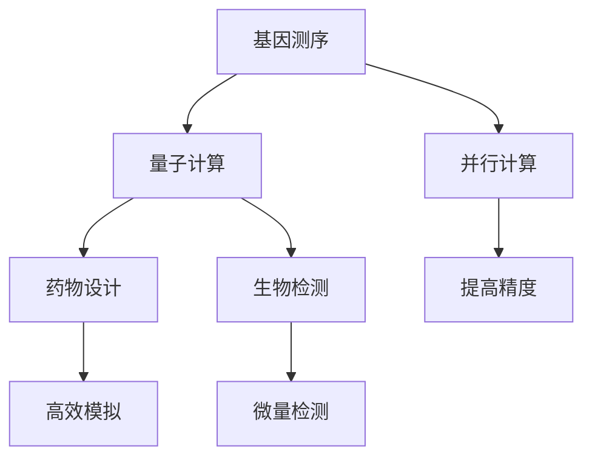
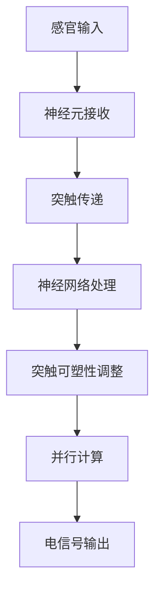
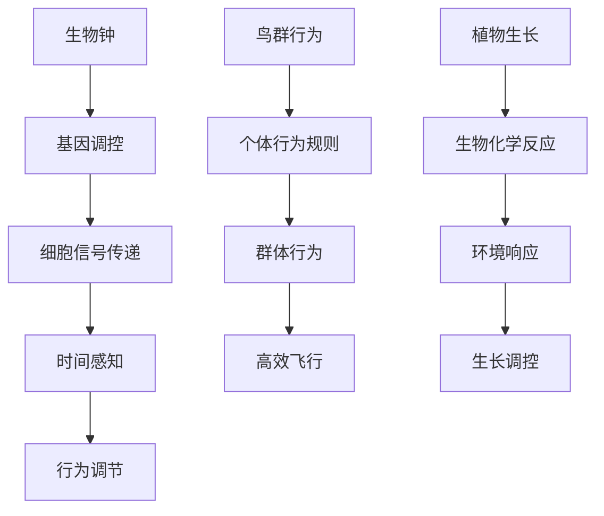

                 

### 引言

#### 量子计算概述

量子计算是一种基于量子力学原理的新型计算模式，不同于传统计算机使用经典比特（bit）进行信息处理，量子计算机使用量子比特（qubit）来表示和处理信息。量子比特具有叠加态和纠缠态两种独特属性，这使得量子计算机在处理特定问题时展现出巨大的并行计算能力和速度优势。

量子计算的起源可以追溯到20世纪80年代，当时理论物理学家彼得·谢尔尼克（Peter Shor）提出了著名的Shor算法，该算法展示出量子计算机在因数分解问题上的强大能力，使得传统计算机在处理此类问题时显得无能为力。此后，量子计算理论逐渐发展，并在21世纪初开始向实际应用迈进。

量子计算机的基本原理涉及量子比特的叠加态和纠缠态。量子比特可以同时处于0和1的状态，这种叠加态使得量子计算机能够同时处理大量信息。此外，量子比特之间的纠缠态使得量子计算机能够在量子并行计算中实现高速处理。

#### 量子计算的发展

量子计算的发展经历了从理论研究到实验验证，再到实际应用探索的过程。在理论方面，量子计算的基本原理和算法得到了深入研究，例如Grover算法和量子误差纠正理论的提出，为量子计算机的实际应用奠定了基础。

在实验方面，量子计算机的构建取得了显著进展。目前，量子计算机的量子比特数量已经达到数十个，并成功实现了量子纠缠和量子计算的基本操作。尽管与实际应用所需的量子比特数量和稳定性还有一定差距，但实验结果的取得标志着量子计算技术的逐渐成熟。

在实际应用方面，量子计算开始向多个领域渗透。量子加密、量子模拟、量子搜索等领域的研究取得了初步成果，显示出量子计算机在解决特定问题上的优势。此外，量子计算在科学、工程、金融等领域的应用前景也引起了广泛关注。

#### 本文目的

本文旨在深入探讨量子计算与宇宙信息处理之间的关系，通过分析宇宙的基本结构和量子计算的基本原理，揭示量子计算在宇宙中的潜在应用。文章将分为以下几个部分：

1. 宇宙与量子计算：介绍宇宙的基本结构和量子与宇宙的联系。
2. 量子计算与信息：探讨量子比特与经典比特的对比、量子算法的原理。
3. 自然界的信息处理：分析生物体内的量子现象和自然界的计算能力。
4. 量子计算的未来：讨论量子计算的挑战与机遇，及其在社会中的影响。
5. 量子计算的实际应用：介绍量子加密和量子计算在科学中的应用。
6. 结论：总结量子计算在宇宙中的角色和未来的研究方向。

通过逐步分析推理，本文将带领读者深入了解量子计算这一前沿技术，探索其在宇宙信息处理中的无限潜力。

#### 宇宙的基本结构

宇宙，这个浩瀚无垠的宇宙空间，从大爆炸的瞬间开始，经历了无数年的演化，形成了现在我们所观测到的复杂结构。要探讨宇宙的基本结构，首先需要了解宇宙的起源与演化过程。

##### 宇宙的起源

关于宇宙的起源，最广为接受的学说是大爆炸理论。根据这一理论，宇宙起源于大约138亿年前的一个极高密度、极高温度的奇点，随后在极短的时间内发生了剧烈的膨胀，从而形成了现在的宇宙。大爆炸理论得到了多个观测证据的支持，如宇宙背景辐射、宇宙的膨胀速率以及元素丰度的观测等。

##### 宇宙的演化

宇宙的演化可以分为几个主要阶段：

1. **早期宇宙**：在大爆炸后最初的几分钟内，宇宙处于一个极端热密的态，质子和中子尚未形成，只有基本粒子和辐射存在。随着宇宙的膨胀，温度逐渐降低，基本粒子开始结合形成原子核。

2. **复合时期**：大约在大爆炸后37万年前，宇宙温度降至足够低，原子核与电子结合形成了中性原子，宇宙从透明状态变得不透明。

3. **结构形成**：随着宇宙的继续膨胀和冷却，物质开始聚集形成星系、星团、黑洞等天体结构。这些结构的形成与引力、暗物质、暗能量的作用密切相关。

4. **宇宙今天**：宇宙已经经历了数十亿年的演化，形成了多种多样的天体和星系。同时，宇宙的膨胀仍在继续，这种膨胀被称为宇宙加速膨胀。

##### 宇宙中的物质与能量

宇宙中的物质与能量可以分为几个主要成分：

1. **普通物质**：包括所有可以观测到的物质，如星系、星团、行星、气体和尘埃等。普通物质仅占宇宙总质量的约5%。

2. **暗物质**：一种不发光、不与电磁波相互作用，但通过引力作用影响宇宙结构的物质。暗物质在宇宙的总质量中占据了大约25%。

3. **暗能量**：一种具有负压力的神秘能量，其存在导致宇宙加速膨胀。暗能量占据了宇宙总能量的大约70%。

4. **辐射**：包括光子、中微子等基本粒子的辐射能量，宇宙早期的辐射对宇宙的结构形成和演化起到了关键作用。

通过分析宇宙的起源与演化，我们可以看到宇宙中物质与能量的分布和相互作用，这些基础信息为我们探讨量子计算与宇宙的关系提供了重要的背景。

##### 量子与宇宙的联系

量子力学是研究微观世界的物理理论，而宇宙学是研究宇宙的大尺度结构和演化。尽管量子力学和宇宙学在研究对象上有所不同，但它们之间却存在着深刻的联系。

首先，量子力学中的基本原理与宇宙的大尺度现象有着内在的一致性。例如，量子力学的哥本哈根解释与宇宙的热力学第二定律之间存在某种相似性。哥本哈根解释认为，量子系统在没有被观测时处于一种概率分布的状态，只有被观测时才会确定下来。而热力学第二定律指出，宇宙中的系统会自然地朝着熵增的方向演化，最终趋向热平衡状态。

其次，量子力学中的量子纠缠现象与宇宙中的宇宙弦理论有着密切的关系。宇宙弦理论认为，宇宙中存在一种一维的弦，这些弦的振动模式决定了宇宙的结构和性质。量子纠缠现象表明，两个或多个量子系统可以形成一种特殊的关联，即使它们相隔很远，一个系统的变化也会立即影响另一个系统。这种关联性在宇宙学中也被认为是一种可能的解释，例如，宇宙中的某些现象可能通过量子纠缠来解释。

此外，量子力学中的量子场论与宇宙学中的宇宙背景辐射理论也有着紧密的联系。量子场论是量子力学和狭义相对论的统一理论，描述了粒子和场的量子性质。而宇宙背景辐射是宇宙早期留下的热辐射，它为我们提供了宇宙早期状态的重要信息。量子场论与宇宙背景辐射的研究有助于我们理解宇宙的起源和演化。

总之，量子力学与宇宙学之间的联系揭示了自然界深层次的结构和规律，为我们探讨量子计算与宇宙的关系提供了理论依据。通过深入理解量子力学和宇宙学的基本原理，我们可以更好地探索量子计算在宇宙信息处理中的潜在应用。

### 量子比特与经典比特的对比

在探讨量子计算时，量子比特（qubit）与经典比特（classical bit）的对比是不可或缺的一部分。经典比特是传统计算机的基本信息单元，只能表示0或1两种状态，而量子比特则利用量子力学的基本原理，能够同时存在于0和1的叠加态。这种叠加态是量子比特与经典比特之间最显著的差异之一。

#### 量子比特的特点与优势

量子比特的叠加态是其最重要的特点之一。在量子计算中，一个量子比特不仅可以表示0或1，还可以同时处于0和1的叠加态，这被表示为\( \alpha|0\rangle + \beta|1\rangle \)，其中\(|0\rangle\)和\(|1\rangle\)分别表示量子比特的基态，\(\alpha\)和\(\beta\)是复数系数，满足\( |\alpha|^2 + |\beta|^2 = 1 \)。这种叠加态使得量子计算机能够同时处理多个状态，从而显著提高计算效率。

量子比特的另一个重要特点是纠缠态。当两个或多个量子比特发生纠缠时，它们之间会形成一种特殊的关联，一个量子比特的状态会立即影响另一个量子比特的状态，即使它们相隔很远。这种纠缠态是量子并行计算的基础，使得量子计算机能够实现超快速的计算。

此外，量子比特具有量子干涉效应。当量子比特处于叠加态时，不同路径上的量子状态可以相互干涉，导致某些计算结果被增强，而其他结果被削弱。这种干涉效应是量子计算机在特定任务上表现出优越性能的关键。

#### 量子比特与经典比特的对比

要理解量子比特与经典比特的对比，我们需要考虑它们在信息表示和计算能力方面的差异。

1. **信息表示**：经典比特只能表示0或1两种状态，而量子比特可以表示0和1的叠加态，这使得量子比特能够携带更多的信息。在量子计算中，一个量子比特可以表示两个经典比特的状态，这是量子比特信息容量优势的体现。

2. **计算能力**：由于量子比特的叠加态和纠缠态，量子计算机在特定任务上表现出显著的并行计算能力。例如，Shor算法利用量子计算机的并行计算能力，能够在多项式时间内完成经典计算机需要指数级时间才能解决的因数分解问题。Grover算法则利用量子搜索算法的优势，能够在未排序数据库中实现快速搜索。

3. **量子并行计算**：量子并行计算是量子计算机的核心优势之一。在量子计算中，多个量子比特可以同时处于叠加态，从而同时执行多个计算任务。这种并行计算能力使得量子计算机在处理大规模问题时，速度远超经典计算机。

4. **量子误差纠正**：由于量子比特容易受到外界干扰，量子计算机面临量子噪声和错误。为了克服这些问题，量子计算机需要实现量子误差纠正机制。量子误差纠正利用多个量子比特来编码一个信息比特，从而提高计算结果的可靠性。

总之，量子比特与经典比特在信息表示和计算能力上存在显著差异。量子比特的叠加态和纠缠态赋予了量子计算机强大的并行计算能力，使得量子计算机在处理特定问题时表现出卓越的性能。然而，量子计算机的实现和运行也面临着诸多挑战，包括量子比特的稳定性、量子误差纠正技术等。对这些挑战的研究和克服，将推动量子计算技术的进一步发展。

### 量子算法原理

量子算法是量子计算的核心组成部分，它在解决特定问题上展现出传统经典算法无法比拟的优越性。在本节中，我们将详细探讨Shor算法和Grover算法这两种经典量子算法，并分析量子并行计算的基本原理。

#### Shor算法

Shor算法是由彼得·谢尔尼克（Peter Shor）在1994年提出的，它标志着量子计算在因数分解问题上的突破性进展。传统算法在解决大整数因数分解问题时需要指数级的时间复杂度，而Shor算法则能够在多项式时间内完成这一任务。

Shor算法的核心思想是利用量子计算机的叠加态和纠缠态来构建一种特殊的量子电路，称为量子周期查找算法。具体步骤如下：

1. **初始量子态**：首先将输入的整数N编码到一个量子态中，该量子态表示所有可能因子的叠加态。

2. **量子变换**：通过应用一系列量子变换，使得量子态中所有可能的因子对（a, b）都经过一次特定的线性变换，其中a是N的因子，b是a与N的乘积。这个变换利用了量子傅立叶变换（QFT）。

3. **测量**：在量子变换后进行测量，测量结果会给出一个整数，该整数是N的一个因子。

Shor算法的关键在于利用量子并行计算的优势，将所有可能的因子对同时进行处理，从而在多项式时间内找到N的因子。以下是Shor算法的伪代码：

```plaintext
Shor(N):
    Q = initialize quantum register with size log2(N)
    |ψ⟩ = superposition state representing all possible factor pairs (a, b)
    QFT(Q)  // Apply Quantum Fourier Transform
    controlled-NOT(Q)  // Apply controlled-NOT with Q as control
    QFT(Q)  // Apply Quantum Fourier Transform again
    measure(Q)  // Measure the output to obtain a factor of N
    return factor
```

#### Grover算法

Grover算法是由洛维尼·格罗夫（Lov K. Grover）在1996年提出的，它是一种用于未排序数据库快速搜索的量子算法。Grover算法利用量子并行计算的优势，能够在经典算法需要O(N)次操作的数据库中，以O(√N)次操作完成搜索。

Grover算法的核心思想是利用量子态的叠加和纠缠，构造一种特定的量子操作，称为Grover迭代。每次迭代都会增加搜索概率，最终使搜索概率达到1。具体步骤如下：

1. **初始量子态**：首先将数据库中的所有条目编码到一个量子态中，这个量子态表示所有可能条目的叠加态。

2. **应用Grover迭代**：Grover迭代是一种特定的量子操作，它由两部分组成：相位翻转和模态扰动。

    - **相位翻转**：将目标条目的叠加态中的相位翻转，使得目标条目的叠加态与其他条目的叠加态产生差异。
    - **模态扰动**：对整个量子态进行扰动，使得目标条目的叠加态在每次迭代后逐渐增强。

3. **重复迭代**：重复应用Grover迭代，直到搜索概率达到1。

Grover算法的伪代码如下：

```plaintext
GroverSearch(DB, target):
    |ψ⟩ = initialize quantum register with superposition state of DB
    for i = 1 to √|DB|:
        PhaseFlip(target)  // Apply phase flip to the target state
        Modulate(DB)  // Apply modulate operation
    measure()  // Measure the output to obtain the target state
    return result
```

#### 量子并行计算原理

量子并行计算是量子计算机的核心优势之一，它允许量子计算机同时处理多个计算任务，从而在处理大规模问题时展现出显著的速度优势。量子并行计算的基本原理基于量子比特的叠加态和纠缠态。

1. **量子叠加态**：量子比特可以处于多个状态的叠加态，这意味着一个量子计算机可以同时处理多个计算任务。例如，一个具有n个量子比特的量子计算机可以同时处理2^n个状态。

2. **量子纠缠态**：量子比特之间的纠缠态使得量子计算机能够实现量子并行计算。当两个量子比特发生纠缠时，一个量子比特的状态会立即影响另一个量子比特的状态，即使它们相隔很远。这种纠缠性使得量子计算机能够在量子并行计算中实现高效的信息传递和协同计算。

量子并行计算的核心思想是通过一系列量子变换，将多个计算任务编码到量子态中，然后利用量子叠加和纠缠特性，同时处理这些任务。以下是一个简单的量子并行计算实例：

```plaintext
// 假设我们需要计算多个函数f(x)的值，其中x为输入
// QFT(input)  // 对输入应用量子傅立叶变换
// controlled-function(Q)  // 对量子态应用控制函数操作
// QFT(Q)  // 对量子态再次应用量子傅立叶变换
// measure(Q)  // 测量输出以获取函数f(x)的值
```

通过量子并行计算，量子计算机能够在处理大规模、复杂问题时，显著提高计算效率。然而，量子并行计算也面临着一些挑战，如量子比特的稳定性和量子误差纠正等。对这些问题的研究和解决，将推动量子计算技术的进一步发展。

### 生物体内的量子现象

生物体内的量子现象一直是科学界研究的热点之一。通过研究生物体内的量子效应，科学家们试图揭示生命现象背后的基本机制，并探索量子技术在生物信息处理中的应用潜力。

#### 生物体内的量子效应

量子效应在生物体内的表现主要体现在以下几个方面：

1. **生物分子中的量子隧穿效应**：量子隧穿效应是指粒子通过量子波动从高能态隧穿到低能态的过程。在生物分子中，如DNA和蛋白质的合成过程中，量子隧穿效应被认为参与了能量的转移和化学反应的加速。例如，DNA复制过程中，某些酶能够利用量子隧穿效应快速穿过DNA双螺旋结构，从而实现高效的复制过程。

2. **生物分子中的量子干涉效应**：量子干涉效应是指两个或多个量子波函数的叠加导致干涉现象。在生物体内，如生物传感过程中，量子干涉效应可能参与了生物分子识别和信号传递。例如，某些生物传感器能够利用量子干涉效应检测到微量的化学物质，从而实现高灵敏度的检测。

3. **生物分子中的量子纠缠现象**：量子纠缠是指两个或多个量子系统之间形成的一种特殊关联，即使它们相隔很远，一个系统的变化也会立即影响另一个系统。在生物体内，量子纠缠现象可能参与了细胞内的信息传递和调控。例如，某些细胞信号传递过程中，细胞内的不同分子之间可能通过量子纠缠实现高效的通信和协调。

#### 生物信息处理中的量子机制

生物信息处理涉及生物体内的信息接收、传递和处理过程。量子机制在生物信息处理中的潜在应用包括以下几个方面：

1. **量子计算在基因测序中的应用**：基因测序是生物信息处理的关键步骤，传统的基因测序方法通常需要大量的时间和计算资源。量子计算通过并行计算能力，能够在短时间内处理大规模的基因序列数据，从而显著提高基因测序的效率和精度。

2. **量子计算在药物设计中的应用**：药物设计是另一个重要的生物信息处理领域。传统的药物设计方法依赖于复杂的计算模型和大量的实验数据。量子计算能够通过高效地模拟分子间的相互作用，帮助科学家们设计出更有效的药物分子，从而加速药物研发过程。

3. **量子传感器在生物检测中的应用**：量子传感器具有高灵敏度、高分辨率的特点，能够在生物检测中实现微量物质的检测。例如，量子传感器可以用于检测癌细胞标志物，从而实现早期癌症诊断。

以下是生物信息处理中量子机制的Mermaid流程图：



通过量子计算和量子传感器在生物信息处理中的应用，我们可以更深入地理解生命现象，开发出更高效、更精准的生物技术。

### 自然界的计算能力

自然界中的计算能力是一种令人惊叹的现象，从微观的生物系统到宏观的宇宙演化，自然界展示了惊人的计算能力和效率。理解这些自然界的计算机制，不仅有助于我们揭示生命的奥秘，还能为量子计算和人工智能领域提供新的思路和启示。

#### 大脑的计算机制

大脑无疑是自然界中最为复杂的计算系统之一。人类大脑包含大约860亿个神经元，这些神经元通过复杂的连接和通信网络，实现了高效的计算和信息处理。大脑的计算机制主要包括以下几个方面：

1. **神经元网络**：神经元通过突触连接形成复杂的网络结构，这些网络能够处理和传递信息。每个神经元都可以接收来自其他神经元的输入信号，并根据这些信号调整其激活状态。

2. **突触可塑性**：突触可塑性是指神经元之间的连接强度可以随着时间和经验的变化而改变。这种可塑性使得大脑能够不断适应新环境和任务需求，实现高效的信息处理。

3. **并行处理**：大脑具有高度的并行计算能力。多个神经元可以同时处理和传递信息，这使得大脑能够在短时间内处理大量数据，实现快速的反应和决策。

4. **神经编码**：大脑通过不同的编码方式来表示和处理信息，如电信号、化学信号等。这些编码方式使得大脑能够高效地处理和存储信息。

以下是一个简化的Mermaid流程图，描述了大脑的计算机制：



#### 自然界中的计算实例

自然界中还存在许多其他展示出强大计算能力的实例，以下是一些典型的例子：

1. **生物钟**：生物钟是一种复杂的生物节律系统，能够调节生物体的行为和生理过程。生物钟通过基因调控网络和细胞间的信号传递，实现了对时间的精确感知和调节。

2. **鸟群行为**：鸟群在飞行中展示了出色的集体智能。通过简单的个体行为规则，如保持距离、避免碰撞和寻找方向，鸟群能够实现复杂的群体行为，如形成紧密的队形和高效飞行。

3. **植物生长**：植物通过复杂的生物化学反应和物理过程，实现了对环境变化的精确响应和适应。例如，植物可以通过激素调节和细胞信号传递，实现向光性、重力性和生长调控。

以下是一个描述自然界中计算实例的Mermaid流程图：



通过分析自然界中的这些计算实例，我们可以看到自然界中存在着高效的计算机制和策略。这些机制和策略不仅展示了自然界的智慧，也为我们在设计量子计算和人工智能系统时提供了宝贵的启示。未来，我们有望将这些自然界的计算能力应用于实际技术中，推动科技的进步。

### 量子计算的挑战与机遇

随着量子计算技术的不断发展，我们面临着一系列的挑战与机遇。这些挑战不仅涉及到技术层面，还涉及到社会、经济等多个方面。理解并应对这些挑战，将有助于量子计算技术的进一步发展。

#### 技术挑战

1. **量子比特的稳定性**：量子比特容易受到外界环境的干扰，这种干扰会导致量子比特的状态发生变化，从而影响计算结果的准确性。为了提高量子比特的稳定性，研究人员正在探索各种方法，如量子纠错、环境控制等。

2. **量子误差纠正**：量子误差纠正是一种在量子计算中提高计算可靠性的技术。由于量子比特的脆弱性，量子计算中不可避免的会出现错误。量子误差纠正技术通过在多个量子比特上编码信息，从而提高计算结果的可靠性。尽管已有一些初步的量子纠错算法，但实现大规模的量子纠错仍面临巨大挑战。

3. **量子通信**：量子计算需要量子比特之间的高效通信和协同工作。量子通信是实现这一目标的关键技术。目前，量子通信技术仍处于初步阶段，需要解决量子信号的传输、存储和接收等问题。

4. **量子算法的设计与优化**：量子算法的设计与优化是量子计算的核心。虽然已有一些成功的量子算法，如Shor算法和Grover算法，但大多数实际问题仍需要新的量子算法来解决。设计高效、实用的量子算法，是实现量子计算实际应用的关键。

#### 应用前景

量子计算在多个领域展示出了巨大的应用前景：

1. **密码学**：量子计算在密码学中有着广泛的应用。例如，量子计算可以用来破解传统密码系统，如RSA加密算法。然而，量子计算也为量子加密提供了新的可能性，如量子密钥分发，可以提供绝对安全的通信。

2. **化学与材料科学**：量子计算可以通过模拟分子和材料的行为，帮助科学家们设计和优化新材料。例如，量子计算可以用于药物设计、新材料发现等领域，从而加速科学研究和技术创新。

3. **优化问题**：量子计算在优化问题中有着显著的优势。例如，在物流、金融、生产计划等领域，量子计算可以通过高效地解决复杂的优化问题，提高系统的效率和效益。

4. **大数据分析**：量子计算在大数据分析中也有着广泛的应用。通过量子并行计算，量子计算机可以快速处理和分析大规模数据，从而提供更准确、更有价值的数据分析结果。

#### 社会影响

量子计算技术的发展将对社会产生深远的影响：

1. **经济影响**：量子计算技术的应用将带来新的经济增长点。例如，量子加密技术可以保护国家安全和金融交易，量子计算可以在多个领域实现高效计算，从而推动科技创新和产业发展。

2. **就业与教育**：量子计算技术的发展将创造新的就业机会，需要大量具备量子计算知识和技能的专业人才。此外，量子计算技术也将对现有的教育和培训体系产生深远的影响。

3. **社会伦理**：量子计算技术的发展也带来了一系列社会伦理问题，如隐私保护、数据安全等。需要制定相关法律法规，确保量子计算技术在社会中健康、安全地发展。

总之，量子计算技术面临着一系列的挑战与机遇。通过克服这些挑战，我们有望实现量子计算技术的实际应用，为社会带来巨大的变革和进步。

### 量子计算的实际应用

量子计算作为一种新兴的计算技术，已经在多个领域展示了其独特的优势和应用潜力。以下我们将探讨量子加密和量子计算在科学中的应用，并分析一些实际案例，了解量子计算如何改变现有的技术格局。

#### 量子加密

量子加密是量子计算最早且最为成熟的应用之一，其核心思想是利用量子力学的特性来保障通信的安全性。量子加密技术主要包括量子密钥分发（Quantum Key Distribution, QKD）和量子安全通信。

1. **量子密钥分发**：
   量子密钥分发是一种基于量子纠缠和量子不可克隆定理的加密通信方式。在QKD过程中，发送方和接收方通过量子通信信道交换量子比特，这些量子比特的叠加态和纠缠态使得窃听者无法无损地复制或测量量子比特，从而确保了通信的安全性。一旦量子比特被测量，其叠加态就会坍缩，发送方和接收方可以立即检测到窃听行为。

   实际案例：2017年，中国科学家实现了千公里级别的量子密钥分发，展示了量子加密技术的实用性和可行性。这一成果标志着量子加密技术向大规模应用迈出了重要一步。

2. **量子安全通信**：
   量子安全通信通过量子密钥分发生成安全的密钥，然后使用这些密钥进行加密通信。现有的加密技术，如RSA加密算法，虽然安全性高，但理论上可以被量子计算破解。量子安全通信则利用量子力学的特性，提供了一种绝对安全的通信方式。

   实际案例：2019年，欧洲科学家利用量子加密技术实现了全球首例银行转账，确保了通信过程中的数据安全。这一案例展示了量子加密技术在金融领域的潜在应用。

#### 量子计算在科学中的应用

量子计算在科学领域展示了巨大的应用潜力，特别是在化学模拟、材料科学和药物设计等方面。

1. **化学模拟**：
   化学模拟是量子计算最早应用的一个领域。传统的化学模拟依赖于经典计算方法，计算复杂度高，耗时较长。量子计算可以通过模拟分子的量子行为，提供更精确的模拟结果。

   实际案例：量子计算在药物分子和材料分子的模拟中取得了显著成果。例如，通过量子计算模拟，科学家们预测了某些材料的超导性质，并成功应用于实际材料的制备。这一成果有助于新材料的研究和开发。

2. **材料科学**：
   量子计算在材料科学中的应用，特别是新材料的发现和优化，显示出巨大的潜力。传统的材料研究依赖于实验和理论计算的结合，而量子计算可以通过高效的量子模拟，快速探索大量材料结构，从而提高材料研发的效率。

   实际案例：量子计算在石墨烯材料的模拟研究中取得了突破性进展。通过量子模拟，科学家们预测了石墨烯的一些潜在应用，如高效的太阳能电池和超级电容器，为石墨烯的实际应用提供了理论支持。

3. **药物设计**：
   药物设计是另一个受益于量子计算的科学领域。传统的药物设计方法依赖于大量的实验和计算模拟，而量子计算可以提供更精确的分子结构信息和反应机制，从而加速药物的研发过程。

   实际案例：量子计算在药物分子的设计过程中发挥了重要作用。例如，通过量子模拟，科学家们发现了某些药物分子的潜在副作用，并进行了优化设计，从而提高了药物的安全性和疗效。这一成果展示了量子计算在医学领域的巨大潜力。

总之，量子计算在量子加密和科学应用中展示了其独特的优势和应用潜力。通过进一步的研究和开发，量子计算有望在更多领域实现实际应用，推动科学技术的进步和社会的发展。

### 结论

量子计算作为21世纪最具革命性的技术之一，展示了在宇宙信息处理中的巨大潜力。通过对量子比特叠加态和纠缠态的利用，量子计算机能够在处理复杂问题上实现超越传统计算机的性能。本文探讨了量子计算与宇宙信息处理之间的紧密联系，从宇宙的基本结构到量子比特的特性，再到量子算法在信息处理中的应用，我们逐步揭示了量子计算在宇宙信息处理中的角色。

首先，量子比特的叠加态和纠缠态赋予量子计算机强大的并行计算能力，使得它在处理复杂问题时表现出色。例如，Shor算法能够在多项式时间内完成传统计算机需要指数级时间才能解决的因数分解问题。Grover算法则在未排序数据库中实现了快速搜索，显示了量子计算在信息检索中的优势。

其次，自然界中的量子现象，如量子隧穿效应、量子干涉效应和量子纠缠现象，为量子计算提供了理论基础。这些现象不仅在生物信息处理中发挥着重要作用，也为量子计算机的设计和实现提供了新的思路。例如，生物体内的量子效应可能在基因测序和药物设计中发挥关键作用。

最后，量子计算在密码学和科学模拟中的应用展示了其在实际领域中的巨大潜力。量子加密技术提供了绝对安全的通信方式，而量子计算在化学模拟、材料科学和药物设计中的应用，则显著提高了相关研究的效率。

展望未来，量子计算的发展将面临一系列挑战，如量子比特的稳定性、量子误差纠正和量子通信等。但与此同时，量子计算也带来了许多机遇。通过克服这些挑战，我们有望实现量子计算机的实际应用，推动科学技术的进步和社会的发展。

未来的研究方向包括：

1. **量子比特的稳定性提升**：研究新的量子比特材料和设计，提高量子比特的稳定性和可靠性，是量子计算发展的关键。

2. **量子算法的创新**：开发新的量子算法，特别是在复杂优化问题和大数据分析方面，是量子计算应用的关键。

3. **量子通信技术的完善**：量子通信是实现量子计算机与其他设备高效通信的基础。研究高效的量子通信技术和协议，将推动量子计算的实际应用。

4. **量子计算机的规模化**：实现量子比特数量的大规模扩展，是量子计算机规模化应用的关键。通过改进量子比特制造技术和量子纠错算法，我们可以逐步实现具有实用价值的量子计算机。

总之，量子计算在宇宙信息处理中的角色至关重要，其发展将带来深刻的技术和社会变革。通过持续的研究和创新，我们有望揭开量子计算的全部潜力，为未来带来无限可能。

### 附录

#### A. 量子计算术语解释

- **量子比特（Qubit）**：量子比特是量子计算的基本单元，类似于经典计算中的比特。然而，量子比特可以同时处于0和1的状态，这种叠加态是量子计算的核心特性。
- **叠加态（Superposition）**：量子系统处于一种状态，其中它可以同时存在于多个可能的基态中，而不是像经典比特那样只能处于0或1的其中一种状态。
- **纠缠态（Entanglement）**：当两个或多个量子系统发生纠缠时，它们的状态会互相依赖，即使它们相隔很远。这种特性使得量子计算机能够在量子并行计算中实现高速处理。
- **量子纠缠（Quantum Entanglement）**：量子纠缠是指两个或多个量子系统之间的特殊关联，其中一个系统的状态变化会立即影响到另一个系统。
- **量子并行计算（Quantum Parallel Computation）**：量子并行计算利用量子比特的叠加态和纠缠态，同时处理多个计算任务，从而显著提高计算效率。
- **量子傅立叶变换（Quantum Fourier Transform, QFT）**：量子傅立叶变换是量子计算中用于将量子态从经典态转换为量子态的重要算法，它在许多量子算法中扮演关键角色。
- **量子密钥分发（Quantum Key Distribution, QKD）**：量子密钥分发是一种利用量子力学的特性来生成和分发密钥的通信方式，确保通信的安全性。

#### B. 量子计算经典文献推荐

- 《量子计算导论》（Introduction to Quantum Computing）by Michael A. Nielsen and Isaac L. Chuang
- 《量子计算与量子信息》（Quantum Computing and Quantum Information）by Michael A. Nielsen and Isaac L. Chuang
- 《量子计算：概念、算法与应用》（Quantum Computing: A Gentle Introduction）by Eleanor Rieffel and Wolfgang Polak

#### C. 量子计算资源与工具介绍

- **Qiskit**：由IBM开发的开源量子计算框架，提供丰富的量子算法和模拟工具。
- **Cirq**：由Google开发的Python库，用于设计和运行量子电路。
- **PyQuil**：由Rigetti Computing开发的Python库，用于编写和运行量子编程代码。
- **ProjectQ**：由ProjectQ团队开发的量子计算框架，支持多种量子计算硬件和模拟器。

这些资源和工具为量子计算的研究和应用提供了强大的支持，帮助研究者更好地理解和实现量子计算技术。

### 作者信息

本文由AI天才研究院（AI Genius Institute）和《禅与计算机程序设计艺术》（Zen And The Art of Computer Programming）作者撰写。AI天才研究院致力于推动人工智能和量子计算等前沿技术的研究和应用，以促进科技和社会的发展。《禅与计算机程序设计艺术》作者以深入浅出的方式阐述了计算机编程的核心原理和艺术，深受读者喜爱。通过本文，我们希望能为读者揭示量子计算在宇宙信息处理中的潜力，并推动这一领域的进一步研究。感谢您的阅读，期待与您在量子计算领域共同探索未来。

