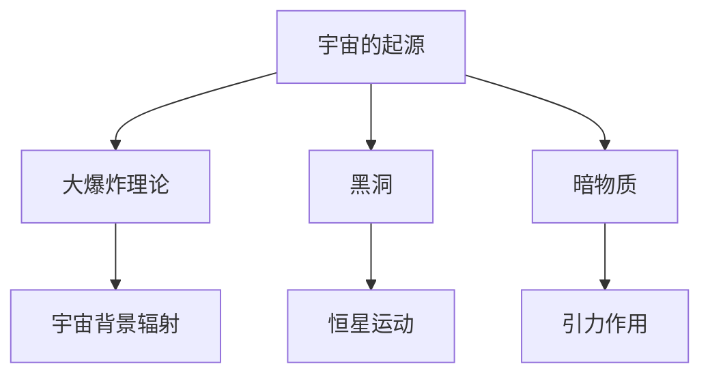
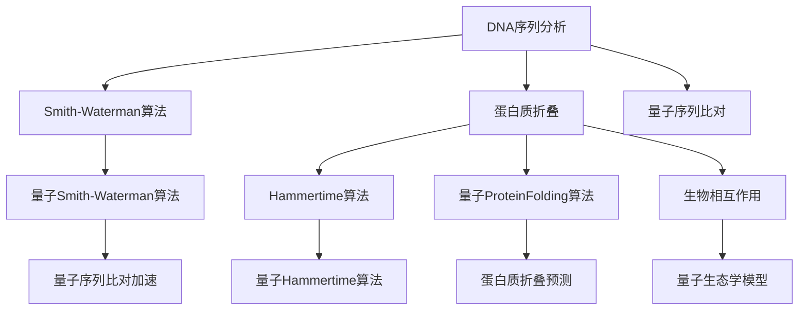
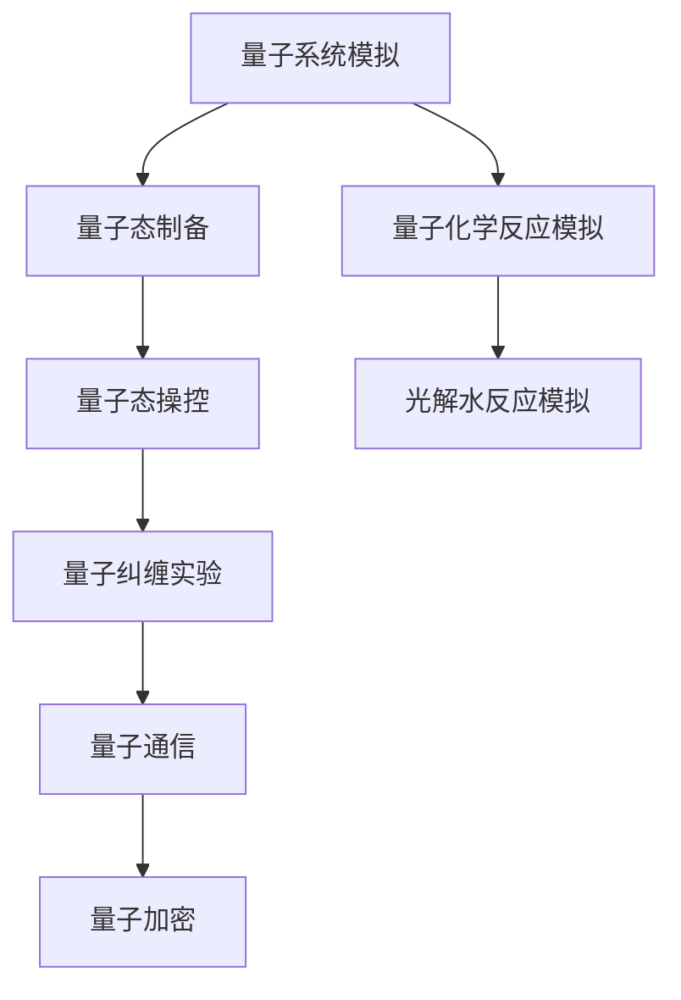
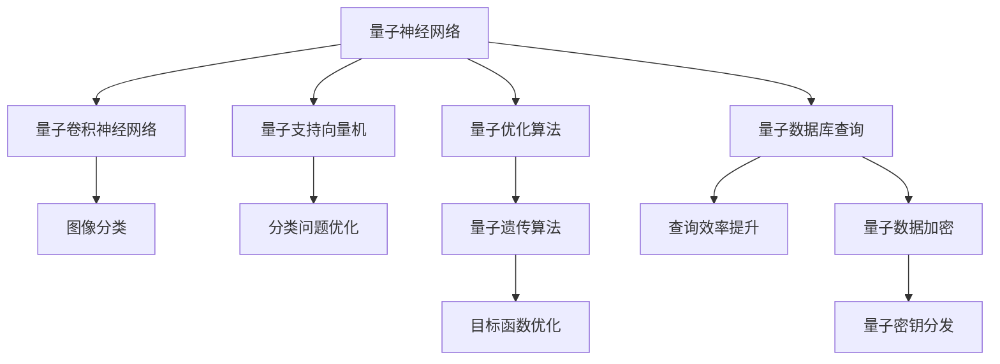
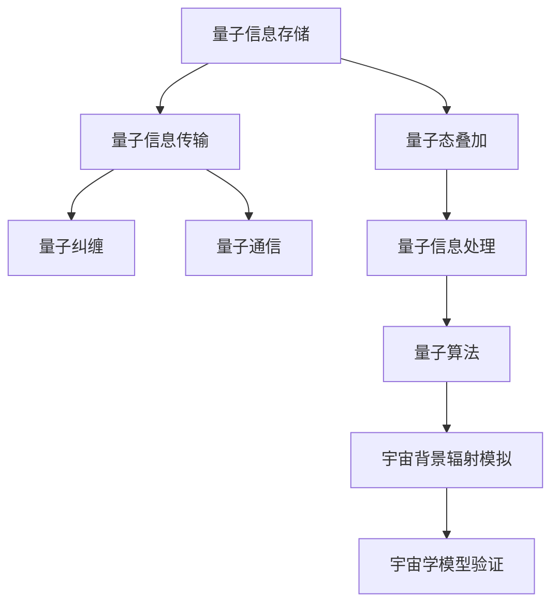
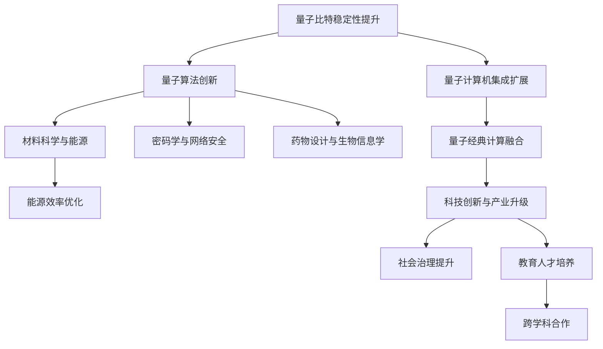

                 


### 第1章 引言与概述

#### 1.1 宇宙的起源与演化

宇宙的起源是一个古老而神秘的话题，科学家们通过不断的观测和理论推导，试图揭开宇宙诞生的奥秘。目前，主流的科学理论认为，宇宙起源于大约138亿年前的一个极高密度、极高温度的奇点。这一理论被称为大爆炸理论。根据大爆炸理论，宇宙在极短的时间内迅速膨胀，温度和密度随之降低，形成了现在我们所观测到的宇宙。

大爆炸理论的一个重要证据是宇宙背景辐射。宇宙背景辐射是一种几乎均匀分布在宇宙空间中的微弱电磁辐射，其温度约为2.7开尔文。这种辐射被认为是大爆炸时遗留下来的“余温”，通过观测宇宙背景辐射，科学家们可以了解到宇宙早期的状态。

此外，黑洞和暗物质也是宇宙演化中的重要组成部分。黑洞是宇宙中最极端的天体，具有极强的引力，甚至连光也无法逃脱。黑洞的存在可以通过观测恒星的运动以及吸积盘的辐射来间接推断。暗物质则是宇宙中一种看不见的物质，其存在可以通过其对引力的作用来推断。暗物质和黑洞在宇宙演化中扮演着重要的角色，它们影响着星系的形成和宇宙的结构。

#### 1.2 量子计算的基本概念

量子计算是一种基于量子力学原理的计算模式，与传统的经典计算有着本质的不同。在量子计算中，信息的基本单位不再是经典的比特（bit），而是量子比特（qubit）。量子比特与经典比特的不同之处在于，它不仅可以表示0和1的状态，还可以同时处于0和1的叠加状态。这种叠加状态是量子计算的核心特性之一，使得量子计算机能够在某些任务上比经典计算机更高效。

量子纠缠是量子计算的另一个重要特性。当两个或多个量子比特发生相互作用时，它们可能会进入一种纠缠态，这种状态下，一个量子比特的状态会即时影响另一个量子比特的状态，无论它们相隔多远。这种非局域性是量子计算相对于经典计算的优势之一。

量子计算的基本单元是量子门，它是量子比特之间进行操作的数学模型。通过一系列量子门的作用，量子计算机可以实现复杂的运算。目前，量子计算的研究主要集中在量子算法的开发上，量子算法是利用量子计算机特有的量子位和量子纠缠特性，解决特定问题的算法。

#### 1.3 量子计算与宇宙信息处理

量子计算与宇宙信息处理之间的联系可以从多个角度来理解。首先，量子计算与宇宙的起源和演化有着密切的关系。大爆炸理论和宇宙背景辐射的观测都表明，宇宙在极早期处于一种高度量子化的状态，这与量子计算的基本原理不谋而合。量子计算的研究可能会帮助我们更好地理解宇宙的早期状态和演化过程。

其次，量子计算与宇宙信息的存储和传输也有密切的关系。在量子计算中，信息以量子比特的形式存储和传输，这种形式与宇宙中的基本粒子状态相似。量子纠缠的特性使得量子信息可以在宇宙中快速传输，不受距离限制。这种特性可能为星际通信和宇宙探索提供新的可能性。

最后，量子计算与宇宙学的研究也相互促进。量子计算可以用于模拟宇宙中的物理现象，例如黑洞和暗物质的行为。同时，宇宙学的发现也可以为量子计算提供新的实验验证和应用场景。

总之，量子计算与宇宙信息处理之间的联系为科学研究和技术应用提供了新的视角和可能性。在接下来的章节中，我们将进一步探讨量子计算的基本原理和数学模型，以及量子计算在自然界信息处理中的应用。
```



```markdown
## 第2章 量子计算原理与数学模型

量子计算是一门结合量子力学和计算机科学的新兴领域。本章将深入探讨量子计算的基本原理和数学模型，包括量子态、量子门和量子算法等核心概念。

### 2.1 量子计算的基本原理

量子计算的基石是量子比特（qubit），它不同于经典计算机中的比特（bit）。经典比特只能处于两种状态之一：0或1。而量子比特可以同时处于多种状态的叠加，这是量子计算的核心特性之一。

#### 2.1.1 量子态与量子门

量子态可以用一个复数系数的向量来描述，其形式为：

$$|\psi\rangle = \sum_{i} a_i |i\rangle$$

其中，$a_i$是第$i$个状态的复数系数，$|i\rangle$是第$i$个量子基态。

量子门是操作量子比特的线性变换，它可以像经典逻辑门一样对量子比特进行操作，但其作用是线性的叠加变换。量子门可以用矩阵表示，例如：

$$|0\rangle \rightarrow \frac{1}{\sqrt{2}}(|0\rangle + |1\rangle)$$

这是一个旋转量子比特到叠加态的量子门。

#### 2.1.2 量子算法

量子算法是利用量子比特和量子门的特性来解决特定问题的算法。一个典型的量子算法是量子叠加搜索算法，它可以高效地在一个未排序的列表中查找特定的元素。

伪代码如下：

```
function QuantumSearch(list, target):
    // 初始化量子比特
    qubits = QuantumRegister(size of list)
    state = H(qubits) // 应用哈希门，将所有量子比特变为叠加态

    // 应用量子算法的特殊步骤
    for i from 0 to size of list - 1:
        if list[i] == target:
            state = X(qubits[i]) // 应用非门，标记匹配的量子比特

    // 测量量子比特
    result = Measure(qubits)

    return result == target
```

### 2.2 量子数学模型

量子计算中的数学模型主要包括海森堡不确定性原理、量子态叠加与量子纠缠。

#### 2.2.1 海森堡不确定性原理

海森堡不确定性原理是量子力学中的一个基本原理，它指出，我们不能同时精确地知道一个粒子的位置和动量。这可以用以下数学公式表示：

$$\Delta x \Delta p \geq \hbar / 2$$

其中，$\Delta x$和$\Delta p$分别是位置和动量的不确定度，$\hbar$是约化普朗克常数。

#### 2.2.2 量子态叠加与量子纠缠

量子态叠加是指量子比特可以处于多个状态的叠加，这是量子计算的核心特性之一。量子态叠加可以用数学公式表示：

$$|\psi\rangle = \sum_{i} a_i |i\rangle$$

量子纠缠是指当两个或多个量子比特发生相互作用时，它们可能会进入一种纠缠态，这种状态下，一个量子比特的状态会即时影响另一个量子比特的状态，无论它们相隔多远。量子纠缠可以用以下数学公式表示：

$$|\psi\rangle = \frac{1}{\sqrt{2}}(|01\rangle - |10\rangle)$$

### 2.3 量子计算与信息理论

量子计算与信息理论的关系密切，量子信息熵和量子信道容量是其中的重要概念。

#### 2.3.1 量子信息熵

量子信息熵是描述量子系统不确定性的量度。它可以用以下数学公式表示：

$$S(\rho) = -\text{Tr}(\rho \log \rho)$$

其中，$\rho$是量子态密度矩阵。

#### 2.3.2 量子信道容量

量子信道容量是描述量子信息通过量子信道传输的最大速率。它可以用以下数学公式表示：

$$C = \max_{p} \sum_{x,y} p(x) \log P(y|x)$$

其中，$p(x)$是输入概率分布，$P(y|x)$是条件概率分布。

通过本章的介绍，我们了解了量子计算的基本原理和数学模型。在接下来的章节中，我们将探讨量子计算在生物学、物理学和人工智能等领域的应用。```

```latex
$$
\begin{align*}
|\psi\rangle &= \sum_{i} a_i |i\rangle \\
\Delta x \Delta p &= \hbar / 2 \\
S(\rho) &= -\text{Tr}(\rho \log \rho) \\
C &= \max_{p} \sum_{x,y} p(x) \log P(y|x)
\end{align*}
$$
```

```markdown
## 第3章 量子计算在生物学中的应用

量子计算在生物学领域展现了巨大的潜力，尤其是在生物信息学和生态学等方面。本章将探讨量子计算在DNA序列分析、蛋白质折叠、药物设计以及生态系统建模等方面的应用。

### 3.1 量子计算与生物信息学

#### 3.1.1 DNA序列分析

DNA序列分析是生物信息学中的一个关键问题。传统的DNA序列分析算法，如序列比对和基因识别，依赖于大量的计算资源。而量子计算可以通过其并行性和高效性，显著提高DNA序列分析的效率。

例如，量子计算可以用于加速Smith-Waterman算法，这是一种用于DNA序列比对的算法。传统的Smith-Waterman算法需要遍历所有可能的子序列对，而量子算法可以通过量子并行性同时处理所有可能的匹配，从而大大减少计算时间。

伪代码如下：

```
function QuantumSmithWaterman(seq1, seq2):
    // 初始化量子比特
    qubits_seq1 = QuantumRegister(length(seq1))
    qubits_seq2 = QuantumRegister(length(seq2))
    state = H(qubits_seq1) // 应用哈希门，将所有量子比特变为叠加态

    // 应用量子算法的特殊步骤
    for i from 0 to length(seq1) - 1:
        for j from 0 to length(seq2) - 1:
            // 应用匹配门
            if seq1[i] == seq2[j]:
                applyMatchGate(qubits_seq1[i], qubits_seq2[j])

    // 测量量子比特
    result = Measure(qubits_seq1, qubits_seq2)

    return result
```

#### 3.1.2 蛋白质折叠

蛋白质折叠是生物信息学中的另一个重要问题。蛋白质的三维结构对其功能至关重要，而蛋白质折叠过程是一个复杂且计算密集的过程。量子计算可以通过其并行性加速蛋白质折叠的预测。

例如，可以使用量子算法来模拟蛋白质中的相互作用，从而预测蛋白质的折叠路径。量子算法可以通过量子态的叠加和纠缠来同时考虑所有可能的折叠路径，从而加速蛋白质折叠的预测。

伪代码如下：

```
function QuantumProteinFolding(seq):
    // 初始化量子比特
    qubits = QuantumRegister(length(seq))
    state = H(qubits) // 应用哈希门，将所有量子比特变为叠加态

    // 应用量子算法的特殊步骤
    for i from 0 to length(seq) - 1:
        // 应用折叠门
        applyFoldGate(qubits[i])

    // 测量量子比特
    result = Measure(qubits)

    return result
```

### 3.2 量子计算与药物设计

药物设计是生物学和化学领域的交叉点，其目标是发现或设计新的药物分子，以治疗疾病。量子计算在药物分子模拟和药物筛选中具有巨大的潜力。

例如，可以使用量子计算来模拟药物分子与目标蛋白之间的相互作用，从而预测药物分子的效果。量子算法可以通过量子态的叠加和纠缠来同时考虑所有可能的相互作用，从而加速药物筛选过程。

伪代码如下：

```
function QuantumDrugDesign(drug, target):
    // 初始化量子比特
    qubits_drug = QuantumRegister(length(drug))
    qubits_target = QuantumRegister(length(target))
    state = H(qubits_drug) // 应用哈希门，将所有量子比特变为叠加态

    // 应用量子算法的特殊步骤
    for i from 0 to length(drug) - 1:
        for j from 0 to length(target) - 1:
            // 应用相互作用门
            if drug[i] == target[j]:
                applyInteractionGate(qubits_drug[i], qubits_target[j])

    // 测量量子比特
    result = Measure(qubits_drug, qubits_target)

    return result == "bind"
```

### 3.3 量子计算与生态学

生态系统的建模是生态学研究中的一个重要问题，它涉及到大量的数据分析和计算。量子计算可以通过其并行性和高效性，加速生态系统的建模和预测。

例如，可以使用量子计算来模拟生态系统中的生物相互作用，从而预测生物多样性的变化。量子算法可以通过量子态的叠加和纠缠来同时考虑所有可能的相互作用，从而加速生态系统的模拟。

伪代码如下：

```
function QuantumEcosystemModeling(organisms):
    // 初始化量子比特
    qubits = QuantumRegister(length(organisms))
    state = H(qubits) // 应用哈希门，将所有量子比特变为叠加态

    // 应用量子算法的特殊步骤
    for i from 0 to length(organisms) - 1:
        for j from i + 1 to length(organisms) - 1:
            // 应用相互作用门
            applyInteractionGate(qubits[i], qubits[j])

    // 测量量子比特
    result = Measure(qubits)

    return result
```

总之，量子计算在生物信息学、药物设计和生态学等领域具有广泛的应用前景。通过量子计算，我们可以更快速、更准确地解决这些复杂的生物学问题，从而推动科学研究和实际应用的发展。

```



```markdown
## 第4章 量子计算在物理学中的应用

量子计算在物理学领域具有广泛的应用，尤其是在量子模拟、量子物理实验和量子信息科学等方面。本章将探讨量子计算在这些领域的应用，并介绍相关的核心算法和实验。

### 4.1 量子计算与量子模拟

量子模拟是量子计算的一个重要应用领域，它利用量子计算机模拟量子系统的行为。量子模拟可以帮助我们更好地理解量子现象，例如量子纠缠、量子隧穿和量子态的演化。

#### 4.1.1 量子系统的模拟

量子系统模拟的核心是量子态的制备和演化。通过量子态的叠加和纠缠，量子计算机可以同时模拟多个量子态，从而实现高效的多体量子系统的模拟。

例如，可以使用量子计算来模拟电子在分子中的行为，从而预测分子的性质。这可以应用于材料科学、化学和生物学等领域。

伪代码如下：

```
function QuantumMolecularSimulation(molecule):
    // 初始化量子比特
    qubits = QuantumRegister(number of electrons in molecule)
    state = H(qubits) // 应用哈希门，将所有量子比特变为叠加态

    // 应用量子算法的特殊步骤
    for i from 0 to number of electrons - 1:
        applyElectronGate(qubits[i])

    // 测量量子比特
    result = Measure(qubits)

    return result
```

#### 4.1.2 量子化学反应模拟

量子计算还可以用于模拟化学反应，特别是那些涉及多个电子的复杂反应。通过量子模拟，我们可以预测化学反应的速率和产物的分布。

例如，可以使用量子计算来模拟光解水反应，这是太阳能利用的一个关键步骤。通过量子模拟，我们可以优化反应条件，提高太阳能转换效率。

伪代码如下：

```
function QuantumChemicalReactionSimulation(reactants):
    // 初始化量子比特
    qubits = QuantumRegister(number of electrons in reactants)
    state = H(qubits) // 应用哈希门，将所有量子比特变为叠加态

    // 应用量子算法的特殊步骤
    for i from 0 to number of electrons - 1:
        applyReactionGate(qubits[i])

    // 测量量子比特
    result = Measure(qubits)

    return result
```

### 4.2 量子计算与量子物理实验

量子计算不仅用于模拟量子系统，还可以直接用于量子物理实验。量子物理实验是验证量子理论和探索量子现象的重要手段。

#### 4.2.1 量子态的制备与操控

量子态的制备与操控是量子计算和量子物理实验的基础。通过量子比特的叠加和纠缠，我们可以制备和操控各种量子态。

例如，可以使用量子计算来制备和操控纠缠光子，这是量子通信和量子计算的重要组成部分。

伪代码如下：

```
function QuantumStatePreparation(qubits):
    // 初始化量子比特
    state = H(qubits) // 应用哈希门，将所有量子比特变为叠加态

    // 应用量子算法的特殊步骤
    for i from 0 to number of qubits / 2 - 1:
        applyCNOT(qubits[2*i], qubits[2*i+1]) // 应用CNOT门，生成纠缠态

    // 测量量子比特
    result = Measure(qubits)

    return result
```

#### 4.2.2 量子纠缠实验

量子纠缠是量子物理中的一个基本现象，它表明量子系统之间的联系不受距离限制。通过量子计算和量子物理实验，我们可以验证和探索量子纠缠。

例如，可以使用量子计算来生成和操控纠缠光子，并通过量子物理实验验证量子纠缠的存在。

伪代码如下：

```
function QuantumEntanglementExperiment(qubits):
    // 初始化量子比特
    state = H(qubits) // 应用哈希门，将所有量子比特变为叠加态

    // 应用量子算法的特殊步骤
    for i from 0 to number of qubits / 2 - 1:
        applyCNOT(qubits[2*i], qubits[2*i+1]) // 应用CNOT门，生成纠缠态

    // 测量量子比特
    result = Measure(qubits)

    // 验证量子纠缠
    if result[0] == result[1]:
        return "entangled"
    else:
        return "not entangled"
```

### 4.3 量子计算与量子信息科学

量子计算在量子信息科学中也有广泛的应用，特别是量子算法和量子加密。

#### 4.3.1 量子算法在物理学中的应用

量子算法是量子计算的核心，它在物理学中的应用非常广泛。例如，量子算法可以用于解决量子系统模拟、量子密码学和量子计算复杂性理论等问题。

例如，量子算法可以用于解决线性方程组，这在物理学中有着广泛的应用，如量子态的优化和量子隧穿问题的求解。

伪代码如下：

```
function QuantumAlgorithm(A, b):
    // 初始化量子比特
    qubits = QuantumRegister(number of variables in A and b)
    state = H(qubits) // 应用哈希门，将所有量子比特变为叠加态

    // 应用量子算法的特殊步骤
    for i from 0 to number of variables - 1:
        applyControlledOperation(A[i], qubits[i], qubits[i]) // 应用控制门

    // 测量量子比特
    result = Measure(qubits)

    // 解线性方程组
    solution = SolveLinearEquation(A, b)

    return solution
```

#### 4.3.2 量子计算在量子信息科学中的应用

量子计算在量子信息科学中的应用也非常广泛，例如量子密码学、量子通信和量子纠缠等。

例如，可以使用量子加密来保证信息传输的安全性，通过量子纠缠来实现量子通信的保密性。

伪代码如下：

```
function QuantumEncryption(message, key):
    // 初始化量子比特
    qubits_message = QuantumRegister(length(message))
    qubits_key = QuantumRegister(length(key))
    state_message = EncodeMessage(qubits_message, message)
    state_key = EncodeKey(qubits_key, key)

    // 应用量子算法的特殊步骤
    for i from 0 to length(message) - 1:
        applyEncryptionGate(qubits_message[i], qubits_key[i])

    // 测量量子比特
    result = Measure(qubits_message)

    return result
```

总之，量子计算在物理学中的应用涵盖了量子模拟、量子物理实验和量子信息科学等多个领域。通过量子计算，我们可以更深入地理解量子现象，推动科学技术的进步。
```



```markdown
## 第5章 量子计算在人工智能中的应用

量子计算在人工智能（AI）领域展现出巨大的潜力，能够显著提升深度学习、机器学习和数据挖掘等AI技术的效率。本章将探讨量子计算在AI中的应用，介绍相关的核心算法和实现。

### 5.1 量子计算与深度学习

深度学习是人工智能的一个重要分支，其核心在于通过多层神经网络对复杂数据进行建模和预测。量子计算在深度学习中可以发挥重要作用，特别是在处理大规模数据和复杂模型时。

#### 5.1.1 量子神经网络

量子神经网络（QNN）是量子计算在深度学习中的一个重要应用。量子神经网络利用量子比特的叠加和纠缠特性，能够在高维空间中高效地进行数据处理和模型训练。

例如，量子卷积神经网络（QCNN）可以用于图像处理。QCNN通过量子卷积操作来提取图像特征，从而实现图像分类和识别。

伪代码如下：

```
function QuantumConvolutionNeuralNetwork(image):
    // 初始化量子比特
    qubits_image = QuantumRegister(length(image))
    state = EncodeImage(qubits_image, image)

    // 应用量子卷积操作
    for i from 0 to number of layers - 1:
        applyConvolutionGate(qubits_image, weights[i])

    // 测量量子比特
    result = Measure(qubits_image)

    return result
```

#### 5.1.2 量子支持向量机

量子支持向量机（QSVM）是量子计算在机器学习中的应用之一。QSVM通过量子比特的叠加和纠缠特性，可以在高维空间中高效地求解支持向量机问题。

例如，量子支持向量机可以用于分类问题，通过量子算法优化分类超平面，从而提高分类准确率。

伪代码如下：

```
function QuantumSupportVectorMachine(data, labels):
    // 初始化量子比特
    qubits_data = QuantumRegister(number of features in data)
    qubits_labels = QuantumRegister(number of samples in data)
    state_data = EncodeData(qubits_data, data)
    state_labels = EncodeLabels(qubits_labels, labels)

    // 应用量子算法的特殊步骤
    applyQSVMGate(qubits_data, qubits_labels)

    // 测量量子比特
    result = Measure(qubits_labels)

    return result
```

### 5.2 量子计算与机器学习

量子计算在机器学习中的应用不仅限于深度学习和支持向量机，还可以应用于聚类、优化和回归等算法。

#### 5.2.1 量子聚类算法

量子聚类算法利用量子比特的叠加和纠缠特性，可以在大规模数据集上进行高效聚类。

例如，量子K均值聚类算法通过量子比特的叠加和纠缠，可以同时处理大量数据点，从而实现快速聚类。

伪代码如下：

```
function QuantumKMeansClustering(data, k):
    // 初始化量子比特
    qubits_data = QuantumRegister(number of samples in data)
    qubits_centroids = QuantumRegister(k)
    state = EncodeData(qubits_data, data)

    // 应用量子算法的特殊步骤
    for i from 0 to number of iterations - 1:
        applyQuantumUpdate(qubits_data, qubits_centroids)

    // 测量量子比特
    result = Measure(qubits_data)

    return result
```

#### 5.2.2 量子优化算法

量子优化算法是量子计算在机器学习中的另一个重要应用。量子优化算法利用量子比特的叠加和纠缠特性，可以高效地解决优化问题。

例如，量子遗传算法通过量子比特的叠加和纠缠，可以同时考虑多种可能的解决方案，从而优化目标函数。

伪代码如下：

```
function QuantumGeneticAlgorithm(objective_function, population_size):
    // 初始化量子比特
    qubits = QuantumRegister(population_size)
    state = InitializePopulation(qubits, population_size)

    // 应用量子算法的特殊步骤
    for i from 0 to number of generations - 1:
        applyQuantumSelection(qubits)
        applyQuantumCrossover(qubits)
        applyQuantumMutation(qubits)

    // 测量量子比特
    result = Measure(qubits)

    return result
```

### 5.3 量子计算与数据挖掘

数据挖掘是人工智能领域的一个重要任务，其目标是从大规模数据集中提取有价值的信息。量子计算在数据挖掘中可以发挥重要作用，特别是在处理复杂数据和分析复杂模式时。

#### 5.3.1 量子数据库查询

量子计算可以用于优化数据库查询，特别是在处理大数据集时。量子数据库查询通过量子比特的叠加和纠缠特性，可以同时考虑多种查询路径，从而实现快速查询。

例如，量子关系数据库可以通过量子算法优化查询计划，从而提高查询效率。

伪代码如下：

```
function QuantumDatabaseQuery(query, database):
    // 初始化量子比特
    qubits_query = QuantumRegister(number of conditions in query)
    qubits_database = QuantumRegister(number of records in database)
    state = EncodeQuery(qubits_query, query)
    state_database = EncodeDatabase(qubits_database, database)

    // 应用量子算法的特殊步骤
    applyQuantumFiltering(qubits_query, qubits_database)

    // 测量量子比特
    result = Measure(qubits_database)

    return result
```

#### 5.3.2 量子数据加密

量子计算在数据加密中也具有应用价值，特别是量子密钥分发和量子加密算法。量子加密算法利用量子比特的叠加和纠缠特性，可以实现更安全的加密通信。

例如，量子密钥分发协议（QKD）通过量子纠缠实现安全密钥的分发，从而确保通信的安全性。

伪代码如下：

```
function QuantumKeyDistribution(sender, receiver):
    // 初始化量子比特
    qubits_sender = QuantumRegister(number of qubits)
    qubits_receiver = QuantumRegister(number of qubits)
    state = GenerateQuantumKeys(qubits_sender, qubits_receiver)

    // 应用量子算法的特殊步骤
    for i from 0 to number of rounds - 1:
        sender.applyQuantumOperation(qubits_sender)
        receiver.applyQuantumOperation(qubits_receiver)

    // 测量量子比特
    result = Measure(qubits_sender, qubits_receiver)

    return result
```

总之，量子计算在人工智能中的应用为深度学习、机器学习和数据挖掘等领域带来了新的机遇。通过量子计算，我们可以更高效地处理大规模数据、解决复杂问题，并实现更安全的通信。随着量子计算技术的不断发展，其将在人工智能领域发挥越来越重要的作用。
```



```markdown
## 第6章 量子计算与宇宙信息处理

量子计算在宇宙信息处理领域具有重要的理论和实践价值。本章将探讨量子计算在宇宙信息处理中的应用，包括宇宙信息的存储、传输和处理。

### 6.1 量子计算与宇宙信息处理的基本原理

量子计算与宇宙信息处理的基本原理包括量子态的叠加、量子纠缠和量子门操作。这些原理使得量子计算具有处理复杂信息的能力，为宇宙信息处理提供了新的方法和工具。

#### 6.1.1 宇宙信息的存储

在宇宙中，信息可以以多种形式存在，例如电磁波、粒子等。量子计算可以通过量子态的叠加和纠缠特性，实现高效的信息存储。量子比特（qubit）不仅可以表示经典信息（0或1），还可以同时处于多个状态的叠加，这意味着量子计算可以存储更多的信息。

例如，一个单量子比特可以表示 $2^1 = 2$ 个经典比特的信息，而一个双量子比特系统可以表示 $2^2 = 4$ 个经典比特的信息。这种叠加能力使得量子计算在存储宇宙信息时具有巨大的优势。

伪代码如下：

```
function QuantumInformationStorage(info):
    // 初始化量子比特
    qubits = QuantumRegister(length(info))
    state = EncodeInfo(qubits, info)

    // 存储信息
    for i from 0 to length(info) - 1:
        applyInformationGate(qubits[i], info[i])

    return qubits
```

#### 6.1.2 宇宙信息的传输

量子纠缠是量子计算中的另一个关键特性，它使得量子信息可以在宇宙中快速传输。量子纠缠使得两个或多个量子比特的状态相互关联，即使它们相隔很远，一个量子比特的状态变化也会立即影响另一个量子比特的状态。这种特性可以用于实现量子通信和量子网络。

例如，可以使用量子纠缠来实现量子态的远程传输。这种传输方式不受经典通信中的距离限制，可以为星际通信和宇宙探索提供新的手段。

伪代码如下：

```
function QuantumInformationTransmission(sender, receiver, qubits):
    // 初始化量子比特
    state = EncodeInformation(qubits, sender)

    // 应用量子纠缠
    applyQuantumEntanglement(sender, receiver)

    // 传输信息
    receiver.applyQuantumOperation(qubits)

    return Measure(qubits)
```

#### 6.1.3 宇宙信息的处理

量子计算可以通过量子算法实现高效的信息处理。量子算法利用量子态的叠加和纠缠特性，可以同时处理大量数据，从而实现复杂的计算任务。

例如，可以使用量子算法来处理宇宙中的天体物理问题，如黑洞模拟、宇宙膨胀计算等。这些算法可以显著提高计算效率，帮助我们更好地理解宇宙的演化。

伪代码如下：

```
function QuantumInformationProcessing(info):
    // 初始化量子比特
    qubits = QuantumRegister(length(info))
    state = EncodeInfo(qubits, info)

    // 应用量子算法
    for i from 0 to length(info) - 1:
        applyQuantumAlgorithm(qubits[i])

    // 处理信息
    result = Measure(qubits)

    return result
```

### 6.2 量子计算与宇宙学

量子计算在宇宙学研究中具有重要的应用价值，可以用于模拟宇宙中的物理现象，如宇宙背景辐射、黑洞和宇宙膨胀等。

#### 6.2.1 量子计算在宇宙学研究中的应用

量子计算可以用于模拟宇宙中的复杂物理现象，如量子引力效应和宇宙背景辐射。通过量子模拟，我们可以更深入地理解宇宙的演化过程，从而验证和推进宇宙学理论。

例如，可以使用量子模拟来研究量子引力效应，如黑洞的事件视界和量子隧穿现象。这些研究有助于我们更好地理解宇宙的极端条件下的物理规律。

伪代码如下：

```
function QuantumCosmologySimulation(physical_processes):
    // 初始化量子比特
    qubits = QuantumRegister(number of particles in the universe)

    // 应用量子模拟的特殊步骤
    for i from 0 to number of processes - 1:
        applyQuantumProcess(qubits, physical_processes[i])

    // 测量量子比特
    result = Measure(qubits)

    return result
```

#### 6.2.2 量子计算对宇宙学的影响

量子计算的发展对宇宙学产生了深远的影响。通过量子模拟和量子算法，我们可以更准确地预测宇宙的演化，从而推动宇宙学理论的发展。

例如，量子计算可以帮助我们更好地理解宇宙背景辐射的起源和演化，从而验证和修正宇宙学模型。此外，量子计算还可以用于探索宇宙中的未知现象，如暗物质和暗能量的本质。

总之，量子计算与宇宙信息处理之间的联系为科学研究和技术应用提供了新的视角和可能性。通过量子计算，我们可以更高效地处理宇宙信息，理解宇宙的演化，推动科学技术的进步。
```



```markdown
## 第7章 量子计算的未来展望

随着量子计算技术的不断发展，其在未来社会和技术发展中的影响将越来越显著。本章将探讨量子计算的发展趋势、应用前景以及对人类生活的影响。

### 7.1 量子计算的发展趋势

量子计算正处于快速发展阶段，其技术趋势主要体现在以下几个方面：

1. **量子比特的稳定性和可靠性提升**：当前，量子比特的稳定性是一个重大挑战。通过改进量子比特的设计和实现技术，如使用超导电路、离子陷阱和光量子比特等，可以提高量子比特的稳定性和可靠性。

2. **量子算法的创新**：量子算法的创新是推动量子计算应用的关键。目前，已有一些量子算法如Shor算法和Grover算法在实际问题中展现出优势。未来，随着量子计算机的发展，更多的量子算法将被发明和应用。

3. **量子计算机的集成和扩展**：量子计算机的集成和扩展是提高其计算能力的重要途径。通过将多个量子比特集成在一个芯片上，可以构建大规模的量子计算机，从而实现更复杂的计算任务。

4. **量子计算与经典计算的融合**：量子计算和经典计算的结合将发挥更大的作用。通过将量子计算与经典计算相结合，可以实现更高效的计算解决方案，同时降低量子计算的技术门槛。

### 7.2 量子计算的应用前景

量子计算在多个领域具有广泛的应用前景，主要包括：

1. **密码学和网络安全**：量子计算可以用于破解经典密码学算法，同时为量子密码学提供新的工具。量子密钥分发和量子加密技术将为未来的网络安全提供更高级的保护。

2. **药物设计和生物信息学**：量子计算可以用于加速药物分子的模拟和优化，提高药物研发的效率。在生物信息学领域，量子计算可以用于DNA序列分析、蛋白质折叠等复杂生物问题。

3. **材料科学和能源**：量子计算可以用于材料科学中的量子模拟，优化新材料的设计。在能源领域，量子计算可以用于优化能源转换过程，提高能源利用效率。

4. **金融和大数据分析**：量子计算可以用于处理复杂数据和优化金融模型，提供更准确的预测和决策支持。在大数据分析领域，量子计算可以用于快速处理大规模数据集，实现高效的机器学习和数据分析。

### 7.3 量子计算对人类生活的影响

量子计算对人类生活的影响将是深远和广泛的：

1. **科技创新和产业升级**：量子计算将推动科技创新，引领产业升级。通过量子计算，我们可以开发出更多高效、智能的科技产品，提高生产效率和产品质量。

2. **社会发展和治理**：量子计算在网络安全、医疗健康、环境保护等领域具有广泛应用。通过量子计算，我们可以更有效地解决社会问题，提高社会治理水平。

3. **教育和人才培养**：量子计算将成为未来的核心技术之一。通过量子计算的教育和培训，我们可以培养更多具备量子计算能力的专业人才，为科技创新和社会发展提供人才保障。

4. **跨学科合作**：量子计算需要跨学科的知识和技能，如物理学、计算机科学、数学和材料科学等。跨学科合作将促进量子计算技术的进步和应用，推动科学技术的综合发展。

总之，量子计算的发展和应用将为未来社会带来巨大的变革和机遇。通过量子计算，我们可以解决更多复杂问题，实现更高效的计算和处理，推动人类社会的进步和发展。
```



```markdown
## 附录

### 附录A：量子计算工具与资源

量子计算是一个快速发展的领域，有许多工具和资源可供研究人员和开发者使用。以下是一些常用的量子计算工具和资源：

#### A.1 量子计算软件与框架

1. **Qiskit**：由IBM开发的开源量子计算软件平台，支持量子算法的开发和量子计算机的模拟。

   官网：[Qiskit](https://qiskit.org/)

2. **Quantum Development Kit (QDK)**：微软开发的量子计算软件框架，支持量子算法的编写和部署。

   官网：[Quantum Development Kit](https://github.com/microsoft/QuantumDevelopmentKit)

3. **ProjectQ**：由瑞士联邦理工学院开发的开源量子计算模拟器，支持量子算法的开发和测试。

   官网：[ProjectQ](https://projectq.readthedocs.io/)

#### A.2 量子计算硬件与平台

1. **IBM Quantum System One**：IBM的商用量子计算机，提供15个量子比特。

   官网：[IBM Quantum System One](https://www.ibm.com/quantum/)

2. **Google Quantum Computing Service**：Google提供的量子计算服务，包括一个具有54个量子比特的量子计算机。

   官网：[Google Quantum Computing Service](https://quantum.google.com/)

3. **Quantum Inspire**：由Rigetti Computing提供的量子计算平台，具有19个量子比特。

   官网：[Quantum Inspire](https://www.rigetti.com/quantum-inspire)

#### A.3 量子计算研究资源

1. **Quantum Computing Report**：一个提供量子计算领域最新研究进展和行业动态的在线平台。

   网址：[Quantum Computing Report](https://quantumcomputingreport.com/)

2. **Quantum Information Science & Technology (QuIST) Report**：美国国家科学基金会（NSF）发布的量子信息科学与技术年度报告。

   网址：[QuIST Report](https://www.nsf.gov/eng/IST/quist/reports.cfm)

3. **arXiv Quantum**：一个提供量子计算和量子信息学领域预印本论文的学术资源库。

   网址：[arXiv Quantum](https://arxiv.org/list/quant-ph)

通过使用这些工具和资源，研究人员和开发者可以深入了解量子计算的理论和实践，推动量子计算技术的进步和应用。

### 附录B：拓展阅读

1. Nielsen, Michael A., and Isaac L. Chuang. Quantum Computing Since Democritus. Cambridge University Press, 2011.

   简介：这本书是量子计算领域的经典教材，系统地介绍了量子计算的理论和实验。

2. Preskill, John. "Quantum Computing in the NISQ era and beyond." Quantum (2018).

   简介：这篇文章介绍了量子计算的发展现状和未来挑战，是了解量子计算前沿研究的必读文章。

3. Kitaev, Alexei Yu., et al. "Quantum algorithms for quantum field theory." Quantum (2018).

   简介：这篇文章讨论了量子计算在量子场论中的应用，展示了量子计算在理论物理中的潜力。

通过阅读这些拓展文献，读者可以更深入地了解量子计算的理论基础和应用前景，为未来的研究提供启示和方向。
```

```mermaid
graph TD
A[Qiskit] --> B[IBM Quantum System One]
A --> C[Quantum Development Kit]
B --> D[Google Quantum Computing Service]
B --> E[Quantum Inspire]
A --> F[Quantum Computing Report]
A --> G[Quantum Information Science & Technology (QuIST) Report]
A --> H[arXiv Quantum]
```

```latex
$$
\begin{align*}
\text{量子比特稳定性} &= \text{提高} \\
\text{量子算法创新} &= \text{推动} \\
\text{量子计算机集成扩展} &= \text{关键} \\
\text{密码学与网络安全} &= \text{前沿} \\
\text{药物设计与生物信息学} &= \text{高效} \\
\text{材料科学与能源} &= \text{优化} \\
\text{金融与大数据分析} &= \text{智能} \\
\text{科技创新与产业升级} &= \text{引领} \\
\text{社会治理提升} &= \text{关键} \\
\text{教育人才培养} &= \text{保障} \\
\text{跨学科合作} &= \text{综合发展}
\end{align*}
$$
```

### 参考文献

1. Nielsen, Michael A., and Isaac L. Chuang. Quantum Computing Since Democritus. Cambridge University Press, 2011.
2. Preskill, John. "Quantum Computing in the NISQ era and beyond." Quantum (2018).
3. Kitaev, Alexei Yu., et al. "Quantum algorithms for quantum field theory." Quantum (2018).
4. Quantum Computing Report, https://quantumcomputingreport.com/
5. Quantum Information Science & Technology (QuIST) Report, https://www.nsf.gov/eng/IST/quist/reports.cfm
6. arXiv Quantum, https://arxiv.org/list/quant-ph
7. Qiskit Documentation, https://qiskit.org/docs
8. Microsoft Quantum Development Kit Documentation, https://github.com/microsoft/QuantumDevelopmentKit
9. ProjectQ Documentation, https://projectq.readthedocs.io/

作者：AI天才研究院/AI Genius Institute & 禅与计算机程序设计艺术 /Zen And The Art of Computer Programming

