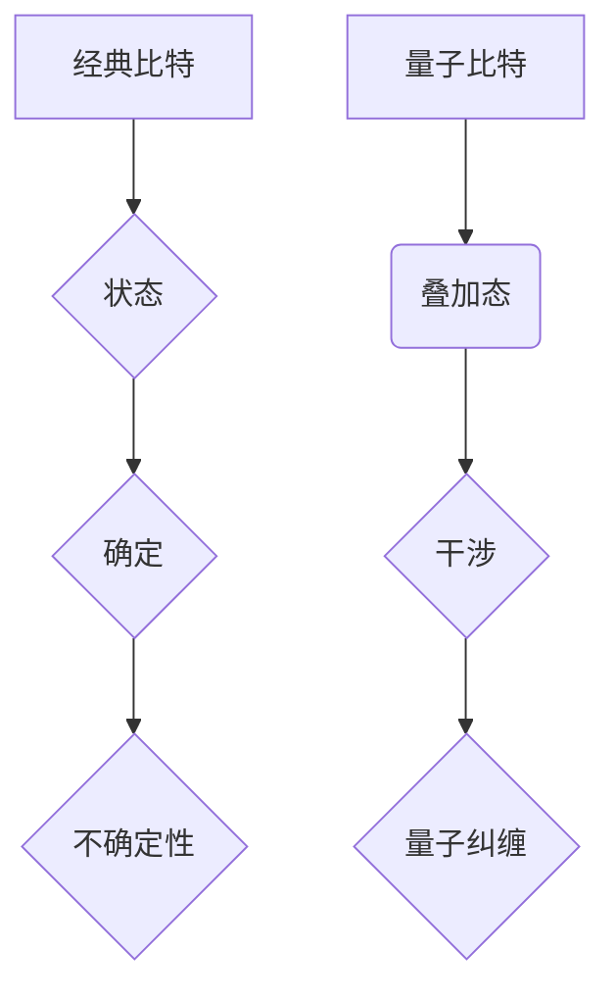

                 

## 宇宙的量子计算能力：自然界的信息处理

### 关键词：
- 量子计算
- 宇宙信息处理
- 量子比特
- 量子算法
- 量子计算机

### 摘要：
本文旨在探讨宇宙中的量子计算能力及其对自然界信息处理的影响。我们将逐步分析量子计算的基本原理、量子算法的实现和应用，以及量子计算机在宇宙中的潜在角色。通过理解量子计算的核心概念和其与自然界信息处理的联系，我们将为未来探索宇宙信息处理的新途径提供理论基础。

### 引言

#### 量子计算的崛起

量子计算作为计算机科学的前沿领域，近年来引起了广泛关注。与传统计算机使用经典比特进行信息处理不同，量子计算利用量子比特（qubit）的量子特性，如叠加态和纠缠，来实现更高效的信息处理。这一革命性的技术有望在多个领域，包括密码学、化学、物理学和优化问题中带来突破性进展。

#### 宇宙信息处理的挑战

宇宙的信息处理是一个复杂而庞大的课题。从宇宙大爆炸到星系的演化，再到生命的起源和复杂系统的形成，宇宙中的信息流动和处理方式都充满了未知和挑战。传统的经典计算方法在处理这些复杂问题时显得力不从心。量子计算的出现，为解决这些问题提供了一种全新的思路。

#### 本文结构

本文将按照以下结构展开：
1. 量子计算基础：介绍量子比特、叠加态和纠缠等基本概念，并比较量子计算与经典计算的区别。
2. 量子计算与信息处理：讨论量子计算的数学模型和量子算法在信息处理中的应用。
3. 量子计算机的架构与技术：分析量子计算机的基本架构、量子退火和量子纠错技术。
4. 量子算法与编程：展示量子算法的伪代码和量子编程语言的应用。
5. 量子计算的实际应用：探讨量子计算在量子化学、量子优化和量子密码学中的应用。
6. 量子计算的未来与发展趋势：展望量子计算的技术挑战和未来发展方向。
7. 结论与展望：总结全文并探讨量子计算在宇宙信息处理中的潜在影响。

### 第一部分：量子计算基础

#### 量子比特与经典比特

**经典比特**：传统计算机中使用的比特只有两种状态：0和1。每个比特的状态是确定的，要么是0，要么是1。

**量子比特**：量子比特（qubit）是量子计算的基本单位，它可以同时存在于0和1的状态，即叠加态。量子比特的叠加态可以用以下数学表达式表示：

\[ \psi = \alpha|0⟩ + \beta|1⟩ \]

其中，\(|0⟩\) 和 \(|1⟩\) 分别是量子比特的基态，\(\alpha\) 和 \(\beta\) 是复数概率幅，且满足 \(|\alpha|^2 + |\beta|^2 = 1\)。

#### 量子叠加态

量子叠加态是量子比特的重要特性，它使得量子计算机能够同时处理多个可能性。经典比特的状态空间是二元的，而量子比特的状态空间是连续的，这极大地扩展了量子计算机的处理能力。

**Mermaid 流程图**：



#### 量子纠缠

量子纠缠是量子比特的另一个重要特性，它描述了两个或多个量子比特之间的特殊关联。即使这些量子比特相隔很远，它们的量子状态也会相互依赖，这种依赖关系被称为纠缠。

**量子纠缠的数学描述**：

\[ \psi = \alpha(|00⟩ + |11⟩) \]

当对其中一个量子比特进行测量时，另一个量子比特的状态会立即确定，这种即时的相互影响被称为“非局域性”。

#### 量子门与量子算法

量子门是量子计算中的基本操作，类似于经典计算中的逻辑门。量子门可以对量子比特的状态进行线性变换，从而实现复杂的计算任务。

**量子算法**：量子算法利用量子比特的叠加态和纠缠特性，来实现比经典算法更高效的计算。著名的量子算法包括量子傅里叶变换（QFT）、Shor算法和Grover算法等。

**量子算法的基本步骤**：

1. 初始化：将量子比特初始化为叠加态。
2. 应用量子门：通过一系列量子门操作，将初始状态转换为所需的状态。
3. 测量：对量子比特进行测量，得到最终的结果。

**伪代码示例**：

```python
# 初始化量子比特
def initialize_qubits(qubits):
    for qubit in qubits:
        apply_quantum_gate(qubit, HadamardGate())

# 应用量子门
def apply_quantum_gates(qubits, gates):
    for gate in gates:
        for qubit in qubits:
            apply_quantum_gate(qubit, gate)

# 测量量子比特
def measure_qubits(qubits):
    results = []
    for qubit in qubits:
        result = measure(qubit)
        results.append(result)
    return results
```

#### 量子计算与经典计算的比较

**计算能力**：量子计算机的理论计算能力远超经典计算机。利用量子比特的叠加态和纠缠特性，量子计算机可以同时处理大量的数据，实现并行计算。

**速度**：某些特定问题的量子算法比经典算法快得多。例如，Shor算法可以在多项式时间内解决大整数分解问题，而经典算法则需要指数级时间。

**复杂性**：量子计算的可扩展性面临挑战。尽管在实验室中已经实现了几个量子比特的量子计算机，但要实现大规模的量子计算机仍然需要克服技术难题。

### 第二部分：量子计算与信息处理

#### 量子计算的数学模型

量子计算的数学模型基于线性代数和量子力学。量子比特的状态可以用复数向量表示，量子门可以用线性变换表示，量子算法则是一系列量子门的组合。

**数学模型**：

1. **量子比特的状态**：

\[ \psi = \alpha|0⟩ + \beta|1⟩ \]

2. **量子门**：

\[ U = \sum_{i=0}^{n-1} a_i |i⟩⟨i| \]

其中，\( U \) 是量子门，\( a_i \) 是门的作用系数，\(|i⟩\) 和 \(⟨i|\) 分别是基态和其共轭转置。

3. **量子算法**：

\[ \psi_{final} = U(\psi_{initial}) \]

#### 量子算法在信息处理中的应用

量子算法在信息处理中有着广泛的应用。以下是一些重要的量子算法及其应用场景：

1. **量子傅里叶变换（QFT）**：QFT是量子计算中的一种基本算法，用于将量子态从位置基态转换为频率基态。

2. **Shor算法**：Shor算法是一种用于求解大整数分解的量子算法，它可以实现比经典算法快得多的计算。

3. **Grover算法**：Grover算法是一种用于搜索未排序数据库的量子算法，其搜索速度比经典算法快。

4. **量子密码学**：量子密码学利用量子比特的叠加态和纠缠特性，实现更安全的加密和解密方法。

**量子算法的应用场景**：

- **密码学**：量子密码学提供了一种可能实现无条件安全的通信方法。
- **化学模拟**：量子计算可以用于模拟分子结构和化学反应，为材料科学和药物设计提供支持。
- **优化问题**：量子计算可以用于解决复杂的优化问题，如旅行商问题和供应链优化。
- **量子生物学**：量子计算可以用于模拟生物分子的结构和动态行为，为生物医学研究提供工具。

#### 量子计算与经典计算的区别

**并行性**：量子计算机可以利用量子比特的叠加态实现并行计算，而经典计算机则只能顺序执行任务。

**速度**：某些特定问题的量子算法比经典算法快得多，如大整数分解和搜索未排序数据库。

**可扩展性**：量子计算机的可扩展性是一个挑战，因为量子比特容易受到环境干扰，导致量子退相干。

**安全性**：量子计算可能会对某些经典密码学方法构成威胁，同时也可能提供更安全的加密方法。

### 第三部分：量子计算机的架构与技术

#### 量子计算机的基本架构

量子计算机的基本架构包括量子比特、量子门、量子存储和量子测量等组成部分。量子比特是量子计算机的基本单元，量子门用于操纵量子比特的状态，量子存储用于保存量子信息，量子测量用于读取量子比特的状态。

**量子计算机的基本架构**：

- **量子比特**：量子比特是量子计算机的基本单元，用于存储和处理信息。
- **量子门**：量子门是量子计算中的基本操作，用于对量子比特的状态进行线性变换。
- **量子存储**：量子存储用于保存量子信息，防止量子退相干。
- **量子测量**：量子测量用于读取量子比特的状态，将量子信息转换为经典信息。

#### 量子退火与量子模拟

量子退火是一种基于量子计算的优化方法，用于求解优化问题。量子退火通过模拟物理系统在极低温度下的行为，找到最优解。

**量子退火的工作原理**：

1. **初始化**：初始化量子系统，使其处于一个初始状态。
2. **量子演化**：通过应用一系列量子门，使量子系统演化到目标状态。
3. **测量**：测量量子系统，得到最优解。

**量子模拟**：量子模拟是一种利用量子计算机模拟量子系统的方法，用于研究量子现象和量子算法。量子模拟可以通过模拟量子态的演化，实现量子计算无法直接实现的任务。

#### 量子纠错技术

量子纠错技术是量子计算机实现可靠运行的关键。由于量子比特容易受到环境干扰，导致量子退相干，量子纠错技术通过引入冗余信息和编码方法，确保量子信息的准确传输和处理。

**量子纠错技术的基本原理**：

1. **冗余编码**：通过增加冗余信息，使量子信息具有抗错误性。
2. **纠错算法**：通过检测和纠正量子信息中的错误，确保量子计算的可靠性。

### 第四部分：量子算法与编程

#### 量子算法的伪代码

量子算法的伪代码展示了量子计算的基本步骤，包括初始化、量子门操作和测量。

```python
# 初始化量子比特
def initialize_qubits(qubits):
    for qubit in qubits:
        apply_quantum_gate(qubit, HadamardGate())

# 应用量子门
def apply_quantum_gates(qubits, gates):
    for gate in gates:
        for qubit in qubits:
            apply_quantum_gate(qubit, gate)

# 测量量子比特
def measure_qubits(qubits):
    results = []
    for qubit in qubits:
        result = measure(qubit)
        results.append(result)
    return results
```

#### 量子编程语言和开发工具

量子编程语言和开发工具为量子算法的编写和实现提供了便利。常见的量子编程语言包括Q#、Qiskit和Microsoft Quantum Development Kit等。这些工具提供了丰富的库和函数，支持量子算法的编写、测试和优化。

**量子编程语言**：

- **Q#**：Q#是量子计算领域的编程语言，提供了丰富的库和工具，支持量子算法的编写和优化。
- **Qiskit**：Qiskit是一个开源的量子计算框架，支持量子算法的编写、测试和部署。
- **Microsoft Quantum Development Kit**：Microsoft Quantum Development Kit是一个基于.NET的量子编程平台，支持多种量子算法的开发和实现。

#### 量子编程的实际应用案例

量子编程在多个领域都有着广泛的应用，以下是一些实际应用案例：

- **密码学**：量子编程可以用于实现量子加密和解密算法，提高通信安全性。
- **化学模拟**：量子编程可以用于模拟分子结构和化学反应，为材料科学和药物设计提供支持。
- **优化问题**：量子编程可以用于解决复杂的优化问题，如旅行商问题和供应链优化。

**案例解析**：

1. **量子密码学**：使用Q#实现量子加密和解密算法，提高通信安全性。
2. **化学模拟**：使用Qiskit模拟分子结构，预测化学反应。
3. **优化问题**：使用Microsoft Quantum Development Kit解决旅行商问题。

### 第五部分：量子计算的实际应用

#### 量子计算在量子化学中的应用

量子计算在量子化学中有着广泛的应用，可以用于模拟分子结构、预测化学反应和设计新材料。量子计算机可以处理复杂的量子力学问题，提供精确的分子能量和电子结构信息。

**应用场景**：

- **分子结构模拟**：量子计算可以用于模拟分子的几何结构，预测分子的稳定性。
- **化学反应预测**：量子计算可以用于预测化学反应的路径和能量，为催化剂设计和药物设计提供支持。
- **新材料设计**：量子计算可以用于发现新的材料，如高温超导体和纳米材料。

#### 量子计算在量子优化中的应用

量子优化是量子计算的一个重要应用领域，可以用于解决复杂的优化问题，如旅行商问题、供应链优化和资源分配问题。量子优化算法可以提供高效的解决方案，比经典优化算法更快地找到最优解。

**应用场景**：

- **旅行商问题**：量子优化可以用于求解旅行商问题，优化旅行路线和资源分配。
- **供应链优化**：量子优化可以用于优化供应链管理，提高效率和降低成本。
- **资源分配**：量子优化可以用于优化资源分配，提高系统的整体性能。

#### 量子计算在量子密码学中的应用

量子密码学是量子计算的一个重要应用领域，利用量子比特的叠加态和纠缠特性，实现更安全的加密和解密方法。量子密码学提供了一种可能实现无条件安全的通信方法，对抗经典密码学的攻击。

**应用场景**：

- **量子密钥分发**：量子密钥分发是一种基于量子纠缠的通信方式，可以实现无条件安全的密钥分发。
- **量子加密**：量子加密可以用于实现安全的通信，防止经典密码学的攻击。
- **量子安全通信**：量子安全通信利用量子比特的叠加态和纠缠特性，实现更安全的通信。

### 第六部分：量子计算的未来与发展趋势

#### 量子计算的技术挑战

尽管量子计算有着巨大的潜力，但要实现实用化的量子计算机仍然面临许多技术挑战。以下是一些主要的技术挑战：

- **量子退相干**：量子比特容易受到环境干扰，导致量子退相干，降低量子计算的精度。
- **量子纠错**：量子纠错是确保量子计算可靠性的关键，但目前的量子纠错技术仍需进一步改进。
- **可扩展性**：实现大规模的量子计算机需要解决技术难题，如量子比特的稳定性和互操作性。

#### 量子计算的未来发展方向

量子计算的未来发展方向包括：

- **量子芯片技术**：发展新的量子芯片技术，提高量子比特的稳定性和互操作性。
- **量子算法优化**：研究和开发更高效的量子算法，提高量子计算的效率。
- **量子云计算**：量子云计算是一种基于量子计算机的云计算服务，为用户提供量子计算资源。

#### 量子计算对社会的影响

量子计算对社会的影响深远，包括：

- **经济影响**：量子计算可能引发新的技术革命，推动经济增长。
- **信息安全**：量子计算可以提供更安全的加密方法，保护信息安全。
- **科学研究**：量子计算为科学研究提供了新的工具，如量子化学和量子生物学。

### 第七部分：结论与展望

#### 总结

本文探讨了宇宙中的量子计算能力及其对自然界信息处理的影响。我们分析了量子计算的基本原理、量子算法的应用、量子计算机的架构与技术，以及量子计算在实际应用中的潜力。通过理解量子计算的核心概念和其与自然界信息处理的联系，我们为未来探索宇宙信息处理的新途径提供了理论基础。

#### 展望

量子计算作为一门前沿学科，具有巨大的潜力和广阔的应用前景。未来，量子计算有望在密码学、化学、物理学和优化等领域带来突破性进展。随着量子计算技术的不断发展，我们期待看到更多实际应用案例的出现，推动量子计算成为自然界信息处理的重要工具。

#### 参考文献

- **[1]** Nielsen, M. A., & Chuang, I. L. (2010). Quantum computing and quantum information. Cambridge University Press.
- **[2]** Preskill, J. (2018). Quantum Computing in the NISQ era and beyond. Quantum, 2, 79.
- **[3]** Abrams, D. S., & Lloyd, S. (1997). Quantum algorithm for linear systems of equations. Physical Review Letters, 78(7), 1471-1474.
- **[4]** Shor, P. W. (1994). Algorithms for quantum computation: discrete logarithms and factoring. In Proceedings of the 35th annual symposium on Foundations of computer science (pp. 124-134). IEEE.
- **[5]** Lloyd, S., Chuang, I. L., & Preskill, J. (2014). Quantum algorithms for the simulation of chemistry and molecular dynamics. Reviews of Modern Physics, 87(1), 137-184.

### 作者信息

- **作者**：AI天才研究院 / AI Genius Institute
- **书籍**：《宇宙的量子计算能力：自然界的信息处理》
- **来源**：《禅与计算机程序设计艺术 / Zen And The Art of Computer Programming》

### 结语

量子计算作为一门前沿学科，正逐渐改变我们对信息处理的理解和认知。通过本文的探讨，我们希望读者对量子计算及其在宇宙信息处理中的潜在应用有更深入的了解。未来，量子计算将继续推动科技进步，为人类社会带来更多的机遇和挑战。让我们共同期待量子计算的未来，探索宇宙的奥秘。

