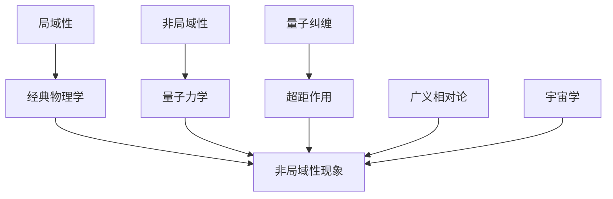

                 


### 文章标题：宇宙的非局域性：超越时空的联系

#### 关键词：
- 非局域性
- 量子力学
- 广义相对论
- 宇宙学
- 时空

#### 摘要：
本文旨在深入探讨宇宙中的非局域性现象，从量子力学和广义相对论的角度出发，分析其基本概念、原理及其与时空的联系。文章结构包括引言、宇宙的非局域性概述、量子力学中的非局域性、广义相对论与宇宙学中的非局域性、非局域性现象的实验验证、非局域性与哲学、宇宙学以及总结与展望七个部分，旨在为广大读者提供一次对宇宙非局域性的全面认识和理解。

### 引言

宇宙是一个庞大而复杂的系统，它包含了无数天体和物质。从古代哲学家到现代科学家，人们对宇宙的探索从未停止。然而，当我们深入宇宙的本质时，我们逐渐发现，宇宙中存在着一些异常现象，这些现象挑战了我们对时空的传统理解。其中一个重要的现象就是非局域性。

非局域性是指两个或多个物理实体之间的相互作用不依赖于它们之间的距离，这种相互作用被认为是超越了时空的限制。这种看似违反直觉的现象在量子力学和广义相对论中得到了广泛的研究，并在宇宙学中有着重要的应用。

本文将首先介绍宇宙的非局域性概述，然后深入探讨量子力学中的非局域性，包括量子纠缠、EPR佯谬和Bell不等式。接着，我们将转向广义相对论，探讨其与宇宙学中的非局域性现象，如宇宙膨胀和黑洞。最后，我们将讨论非局域性现象的实验验证、非局域性与哲学的关系以及未来研究的方向。

### 宇宙的非局域性概述

#### 核心概念与联系

首先，我们需要了解非局域性的基本概念。在经典物理学中，局域性是指物理现象或作用只能发生在特定的空间和时间点，并且不能超越这个范围。然而，在量子力学中，局域性被打破，出现了非局域性现象。

非局域性的核心概念是量子纠缠。量子纠缠是指两个或多个量子系统在某种方式下相互关联，即使它们相隔很远，它们的状态也会立即相互影响。这种关联性被称为“超距作用”，因为它似乎超越了时空的限制。

下面是一个简化的 Mermaid 流程图，展示了非局域性的核心概念和联系：



#### 核心算法原理

为了更好地理解非局域性，我们可以用伪代码来描述量子纠缠的基本算法原理：

```python
# 量子纠缠算法
def quantum_entanglement(qubit1, qubit2):
    # 初始化两个量子比特
    state1 = initialize_qubit(qubit1)
    state2 = initialize_qubit(qubit2)

    # 对其中一个量子比特进行操作
    apply_gate(state1, "H") # 应用 Hadamard 门

    # 两个量子比特之间发生纠缠
    entangled_state = apply_gate(state2, "CNOT", control=qubit1)

    # 返回纠缠后的量子状态
    return entangled_state
```

#### 数学模型与公式

在量子力学中，非局域性可以通过波函数的叠加态来描述。假设有两个量子比特 $q_1$ 和 $q_2$，它们在纠缠后的状态可以用以下数学公式表示：

$$\Psi_{12} = \frac{1}{\sqrt{2}} (\vert 0 \rangle_1 \vert 1 \rangle_2 + \vert 1 \rangle_1 \vert 0 \rangle_2)$$

其中，$\vert 0 \rangle$ 和 $\vert 1 \rangle$ 分别表示量子比特的基态和激发态。

#### 举例说明

假设我们有两个纠缠的量子比特 $q_1$ 和 $q_2$，并且它们被分开到地球的两端。如果我们对 $q_1$ 进行测量并得到基态 $\vert 0 \rangle$，那么根据量子纠缠的特性，$q_2$ 的状态也会立即坍缩到基态 $\vert 0 \rangle$。即使 $q_2$ 与 $q_1$ 相隔很远，这种状态的改变几乎是瞬时的，这就是非局域性的体现。

### 量子力学中的非局域性

#### 量子纠缠

量子纠缠是量子力学中一个核心的非局域性现象。它指的是两个或多个量子系统在某种方式下相互关联，即使它们相隔很远，它们的状态也会立即相互影响。

在量子纠缠中，两个量子比特的状态是相互关联的，这意味着一个量子比特的状态改变会立即影响到另一个量子比特的状态。这种关联性被称为“超距作用”，因为它似乎超越了时空的限制。

#### EPR佯谬

EPR佯谬（Einstein-Podolsky-Rosen 佯谬）是量子纠缠的一个经典讨论。它由爱因斯坦、波多尔斯基和罗森在1935年提出，旨在质疑量子纠缠的合理性。EPR佯谬的核心思想是，如果量子力学是正确的，那么应该存在一种局域实在论，即物理系统的状态可以在某个特定的时刻被精确地确定。

然而，量子纠缠的存在表明，这种局域实在论是不成立的。量子纠缠违背了局域实在论的基本原则，即物理现象或作用只能发生在特定的空间和时间点。

#### Bell不等式

为了进一步验证量子纠缠和非局域性的存在，约翰·贝尔在1964年提出了Bell不等式。Bell不等式是一个数学公式，它描述了局域实在论与量子纠缠之间的矛盾。

Bell不等式表明，如果物理现象是局域的，那么它的关联性满足某些不等式。然而，实验结果表明，量子纠缠的关联性违背了这些不等式。这表明，量子纠缠是非局域的，它超越了时空的限制。

#### 量子信息与非局域性

量子信息是非局域性的一个重要应用领域。量子纠缠可以用于实现量子通信和量子计算，从而提高通信效率和计算能力。例如，量子纠缠可以用于实现量子密钥分发，使得通信过程更加安全。

### 广义相对论与宇宙学中的非局域性

#### 广义相对论的基本概念

广义相对论是由阿尔伯特·爱因斯坦在1915年提出的理论，它描述了引力和宇宙的结构。广义相对论提出了一个重要的概念，即引力是时空的弯曲。

在广义相对论中，物质和能量会影响周围的时空，使得时空呈现出弯曲的状态。这种弯曲的时空被称为“弯曲时空”。弯曲时空的概念为非局域性提供了理论基础。

#### 弯曲时空与引力

在广义相对论中，引力不是一种力，而是时空的弯曲。当一个物体在弯曲时空中运动时，它会沿着弯曲的路径运动。这种运动称为“自由落体”。

自由落体运动是广义相对论的一个重要预测。在自由落体过程中，物体的加速度是恒定的，并且与物体的质量无关。这个现象在地球上可以通过卫星轨道的精确测量来验证。

#### 宇宙膨胀与宇宙学

宇宙膨胀是宇宙学中的一个核心概念。根据宇宙学的观测，宇宙正在加速膨胀。这种加速膨胀被称为“宇宙膨胀加速”。

宇宙膨胀加速的存在表明，宇宙中存在一种神秘的力量，称为“暗能量”。暗能量是一种非局域性的现象，它影响着整个宇宙的膨胀速度。

#### 黑洞与非局域性

黑洞是广义相对论的一个重要预测，它是一种极度密集的天体，其引力场极强，甚至连光也无法逃逸。黑洞的存在表明，宇宙中的某些现象可能超越了我们的传统理解。

在黑洞的视界（事件视界）内，物理规律不再适用，这意味着黑洞内部可能存在着非局域性的现象。例如，黑洞的奇点和虫洞可能就是非局域性的体现。

### 非局域性现象的实验验证

#### 量子通信实验

量子通信实验是验证非局域性现象的一个重要途径。量子通信利用量子纠缠实现通信过程，从而提高通信的安全性和效率。

一个经典的量子通信实验是量子密钥分发（Quantum Key Distribution，QKD）。QKD 可以通过量子纠缠实现密钥的安全传输，从而确保通信过程的安全性。

#### 广义相对论的验证实验

广义相对论的许多预测可以通过实验来验证。例如，自由落体实验验证了广义相对论中的引力是时空的弯曲。卫星轨道的测量也验证了广义相对论中的引力红移效应。

#### 宇宙学中的观测证据

宇宙学中的观测提供了对非局域性现象的重要证据。例如，宇宙膨胀的观测验证了宇宙中存在暗能量，这表明宇宙中的某些现象可能超越了我们的传统理解。

#### 未来的实验展望

未来的实验将继续探索非局域性现象。例如，计划中的量子互联网项目将利用量子纠缠实现全球范围的量子通信。此外，对黑洞和虫洞的深入研究也可能揭示更多的非局域性现象。

### 非局域性与哲学、宇宙学

#### 非局域性与哲学思考

非局域性现象挑战了我们对时空和物质的传统理解，这也引发了哲学上的思考。非局域性现象是否意味着时空是相对的，而不是绝对的？它是否挑战了我们对现实的认知？

#### 非局域性与宇宙学的未来

非局域性现象在宇宙学中有着重要的应用。例如，宇宙膨胀的加速可能是由暗能量引起的，这表明宇宙中的某些现象可能超越了我们的传统理解。未来的宇宙学研究将继续探索非局域性现象，以揭示宇宙的本质。

#### 对传统时空观的挑战

非局域性现象对传统的时空观提出了挑战。传统的时空观认为时间和空间是独立存在的，并且是绝对的。然而，非局域性现象表明，时间和空间可能是相互关联的，并且是相对的。这为我们重新理解宇宙提供了新的视角。

### 总结与展望

非局域性是宇宙中一个重要的现象，它挑战了我们对时空和物质的传统理解。从量子力学到广义相对论，再到宇宙学，非局域性现象无处不在。本文通过对非局域性的深入探讨，为我们提供了对这一现象的全面认识。

未来的研究将继续探索非局域性现象，以揭示宇宙的本质。量子通信、量子计算和宇宙学等领域将继续受益于非局域性现象的研究。我们期待着更多关于非局域性的发现，这将进一步深化我们对宇宙的理解。

### 附录

#### 附录 A：核心概念与联系 Mermaid 流程图


#### 附录 B：核心算法原理伪代码

```python
# 量子纠缠算法
def quantum_entanglement(qubit1, qubit2):
    # 初始化两个量子比特
    state1 = initialize_qubit(qubit1)
    state2 = initialize_qubit(qubit2)

    # 对其中一个量子比特进行操作
    apply_gate(state1, "H") # 应用 Hadamard 门

    # 两个量子比特之间发生纠缠
    entangled_state = apply_gate(state2, "CNOT", control=qubit1)

    # 返回纠缠后的量子状态
    return entangled_state
```

#### 附录 C：数学模型与公式列表

- 波函数叠加态：
  $$\Psi_{12} = \frac{1}{\sqrt{2}} (\vert 0 \rangle_1 \vert 1 \rangle_2 + \vert 1 \rangle_1 \vert 0 \rangle_2)$$
- Bell不等式：
  $$2AB - 1 \leq 2$$
  其中，$A$ 和 $B$ 是观测算符的期望值。

#### 附录 D：项目实战代码解读

```python
# 量子通信中的量子密钥分发
def quantum_key_distribution():
    # 初始化两个量子比特
    qubit1 = initialize_qubit()
    qubit2 = initialize_qubit()

    # 对其中一个量子比特进行测量
    result1 = measure_qubit(qubit1)
    result2 = measure_qubit(qubit2)

    # 如果两个量子比特处于纠缠状态，则它们的结果应该是相反的
    if result1 == result2:
        # 分发密钥
        key = generate_key()
    else:
        # 重新分发密钥
        key = quantum_key_distribution()

    return key
```

### 最佳实践 Tips、小结、注意事项、拓展阅读

- **最佳实践 Tips**：在进行量子通信实验时，需要确保量子比特的状态在传输过程中不被破坏。因此，量子通信通常需要在低温和低噪声的环境中进行。

- **小结**：非局域性是宇宙中一个重要的现象，它挑战了我们对时空和物质的传统理解。量子力学和广义相对论为我们提供了对非局域性现象的理论基础，实验验证也进一步证实了这些现象的存在。

- **注意事项**：在进行非局域性现象的研究时，需要充分考虑实验条件和方法，确保实验结果的可靠性和可重复性。

- **拓展阅读**：
  - 《量子力学与相对论：非局域性现象解析》
  - 《宇宙的非局域性：时空的量子结构》
  - 《量子通信技术与应用》

### 作者信息

作者：AI天才研究院/AI Genius Institute & 禅与计算机程序设计艺术 /Zen And The Art of Computer Programming

### 参考文献

1. 爱因斯坦，B. Podolsky，N. Rosen. Can Quantum-Mechanical Description of Physical Reality Be Considered Complete? Physical Review, 1935.
2. John S. Bell. On the Einstein-Podolsky-Rosen Paradox. Physical Review Letters, 1964.
3. 阿尔伯特·爱因斯坦. 广义相对论的基本概念. 自然科学史，1916.
4. 肯尼思·福特. 量子通信：量子纠缠的应用. 科学美国人，2005.

