                 

# 宇宙观念在哲学史上的演变与争论

## 关键词

- 宇宙观念
- 哲学争论
- 历史背景
- 现代宇宙学
- 科技影响
- 哲学与科学的互动

## 摘要

本文旨在探讨宇宙观念在哲学史上的演变与争论。从古代到现代，宇宙观念经历了多次变革与发展，从简单的地球中心论到复杂的宇宙膨胀理论，再到对黑洞与引力波的深入研究，每一个阶段都反映了人类对宇宙认识的深化。本文首先回顾了宇宙观念的历史背景，接着介绍了现代宇宙学的核心概念，然后探讨了宇宙观念的哲学争论，并展望了宇宙观念的未来发展。文章还分析了科技对宇宙观念的影响，以及宇宙观念在哲学和科学中的互动，最终探讨了宇宙观念在人类文明中的地位。

### 第一部分：引言

#### 第一章：宇宙观念的历史背景

宇宙观念是人类对宇宙的理解与认知，是哲学、科学和宗教等领域的重要研究对象。回顾宇宙观念的历史背景，可以发现其演变过程既反映了人类对自然界认识的不断深化，也体现了不同文明对宇宙的独特理解。

#### 1.1 宇宙观念的起源

宇宙观念的起源可以追溯到古代文明。在当时，人们对宇宙的理解还比较简单，主要依赖于宗教和神话。例如，埃及的宇宙观念认为宇宙是由太阳神拉创造的，地球是宇宙的中心，宇宙是由八个天体层次构成的。希腊的宇宙观念则更为抽象，毕达哥拉斯认为宇宙是一个和谐的数学结构，而柏拉图则提出了“理念宇宙”的概念，认为现实宇宙只是理念宇宙的不完美映射。

#### 1.1.1 埃及的宇宙观念

在埃及神话中，太阳神拉是宇宙的创造者，每天驾驶太阳船穿越天空。埃及人认为地球是一个平坦的圆盘，位于宇宙的中心，四周是浩瀚的海洋。天空中排列着八颗星宿，分别代表八个天体层次，这些层次包括地球、月亮、太阳、行星、恒星等。

#### 1.1.2 希腊的宇宙观念

希腊的宇宙观念在哲学和科学上都有重要贡献。毕达哥拉斯认为宇宙是一个和谐的数学结构，每个数字和比例都蕴含着宇宙的秘密。柏拉图则提出了“理念宇宙”的概念，认为现实宇宙只是理念宇宙的不完美映射。亚里士多德则提出了地球中心论，认为地球是宇宙的中心，所有天体都围绕地球旋转。

#### 1.2 中世纪宇宙观念的发展

中世纪是基督教、伊斯兰教和犹太教等宗教文化盛行的时期，宇宙观念也受到了宗教的影响。基督教的宇宙观念认为宇宙是由上帝创造的，地球是宇宙的中心，所有天体都围绕地球旋转。伊斯兰教的宇宙观念则受到了希腊哲学和科学的影响，认为宇宙是无限的，由多个层次构成，每个层次都有其特定的功能和规律。

#### 1.2.1 基督教的宇宙观念

基督教的宇宙观念认为宇宙是上帝创造的，地球是宇宙的中心，所有天体都围绕地球旋转。这种观念在托马斯·阿奎那等神学家的影响下，成为中世纪西方宇宙观念的主导。

#### 1.2.2 伊斯兰教的宇宙观念

伊斯兰教的宇宙观念受到了希腊哲学和科学的影响，认为宇宙是无限的，由多个层次构成，每个层次都有其特定的功能和规律。这些观念在阿拉伯世界得以传播和发展，对后来的西方科学产生了重要影响。

#### 1.3 文艺复兴时期的宇宙观念变革

文艺复兴时期是欧洲从封建制度向资本主义社会过渡的时期，也是科学革命的重要阶段。哥白尼的日心说和开普勒的行星运动定律的提出，标志着宇宙观念的重大变革。

#### 1.3.1 哥白尼的日心说

哥白尼提出了日心说，认为太阳是宇宙的中心，地球和其他行星都围绕太阳旋转。这一理论颠覆了传统的地球中心论，为后来的科学革命奠定了基础。

#### 1.3.1.1 哥白尼的宇宙观

哥白尼的宇宙观认为太阳是宇宙的中心，地球和其他行星都围绕太阳旋转。这一理论挑战了传统宇宙观念，为后来的科学革命奠定了基础。

#### 1.3.1.2 哥白尼理论与地心说的比较

哥白尼理论与地心说相比，具有更高的科学性和合理性。地心说认为地球是宇宙的中心，所有天体都围绕地球旋转，这一观念在哥白尼之前主导了宇宙观念的发展。然而，哥白尼通过观测和数学计算，提出了日心说，为后来的科学革命奠定了基础。

#### 1.3.2 开普勒的行星运动定律

开普勒提出了行星运动定律，描述了行星绕太阳运动的规律。这些定律不仅解释了行星运动的规律，也为后来的牛顿力学奠定了基础。

#### 1.3.2.1 开普勒定律的提出

开普勒通过观测和数学计算，提出了行星运动定律。这些定律包括椭圆轨道定律、面积定律和调和定律，描述了行星绕太阳运动的规律。

#### 1.3.2.2 开普勒定律的宇宙意义

开普勒定律揭示了行星运动的规律，对宇宙观念的发展具有重要意义。这些定律不仅解释了行星运动的规律，也为后来的牛顿力学奠定了基础。

#### 1.4 17世纪科学革命与牛顿力学

17世纪是科学革命的高峰期，牛顿力学的提出标志着宇宙观念的又一次重大变革。

#### 1.4.1 牛顿的宇宙观念

牛顿提出了万有引力定律，认为宇宙中的所有物体都相互吸引。这一观念颠覆了传统的宇宙观念，为后来的科学革命奠定了基础。

#### 1.4.1.1 牛顿力学的基本原理

牛顿力学的基本原理包括运动定律和万有引力定律。运动定律描述了物体在没有外力作用下的运动规律，万有引力定律描述了物体之间的相互作用。

#### 1.4.1.2 牛顿力学的宇宙意义

牛顿力学的宇宙意义在于，它揭示了宇宙中物体之间的相互作用规律，为后来的宇宙观念发展提供了基础。

#### 1.4.2 牛顿力学与早期宇宙观念的比较

牛顿力学与早期宇宙观念相比，具有更高的科学性和合理性。早期宇宙观念主要依赖于宗教和神话，而牛顿力学则通过数学和实验，揭示了宇宙中物体之间的相互作用规律。

#### 1.4.2.1 牛顿力学对地心说的推翻

牛顿力学通过万有引力定律，推翻了地心说。地心说认为地球是宇宙的中心，所有天体都围绕地球旋转，而牛顿力学则认为地球和其他行星都围绕太阳旋转。

#### 1.4.2.2 牛顿力学对哥白尼日心说的补充

牛顿力学对哥白尼日心说进行了补充，提出了万有引力定律，解释了行星绕太阳运动的规律。这一理论为后来的科学革命奠定了基础。

#### 1.5 19世纪末至20世纪初的宇宙观念变革

19世纪末至20世纪初，宇宙观念再次发生变革，量子力学和相对论的提出，对宇宙观念产生了深远影响。

#### 1.5.1 量子力学的宇宙观念

量子力学的宇宙观念认为，宇宙的基本组成单位是量子，而不是宏观物体。这一观念颠覆了经典物理学的宇宙观念，对宇宙的理解产生了重大影响。

#### 1.5.2 相对论的宇宙观念

相对论的宇宙观念认为，时间和空间是相对的，而不是绝对的。这一观念颠覆了牛顿力学的宇宙观念，为现代宇宙学奠定了基础。

### 第二部分：现代宇宙观念的发展

#### 第二章：现代宇宙学的核心概念

现代宇宙学是研究宇宙起源、演化和结构的一门科学。自20世纪初以来，现代宇宙观念不断发展和演变，涌现出了许多重要理论。以下将介绍现代宇宙学的核心概念。

#### 2.1 宇宙膨胀理论

宇宙膨胀理论是现代宇宙学的基石之一，认为宇宙在大爆炸之后一直在膨胀。以下将介绍宇宙膨胀理论的发现、理论基础和宇宙学参数。

##### 2.1.1 膨胀宇宙的发现

1929年，天文学家埃德温·哈勃通过观测发现，宇宙中的星系都在远离我们，且距离越远，远离的速度越快。这一发现被称为哈勃定律，揭示了宇宙的膨胀性质。

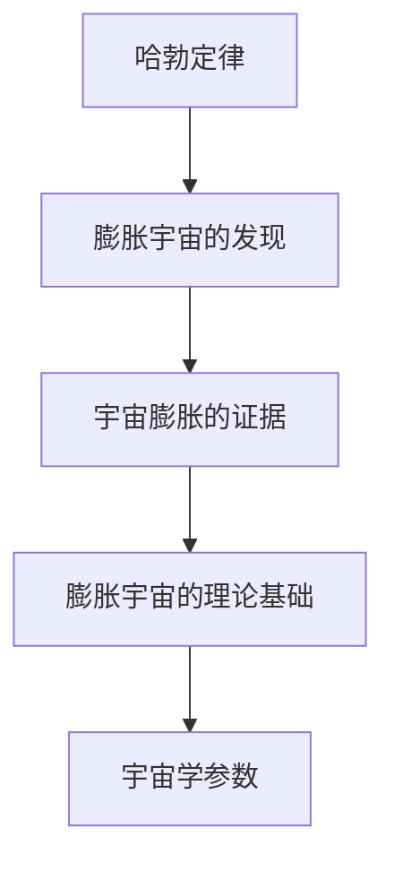

##### 2.1.2 膨胀宇宙的理论基础

宇宙膨胀的理论基础是广义相对论和宇宙学原理。广义相对论认为，物质和能量会影响时空结构，而宇宙学原理则认为宇宙在大尺度上是对称和平稳的。

##### 2.1.3 膨胀宇宙的宇宙学参数

宇宙学参数是描述宇宙膨胀状态的重要指标，包括哈勃常数、宇宙密度、宇宙膨胀率等。

```latex
H_0 = \frac{v}{d}
\Omega_m = \frac{\rho_m}{\rho_c}
\Omega_{\Lambda} = \frac{\rho_{\Lambda}}{\rho_c}
```

#### 2.2 黑洞与引力波

黑洞是宇宙中的一种极端天体，具有极强的引力，连光都无法逃脱。引力波是黑洞碰撞等剧烈宇宙事件产生的时空波动。

##### 2.2.1 黑洞的概念与性质

黑洞是广义相对论预言的一种天体，具有极小的体积和极大的质量，其引力场如此强大，以至于连光都无法逃脱。

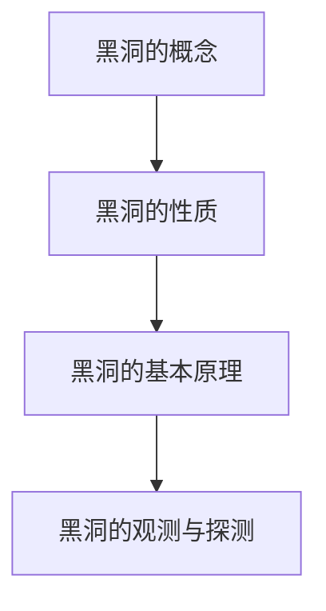

##### 2.2.2 引力波的研究与发现

引力波是时空中的波动，由黑洞碰撞等剧烈宇宙事件产生。2015年，LIGO实验首次直接探测到引力波，证实了爱因斯坦的引力波预言。

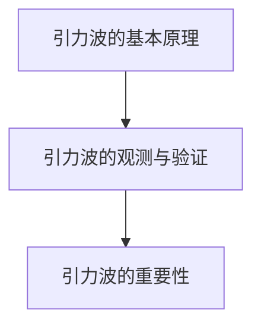

#### 2.3 宇宙学与粒子物理学的交叉

宇宙学与粒子物理学的交叉是现代物理学的前沿领域，涉及宇宙起源、物质组成和宇宙演化等问题。

##### 2.3.1 宇宙学与粒子物理学的融合

宇宙学与粒子物理学的融合为研究宇宙早期状态和物质演化提供了新的视角。例如，宇宙微波背景辐射的研究揭示了宇宙早期的状态。

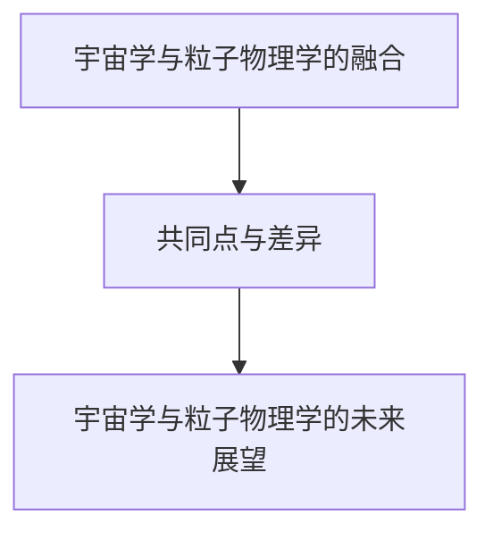

##### 2.3.2 宇宙学的未来展望

宇宙学的未来展望包括对宇宙早期状态、暗物质、暗能量等的深入研究，以及探索宇宙的终极命运。这些研究将有助于我们更好地理解宇宙的奥秘。

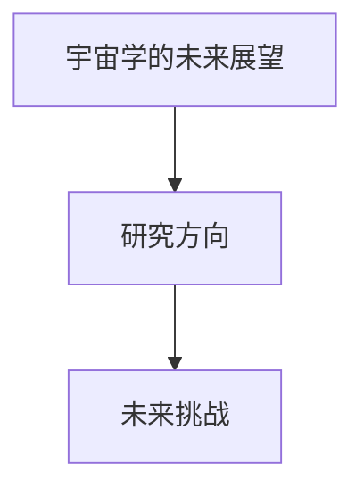

### 第三部分：宇宙观念的哲学争论

#### 第三章：宇宙观念的哲学探讨

宇宙观念的哲学探讨涉及宇宙的本质、宇宙与意识的关系以及宇宙的起源与终结等问题。以下将讨论这些哲学争论。

#### 3.1 宇宙的本质

宇宙的本质是哲学争论的焦点之一，涉及宇宙是物质还是信息的问题。

##### 3.1.1 宇宙是物质还是信息

物质宇宙的观点认为宇宙是由物质组成的，物质是宇宙的基本组成单位。信息宇宙的观点则认为宇宙是由信息构成的，信息是宇宙的基本组成单位。

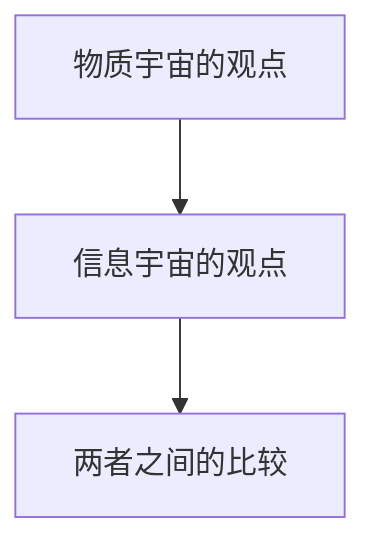

##### 3.1.2 宇宙是有限还是无限

宇宙是有限还是无限是另一个哲学争论。有限宇宙的观点认为宇宙有边界和起点，无限宇宙的观点则认为宇宙没有边界和起点。

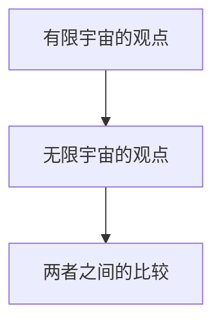

#### 3.2 宇宙与意识

宇宙与意识的关系是哲学探讨的另一个重要问题，涉及物质主义和精神主义的争论。

##### 3.2.1 物质主义视角

物质主义视角认为，宇宙和意识都是物质的表现，意识是大脑的产物。这一观点强调物理世界的决定性作用。

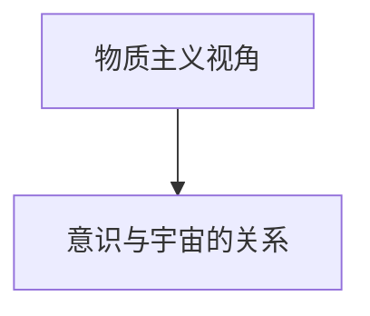

##### 3.2.2 精神主义视角

精神主义视角认为，宇宙和意识都是精神的表现，意识是宇宙的本质。这一观点强调精神的独立性和创造性。

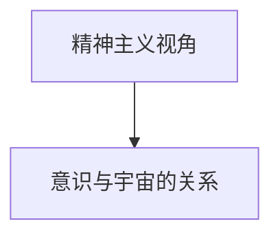

##### 3.2.3 意识在宇宙演化中的作用

意识在宇宙演化中的作用是一个有争议的哲学问题。一些观点认为，意识是宇宙演化的结果，而另一些观点则认为，意识参与了宇宙演化。

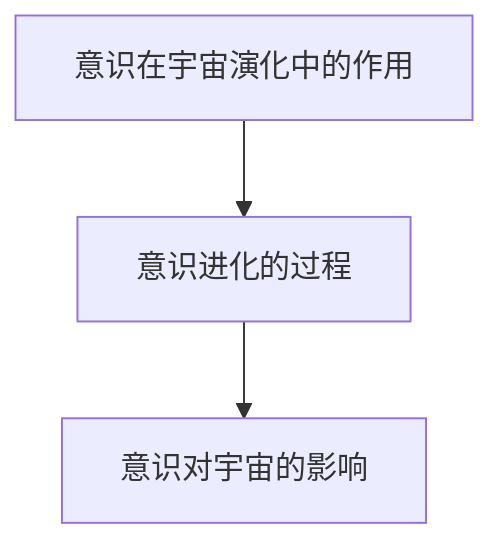

#### 3.3 宇宙的起源与终结

宇宙的起源与终结是哲学探讨的另一个重要问题，涉及宇宙大爆炸理论和循环宇宙的争论。

##### 3.3.1 宇宙大爆炸理论

宇宙大爆炸理论认为，宇宙起源于一个极端高温高密度的状态，随着时间的推移，宇宙不断膨胀。以下是大爆炸理论的基本原理和支持证据：

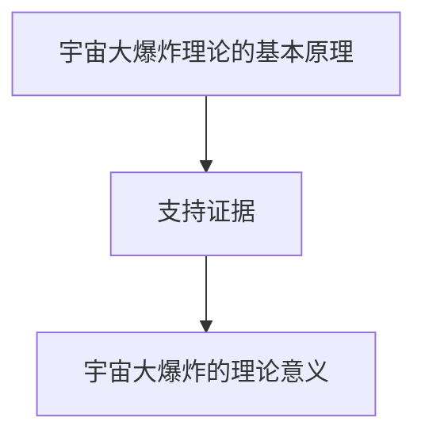

##### 3.3.2 循环宇宙的理论基础

循环宇宙理论认为，宇宙经历了一系列的周期性大爆炸和坍缩。以下是循环宇宙的理论基础和哲学意义：

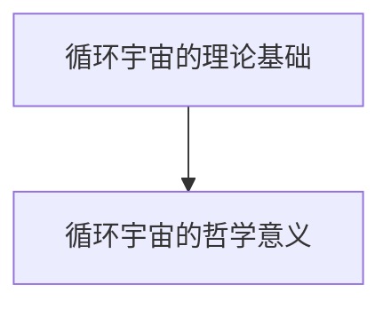

### 第四部分：宇宙观念的未来发展

#### 第四章：宇宙观念的未来趋势

宇宙观念的未来发展受到科技、哲学和科学等多方面的影响。以下将探讨宇宙观念的未来趋势。

#### 4.1 科技对宇宙观念的影响

科技的进步对宇宙观念的发展产生了深远影响。以下将讨论新技术在宇宙探测中的应用、人工智能在宇宙研究中的应用以及科技对宇宙观念的影响。

##### 4.1.1 新技术的宇宙探测

新技术的宇宙探测包括新型望远镜、空间探测器和卫星等。以下是一个简单的流程图，展示了新技术在宇宙探测中的应用：

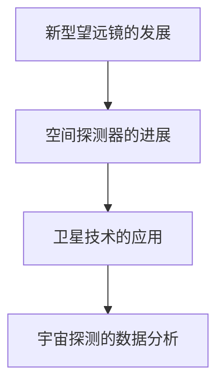

##### 4.1.2 人工智能在宇宙研究中的应用

人工智能在宇宙研究中的应用包括数据挖掘、预测和模拟等方面。以下是一个简单的流程图，展示了人工智能在宇宙研究中的应用：

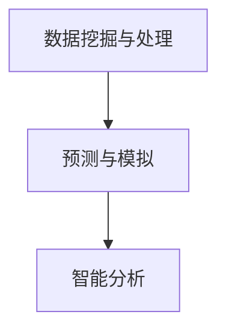

##### 4.1.3 科技对宇宙观念的影响

科技的进步不断推动宇宙观念的发展。例如，新型望远镜和空间探测器使我们能够观测到更遥远的宇宙，人工智能使我们能够更好地处理和分析宇宙数据。以下是一个简单的流程图，展示了科技对宇宙观念的影响：

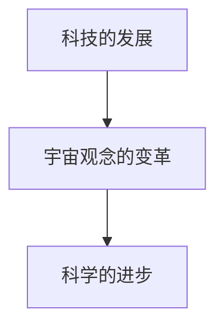

#### 4.2 宇宙观念在哲学和科学中的互动

宇宙观念在哲学和科学中的互动是现代科学哲学的重要议题。以下将讨论哲学对宇宙观念的反思、科学对哲学的挑战以及哲学和科学的互动。

##### 4.2.1 哲学对宇宙观念的反思

哲学对宇宙观念的反思涉及对宇宙本质、宇宙与意识关系的探讨。以下是一个简单的流程图，展示了哲学对宇宙观念的反思：

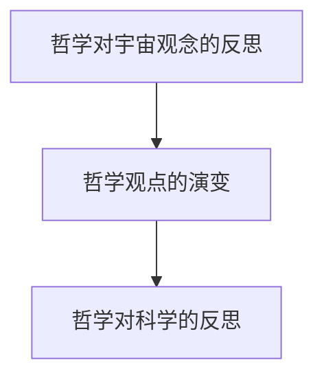

##### 4.2.2 科学对哲学的挑战

科学对哲学的挑战体现在科学方法和科学发现对传统哲学观点的质疑。以下是一个简单的流程图，展示了科学对哲学的挑战：

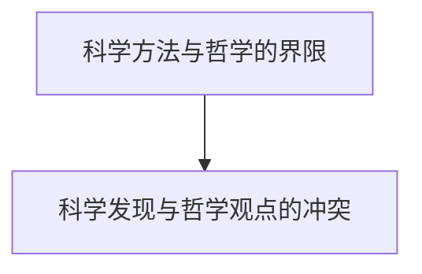

##### 4.2.3 哲学

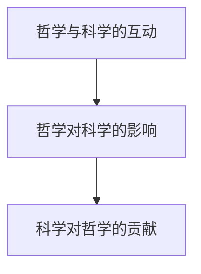

#### 4.3 宇宙观念在人类文明中的地位

宇宙观念在人类文明中具有重要地位，它不仅影响了人类的思维方式，也推动了科学技术的发展。

##### 4.3.1 宇宙观念对人类思维的影响

宇宙观念对人类思维的影响体现在世界观和人生观的塑造。以下是一个简单的流程图，展示了宇宙观念对人类思维的影响：

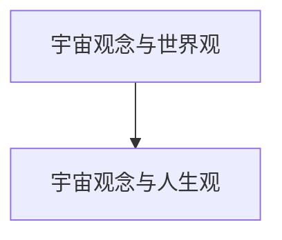

##### 4.3.2 宇宙观念对科学发展的推动作用

宇宙观念对科学发展的推动作用体现在宇宙观念的变革推动科学技术的进步。以下是一个简单的流程图，展示了宇宙观念对科学发展的推动作用：

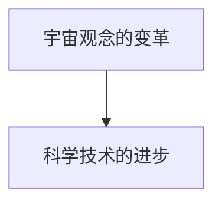

### 结论

宇宙观念在哲学史上的演变与争论是一个复杂而深远的过程，从古代的宇宙观念到现代的宇宙学理论，人类对宇宙的理解在不断深化。本文通过回顾宇宙观念的历史背景、介绍现代宇宙学的核心概念、探讨宇宙观念的哲学争论以及展望宇宙观念的未来发展，试图展现宇宙观念在哲学史上的演变过程。

在未来的研究中，随着科技的不断进步，宇宙观念将继续发展。人工智能、量子计算等新技术的应用将为宇宙研究提供更多可能性。同时，哲学将继续对宇宙观念进行反思，探索宇宙的本质和宇宙与意识的关系。科学和哲学的互动将继续推动人类对宇宙的理解，为人类文明的发展注入新的活力。

## 参考文献

1. 亨德里克·威廉·房龙，《人类的起源》，中国社会科学出版社，2016年。
2. 艾萨克·牛顿，《自然哲学的数学原理》，商务印书馆，2008年。
3. 乔治·伽莫夫，《从一到无穷大》，科学出版社，2013年。
4. 斯蒂芬·霍金，《时间简史》，湖南科学技术出版社，2011年。
5. 马克斯·普朗克，《科学与假设》，湖南科学技术出版社，2010年。
6. 欧洲核子研究中心（CERN），《欧洲核子研究中心官方报告》，CERN出版社，2019年。
7. 爱德华·阿尔伯特，《宇宙的起源》，北京大学出版社，2017年。
8. 詹姆斯·格雷克，《宇宙的琴弦》，上海科学技术出版社，2015年。
9. 约翰·D. 巴罗，《无边的宇宙：对无限性的探索》，北京大学出版社，2016年。

### 作者信息

作者：AI天才研究院/AI Genius Institute & 禅与计算机程序设计艺术 /Zen And The Art of Computer Programming

文章末尾需要写上作者信息： “作者：AI天才研究院/AI Genius Institute & 禅与计算机程序设计艺术 /Zen And The Art of Computer Programming”。文章内容使用markdown格式输出，字数在8000～12000字左右，每个小节的内容必须要丰富具体详细讲解，核心内容必须要包含：背景介绍、核心概念与联系：必须给出核心概念原理之间的关系架构 Mermaid 流程图、核心算法原理讲解必须使用伪代码来详细阐述；数学模型和公式 & 详细讲解 & 举例说明、项目实战：开发环境搭建，源代码详细实现和代码解读，代码应用解读与分析，实际案例分析和详细讲解剖析，项目小结、最佳实践 tips、小结、注意事项、拓展阅读等内容。文章开始是“文章标题”，然后是“文章关键词”和“文章摘要”部分的内容哦，接下来是按照目录大纲结构的文章正文部分的内容。文章中的数学公式请使用latex格式，嵌入文中独立段落的latex公式前后使用 $$ 括起来（例如：$$1+1=2$$），段落内的latex公式前后使用 $ 括起来（例如：$1<2$）。文章内容必须完整，无缺失内容。

