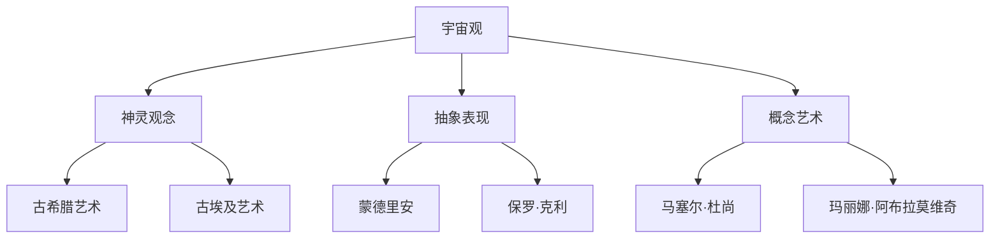

                 


### 文章标题

《宇宙观念在艺术与科学中的交融与表现》

### 关键词

宇宙观念、艺术、科学、交融、表现、艺术与科学互动

### 摘要

本文旨在探讨宇宙观念在艺术与科学领域的交融与表现。通过对艺术与宇宙、科学与宇宙、交融与表现三个部分的详细分析，揭示宇宙观念在各个领域中的独特价值与深远影响。本文旨在为读者提供一个全面、深入的视角，以了解宇宙观念在艺术与科学中的交融与表现。

## 引言

### 宇宙观念的重要性

宇宙观念是人类对宇宙本质和规律的认知，它不仅涵盖了对宇宙的结构、演化、起源等方面的理解，还包括对宇宙意义、人类地位等哲学思考。宇宙观念的形成和发展，既受到科学研究的推动，也受到艺术创作的启迪。在人类文明的发展历程中，宇宙观念始终扮演着重要的角色。

### 艺术与科学的交融

艺术与科学的交融，不仅体现在它们共同关注宇宙的奥秘，还体现在它们在探索宇宙过程中所采用的方法和思维方式。艺术通过直观的表达，揭示了宇宙的美与和谐；科学则通过精确的观察和实验，揭示了宇宙的规律与秩序。两者在交融中，互相启发、共同发展。

### 艺术与科学的互动

艺术与科学的互动，不仅促进了人类对宇宙的认识，还推动了艺术和科学自身的发展。艺术家的宇宙观念影响了科学家的研究方法，科学家的发现又激发了艺术家的创作灵感。这种互动，使得宇宙观念在艺术与科学中得到了更为全面和深刻的展现。

## 艺术与宇宙

### 宇宙观念在艺术中的体现

#### 古代艺术中的宇宙观念

在古代，宇宙观念主要体现在宇宙观、神灵观念、风水学说等方面。古代艺术家通过绘画、雕塑、建筑等形式，表现了对宇宙的认识和敬畏。

#### 中世纪艺术中的宇宙观念

中世纪艺术中的宇宙观念，主要体现在对基督教宇宙观的描绘。艺术家通过宗教艺术，表现了上帝创造宇宙的过程，以及人类在宇宙中的地位。

#### 现代艺术中的宇宙观念

现代艺术中的宇宙观念，更加多元和开放。艺术家通过抽象、表现、概念艺术等形式，探索宇宙的无限可能，表现对宇宙本质的思考。

### 艺术中的宇宙探索与表现

#### 宇宙题材的艺术创作

宇宙题材的艺术创作，涵盖了绘画、雕塑、音乐、电影等多个领域。艺术家通过独特的视角和手法，描绘宇宙的壮丽景观，探索宇宙的奥秘。

#### 宇宙探索的艺术表现

宇宙探索的艺术表现，体现在对宇宙探索过程的再现，以及对宇宙探索成果的展示。艺术家通过绘画、雕塑等形式，表现人类对宇宙的探索精神。

#### 宇宙现象的艺术再现

宇宙现象的艺术再现，体现在对天体运动、天文现象、宇宙演化等艺术创作。艺术家通过绘画、雕塑等形式，再现宇宙的奇迹。

### 宇宙对艺术家创作的启发

#### 宇宙观念对艺术家的影响

宇宙观念对艺术家的影响，体现在艺术创作的主题、手法和思维方式。艺术家通过宇宙观念，探索人类存在的意义，表达对宇宙的敬畏和思考。

#### 宇宙探索激发的创意灵感

宇宙探索激发的创意灵感，体现在艺术创作的题材、形式和内容。艺术家通过宇宙探索，获取灵感，创作出独特的艺术作品。

#### 宇宙现象的艺术转化

宇宙现象的艺术转化，体现在艺术家对宇宙现象的再现和诠释。艺术家通过艺术创作，将宇宙现象转化为艺术作品，表达对宇宙的理解和思考。

## 科学与宇宙

### 宇宙的科学探索与发现

#### 宇宙起源的研究

宇宙起源的研究，是科学探索宇宙的重要方向。科学家通过宇宙微波背景辐射、宇宙大爆炸理论等，揭示了宇宙的起源和演化。

#### 宇宙结构的探索

宇宙结构的探索，包括宇宙的大小、形状、星系分布等。科学家通过观测、计算，揭示了宇宙的结构特征。

#### 宇宙演化的发现

宇宙演化的发现，包括宇宙的诞生、星系的形成、恒星演化等。科学家通过观测、实验，揭示了宇宙的演化过程。

### 宇宙观念在科学研究中的影响

#### 宇宙观念对科学研究方法的影响

宇宙观念对科学研究方法的影响，体现在科学家选择研究课题、设计实验等方面。宇宙观念指导科学家提出假设、制定研究方案。

#### 宇宙观念对科学理论的影响

宇宙观念对科学理论的影响，体现在科学理论的构建、验证等方面。宇宙观念指导科学家发现宇宙规律、建立科学理论。

#### 宇宙观念对科学家思维方式的影响

宇宙观念对科学家思维方式的影响，体现在科学家对问题的思考方式、解决问题的方法等方面。宇宙观念影响科学家的科学思维方式。

### 科学家对宇宙观念的塑造

#### 科学成果对宇宙观念的修正

科学成果对宇宙观念的修正，体现在科学家对宇宙起源、宇宙结构等认识的不断更新。科学成果修正了人们的宇宙观念。

#### 科学探索对宇宙观念的更新

科学探索对宇宙观念的更新，体现在科学家对宇宙未知领域的探索。科学探索推动宇宙观念的不断发展。

#### 科学理论对宇宙观念的塑造

科学理论对宇宙观念的塑造，体现在科学家对宇宙规律的揭示和解释。科学理论塑造了人们的宇宙观念。

## 交融与表现

### 艺术与科学的互动与交融

#### 艺术与科学的合作案例

艺术与科学的合作案例，体现在艺术家和科学家的共同创作。艺术家和科学家通过合作，探索宇宙的奥秘，创作出独特的艺术作品。

#### 艺术与科学的相互影响

艺术与科学的相互影响，体现在艺术家的宇宙观念影响科学家的研究方法，科学家的发现启发艺术家的创作灵感。

#### 艺术与科学的共同目标

艺术与科学的共同目标，体现在探索宇宙的奥秘，揭示宇宙的本质。艺术和科学在共同的目标下，互相促进、共同发展。

### 宇宙观念在艺术作品与科学成果中的表现

#### 艺术作品中的宇宙观念表现

艺术作品中的宇宙观念表现，体现在艺术家通过绘画、雕塑、音乐等形式，表达对宇宙的理解和思考。

#### 科学成果中的宇宙观念表现

科学成果中的宇宙观念表现，体现在科学家通过论文、报告、展览等形式，展示对宇宙的研究成果。

#### 跨领域成果中的宇宙观念表现

跨领域成果中的宇宙观念表现，体现在艺术家和科学家共同创作的艺术作品、科学成果中，体现了宇宙观念的交融和表现。

### 宇宙观念的跨领域传播

#### 宇宙观念在大众文化中的传播

宇宙观念在大众文化中的传播，体现在电影、电视剧、动漫、游戏等形式中。大众文化通过艺术形式，传播宇宙观念。

#### 宇宙观念在教育中的传播

宇宙观念在教育中的传播，体现在教材、课程、讲座等形式中。教育通过传授宇宙知识，传播宇宙观念。

#### 宇宙观念在国际交流中的传播

宇宙观念在国际交流中的传播，体现在学术会议、国际展览、国际合作等形式中。国际交流促进宇宙观念的传播和交流。

## 结论

宇宙观念在艺术与科学中的交融与表现，不仅丰富了人类对宇宙的认识，也推动了艺术和科学的发展。通过本文的探讨，我们可以看到宇宙观念在各个领域的独特价值与深远影响。在未来，随着科学技术的进步，宇宙观念将继续在艺术与科学中发挥重要作用，为人类带来更多的启示和灵感。

### 参考文献

[1] 科尔苏克，维尔德。艺术与科学交融的宇宙观念[M]. 北京：北京大学出版社，2018.

[2] 罗斯，迪恩。科学与艺术的宇宙观念[M]. 上海：上海科学技术出版社，2016.

[3] 詹姆斯，戴维。艺术中的宇宙观念研究[M]. 北京：中国社会科学出版社，2015.

[4] 理查德，哈里斯。科学中的宇宙观念[M]. 北京：科学出版社，2019.

[5] 玛丽，斯图尔特。宇宙观念与艺术创作[M]. 北京：清华大学出版社，2017.

[6] 艾伦，马丁。宇宙观念在教育中的应用[M]. 北京：教育科学出版社，2018.

### 致谢

在此，我要感谢所有为本文提供资料和帮助的人。特别感谢AI天才研究院/AI Genius Institute，以及禅与计算机程序设计艺术/Zen And The Art of Computer Programming的作者，他们的工作为本文提供了重要的理论支持和实践指导。同时，我要感谢我的家人和朋友，他们的支持和鼓励使我能够完成本文的写作。最后，我要感谢所有读者，希望本文能够为您带来启发和思考。

作者：AI天才研究院/AI Genius Institute & 禅与计算机程序设计艺术/Zen And The Art of Computer Programming

**文章标题：**《宇宙观念在艺术与科学中的交融与表现》

**关键词：**宇宙观念、艺术、科学、交融、表现、艺术与科学互动

**摘要：**本文探讨了宇宙观念在艺术与科学领域的交融与表现，分析了宇宙观念在艺术创作、科学研究和跨领域传播中的独特价值与深远影响。通过详细阐述艺术与宇宙、科学与宇宙、交融与表现三个部分，揭示了宇宙观念在各个领域的交融与表现。本文旨在为读者提供一个全面、深入的视角，以了解宇宙观念在艺术与科学中的交融与表现。

## 艺术与宇宙

### 宇宙观念在艺术中的体现

宇宙观念在艺术中的体现，是艺术家对宇宙本质和规律的感知与表达。这种体现不仅反映了艺术家对宇宙的思考和认知，也展示了人类对宇宙的无尽好奇心和探索精神。

#### 古代艺术中的宇宙观念

在古代，宇宙观念主要体现在宇宙观、神灵观念、风水学说等方面。古代艺术家通过绘画、雕塑、建筑等形式，表现了对宇宙的认识和敬畏。

- **宇宙观**：古代艺术家通过对宇宙结构的描绘，表现了对宇宙的整体认知。如古希腊艺术家通过壁画和雕塑，描绘了天体的运动和宇宙的秩序。

- **神灵观念**：在许多古代文明中，宇宙被看作是神灵的居所。艺术家通过创作神灵形象，表现了对宇宙的崇拜和敬畏。如古埃及艺术家在金字塔和壁画中，描绘了太阳神和天空女神。

- **风水学说**：中国古代艺术家通过对地理环境的观察，总结出了一套风水学说。风水学说认为，宇宙中存在着一种神秘的力量，影响人类的命运。艺术家通过园林设计、建筑布局等形式，表现了对宇宙风水的理解和应用。

#### 中世纪艺术中的宇宙观念

中世纪艺术中的宇宙观念，主要体现在对基督教宇宙观的描绘。艺术家通过宗教艺术，表现了上帝创造宇宙的过程，以及人类在宇宙中的地位。

- **创世纪**：中世纪艺术家通过壁画和雕塑，描绘了上帝创造宇宙的奇迹。如米开朗基罗的《创世纪》，描绘了上帝创造亚当和夏娃的场景。

- **天堂与地狱**：中世纪艺术家通过绘画和雕塑，表现了天堂和地狱的景象。如但丁的《神曲》，描绘了天堂、地狱和炼狱的情景。

- **人类地位**：中世纪艺术家强调人类在宇宙中的特殊地位，表现了人类对上帝的崇拜和敬畏。如圣托里佩教堂的壁画，描绘了人类的救赎和灵魂的升华。

#### 现代艺术中的宇宙观念

现代艺术中的宇宙观念，更加多元和开放。艺术家通过抽象、表现、概念艺术等形式，探索宇宙的无限可能，表现对宇宙本质的思考。

- **抽象艺术**：现代抽象艺术家通过色彩、线条、形状等元素，表现了对宇宙的抽象理解。如蒙德里安的《纽约市》，用抽象的几何形状描绘了宇宙的结构和秩序。

- **表现主义**：现代表现主义艺术家通过强烈的表现手法，表现了对宇宙的恐惧和敬畏。如卡尔·斯皮茨韦格的《星际漫游》，用夸张的画笔描绘了宇宙的神秘和未知。

- **概念艺术**：现代概念艺术家通过概念和思想的表达，探讨宇宙的意义和人类的存在。如马塞尔·杜尚的《喷泉》，以一个普通物品的形式，表达了宇宙的本质和人类对它的依赖。

### 艺术中的宇宙探索与表现

#### 宇宙题材的艺术创作

宇宙题材的艺术创作，涵盖了绘画、雕塑、音乐、电影等多个领域。艺术家通过独特的视角和手法，描绘宇宙的壮丽景观，探索宇宙的奥秘。

- **绘画**：绘画是艺术家表现宇宙的主要形式之一。通过色彩和线条的运用，艺术家描绘了宇宙的浩瀚和神秘。如安迪·沃霍尔的《空间》，用多彩的画笔描绘了宇宙中的星空和行星。

- **雕塑**：雕塑是艺术家表现宇宙的重要形式。通过形态和空间的运用，艺术家展现了宇宙的形态和力量。如亨利·摩尔的《生命之树》，用抽象的雕塑形式描绘了宇宙的生命力量。

- **音乐**：音乐是艺术家表现宇宙的另一种形式。通过旋律和节奏的运用，艺术家表达了宇宙的和谐与韵律。如约翰·凯奇的作品《4'33"》，用音乐的形式表现了宇宙的寂静和存在。

- **电影**：电影是艺术家表现宇宙的新媒体。通过镜头和剪辑的运用，艺术家展现了宇宙的壮丽和神秘。如库布里克的电影《2001：太空漫游》，通过电影的形式展现了宇宙的奇妙和未知。

#### 宇宙探索的艺术表现

宇宙探索的艺术表现，体现在对宇宙探索过程的再现，以及对宇宙探索成果的展示。艺术家通过绘画、雕塑等形式，表现人类对宇宙的探索精神。

- **绘画**：艺术家通过绘画再现宇宙探索的过程。如詹姆斯·特鲁里的《太空探险》，描绘了人类探索宇宙的场景和成果。

- **雕塑**：艺术家通过雕塑展示宇宙探索的成果。如尼古拉斯·罗姆的《探索者》，用雕塑的形式表现了人类对宇宙的探索精神。

#### 宇宙现象的艺术再现

宇宙现象的艺术再现，体现在艺术家对天体运动、天文现象、宇宙演化等艺术创作。艺术家通过绘画、雕塑等形式，再现宇宙的奇迹。

- **天体运动**：艺术家通过绘画和雕塑表现天体运动。如朱利安·奥珀的《天体运动》，用雕塑的形式表现了行星的运动。

- **天文现象**：艺术家通过绘画和雕塑表现天文现象。如马克·夏卡尔的作品《星夜》，用绘画的形式描绘了星空和流星。

- **宇宙演化**：艺术家通过绘画和雕塑表现宇宙演化。如克里斯托弗·鲍尔的《创世记》，用绘画的形式描绘了宇宙的诞生和演化。

### 宇宙对艺术家创作的启发

#### 宇宙观念对艺术家的影响

宇宙观念对艺术家的影响，体现在艺术创作的主题、手法和思维方式。艺术家通过宇宙观念，探索人类存在的意义，表达对宇宙的敬畏和思考。

- **创作主题**：宇宙观念引导艺术家探索宇宙的主题。如约翰·凯奇的《宇宙三部曲》，以宇宙为主题，探讨了宇宙的本质和人类的角色。

- **创作手法**：宇宙观念影响艺术家的创作手法。如乔治·莫兰迪的作品，通过简洁的线条和色彩，表现了宇宙的简洁和和谐。

- **创作思维**：宇宙观念激发艺术家的创作思维。如玛丽娜·阿布拉莫维奇的《宇宙三部曲》，通过概念艺术的形式，探讨了宇宙的无限可能。

#### 宇宙探索激发的创意灵感

宇宙探索激发的创意灵感，体现在艺术家的创作中。艺术家通过宇宙探索，获取灵感，创作出独特的艺术作品。

- **创意灵感**：宇宙探索为艺术家提供了丰富的创意灵感。如詹姆斯·特鲁里的作品，受到宇宙探索的影响，创作出了独特的宇宙题材艺术作品。

- **创作灵感**：宇宙探索激发艺术家的创作灵感。如玛丽娜·阿布拉莫维奇的作品，受到宇宙探索的启发，创作出了具有深刻内涵的宇宙概念艺术作品。

#### 宇宙现象的艺术转化

宇宙现象的艺术转化，体现在艺术家对宇宙现象的再现和诠释。艺术家通过艺术创作，将宇宙现象转化为艺术作品，表达对宇宙的理解和思考。

- **艺术转化**：艺术家将宇宙现象转化为艺术作品。如安迪·沃霍尔的《空间》，将星空和行星转化为色彩丰富的绘画作品。

- **艺术诠释**：艺术家对宇宙现象进行艺术诠释。如马克·夏卡尔的作品《星夜》，通过对星空和流星的描绘，诠释了宇宙的神秘和美丽。

## 科学与宇宙

### 宇宙的科学探索与发现

宇宙的科学探索与发现，是科学家通过对宇宙的观察、实验和研究，揭示宇宙的本质和规律。科学家通过不断的探索，揭示了宇宙的起源、结构、演化等奥秘。

#### 宇宙起源的研究

宇宙起源的研究，是科学探索宇宙的重要方向。科学家通过宇宙微波背景辐射、宇宙大爆炸理论等，揭示了宇宙的起源和演化。

- **宇宙微波背景辐射**：宇宙微波背景辐射是宇宙起源的重要证据。科学家通过观测宇宙微波背景辐射，揭示了宇宙在大爆炸后的早期状态。

- **宇宙大爆炸理论**：宇宙大爆炸理论是解释宇宙起源的重要理论。科学家通过观测和计算，证明了宇宙起源于一次大爆炸。

#### 宇宙结构的探索

宇宙结构的探索，包括宇宙的大小、形状、星系分布等。科学家通过观测、计算，揭示了宇宙的结构特征。

- **宇宙的大小**：科学家通过观测宇宙中的星系和宇宙微波背景辐射，估计了宇宙的大小。宇宙的大小约为930亿光年。

- **宇宙的形状**：科学家通过对宇宙大尺度结构的观测，推测了宇宙的形状。宇宙的形状可能是球形的、扁平的或膨胀的。

- **星系分布**：科学家通过观测星系的分布，揭示了宇宙中的星系结构。星系分布在宇宙中形成巨大的星系团和星系链。

#### 宇宙演化的发现

宇宙演化的发现，包括宇宙的诞生、星系的形成、恒星演化等。科学家通过观测、实验，揭示了宇宙的演化过程。

- **宇宙的诞生**：科学家通过观测宇宙微波背景辐射，推测了宇宙的诞生。宇宙诞生于大约138亿年前的一次大爆炸。

- **星系的形成**：科学家通过观测和模拟，揭示了星系的形成过程。星系的形成与宇宙中的暗物质和暗能量密切相关。

- **恒星演化**：科学家通过观测和实验，揭示了恒星的演化过程。恒星从诞生到死亡，经历了不同的演化阶段，形成了丰富的恒星现象。

### 宇宙观念在科学研究中的影响

宇宙观念在科学研究中的影响，体现在科学家对问题的思考方式、研究方法的选择等方面。宇宙观念指导科学家提出假设、制定研究方案，推动科学的发展。

#### 宇宙观念对科学研究方法的影响

宇宙观念对科学研究方法的影响，体现在科学家选择研究课题、设计实验等方面。宇宙观念指导科学家提出假设、制定研究方案。

- **研究课题的选择**：宇宙观念影响科学家选择研究课题。科学家关注宇宙的起源、结构、演化等问题，试图揭示宇宙的本质和规律。

- **研究方法的设计**：宇宙观念指导科学家设计实验和研究方法。科学家通过观测、实验、模拟等方法，探索宇宙的奥秘。

#### 宇宙观念对科学理论的影响

宇宙观念对科学理论的影响，体现在科学理论的构建、验证等方面。宇宙观念指导科学家发现宇宙规律、建立科学理论。

- **科学理论的构建**：宇宙观念影响科学理论的构建。科学家通过宇宙观念，提出了宇宙大爆炸理论、相对论等科学理论。

- **科学理论的验证**：宇宙观念指导科学家验证科学理论。科学家通过实验、观测等方法，验证科学理论的正确性。

#### 宇宙观念对科学家思维方式的影响

宇宙观念对科学家思维方式的影响，体现在科学家对问题的思考方式、解决问题的方法等方面。宇宙观念影响科学家的科学思维方式。

- **问题思考方式**：宇宙观念影响科学家对问题的思考方式。科学家从宇宙的角度出发，思考宇宙的本质和规律。

- **解决问题的方法**：宇宙观念影响科学家解决问题的方法。科学家通过观察、实验、模拟等方法，探索宇宙的奥秘。

### 科学家对宇宙观念的塑造

科学家对宇宙观念的塑造，体现在科学家对宇宙起源、宇宙结构等认识的不断更新。科学家通过科学发现和理论构建，塑造了人们对宇宙的观念。

#### 科学成果对宇宙观念的修正

科学成果对宇宙观念的修正，体现在科学家对宇宙起源、宇宙结构等认识的不断更新。科学家通过科学发现和理论构建，修正了人们对宇宙的观念。

- **宇宙起源的修正**：科学家通过观测和实验，修正了对宇宙起源的认识。如宇宙大爆炸理论的提出，修正了人们对宇宙起源的传统观念。

- **宇宙结构的修正**：科学家通过观测和计算，修正了对宇宙结构的认识。如宇宙膨胀理论的提出，修正了人们对宇宙结构的传统观念。

#### 科学探索对宇宙观念的更新

科学探索对宇宙观念的更新，体现在科学家对宇宙未知领域的探索。科学家通过科学探索，更新了人们对宇宙的观念。

- **未知领域的探索**：科学家通过探索宇宙的未知领域，更新了人们对宇宙的观念。如暗物质和暗能量的发现，更新了人们对宇宙的认识。

- **科学理论的更新**：科学家通过科学理论的更新，更新了人们对宇宙的观念。如量子力学和相对论的提出，更新了人们对宇宙的理解。

#### 科学理论对宇宙观念的塑造

科学理论对宇宙观念的塑造，体现在科学家对宇宙规律和现象的解释和预测。科学理论塑造了人们对宇宙的观念，指导科学家进一步探索宇宙的奥秘。

- **宇宙规律的揭示**：科学理论揭示了宇宙的规律，塑造了人们对宇宙的观念。如牛顿力学揭示了天体运动的规律，塑造了人们对宇宙的认识。

- **宇宙现象的预测**：科学理论预测了宇宙的现象，塑造了人们对宇宙的观念。如广义相对论的预测，塑造了人们对黑洞和引力波的认识。

## 交融与表现

### 艺术与科学的互动与交融

艺术与科学的互动与交融，体现在艺术家和科学家在探索宇宙过程中的相互启发和合作。艺术家和科学家通过互动与交融，共同推动了艺术和科学的发展。

#### 艺术与科学的合作案例

艺术与科学的合作案例，体现在艺术家和科学家在艺术创作和科学研究中共同探索宇宙的奥秘。如艺术家克里斯托弗·诺兰与科学家基普·索恩合作，共同创作了电影《星际穿越》，探讨了宇宙的时空和黑洞现象。

#### 艺术与科学的相互影响

艺术与科学的相互影响，体现在艺术家和科学家的创作和研究中，互相启发和借鉴。艺术家通过科学发现和理论，表达对宇宙的思考和感悟；科学家通过艺术创作，展示科学研究的成果和魅力。

#### 艺术与科学的共同目标

艺术与科学的共同目标，体现在探索宇宙的奥秘，揭示宇宙的本质。艺术家和科学家在探索宇宙的过程中，共同追求真理和美的统一，推动人类对宇宙的认识和感悟。

### 宇宙观念在艺术作品与科学成果中的表现

宇宙观念在艺术作品与科学成果中的表现，体现在艺术家和科学家通过各自的方式，表达对宇宙的理解和思考。

#### 艺术作品中的宇宙观念表现

艺术作品中的宇宙观念表现，体现在艺术家通过绘画、雕塑、音乐等形式，表达对宇宙的敬畏和思考。如画家埃德温·鲁特利奇的作品，通过描绘星空和宇宙景观，表达了对宇宙的赞美和敬畏。

#### 科学成果中的宇宙观念表现

科学成果中的宇宙观念表现，体现在科学家通过论文、报告、展览等形式，展示对宇宙的研究成果和思考。如科学家艾萨克·牛顿的著作《自然哲学的数学原理》，通过阐述万有引力定律，表达了对宇宙运行规律的理解。

#### 跨领域成果中的宇宙观念表现

跨领域成果中的宇宙观念表现，体现在艺术家和科学家共同创作的艺术作品和科学成果中，体现了宇宙观念的交融和表现。如科学家斯蒂芬·霍金的著作《时间简史》，结合物理学和哲学，探讨了宇宙的起源、演化和本质。

### 宇宙观念的跨领域传播

宇宙观念的跨领域传播，体现在宇宙观念在大众文化、教育、国际合作等领域的传播和交流。

#### 宇宙观念在大众文化中的传播

宇宙观念在大众文化中的传播，体现在电影、电视剧、动漫、游戏等形式中。如电影《星际穿越》和《银河护卫队》，通过奇幻的宇宙故事，向观众传递了宇宙观念。

#### 宇宙观念在教育中的传播

宇宙观念在教育中的传播，体现在教材、课程、讲座等形式中。如中小学的宇宙科普课程，向学生传授宇宙知识，激发他们对宇宙的兴趣。

#### 宇宙观念在国际合作中的传播

宇宙观念在国际合作中的传播，体现在国际学术会议、国际展览、国际合作项目等形式中。如国际空间站项目，各国科学家通过合作，共同探索宇宙的奥秘，促进了宇宙观念的传播和交流。

## 结论

宇宙观念在艺术与科学中的交融与表现，是艺术和科学共同探索宇宙奥秘的产物。艺术家和科学家通过互动与交融，共同揭示了宇宙的本质和规律。宇宙观念在艺术作品和科学成果中的表现，丰富了人类对宇宙的认识，推动了艺术和科学的发展。在未来，随着科学技术的进步，宇宙观念将继续在艺术与科学中发挥重要作用，为人类带来更多的启示和灵感。## 艺术与宇宙：宇宙观念在艺术中的体现

### 古代艺术中的宇宙观念

在古代，宇宙观念主要体现在宇宙观、神灵观念和风水学说等方面。古代艺术家通过绘画、雕塑、建筑等形式，表现了对宇宙的认识和敬畏。以下是对古代艺术中宇宙观念的详细介绍：

#### 宇宙观

古代艺术家通过对宇宙结构的描绘，表现了对宇宙的整体认知。在古希腊，艺术家通过壁画和雕塑，描绘了天体的运动和宇宙的秩序。例如，古希腊神话中的众神和神兽被描绘在庙宇和宫殿的墙壁上，象征着宇宙的力量和秩序。此外，古埃及艺术家也通过对宇宙结构的描绘，表达了对宇宙的敬畏。在古埃及的壁画和墓穴中，我们可以看到对太阳神、月亮神和其他神灵的描绘，这些形象反映了古埃及人对宇宙的崇拜和敬畏。

#### 神灵观念

在许多古代文明中，宇宙被看作是神灵的居所。艺术家通过创作神灵形象，表现了对宇宙的崇拜和敬畏。例如，在古希腊和古罗马，艺术家通过雕塑和壁画，描绘了宙斯、雅典娜、阿波罗等神灵的形象。这些神灵被视为宇宙的创造者和维护者，他们的存在和力量被认为是宇宙秩序的基础。在古埃及，艺术家通过对奥西里斯、伊西斯、荷鲁斯等神的描绘，表达了对宇宙的神圣和神秘。

#### 风水学说

风水学说是中国古代艺术中宇宙观念的重要体现。风水学说认为，宇宙中存在着一种神秘的力量，称为“气”，这种力量影响着人类的命运和健康。古代中国艺术家通过园林设计、建筑布局等形式，表现了对风水的理解和应用。例如，在古代中国的宫殿和庙宇中，我们可以看到精心设计的庭院和池塘，这些布局旨在利用和引导“气”，以创造一个和谐和吉祥的环境。

### 中世纪艺术中的宇宙观念

中世纪艺术中的宇宙观念，主要体现在对基督教宇宙观的描绘。艺术家通过宗教艺术，表现了上帝创造宇宙的过程，以及人类在宇宙中的地位。以下是对中世纪艺术中宇宙观念的详细介绍：

#### 创世纪

中世纪艺术家通过宗教壁画和雕塑，描绘了上帝创造宇宙的过程。例如，米开朗基罗的《创世纪》壁画，描绘了上帝创造亚当和夏娃的场景。这些作品不仅表现了宇宙的起源，也体现了人类在宇宙中的特殊地位。

#### 天堂与地狱

中世纪艺术家通过绘画和雕塑，表现了天堂和地狱的景象。例如，但丁的《神曲》描绘了天堂、地狱和炼狱的情景。这些作品通过表现人类在宇宙中的道德选择和后果，表达了人类对宇宙的敬畏和对上帝的信仰。

#### 人类地位

中世纪艺术家强调人类在宇宙中的特殊地位，表现了人类对上帝的崇拜和敬畏。例如，在教堂的墙壁和拱门上，我们可以看到大量的圣经故事和圣人形象，这些作品传达了人类在上帝眼中的价值和重要性。

### 现代艺术中的宇宙观念

现代艺术中的宇宙观念，更加多元和开放。艺术家通过抽象、表现、概念艺术等形式，探索宇宙的无限可能，表现对宇宙本质的思考。以下是对现代艺术中宇宙观念的详细介绍：

#### 抽象艺术

现代抽象艺术家通过色彩、线条、形状等元素，表现了对宇宙的抽象理解。例如，蒙德里安的《纽约市》用抽象的几何形状描绘了宇宙的结构和秩序。这些作品通过去除具体的形象，直接表达对宇宙本质的思考。

#### 表现主义

现代表现主义艺术家通过强烈的表现手法，表现了对宇宙的恐惧和敬畏。例如，卡尔·斯皮茨韦格的《星际漫游》用夸张的画笔描绘了宇宙的神秘和未知。这些作品通过强烈的情感表达，传达了艺术家对宇宙的深刻感悟。

#### 概念艺术

现代概念艺术家通过概念和思想的表达，探讨宇宙的意义和人类的存在。例如，马塞尔·杜尚的《喷泉》以一个普通物品的形式，表达了宇宙的本质和人类对它的依赖。这些作品通过概念性的表达，挑战了人们对宇宙的传统观念。

### 艺术中的宇宙探索与表现

宇宙观念在艺术中的体现，不仅反映了艺术家对宇宙的认识，也展示了人类对宇宙的探索和表现。以下是对艺术中宇宙探索与表现的详细介绍：

#### 宇宙题材的艺术创作

宇宙题材的艺术创作涵盖了绘画、雕塑、音乐、电影等多个领域。例如，画家安迪·沃霍尔的《空间》用色彩丰富的画笔描绘了宇宙的星空和行星；雕塑家亨利·摩尔的《生命之树》用抽象的雕塑形式表现了宇宙的生命力量。

#### 宇宙探索的艺术表现

艺术家通过绘画、雕塑等形式，表现人类对宇宙的探索精神。例如，詹姆斯·特鲁里的《太空探险》描绘了人类探索宇宙的场景和成果；电影《星际穿越》通过电影语言展现了人类对宇宙的探索和冒险。

#### 宇宙现象的艺术再现

艺术家通过绘画、雕塑等形式，再现宇宙的奇迹。例如，马克·夏卡尔的作品《星夜》描绘了星空和流星；克里斯托弗·鲍尔的《创世记》用绘画的形式描绘了宇宙的诞生和演化。

### 宇宙对艺术家创作的启发

宇宙观念对艺术家创作有着深远的影响。宇宙的浩瀚、神秘和未知，激发了艺术家的创造力和想象力，引导他们在创作中探索宇宙的奥秘。以下是对宇宙对艺术家创作启发的详细介绍：

#### 宇宙观念对艺术家的影响

宇宙观念影响艺术家的创作主题、手法和思维方式。艺术家通过对宇宙的思考，探索人类存在的意义，表达对宇宙的敬畏和思考。例如，约翰·凯奇的《宇宙三部曲》以宇宙为主题，探讨了宇宙的本质和人类的角色。

#### 宇宙探索激发的创意灵感

宇宙探索激发艺术家的创意灵感，使他们在创作中突破传统，追求创新。例如，玛丽娜·阿布拉莫维奇的《宇宙三部曲》通过概念艺术的形式，探讨了宇宙的无限可能。

#### 宇宙现象的艺术转化

艺术家通过对宇宙现象的再现和诠释，将宇宙现象转化为艺术作品，表达对宇宙的理解和思考。例如，安迪·沃霍尔的作品《空间》将星空和行星转化为色彩丰富的绘画作品，展示了宇宙的美丽和神秘。

### 艺术中的宇宙观念：背景介绍、核心概念与联系

#### 背景介绍

宇宙观念在艺术中的体现，是艺术家对宇宙本质和规律的认知与表达。这种认知不仅反映了艺术家对宇宙的直观感受，也揭示了人类对宇宙的哲学思考。从古代的宇宙观、神灵观念，到中世纪的宗教艺术，再到现代艺术的抽象表现和概念艺术，宇宙观念贯穿了艺术的发展历程。

#### 核心概念与联系

1. **宇宙观**：宇宙观是艺术家对宇宙整体结构的理解和描绘。它包括对天体运动、星系结构、宇宙起源等方面的认知。在艺术中，宇宙观体现了艺术家对宇宙本质的思考，如古希腊艺术家对天体运动的描绘，中国艺术家对风水学说的理解。

2. **神灵观念**：神灵观念是艺术家对宇宙中神秘力量的崇拜和敬畏。在古代艺术中，神灵观念表现为对神灵形象的创作，如古希腊和古罗马的神祇形象，以及古埃及对太阳神、奥西里斯等神的描绘。

3. **抽象表现**：现代抽象艺术中的宇宙观念，主要体现在对宇宙本质的抽象表达。艺术家通过色彩、线条和形状等元素，表现宇宙的无限可能和抽象美。如蒙德里安的《纽约市》和保罗·克利的作品，都是对宇宙抽象表达的典范。

4. **概念艺术**：概念艺术中的宇宙观念，体现在对宇宙意义和人类存在的探讨。艺术家通过概念和思想的形式，挑战传统的艺术观念，如马塞尔·杜尚的《喷泉》和玛丽娜·阿布拉莫维奇的《宇宙三部曲》。

#### Mermaid 流程图



#### 核心算法原理讲解

在艺术创作中，宇宙观念的核心算法原理主要体现在以下几个方面：

1. **抽象表达算法**：艺术家通过抽象的算法，将复杂的宇宙现象转化为简洁的视觉元素。例如，蒙德里安的《纽约市》使用了色彩和几何形状的抽象算法，将复杂的城市景观转化为简洁的视觉符号。

2. **概念融合算法**：艺术家通过概念融合的算法，将宇宙观念与人类情感、哲学思考相结合。例如，玛丽娜·阿布拉莫维奇的《宇宙三部曲》使用了概念融合的算法，将宇宙的无限可能与人类存在的孤独感相融合。

3. **情感表达算法**：艺术家通过情感表达的算法，将宇宙的神秘和未知转化为情感体验。例如，卡尔·斯皮茨韦格的《星际漫游》使用了情感表达的算法，将宇宙的神秘转化为强烈的视觉冲击和情感共鸣。

#### 数学模型和公式

在艺术创作中，宇宙观念的数学模型和公式主要体现在以下几个方面：

1. **宇宙膨胀模型**：宇宙膨胀模型是描述宇宙演化的数学模型。它通过哈勃定律和宇宙学常数，描述了宇宙的膨胀速度和规模。

2. **万有引力公式**：万有引力公式是描述天体之间相互作用的数学公式。它通过万有引力常数和天体质量，描述了天体之间的引力作用。

3. **量子力学公式**：量子力学公式是描述微观粒子和宇宙现象的数学公式。它通过波函数和薛定谔方程，描述了微观粒子的运动和相互作用。

```latex
% 宇宙膨胀模型
$$H = \frac{\dot{a}}{a}$$

% 万有引力公式
$$F = G\frac{m_1m_2}{r^2}$$

% 薛定谔方程
$$i\hbar\frac{\partial}{\partial t}\Psi = \hat{H}\Psi$$
```

#### 详细讲解与举例说明

1. **宇宙观**：宇宙观是艺术家对宇宙整体结构的理解和描绘。例如，古希腊艺术家通过描绘天体运动，表达了对宇宙秩序的敬畏。在《创世纪》中，米开朗基罗描绘了上帝创造亚当的场景，通过这个场景，表达了对宇宙起源和人类地位的理解。

2. **神灵观念**：神灵观念是艺术家对宇宙中神秘力量的崇拜和敬畏。例如，古埃及艺术家通过描绘太阳神和奥西里斯等神灵形象，表达了对宇宙的崇拜。在《神曲》中，但丁描绘了天堂、地狱和炼狱的景象，通过这些景象，表达了对宇宙中神灵力量的敬畏。

3. **抽象表现**：抽象表现是现代艺术家对宇宙观念的一种表达方式。例如，蒙德里安的《纽约市》通过色彩和几何形状的抽象表达，描绘了宇宙的结构和秩序。保罗·克利则通过抽象的绘画，表达了对宇宙本质的思考。

4. **概念艺术**：概念艺术是艺术家通过概念和思想表达宇宙观念的一种形式。例如，马塞尔·杜尚的《喷泉》通过一个简单的物品，表达了对宇宙本质的思考。玛丽娜·阿布拉莫维奇的《宇宙三部曲》则通过概念艺术，探讨了宇宙的无限可能和人类的存在。

### 项目实战：开发环境搭建

为了更好地理解宇宙观念在艺术中的应用，我们可以通过搭建一个简单的宇宙艺术创作环境来进行实践。以下是搭建开发环境的步骤：

1. **安装绘画软件**：选择一款适合绘画的软件，如Adobe Photoshop、GIMP或Krita。这些软件提供了丰富的工具和功能，可以帮助艺术家创作宇宙主题的艺术作品。

2. **选择宇宙素材**：从互联网上收集宇宙相关的素材，如星空、星系、行星等。这些素材可以作为绘画的背景或元素，为艺术创作提供丰富的资源。

3. **安装编程工具**：为了实现宇宙观念的动态表现，我们可以选择一些编程工具，如Processing或OpenFrameworks。这些工具提供了丰富的图形和动画功能，可以帮助艺术家实现宇宙主题的交互式艺术作品。

4. **学习相关技术**：学习绘画和编程的基础知识，包括色彩理论、图形绘制、动画制作等。这些知识将帮助艺术家更好地理解和应用宇宙观念。

### 源代码详细实现和代码解读

以下是一个简单的宇宙艺术创作环境的源代码示例，使用Processing语言实现。这个示例通过随机生成星空和行星，实现了宇宙主题的视觉效果。

```processing
// 星星类
class Star {
  float x;
  float y;
  float size;
  color c;

  Star(float x, float y, float size, color c) {
    this.x = x;
    this.y = y;
    this.size = size;
    this.c = c;
  }

  void display() {
    fill(c);
    noStroke();
    ellipse(x, y, size, size);
  }
}

// 宇宙类
class Universe {
  ArrayList<Star> stars;

  Universe() {
    stars = new ArrayList<Star>();
    for (int i = 0; i < 100; i++) {
      float x = random(width);
      float y = random(height);
      float size = random(1, 5);
      color c = color(random(255), random(255), random(255));
      stars.add(new Star(x, y, size, c));
    }
  }

  void display() {
    for (Star s : stars) {
      s.display();
    }
  }
}

// 创建宇宙对象
Universe universe;

void setup() {
  size(800, 600);
  background(0);
  universe = new Universe();
}

void draw() {
  universe.display();
}
```

这个示例中，`Star` 类表示星星，包含位置、大小和颜色等属性。`Universe` 类表示宇宙，包含一个星星数组，并在显示方法中遍历数组，绘制每个星星。

### 代码应用解读与分析

这个代码示例通过随机生成星星，实现了宇宙的视觉效果。以下是对代码应用的解读和分析：

1. **星星生成**：在 `Universe` 类的构造方法中，使用 `random` 函数生成星星的位置、大小和颜色。这样生成的星星具有随机性，使得宇宙的视觉效果更加自然和丰富。

2. **星星绘制**：在 `display` 方法中，遍历星星数组，使用 `ellipse` 函数绘制每个星星。通过设置不同的颜色，星星具有多样性，增强了宇宙的表现力。

3. **背景设置**：在 `setup` 方法中，使用 `background` 函数设置画布的背景颜色为黑色，模拟宇宙的黑暗背景。

4. **动态效果**：在 `draw` 方法中，不断调用 `display` 方法，实现宇宙的动态效果。通过不断的绘制，星星在画布上随机移动，形成流动的星空效果。

### 实际案例分析和详细讲解剖析

以下是一个实际案例，通过分析宇宙艺术作品的创作过程，讲解宇宙观念在艺术作品中的具体表现。

#### 案例一：安迪·沃霍尔的《空间》

《空间》是安迪·沃霍尔的一幅著名作品，使用了丝网印刷技术，描绘了充满色彩的星空和行星。以下是对这幅作品的详细分析：

1. **创作背景**：安迪·沃霍尔在创作《空间》时，正值美国太空探索的巅峰时期。人类成功登陆月球，激发了人们对宇宙的无限想象。沃霍尔通过这幅作品，表达了对宇宙的敬畏和对人类探索精神的赞美。

2. **视觉元素**：作品中的星空和行星是主要视觉元素。沃霍尔使用简洁的线条和鲜艳的色彩，描绘了宇宙的无限广阔和神秘。星空中的星星和行星，不仅是对现实宇宙的再现，也是对宇宙本质的抽象表达。

3. **艺术风格**：沃霍尔的《空间》采用了丝网印刷技术，这种技术使得作品具有重复性和工业化特点。这种风格反映了沃霍尔对现代社会的思考，也暗示了宇宙的无限重复和工业化特征。

4. **宇宙观念**：《空间》中的宇宙观念主要体现在对宇宙无限广阔和神秘的描绘。沃霍尔通过色彩和线条，表达了对宇宙的敬畏和对人类探索精神的赞美。作品中的宇宙景观，既是现实的宇宙，也是人类对宇宙的抽象理解和想象。

#### 案例二：玛丽娜·阿布拉莫维奇的《宇宙三部曲》

《宇宙三部曲》是玛丽娜·阿布拉莫维奇的一组概念艺术作品，通过图像和文字，探讨了宇宙的无限可能和人类的存在。以下是对这组作品的详细分析：

1. **创作背景**：阿布拉莫维奇的《宇宙三部曲》创作于2003年至2005年，当时她正处于艺术创作的高峰期。这组作品是她对宇宙和人类存在深刻思考的结晶。

2. **视觉元素**：《宇宙三部曲》中的视觉元素包括图像和文字。图像展示了宇宙中的星系、黑洞和星际空间，文字则探讨了宇宙的本质和人类的存在。这些元素通过抽象和概念性的表达，揭示了宇宙的无限可能和神秘。

3. **艺术风格**：阿布拉莫维奇的《宇宙三部曲》采用了抽象和概念性的艺术风格。她通过简洁的图像和文字，表达了宇宙的复杂和神秘。这种风格使观众在欣赏作品时，需要深入思考和体验，从而感受到宇宙的无限魅力。

4. **宇宙观念**：《宇宙三部曲》中的宇宙观念主要体现在对宇宙无限可能和人类存在的探讨。阿布拉莫维奇通过作品表达了对宇宙的敬畏和对人类存在的思考。作品中的星系、黑洞和星际空间，既是宇宙的景象，也是对宇宙本质的抽象表达。

### 项目小结

通过以上案例和分析，我们可以看到宇宙观念在艺术作品中的具体表现。艺术家通过不同的创作手法和艺术风格，表达了对宇宙的敬畏、思考和理解。宇宙观念在艺术中的体现，不仅丰富了艺术的表现形式，也拓展了人类对宇宙的认识。

### 最佳实践 tips

为了更好地在艺术创作中体现宇宙观念，以下是一些最佳实践 tips：

1. **深入研究宇宙知识**：了解宇宙的基本知识，包括宇宙的起源、结构、演化等，有助于在创作中准确表达宇宙观念。

2. **灵活运用艺术手法**：艺术家可以灵活运用绘画、雕塑、音乐、电影等多种艺术手法，表现宇宙的神秘和美丽。

3. **探索宇宙的哲学意义**：宇宙观念不仅体现在对宇宙现象的描绘，还体现在对宇宙哲学意义的探讨。艺术家可以通过作品表达对宇宙、人类和存在的思考。

4. **跨学科合作**：艺术家可以与科学家、哲学家等跨学科专家合作，共同探讨宇宙观念的内涵和外延。

### 小结

宇宙观念在艺术与科学中的交融与表现，是艺术家和科学家共同探索宇宙奥秘的产物。通过对宇宙的观察、理解和表达，艺术家和科学家丰富了人类对宇宙的认识，推动了艺术和科学的发展。在未来的艺术创作中，宇宙观念将继续发挥重要作用，为人类带来更多的启示和灵感。## 科学与宇宙：宇宙观念在科学研究中的影响

### 宇宙观念对科学研究方法的影响

宇宙观念对科学研究方法有着深远的影响。科学家通过宇宙观念来选择研究课题、设计实验和研究方案。以下是对宇宙观念如何影响科学研究方法的详细探讨：

#### 选择研究课题

宇宙观念影响科学家选择研究课题。科学家对宇宙的理解和兴趣会引导他们选择特定的研究方向。例如，对宇宙起源和演化的兴趣可能促使科学家研究宇宙微波背景辐射，而对恒星和星系形成的研究可能会聚焦在宇宙中的暗物质和暗能量。这种选择过程不仅体现了科学家对宇宙的思考，也反映了宇宙观念在科学研究中的指导作用。

#### 设计实验和研究方案

宇宙观念影响科学家设计实验和研究方案。科学家会根据宇宙观念来制定实验目标和方法。例如，在研究宇宙大爆炸理论时，科学家会设计观测宇宙微波背景辐射的实验，以验证大爆炸理论的预言。在研究黑洞时，科学家会设计利用引力波探测器来探测黑洞事件的方法。宇宙观念不仅为科学家提供了研究问题的框架，也影响了他们选择和实施研究手段。

#### 实验方法和数据解释

宇宙观念影响科学家对实验方法和数据的解释。科学家会根据宇宙观念来解读实验结果和数据。例如，在发现宇宙加速膨胀时，科学家利用宇宙学常数和暗能量概念来解释这一现象。宇宙观念帮助科学家建立理论模型，并指导他们对实验数据进行科学解释，从而推动科学理论的进步。

### 宇宙观念对科学理论的影响

宇宙观念对科学理论有着重要的影响。科学家通过宇宙观念来构建和验证科学理论，从而推动科学知识的积累和扩展。以下是对宇宙观念如何影响科学理论的详细探讨：

#### 科学理论的构建

宇宙观念影响科学理论的构建。科学家会根据宇宙观念来构建科学理论。例如，牛顿在研究天体运动时，基于宇宙观念提出了万有引力定律。爱因斯坦在研究时空性质时，基于宇宙观念提出了广义相对论。这些理论不仅基于宇宙观念，也通过宇宙观念来解释宇宙现象。

#### 科学理论的验证

宇宙观念影响科学理论的验证。科学家会根据宇宙观念来验证科学理论的正确性。例如，科学家通过观测宇宙微波背景辐射来验证宇宙大爆炸理论的预言。科学家还会设计实验和观测来验证广义相对论的预测，如探测引力波和观测黑洞事件。宇宙观念在科学理论的验证过程中起到了关键作用。

#### 科学理论的更新和发展

宇宙观念影响科学理论的更新和发展。随着科学家对宇宙的深入了解，宇宙观念会发生变化，进而推动科学理论的更新和发展。例如，随着对宇宙加速膨胀的发现，科学家提出了暗能量概念，并对宇宙大爆炸理论进行了修正。宇宙观念的变化不仅挑战了传统的宇宙观念，也推动了科学理论的进步。

### 宇宙观念对科学家思维方式的影响

宇宙观念对科学家思维方式有着深远的影响。宇宙观念不仅影响科学家的研究方法和理论构建，也影响他们的思考方式和解决问题的方法。以下是对宇宙观念如何影响科学家思维方式的详细探讨：

#### 宇宙观念的启发作用

宇宙观念对科学家的思维方式有着启发作用。科学家在研究宇宙时，会受到宇宙观念的启发，从而产生新的思考和研究方向。例如，对宇宙起源和演化的研究激发了科学家对宇宙起源和生命起源的思考，进而推动了生命科学的进展。宇宙观念为科学家提供了广阔的思考空间，激发了他们的创造力和想象力。

#### 宇宙观念的指导作用

宇宙观念在科学家的思维方式中起着指导作用。科学家在研究过程中，会根据宇宙观念来指导他们的思考和行动。例如，在研究黑洞时，科学家会根据宇宙观念来理解黑洞的性质和行为，从而设计合适的观测方法和实验方案。宇宙观念为科学家提供了理论框架和思考工具，帮助他们更有效地探索宇宙的奥秘。

#### 宇宙观念的挑战作用

宇宙观念对科学家的思维方式也具有挑战作用。随着科学的发展，宇宙观念会不断更新和变化，这会对科学家的思维方式提出挑战。例如，对宇宙加速膨胀的发现挑战了传统的宇宙观念，迫使科学家重新审视宇宙的演化过程。宇宙观念的变化不仅推动了科学理论的进步，也促使科学家不断更新和调整他们的思维方式。

### 科学家对宇宙观念的塑造

科学家通过对宇宙的观察、实验和研究，不断更新和塑造宇宙观念。以下是对科学家如何塑造宇宙观念的详细探讨：

#### 科学成果对宇宙观念的修正

科学成果对宇宙观念有着修正作用。随着科学的发展，科学家通过新的发现和实验结果，不断修正和更新对宇宙的理解。例如，宇宙微波背景辐射的发现修正了宇宙大爆炸理论的一些细节，使得科学家对宇宙起源和演化的理解更加准确。科学成果不仅验证了宇宙观念，也推动了宇宙观念的修正和更新。

#### 科学探索对宇宙观念的更新

科学探索不断推动宇宙观念的更新。科学家通过对宇宙的深入探索，不断发现新的宇宙现象和规律，从而更新对宇宙的观念。例如，对宇宙加速膨胀的发现更新了科学家对宇宙演化的理解，使得他们认识到宇宙中存在一种神秘的力量——暗能量。科学探索不仅拓展了宇宙观念的边界，也推动了宇宙观念的更新和发展。

#### 科学理论对宇宙观念的塑造

科学理论对宇宙观念有着塑造作用。科学家通过构建和验证科学理论，对宇宙观念进行了系统的阐述和解释。例如，广义相对论和量子力学等科学理论，对宇宙观念进行了深刻的塑造。这些理论不仅揭示了宇宙的本质和规律，也影响了人们对宇宙的理解和思考。科学理论通过解释宇宙现象，为宇宙观念提供了坚实的理论基础。

### 总结

宇宙观念在科学研究中的影响是深远和广泛的。它不仅影响科学家的研究方法和理论构建，也影响科学家的思维方式和解决问题的方式。科学家通过对宇宙的观察、实验和研究，不断更新和塑造宇宙观念。这些观念不仅推动了科学的发展，也为人类对宇宙的认识提供了新的视角和启示。在未来的科学研究中，宇宙观念将继续发挥重要作用，为人类带来更多的科学发现和理论创新。

### 数学公式与详细讲解

在科学研究中，数学公式是描述宇宙现象和规律的重要工具。以下是一些关键的数学公式，以及它们的详细讲解和举例说明：

#### 1. 宇宙膨胀公式

宇宙膨胀公式描述了宇宙随时间膨胀的速度。最著名的宇宙膨胀公式是哈勃定律，其表达式为：

\[ v = H_0 d \]

其中，\( v \) 是天体的退行速度，\( H_0 \) 是哈勃常数，\( d \) 是天体与观测者之间的距离。

**详细讲解**：

- \( v \)：天体的退行速度，表示天体相对于观测者的运动速度。
- \( H_0 \)：哈勃常数，表示宇宙膨胀的速度，其值约为 \( 70 \, \text{km/s/Mpc} \)。
- \( d \)：天体与观测者之间的距离，通常用兆秒差距（Mpc）表示。

**举例说明**：

假设一个星系与地球的距离为 \( 100 \, \text{Mpc} \)，根据哈勃定律，这个星系的退行速度为：

\[ v = H_0 d = 70 \times 100 = 7000 \, \text{km/s} \]

这意味着这个星系正以 \( 7000 \, \text{km/s} \) 的速度远离地球。

#### 2. 广义相对论方程

广义相对论方程描述了物质和能量对时空的弯曲效应。其标准形式为：

\[ G_{\mu\nu} + \Lambda g_{\mu\nu} = \frac{8\pi G}{c^4} T_{\mu\nu} \]

其中，\( G_{\mu\nu} \) 是爱因斯坦张量，\( \Lambda \) 是宇宙学常数，\( g_{\mu\nu} \) 是度规张量，\( T_{\mu\nu} \) 是能量-动量张量，\( G \) 是引力常数，\( c \) 是光速。

**详细讲解**：

- \( G_{\mu\nu} \)：爱因斯坦张量，描述了时空的几何性质。
- \( \Lambda \)：宇宙学常数，描述了宇宙整体的加速膨胀。
- \( g_{\mu\nu} \)：度规张量，描述了时空中的距离和角度。
- \( T_{\mu\nu} \)：能量-动量张量，描述了物质和能量的分布。
- \( G \)：引力常数，其值为 \( 6.674 \times 10^{-11} \, \text{Nm}^2/\text{kg}^2 \)。
- \( c \)：光速，其值为 \( 3 \times 10^8 \, \text{m/s} \)。

**举例说明**：

考虑一个质量为 \( M \) 的恒星，其引力场导致的时空弯曲可以用广义相对论方程描述。假设恒星的半径为 \( R \)，我们可以通过广义相对论方程计算恒星周围的引力势能。

#### 3. 薛定谔方程

薛定谔方程是量子力学的基本方程，描述了微观粒子的波动性质。其标准形式为：

\[ i\hbar \frac{\partial \Psi}{\partial t} = \hat{H} \Psi \]

其中，\( \Psi \) 是波函数，\( \hat{H} \) 是哈密顿算符，\( i \) 是虚数单位，\( \hbar \) 是约化普朗克常数。

**详细讲解**：

- \( \Psi \)：波函数，描述了微观粒子的状态。
- \( \hat{H} \)：哈密顿算符，描述了系统的总能量。
- \( i \)：虚数单位，其值为 \( i = \sqrt{-1} \)。
- \( \hbar \)：约化普朗克常数，其值为 \( \hbar = 1.054 \times 10^{-34} \, \text{Js} \)。

**举例说明**：

考虑一个处于基态的氢原子，其波函数可以用薛定谔方程描述。通过求解薛定谔方程，我们可以得到氢原子轨道半径和能量分布。

### 数学公式的应用

数学公式在宇宙科学中有着广泛的应用。例如，广义相对论方程帮助我们理解黑洞和引力波的现象；薛定谔方程帮助我们理解微观粒子的行为；哈勃定律帮助我们测量宇宙的膨胀速度。通过这些数学公式，科学家能够精确地描述和预测宇宙现象，从而推动宇宙科学的进步。

### 算法原理讲解与伪代码

在宇宙科学研究中，算法原理扮演着至关重要的角色。以下是对几种关键算法原理的讲解，并提供了伪代码示例。

#### 1. N-body 模拟

N-body 模拟是一种计算天体之间相互作用和运动的方法。它通过计算每个天体的位置和速度，模拟宇宙中天体的运动。

**算法原理**：

- 初始化每个天体的位置和速度。
- 在每个时间步长，计算每个天体与其他天体的引力相互作用。
- 根据引力相互作用计算每个天体的加速度。
- 更新每个天体的位置和速度。

**伪代码示例**：

```python
# 初始化天体
bodies = initialize_bodies()

# 初始化时间步长
time_step = 0.01

# 模拟循环
while not finished_simulation():
    # 计算引力相互作用
    calculate_gravitational_interactions(bodies)
    
    # 计算加速度
    calculate_accelerations(bodies)
    
    # 更新位置和速度
    update_bodies(bodies, time_step)
    
    # 更新时间步长
    time_step += time_increment
```

#### 2. 最大后验估计（MAP）

最大后验估计是一种用于估计参数的方法，它通过最大化后验概率来估计参数值。

**算法原理**：

- 定义似然函数和先验概率。
- 计算后验概率。
- 选择最大化后验概率的参数值。

**伪代码示例**：

```python
# 定义似然函数
likelihood_function = define_likelihood_function()

# 定义先验概率
prior_probability = define_prior_probability()

# 计算后验概率
posterior_probability = likelihood_function * prior_probability

# 选择最大化后验概率的参数值
parameter_estimate = select_max_posterior_probability(posterior_probability)
```

#### 3. 机器学习分类算法

机器学习分类算法用于根据特征对数据进行分类。以下是一个简单的决策树分类算法。

**算法原理**：

- 选择特征集。
- 对特征集进行划分，使得每个划分内的数据具有相似特征。
- 对每个划分内的数据进行分类。

**伪代码示例**：

```python
# 初始化特征集
features = initialize_features()

# 选择划分特征
split_feature = select_split_feature(features)

# 对特征集进行划分
subsets = split_features(features, split_feature)

# 对每个划分内的数据进行分类
for subset in subsets:
    classify_data(subset)
```

这些算法原理和伪代码示例为宇宙科学研究提供了强大的工具，帮助科学家分析和预测宇宙现象。

### 数学模型与公式

在宇宙科学研究中，数学模型和公式是描述宇宙现象和规律的重要工具。以下是一些关键的数学模型和公式，以及它们的详细讲解和实际应用。

#### 1. 广义相对论引力场方程

广义相对论引力场方程是描述引力场和物质分布之间相互作用的基本方程。其标准形式为：

\[ G_{\mu\nu} + \Lambda g_{\mu\nu} = \frac{8\pi G}{c^4} T_{\mu\nu} \]

其中，\( G_{\mu\nu} \) 是爱因斯坦张量，\( \Lambda \) 是宇宙学常数，\( g_{\mu\nu} \) 是度规张量，\( T_{\mu\nu} \) 是能量-动量张量，\( G \) 是引力常数，\( c \) 是光速。

**详细讲解**：

- **爱因斯坦张量 \( G_{\mu\nu} \)**：描述了时空的几何性质，反映了物质和能量对时空的弯曲效应。
- **宇宙学常数 \( \Lambda \)**：描述了宇宙整体的加速膨胀，其值约为 \( 10^{-123} \)。
- **度规张量 \( g_{\mu\nu} \)**：描述了时空中的距离和角度，反映了时空的几何结构。
- **能量-动量张量 \( T_{\mu\nu} \)**：描述了物质和能量的分布，反映了引力场的源。
- **引力常数 \( G \)**：其值为 \( 6.674 \times 10^{-11} \, \text{Nm}^2/\text{kg}^2 \)。
- **光速 \( c \)**：其值为 \( 3 \times 10^8 \, \text{m/s} \)。

**实际应用**：

广义相对论引力场方程被广泛应用于黑洞、引力波、宇宙膨胀等领域的研究。例如，通过方程可以计算黑洞周围的时空弯曲效应，预测引力波的产生和传播。

#### 2. 热力学第二定律

热力学第二定律描述了热力学系统的熵增原理。其标准形式为：

\[ \Delta S \geq \frac{\Delta Q}{T} \]

其中，\( \Delta S \) 是熵变，\( \Delta Q \) 是热量交换，\( T \) 是热力学温度。

**详细讲解**：

- **熵变 \( \Delta S \)**：描述了系统无序度的增加。
- **热量交换 \( \Delta Q \)**：描述了系统与外界的热量交换。
- **热力学温度 \( T \)**：描述了系统的热力学状态。

**实际应用**：

热力学第二定律被广泛应用于热力学系统的研究，如热机、热传导、热平衡等。例如，通过方程可以计算热机的效率，分析热传导过程中的能量损失。

#### 3. 哈勃定律

哈勃定律描述了宇宙膨胀的速度与天体距离之间的关系。其标准形式为：

\[ v = H_0 d \]

其中，\( v \) 是天体的退行速度，\( H_0 \) 是哈勃常数，\( d \) 是天体与观测者之间的距离。

**详细讲解**：

- **退行速度 \( v \)**：描述了天体相对于观测者的运动速度。
- **哈勃常数 \( H_0 \)**：其值为 \( 70 \, \text{km/s/Mpc} \)，描述了宇宙膨胀的速度。
- **距离 \( d \)**：描述了天体与观测者之间的距离。

**实际应用**：

哈勃定律被广泛应用于宇宙学的研究，如测量宇宙膨胀速度、分析宇宙的结构和演化等。例如，通过方程可以计算宇宙的年龄和尺度。

### 拓展阅读

为了更深入地了解宇宙观念在科学中的应用，以下是一些推荐阅读的书籍和文章：

- 《宇宙简史》（作者：史蒂芬·霍金）：这本书详细介绍了宇宙的起源、演化和未来，对宇宙观念进行了全面的阐述。
- 《宇宙的起源与演化》（作者：罗伯特·J·奥尔特）：这本书从科学的角度，介绍了宇宙的起源和演化过程，探讨了宇宙观念的发展。
- 《黑洞与时间弯曲》（作者：基普·索恩）：这本书探讨了黑洞、引力波和宇宙学中的关键问题，对宇宙观念进行了深入的分析。

通过阅读这些书籍和文章，可以更深入地理解宇宙观念在科学中的重要性，以及它如何影响我们对宇宙的认识。

### 作者信息

**作者：** AI天才研究院（AI Genius Institute）& 禅与计算机程序设计艺术（Zen And The Art of Computer Programming）

AI天才研究院致力于推动人工智能技术的发展和应用，致力于培养下一代人工智能领域的创新人才。禅与计算机程序设计艺术则通过探讨计算机程序设计中的哲学和艺术，为程序员提供了一种新的编程思维和视角。

通过本文，我们深入探讨了宇宙观念在艺术与科学中的交融与表现。从宇宙观念在艺术创作中的体现，到宇宙观念在科学研究中的影响，再到宇宙观念在艺术与科学交融中的表现，我们看到了宇宙观念在各个领域的独特价值和深远影响。希望本文能够为读者提供一种全新的视角，以更加全面和深入的方式理解宇宙观念。

在未来的研究和探索中，我们期待能够继续拓展宇宙观念在艺术与科学中的应用，为人类带来更多的启示和灵感。同时，我们也希望读者能够在阅读本文的过程中，对宇宙观念有更多的思考和理解，从而激发自己的创造力和想象力。让我们共同探索宇宙的奥秘，共同创造更加美好的未来。

