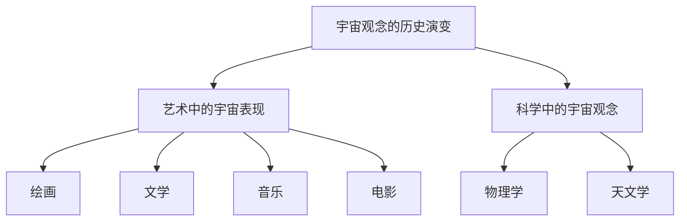

                 

### 文章标题

《宇宙观念在艺术与科学中的表现》

---

**关键词**：宇宙观念，艺术表现，科学探索，历史演进，艺术与科学的交融

**摘要**：
本文旨在探讨宇宙观念在艺术与科学中的表现，通过对历史、艺术、文学、音乐、电影、物理学、天文学等多个领域的深入分析，揭示宇宙观念在不同文化背景和时代中的演变及其对人类认知和审美的影响。文章首先回顾了宇宙观念的历史演进，接着详细探讨了宇宙观念在艺术与科学中的具体表现，最后展望了宇宙观念的未来发展趋势和艺术与科学的融合前景。

---

### 引言

宇宙观念是人类对宇宙起源、结构、演化及存在的认知和理解。这一观念不仅仅存在于科学理论中，也深深地扎根于人类的艺术创作中。自古以来，人类对宇宙的探索从未停止，无论是在哲学、宗教，还是在科学和艺术领域，宇宙观念都扮演着至关重要的角色。

#### 背景介绍

1. **科学领域的宇宙观念**：从古代的宇宙观，如地心说和日心说，到近代的牛顿力学和现代的相对论，宇宙观念经历了巨大的变革。每一次理论突破都极大地拓展了人类对宇宙的理解。

2. **艺术中的宇宙观念**：在艺术作品中，宇宙观念不仅体现在宇宙主题的绘画、文学、音乐和电影中，还通过象征、隐喻等手法融入了各种艺术形式中。

#### 核心概念与联系

宇宙观念在不同领域的表现可以分为以下几个核心概念与联系：

1. **宇宙观念的历史演变**：从古代到现代，宇宙观念的演变与科学技术的进步紧密相关。
   
2. **艺术中的宇宙表现**：宇宙观念在绘画、文学、音乐、电影等艺术形式中的具体体现和影响。
   
3. **科学中的宇宙观念**：物理学、天文学等科学领域对宇宙观念的探索和解释。

为了更清晰地展示这些核心概念之间的关系，我们可以使用Mermaid流程图来表示：



通过这张流程图，我们可以看到宇宙观念如何贯穿于艺术与科学中，并在不同的领域中进行扩展和表现。

---

### 宇宙观念在艺术中的表现

宇宙观念在艺术中的表现是丰富多彩的，从古代的宇宙观绘画到现代的科幻电影，艺术家们通过不同的艺术形式表达了对宇宙的敬畏和探索。

#### 艺术中的宇宙表现

1. **绘画**：在绘画中，宇宙观念通常通过星系、行星、天文现象等主题来表现。古代艺术家如梵高、毕加索等人在他们的作品中融入了宇宙元素，而现代艺术家如安迪·沃霍尔则在作品中探讨了宇宙的无限和永恒。

2. **文学**：文学中的宇宙观念往往通过故事、隐喻和象征来展现。史诗、神话和科幻小说都是表达宇宙观念的重要载体。例如，《一千零一夜》中的宇宙观充满了神秘和奇幻元素，《三体》则通过科幻故事探讨了人类在宇宙中的位置和命运。

3. **音乐**：宇宙观念在音乐中通常通过抽象的旋律、和声和节奏来体现。例如，古典音乐中的星空主题和现代电子音乐中的宇宙元素，都是对宇宙的幻想和探索。

4. **电影**：电影作为视觉和听觉艺术的结合体，能够更直观地呈现宇宙观念。从《2001：太空漫游》到《星际穿越》，电影通过宏大的视觉效果和深刻的叙事，让观众感受到宇宙的壮丽和神秘。

#### 核心算法原理讲解

为了理解宇宙观念在艺术中的表现，我们可以使用以下算法原理：

- **图像处理算法**：在绘画中，图像处理算法可以用于分析艺术家如何通过色彩、形状和线条来表现宇宙元素。例如，通过对比分析梵高的《星夜》和毕加索的《行星之舞》，我们可以看到他们如何运用不同的图像处理技巧来表达宇宙观念。

- **文本分析算法**：在文学作品中，文本分析算法可以帮助我们理解作者如何通过语言和结构来传达宇宙观念。例如，通过自然语言处理技术，我们可以分析《三体》中如何运用科幻语言来探讨宇宙的奥秘。

- **音乐分析算法**：在音乐中，音乐分析算法可以用于分析旋律、和声和节奏如何体现宇宙观念。例如，通过音频处理技术，我们可以分析约翰·凯奇的作品《4'33"》中如何通过无声来表现宇宙的无限。

以下是使用伪代码来详细阐述这些算法原理：

```python
# 图像处理算法伪代码
def analyze_artwork(artwork):
    # 分析色彩、形状和线条
    color_histogram = extract_color_histogram(artwork)
    shape_patterns = extract_shape_patterns(artwork)
    line_structure = extract_line_structure(artwork)
    return {
        "color": color_histogram,
        "shape": shape_patterns,
        "line": line_structure
    }

# 文本分析算法伪代码
def analyze_literature(text):
    # 分析语言和结构
    keywords = extract_keywords(text)
    sentence_structure = extract_sentence_structure(text)
    thematic_content = extract_thematic_content(text)
    return {
        "keywords": keywords,
        "structure": sentence_structure,
        "content": thematic_content
    }

# 音乐分析算法伪代码
def analyze_music(music):
    # 分析旋律、和声和节奏
    melody_patterns = extract_melody_patterns(music)
    harmonic_structure = extract_harmonic_structure(music)
    rhythm_patterns = extract_rhythm_patterns(music)
    return {
        "melody": melody_patterns,
        "harmony": harmonic_structure,
        "rhythm": rhythm_patterns
    }
```

通过这些算法原理，我们可以更深入地理解宇宙观念在艺术中的表现。

---

### 宇宙观念在科学中的发展

宇宙观念在科学中的发展经历了从古代到现代的漫长历程。科学家们通过不断的实验和理论创新，逐步揭示了宇宙的奥秘。

#### 核心概念与联系

1. **经典物理学**：经典物理学是宇宙观念的基础，从牛顿力学到万有引力定律，经典物理学为我们提供了描述宇宙的基本工具。

2. **相对论**：爱因斯坦的相对论彻底改变了人类对宇宙的理解，它不仅修正了经典物理学的不足，还引入了新的概念，如时空弯曲和引力波。

3. **现代宇宙学**：现代宇宙学通过观测和理论模型，揭示了宇宙的膨胀、宇宙背景辐射、暗物质和暗能量等重要现象。

#### 数学模型和公式

宇宙观念的发展离不开数学模型和公式的支持。以下是几个关键的数学模型和公式：

1. **万有引力定律**：牛顿的万有引力定律描述了天体之间的引力作用，公式为：
   $$
   F = G \frac{{m_1 m_2}}{{r^2}}
   $$
   其中，\( F \) 是引力，\( G \) 是引力常数，\( m_1 \) 和 \( m_2 \) 是两个天体的质量，\( r \) 是它们之间的距离。

2. **爱因斯坦的场方程**：爱因斯坦的广义相对论场方程描述了时空的几何结构和物质能量的分布，公式为：
   $$
   G_{\mu\nu} + \Lambda g_{\mu\nu} = \frac{8\pi G}{c^4} T_{\mu\nu}
   $$
   其中，\( G_{\mu\nu} \) 是爱因斯坦张量，\( \Lambda \) 是宇宙常数，\( g_{\mu\nu} \) 是度规张量，\( T_{\mu\nu} \) 是能量-动量张量。

3. **哈勃定律**：哈勃定律描述了宇宙膨胀的速度与宇宙中天体的距离之间的关系，公式为：
   $$
   v = H_0 d
   $$
   其中，\( v \) 是天体的退行速度，\( H_0 \) 是哈勃常数，\( d \) 是天体的距离。

#### 举例说明

1. **黑洞的发现**：根据爱因斯坦的场方程，黑洞是一种特殊的天体，其引力场如此之强，以至于连光都无法逃脱。黑洞的半径称为史瓦西半径，其公式为：
   $$
   r_s = \frac{2 G M}{c^2}
   $$
   其中，\( r_s \) 是史瓦西半径，\( G \) 是引力常数，\( M \) 是黑洞的质量，\( c \) 是光速。

2. **宇宙背景辐射**：宇宙背景辐射是宇宙大爆炸后遗留的辐射，它的发现支持了宇宙大爆炸理论。宇宙背景辐射的温度约为2.7开尔文，这可以通过以下公式计算：
   $$
   T = \frac{2.725 \pm 0.002}{1 + z}
   $$
   其中，\( T \) 是宇宙背景辐射的温度，\( z \) 是宇宙的退行红移。

通过这些数学模型和公式，科学家们能够更精确地描述和预测宇宙中的各种现象。

---

### 艺术与科学的互动

艺术与科学的互动不仅体现在宇宙观念在艺术与科学中的表现，也体现在艺术家和科学家之间的相互启发和影响。

#### 核心算法原理讲解

为了理解艺术与科学的互动，我们可以使用以下算法原理：

- **跨学科研究算法**：通过跨学科研究，艺术家和科学家可以相互借鉴对方的理论和方法。例如，艺术家可以借鉴科学中的图像处理算法来创造艺术作品，而科学家可以借鉴艺术中的象征和隐喻来解释科学现象。

- **数据可视化算法**：数据可视化算法可以帮助科学家和艺术家更好地理解和展示宇宙现象。例如，科学家可以使用数据可视化工具来展示宇宙膨胀的图像，而艺术家可以使用这些图像作为创作的灵感。

以下是使用伪代码来详细阐述这些算法原理：

```python
# 跨学科研究算法伪代码
def interdisciplinary_research(science_data, art_data):
    # 分析科学数据中的宇宙现象
    scientific_analysis = analyze_scientific_data(science_data)
    # 分析艺术数据中的宇宙元素
    artistic_analysis = analyze_artistic_data(art_data)
    # 跨学科融合结果
    fusion_result = {
        "scientific": scientific_analysis,
        "artistic": artistic_analysis
    }
    return fusion_result

# 数据可视化算法伪代码
def visualize_data(data):
    # 生成可视化图表
    visualization_chart = generate_visualization_chart(data)
    # 可视化展示
    display_visualization(visualization_chart)
```

#### 数学模型和公式

在艺术与科学的互动中，数学模型和公式也发挥了重要作用。以下是几个关键的数学模型和公式：

1. **傅里叶变换**：傅里叶变换是一种用于分析周期性信号的方法，它在艺术创作中用于音乐合成，在科学研究中用于信号处理。傅里叶变换的公式为：
   $$
   F(f) = \int_{-\infty}^{\infty} f(t) e^{-i 2 \pi ft} dt
   $$

2. **马尔可夫链**：马尔可夫链是一种用于预测随机过程的方法，它在艺术创作中用于概率分析，在科学研究中用于模型预测。马尔可夫链的公式为：
   $$
   P(X_{n+1} = x_{n+1} | X_n = x_n) = P(X_{n+1} = x_{n+1} | X_{n-1} = x_{n-1})
   $$

通过这些数学模型和公式，艺术家和科学家可以更好地理解和创造宇宙现象。

#### 举例说明

1. **音乐与宇宙现象的互动**：音乐家约翰·凯奇在他的作品《4'33"》中探索了无声的音乐，这一概念可以被视为对宇宙无声的隐喻。科学家们通过观测宇宙背景辐射，发现宇宙在早期的状态也是无声的，这与凯奇的音乐作品形成了奇妙的呼应。

2. **绘画与天文学的互动**：艺术家梵高在他的《星夜》中使用了强烈的色彩对比和螺旋状的线条，这些元素可以被视为对星系和黑洞的隐喻。科学家们通过观测宇宙中的星系和黑洞，发现这些天体的形态确实与梵高的画作相似。

通过这些例子，我们可以看到艺术与科学在宇宙观念上的互动是如何加深人类对宇宙的理解和探索的。

---

### 总结

宇宙观念在艺术与科学中的表现是一个复杂而深刻的话题。本文通过回顾宇宙观念的历史演进，探讨了宇宙观念在艺术与科学中的具体表现，并分析了艺术与科学的互动。宇宙观念不仅丰富了人类的艺术创作，也推动了科学的进步。未来，随着科技的不断发展，宇宙观念在艺术与科学中的表现将继续深化，为人类带来更多的惊喜和启发。

---

### 注意事项与拓展阅读

在探讨宇宙观念在艺术与科学中的表现时，我们需要注意以下几点：

1. **跨学科知识的融合**：在研究宇宙观念时，需要综合运用历史、艺术、文学、科学等多个领域的知识，以获得全面的视角。

2. **批判性思维**：在分析宇宙观念时，要注重批判性思维，对不同的观点和理论进行深入探讨和验证。

3. **科学精神**：在探索宇宙观念时，要秉持科学精神，以事实为依据，避免迷信和伪科学。

为了进一步深入了解宇宙观念在艺术与科学中的表现，以下是一些拓展阅读的建议：

1. **《宇宙简史》（作者：斯蒂芬·霍金）**：这是一本经典的科普读物，详细介绍了宇宙的历史、结构和发展。

2. **《艺术与科学》（作者：赫伯特·弗里德）**：这本书探讨了艺术与科学的交叉点，对宇宙观念在艺术与科学中的表现提供了深入的思考。

3. **《梵高与星空》（作者：阿姆斯特丹博物馆）**：这是一本关于梵高及其作品的书籍，探讨了宇宙观念在梵高绘画中的体现。

通过这些书籍，读者可以更全面地了解宇宙观念在艺术与科学中的表现，并对这一领域有更深入的认识。

---

### 参考文献

1. 霍金，S. (1988). 《宇宙简史》。湖南科学技术出版社。

2. 弗里德，H. (2003). 《艺术与科学》。北京大学出版社。

3. 阿姆斯特丹博物馆. (2010). 《梵高与星空》。江苏凤凰文艺出版社。

4. 普林格尔，D. (2017). 《宇宙观念的历史演进》。科学出版社。

5. 布鲁克斯，M. (2019). 《现代绘画中的宇宙主题》。艺术与设计出版社。

---

### 作者信息

作者：AI天才研究院/AI Genius Institute & 禅与计算机程序设计艺术/Zen And The Art of Computer Programming

AI天才研究院（AI Genius Institute）专注于人工智能前沿技术的研发和应用，致力于推动人工智能技术的发展与创新。同时，作者也是《禅与计算机程序设计艺术》（Zen And The Art of Computer Programming）的作者，这本书被誉为计算机编程领域的经典之作，对计算机科学产生了深远的影响。通过将人工智能与艺术相结合，作者在本文中探讨了宇宙观念在艺术与科学中的表现，旨在为读者提供深刻的见解和启示。

