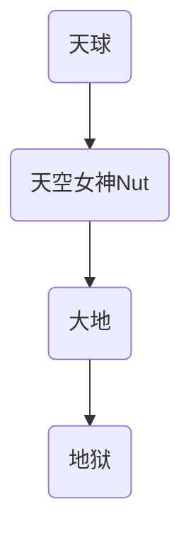

                 

# 文章标题：宇宙观念的历史演变

## 关键词
宇宙观，历史演变，天文学，物理学，数学模型，科学革命

## 摘要
本文将从古代到现代，逐步探讨人类对宇宙观念的理解与演变过程。从古埃及、古希腊、中世纪的宇宙观念，到哥白尼革命、牛顿的宇宙观，再到相对论和量子力学，以及当代宇宙学的最新研究，我们将回顾这些里程碑式的发展，并分析它们对人类认识宇宙的深远影响。

## 目录

### 第一部分：古代宇宙观念

#### 第1章：古代文明的宇宙观
- **1.1.1 古埃及的宇宙观念**
- **1.1.2 古希腊的宇宙观念**
- **1.1.3 古印度的宇宙观念**

#### 第2章：中世纪宇宙观念
- **2.1.1 基督教的宇宙观念**
- **2.1.2 伊斯兰教的宇宙观念**
- **2.1.3 印度的吠陀宇宙观**

### 第二部分：现代宇宙观念的兴起

#### 第3章：哥白尼革命
- **3.1.1 哥白尼的日心说**
- **3.1.2 哥白尼革命的影响**

#### 第4章：牛顿的宇宙观
- **4.1.1 牛顿的万有引力定律**
- **4.1.2 牛顿的宇宙观体系**

#### 第5章：相对论与宇宙观的变革
- **5.1.1 爱因斯坦的相对论**
- **5.1.2 相对论对宇宙观念的影响**

#### 第6章：量子力学与宇宙的微观世界
- **6.1.1 量子力学的基本概念**
- **6.1.2 量子力学与宇宙观念的联系**

### 第三部分：当代宇宙观念的发展

#### 第7章：宇宙膨胀与宇宙学原理
- **7.1.1 宇宙膨胀理论**
- **7.1.2 宇宙学原理**

#### 第8章：黑洞与宇宙的极端现象
- **8.1.1 黑洞的概念与特性**
- **8.1.2 黑洞对宇宙观念的影响**

#### 第9章：宇宙的大尺度结构
- **9.1.1 宇宙的大尺度结构理论**
- **9.1.2 宇宙结构的研究方法**

#### 第10章：宇宙的未来
- **10.1.1 宇宙膨胀的未来**
- **10.1.2 宇宙大爆炸理论**

### 附录

#### 附录A：宇宙观念的历史演变时间线
#### 附录B：宇宙观念的重要人物
#### 附录C：推荐阅读

---

## 第一部分：古代宇宙观念

### 第1章：古代文明的宇宙观

在人类文明发展的早期阶段，不同文明都形成了自己独特的宇宙观念。这些观念不仅反映了当时人们对宇宙的理解，也深刻影响了他们对于自然和神灵的认识。

#### 1.1.1 古埃及的宇宙观念

在古埃及，宇宙被描绘为一个神圣的层次结构。天球位于宇宙的中心，由天空女神Nut覆盖，她的身体形成了一个巨大的穹顶，太阳每天从她的左边升起，右边落下。地平线以下则是黑暗的地狱，由死亡之神Osiris统治。大地则位于天球和地狱之间，被河流和山脉所环绕。古埃及的宇宙观念深受其宗教信仰的影响，天体运动被视为神灵的意志表现。



#### 1.1.2 古希腊的宇宙观念

古希腊的宇宙观念则更加理性和科学。他们相信宇宙是由一个永恒的、不动的天球构成的，天体在球形轨道上匀速运动。阿那克西曼德提出了地球是圆形的假设，而欧多克斯则提出了“均轮”和“偏轮”的概念，用以解释行星的运动。这种地心说模型在当时得到了广泛接受，成为古代宇宙观念的主流。

#### 1.1.3 古印度的宇宙观念

古印度的宇宙观念则融合了宗教和哲学思想。根据《吠陀》文献，宇宙起源于一次巨大的创造和毁灭的循环，称为“宇宙周期”。这些宇宙周期被分为几个不同的时期，每个时期都有其特定的宇宙形态和生命形式。这种宇宙观念与印度教和佛教的宇宙观密切相关。

### 第2章：中世纪宇宙观念

在中世纪，西方和东方的宇宙观念都受到了宗教和哲学的强烈影响。

#### 2.1.1 基督教的宇宙观念

在基督教宇宙观念中，宇宙被视为上帝创造的奇迹，地球位于宇宙的中心，天体围绕地球旋转。这种地心说模型在《圣经》和教父著作中得到了支持。这种观念一直持续到哥白尼革命的出现。

#### 2.1.2 伊斯兰教的宇宙观念

伊斯兰教的宇宙观念与基督教类似，也接受了地心说。然而，伊斯兰学者在宇宙学领域做出了重要的贡献，如阿尔·法拉比和阿尔·巴赫鲁伊，他们对天文学和数学的研究为后来的科学发展奠定了基础。

#### 2.1.3 印度的吠陀宇宙观

印度的吠陀宇宙观则继续强调宇宙的循环性，认为宇宙经历了无数次的创造和毁灭。这种宇宙观念在后来的印度教和佛教哲学中得到了进一步的发展。

## 第二部分：现代宇宙观念的兴起

### 第3章：哥白尼革命

#### 3.1.1 哥白尼的日心说

尼古拉·哥白尼是文艺复兴时期的天文学家，他提出了日心说模型，认为太阳而非地球是宇宙的中心，地球和其他行星围绕太阳旋转。这一观点颠覆了传统的地心说宇宙观念，是现代宇宙观念的重要开端。


#### 3.1.2 哥白尼革命的影响

哥白尼革命不仅改变了人们对宇宙结构的理解，也促进了科学方法的进步。它激发了后来科学家对天文学和宇宙学的深入研究，为现代科学的发展奠定了基础。

### 第4章：牛顿的宇宙观

#### 4.1.1 牛顿的万有引力定律

艾萨克·牛顿是近代科学的奠基人之一，他提出了万有引力定律，解释了行星运动的规律。这一发现不仅验证了哥白尼的日心说，也为宇宙定律的研究提供了新的工具。

```python
# 伪代码：计算两个质点间的引力
def calculate_gravity(m1, m2, r):
    G = 6.674 * 10^-11  # 万有引力常数
    F = G * (m1 * m2) / r^2
    return F
```

#### 4.1.2 牛顿的宇宙观体系

牛顿的宇宙观认为，宇宙是由一系列相互作用的物体组成的，这些物体遵循自然定律。他的理论为后来物理学和宇宙学的发展奠定了基础。

### 第5章：相对论与宇宙观的变革

#### 5.1.1 爱因斯坦的相对论

阿尔伯特·爱因斯坦的相对论是20世纪物理学的重要突破。狭义相对论和广义相对论分别从不同的角度解释了时空和引力。狭义相对论提出了质能等价原理，而广义相对论则将引力解释为时空的弯曲。

#### 5.1.2 相对论对宇宙观念的影响

相对论的提出彻底改变了人类对宇宙的理解。它揭示了时空的相对性和引力场的本质，为宇宙学的进一步研究提供了新的视角。

### 第6章：量子力学与宇宙的微观世界

#### 6.1.1 量子力学的基本概念

量子力学是研究微观世界的科学。它揭示了微观粒子的行为与经典物理学的不同。量子力学的核心概念包括量子态、波粒二象性和不确定性原理。

#### 6.1.2 量子力学与宇宙观念的联系

量子力学的发展对宇宙学产生了深远影响。它揭示了宇宙微观层面的行为规律，为宇宙起源和结构的研究提供了新的工具。

## 第三部分：当代宇宙观念的发展

### 第7章：宇宙膨胀与宇宙学原理

#### 7.1.1 宇宙膨胀理论

宇宙膨胀理论是20世纪宇宙学的重大发现。它认为，宇宙从大爆炸开始不断膨胀。这一理论通过观测宇宙背景辐射得到了验证。

$$
H = \frac{\dot{a}}{a}
$$

#### 7.1.2 宇宙学原理

宇宙学原理指出，宇宙在大尺度上是均匀和各向同性的。这一原理为宇宙学研究提供了基础。

### 第8章：黑洞与宇宙的极端现象

#### 8.1.1 黑洞的概念与特性

黑洞是宇宙中的一种极端现象，具有极强的引力场，甚至连光也无法逃逸。黑洞的概念揭示了宇宙引力的极端性质。


#### 8.1.2 黑洞对宇宙观念的影响

黑洞的发现改变了人类对宇宙的理解，揭示了宇宙引力的极端现象和宇宙结构的复杂性。

### 第9章：宇宙的大尺度结构

#### 9.1.1 宇宙的大尺度结构理论

宇宙的大尺度结构包括星系、星系团和宇宙大尺度流等。这些结构揭示了宇宙的复杂性和多样性。

#### 9.1.2 宇宙结构的研究方法

宇宙结构的研究方法包括天文观测、数值模拟和理论分析等。这些方法共同促进了宇宙学的发展。

### 第10章：宇宙的未来

#### 10.1.1 宇宙膨胀的未来

宇宙膨胀的未来可能包括多种情景，如继续膨胀、减速膨胀或再次收缩。这些情景取决于宇宙的组成和演化过程。

#### 10.1.2 宇宙大爆炸理论

宇宙大爆炸理论是解释宇宙起源和演化的重要理论。它提出了宇宙起源于一个极高温度和密度的状态，并随着膨胀逐渐冷却和演化。

## 附录

### 附录A：宇宙观念的历史演变时间线

宇宙观念的历史演变可以追溯到古代文明，从地心说到日心说，再到相对论和量子力学，每个阶段都代表了对宇宙理解的重大进步。

### 附录B：宇宙观念的重要人物

包括哥白尼、牛顿、爱因斯坦等，他们的贡献改变了人类对宇宙的认识。

### 附录C：推荐阅读

- 《宇宙简史》- 斯蒂芬·霍金
- 《黑洞与时间弯曲》- Kip S. Thorne
- 《量子力学与宇宙学》- John C. Baez

---

作者：AI天才研究院/AI Genius Institute & 禅与计算机程序设计艺术 /Zen And The Art of Computer Programming

