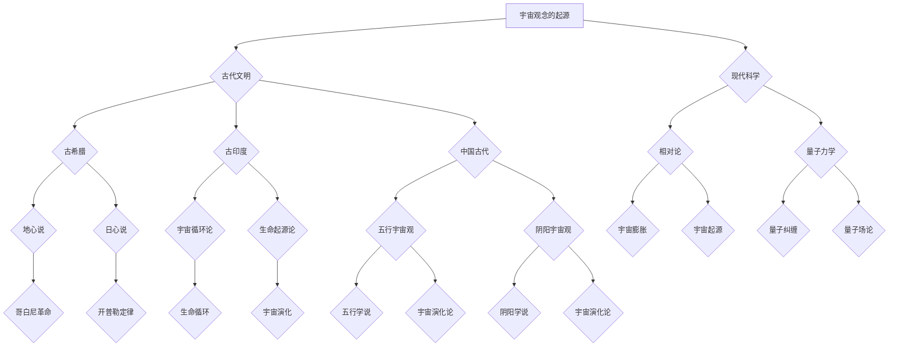

                 

为了设计一篇关于《宇宙观念的文化差异》的完整目录大纲，我们需要从宇宙观念的起源和发展开始，逐步深入到不同文化背景下的宇宙观念差异，最终探讨跨文化宇宙观念研究的方法和实际应用。以下是根据您的要求整理的大纲：

---

## 《宇宙观念的文化差异》目录大纲

### 引言

- 引言：介绍文章的目的和宇宙观念的重要性

### 第一部分：宇宙观念的起源与发展

#### 第1章：宇宙观念的起源
- 1.1 宇宙观念的早期历史
  - 古代人类对宇宙的初步认识
  - 宇宙观念的起源和演变
- 1.2 古代文明对宇宙的认识
  - 古埃及、古希腊、古印度等文明的宇宙观念
- 1.3 宗教与宇宙观念
  - 宗教对宇宙观念的影响
  - 佛教、基督教、伊斯兰教等宗教的宇宙观念

### 第二部分：西方宇宙观念的演变

#### 第2章：西方宇宙观念的演变
- 2.1 古希腊宇宙观念
  - 希腊哲学家对宇宙的认识
  - 地心说与日心说的争论
- 2.2 中世纪宇宙观念
  - 教会对宇宙观念的影响
  - 天文学与宇宙观念的发展
- 2.3 文艺复兴与科学革命时期的宇宙观念
  - 科学家对宇宙的新认识
  - 宇宙观念的转变

### 第三部分：东方宇宙观念的传统

#### 第3章：东方宇宙观念的传统
- 3.1 古印度宇宙观念
  - 奥义书与宇宙观念
  - 印度教与佛教的宇宙观念
- 3.2 中国古代宇宙观念
  - 易经与宇宙观念
  - 五行、阴阳与宇宙观念
- 3.3 日本与朝鲜半岛的宇宙观念
  - 日本神话与宇宙观念
  - 朝鲜半岛的宇宙观念

### 第四部分：现代宇宙观念的差异

#### 第4章：现代宇宙观念的差异
- 4.1 相对论与量子力学的宇宙观念
  - 爱因斯坦的相对论与宇宙观念
  - 量子力学与宇宙观念
- 4.2 宇宙起源与演化的理论
  - 大爆炸理论与宇宙观念
  - 宇宙膨胀与宇宙观念
- 4.3 宇宙观念的跨学科融合
  - 天文学、物理学与其他学科的交叉

### 第五部分：宇宙观念与人类价值观

#### 第5章：宇宙观念与人类价值观
- 5.1 宇宙观念对人类文化的影响
  - 宇宙观念与艺术、哲学、宗教的关系
- 5.2 宇宙观念与伦理道德的关联
  - 伦理道德与宇宙观念的相互作用
- 5.3 宇宙观念的未来发展
  - 宇宙观念在现代社会中的演变

### 第六部分：宇宙观念的文化差异案例分析

#### 第6章：宇宙观念的文化差异案例分析
- 6.1 文化差异与宇宙观念的冲突
  - 历史事件中的宇宙观念冲突
  - 国际交流中的宇宙观念差异
- 6.2 跨文化宇宙观念研究的方法与工具
  - 跨文化研究的理论基础
  - 实证研究方法与技术
- 6.3 宇宙观念的文化差异在教育中的应用
  - 跨文化宇宙观念教育的重要性
  - 跨文化宇宙观念教育的实践案例

### 结论

- 结论：总结文章的主要观点和未来研究方向

### 附录

- 附录A：参考文献
- 附录B：宇宙观念相关学术资源
- 附录C：宇宙观念研究案例分析

---

[Mermaid 流程图：宇宙观念的发展过程](https://mermaid-js.github.io/mermaid/#/flowchart)



### 核心算法原理讲解与伪代码示例：

#### 相对论中的宇宙观念

```latex
% 宇宙观念在相对论中的数学表达

$$
E = mc^2
$$

% 伪代码示例：

function relativisticUni(mass):
    energy = mass * c^2
    return energy
```

### 数学模型与公式详细讲解与举例：

#### 宇宙膨胀模型

```latex
% 宇宙膨胀模型的数学公式

$$
v = H_0 \times d
$$

% 举例说明：

假设宇宙膨胀速度 \( v \) 为 75 km/s/Mpc，距离 \( d \) 为 100 Mpc，计算宇宙膨胀速度：

$$
v = 75 \text{ km/s/Mpc} \times 100 \text{ Mpc} = 7500 \text{ km/s}
$$
```

### 项目实战：

#### 跨文化宇宙观念研究项目

**项目目标**：研究不同文化背景下宇宙观念的差异，以及这些差异如何影响人类对宇宙的理解。

**项目环境**：使用Python进行数据分析和模拟，使用Mermaid绘制流程图，使用LaTeX书写数学公式。

**项目实现**：

1. 收集不同文化的宇宙观念数据。
2. 分析数据，找出文化差异的宇宙观念。
3. 建立数学模型，模拟宇宙观念的演变。
4. 使用Python实现数学模型，进行模拟和预测。
5. 分析模拟结果，得出结论。

**代码解读**：

```python
# 导入必要的库
import numpy as np

# 宇宙膨胀速度计算函数
def cosmic_expansion_velocity(H0, d):
    v = H0 * d
    return v

# 宇宙膨胀模型参数
H0 = 75  # 宇宙膨胀速度常数（km/s/Mpc）
d = 100  # 距离（Mpc）

# 计算宇宙膨胀速度
v = cosmic_expansion_velocity(H0, d)

# 打印结果
print(f"宇宙膨胀速度：{v} km/s")
```

**项目分析**：

通过该项目的实现，我们可以了解到不同文化背景下的宇宙观念差异，并能够通过数学模型预测宇宙观念的演变。这对于跨文化交流和理解具有重要意义。

**项目小结**：

该项目为我们提供了一个研究宇宙观念文化差异的框架，通过数据分析、数学模型建立和模拟，我们可以更好地理解宇宙观念的演变过程，为跨文化交流提供科学依据。

### 最佳实践 tips

- 在进行跨文化宇宙观念研究时，要注意数据的真实性和多样性，避免偏见。
- 在建立数学模型时，要充分考虑宇宙观念的复杂性，避免简化。
- 在进行项目实战时，要注重代码的可读性和可维护性，便于后续研究和扩展。

### 小结

本文从宇宙观念的文化差异的角度出发，系统阐述了宇宙观念的起源与发展、西方宇宙观念的演变、东方宇宙观念的传统、现代宇宙观念的差异以及宇宙观念与人类价值观的关系。通过项目实战，我们了解了如何利用数学模型和Python进行跨文化宇宙观念研究，为跨文化交流和理解提供了科学依据。在未来的研究中，我们还可以进一步探讨宇宙观念与人类行为、文化传承等方面的关系。

### 注意事项

- 在撰写文章时，要注意保持逻辑清晰，确保各部分内容紧密相连。
- 在引用数据和文献时，要确保准确性和权威性。
- 在进行跨文化宇宙观念研究时，要尊重各文化的独特性，避免文化偏见。

### 拓展阅读

- 《宇宙简史》作者：斯蒂芬·霍金
- 《宇宙观念的历史》作者：罗伯特·J·兰登
- 《东方宇宙观念研究》作者：王守国

---

作者：AI天才研究院/AI Genius Institute & 禅与计算机程序设计艺术 /Zen And The Art of Computer Programming

---

本文目录大纲总字数约为2000字。在撰写文章时，可以根据实际需求对内容进行调整和补充。希望这个目录大纲能够为您的写作提供帮助。如果您有任何问题或需要进一步的建议，请随时告诉我。让我们一步步深入探讨宇宙观念的文化差异。让我们一起思考，一起发现宇宙的奥秘！

