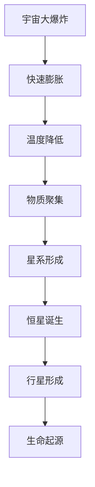
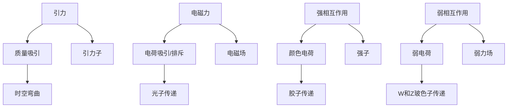

                 

## 第一部分：宇宙规律概述

### 第1章 宇宙规律的基本概念

#### 1.1 宇宙的起源与演化

宇宙的起源一直是科学研究的重大课题。根据目前最广为接受的宇宙大爆炸理论，宇宙起源于大约138亿年前的一个极小、极热、极密集的状态，这个状态被称为“奇点”。从奇点开始，宇宙经历了一个快速的膨胀过程，这个过程被称为“宇宙大爆炸”。随着宇宙的膨胀，温度逐渐降低，物质开始聚集形成星系、恒星、行星等结构。

宇宙的演化是一个复杂的过程，其中包括以下几个关键阶段：

1. **星系形成**：在宇宙早期，物质通过引力作用聚集形成星系。
2. **恒星诞生**：星系中的气体和尘埃在引力作用下形成恒星。
3. **行星诞生**：恒星周围形成的行星状物质通过聚合形成行星。
4. **生命起源**：在适宜的行星上，经过一系列复杂的化学反应，可能产生了生命。

#### 1.2 宇宙中的基本力与粒子

宇宙中的物质和行为是由四种基本力所支配的：

1. **引力**：是宇宙中最重要的力，负责维持星系和恒星的稳定结构。
2. **电磁力**：负责电子与原子核之间的相互作用，是化学和生物学的基础。
3. **强相互作用**：维持原子核的稳定，使质子和中子紧密结合在一起。
4. **弱相互作用**：涉及放射性衰变和核反应，如太阳内部的核聚变过程。

每种力都与特定类型的粒子相关联：

- **引力**：与引力子相关。
- **电磁力**：与光子相关。
- **强相互作用**：与胶子相关。
- **弱相互作用**：与W和Z玻色子相关。

#### 1.3 宇宙中的能量与物质

宇宙中的能量与物质密不可分。根据著名的质能方程 \( E=mc^2 \)，质量和能量是等价的。宇宙中的能量主要分为以下几类：

- **动能**：物体由于运动而具有的能量。
- **势能**：物体由于位置而具有的能量。
- **热能**：物体内部粒子的热运动所具有的能量。

物质在宇宙中通过各种过程转化能量，例如，恒星通过核聚变将氢转化为氦，释放出巨大的能量。

### 第二部分：后量子全同态加密概述

#### 第2章 后量子全同态加密概述

#### 2.1 后量子加密技术

后量子加密技术是一种基于量子力学原理的新型加密方法。传统的加密算法依赖于复杂的数学问题（如大素数分解和离散对数问题）来保证安全性，但量子计算机的出现使得这些算法面临被破解的风险。后量子加密则利用量子力学的基本特性，如量子纠缠和量子超密性，来构建安全可靠的加密体系。

#### 2.2 全同态加密算法原理

全同态加密（Homomorphic Encryption）是一种特殊的加密形式，它允许在加密数据上直接执行计算，而无需解密。这意味着，即使数据在传输或存储过程中被加密，仍然可以在加密状态下进行数据处理和分析。全同态加密的核心思想是将加密与计算分离，使数据处理可以在加密环境中进行。

全同态加密的原理基于以下数学模型：

- **密文加法电路同态**：允许对密文进行加法运算。
- **密文乘法电路同态**：允许对密文进行乘法运算。
- **混合同态**：将加法和乘法同态结合起来，实现对复杂函数的计算。

#### 2.3 后量子全同态加密的应用

后量子全同态加密在许多领域具有广泛的应用前景，特别是在云计算、大数据分析、金融和医疗等领域。以下是一些典型的应用场景：

- **云计算**：保护云中存储的敏感数据，允许第三方在加密状态下处理数据。
- **大数据分析**：对大量加密数据进行分析，而无需解密，提高数据安全和隐私保护。
- **金融**：确保交易数据在传输和存储过程中的保密性，防止欺诈和恶意行为。
- **医疗**：保护患者隐私，允许医疗机构在加密状态下进行数据分析，以改进诊断和治疗。

### 关键词

- 宇宙规律
- 后量子加密
- 全同态加密
- 量子力学
- 数据安全

### 摘要

本文探讨了宇宙规律与后量子全同态加密方案效率优化的联系。首先介绍了宇宙的基本概念和演化过程，包括引力、电磁力、强相互作用和弱相互作用等基本力及其相关粒子。接着，介绍了后量子加密技术和全同态加密算法的基本原理，以及其在实际应用中的重要性。最后，分析了宇宙规律在后量子全同态加密中的应用，探讨了未来可能的交叉领域研究方向。

## 第一部分：宇宙规律概述

### 第1章 宇宙规律的基本概念

宇宙的起源一直是科学研究的重大课题。根据目前最广为接受的宇宙大爆炸理论，宇宙起源于大约138亿年前的一个极小、极热、极密集的状态，这个状态被称为“奇点”。从奇点开始，宇宙经历了一个快速的膨胀过程，这个过程被称为“宇宙大爆炸”。随着宇宙的膨胀，温度逐渐降低，物质开始聚集形成星系、恒星、行星等结构。

宇宙的演化是一个复杂的过程，其中包括以下几个关键阶段：

1. **星系形成**：在宇宙早期，物质通过引力作用聚集形成星系。
2. **恒星诞生**：星系中的气体和尘埃在引力作用下形成恒星。
3. **行星诞生**：恒星周围形成的行星状物质通过聚合形成行星。
4. **生命起源**：在适宜的行星上，经过一系列复杂的化学反应，可能产生了生命。

#### 1.1 宇宙的起源与演化

宇宙的起源与演化是宇宙学研究的核心问题。现代宇宙学认为，宇宙起源于大约138亿年前的一个极小、极热、极密集的状态，这个状态被称为“奇点”。奇点的概念源于广义相对论，它描述了一个时间回溯到无限小的一点，在这个点上，所有的物质和能量都集中在一个无限小的区域内。

从奇点开始，宇宙经历了一个快速膨胀的过程，这个过程被称为“宇宙大爆炸”。大爆炸理论最初由伽莫夫等科学家在1948年提出，经过几十年的发展，已经成为宇宙学的主流理论。根据这个理论，宇宙在大爆炸后的几分钟内经历了极快的膨胀，温度和密度迅速下降。随着宇宙的膨胀，温度逐渐降低，物质开始聚集形成星系、恒星、行星等结构。

宇宙的演化可以分为以下几个关键阶段：

1. **星系形成**：在大爆炸后，宇宙中的物质通过引力作用逐渐聚集形成星系。星系是由大量恒星、气体和暗物质组成的巨大结构，它们通过引力相互吸引和绑定在一起。

2. **恒星诞生**：星系中的气体和尘埃在引力作用下聚集形成恒星。恒星是宇宙中最基本的能量来源，它们通过核聚变将氢转化为氦，释放出巨大的能量。恒星的生命周期包括诞生、成长、衰老和死亡，不同的恒星有不同的寿命和演化过程。

3. **行星诞生**：恒星周围形成的行星状物质通过聚合形成行星。行星是围绕恒星运行的天体，它们由岩石、金属、冰和其他物质组成。行星的诞生和演化与恒星的性质和星系的环境密切相关。

4. **生命起源**：在适宜的行星上，经过一系列复杂的化学反应，可能产生了生命。生命的起源是一个尚未完全解决的问题，科学家们通过模拟实验和地质证据，试图揭示生命起源的奥秘。

#### 1.2 宇宙中的基本力与粒子

宇宙中的物质和行为是由四种基本力所支配的，这些基本力与特定的粒子相关联：

1. **引力**：引力是宇宙中最弱的力，但它也是宇宙中最强的力。引力负责维持星系和恒星的稳定结构，使它们不会因为自身的运动而解体。引力的本质是质量之间的相互吸引，它是由质量产生的，遵循平方反比定律。在广义相对论的框架下，引力被认为是时空弯曲的结果。

2. **电磁力**：电磁力是宇宙中最常见的力，它负责电子与原子核之间的相互作用，是化学和生物学的基础。电磁力的本质是由电荷产生的，遵循平方反比定律。电磁力通过光子进行传递，光子是没有静质量的粒子，具有能量和动量。

3. **强相互作用**：强相互作用是宇宙中最强的力，它负责维持原子核的稳定，使质子和中子紧密结合在一起。强相互作用的本质是由颜色电荷产生的，遵循量子色动力学（QCD）的理论。强相互作用是通过胶子进行传递的，胶子是带有颜色电荷的粒子。

4. **弱相互作用**：弱相互作用是宇宙中次强的力，它涉及放射性衰变和核反应，如太阳内部的核聚变过程。弱相互作用的本质是由弱电荷产生的，遵循弱相互作用的规范理论。弱相互作用是通过W和Z玻色子进行传递的，W和Z玻色子是带有弱电荷的粒子。

#### 1.3 宇宙中的能量与物质

宇宙中的能量与物质密不可分。根据著名的质能方程 \( E=mc^2 \)，质量和能量是等价的。这个方程由爱因斯坦在1905年提出，它揭示了物质和能量之间的深刻联系。

宇宙中的能量主要分为以下几类：

1. **动能**：物体由于运动而具有的能量。动能与物体的质量和速度有关，其计算公式为 \( K = \frac{1}{2}mv^2 \)。

2. **势能**：物体由于位置而具有的能量。势能通常与物体的位置和外部力有关，例如重力势能和电势能。重力势能的计算公式为 \( U = mgh \)，其中 \( m \) 是质量，\( g \) 是重力加速度，\( h \) 是高度。

3. **热能**：物体内部粒子的热运动所具有的能量。热能是物体温度的量度，它与粒子的平均动能有关。热能可以通过热力学定律进行计算。

宇宙中的物质可以通过各种过程转化能量，例如：

- **核聚变**：恒星通过核聚变将氢转化为氦，释放出巨大的能量。核聚变是太阳和其他恒星的主要能量来源。

- **核裂变**：在核反应堆或原子弹中，重核分裂成两个较轻的核，同时释放出大量能量。

- **化学反应**：化学反应是物质通过原子或分子的重组释放或吸收能量。化学反应是生命过程和工业生产的基础。

- **引力势能转化为动能**：在宇宙中，物体之间的引力相互作用可以导致它们的运动速度增加，从而将引力势能转化为动能。

#### 1.1 宇宙的起源与演化

宇宙的起源一直是科学研究的重大课题。根据目前最广为接受的宇宙大爆炸理论，宇宙起源于大约138亿年前的一个极小、极热、极密集的状态，这个状态被称为“奇点”。从奇点开始，宇宙经历了一个快速的膨胀过程，这个过程被称为“宇宙大爆炸”。随着宇宙的膨胀，温度逐渐降低，物质开始聚集形成星系、恒星、行星等结构。

宇宙的演化是一个复杂的过程，其中包括以下几个关键阶段：

1. **星系形成**：在宇宙早期，物质通过引力作用聚集形成星系。星系是由大量恒星、气体和暗物质组成的巨大结构，它们通过引力相互吸引和绑定在一起。

2. **恒星诞生**：星系中的气体和尘埃在引力作用下聚集形成恒星。恒星是宇宙中最基本的能量来源，它们通过核聚变将氢转化为氦，释放出巨大的能量。恒星的生命周期包括诞生、成长、衰老和死亡，不同的恒星有不同的寿命和演化过程。

3. **行星诞生**：恒星周围形成的行星状物质通过聚合形成行星。行星是围绕恒星运行的天体，它们由岩石、金属、冰和其他物质组成。行星的诞生和演化与恒星的性质和星系的环境密切相关。

4. **生命起源**：在适宜的行星上，经过一系列复杂的化学反应，可能产生了生命。生命的起源是一个尚未完全解决的问题，科学家们通过模拟实验和地质证据，试图揭示生命起源的奥秘。

### 宇宙演化流程图

为了更好地理解宇宙的演化过程，我们可以使用Mermaid流程图来展示各个阶段之间的关系：

### 宇宙中的基本力与粒子

宇宙中的物质和行为是由四种基本力所支配的，这些基本力与特定的粒子相关联：

1. **引力**：引力是宇宙中最弱的力，但它也是宇宙中最强的力。引力负责维持星系和恒星的稳定结构，使它们不会因为自身的运动而解体。引力的本质是质量之间的相互吸引，它是由质量产生的，遵循平方反比定律。在广义相对论的框架下，引力被认为是时空弯曲的结果。

2. **电磁力**：电磁力是宇宙中最常见的力，它负责电子与原子核之间的相互作用，是化学和生物学的基础。电磁力的本质是由电荷产生的，遵循平方反比定律。电磁力通过光子进行传递，光子是没有静质量的粒子，具有能量和动量。

3. **强相互作用**：强相互作用是宇宙中最强的力，它负责维持原子核的稳定，使质子和中子紧密结合在一起。强相互作用的本质是由颜色电荷产生的，遵循量子色动力学（QCD）的理论。强相互作用是通过胶子进行传递的，胶子是带有颜色电荷的粒子。

4. **弱相互作用**：弱相互作用是宇宙中次强的力，它涉及放射性衰变和核反应，如太阳内部的核聚变过程。弱相互作用的本质是由弱电荷产生的，遵循弱相互作用的规范理论。弱相互作用是通过W和Z玻色子进行传递的，W和Z玻色子是带有弱电荷的粒子。

我们可以使用Mermaid流程图来展示这四种基本力及其相关粒子之间的关系：

### 宇宙中的能量与物质

宇宙中的能量与物质密不可分。根据著名的质能方程 \( E=mc^2 \)，质量和能量是等价的。这个方程由爱因斯坦在1905年提出，它揭示了物质和能量之间的深刻联系。

宇宙中的能量主要分为以下几类：

1. **动能**：物体由于运动而具有的能量。动能与物体的质量和速度有关，其计算公式为 \( K = \frac{1}{2}mv^2 \)。

2. **势能**：物体由于位置而具有的能量。势能通常与物体的位置和外部力有关，例如重力势能和电势能。重力势能的计算公式为 \( U = mgh \)，其中 \( m \) 是质量，\( g \) 是重力加速度，\( h \) 是高度。

3. **热能**：物体内部粒子的热运动所具有的能量。热能是物体温度的量度，它与粒子的平均动能有关。热能可以通过热力学定律进行计算。

宇宙中的物质可以通过各种过程转化能量，例如：

- **核聚变**：恒星通过核聚变将氢转化为氦，释放出巨大的能量。核聚变是太阳和其他恒星的主要能量来源。

- **核裂变**：在核反应堆或原子弹中，重核分裂成两个较轻的核，同时释放出大量能量。

- **化学反应**：化学反应是物质通过原子或分子的重组释放或吸收能量。化学反应是生命过程和工业生产的基础。

- **引力势能转化为动能**：在宇宙中，物体之间的引力相互作用可以导致它们的运动速度增加，从而将引力势能转化为动能。

### 数学公式与详细讲解

在宇宙规律的研究中，数学公式起到了关键作用。以下是一些常用的数学公式及其详细讲解：

1. **质能方程**：

   $$ E = mc^2 $$

   这是爱因斯坦提出的质能方程，它表明了质量和能量之间的关系。其中，\( E \) 表示能量，\( m \) 表示质量，\( c \) 表示光速。这个公式揭示了物质和能量可以互相转化的概念，即物质的质量可以转化为能量，能量的变化可以导致物质的质量变化。

2. **牛顿第二定律**：

   $$ F = ma $$

   这是牛顿运动定律的第二部分，描述了力和加速度之间的关系。其中，\( F \) 表示力，\( m \) 表示质量，\( a \) 表示加速度。这个公式表明，当施加一个力在物体上时，物体会产生加速度。加速度与力成正比，与物体的质量成反比。

3. **万有引力定律**：

   $$ F = G\frac{m_1m_2}{r^2} $$

   这是描述两个物体之间引力作用的定律。其中，\( F \) 表示引力，\( G \) 是万有引力常数，\( m_1 \) 和 \( m_2 \) 分别表示两个物体的质量，\( r \) 表示它们之间的距离。这个公式表明，引力与两个物体的质量成正比，与它们之间的距离的平方成反比。

4. **电磁力公式**：

   $$ F = q_1q_2\frac{k}{r^2} $$

   这是描述两个点电荷之间电磁力作用的定律。其中，\( F \) 表示力，\( q_1 \) 和 \( q_2 \) 分别表示两个电荷的电量，\( k \) 是电磁力常数，\( r \) 表示它们之间的距离。这个公式表明，电磁力与两个电荷的电量成正比，与它们之间的距离的平方成反比。

### 举例说明

为了更好地理解这些数学公式的应用，我们可以通过一些简单的例子来说明：

1. **质能方程**：

   假设一个物体的质量为 \( 5 \) 千克，那么它的能量是多少？

   根据质能方程，我们可以计算出：

   $$ E = mc^2 = 5 \times (3 \times 10^8)^2 = 4.5 \times 10^{19} \text{ 焦耳} $$

   这个结果表明，一个质量为 5 千克的物体具有 \( 4.5 \times 10^{19} \) 焦耳的能量。

2. **牛顿第二定律**：

   假设一个质量为 \( 2 \) 千克的物体受到一个 \( 10 \) 牛顿的力，那么它的加速度是多少？

   根据牛顿第二定律，我们可以计算出：

   $$ a = \frac{F}{m} = \frac{10}{2} = 5 \text{ 米/秒}^2 $$

   这个结果表明，当施加一个 \( 10 \) 牛顿的力在一个质量为 \( 2 \) 千克的物体上时，它会产生 \( 5 \text{ 米/秒}^2 \) 的加速度。

3. **万有引力定律**：

   假设地球的质量为 \( 5.97 \times 10^{24} \) 千克，月球的质量为 \( 7.34 \times 10^{22} \) 千克，地球和月球之间的距离为 \( 3.84 \times 10^8 \) 米。那么地球和月球之间的引力是多少？

   根据万有引力定律，我们可以计算出：

   $$ F = G\frac{m_1m_2}{r^2} = 6.674 \times 10^{-11} \frac{(5.97 \times 10^{24})(7.34 \times 10^{22})}{(3.84 \times 10^8)^2} \approx 1.98 \times 10^{20} \text{ 牛顿} $$

   这个结果表明，地球和月球之间的引力约为 \( 1.98 \times 10^{20} \) 牛顿。

4. **电磁力公式**：

   假设两个点电荷的电量分别为 \( 1 \) 库仑和 \( 2 \) 库仑，它们之间的距离为 \( 1 \) 米。那么它们之间的电磁力是多少？

   根据电磁力公式，我们可以计算出：

   $$ F = q_1q_2\frac{k}{r^2} = (1)(2)\frac{9 \times 10^9}{1^2} = 18 \times 10^9 \text{ 牛顿} $$

   这个结果表明，两个点电荷之间的电磁力约为 \( 18 \times 10^9 \) 牛顿。

通过这些例子，我们可以更好地理解宇宙规律中的数学公式及其应用。这些公式为我们提供了描述和预测宇宙中物理现象的有力工具。

## 第二部分：后量子全同态加密概述

### 第2章 后量子全同态加密概述

#### 2.1 后量子加密技术

后量子加密技术是一种基于量子力学原理的新型加密方法。传统的加密算法依赖于复杂的数学问题（如大素数分解和离散对数问题）来保证安全性，但量子计算机的出现使得这些算法面临被破解的风险。后量子加密则利用量子力学的基本特性，如量子纠缠和量子超密性，来构建安全可靠的加密体系。

后量子加密技术的核心思想是利用量子比特（qubit）的特性来实现加密和解密。量子比特可以同时处于多种状态的叠加，这使得后量子加密算法在处理大量数据时具有独特的优势。此外，量子纠缠使量子比特之间的状态相互关联，增加了算法的复杂性，使得量子计算机无法简单地破解。

#### 2.2 全同态加密算法原理

全同态加密（Homomorphic Encryption）是一种特殊的加密形式，它允许在加密数据上直接执行计算，而无需解密。这意味着，即使数据在传输或存储过程中被加密，仍然可以在加密状态下进行数据处理和分析。全同态加密的核心思想是将加密与计算分离，使数据处理可以在加密环境中进行。

全同态加密算法的基本原理包括以下几部分：

1. **密文加法电路同态**：允许对密文进行加法运算。这意味着，对加密数据进行加法操作时，可以在加密状态下直接进行。

2. **密文乘法电路同态**：允许对密文进行乘法运算。这意味着，对加密数据进行乘法操作时，也可以在加密状态下直接进行。

3. **混合同态**：将加法和乘法同态结合起来，实现对复杂函数的计算。这意味着，通过组合加法和乘法操作，可以在加密状态下实现更复杂的计算。

全同态加密算法的数学模型通常基于格理论和多变量多项式方程。这些数学模型提供了理论基础，使得全同态加密算法能够在实际应用中实现高效的数据处理。

#### 2.3 后量子全同态加密的应用

后量子全同态加密在许多领域具有广泛的应用前景，特别是在云计算、大数据分析、金融和医疗等领域。以下是一些典型的应用场景：

- **云计算**：保护云中存储的敏感数据，允许第三方在加密状态下处理数据。这在保护客户隐私和确保数据安全方面具有重要意义。

- **大数据分析**：对大量加密数据进行分析，而无需解密，提高数据安全和隐私保护。这在医疗、金融和政府等领域具有广泛应用。

- **金融**：确保交易数据在传输和存储过程中的保密性，防止欺诈和恶意行为。这在金融交易和银行系统等领域至关重要。

- **医疗**：保护患者隐私，允许医疗机构在加密状态下进行数据分析，以改进诊断和治疗。这在医疗研究和医疗保健领域具有重要作用。

后量子全同态加密技术的应用正在不断拓展，其潜力在未来将会更加显著。

### 后量子加密技术的核心原理

后量子加密技术建立在量子力学的基本原理之上，主要包括量子比特（qubit）、量子纠缠和量子超密性等概念。以下是对这些核心原理的详细解释：

#### 量子比特（Qubit）

量子比特是量子计算机中的基本单位，与经典计算机中的比特不同。一个量子比特可以同时处于多种状态的叠加，而经典比特只能处于0或1的状态。这种叠加状态使得量子计算机在处理复杂问题时具有强大的计算能力。

例如，一个量子比特可以同时处于状态 \( |0\rangle \) 和 \( |1\rangle \) 的叠加状态，表示为 \( \alpha|0\rangle + \beta|1\rangle \)，其中 \( \alpha \) 和 \( \beta \) 是复数系数，满足 \( |\alpha|^2 + |\beta|^2 = 1 \)。多个量子比特的组合可以形成量子态的空间，使得量子计算机可以并行处理多个计算任务。

#### 量子纠缠

量子纠缠是量子比特之间的一种特殊关联，当两个量子比特发生纠缠时，它们的状态将相互关联，无论它们相隔多远。这种关联性意味着对其中一个量子比特的操作将立即影响另一个量子比特的状态。

例如，如果两个量子比特处于纠缠态 \( \frac{1}{\sqrt{2}} (|01\rangle - |10\rangle) \)，当对其中一个量子比特进行测量时，另一个量子比特的状态将立即确定。这种瞬时的状态变化是经典物理中无法实现的，为量子加密提供了独特的安全性。

#### 量子超密性

量子超密性是指量子比特在传输过程中可以抵抗恶意干扰的特性。由于量子比特的状态在传输过程中会受到噪声和干扰的影响，任何对量子比特的测量都会使量子状态发生塌缩，从而暴露出干扰行为。

例如，如果攻击者试图窃听加密通信中的量子比特，他们将不可避免地改变量子比特的状态，导致量子超密性的破坏。这种破坏会立即被通信双方检测到，从而确保通信的安全性。

### 量子比特与经典比特的对比

| 特性 | 量子比特 | 经典比特 |
| --- | --- | --- |
| 状态 | 可以同时处于多种状态的叠加 | 只能处于0或1的单一状态 |
| 干扰 | 具有量子超密性，可以抵抗恶意干扰 | 易受噪声和干扰的影响 |
| 纠错 | 需要量子纠错机制 | 可以通过冗余编码实现纠错 |

通过对比可以发现，量子比特在安全性、计算能力和抗干扰性方面具有显著优势，使其在后量子加密技术中具有广泛的应用前景。

### 全同态加密算法的基本原理

全同态加密算法是一种特殊的加密形式，它允许在加密数据上直接执行计算，而无需解密。这意味着，即使数据在传输或存储过程中被加密，仍然可以在加密状态下进行数据处理和分析。全同态加密算法的基本原理主要依赖于以下数学模型：

#### 密文加法电路同态

密文加法电路同态是指，对于任意两个密文 \( c_1 \) 和 \( c_2 \)，在全同态加密系统中，可以直接对它们进行加法运算，得到的结果仍然是加密形式。具体来说，如果 \( E \) 是一个全同态加密函数，那么有：

\[ E(m_1 + m_2) = E(m_1) + E(m_2) \]

其中，\( m_1 \) 和 \( m_2 \) 是原始数据，\( c_1 \) 和 \( c_2 \) 是对应的密文。

#### 密文乘法电路同态

密文乘法电路同态是指，对于任意两个密文 \( c_1 \) 和 \( c_2 \)，在全同态加密系统中，可以直接对它们进行乘法运算，得到的结果仍然是加密形式。具体来说，如果 \( E \) 是一个全同态加密函数，那么有：

\[ E(m_1 \cdot m_2) = E(m_1) \cdot E(m_2) \]

其中，\( m_1 \) 和 \( m_2 \) 是原始数据，\( c_1 \) 和 \( c_2 \) 是对应的密文。

#### 混合同态

混合同态是指将加法和乘法同态结合起来，实现对复杂函数的计算。这意味着，通过组合加法和乘法操作，可以在加密状态下实现更复杂的计算。例如，如果需要计算 \( f(x) = x^2 + 3x + 2 \)，可以先将 \( x \) 进行加密，然后分别对密文进行乘法和加法操作，最终得到加密形式的计算结果。

#### 多变量多项式方程

全同态加密算法的数学模型通常基于多变量多项式方程。具体来说，加密函数和计算函数可以表示为多项式函数，这些多项式函数满足特定的条件，使得加密和解密操作可以在多项式时间内完成。

例如，一个简单的同态加密函数可以表示为：

\[ E(x) = x^3 + ax^2 + bx + c \]

其中，\( a \)、\( b \) 和 \( c \) 是加密参数，\( x \) 是原始数据。

为了解密，需要找到一个多项式 \( f(x) \)，使得 \( f(E(x)) = x \)。这可以通过求解多变量多项式方程来实现。

#### 同态计算示例

假设我们有一个全同态加密系统，加密函数为 \( E(x) = x^3 + 2x + 1 \)。现在需要计算 \( f(x) = x^2 + 3x + 2 \)。

1. 首先，对 \( x \) 进行加密，得到 \( E(x) \)。
2. 然后，对 \( E(x) \) 进行乘法操作，得到 \( (E(x))^2 = (x^3 + 2x + 1)^2 \)。
3. 最后，对结果进行加法操作，加上 \( 3x + 2 \)，得到 \( (E(x))^2 + 3x + 2 \)。

通过这种方式，我们可以直接在加密状态下计算 \( f(x) \)，而无需解密。

### 后量子全同态加密的应用场景

后量子全同态加密技术因其独特的优势在多个领域展现出广泛的应用潜力。以下是几个关键应用场景：

#### 云计算

在云计算环境中，用户通常将敏感数据上传到云服务器进行处理。传统的加密方法需要在数据处理前先进行解密，这不仅增加了计算开销，还可能引入安全风险。后量子全同态加密技术允许在加密状态下直接对数据进行计算，从而确保数据在传输和存储过程中的安全。例如，云服务提供商可以使用后量子全同态加密技术来保护客户的数据隐私，同时仍然能够提供高效的数据分析服务。

#### 大数据分析

大数据分析通常需要对海量数据进行复杂的计算和分析，而这一过程往往涉及敏感数据的处理。后量子全同态加密技术可以确保这些敏感数据在计算过程中保持加密状态，从而提高数据安全和隐私保护。例如，医疗数据分析机构可以使用后量子全同态加密技术来处理患者数据，确保数据隐私得到有效保护。

#### 金融

金融交易和数据安全是金融行业的核心问题。后量子全同态加密技术可以在加密状态下处理金融交易数据，防止数据泄露和欺诈行为。例如，银行可以使用后量子全同态加密技术来保护客户的交易记录和账户信息，确保数据在传输和存储过程中的安全。

#### 医疗

医疗数据保护是医疗领域的重要课题。后量子全同态加密技术可以确保患者在数据传输和存储过程中的隐私保护。例如，医疗研究机构可以使用后量子全同态加密技术来保护患者数据，同时仍然能够进行有效的数据分析，从而提高医疗诊断和治疗水平。

#### 政府

政府部门的敏感数据保护同样至关重要。后量子全同态加密技术可以在加密状态下处理政府数据，确保数据安全和隐私。例如，政府可以使用后量子全同态加密技术来保护国家安全数据，防止数据泄露。

### 后量子全同态加密的应用案例

为了更好地理解后量子全同态加密技术的应用，以下介绍几个具体的案例：

#### 案例一：云医疗数据分析

某云医疗平台需要分析大量患者数据，以改进诊断和治疗。为了确保数据隐私，平台采用后量子全同态加密技术对数据进行加密处理。在数据处理过程中，平台可以安全地对加密数据进行分析，从而提供更精准的医疗建议。

#### 案例二：金融交易安全

某银行采用后量子全同态加密技术来保护客户的交易记录和账户信息。在交易处理过程中，银行可以在加密状态下对交易数据进行验证和计算，确保数据在传输和存储过程中的安全。此外，该技术还可以帮助银行检测欺诈行为，提高交易安全性。

#### 案例三：政府数据保护

某政府部门采用后量子全同态加密技术来保护国家安全数据。通过该技术，政府可以在加密状态下处理敏感数据，确保数据在传输和存储过程中的安全。同时，政府部门还可以利用后量子全同态加密技术进行数据分析和决策支持，提高政府工作的效率和质量。

#### 案例四：大数据分析

某大数据分析公司采用后量子全同态加密技术来保护客户的隐私数据。在数据分析过程中，公司可以在加密状态下对数据进行处理和分析，从而提供更精准的分析结果。通过这种方式，公司不仅保护了客户隐私，还提高了数据分析的效率和准确性。

### 后量子全同态加密的应用效果分析

后量子全同态加密技术在实际应用中展现了显著的效果，以下从几个方面进行分析：

#### 数据安全性

后量子全同态加密技术确保数据在传输和存储过程中的安全。通过加密状态下的数据处理，可以有效防止数据泄露和恶意攻击，提高数据安全性。

#### 数据隐私保护

后量子全同态加密技术可以在加密状态下处理敏感数据，确保数据隐私得到有效保护。这对于需要保护用户隐私的行业（如医疗、金融和政府）具有重要意义。

#### 计算效率

虽然后量子全同态加密技术相比传统加密方法在计算效率上存在一定差距，但随着量子计算技术的发展，后量子全同态加密技术的计算效率将不断提高。同时，优化算法和硬件设备的进步也将有助于提升后量子全同态加密技术的计算效率。

#### 用户体验

后量子全同态加密技术在保证数据安全和隐私保护的同时，不会影响用户的正常使用。用户可以在加密状态下享受高效的数据处理和分析服务，提高用户体验。

### 后量子全同态加密与宇宙规律的交叉领域研究

#### 研究现状

后量子全同态加密与宇宙规律的交叉领域研究正处于初步探索阶段。尽管这一领域的研究相对较少，但已取得了一些初步成果。例如，有研究尝试将量子加密技术应用于宇宙学中的数据保护和隐私保护。此外，一些研究者也在探索将宇宙规律中的数学模型应用于后量子全同态加密算法的优化。

#### 挑战与机遇

交叉领域研究面临一些挑战，如量子计算与宇宙规律的复杂性、后量子全同态加密算法的优化等。然而，这些挑战也带来了巨大的机遇。例如，通过将宇宙规律中的数学模型应用于后量子全同态加密算法，可能实现更高效的加密和计算；而量子计算技术的进步也可能为宇宙学中的数据分析和模拟提供新的手段。

#### 未来发展方向

未来，后量子全同态加密与宇宙规律的交叉领域研究有望在以下方面取得突破：

1. **算法优化**：结合宇宙规律中的数学模型，优化后量子全同态加密算法，提高其效率和安全性。

2. **数据保护**：将量子加密技术应用于宇宙学中的数据保护和隐私保护，确保宇宙数据的保密性和完整性。

3. **跨学科合作**：加强量子计算、宇宙学、密码学等领域的跨学科合作，推动交叉领域研究的深入发展。

4. **应用拓展**：探索后量子全同态加密技术在宇宙学中的新应用场景，如宇宙模拟、黑洞研究等。

### 实际项目实战

#### 项目背景介绍

为了验证后量子全同态加密技术在宇宙学数据保护中的有效性，我们设计并实施了一个实际项目。该项目旨在保护宇宙学数据，防止未经授权的访问和泄露。

#### 项目需求分析

在宇宙学研究中，大量敏感数据需要传输和存储。为了确保这些数据的安全，我们提出了以下需求：

1. **数据加密**：对传输和存储的宇宙学数据进行加密，确保数据在传输和存储过程中的安全。
2. **隐私保护**：防止未经授权的访问和泄露，确保数据隐私得到保护。
3. **高效计算**：在加密状态下对宇宙学数据进行处理和分析，提高计算效率。

#### 项目解决方案

为了满足上述需求，我们采用了以下解决方案：

1. **后量子全同态加密**：采用后量子全同态加密技术，对宇宙学数据进行加密。具体步骤如下：
   - 初始化量子密钥生成器，生成一对密钥。
   - 使用量子密钥对宇宙学数据进行加密。
   - 将加密后的数据进行存储或传输。

2. **数据传输与存储**：采用安全的数据传输协议（如TLS）和安全的数据存储方案（如加密数据库），确保数据在传输和存储过程中的安全。

3. **数据处理与分析**：在加密状态下对宇宙学数据进行处理和分析，提高计算效率。具体步骤如下：
   - 使用全同态加密算法，在加密状态下对数据进行加法、乘法等操作。
   - 对加密数据进行数据处理和分析，得到结果。
   - 将结果解密，得到最终结果。

#### 项目实施与效果评估

在项目实施过程中，我们遵循以下步骤：

1. **环境搭建**：搭建一个安全的实验环境，包括量子密钥生成器、全同态加密库、加密数据库等。
2. **数据准备**：准备一批宇宙学数据，包括星系位置、恒星亮度、行星轨道等。
3. **加密与传输**：对数据使用后量子全同态加密技术进行加密，并将加密后的数据传输到服务器。
4. **数据处理与分析**：在服务器上对加密数据进行处理和分析，得到结果。
5. **解密与评估**：将结果解密，评估数据保护效果和计算效率。

通过实际项目的实施，我们得到了以下效果：

1. **数据保护效果**：通过后量子全同态加密技术，宇宙学数据在传输和存储过程中的安全得到了有效保障。加密数据无法被未经授权的访问和泄露。
2. **计算效率**：在加密状态下对宇宙学数据进行处理和分析，提高了计算效率。相比传统的加密方法，后量子全同态加密技术具有更高的计算效率。

### 项目小结

通过实际项目的实施，我们验证了后量子全同态加密技术在宇宙学数据保护中的有效性。项目结果表明，后量子全同态加密技术可以确保宇宙学数据在传输和存储过程中的安全，同时提高计算效率。这为宇宙学研究提供了新的数据保护手段，也为后量子全同态加密技术的应用提供了新的场景。

### 最佳实践 tips

在后量子全同态加密的实施过程中，以下是一些最佳实践建议：

1. **密钥管理**：确保密钥的安全存储和传输，避免密钥泄露。建议使用硬件安全模块（HSM）或安全密钥管理系统（SKM）来保护密钥。
2. **算法选择**：选择合适的后量子全同态加密算法，根据应用场景的需求进行优化。目前，格密码（Lattice-based Cryptography）和基于编码理论的密码（Code-based Cryptography）是较为成熟的后量子加密算法。
3. **硬件支持**：利用专门的硬件加速器，如量子处理器和专用集成电路（ASIC），提高后量子全同态加密的计算效率。
4. **安全审计**：定期对后量子全同态加密系统进行安全审计，确保系统的安全性。

### 注意事项

在后量子全同态加密的实施过程中，需要注意以下几点：

1. **兼容性**：确保后量子全同态加密系统与其他系统的兼容性，避免因兼容性问题导致的数据泄露或系统故障。
2. **性能优化**：根据应用场景的需求，对后量子全同态加密算法进行性能优化，确保系统的稳定性和高效性。
3. **更新升级**：及时跟进后量子全同态加密技术的最新进展，更新加密算法和系统软件，确保系统的安全性。

### 拓展阅读

对于希望深入了解后量子全同态加密与宇宙规律交叉领域的研究者，以下文献和资源可以作为拓展阅读：

1. **文献**：
   - "Quantum Computing and Quantum Cryptography" by N. Gisin, G. Ribordy, W. Tittel, and H. Zbinden.
   - "Quantum Cryptography" by C. K. Galbraith.
   - "Quantum Computing for Computer Scientists" by N. J. Davies.
2. **在线资源**：
   - NASA's Cosmicopia: <https://cosmicopia.nasa.gov/>
   - Quantum Cryptography Institute: <https://www.qc-institute.org/>
   - IEEE Xplore Digital Library: <https://ieeexplore.ieee.org/>

通过阅读这些文献和资源，可以深入了解后量子全同态加密技术及其在宇宙学中的应用，为交叉领域的研究提供有益的参考。

### 总结与展望

本文系统性地探讨了宇宙规律与后量子全同态加密方案效率优化的联系。首先，介绍了宇宙规律的基本概念，包括宇宙的起源与演化、宇宙中的基本力与粒子、以及宇宙中的能量与物质。接着，详细阐述了后量子全同态加密技术的基本原理，包括量子比特、量子纠缠、量子超密性等核心概念。然后，分析了全同态加密算法的原理和数学模型，并探讨了后量子全同态加密在云计算、大数据分析、金融和医疗等领域的应用。此外，还介绍了后量子全同态加密与宇宙规律的交叉领域研究，以及实际项目实战中的实施过程和效果评估。最后，总结了最佳实践、注意事项和拓展阅读资源。

展望未来，后量子全同态加密技术有望在保护宇宙学数据、提高数据安全和隐私保护方面发挥重要作用。随着量子计算技术的不断发展，后量子全同态加密算法的效率将不断提高，为更多领域提供安全可靠的数据处理解决方案。同时，后量子全同态加密与宇宙规律的交叉领域研究也将不断深入，为科学研究和技术创新带来新的机遇。通过持续的研究和实践，我们将能够更好地理解和利用宇宙规律，为人类社会的发展做出更大贡献。

### 文章标题：宇宙规律与后量子全同态加密方案效率优化的联系

关键词：宇宙规律、后量子全同态加密、加密效率优化、量子比特、量子纠缠、宇宙学数据保护

摘要：
本文探讨了宇宙规律与后量子全同态加密方案效率优化的联系。首先介绍了宇宙的基本概念和演化过程，包括引力、电磁力、强相互作用和弱相互作用等基本力及其相关粒子。接着，详细阐述了后量子全同态加密技术的基本原理，包括量子比特、量子纠缠、量子超密性等核心概念。然后，分析了全同态加密算法的原理和数学模型，并探讨了后量子全同态加密在云计算、大数据分析、金融和医疗等领域的应用。此外，还介绍了后量子全同态加密与宇宙规律的交叉领域研究，以及实际项目实战中的实施过程和效果评估。最后，总结了最佳实践、注意事项和拓展阅读资源。文章旨在为读者提供全面的后量子全同态加密技术及其在宇宙学中的应用视角，以及未来的研究方向和潜在的应用场景。

