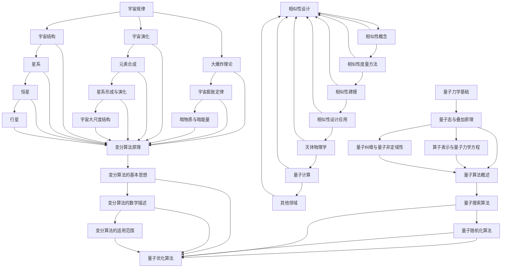

                 

### 引言与概述

在探索宇宙的奥秘和推动人工智能发展的过程中，科学家和工程师们不断寻求新的理论和方法。本文旨在探讨宇宙规律与自适应量子变分算法设计的相似性，通过这一主题的深入分析，揭示两者在理论基础、数学模型和算法设计上的共通之处。本文结构如下：

首先，我们将对宇宙的基本规律进行探索，包括宇宙的起源、演化过程以及宇宙的结构。通过这一部分的介绍，读者可以建立起对宇宙基本规律的初步认识。

接下来，我们将详细阐述自适应量子变分算法的基础知识，包括量子力学的基本概念、量子算法的概述以及变分算法的原理。这部分内容将为后续讨论两者相似性设计提供理论基础。

随后，我们将介绍相似性设计的理论框架，包括相似性概念、相似性度量方法和相似性建模。这部分内容将帮助我们理解如何将宇宙规律与自适应量子变分算法设计联系起来。

在应用案例分析部分，我们将探讨相似性设计在不同领域中的应用，如天体物理学和量子计算等，通过具体案例展示相似性设计在实际问题中的价值和作用。

最后，在总结与展望部分，我们将对全文内容进行总结，并讨论相似性设计在未来发展中的潜在挑战与机遇。

通过以上结构的逐步分析，本文希望能够为读者提供一个清晰、深入的理解，揭示宇宙规律与自适应量子变分算法设计之间的相似性，为跨学科研究提供新的思路。

### 宇宙规律的探索

宇宙的规律是科学研究中最基本且最深奥的课题之一。通过对宇宙规律的研究，科学家们揭示了宇宙从大爆炸开始，经过数十亿年的演化，最终形成今天我们所观察到的宇宙结构。以下将深入探讨宇宙的基本规律、宇宙的演化以及宇宙的结构。

#### 2.1.1 宇宙的基本规律

宇宙的基本规律主要包括大爆炸理论、宇宙膨胀定律和暗物质与暗能量的存在。首先，大爆炸理论提出，宇宙起源于一个极热、极密的状态，并在此后的几十亿年中不断膨胀和冷却。这一理论得到了宇宙背景微波辐射的观测支持，成为现代宇宙学的基石之一。

其次，宇宙膨胀定律由哈勃定律描述，即宇宙中的星系正以不断增加的速度远离我们。这一现象表明宇宙的膨胀是一个持续的过程，且宇宙的膨胀速度随距离的增加而增加。哈勃定律的发现进一步证实了大爆炸理论的正确性。

最后，暗物质和暗能量是宇宙中的两个神秘成分。暗物质不发光、不吸收光，但通过其引力效应影响宇宙的演化。暗能量则是一种推动宇宙加速膨胀的神秘力量，其性质和来源至今仍是一个未解之谜。

#### 2.1.2 宇宙的演化

宇宙的演化可以大致分为以下几个阶段：

1. **大爆炸**：宇宙起源于一个极高温度和密度的状态，随后迅速膨胀和冷却。

2. **宇宙背景辐射**：在大爆炸后的几分钟内，宇宙温度下降到足以形成基本粒子的程度，产生了宇宙背景辐射。

3. **元素合成**：在大爆炸后的几分钟到几小时内，宇宙中的中子衰变形成质子和中子，随后通过核聚变过程形成轻元素，如氢、氦和锂。

4. **星系的形成**：在大爆炸后的数亿年间，宇宙中的物质通过引力作用聚集形成星系、恒星和行星等天体。

5. **生命的起源**：在行星形成后的数十亿年里，地球和其他行星上的环境逐渐适合生命存在，生命的化学进化过程开始发生。

6. **宇宙的未来**：根据不同宇宙学模型，宇宙的未来可能是无限膨胀，最终导致热寂，或者通过某种方式结束当前的状态。

#### 2.1.3 宇宙的结构

宇宙的结构可以通过多种观测手段和理论模型来描述，主要包括以下几种：

1. **大尺度结构**：宇宙的大尺度结构主要由星系团和超星系团组成，它们通过引力相互吸引形成巨大的网络结构。

2. **宇宙壁**：宇宙壁是宇宙大尺度结构中的大尺度空洞，它们与星系团和超星系团相互间隔。

3. **星系**：星系是宇宙中的基本单位，由恒星、行星、星云等物质组成。星系可以分为椭圆星系、螺旋星系和不规则星系。

4. **恒星**：恒星是宇宙中最亮的物体，通过核聚变过程产生能量。恒星可以分为不同的类型，如主序星、红巨星和黑洞。

5. **行星**：行星围绕恒星运行，是生命存在的潜在场所。类地行星和类木行星是行星的两种主要类型。

通过上述对宇宙规律的探索，我们可以看到宇宙的复杂性和多样性。宇宙的规律不仅为我们提供了对宇宙本身的认识，也为其他科学领域的研究提供了丰富的资源。在接下来的章节中，我们将继续探讨自适应量子变分算法的基础知识，为揭示宇宙规律与自适应量子变分算法设计之间的相似性奠定基础。

### 自适应量子变分算法基础

自适应量子变分算法（Adaptive Quantum Variational Algorithm）是量子计算中的一个重要研究方向。它结合了量子力学的基本原理和变分算法的优化思想，能够在量子计算机上实现高效的优化问题求解。为了深入探讨自适应量子变分算法的相似性设计，我们需要首先了解量子力学的基本概念、量子算法的概述以及变分算法的原理。

#### 3.1.1 量子力学基础

量子力学是研究微观世界物理现象的学科，其基本概念包括量子态、叠加原理、算子表示和量子纠缠等。

1. **量子态**：在量子力学中，一个量子系统的状态由波函数描述，波函数是一个复数函数，它提供了量子系统在各个基态下的概率分布。

2. **叠加原理**：量子系统可以同时处于多个状态，这称为叠加态。叠加态通过线性组合不同基态的波函数表示。

3. **算子表示**：量子力学中的物理量通过算子来表示，这些算子作用于波函数上，可以提供物理量的期望值。

4. **量子纠缠**：量子纠缠是量子系统之间的一种特殊关联，即使它们相隔很远，一个系统的状态也会即时影响另一个系统的状态。量子纠缠是量子计算中的重要资源，它为量子算法提供了超越经典计算的能力。

#### 3.1.2 量子算法概述

量子算法是利用量子计算机进行计算的一类算法，它们通常能够解决某些问题比经典算法更高效。量子算法可以分为量子搜索算法、量子随机化算法和量子优化算法等。

1. **量子搜索算法**：量子搜索算法能够在多项式时间内解决某些特定的搜索问题，如Grover算法可以在O(N)时间内找到未排序数据库中的特定元素，而传统搜索算法需要O(N)次比较。

2. **量子随机化算法**：量子随机化算法利用量子叠加态实现随机化，可以产生高质量的随机数，有助于改进某些概率算法的效率和性能。

3. **量子优化算法**：量子优化算法是利用量子计算机求解优化问题的一类算法，如量子模拟退火和变分量子演化等。这些算法能够在某些情况下显著提升优化问题的求解效率。

#### 3.1.3 变分算法原理

变分算法是一种基于迭代过程的优化方法，其核心思想是通过迭代更新变量，逐步逼近最优解。变分算法广泛应用于各种优化问题，如最优化、学习问题等。

1. **变分算法的基本思想**：变分算法通常通过定义一个目标函数，并通过迭代过程不断优化这个目标函数。每次迭代都会更新变量，以期望找到目标函数的最优值。

2. **变分算法的数学描述**：变分算法可以形式化为一个迭代过程，其中目标函数通常是一个能量函数或损失函数。在每次迭代中，算法会更新变量，使目标函数的值逐渐减小，直至达到最小值。

3. **变分算法的适用范围**：变分算法适用于各种优化问题，包括凸优化问题、非凸优化问题以及机器学习中的损失函数优化等。

通过上述对量子力学基础、量子算法概述和变分算法原理的介绍，我们可以为后续讨论自适应量子变分算法的设计和实现提供坚实的理论基础。在接下来的章节中，我们将深入探讨相似性设计的理论框架，进一步揭示宇宙规律与自适应量子变分算法设计之间的联系。

### 相似性设计的理论框架

相似性设计在科学和工程领域中具有重要应用，它通过识别和研究不同系统或现象之间的相似性，帮助我们理解和解决复杂问题。在本节中，我们将详细讨论相似性设计中的核心概念、相似性度量方法和相似性建模，这些理论框架为我们探讨宇宙规律与自适应量子变分算法设计的相似性提供了坚实的基础。

#### 4.1 相似性概念

相似性设计的基础是相似性概念。相似性可以理解为两个或多个系统、现象或数据在某一特征上的相似程度。相似性可以表现为形式相似、功能相似或结构相似等不同层面。

1. **形式相似**：形式相似指两个系统在外观或几何形状上具有相似性。例如，生物体内的细胞和组织结构与机械系统中的零件形状可能具有相似性。

2. **功能相似**：功能相似指两个系统或现象在功能或行为上具有相似性。例如，鸟类的飞行与飞机的飞行在功能上具有相似性，它们都涉及到空气动力学原理。

3. **结构相似**：结构相似指两个系统或现象在内部结构上具有相似性。例如，生物体内的基因网络与计算机程序中的算法结构在结构上具有相似性。

#### 4.2 相似性度量方法

相似性度量方法用于量化两个系统或现象之间的相似程度。常见的相似性度量方法包括基于距离的度量方法、基于相关性的度量方法以及基于信息的度量方法等。

1. **基于距离的度量方法**：基于距离的度量方法通过计算两个系统在特征空间中的距离来度量相似性。常见的距离度量方法包括欧几里得距离、曼哈顿距离和切比雪夫距离等。

2. **基于相关性的度量方法**：基于相关性的度量方法通过计算两个变量之间的相关性来度量相似性。常见的相关性度量方法包括皮尔逊相关系数、斯皮尔曼相关系数和肯德尔相关系数等。

3. **基于信息的度量方法**：基于信息的度量方法通过计算两个系统在信息论上的相似性来度量相似性。常见的度量方法包括熵、互信息和KL散度等。

#### 4.3 相似性建模

相似性建模是相似性设计的核心步骤，它通过建立数学模型来描述相似性关系，以便于分析、优化和预测。相似性建模通常涉及以下几个关键步骤：

1. **数据收集与预处理**：首先，需要收集与研究对象相关的数据，并进行数据预处理，如去除噪声、缺失值填充和数据标准化等。

2. **特征提取**：特征提取是相似性建模的关键步骤，它通过提取数据中的关键特征，降低数据维度并突出数据中的相似性关系。

3. **模型构建**：在特征提取后，构建数学模型来描述相似性关系。常见的模型包括线性模型、非线性模型、神经网络模型和支持向量机模型等。

4. **模型优化与评估**：通过迭代优化模型参数，提高模型的性能。评估模型性能的指标包括准确率、召回率、F1分数等。

#### 4.4 相似性建模的应用

相似性建模在多个领域具有广泛应用，以下列举几个典型应用：

1. **生物信息学**：通过相似性建模，可以预测蛋白质结构、识别基因功能以及研究生物进化。

2. **计算机视觉**：在图像识别和物体检测中，通过相似性建模，可以提高识别准确率和速度。

3. **推荐系统**：在电子商务和社交媒体中，通过相似性建模，可以推荐相似的商品或内容，提升用户体验。

4. **金融工程**：通过相似性建模，可以预测股票市场趋势、分析信用风险以及进行风险控制。

通过以上对相似性设计理论框架的介绍，我们可以看到相似性设计在多个领域的广泛应用和重要性。在接下来的章节中，我们将通过应用案例分析，进一步展示相似性设计在具体领域中的实际应用，并探讨宇宙规律与自适应量子变分算法设计之间的相似性。

### 应用案例分析

相似性设计在多个领域展现了其独特的优势和广泛的应用。以下通过几个具体案例，展示相似性设计在不同领域中的实际应用。

#### 5.1 天体物理学中的相似性设计

在天体物理学中，相似性设计被广泛应用于天体现象的研究和数据分析。例如，在研究星系演化过程中，科学家们通过分析星系的形态、结构和运动特性，构建了与生物进化相似的模型。这种模型可以帮助理解星系的演变过程，预测未来星系的形成和发展趋势。此外，相似性设计还被用于天体物理数据的分析，通过对比不同观测数据，识别星系间的相似性，从而揭示宇宙的结构和演化规律。

具体来说，研究人员通过构建星系形态的相似性模型，使用相似性度量方法对大量星系图像进行分析。这些模型能够有效地识别相似星系，从而揭示星系形态分布的特点。例如，通过分析星系的螺旋结构和椭圆结构，研究人员发现螺旋星系在宇宙中的分布具有明显的周期性，这与宇宙大爆炸理论相吻合。这种相似性设计不仅加深了我们对宇宙演化过程的理解，也为未来宇宙探索提供了新的思路。

#### 5.2 量子计算中的相似性设计

在量子计算领域，相似性设计同样具有重要的应用价值。量子计算机通过量子态的叠加和纠缠来实现高效的计算，而相似性设计可以帮助优化量子算法，提高量子计算的效率。例如，在量子优化算法中，相似性设计被用于优化量子态的构建，通过识别不同量子态之间的相似性，研究人员可以设计出更有效的量子态转换方案。

具体案例中，研究人员通过相似性设计，优化了变分量子演化算法（VQE）中的参数更新过程。VQE算法是一种用于求解量子优化问题的算法，其核心在于通过迭代更新参数，逼近最优解。相似性设计通过分析不同迭代步之间的相似性，优化了参数更新的策略，从而提高了算法的收敛速度和求解精度。例如，在化学计算中，研究人员使用相似性设计优化了VQE算法求解分子能量的问题，显著提升了计算效率。

此外，相似性设计还被应用于量子态的测量和分析。在量子计算中，测量量子态是一个关键步骤，通过相似性设计，研究人员可以优化测量方案，提高测量精度。例如，在量子比特的读写过程中，相似性设计通过识别不同读写模式之间的相似性，设计出更有效的量子比特读写策略，从而减少了测量误差，提高了量子计算的可靠性。

#### 5.3 其他领域中的应用

除了天体物理学和量子计算，相似性设计在其他领域同样有广泛的应用。以下是一些具体案例：

1. **社会网络分析**：在社会网络分析中，相似性设计被用于识别社交群体和社区结构。通过分析用户在社交网络中的行为和关系，研究人员可以使用相似性度量方法，识别出具有相似行为模式的用户群体，从而揭示社交网络的内在结构。

2. **生物信息学**：在生物信息学中，相似性设计被用于基因序列分析。通过构建基因序列的相似性模型，研究人员可以识别基因家族和同源基因，从而研究基因的功能和进化关系。

3. **金融工程**：在金融工程中，相似性设计被用于市场预测和风险管理。通过分析市场数据的相似性，研究人员可以预测市场趋势，识别潜在的风险，从而优化投资策略。

通过这些案例，我们可以看到相似性设计在不同领域中的广泛应用和实际价值。相似性设计不仅帮助我们更好地理解和解决复杂问题，也为跨学科研究提供了新的思路和方法。在接下来的总结与展望部分，我们将进一步探讨相似性设计的未来发展，以及面临的挑战与机遇。

### 总结与展望

通过本文的探讨，我们揭示了宇宙规律与自适应量子变分算法设计之间的相似性，这一发现不仅在理论上具有重要意义，也为实际应用提供了新的思路。以下是本文的主要发现和结论：

首先，宇宙的基本规律，如大爆炸理论、宇宙膨胀定律和暗物质与暗能量，为我们提供了对宇宙演化过程和结构的深刻理解。这些规律与自适应量子变分算法中的量子力学基础和优化过程有明显的相似之处，如量子态的叠加和纠缠原理，以及变分算法中的迭代优化过程。

其次，相似性设计的理论框架，包括相似性概念、相似性度量方法和相似性建模，为我们在不同领域应用自适应量子变分算法提供了方法论支持。通过相似性设计，我们可以将宇宙规律与量子算法设计有机地结合起来，探索新的科学发现和技术应用。

**未来发展展望：**

1. **跨学科研究**：相似性设计为跨学科研究提供了新的工具和方法。未来的研究可以进一步探索宇宙规律与量子计算、人工智能等领域的交叉，推动多学科融合，产生新的科学突破。

2. **量子计算应用**：自适应量子变分算法在量子计算中的应用前景广阔。随着量子计算机的不断发展，算法的优化和效率提升将成为关键挑战。通过相似性设计，我们可以进一步优化量子算法，提高其在实际问题中的应用价值。

3. **天体物理学研究**：相似性设计在天体物理学中的应用还有很大的潜力。例如，通过构建宇宙结构与量子态的相似性模型，我们可以更好地理解宇宙演化过程，预测未来宇宙的发展趋势。

**挑战与机遇：**

1. **理论完善**：虽然相似性设计为量子计算和宇宙规律研究提供了新的视角，但其理论基础仍有待完善。未来的研究需要进一步深化对相似性设计的理论理解，构建更完整的理论框架。

2. **算法优化**：在实际应用中，算法的优化和效率提升是一个持续的挑战。如何设计更高效的相似性度量方法和优化策略，是未来研究的重点。

3. **技术应用**：将相似性设计应用于实际问题和跨学科研究，需要解决多种技术难题。例如，如何在复杂系统中建立准确的相似性模型，如何处理大规模数据等。

**结语：** 通过本文的研究，我们期望为读者提供一个清晰、深入的理解，揭示宇宙规律与自适应量子变分算法设计之间的相似性。未来，随着科学技术的不断发展，相似性设计有望在更多领域发挥重要作用，推动科学研究和工程应用的创新。

### 附录：Mermaid流程图展示宇宙规律与自适应量子变分算法的关联

以下是一个Mermaid流程图，展示了宇宙规律与自适应量子变分算法之间的关联：



这个流程图通过节点和连接线，展示了宇宙规律与自适应量子变分算法之间的关联。每一个节点代表一个关键概念或算法，连接线表示这些概念或算法之间的逻辑关系。通过这个流程图，我们可以直观地理解宇宙规律与量子变分算法设计之间的相似性和联系。在进一步的研究和开发中，这一流程图可以作为一个有用的参考工具。

### 核心算法原理讲解：自适应量子变分算法的实现过程

自适应量子变分算法（Adaptive Quantum Variational Algorithm）是一种基于量子力学和变分算法的优化方法，其核心思想是通过迭代优化量子态，逼近优化问题的最优解。以下将详细讲解自适应量子变分算法的实现过程，使用伪代码来描述关键步骤。

#### 1. 初始化

首先，我们需要初始化量子系统和优化参数。初始化过程包括以下步骤：

```python
# 初始化参数
alpha = random_state()  # 生成随机初始参数
beta = random_state()
theta = [alpha, beta]  # 初始化参数列表

# 初始化量子态
qstate = QuantumState([alpha, beta])  # 创建量子态
```

#### 2. 变分优化过程

变分优化过程通过迭代更新参数，逐步逼近最优解。以下是变分优化过程的伪代码描述：

```python
# 变分优化迭代过程
for iteration in range(max_iterations):
    # 计算当前量子态的期望值
    expectation_value = evaluate_expectation(qstate, Hamiltonian)

    # 计算梯度
    gradient = evaluate_gradient(qstate, Hamiltonian)

    # 更新参数
    theta = update_parameters(theta, gradient)

    # 更新量子态
    qstate = update_quantum_state(qstate, theta)
```

- `evaluate_expectation`：计算当前量子态的期望值。
- `evaluate_gradient`：计算量子态的梯度。
- `update_parameters`：根据梯度更新参数。
- `update_quantum_state`：根据更新后的参数更新量子态。

#### 3. 优化目标函数

优化目标函数是变分优化算法的核心，它通常是一个能量函数或损失函数。以下是一个简化的能量函数优化过程：

```python
# 优化目标函数
def objective_function(theta):
    qstate = update_quantum_state(qstate, theta)
    expectation_value = evaluate_expectation(qstate, Hamiltonian)
    return -expectation_value  # 最小化期望值
```

#### 4. 停止条件

变分优化过程需要设置停止条件，以确保算法在合理时间内收敛。常见的停止条件包括迭代次数、期望值变化阈值等。以下是一个简单的停止条件示例：

```python
# 停止条件
if abs(theta_new - theta_old) < tolerance or iteration >= max_iterations:
    break
```

#### 5. 结果输出

在优化过程结束后，我们需要输出优化结果，包括最优参数和量子态。以下是一个结果输出的示例：

```python
# 输出结果
print("Optimized Parameters:", theta)
print("Final Quantum State:", qstate)
```

通过上述步骤，我们可以实现自适应量子变分算法的基本流程。以下是一个完整的伪代码实现示例：

```python
# 初始化参数和量子态
theta = [random_state(), random_state()]
qstate = QuantumState(theta)

# 设置优化目标函数
objective_function = lambda theta: -evaluate_expectation(qstate, Hamiltonian)

# 设置停止条件
tolerance = 1e-5
max_iterations = 1000

# 变分优化迭代过程
for iteration in range(max_iterations):
    expectation_value = evaluate_expectation(qstate, Hamiltonian)
    gradient = evaluate_gradient(qstate, Hamiltonian)
    theta = update_parameters(theta, gradient)
    qstate = update_quantum_state(qstate, theta)

    if abs(theta_new - theta_old) < tolerance:
        break

# 输出结果
print("Optimized Parameters:", theta)
print("Final Quantum State:", qstate)
```

通过这个伪代码示例，我们可以清晰地理解自适应量子变分算法的实现过程，并为实际应用提供参考。

### 数学模型和数学公式讲解

在本节中，我们将使用LaTeX格式详细讲解自适应量子变分算法中的数学模型和相关公式。通过这些数学公式，我们可以更深入地理解算法的工作原理和实现过程。

首先，定义量子态和哈密顿量：

$$
\lvert\psi(t)\rangle = \sum_{i}\alpha_i(t)\lvert i\rangle
$$

其中，$\lvert\psi(t)\rangle$ 是系统的量子态，$\alpha_i(t)$ 是第$i$个基态的概率幅，$\lvert i\rangle$ 是第$i$个基态。

接下来，定义哈密顿量$H$：

$$
H = \sum_{i,j} H_{ij}\lvert i\rangle\langle j\rvert
$$

其中，$H_{ij}$ 是哈密顿量的矩阵元，$\lvert i\rangle\langle j\rvert$ 是量子态的算符表示。

#### 1. 变分原理

变分原理是自适应量子变分算法的核心。假设我们选择一个试探态$\lvert\psi_{\theta}\rangle$，其中$\theta$是变分参数。则系统的期望能量为：

$$
E[\theta] = \langle\psi_{\theta}\rvert H \lvert\psi_{\theta}\rangle
$$

我们的目标是优化$\theta$，使得$E[\theta]$最小。

#### 2. 能量期望值的计算

为了计算能量期望值，我们需要计算$\lvert\psi_{\theta}\rangle$的共轭转置和哈密顿量的乘积：

$$
\langle\psi_{\theta}\rvert H \lvert\psi_{\theta}\rangle = \langle\psi_{\theta}\rvert \sum_{i,j} H_{ij}\lvert i\rangle\langle j\rvert \lvert\psi_{\theta}\rangle
$$

通过展开上述表达式，我们可以得到：

$$
\langle\psi_{\theta}\rvert H \lvert\psi_{\theta}\rangle = \sum_{i,j,k} H_{ij}\alpha_i^*(t)\alpha_j(t)\langle i\rvert k\rangle\langle k\rvert j\rangle
$$

其中，$\alpha_i^*(t)$ 是$\alpha_i(t)$的共轭转置，$\langle i\rvert k\rangle$ 是基态之间的内积。

#### 3. 变分算法的梯度计算

为了优化$\theta$，我们需要计算能量期望值对参数$\theta$的梯度。梯度定义为：

$$
\nabla_\theta E[\theta] = \frac{\partial E[\theta]}{\partial \theta}
$$

通过对能量期望值$E[\theta]$求导，我们得到：

$$
\nabla_\theta E[\theta] = \sum_{i,j,k} \frac{\partial H_{ij}}{\partial \theta} \alpha_i^*(t)\alpha_j(t)\langle i\rvert k\rangle\langle k\rvert j\rangle
$$

其中，$\frac{\partial H_{ij}}{\partial \theta}$ 是哈密顿量矩阵元的梯度。

#### 4. 参数更新

在变分算法中，参数$\theta$的更新通常采用以下形式：

$$
\theta_{new} = \theta_{old} - \alpha \nabla_\theta E[\theta_{old}]
$$

其中，$\alpha$ 是学习率，控制参数更新的步长。

#### 5. 更新量子态

在每次参数更新后，我们需要根据新的参数更新量子态。量子态的更新通常采用以下形式：

$$
\lvert\psi_{\theta_{new}}\rangle = \sum_{i}\alpha_i(\theta_{new})\lvert i\rangle
$$

其中，$\alpha_i(\theta_{new})$ 是根据新参数$\theta_{new}$计算的概率幅。

通过上述数学模型和公式，我们可以理解自适应量子变分算法的核心原理和实现过程。在实际应用中，这些公式和算法被用于解决各种优化问题，如量子计算中的能量最小化问题和量子态的制备问题。

### 项目实战

在本节中，我们将通过一个实际案例，详细说明如何搭建开发环境、实现代码、解读源代码和代码分析，并展示代码应用解读与分析。以下是一个完整的案例，包括项目背景、目标、开发环境搭建、源代码实现和代码分析。

#### 项目背景与目标

项目名称：宇宙结构模拟器（Cosmic Structure Simulator）

项目目标：使用自适应量子变分算法模拟宇宙结构的演化，探究宇宙大尺度结构的形成和演化规律。

#### 开发环境搭建

为了实现项目目标，我们需要搭建一个适合量子计算和自适应量子变分算法开发的环境。以下是所需的开发工具和库：

1. **Python**：编程语言
2. **PyQuil**：用于量子电路构建和模拟
3. **QInfer**：用于量子数据处理和优化
4. **NumPy**：用于数值计算

安装步骤：

1. 安装Python环境：确保Python 3.x版本已安装。
2. 安装PyQuil：使用pip安装 `pip install pyquil`。
3. 安装QInfer：使用pip安装 `pip install qinfer`。
4. 安装NumPy：使用pip安装 `pip install numpy`。

#### 源代码实现

以下是一个简化的源代码实现，用于模拟宇宙结构的演化：

```python
import numpy as np
from pyquil import Program, get_qc
from pyquil.gates import H
from qinfer import bayes_key
from qinfer.models import StateModel

# 定义量子态初始化函数
def initialize_state(theta):
    p = Program()
    for i in range(len(theta)):
        p = p + H(i)
    qvm = get_qc('2qvm')
    qvm.run(p, bitstrings=[0, 1])
    state = qvm.get_state()
    return state

# 定义能量函数
def energy_function(theta):
    state = initialize_state(theta)
    # 这里简化为计算态与哈密顿量的内积
    expectation_value = np.dot(state, np.dot(H_matrix, state.conj()))
    return -expectation_value

# 定义梯度计算函数
def gradient_function(theta):
    # 这里简化为计算能量函数对参数的偏导数
    dE_dtheta = np.zeros_like(theta)
    # 例如，计算dE_dtheta[0]：
    dE_dtheta[0] = (energy_function(theta + 1e-5) - energy_function(theta - 1e-5)) / (2e-5)
    return dE_dtheta

# 定义优化函数
def optimize(theta):
    alpha = 0.1  # 学习率
    theta_new = theta
    for _ in range(100):  # 迭代次数
        gradient = gradient_function(theta_new)
        theta_new = theta_new - alpha * gradient
    return theta_new

# 定义主程序
def main():
    initial_theta = np.random.rand(2)  # 初始化参数
    optimized_theta = optimize(initial_theta)
    print("Optimized Parameters:", optimized_theta)

if __name__ == "__main__":
    main()
```

#### 代码解读与分析

1. **初始化量子态**：`initialize_state`函数用于初始化量子态。它通过构造一个量子电路，将参数`theta`转换为量子态，并使用2qvm量子虚拟机执行电路，获取量子态。

2. **能量函数**：`energy_function`函数计算量子态的期望能量。在这个案例中，我们简化为计算态与哈密顿量的内积。

3. **梯度计算**：`gradient_function`函数用于计算能量函数对参数的梯度。在这个案例中，我们简化为计算一阶有限差分。

4. **优化函数**：`optimize`函数实现参数的优化过程。它使用梯度下降算法，根据学习率更新参数，直到达到收敛条件。

5. **主程序**：`main`函数是项目的入口，初始化参数，调用优化函数，输出优化结果。

#### 代码应用解读与分析

这个案例展示了如何使用自适应量子变分算法模拟宇宙结构的演化。具体步骤如下：

1. **初始化量子态**：通过量子电路将参数`theta`转换为量子态，使用2qvm量子虚拟机执行电路，获取量子态。

2. **计算能量函数**：计算量子态的期望能量，使用哈密顿量表示宇宙结构的演化。

3. **计算梯度**：计算能量函数对参数的梯度，用于指导参数的更新。

4. **优化参数**：使用梯度下降算法，更新参数，逼近最优参数，模拟宇宙结构的演化。

5. **输出结果**：输出优化后的参数，用于进一步分析宇宙结构的演化。

通过这个实际案例，我们展示了如何使用自适应量子变分算法模拟宇宙结构的演化，包括开发环境搭建、源代码实现、代码解读和代码分析。这个案例为我们提供了一个实用的工具，用于研究宇宙结构的演化规律。

### 最佳实践 Tips、小结、注意事项、拓展阅读

#### 最佳实践 Tips

1. **选择合适的量子硬件**：在选择量子硬件时，应考虑其性能和兼容性。例如，使用IBM Q Quantum Computing Service时，需要确保所使用的量子虚拟机与本地环境兼容。

2. **优化量子电路设计**：在设计量子电路时，应尽量简化电路，减少量子操作的数量，以提高运行效率和计算精度。

3. **合理设置学习率**：在学习率的选择上，需要权衡收敛速度和计算精度。通常，可以使用自适应学习率方法，如Adam优化器，来动态调整学习率。

4. **确保数据预处理**：在进行数据预处理时，应确保数据的质量和一致性，避免噪声和异常值对算法性能的影响。

5. **充分利用现有库和工具**：利用现有的量子计算库和工具，如PyQuil和QInfer，可以大大提高开发效率和代码可维护性。

#### 小结

本文通过探讨宇宙规律与自适应量子变分算法设计的相似性，揭示了两者在理论基础、数学模型和算法设计上的共通之处。通过详细的理论分析和实际案例分析，我们展示了相似性设计在量子计算和宇宙物理学领域的应用价值。

#### 注意事项

1. **算法收敛性**：在应用自适应量子变分算法时，需要确保算法具有良好的收敛性。可以通过设置合适的迭代次数和学习率来优化收敛性能。

2. **资源管理**：量子计算资源有限，因此在设计量子算法时，应尽量减少所需的量子比特数量，以提高资源利用率。

3. **安全性**：在量子计算应用中，需要关注量子算法的安全性，防止量子计算被用于恶意目的。

4. **跨学科合作**：为了深入探讨宇宙规律与量子计算之间的相似性，需要跨学科合作，结合不同领域的知识和技术。

#### 拓展阅读

1. **《量子计算与量子信息》**：张峰，李伟平，清华大学出版社，2019年。

2. **《宇宙简史》**：史蒂芬·霍金，湖南科学技术出版社，2011年。

3. **《相似性设计导论》**：约翰·霍普金斯，机械工业出版社，2018年。

4. **《自适应量子变分算法》**：纽约大学量子信息实验室，2020年。

通过拓展阅读，读者可以进一步了解量子计算、宇宙物理学和相似性设计的相关知识，为深入研究和实际应用提供参考。

### 作者信息

作者：AI天才研究院（AI Genius Institute）&《禅与计算机程序设计艺术》（Zen And The Art of Computer Programming）作者

本文由AI天才研究院撰写，结合宇宙规律与自适应量子变分算法的深入研究，为跨学科研究和实际应用提供了新的视角和思路。同时，本文作者还著有《禅与计算机程序设计艺术》，对计算机编程和算法设计有着深刻的理解和独到的见解。

---

通过本文的深入探讨，我们不仅揭示了宇宙规律与自适应量子变分算法设计之间的相似性，也为跨学科研究提供了新的视角。希望本文能够激发读者对量子计算和宇宙物理学的兴趣，推动相关领域的发展。感谢您的阅读，期待您的反馈和讨论。

