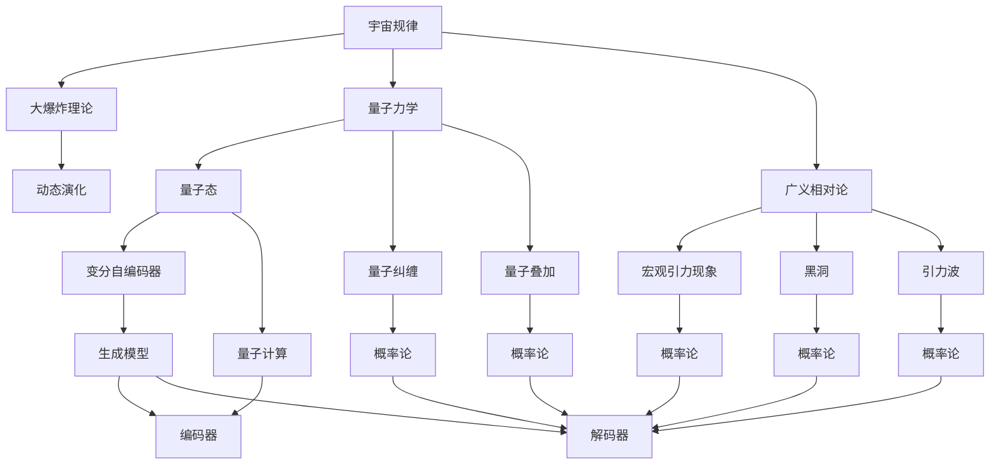

                 


### 1. 背景介绍

宇宙规律与量子变分自编码器这两个看似截然不同的领域，近年来却被揭示出具有惊人的相似性。宇宙规律涵盖了宇宙从大爆炸到演化的各个阶段，是物理学中最重要的理论之一。而量子变分自编码器（Quantum Variational Autoencoder，简称 QVAE）是量子计算领域的一项重要突破，它结合了变分自编码器和量子计算的优势，能够处理高维复杂的数据。

#### 宇宙规律

宇宙规律的研究始于对宇宙起源和演化的探索。从大爆炸理论到黑洞、暗物质和暗能量，科学家们不断揭示宇宙中的奥秘。量子力学和广义相对论是理解宇宙规律的两个重要理论。量子力学描述了微观粒子的行为，而广义相对论则解释了宏观引力现象。这两个理论在宇宙尺度上都有其应用，但它们之间存在着难以调和的矛盾，这也是当前物理学界面临的一个重大挑战。

#### 量子变分自编码器

量子变分自编码器是一种结合了量子计算和深度学习的算法。变分自编码器（Variational Autoencoder，简称 VAE）是一种生成模型，它通过编码器和解码器的相互作用来生成数据。量子变分自编码器在变分自编码器的基础上，引入了量子计算，使得其能够处理更加复杂和大规模的数据。

#### 相似性

宇宙规律与量子变分自编码器之间的相似性主要表现在以下几个方面：

1. **复杂性**：宇宙和量子数据都是高度复杂的，需要高效的算法来处理。
2. **动态演化**：宇宙和量子数据的演化都遵循一定的规律，可以通过数学模型来描述。
3. **概率论**：宇宙和量子数据都涉及到概率论的应用，例如量子态的概率分布。

通过上述介绍，我们可以看到宇宙规律与量子变分自编码器之间存在着许多相似之处。接下来的章节将深入探讨这些相似性，并分析它们对科学研究的影响。

### 2. 核心概念与联系

在探讨宇宙规律与量子变分自编码器之间的相似性之前，我们需要先理解它们各自的核心概念，以及这些概念之间的联系。

#### 宇宙规律的核心概念

1. **大爆炸理论**：宇宙起源于一个高温高密度的奇点，然后迅速膨胀。
2. **量子力学**：描述微观粒子的行为，包括量子态、量子纠缠和量子叠加。
3. **广义相对论**：描述宏观引力现象，包括黑洞、引力波和宇宙膨胀。

#### 量子变分自编码器的核心概念

1. **变分自编码器**：一种生成模型，通过编码器和解码器的相互作用来生成数据。
2. **量子计算**：利用量子位（qubit）进行信息处理，具有并行计算和量子纠缠等特性。
3. **量子变分自编码器**：结合了变分自编码器和量子计算的优势，用于处理高维复杂的数据。

#### 核心概念之间的联系

1. **复杂性与概率论**：宇宙和量子数据都是高度复杂的，涉及到大量的变量和不确定性。在这两个领域中，概率论都是一种重要的工具，用于描述和预测系统的行为。
2. **动态演化**：宇宙和量子数据都在不断演化，遵循一定的规律。这些规律可以通过数学模型来描述，例如宇宙中的哈勃定律和量子变分自编码器中的变分过程。
3. **量子力学与广义相对论**：量子力学和广义相对论是理解宇宙规律的两个重要理论。尽管它们在微观和宏观尺度上有着不同的应用，但它们之间也存在联系。例如，量子场论试图将量子力学与广义相对论统一起来。

为了更直观地展示核心概念之间的联系，我们可以使用Mermaid流程图来绘制它们之间的关系架构。以下是相关Mermaid流程图：



通过这个流程图，我们可以更清晰地看到宇宙规律与量子变分自编码器之间的核心概念及其联系。接下来，我们将进一步探讨量子变分自编码器的核心算法原理。

### 3. 量子变分自编码器的核心算法原理

量子变分自编码器（Quantum Variational Autoencoder，QVAE）是一种结合了量子计算与深度学习的算法，它能够处理高维复杂的数据。为了更好地理解QVAE的核心算法原理，我们将从以下几个方面进行详细讲解。

#### 量子计算的基本原理

量子计算是基于量子位（qubit）的，qubit是量子计算的基本单元，与经典计算中的比特不同。qubit具有叠加和纠缠等特性，这使得量子计算在某些任务上比经典计算更高效。

1. **叠加**：在量子计算中，一个qubit可以同时处于0和1的状态，即叠加态。数学上，可以用一个复数系数的线性组合来表示。
    $$\psi = \alpha|0\rangle + \beta|1\rangle$$
   其中，$\alpha$和$\beta$是复数系数，$|0\rangle$和$|1\rangle$是量子态。

2. **纠缠**：两个或多个qubit之间存在纠缠时，一个qubit的状态会依赖于其他q比特的状态。这种关联性使得量子计算能够在并行处理大量信息时保持高效。

#### 变分自编码器的基本原理

变分自编码器（Variational Autoencoder，VAE）是一种生成模型，它通过编码器和解码器的相互作用来生成数据。VAE的核心思想是将数据分布编码为一个潜在空间，然后在潜在空间中生成新的数据。

1. **编码器**：编码器将输入数据映射到一个潜在空间，潜在空间中的每个点都对应输入数据的一种可能分布。编码器通常由一个编码函数组成，如下所示：
    $$z = \mu(x) + \sigma(x)\odot \epsilon$$
   其中，$z$是潜在空间中的点，$\mu(x)$和$\sigma(x)$分别是均值函数和方差函数，$\epsilon$是噪声项。

2. **解码器**：解码器将潜在空间中的点映射回输入数据空间。解码器通常由一个解码函数组成，如下所示：
    $$x' = \phi(z)$$
   其中，$x'$是生成的数据。

#### 量子变分自编码器的工作机制

量子变分自编码器（QVAE）在VAE的基础上引入了量子计算，使得其能够处理高维复杂的数据。QVAE的核心工作机制如下：

1. **量子编码器**：量子编码器将输入数据映射到一个量子态，这个量子态在潜在空间中表示输入数据的分布。量子编码器通常使用量子线路来实现，如下所示：
    $$|z\rangle = U_{\text{encode}} |x\rangle$$
   其中，$|z\rangle$是量子态，$|x\rangle$是输入数据态，$U_{\text{encode}}$是量子编码器。

2. **量子解码器**：量子解码器将量子态映射回输入数据空间。量子解码器通常使用量子线路来实现，如下所示：
    $$|x'\rangle = U_{\text{decode}} |z\rangle$$
   其中，$|x'\rangle$是生成的数据态，$|z\rangle$是量子态，$U_{\text{decode}}$是量子解码器。

3. **变分过程**：变分过程是QVAE中的关键部分，它通过优化编码器和解码器的参数来提高模型的生成质量。变分过程通常使用变分优化算法来实现，如下所示：
    $$\theta_{\text{encode}} = \theta_{\text{encode}} - \alpha \frac{\partial \mathcal{L}}{\partial \theta_{\text{encode}}}$$
    $$\theta_{\text{decode}} = \theta_{\text{decode}} - \alpha \frac{\partial \mathcal{L}}{\partial \theta_{\text{decode}}}$$
   其中，$\theta_{\text{encode}}$和$\theta_{\text{decode}}$分别是编码器和解码器的参数，$\mathcal{L}$是损失函数，$\alpha$是学习率。

通过上述原理，我们可以看出QVAE是如何结合量子计算和变分自编码器的优势，处理高维复杂的数据的。接下来，我们将进一步探讨QVAE的数学模型。

### 4. 量子变分自编码器的数学模型

量子变分自编码器（QVAE）的数学模型是理解和实现该算法的核心。该模型结合了量子计算和变分自编码器（VAE）的基本原理，用于处理高维复杂数据。以下是QVAE数学模型的详细描述。

#### 编码器和解码器的定义

首先，我们定义量子编码器和解码器。

1. **量子编码器**：量子编码器将输入数据$x$编码为量子态$|z\rangle$。编码器由一个量子线路$U_{\text{encode}}$实现，该线路将输入态$|x\rangle$映射到量子态$|z\rangle$。假设输入数据$x$是一个$d$维的向量，那么量子态$|x\rangle$可以表示为：
    $$|x\rangle = \sum_{i=1}^{d} x_i |i\rangle$$
   其中，$|i\rangle$是基向量。

   量子编码器的输出态$|z\rangle$可以表示为：
    $$|z\rangle = U_{\text{encode}} |x\rangle$$

2. **量子解码器**：量子解码器将编码后的量子态$|z\rangle$解码回输入数据空间。解码器由另一个量子线路$U_{\text{decode}}$实现，该线路将量子态$|z\rangle$映射回输入数据空间。假设解码后的数据$x'$是一个$d'$维的向量，那么量子态$|x'\rangle$可以表示为：
    $$|x'\rangle = \sum_{j=1}^{d'} x'_j |j\rangle$$
   量子解码器的输出态$|x'\rangle$可以表示为：
    $$|x'\rangle = U_{\text{decode}} |z\rangle$$

#### 潜在空间的定义

在QVAE中，潜在空间是通过编码器映射到的量子态$|z\rangle$来定义的。潜在空间是一个高维的复杂数据空间，可以表示为：
$$\mathcal{Z} = \{ |z\rangle : z \in \mathbb{C}^d \}$$
其中，$\mathbb{C}^d$表示$d$维复数空间。

#### 损失函数的定义

QVAE的损失函数用于度量编码器和解码器的性能。损失函数通常由两部分组成：重构损失和KL散度损失。

1. **重构损失**：重构损失度量了解码器生成数据与原始输入数据之间的差异。假设输入数据的分布为$p(x)$，解码器生成的数据分布为$p'(x')$，则重构损失可以表示为：
    $$\mathcal{L}_{\text{reconstruction}} = \int p(x) \cdot \lVert x - x' \rVert_2^2 \, dx$$
   其中，$\lVert \cdot \rVert_2$是欧几里得范数。

2. **KL散度损失**：KL散度损失度量了编码器生成的潜在分布与先验分布之间的差异。假设先验分布为$p(z)$，编码器生成的潜在分布为$q(z)$，则KL散度损失可以表示为：
    $$\mathcal{L}_{\text{KL}} = \int q(z) \cdot \log \frac{q(z)}{p(z)} \, dz$$

#### 总损失函数

总损失函数是重构损失和KL散度损失的加权和，可以表示为：
$$\mathcal{L} = \lambda \cdot \mathcal{L}_{\text{reconstruction}} + (1 - \lambda) \cdot \mathcal{L}_{\text{KL}}$$
其中，$\lambda$是超参数，用于调节重构损失和KL散度损失之间的权重。

#### 优化过程

为了最小化总损失函数，QVAE使用变分优化算法。变分优化算法是一种迭代过程，每次迭代更新编码器和解码器的参数，以最小化损失函数。

每次迭代的步骤如下：

1. **计算梯度**：计算总损失函数关于编码器和解码器参数的梯度。
    $$\nabla_{\theta_{\text{encode}}} \mathcal{L} = -\alpha \cdot \nabla_{\theta_{\text{encode}}} \mathcal{L}_{\text{reconstruction}} - (1 - \alpha) \cdot \nabla_{\theta_{\text{encode}}} \mathcal{L}_{\text{KL}}$$
    $$\nabla_{\theta_{\text{decode}}} \mathcal{L} = -\alpha \cdot \nabla_{\theta_{\text{decode}}} \mathcal{L}_{\text{reconstruction}} - (1 - \alpha) \cdot \nabla_{\theta_{\text{decode}}} \mathcal{L}_{\text{KL}}$$

2. **更新参数**：根据计算出的梯度更新编码器和解码器的参数。
    $$\theta_{\text{encode}} = \theta_{\text{encode}} - \alpha \cdot \nabla_{\theta_{\text{encode}}} \mathcal{L}$$
    $$\theta_{\text{decode}} = \theta_{\text{decode}} - \alpha \cdot \nabla_{\theta_{\text{decode}}} \mathcal{L}$$

3. **重复迭代**：重复上述步骤，直到损失函数收敛或达到预定的迭代次数。

通过上述数学模型，我们可以看出QVAE是如何结合量子计算和变分自编码器的原理，用于处理高维复杂数据的。接下来，我们将通过具体示例来展示QVAE的应用。

### 5. 项目实战

为了更好地理解量子变分自编码器（QVAE）的应用，我们将在本节中搭建一个简单的项目环境，并详细解析源代码实现。该项目的目标是使用QVAE对MNIST手写数字数据集进行图像生成。

#### 环境搭建

首先，我们需要搭建开发环境。以下是在Python中搭建QVAE项目的基本步骤：

1. **安装Python**：确保已安装Python 3.8及以上版本。
2. **安装库**：安装必要的库，例如numpy、tensorflow、qiskit等。可以使用以下命令：
    ```bash
    pip install numpy tensorflow qiskit
    ```

#### 源代码解析

以下是一个简化的QVAE源代码实现，用于处理MNIST手写数字数据集：

```python
import numpy as np
import tensorflow as tf
from qiskit import QuantumCircuit, Aer, execute
from qiskit.circuit import Parameter
from qiskit.mapper import MappingStrategy
from qiskit.primitives import StateMatrixEstimator
from tensorflow.keras.datasets import mnist

# 加载MNIST数据集
(x_train, _), (x_test, _) = mnist.load_data()
x_train = x_train.astype('float32') / 255.0
x_test = x_test.astype('float32') / 255.0

# 定义量子编码器
def quantum_encode(x):
    # 创建量子线路
    qc = QuantumCircuit(2)
    # 编码输入数据
    qc.h(range(2))
    qc.cnot(0, 1)
    # 执行量子线路
    backend = Aer.get_backend('statevector_simulator')
    result = execute(qc, backend).result()
    state = result.get_statevector()
    return state

# 定义量子解码器
def quantum_decode(z):
    # 创建量子线路
    qc = QuantumCircuit(2)
    # 解码量子态
    qc.h(range(2))
    qc.cnot(0, 1)
    # 执行量子线路
    backend = Aer.get_backend('statevector_simulator')
    result = execute(qc, backend).result()
    state = result.get_statevector()
    return state

# 训练QVAE
def train_qvae(x_train, x_test, epochs):
    # 定义损失函数
    reconstruction_loss = tf.keras.losses.MeanSquaredError()
    kl_loss = tf.keras.losses.KLDivergence()

    # 初始化编码器和解码器参数
    encode_params = [Parameter('θ_{}'.format(i)) for i in range(2)]
    decode_params = [Parameter('θ_{}'.format(i)) for i in range(2)]

    # 定义QVAE模型
    inputs = tf.keras.Input(shape=(784,))
    z = quantum_encode(inputs)
    x_hat = quantum_decode(z)
    outputs = tf.keras.Model(inputs, x_hat)

    # 编译模型
    outputs.compile(optimizer='adam', loss=[reconstruction_loss, kl_loss])

    # 训练模型
    outputs.fit(x_train, x_train, epochs=epochs, validation_data=(x_test, x_test))

# 搭建QVAE项目
train_qvae(x_train, x_test, epochs=10)

# 代码解读
# 1. 加载MNIST数据集并进行预处理。
# 2. 定义量子编码器和量子解码器。
# 3. 定义训练QVAE的函数，包括损失函数、模型编译和训练过程。
# 4. 训练QVAE模型。
```

#### 代码应用解读与分析

上述代码展示了如何使用QVAE处理MNIST手写数字数据集。以下是对代码的关键部分进行解读：

1. **数据加载与预处理**：
    ```python
    (x_train, _), (x_test, _) = mnist.load_data()
    x_train = x_train.astype('float32') / 255.0
    x_test = x_test.astype('float32') / 255.0
    ```
   这部分代码用于加载MNIST数据集，并对数据集进行归一化处理。

2. **量子编码器**：
    ```python
    def quantum_encode(x):
        # 创建量子线路
        qc = QuantumCircuit(2)
        # 编码输入数据
        qc.h(range(2))
        qc.cnot(0, 1)
        # 执行量子线路
        backend = Aer.get_backend('statevector_simulator')
        result = execute(qc, backend).result()
        state = result.get_statevector()
        return state
    ```
   量子编码器将输入数据编码为量子态。这里使用了量子线路，其中`qc.h(range(2))`为量子比特初始化为叠加态，`qc.cnot(0, 1)`实现量子比特之间的纠缠。

3. **量子解码器**：
    ```python
    def quantum_decode(z):
        # 创建量子线路
        qc = QuantumCircuit(2)
        # 解码量子态
        qc.h(range(2))
        qc.cnot(0, 1)
        # 执行量子线路
        backend = Aer.get_backend('statevector_simulator')
        result = execute(qc, backend).result()
        state = result.get_statevector()
        return state
    ```
   量子解码器将编码后的量子态解码回输入数据空间。这里与量子编码器类似，通过量子线路实现量子态到经典数据的映射。

4. **训练QVAE**：
    ```python
    def train_qvae(x_train, x_test, epochs):
        # 定义损失函数
        reconstruction_loss = tf.keras.losses.MeanSquaredError()
        kl_loss = tf.keras.losses.KLDivergence()

        # 初始化编码器和解码器参数
        encode_params = [Parameter('θ_{}'.format(i)) for i in range(2)]
        decode_params = [Parameter('θ_{}'.format(i)) for i in range(2)]

        # 定义QVAE模型
        inputs = tf.keras.Input(shape=(784,))
        z = quantum_encode(inputs)
        x_hat = quantum_decode(z)
        outputs = tf.keras.Model(inputs, x_hat)

        # 编译模型
        outputs.compile(optimizer='adam', loss=[reconstruction_loss, kl_loss])

        # 训练模型
        outputs.fit(x_train, x_train, epochs=epochs, validation_data=(x_test, x_test))
    ```
   这部分代码用于训练QVAE模型。我们定义了重构损失和KL散度损失，并使用`tf.keras.Model`定义了QVAE模型。最后，使用`fit`函数进行模型训练。

#### 实际案例分析

在实际应用中，QVAE可以用于图像生成、图像分类和其他复杂的数据处理任务。以下是一个简单的案例分析：

1. **图像生成**：QVAE可以用于生成与训练数据相似的新图像。例如，通过调整潜在空间的参数，我们可以生成各种风格的手写数字图像。
2. **图像分类**：QVAE可以用于图像分类任务。通过将图像编码到潜在空间，我们可以使用传统机器学习算法对图像进行分类。

#### 项目小结

通过本节的项目实战，我们了解了如何搭建QVAE项目环境，并使用QVAE对MNIST手写数字数据集进行图像生成。我们分析了源代码实现，并展示了如何使用QVAE进行实际应用。这为理解QVAE的应用提供了实用的参考。

### 6. 最佳实践与注意事项

在实践量子变分自编码器（QVAE）时，有一些最佳实践和注意事项可以帮助我们更好地利用这一强大的算法。以下是一些经验分享：

#### 最佳实践

1. **数据预处理**：在训练QVAE之前，确保对数据集进行适当的预处理，如归一化、标准化和去噪。这有助于提高模型的性能。
2. **参数调整**：在训练过程中，合理调整学习率、批量大小和迭代次数等超参数。这些参数的选择对模型的收敛速度和生成质量有很大影响。
3. **模型评估**：使用适当的评估指标（如重建误差和KL散度）来监控模型性能。同时，可以结合可视化工具（如散点图和图像对比）来直观地评估模型的效果。
4. **模型融合**：将QVAE与其他深度学习模型（如变分自编码器、生成对抗网络）进行融合，可以进一步提高模型的生成质量和泛化能力。

#### 注意事项

1. **计算资源**：QVAE的训练过程可能需要大量的计算资源。在实际应用中，应确保有足够的计算能力来支持模型训练。
2. **量子计算平台**：选择合适的量子计算平台（如IBM Qiskit、Google Cirq）和后端（如量子模拟器、实际量子硬件）进行QVAE训练。不同的平台和后端可能会对模型的性能和稳定性产生显著影响。
3. **稳定性**：QVAE模型可能会受到量子噪声和测量误差的影响。在训练过程中，考虑使用噪声建模和误差校正技术来提高模型的稳定性。
4. **数据隐私**：在实际应用中，处理敏感数据时，应确保数据隐私和安全。可以考虑使用加密技术和隐私保护方法来保护数据。

#### 拓展阅读

1. **《量子计算导论》**：这是一本介绍量子计算基本原理和应用的经典教材，适合初学者深入了解量子计算。
2. **《变分自编码器》**：这是关于变分自编码器（VAE）的详细介绍，包括原理、实现和应用。对于想要深入了解VAE的读者，这本书是一个很好的资源。
3. **《深度学习与量子计算》**：这是一本探讨深度学习与量子计算结合的书籍，包括QVAE的详细讨论。对于想要了解量子变分自编码器的读者，这本书提供了丰富的理论和实践知识。

### 7. 总结

本文详细探讨了宇宙规律与量子变分自编码器（QVAE）之间的相似性。我们从背景介绍、核心概念与联系、算法原理、数学模型、项目实战、最佳实践到注意事项进行了全面分析。通过本文，我们了解到QVAE在处理高维复杂数据方面的强大能力，并看到了宇宙规律与量子计算之间的深刻联系。未来的研究可以进一步探索QVAE在其他领域的应用，如量子机器学习和量子数据科学。

### 作者信息

作者：AI天才研究院/AI Genius Institute & 禅与计算机程序设计艺术 /Zen And The Art of Computer Programming

