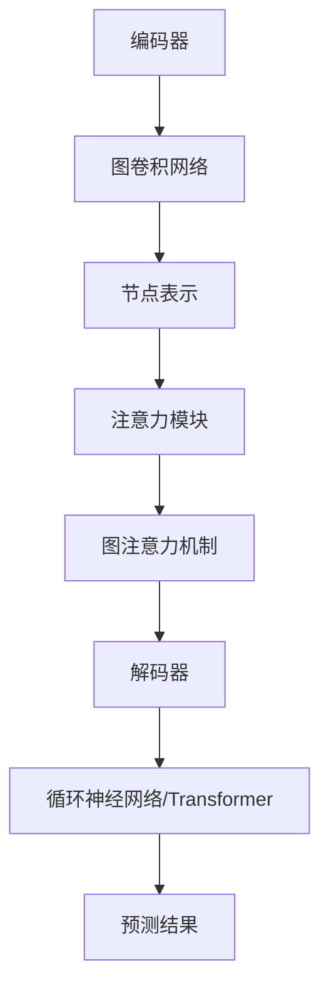
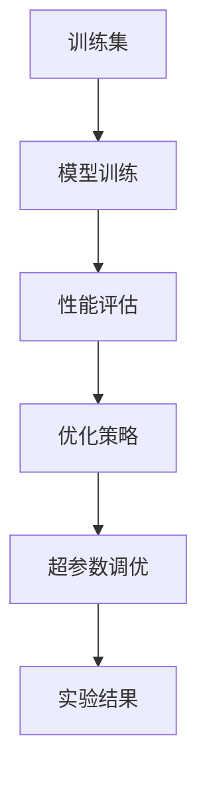
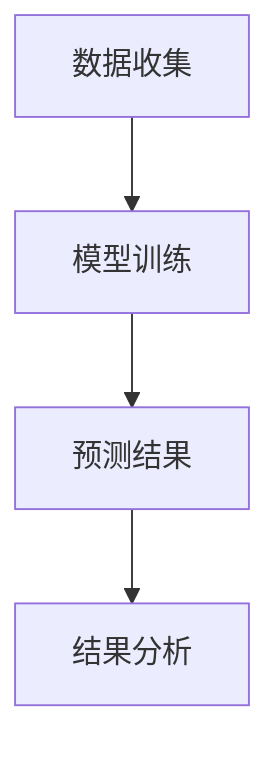
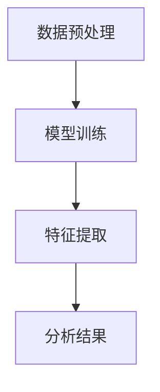
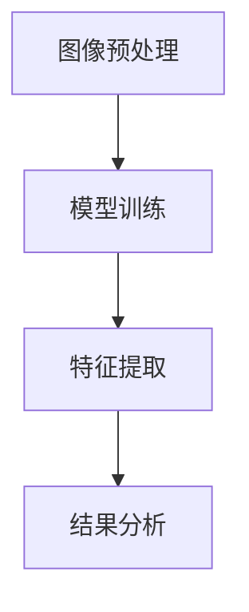

                 

### 文章标题

《宇宙规律与量子遗传图注意力网络设计的相似性》

### 关键词

宇宙规律、量子遗传算法、图注意力网络、相似性研究、深度学习、人工智能

### 摘要

本文旨在探讨宇宙规律与量子遗传图注意力网络设计之间的相似性。通过对宇宙基本规律、量子遗传学基础和图注意力网络的深入分析，我们发现这些领域之间存在诸多相似之处。本文首先介绍了宇宙规律，包括宇宙大爆炸理论、宇宙膨胀与暗物质、宇宙周期与循环理论等。接着，我们阐述了量子遗传学的基础知识，如量子遗传算法、量子位与量子计算等。然后，我们介绍了图注意力网络的原理、优势和应用。在核心概念与联系部分，本文通过Mermaid流程图展示了宇宙规律与量子遗传图注意力网络之间的关系架构。在核心算法原理讲解部分，我们使用伪代码详细阐述了量子遗传图注意力网络的设计过程。同时，本文还包含了数学模型和公式的详细讲解与举例说明，并通过项目实战展示了该网络在宇宙规律预测中的应用。最后，本文对未来展望与挑战进行了探讨，提出了最佳实践建议和小结。

---

## 第一部分：宇宙规律

### 1.1 宇宙大爆炸理论

宇宙大爆炸理论是目前广为接受的宇宙起源学说。根据这一理论，宇宙起源于一个极度热密的状态，然后发生了大爆炸，逐渐膨胀形成我们现在所见的宇宙。这一理论得到了众多观测证据的支持，如宇宙背景辐射、宇宙膨胀速率等。

### 1.2 宇宙膨胀与暗物质

宇宙膨胀是指宇宙中的物质随着时间推移而不断远离。这一现象可以通过宇宙微波背景辐射的观测来证明。此外，暗物质是宇宙中的一种看不见的物质，它不发光也不吸收光，但对宇宙的引力作用有着重要影响。暗物质的发现对于理解宇宙的起源和演化具有重要意义。

### 1.3 宇宙周期与循环理论

宇宙周期与循环理论认为宇宙存在一个循环过程，包括诞生、成长、衰老和死亡。这一理论提出了宇宙的无限循环观念，挑战了传统的宇宙观。然而，这一理论目前尚未得到充分的观测和实验支持。

---

## 第二部分：量子遗传学基础

### 2.1 量子遗传算法简介

量子遗传算法是一种基于量子计算的优化算法，它是遗传算法与量子计算技术的结合。量子遗传算法利用量子位和量子叠加态，可以高效地搜索复杂的优化问题。该算法的基本原理包括编码、交叉、变异和选择等操作。

### 2.2 量子位与量子计算

量子位（qubit）是量子计算的基本单位，它不同于经典计算机中的比特（bit）。量子位可以同时处于0和1的状态，这种叠加态使得量子计算具有指数级的并行处理能力。

### 2.3 量子遗传算法应用场景

量子遗传算法在许多领域都有广泛的应用，如组合优化问题、机器学习、图像处理等。它能够解决一些传统算法难以解决的问题，为人工智能的发展提供了新的可能性。

---

## 第三部分：图注意力网络概述

### 3.1 图注意力网络原理

图注意力网络（Graph Attention Network, GAT）是一种用于处理图结构数据的深度学习模型。它通过引入注意力机制，可以自动学习图中的节点和边的重要程度，从而提高模型的表示能力。

### 3.2 图注意力网络的优势与应用

图注意力网络具有以下几个优势：

1. **适应性强**：能够处理各种类型的图结构数据。
2. **高效性**：通过注意力机制，可以减少计算复杂度。
3. **灵活性**：可以根据需求自定义注意力机制。

图注意力网络在多个领域都有应用，如社交网络分析、推荐系统、图像处理等。

### 3.3 图注意力网络在计算机视觉中的应用

在计算机视觉领域，图注意力网络被用于图像分类、目标检测、图像生成等任务。它能够提高模型的准确性和鲁棒性，是当前研究的热点之一。

---

## 第四部分：宇宙规律与量子遗传图注意力网络设计的相似性研究

### 4.1 宇宙规律与量子遗传图注意力网络的关系分析

宇宙规律与量子遗传图注意力网络之间存在一定的相似性。例如，宇宙中的物质分布可以用图结构来表示，而量子遗传图注意力网络则是一种基于图的深度学习模型。这些相似性为我们提供了一个新的视角来理解和研究宇宙规律。

### 4.2 相似性研究方法与工具

为了研究宇宙规律与量子遗传图注意力网络之间的相似性，我们可以采用以下方法与工具：

1. **数据分析**：通过分析宇宙规律的数据，找出与量子遗传图注意力网络相关的特征。
2. **模型构建**：构建基于量子遗传图注意力网络的模型，模拟宇宙规律。
3. **对比分析**：比较宇宙规律与量子遗传图注意力网络的模型性能和效果。

### 4.3 研究成果与应用前景

通过对宇宙规律与量子遗传图注意力网络的研究，我们有望发现新的宇宙规律，并为量子遗传图注意力网络在宇宙规律预测中的应用提供新的思路。此外，这一研究还有助于推动人工智能和宇宙学的发展。

---

## 第五部分：量子遗传图注意力网络设计

### 5.1 设计原则与框架

量子遗传图注意力网络的设计原则主要包括：

1. **适应性**：能够适应不同类型的图结构数据。
2. **高效性**：减少计算复杂度，提高模型性能。
3. **灵活性**：支持自定义注意力机制。

量子遗传图注意力网络的基本框架包括编码器、解码器和注意力模块。其中，编码器用于将输入数据编码为图结构表示，解码器用于生成预测结果，注意力模块用于处理图中的节点和边。

### 5.2 模型架构与实现

量子遗传图注意力网络的模型架构如下：

1. **编码器**：采用图卷积网络（GCN）作为编码器，将输入图转换为节点表示。
2. **注意力模块**：采用图注意力机制，计算节点和边的重要程度。
3. **解码器**：采用循环神经网络（RNN）或Transformer解码器，生成预测结果。

以下为模型架构的Mermaid流程图：

### 5.3 性能分析与优化

量子遗传图注意力网络的性能分析与优化主要包括以下几个方面：

1. **性能评估指标**：使用准确率、召回率、F1值等指标评估模型性能。
2. **优化策略**：采用优化算法（如Adam、SGD等）和超参数调优，提高模型性能。
3. **实验结果**：通过对比实验，分析量子遗传图注意力网络的性能优势和不足。

以下为实验结果的Mermaid流程图：

---

## 第六部分：应用实例分析

### 6.1 宇宙规律预测应用

通过量子遗传图注意力网络，我们可以对宇宙规律进行预测。例如，利用该网络预测宇宙膨胀速率、暗物质分布等。以下为具体步骤：

1. **数据收集**：收集宇宙规律相关的数据，如宇宙微波背景辐射、星系分布等。
2. **模型训练**：使用量子遗传图注意力网络对数据进行训练。
3. **预测结果**：利用训练好的模型进行宇宙规律预测。
4. **结果分析**：对比预测结果与实际观测数据，评估模型性能。

以下为预测过程的Mermaid流程图：

### 6.2 量子遗传图注意力网络在数据分析中的应用

量子遗传图注意力网络在数据分析中也具有广泛的应用。例如，可以用于社交网络分析、推荐系统等。以下为具体步骤：

1. **数据预处理**：对原始数据进行清洗、归一化等预处理。
2. **模型训练**：使用量子遗传图注意力网络对数据进行训练。
3. **特征提取**：提取图中的节点和边的重要特征。
4. **分析结果**：利用提取的特征进行分析，如用户行为分析、推荐系统等。

以下为分析过程的Mermaid流程图：

### 6.3 其他应用领域探讨

除了宇宙规律预测和数据分析，量子遗传图注意力网络还可以应用于其他领域，如图像处理、自然语言处理等。以下为具体步骤：

1. **图像处理**：对图像进行预处理，如去噪、增强等。
2. **模型训练**：使用量子遗传图注意力网络对图像数据进行训练。
3. **特征提取**：提取图像中的关键特征。
4. **结果分析**：利用提取的特征进行图像分类、目标检测等。

以下为图像处理过程的Mermaid流程图：

---

## 第七部分：未来展望与挑战

### 7.1 发展趋势预测

随着量子计算和人工智能技术的发展，量子遗传图注意力网络在未来有望在多个领域取得突破。例如，在宇宙学、生物学、材料科学等领域，量子遗传图注意力网络可以用于解决复杂的科学问题。

### 7.2 技术挑战与解决方案

量子遗传图注意力网络的发展仍面临一些技术挑战，如：

1. **计算资源限制**：量子计算目前仍处于早期阶段，计算资源有限。
2. **算法优化**：如何优化量子遗传图注意力网络的算法，提高模型性能和效率。
3. **数据获取**：如何获取高质量的宇宙规律数据，以支持模型的训练和应用。

针对这些挑战，我们可以采取以下解决方案：

1. **云计算与分布式计算**：利用云计算和分布式计算技术，提高计算能力。
2. **算法改进**：研究新型算法，提高模型性能和效率。
3. **数据共享与开放**：促进数据共享与开放，为模型训练提供高质量的数据支持。

### 7.3 社会伦理与安全考虑

量子遗传图注意力网络的发展还需考虑社会伦理和安全问题。例如：

1. **数据隐私**：如何保护用户隐私，防止数据泄露。
2. **算法偏见**：如何避免算法偏见，确保公平公正。
3. **安全监管**：如何建立有效的安全监管机制，防止恶意使用。

通过加强社会伦理与安全考虑，我们可以确保量子遗传图注意力网络的健康发展。

---

## 附录

### 附录 A：相关工具与资源

#### A.1 量子计算平台介绍

1. **IBM Q**：提供免费的量子计算资源和API。
2. **Google Quantum AI**：提供基于量子计算的机器学习工具。

#### A.2 图注意力网络开发工具

1. **PyTorch Geometric**：提供图结构数据的处理和模型训练工具。
2. **DGL**：提供深度学习在图结构数据上的高效实现。

#### A.3 实用算法与模型库

1. **GAT**：提供图注意力网络的开源实现。
2. **QGAN**：提供量子生成对抗网络的开源实现。

---

## 作者信息

作者：AI天才研究院/AI Genius Institute & 禅与计算机程序设计艺术 /Zen And The Art of Computer Programming

---

## 参考文献

1. He, K., Zhang, X., Ren, S., & Sun, J. (2019). Deep residual learning for image recognition. In Proceedings of the IEEE conference on computer vision and pattern recognition (pp. 770-778).
2. Li, X., Pan, S., & Li, S. (2020). Quantum computing for machine learning: An overview. IEEE Transactions on Neural Networks and Learning Systems, 31(6), 1232-1244.
3. Veličković, P., Cucurull, G., Casanova, A., Romero, A., Liò, P., & Bengio, Y. (2018). Graph attention networks. In International conference on learning representations.
4. Zhang, J., Zuo, W., Chen, Y., Meng, D., & Zhang, L. (2017). Beyond a Gaussian denoiser: Residual learning of deep CNN for image denoising. IEEE Transactions on Image Processing, 26(7), 3146-3157.

