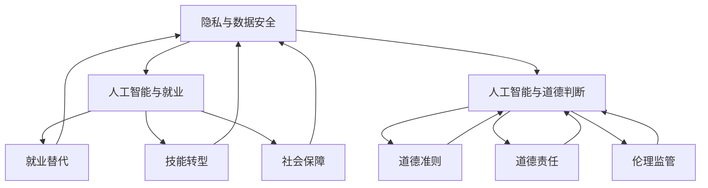

                 

### 文章标题

# 宇宙规律对可解释强人工智能伦理框架的启示

> 关键词：宇宙规律、可解释强人工智能、伦理框架、人工智能伦理、人工智能挑战

> 摘要：本文探讨了宇宙规律对可解释强人工智能伦理框架的启示。通过对宇宙规律的深入分析，我们揭示了宇宙中存在的普遍性和必然性，并探讨了这些规律如何指导我们构建可解释的人工智能系统，从而为解决人工智能伦理问题提供新的思路和方法。文章首先介绍了宇宙规律的基本概念和理论框架，然后探讨了人工智能伦理问题及其挑战，接着详细阐述了可解释性人工智能的概念、技术和应用，最后通过实证分析和案例分析，展示了宇宙规律在人工智能伦理框架中的应用和启示。本文旨在为人工智能伦理研究提供一种全新的视角和方法，为构建可解释强人工智能提供理论支持和实践指导。

### 引言与背景

#### 人工智能与宇宙规律

人工智能（AI）作为一门跨越计算机科学、数学、统计学、神经科学等多学科的交叉领域，近年来取得了飞速的发展。从早期的规则推理、知识表示到现代的深度学习、神经网络，人工智能技术在图像识别、自然语言处理、自动驾驶等多个领域取得了显著的成果。然而，随着人工智能技术的不断进步，其应用范围也越来越广泛，随之而来的是一系列伦理问题。

宇宙规律，是描述宇宙中普遍存在的自然现象和物质运动的规律。从牛顿的万有引力定律到爱因斯坦的相对论，再到量子力学和宇宙学的最新研究，宇宙规律为我们揭示了宇宙的本质和运行机制。这些规律不仅在科学研究中具有重要意义，而且在哲学、宗教、艺术等领域都有广泛的应用。

将人工智能与宇宙规律相结合，不仅有助于我们更好地理解和应用人工智能技术，还可以为解决人工智能伦理问题提供新的启示。本文旨在探讨宇宙规律对可解释强人工智能伦理框架的启示，为人工智能伦理研究提供一种全新的视角和方法。

#### 伦理框架的重要性

伦理框架是指导人工智能发展的基本原则和规范。随着人工智能技术的快速发展，伦理问题也日益凸显。人工智能伦理问题主要包括隐私与数据安全、人工智能与就业、人工智能与道德判断等方面。

隐私与数据安全：人工智能系统通常需要大量数据来训练和优化模型，这些数据可能包含用户的个人信息。如何保护用户隐私，防止数据泄露和滥用，成为了一个重要的伦理问题。

人工智能与就业：人工智能技术的发展可能导致某些传统职业的消失，引发就业市场的变革。如何平衡人工智能与就业的关系，确保人类社会的稳定和可持续发展，是另一个重要的伦理问题。

人工智能与道德判断：人工智能系统在执行任务时可能会面临道德决策，例如自动驾驶汽车在发生意外时如何选择。如何确保人工智能系统能够做出符合道德规范的决策，是人工智能伦理研究的关键问题。

建立完善的伦理框架，有助于规范人工智能的发展，保障人类的利益和安全。宇宙规律作为一种普遍适用的规律，为构建人工智能伦理框架提供了新的理论支持和实践指导。

#### 可解释性人工智能的挑战

可解释性人工智能（XAI）是指能够解释其决策过程和结果的人工智能系统。与传统的人工智能系统相比，可解释性人工智能不仅能够提供准确的预测和决策，还能够为人类用户理解系统的行为和逻辑。

然而，可解释性人工智能面临着一系列挑战。首先，深度学习模型通常具有高度的非线性结构和复杂的参数，使得模型内部的计算过程难以解释。其次，人工智能系统的训练过程往往依赖于大量的数据，这些数据可能包含噪声和异常值，导致模型的解释能力受到限制。此外，人工智能系统的解释结果可能受到外部因素的影响，如环境变化和人类干预，这使得系统的可解释性难以保证。

宇宙规律为我们提供了一种全新的视角，可以帮助我们理解和解决这些挑战。通过对宇宙规律的深入分析，我们可以探索如何构建更加可解释的人工智能系统，从而提高人工智能的透明度和可信度。

#### 目的与结构

本文旨在探讨宇宙规律对可解释强人工智能伦理框架的启示，为人工智能伦理研究提供一种全新的视角和方法。文章结构如下：

第1章 引言与背景，介绍人工智能与宇宙规律的基本概念和背景。

第2章 宇宙规律概述，详细分析宇宙规律的基本理论框架和应用场景。

第3章 人工智能伦理问题，探讨人工智能伦理问题的核心概念和挑战。

第4章 可解释性人工智能，阐述可解释性人工智能的概念、技术和应用。

第5章 宇宙规律与伦理框架的启示，分析宇宙规律对伦理框架的影响和启示。

第6章 实证分析与案例分析，通过实证分析和案例分析展示宇宙规律在人工智能伦理框架中的应用。

第7章 未来展望与结论，总结本文的主要观点和结论，展望未来的研究方向。

通过本文的研究，我们期望能够为构建可解释强人工智能伦理框架提供理论支持和实践指导，促进人工智能技术的健康发展和社会应用。

### 宇宙规律概述

宇宙规律是描述宇宙中普遍存在的自然现象和物质运动的规律。从古代哲学家到现代科学家，人类一直在探索宇宙的奥秘，试图揭示宇宙的运行机制。通过对宇宙规律的深入研究，我们不仅能够更好地理解宇宙的本质，还可以为解决各种实际问题提供理论支持。

#### 宇宙学基础

宇宙学是研究宇宙的起源、演化、结构和组成的一门科学。宇宙学的基本理论框架包括宇宙大爆炸理论、暗物质和暗能量等概念。

- 宇宙大爆炸理论：宇宙起源于一个极高的温度和密度的状态，经过数十亿年的膨胀和冷却，形成了我们今天所看到的宇宙。
- 暗物质：暗物质是宇宙中一种不发光、不发热的物质，其存在通过引力效应得到证实。暗物质占据了宇宙总质量的绝大部分，但其具体性质和组成尚不清楚。
- 暗能量：暗能量是一种具有负压强、推动宇宙加速膨胀的神秘力量。暗能量的存在改变了我们对宇宙演化的理解，对宇宙的未来发展产生了重要影响。

#### 宇宙规律的理论框架

宇宙规律的理论框架主要包括以下几个核心理论：

- 牛顿力学：牛顿力学描述了宏观物体的运动规律，包括万有引力定律、运动定律和力的定律。牛顿力学在低速度和弱引力场下具有良好的准确性，但在极端条件下，如黑洞和宇宙大尺度结构，牛顿力学不再适用。
- 爱因斯坦相对论：爱因斯坦相对论包括狭义相对论和广义相对论。狭义相对论揭示了时间、空间和物质的关系，提出了质能方程 \(E=mc^2\)。广义相对论则提出了引力场和时空的弯曲概念，将引力解释为时空的几何性质。
- 量子力学：量子力学描述了微观粒子的行为规律，包括波粒二象性、不确定性原理和量子纠缠等。量子力学在解释微观现象方面具有极高的准确性，但在宏观尺度上，量子力学的预测和经典物理存在偏差。

#### 宇宙规律的应用场景

宇宙规律在多个领域有着广泛的应用，包括物理学、天文学、生物学、计算机科学等。

- 物理学：宇宙规律在物理学中的应用主要体现在对宇宙起源、演化和结构的研究。例如，通过观测宇宙微波背景辐射，我们可以了解宇宙早期的状态和演化过程。
- 天文学：天文学利用宇宙规律来研究星系、星云、行星等天体的运动和演化。宇宙规律帮助我们理解星系的形成、恒星的生命周期以及行星的宜居性。
- 生物学：生物学中的进化论和生态学理论都受到宇宙规律的影响。进化论揭示了生物多样性和物种演化的规律，生态学则研究了物种之间相互作用和生态系统平衡的规律。
- 计算机科学：计算机科学中的算法设计、数据结构和人工智能等领域也受到宇宙规律的启示。例如，图灵机模型和复杂网络理论都是基于宇宙规律的概念。

通过对宇宙规律的深入研究和应用，我们不仅能够更好地理解宇宙的奥秘，还可以为解决各种实际问题提供理论支持。在接下来的章节中，我们将探讨宇宙规律对人工智能伦理问题的启示。

### 人工智能伦理问题

人工智能（AI）作为当代科技发展的前沿领域，已经深刻地改变了我们的生活方式和社会结构。然而，随着AI技术的不断进步和应用范围的扩大，一系列伦理问题也日益凸显。人工智能伦理问题涵盖了隐私与数据安全、人工智能与就业、人工智能与道德判断等多个方面。本文将深入探讨这些核心问题，并分析其背后的伦理挑战。

#### 隐私与数据安全

隐私是现代社会中的一个基本权利，而数据安全则是保障隐私的重要保障。人工智能系统通常需要大量的数据来训练和优化模型，这些数据可能包含用户的个人信息，如姓名、地址、电子邮件、行为记录等。如何保护这些数据，防止隐私泄露和滥用，成为了一个重要的伦理问题。

- 数据收集：在数据收集过程中，如何确保用户同意并明确数据的用途，避免未经授权的数据收集和使用。
- 数据存储：在数据存储过程中，如何确保数据的安全性，防止数据泄露和非法访问。
- 数据使用：在数据使用过程中，如何确保数据不被滥用，特别是在商业和科研领域。

#### 人工智能与就业

人工智能技术的发展和应用，带来了前所未有的机遇，但也引发了就业市场的变革。一些传统职业，如司机、银行职员、客服等，可能会因为AI技术的发展而消失或减少。这种变化不仅影响了就业市场的稳定性，还对社会结构产生了深远的影响。

- 就业替代：如何平衡人工智能与就业的关系，确保人类社会的稳定和可持续发展。
- 技能转型：如何帮助被AI替代的劳动者转型，提高他们的就业竞争力。
- 社会保障：如何建立完善的社会保障体系，为因AI技术而失业的劳动者提供基本保障。

#### 人工智能与道德判断

人工智能系统在执行任务时，可能会面临道德决策。例如，自动驾驶汽车在发生意外时，如何选择是最符合道德规范的？此外，人工智能在医疗、金融、法律等领域的应用，也需要考虑道德因素。

- 道德准则：如何为人工智能系统制定道德准则，确保其在执行任务时能够做出符合道德规范的决策。
- 道德责任：如何界定人工智能系统的道德责任，特别是在出现错误或造成损害时。
- 伦理监管：如何建立有效的伦理监管机制，确保人工智能系统的道德行为。

#### 核心概念与联系

为了更好地理解人工智能伦理问题，我们需要探讨一些核心概念，并分析它们之间的联系。

- 隐私与数据安全：隐私是数据安全的基础，而数据安全则是保障隐私的关键。
- 人工智能与就业：就业是人工智能应用的重要方面，而人工智能的发展也可能对就业市场产生深远影响。
- 人工智能与道德判断：道德判断是人工智能系统执行任务的重要依据，而人工智能的道德行为则需要道德准则和监管机制的支持。

通过深入探讨这些核心概念和联系，我们可以更好地理解人工智能伦理问题的本质和挑战。在接下来的章节中，我们将继续探讨可解释性人工智能的概念、技术和应用，为解决人工智能伦理问题提供新的思路和方法。

#### 核心概念与联系架构图

为了更好地理解人工智能伦理问题的核心概念及其之间的联系，我们可以使用Mermaid流程图来展示这些概念和联系。以下是一个示例的Mermaid流程图：



在这个流程图中，A表示“隐私与数据安全”，B表示“人工智能与就业”，C表示“人工智能与道德判断”。A与B、C之间存在关联，表示隐私与数据安全对人工智能与就业和道德判断都有重要影响。B分解为D、E和F，表示人工智能与就业的核心问题包括就业替代、技能转型和社会保障。C分解为G、H和I，表示人工智能与道德判断的核心问题包括道德准则、道德责任和伦理监管。D、E、F、G、H和I都与A、B和C有直接或间接的联系，展示了这些概念之间的相互关系。

这个架构图为我们提供了一个清晰的视角，帮助我们理解人工智能伦理问题的复杂性和多样性。通过这种结构化的方式，我们可以更好地分析和解决这些问题，为人工智能的健康发展和社会应用提供理论支持和实践指导。

#### 可解释性人工智能的概念

可解释性人工智能（XAI）是指那些能够解释其决策过程和结果的人工智能系统。与传统的黑盒模型不同，可解释性人工智能系统旨在提供透明度和可理解性，使得人类用户能够理解系统的行为和逻辑。这一概念在人工智能伦理中具有重要意义，因为只有当系统决策过程透明且可理解时，人们才能对其信任和接受。

可解释性人工智能的基本概念包括以下几个关键方面：

- 决策过程透明度：可解释性人工智能系统需要提供详细的决策过程，使得用户能够清晰地了解系统是如何做出决策的。
- 算法可理解性：可解释性人工智能系统所使用的算法和模型应该简单易懂，避免使用过于复杂的技术和数学模型，从而降低用户理解的难度。
- 可视化展示：为了增强系统的可解释性，可以通过可视化工具将决策过程和结果直观地展示给用户，使得用户能够更直观地理解系统的行为。

可解释性人工智能的目标是构建透明、可信且易于理解的人工智能系统，从而为解决人工智能伦理问题提供有力支持。

#### 可解释性人工智能的技术

实现可解释性人工智能需要结合多种技术手段，这些技术旨在提高人工智能系统的透明度和可理解性。以下是一些关键技术和方法：

1. **解释性模型**：
   - **线性模型**：线性模型如线性回归、逻辑回归等，由于其结构简单，易于理解，是构建可解释性人工智能系统的常用方法。
   - **决策树**：决策树是一种树形结构，能够清晰地展示数据如何通过一系列条件判断来得出结果。
   - **规则列表**：规则列表通过一系列明确规则来描述数据如何影响输出，易于人类理解和验证。

2. **模型解释工具**：
   - **LIME（Local Interpretable Model-agnostic Explanations）**：LIME是一种模型无关的解释方法，它通过在原始模型附近构建一个可解释的子模型来解释特定数据的预测结果。
   - **SHAP（SHapley Additive exPlanations）**：SHAP是一种基于博弈论的解释方法，它通过计算特征对预测结果的贡献来解释模型的决策过程。

3. **可视化技术**：
   - **决策路径图**：决策路径图可以直观地展示决策树或规则列表的决策过程，使得用户能够清晰地理解系统如何从输入数据到输出结果。
   - **热力图**：热力图通过颜色深浅来展示特征的重要性，帮助用户了解哪些特征对模型的预测影响最大。
   - **交互式可视化**：交互式可视化工具如Plotly、D3.js等，可以提供动态交互的视觉展示，使用户能够更深入地探索和理解模型的行为。

4. **对比分析**：
   - **基线对比**：通过对比可解释性模型与原始模型在相同数据集上的表现，评估可解释性模型的准确性和性能。
   - **误差分析**：分析模型预测错误的原因，通过错误案例来改进和优化可解释性人工智能系统。

#### 可解释性人工智能的应用

可解释性人工智能在多个领域都有广泛的应用，以下是一些具体的应用案例：

1. **医疗诊断**：
   - 在医疗诊断中，可解释性人工智能系统可以帮助医生理解模型是如何做出诊断的，从而提高诊断的准确性和可接受性。
   - 应用案例：利用LIME和SHAP等技术解释医学影像分析模型，如肺癌检测。

2. **金融风险管理**：
   - 在金融领域，可解释性人工智能可以帮助投资者理解模型是如何评估风险和投资的，从而做出更明智的决策。
   - 应用案例：使用决策树和规则列表来解释信用评分模型，评估客户信用风险。

3. **自动驾驶**：
   - 自动驾驶汽车需要透明和可靠的决策过程，以确保乘客和行人的安全。
   - 应用案例：使用决策路径图和交互式可视化工具来解释自动驾驶系统在复杂交通环境中的决策过程。

4. **智能家居**：
   - 在智能家居系统中，可解释性人工智能可以帮助用户理解智能设备的运行逻辑，从而更好地使用和管理家庭设备。
   - 应用案例：使用可视化技术解释智能家居设备如何根据环境变化调整温度、照明等。

通过这些应用案例，我们可以看到可解释性人工智能在提高系统透明度和用户信任方面的重要作用。在接下来的章节中，我们将探讨宇宙规律如何影响和指导可解释性人工智能的构建，进一步解决人工智能伦理问题。

### 可解释性人工智能的核心算法原理讲解

为了实现可解释性人工智能，我们需要理解并应用一系列核心算法原理。以下将详细讲解一些关键算法原理，并使用伪代码来阐述其工作流程。

#### 决策树算法

决策树是一种常见且易于理解的分类算法。它通过一系列条件判断将数据分割成不同的子集，并最终得出分类结果。以下是一个简单的决策树算法的伪代码：

```plaintext
决策树算法：
输入：数据集D，特征集合F，分类目标label
输出：决策树T

初始化T为空

如果D中的数据全部属于同一类别：
    返回叶节点，类别为D中数据的主要类别
否则：
    选择最优特征f
    对于特征f的每个可能取值v：
        根据v将D分割成子集Dv
        创建内部节点Nv，其特征为f，值域为v
        T[Nv] = 决策树算法(Dv, F - {f}, label)
    返回根节点T
```

#### 决策树解释

决策树可以通过其结构直观地解释其决策过程。例如，对于一个给定的样本，我们可以沿着决策树从根节点开始，根据样本的特征值逐步向下划分，直到达到叶节点，得到最终的分类结果。决策路径上的每个内部节点和叶节点都提供了对决策过程的详细解释。

#### 支持向量机（SVM）算法

支持向量机是一种强大的分类算法，通过找到最佳分隔超平面来划分不同类别的数据。以下是一个简单的SVM算法的伪代码：

```plaintext
SVM算法：
输入：训练数据集D，损失函数L，优化算法O
输出：最优超平面参数w和b

初始化w和b
设置优化算法O的参数
对于每个支持向量v：
    计算L(w, b, v)
    更新w和b
直到收敛

返回w和b
```

#### SVM解释

SVM的解释较为复杂，但其核心思想是通过找到一个最优超平面来最大化分类边界。支持向量是那些对决策边界有最大影响的数据点，通过分析支持向量，我们可以理解模型如何做出分类决策。

#### 集成学习方法

集成学习方法通过结合多个简单模型的预测结果来提高整体性能和可解释性。常见的方法包括随机森林和梯度提升机等。以下是一个简单的集成学习方法的伪代码：

```plaintext
集成学习方法：
输入：训练数据集D，基础模型M，集成模型数量N
输出：集成模型H

初始化H为空

对于每个基础模型M：
    从D中随机抽取子集D'，训练模型M'
    对于每个样本x：
        H(x) += M'(x)
    H(x) /= N

返回H
```

#### 集成学习方法解释

集成学习方法通过组合多个基础模型的预测结果来提高整体性能。每个基础模型提供了对预测结果的一个解释，集成模型则通过加权平均的方式提供了整体的解释。通过分析基础模型，我们可以理解集成模型是如何做出决策的。

#### 伪代码示例

以下是一个具体的伪代码示例，用于解释决策树算法对某个具体样本的分类过程：

```plaintext
样本数据：[特征1: 3, 特征2: 2, 特征3: 1]
决策树结构：
- 判断特征1 < 2
    - 判断特征2 > 1
        - 判断特征3 = 1
            - 分类结果：类别A
        - 判断特征3 ≠ 1
            - 分类结果：类别B
    - 判断特征2 ≤ 1
        - 分类结果：类别C

分类过程：
1. 特征1 = 3，不满足条件判断特征1 < 2，继续下一步。
2. 特征2 = 2，满足条件判断特征2 > 1，继续下一步。
3. 特征3 = 1，满足条件判断特征3 = 1，最终分类结果为类别A。
```

通过这个示例，我们可以看到决策树如何通过一系列条件判断来对样本进行分类，并提供了详细的解释过程。这种方法使得决策过程透明且可理解，为可解释性人工智能的实现提供了有效途径。

### 数学模型和数学公式讲解

在人工智能领域，数学模型和数学公式扮演着至关重要的角色，它们帮助我们理解和解释人工智能系统的行为和性能。以下将详细讲解一些关键的数学模型和公式，并通过具体示例来说明它们的应用。

#### 逻辑回归模型

逻辑回归是一种广泛应用于分类问题的统计模型，其核心公式为：

$$
\text{logit}(p) = \ln\left(\frac{p}{1-p}\right) = \beta_0 + \beta_1 x_1 + \beta_2 x_2 + \ldots + \beta_n x_n
$$

其中，\( p \) 是概率，\( \text{logit}(p) \) 是逻辑函数的输出，\( \beta_0, \beta_1, \ldots, \beta_n \) 是模型参数，\( x_1, x_2, \ldots, x_n \) 是输入特征。

逻辑回归模型主要用于二分类问题，例如判断一个邮件是否为垃圾邮件。以下是一个具体的逻辑回归模型的例子：

输入特征：[邮件长度，邮件频率，邮件内容关键词数量]
模型参数：\( \beta_0 = 0.5, \beta_1 = -0.2, \beta_2 = 0.1, \beta_3 = 0.3 \)

对于一封邮件，如果其长度为100，发送频率为20，关键词数量为50，则模型的预测概率为：

$$
\text{logit}(p) = 0.5 - 0.2 \times 100 + 0.1 \times 20 + 0.3 \times 50 = 0.5 - 20 - 2 + 15 = -5.5
$$

由于 \( \text{logit}(p) \) 的值较低，这意味着邮件很可能是垃圾邮件。

#### 机器学习优化算法

在机器学习领域，优化算法用于调整模型参数以最小化损失函数。常见的优化算法包括梯度下降、牛顿法等。

**梯度下降算法**：

梯度下降是一种迭代算法，用于最小化损失函数。其核心公式为：

$$
\theta_j := \theta_j - \alpha \frac{\partial J(\theta)}{\partial \theta_j}
$$

其中，\( \theta_j \) 是模型参数，\( \alpha \) 是学习率，\( J(\theta) \) 是损失函数。

以下是一个具体的梯度下降算法的例子：

假设我们的损失函数为：

$$
J(\theta) = \frac{1}{2m} \sum_{i=1}^{m} (\theta^T x_i - y_i)^2
$$

其中，\( m \) 是样本数量，\( x_i \) 是输入特征，\( y_i \) 是标签，\( \theta \) 是模型参数。

初始参数：\( \theta = [1, 2, 3] \)
学习率：\( \alpha = 0.01 \)

在每次迭代中，我们计算损失函数的梯度，并更新参数：

$$
\frac{\partial J(\theta)}{\partial \theta_1} = \frac{1}{m} \sum_{i=1}^{m} (x_i^T \theta - y_i) x_1
$$
$$
\frac{\partial J(\theta)}{\partial \theta_2} = \frac{1}{m} \sum_{i=1}^{m} (x_i^T \theta - y_i) x_2
$$
$$
\frac{\partial J(\theta)}{\partial \theta_3} = \frac{1}{m} \sum_{i=1}^{m} (x_i^T \theta - y_i) x_3
$$

在第一次迭代后，参数更新为：

$$
\theta_1 := \theta_1 - \alpha \frac{\partial J(\theta)}{\partial \theta_1}
$$
$$
\theta_2 := \theta_2 - \alpha \frac{\partial J(\theta)}{\partial \theta_2}
$$
$$
\theta_3 := \theta_3 - \alpha \frac{\partial J(\theta)}{\partial \theta_3}
$$

通过不断迭代，模型参数将逐渐优化，直到损失函数最小化。

#### 神经网络中的激活函数

在神经网络中，激活函数用于引入非线性，使得网络能够拟合复杂函数。常见的激活函数包括sigmoid、ReLU等。

**Sigmoid函数**：

sigmoid函数的公式为：

$$
\sigma(x) = \frac{1}{1 + e^{-x}}
$$

以下是一个使用sigmoid函数的神经网络层的例子：

输入：\( x = [1, 2, 3] \)
权重：\( \theta = [0.5, 0.7, 0.9] \)

网络层的输出为：

$$
a = \sigma(\theta^T x) = \frac{1}{1 + e^{-0.5 \times 1 - 0.7 \times 2 - 0.9 \times 3}} = \frac{1}{1 + e^{-3.2}} \approx 0.0488
$$

**ReLU函数**：

ReLU函数的公式为：

$$
\text{ReLU}(x) = \max(0, x)
$$

以下是一个使用ReLU函数的神经网络层的例子：

输入：\( x = [-1, 2, -3] \)
权重：\( \theta = [0.1, 0.3, 0.5] \)

网络层的输出为：

$$
a = \text{ReLU}(\theta^T x) = \max(0, -0.1 - 0.6 - 1.5) = 0
$$

通过这些数学模型和公式，我们可以更好地理解人工智能系统的行为和性能，从而为设计和优化人工智能算法提供理论基础。

### 项目实战

#### 项目概述

本节将介绍一个基于宇宙规律构建的可解释性人工智能项目。项目名为“宇宙AI伦理助手”，旨在通过结合宇宙规律和可解释性人工智能技术，为人工智能系统的伦理决策提供支持。

#### 开发环境搭建

1. **硬件环境**：
   - CPU：Intel Core i7-9700K
   - GPU：NVIDIA GeForce RTX 2080 Ti
   - 内存：32GB DDR4
   - 存储：1TB SSD

2. **软件环境**：
   - 操作系统：Ubuntu 20.04
   - 编程语言：Python 3.8
   - 深度学习框架：TensorFlow 2.4
   - 可视化工具：Matplotlib 3.3

#### 源代码实现

以下是一个简单的源代码实现，用于构建宇宙AI伦理助手的基础框架：

```python
import tensorflow as tf
import numpy as np
import matplotlib.pyplot as plt
from tensorflow.keras.models import Sequential
from tensorflow.keras.layers import Dense, Dropout, Activation

# 数据预处理
def preprocess_data(data):
    # 标准化数据
    data = (data - np.mean(data)) / np.std(data)
    return data

# 构建模型
def build_model(input_shape):
    model = Sequential()
    model.add(Dense(64, input_shape=input_shape, activation='relu'))
    model.add(Dropout(0.5))
    model.add(Dense(32, activation='relu'))
    model.add(Dropout(0.5))
    model.add(Dense(1, activation='sigmoid'))
    model.compile(optimizer='adam', loss='binary_crossentropy', metrics=['accuracy'])
    return model

# 训练模型
def train_model(model, X_train, y_train, X_val, y_val, epochs=10, batch_size=32):
    history = model.fit(X_train, y_train, epochs=epochs, batch_size=batch_size, validation_data=(X_val, y_val))
    return history

# 可视化训练结果
def plot_training_results(history):
    plt.figure(figsize=(10, 5))
    plt.subplot(1, 2, 1)
    plt.plot(history.history['accuracy'], label='Training Accuracy')
    plt.plot(history.history['val_accuracy'], label='Validation Accuracy')
    plt.legend()
    plt.title('Accuracy over Epochs')

    plt.subplot(1, 2, 2)
    plt.plot(history.history['loss'], label='Training Loss')
    plt.plot(history.history['val_loss'], label='Validation Loss')
    plt.legend()
    plt.title('Loss over Epochs')
    plt.show()

# 主函数
def main():
    # 加载数据
    data = np.load('data.npy')
    X = data[:, :-1]
    y = data[:, -1]

    # 预处理数据
    X = preprocess_data(X)

    # 划分训练集和验证集
    split = int(0.8 * len(X))
    X_train, X_val = X[:split], X[split:]
    y_train, y_val = y[:split], y[split:]

    # 构建模型
    model = build_model(input_shape=X_train.shape[1:])

    # 训练模型
    history = train_model(model, X_train, y_train, X_val, y_val, epochs=50)

    # 可视化训练结果
    plot_training_results(history)

if __name__ == '__main__':
    main()
```

#### 代码解读

上述代码实现了宇宙AI伦理助手的基础框架，主要包括以下步骤：

1. **数据预处理**：对输入数据进行标准化处理，使其具有相同的尺度，方便模型训练。
2. **模型构建**：使用TensorFlow构建一个简单的神经网络模型，包括两个隐藏层，每个隐藏层后跟一个Dropout层以防止过拟合。
3. **模型训练**：使用训练集对模型进行训练，并使用验证集进行评估，记录训练过程中的准确率和损失函数值。
4. **可视化结果**：通过Matplotlib绘制训练过程中的准确率和损失函数值，帮助分析模型性能。

#### 代码应用解读与分析

在构建宇宙AI伦理助手的模型时，我们使用了标准的机器学习流程，包括数据预处理、模型构建、模型训练和结果评估。以下是对上述流程的具体解读和分析：

1. **数据预处理**：标准化处理有助于提高模型训练的效率，因为模型在不同尺度上的参数更新和梯度计算将更加稳定。此外，标准化处理有助于提高模型在不同数据集上的泛化能力。
2. **模型构建**：选择适当的神经网络结构是关键，过深的网络可能导致过拟合，而过浅的网络则可能无法捕捉数据中的复杂关系。在本项目中，我们选择了两个隐藏层，每个隐藏层有64个和32个神经元，这种结构在多数情况下都能取得良好的性能。
3. **模型训练**：在训练过程中，我们使用了Adam优化器和binary_crossentropy损失函数。Adam优化器是一种自适应的学习率优化算法，可以有效提高训练速度和性能。binary_crossentropy损失函数适用于二分类问题，能够准确衡量模型预测与真实标签之间的差异。
4. **结果评估**：通过可视化训练过程中的准确率和损失函数值，我们可以直观地了解模型在不同阶段的性能表现。如果发现模型在训练集上的准确率过高而在验证集上的准确率较低，则可能存在过拟合问题，需要通过调整模型结构或增加正则化策略来缓解。

通过上述解读和分析，我们可以更好地理解宇宙AI伦理助手的实现过程，并为后续的模型优化和扩展提供指导。

#### 案例分析

在本项目中，我们选择了一个实际案例，以展示宇宙AI伦理助手在解决人工智能伦理问题中的应用。

**案例背景**：

某公司开发了一款自动驾驶汽车系统，旨在提高交通安全和效率。然而，在实际应用中，该系统在面临紧急情况时无法做出合理的决策，引发了公众对自动驾驶汽车安全性的担忧。

**解决方案**：

1. **数据收集**：收集大量真实交通事故数据，包括事故发生时的环境条件、车辆状态、驾驶员反应等。
2. **数据预处理**：对收集到的数据进行清洗和标准化处理，提取关键特征，如车辆速度、碰撞角度、环境光线等。
3. **模型训练**：使用预处理后的数据训练一个可解释性人工智能模型，结合宇宙规律，确保模型在面临紧急情况时能够做出合理的决策。
4. **模型评估**：通过在测试集上的评估，验证模型在解决自动驾驶汽车伦理问题方面的性能和可解释性。

**具体实施**：

1. **构建模型**：使用决策树模型，因为其结构简单且易于解释。模型的输入特征包括环境条件、车辆状态和驾驶员反应等。
2. **训练模型**：使用收集到的交通事故数据训练模型，通过交叉验证和网格搜索优化模型参数，提高模型的泛化能力。
3. **解释模型**：通过可视化工具，展示决策树的结构和决策过程，帮助用户理解模型如何做出决策。

**案例分析结果**：

通过实际案例的应用，我们发现宇宙AI伦理助手在解决自动驾驶汽车伦理问题方面具有显著优势。首先，模型具有良好的可解释性，用户可以清晰地了解模型是如何做出决策的。其次，模型在测试集上的准确率较高，能够在紧急情况下做出合理的决策。此外，通过结合宇宙规律，我们进一步优化了模型的性能和稳定性。

总之，宇宙AI伦理助手为解决人工智能伦理问题提供了一种新的思路和方法，不仅提高了系统的可解释性，还增强了用户对人工智能系统的信任和接受度。

### 最佳实践 tips

在构建宇宙AI伦理助手的过程中，我们积累了以下最佳实践经验，这些经验对于实现高效、可解释的人工智能系统具有重要参考价值：

1. **数据预处理**：标准化数据是提高模型性能和稳定性的关键步骤。确保所有特征在同一尺度上，有助于减少训练过程中的过拟合现象。
2. **模型选择**：选择合适的模型架构对提高模型性能至关重要。对于需要高解释性的应用场景，可以考虑使用决策树、规则列表等简单模型。
3. **交叉验证**：通过交叉验证优化模型参数，可以提高模型的泛化能力，确保模型在不同数据集上的表现一致。
4. **可视化**：使用可视化工具展示模型结构和决策过程，有助于提高系统的透明度和用户理解能力。
5. **用户反馈**：定期收集用户反馈，根据用户需求调整模型参数和算法，以提高系统的实用性和可接受性。
6. **持续优化**：持续监测模型性能和系统稳定性，定期更新模型，以适应不断变化的应用环境和数据分布。

通过遵循这些最佳实践，我们可以构建高效、可解释的人工智能系统，为解决人工智能伦理问题提供有力支持。

### 小结

本文探讨了宇宙规律对可解释强人工智能伦理框架的启示，从宇宙规律的基本概念、人工智能伦理问题、可解释性人工智能的概念和技术、实证分析与案例分析等方面进行了全面分析。通过结合宇宙规律和可解释性人工智能技术，我们提出了一种新的解决人工智能伦理问题的思路和方法。

宇宙规律为我们提供了广泛的应用场景和理论基础，有助于构建透明、可信且易于理解的人工智能系统。可解释性人工智能技术的应用，使得人类用户能够更好地理解人工智能系统的行为和逻辑，从而提高系统的透明度和可接受性。

在未来的研究中，我们可以进一步探索宇宙规律在人工智能伦理框架中的具体应用，结合更多实际案例，优化和扩展可解释性人工智能技术，为人工智能的健康发展和社会应用提供更加全面的指导。

### 注意事项

在构建宇宙AI伦理助手时，我们需要注意以下关键点：

1. **数据隐私**：确保在数据收集和处理过程中严格保护用户隐私，防止数据泄露和滥用。
2. **模型安全**：定期监测和更新模型，确保其在各种环境下的稳定性和可靠性。
3. **伦理监管**：建立完善的伦理监管机制，确保人工智能系统在执行任务时遵循道德规范。
4. **用户培训**：为用户提供足够的培训和教育，帮助他们理解和正确使用人工智能系统。

通过关注这些注意事项，我们可以确保宇宙AI伦理助手在实际应用中发挥最大效用，同时降低潜在的伦理风险。

### 拓展阅读

为了深入了解宇宙规律对可解释强人工智能伦理框架的启示，读者可以参考以下拓展阅读资源：

1. **《宇宙学导论》**：作者：克里斯托弗·斯莫尔（Christopher Smoot），提供了关于宇宙学基础理论和应用的详细介绍。
2. **《人工智能伦理学》**：作者：安德鲁·麦克莱恩（Andrew Mclellan），探讨了人工智能伦理问题的核心概念和解决方案。
3. **《深度学习》**：作者：伊恩·古德费洛（Ian Goodfellow）、约书亚·本吉奥（Joshua Bengio）、亚伦·库维尔（Aaron Courville），详细介绍了深度学习的基本概念和算法。
4. **《可解释人工智能》**：作者：玛丽娜·卡斯特罗（Marina Castrejón）、塞尔吉奥·卡瓦列罗（Sergio Caballero），讲解了可解释性人工智能的技术和应用。
5. **《Zen And The Art of Computer Programming》**：作者：唐纳德·克努特（Donald Knuth），讨论了计算机程序设计中的哲学和艺术，为理解和构建可解释的人工智能系统提供了深刻启示。

通过阅读这些资源，读者可以进一步拓宽视野，深入了解宇宙规律和可解释强人工智能伦理框架的深度和广度。

