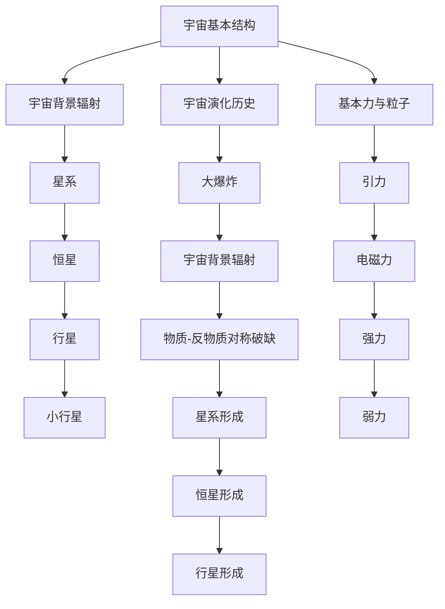
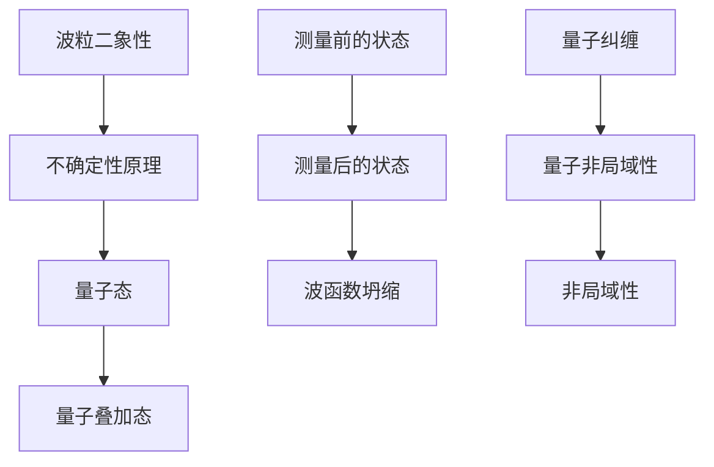
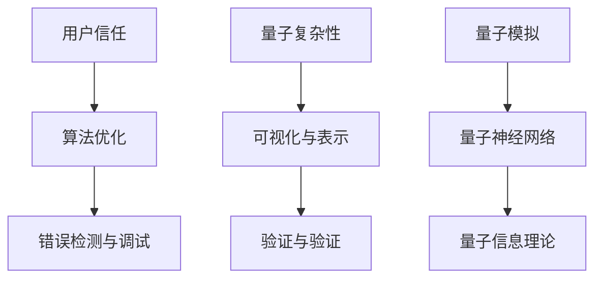
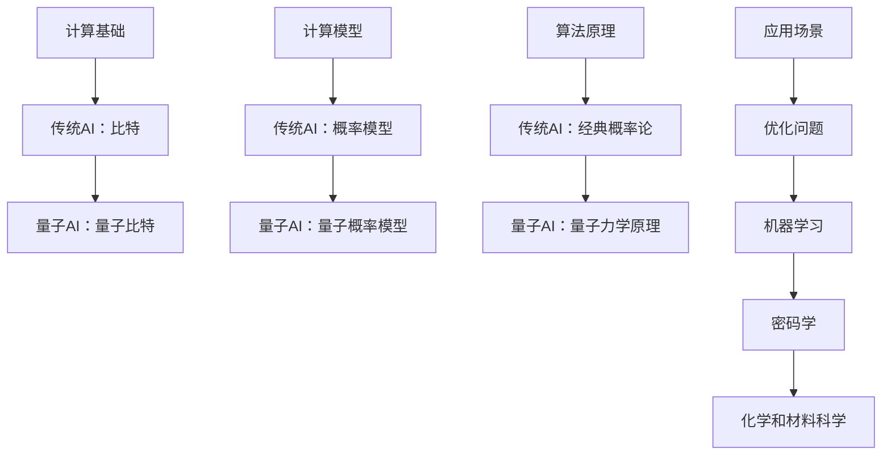
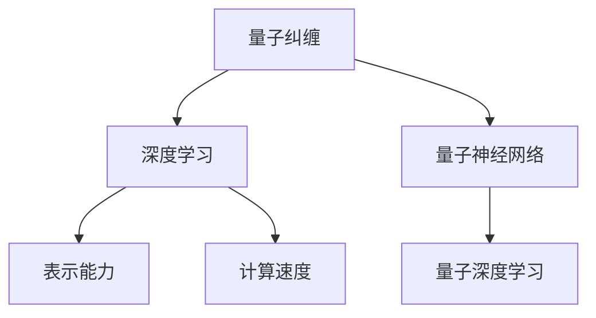
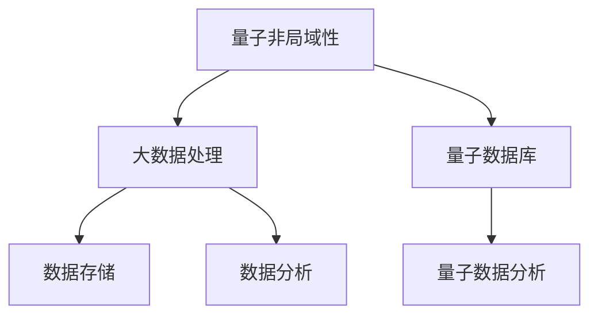
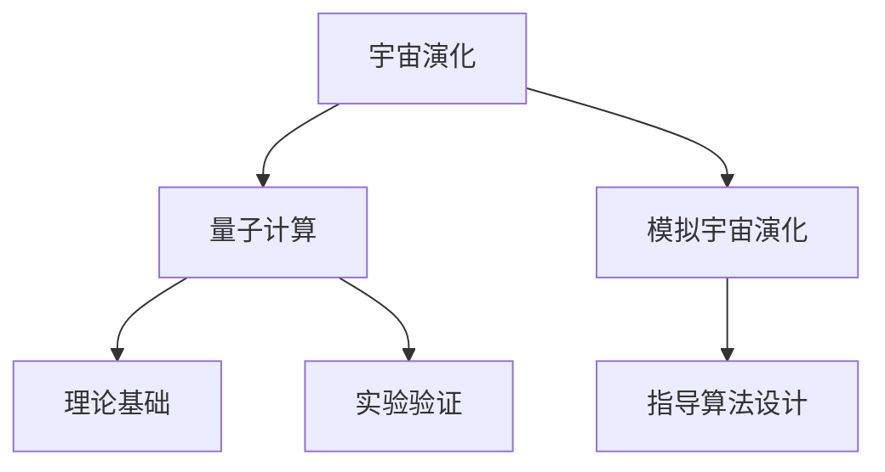
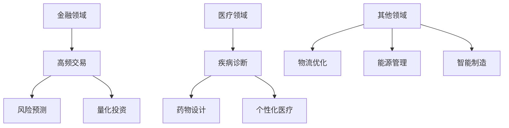
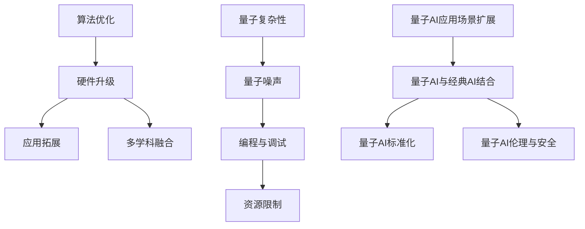

                 

### 文章标题

《宇宙规律对可解释量子AI的启示》

> 关键词：宇宙规律、可解释量子AI、量子计算、深度学习、宇宙演化

> 摘要：本文从宇宙规律出发，探讨了宇宙的基本结构、演化历史以及基本力与粒子，结合量子力学和量子计算原理，深入分析了可解释量子AI的需求与挑战。通过解析量子纠缠、量子非局域性和宇宙演化对量子计算的影响，本文揭示了宇宙规律对可解释量子AI的启示，探讨了量子AI在现实世界中的应用以及未来发展趋势和挑战。旨在为读者提供一部深入浅出、具有前瞻性的技术博客，帮助读者了解宇宙规律与量子AI的内在联系，为人工智能领域的创新提供新思路。

### 引言

宇宙是我们生活的舞台，从宇宙的基本结构到演化历史，从基本力与粒子到复杂的天体现象，宇宙规律始终支配着宇宙的运行。近年来，量子力学的发现和量子计算的发展，使人们对宇宙的认识达到了前所未有的高度。可解释量子AI作为量子计算和人工智能的融合，成为了当前研究的热点之一。它不仅具有潜在的突破性应用，而且对于深入理解宇宙规律具有重要的启示意义。

本文旨在探讨宇宙规律对可解释量子AI的启示。首先，我们将介绍宇宙的基本结构、演化历史以及基本力与粒子，为后续讨论奠定基础。接着，我们将深入探讨量子力学和量子计算的基本原理，为理解可解释量子AI提供理论支持。然后，本文将分析可解释量子AI的需求与挑战，阐述其在现实世界中的应用，并探讨量子AI的未来发展趋势和挑战。最后，我们将结合宇宙规律，总结可解释量子AI的研究现状和未来发展方向。

### 宇宙规律概述

宇宙，这个浩瀚无垠的空间，自大爆炸以来经历了数十亿年的演化。了解宇宙的基本结构、演化历史以及基本力与粒子，对于理解宇宙规律具有重要意义。

#### 宇宙的基本结构

宇宙的基本结构主要由以下几个层次组成：宇宙背景辐射、星系、恒星、行星、小行星等。宇宙背景辐射是宇宙大爆炸后留下的余晖，是研究宇宙早期状态的重要证据。星系是由大量恒星、星云、行星等组成的巨大系统，目前已知宇宙中大约有数千亿个星系。恒星是宇宙中最常见的天体，通过核聚变反应产生能量，是生命的源泉。行星、小行星等则是恒星形成的副产品，为生命提供了可能。

#### 宇宙演化历史

宇宙的演化历史可以分为以下几个阶段：

1. **大爆炸**：宇宙起源于一个极端高温、高密度的奇点，经过剧烈的膨胀，逐渐形成了现在的宇宙。
2. **宇宙背景辐射**：在大爆炸后几分钟内，宇宙温度迅速降低，辐射开始形成。
3. **物质-反物质对称破缺**：宇宙中物质和反物质的数量不相等，导致反物质逐渐消失。
4. **星系形成**：在宇宙演化的早期阶段，引力作用使物质聚集形成星系。
5. **恒星形成**：随着星系的形成，恒星也开始形成，通过核聚变反应产生能量。
6. **行星形成**：恒星形成的剩余物质聚集形成行星，提供了生命存在的可能。

#### 宇宙中的基本力与粒子

宇宙中存在四种基本力：引力、电磁力、强力和弱力。这些基本力分别对应着不同的粒子。

1. **引力**：由质量产生的吸引力，是宇宙中最基本的力，主要由引力子传递。
2. **电磁力**：由电荷产生的力，是最常见的力，主要由光子传递。
3. **强力**：负责维持原子核的稳定，由强子传递。
4. **弱力**：与核反应有关，主要由弱相互作用玻色子传递。

#### Mermaid 流程图



通过以上分析，我们可以看到宇宙的基本结构、演化历史以及基本力与粒子如何相互作用，构成了宇宙的运行规律。这些规律不仅影响了宇宙的演化，也为我们理解量子力学和量子计算提供了重要的启示。在接下来的章节中，我们将进一步探讨量子力学和量子计算的基本原理，以深入理解宇宙规律对可解释量子AI的启示。

#### 量子力学基础

量子力学的诞生，为人类对自然界的理解开启了新的大门。它不仅颠覆了经典物理学的许多传统观念，还揭示了微观世界的奇妙规律。以下是量子力学的基本原理、量子态与测量，以及量子纠缠与量子非局域性的详细探讨。

##### 量子力学的基本原理

量子力学的基础理论由以下几个核心原理构成：

1. **波粒二象性**：量子既表现出粒子特性，也表现出波动特性。例如，光既可以表现为粒子（光子），也可以表现为波。
2. **不确定性原理**：由海森堡提出，指出无法同时精确测量粒子的位置和动量。这表明微观世界中的信息是有限的。
3. **量子态**：量子态是量子系统的状态，可以用波函数来描述。波函数的平方给出了粒子在某个位置的概率。
4. **量子叠加态**：量子系统可以同时处于多个状态的叠加，而非单一状态。例如，一个电子可以同时处于自旋向上和自旋向下的叠加态。

##### 量子态与测量

量子态的测量是一个关键问题。根据哥本哈根解释，测量会导致量子态从叠加态坍缩为一个确定的状态。以下是一些关于量子态与测量的核心概念：

1. **测量前的状态**：在测量之前，量子系统处于一个概率混合态，其状态无法确定。
2. **测量后的状态**：测量会导致量子态坍缩为一个确定的状态，这个状态由波函数的坍缩确定。
3. **波函数坍缩**：当进行测量时，系统的波函数会坍缩为一个确定的状态，这个状态与测量结果相对应。

##### 量子纠缠与量子非局域性

量子纠缠是量子力学中最令人费解的现象之一，它揭示了量子系统之间的超距作用。以下是对量子纠缠与量子非局域性的详细探讨：

1. **量子纠缠**：当两个量子系统相互作用后，它们之间会形成一种特殊的纠缠态，即使它们相隔很远，一个系统的状态也会即时影响到另一个系统。这种纠缠状态无法通过局部操作来解释，表明了量子世界的非局域性。
2. **非局域性**：量子非局域性是指量子系统之间的状态可以瞬时相互影响，这与经典物理中的局域性相悖。爱因斯坦曾将这种现象称为“鬼魅般的超距作用”。

##### Mermaid 流�程图



通过以上分析，我们可以看到量子力学的基本原理、量子态与测量，以及量子纠缠与量子非局域性如何共同构成了量子力学的核心框架。这些原理不仅揭示了微观世界的运行规律，也为理解量子计算和量子AI提供了重要的基础。在接下来的章节中，我们将进一步探讨量子计算的基本原理，以深入理解量子力学和量子计算之间的联系。

#### 量子计算原理

量子计算作为量子力学的直接应用，为传统计算机带来了革命性的变革。它利用量子比特（qubit）和量子门（quantum gate）等基本概念，实现了高效的量子算法。以下是量子计算的基本概念、量子比特与量子门，以及量子算法的详细探讨。

##### 量子比特与量子门

1. **量子比特（qubit）**：量子比特是量子计算的基本单元，与经典比特不同，它不仅可以表示0和1的状态，还可以同时处于0和1的叠加态。这种叠加态使得量子比特能够同时处理大量信息，这是量子计算的核心优势。
    - **叠加态**：一个量子比特的状态可以表示为$|\psi\rangle = \alpha|0\rangle + \beta|1\rangle$，其中$\alpha$和$\beta$是复数概率幅，$|0\rangle$和$|1\rangle$分别表示量子比特的基态。
2. **量子门（quantum gate）**：量子门是作用于量子比特的线性操作，类似于经典计算机中的逻辑门。量子门可以改变量子比特的状态，实现特定的计算功能。常见的量子门包括保罗门（Pauli gate）、哈达玛门（Hadamard gate）和控制非门（CNOT gate）等。

##### 量子算法简介

量子算法是利用量子计算原理实现的算法，与经典算法相比，它能够在某些特定问题上实现指数级别的加速。以下是一些重要的量子算法：

1. **量子快速排序（Quantum QuickSort）**：量子快速排序是量子算法中的一种简单排序算法，其时间复杂度为$O(n \log n)$。
2. **量子支持向量机（Quantum Support Vector Machine）**：量子支持向量机是量子计算在机器学习领域的一个应用，能够高效地解决分类问题。
3. **Shor算法**：Shor算法是量子计算的经典算法之一，能够利用量子计算机在多项式时间内解决大数分解问题。

##### 伪代码

以下是量子快速排序的伪代码：

```python
function QuantumQuickSort(qubits):
    if length(qubits) <= 1:
        return qubits
    else:
        pivot = choose_pivot(qubits)
        less = []
        equal = []
        greater = []
        for qubit in qubits:
            if qubit == pivot:
                equal.append(qubit)
            elif qubit < pivot:
                less.append(qubit)
            else:
                greater.append(qubit)
        less = QuantumQuickSort(less)
        equal = QuantumQuickSort(equal)
        greater = QuantumQuickSort(greater)
        return concatenate(less, equal, greater)
```

通过以上分析，我们可以看到量子计算的基本原理、量子比特与量子门，以及量子算法如何共同构成了量子计算的核心框架。这些原理不仅为量子计算提供了理论基础，也为未来量子技术的发展提供了广阔的前景。在接下来的章节中，我们将进一步探讨可解释量子AI的需求与挑战，以深入理解量子计算在实际应用中的价值。

#### 可解释量子AI的需求与挑战

可解释量子AI（Explainable Quantum AI，XQA）作为量子计算和人工智能的融合，旨在提升量子算法的可解释性和透明度，使其在实际应用中更具可行性和可靠性。然而，实现可解释量子AI面临着诸多需求与挑战。

##### 可解释AI的重要性

可解释AI的核心目标是提高人工智能系统的可解释性和透明度，使人们能够理解和信任这些系统的决策过程。对于量子AI而言，可解释性的重要性尤为突出，原因如下：

1. **用户信任**：量子AI作为一种新兴技术，其复杂的计算过程和不可预测的结果可能引起用户的不信任。提高可解释性有助于增强用户对量子AI系统的信任。
2. **算法优化**：通过理解量子算法的工作原理和决策过程，研究者可以更好地优化算法，提高其性能和效率。
3. **错误检测与调试**：可解释性有助于检测和调试量子算法中的错误，提高系统的稳定性和可靠性。

##### 可解释AI的挑战

尽管可解释量子AI具有重要的应用价值，但其实现面临诸多挑战：

1. **量子复杂性**：量子计算本身具有高度的非线性、并行性和叠加性，这使得量子算法的复杂性远超经典算法。如何有效地解释这种复杂性是一个亟待解决的问题。
2. **可视化与表示**：量子态和量子操作的表示方式与传统计算不同，如何将其转化为直观、易于理解的形式是一个挑战。目前，虽然已有一些可视化工具，但它们仍然不够完善。
3. **验证与验证**：验证量子算法的正确性和可靠性是一个重要问题。如何在确保算法准确性的同时，提高其可解释性，仍需进一步研究。

##### 可解释AI的研究现状

近年来，可解释AI在量子计算领域取得了显著进展，以下是一些关键的研究方向：

1. **量子模拟**：量子模拟是一种利用量子计算机模拟量子系统的方法，有助于理解和解释量子现象。研究者利用量子模拟器研究了量子算法的可解释性，并提出了一些可视化和解释工具。
2. **量子神经网络**：量子神经网络（Quantum Neural Networks，QNNs）是量子计算在机器学习领域的一个重要应用。研究者通过将量子神经网络与传统神经网络相结合，提高了模型的可解释性。
3. **量子信息理论**：量子信息理论为理解量子算法提供了理论基础。研究者利用量子信息理论分析量子算法的可解释性，并提出了一些优化方法。

##### Mermaid 流程图



通过以上分析，我们可以看到可解释量子AI的需求与挑战，以及当前的研究现状。在接下来的章节中，我们将进一步探讨量子AI的基本原理，分析量子AI与传统AI的区别，并探讨其在不同应用场景中的优势。

### 量子AI的基本原理

量子AI（Quantum Artificial Intelligence）作为量子计算与人工智能的交叉领域，结合了量子计算和传统AI的优点，具有巨大的应用潜力。量子AI与传统AI存在显著差异，其基本原理主要体现在量子比特、量子神经网络和量子深度学习等方面。

#### 量子AI的定义

量子AI是指利用量子计算机的量子特性（如叠加态、纠缠态和非线性）来执行计算和学习的算法。与经典计算机不同，量子计算机能够处理复杂的问题，并在某些任务上实现显著加速。量子AI的目标是开发能够利用量子计算机能力的智能系统，解决传统AI难以应对的问题。

#### 量子AI与传统AI的区别

1. **计算基础**：传统AI基于经典计算机，使用二进制位（比特）作为计算基础。量子AI基于量子计算机，使用量子比特（qubit）作为计算基础。量子比特可以同时处于0和1的叠加态，这使得量子计算机具有超强的并行计算能力。
2. **计算模型**：传统AI主要采用概率模型、神经网络等计算模型，如支持向量机、决策树、深度神经网络等。量子AI则采用量子概率模型和量子神经网络等计算模型，如量子支持向量机、量子神经网络和量子深度学习等。
3. **算法原理**：传统AI算法基于经典概率论和统计学原理，如梯度下降、随机梯度下降等。量子AI算法基于量子力学原理，如叠加态、纠缠态、量子非局域性等，这些原理使得量子算法在特定问题（如大数分解、量子搜索）上具有显著优势。

#### 量子AI的应用场景

量子AI在多个领域展示了其独特的优势，以下是一些典型的应用场景：

1. **优化问题**：量子AI可以高效解决复杂优化问题，如旅行商问题、线性规划、神经网络权重优化等。通过量子计算，这些问题的求解时间可以从指数级减少到多项式级。
2. **机器学习**：量子AI在机器学习领域具有广泛的应用前景，如量子支持向量机、量子神经网络和量子深度学习等。这些算法在处理大规模数据集、提高模型精度和减少训练时间方面具有显著优势。
3. **密码学**：量子AI可以应用于密码学，如量子密钥分发、量子安全通信等。通过量子计算，这些安全协议可以在理论上提供无条件安全。
4. **化学和材料科学**：量子计算在化学和材料科学领域具有广泛应用，如分子模拟、化学反应预测、新材料设计等。量子AI可以通过量子模拟加速这些过程，提高研究效率。

#### Mermaid 流程图



通过以上分析，我们可以看到量子AI与传统AI在计算基础、计算模型和算法原理上的区别，以及量子AI在多个领域的应用场景。量子AI的发展将为人工智能带来新的机遇和挑战，推动人工智能技术的进一步创新。

### 量子AI的核心算法

量子AI的核心算法是量子计算与人工智能结合的产物，它们利用量子比特、量子门和量子态的叠加与纠缠特性，实现了在特定问题上的高效求解。以下介绍三种重要的量子AI核心算法：量子支持向量机、量子神经网络和量子深度学习。

#### 量子支持向量机（Quantum Support Vector Machine，QSVM）

量子支持向量机是量子计算在机器学习领域的一个重要应用。它基于量子计算的高速并行性和高效运算能力，能够对大规模数据进行分类和预测。

1. **核心原理**：QSVM的核心原理与经典支持向量机（SVM）类似，但采用了量子比特和量子门。在QSVM中，量子比特表示数据点，量子门实现数据的变换和分类。通过量子态的叠加和纠缠，QSVM能够在复杂的高维空间中找到最优分类边界。

2. **工作流程**：
   - **初始化**：将数据映射到高维量子空间，使用量子比特表示每个数据点。
   - **构建量子特征映射**：使用量子门将数据映射到特征空间。
   - **计算分类函数**：通过量子态的叠加和纠缠，计算分类函数，判断数据点的类别。
   - **优化分类边界**：使用量子优化算法（如量子梯度下降）调整量子门参数，优化分类边界。

3. **伪代码**：

```python
function QuantumSupportVectorMachine(qubits, labels):
    # 初始化量子比特和量子门
    initialize_quantum_gates()
    
    # 映射数据到高维量子空间
    map_data_to_quantum_space(qubits)
    
    # 构建量子特征映射
    apply_quantum_gates_to_qubits(qubits)
    
    # 计算分类函数
    compute_classification_function(qubits, labels)
    
    # 优化分类边界
    optimize_classification_boundary(qubits, labels)
    
    return classify_new_data(qubits)
```

#### 量子神经网络（Quantum Neural Network，QNN）

量子神经网络是量子计算在神经网络领域的应用。它结合了量子计算和神经网络的优点，能够高效处理大规模数据。

1. **核心原理**：QNN的核心原理是基于量子比特的神经网络，使用量子比特作为节点，量子门作为权重。QNN通过量子态的叠加和纠缠，实现数据的处理和模式识别。

2. **工作流程**：
   - **初始化**：初始化量子比特和量子门。
   - **输入数据预处理**：将输入数据映射到量子空间，使用量子比特表示。
   - **数据处理**：通过量子门实现数据的非线性变换。
   - **输出预测**：通过量子态的叠加和测量，得到输出结果。

3. **伪代码**：

```python
function QuantumNeuralNetwork(qubits, weights):
    # 初始化量子比特和量子门
    initialize_quantum_gates(weights)
    
    # 输入数据预处理
    preprocess_input_data(qubits)
    
    # 数据处理
    apply_quantum_gates_to_qubits(qubits)
    
    # 输出预测
    output = measure_qubits(qubits)
    
    return output
```

#### 量子深度学习（Quantum Deep Learning）

量子深度学习是量子计算在深度学习领域的应用。它利用量子计算的高速并行性和高效运算能力，实现深度神经网络的高效训练和预测。

1. **核心原理**：量子深度学习基于量子神经网络，通过扩展量子层和量子门，实现多层神经网络的高效训练。它利用量子态的叠加和纠缠，实现数据的深度学习和模式识别。

2. **工作流程**：
   - **初始化**：初始化量子比特和量子门。
   - **输入数据预处理**：将输入数据映射到量子空间，使用量子比特表示。
   - **多层数据处理**：通过多层量子神经网络实现数据的非线性变换和模式识别。
   - **输出预测**：通过量子态的叠加和测量，得到输出结果。

3. **伪代码**：

```python
function QuantumDeepLearning(qubits, layers, weights):
    # 初始化量子比特和量子门
    initialize_quantum_gates(weights)
    
    # 输入数据预处理
    preprocess_input_data(qubits)
    
    # 多层数据处理
    for layer in layers:
        apply_quantum_gates_to_qubits(qubits, layer)
    
    # 输出预测
    output = measure_qubits(qubits)
    
    return output
```

通过以上分析，我们可以看到量子支持向量机、量子神经网络和量子深度学习作为量子AI的核心算法，如何通过量子比特、量子门和量子态的叠加与纠缠特性，实现高效的数据处理和模式识别。这些算法为量子AI在机器学习和深度学习领域的应用提供了理论基础和实现框架。

### 宇宙规律对量子AI的启示

宇宙规律为量子AI的发展提供了深刻的启示。宇宙中的基本结构和演化过程，如量子纠缠、量子非局域性和宇宙演化，对量子AI的核心算法和原理有着重要的影响。

#### 量子纠缠与深度学习

量子纠缠是量子计算中的一种奇特现象，两个量子系统之间可以即时相互影响，即使它们相隔很远。这一特性为深度学习提供了新的思路。例如，量子神经网络（QNN）利用量子纠缠实现数据的并行处理和高效模式识别。量子纠缠可以增强QNN的表示能力和学习能力，使其在处理复杂数据时具有优势。

1. **核心概念与联系**：
   - **量子纠缠**：两个量子系统处于纠缠态，它们的状态相互关联，一个系统的变化会即时影响到另一个系统。
   - **深度学习**：深度学习通过多层神经网络实现数据的非线性变换和模式识别，需要大量的计算资源和时间。

2. **量子纠缠与深度学习的关系**：
   - 量子纠缠可以增强深度学习的表示能力，使其能够处理更复杂的数据。
   - 量子纠缠可以加速深度学习中的计算过程，减少计算时间。

3. **量子纠缠在深度学习中的应用**：
   - **量子神经网络**：利用量子纠缠实现高效的数据处理和模式识别。
   - **量子深度学习**：通过量子纠缠实现多层神经网络的并行计算，加速模型的训练过程。

4. **Mermaid 流程图**：



#### 量子非局域性与大数据处理

量子非局域性是量子力学中的另一个重要特性，它表明量子系统之间的状态可以瞬时相互影响，不受距离限制。这一特性在大数据处理中具有潜在的应用价值。量子计算可以利用量子非局域性实现高效的数据处理和分析，解决经典计算机难以处理的大规模数据问题。

1. **核心概念与联系**：
   - **量子非局域性**：量子系统之间的状态可以瞬时相互影响，不受距离限制。
   - **大数据处理**：大数据处理需要高效的数据存储、传输和处理方法。

2. **量子非局域性与大数据处理的关系**：
   - 量子非局域性可以加速大数据处理中的计算过程，提高数据处理效率。
   - 量子非局域性可以增强大数据处理的并行性，减少计算时间。

3. **量子非局域性在数据处理中的应用**：
   - **量子数据库**：利用量子非局域性实现高效的数据存储和检索。
   - **量子数据分析**：利用量子非局域性实现快速的数据分析和模式识别。

4. **Mermaid 流程图**：



#### 宇宙演化与量子计算

宇宙演化过程中产生的物理规律和现象，如引力、电磁力和宇宙背景辐射等，对量子计算的发展有着深远的影响。宇宙演化过程中的基本力和粒子为量子计算提供了理论基础和实验验证。

1. **核心概念与联系**：
   - **宇宙演化**：宇宙从大爆炸开始，经过数十亿年的演化，形成了现在的宇宙结构。
   - **量子计算**：量子计算利用量子比特和量子门实现高效的计算。

2. **宇宙演化与量子计算的关系**：
   - 宇宙演化过程中的物理规律和现象为量子计算提供了理论基础。
   - 宇宙演化过程中的实验数据为量子计算的验证提供了重要依据。

3. **宇宙演化对量子计算的启示**：
   - 量子计算可以模拟宇宙演化过程中的物理现象，为宇宙学提供新的研究手段。
   - 宇宙演化过程中的物理规律可以指导量子计算算法的设计和优化。

4. **Mermaid 流程图**：



通过以上分析，我们可以看到宇宙规律对量子AI的启示，包括量子纠缠与深度学习、量子非局域性与大数据处理，以及宇宙演化与量子计算。这些启示不仅为量子AI的发展提供了新的思路，也为量子计算在现实世界中的应用奠定了基础。

### 量子AI在现实世界中的应用

量子AI作为一种前沿技术，已经在多个领域展示了其独特的优势和潜力。以下是量子AI在金融、医疗和其他领域的一些实际应用案例。

#### 金融领域

1. **高频交易**：量子AI可以用于高频交易，通过快速处理海量数据，实现超高频的交易决策。例如，使用量子支持向量机和量子神经网络，可以优化交易策略，提高交易收益。

2. **风险预测**：量子AI可以用于金融风险评估，通过分析市场数据，预测潜在的市场波动和风险。例如，量子神经网络可以用于预测股票市场的波动，为投资者提供决策依据。

3. **量化投资**：量子AI可以帮助量化投资者开发新的交易策略和模型。通过量子计算，可以快速评估不同交易策略的风险和收益，优化投资组合。

#### 医疗领域

1. **疾病诊断**：量子AI可以用于医疗影像分析，通过分析CT、MRI等影像数据，辅助医生进行疾病诊断。例如，量子支持向量机可以用于识别肿瘤，提高诊断准确性。

2. **药物设计**：量子AI可以用于药物设计，通过模拟化学反应和分子结构，加速新药研发。例如，量子神经网络可以用于预测分子的生物活性，筛选潜在药物候选。

3. **个性化医疗**：量子AI可以帮助医生制定个性化的治疗方案，通过分析患者的基因数据和病史，提供个性化的医疗建议。

#### 其他领域

1. **物流优化**：量子AI可以用于物流优化，通过分析运输网络和需求数据，优化运输路线和库存管理，提高物流效率。

2. **能源管理**：量子AI可以用于能源管理，通过分析能源使用数据和预测能源需求，优化能源分配和调度，提高能源利用效率。

3. **智能制造**：量子AI可以用于智能制造，通过优化生产流程、预测设备故障和优化供应链管理，提高生产效率和产品质量。

#### Mermaid 流程图



通过以上分析，我们可以看到量子AI在现实世界中的应用，包括金融、医疗和其他领域的实际案例。量子AI的应用不仅提高了各领域的效率和准确性，还为技术创新和产业升级提供了新的动力。

### 量子AI的未来发展与挑战

量子AI作为人工智能与量子计算交叉领域的新兴技术，具有巨大的发展潜力。然而，要实现其广泛应用，仍需克服诸多技术挑战和现实问题。以下对量子AI的未来发展趋势、面临的主要挑战以及未来展望进行探讨。

#### 未来发展趋势

1. **算法优化**：量子AI的核心在于算法的创新与优化。未来，随着量子算法的不断改进和优化，量子AI将能够解决更多复杂问题，如大规模数据分析和复杂优化问题，进一步提升计算效率和准确性。

2. **硬件升级**：量子计算机的硬件性能是量子AI发展的基础。未来，随着量子比特数量和稳定性的提高，量子计算机的运算速度和存储能力将显著提升，为量子AI提供更强的计算支持。

3. **应用拓展**：量子AI的应用领域将不断拓展。从金融、医疗到物流、能源等多个领域，量子AI都展示了其独特的优势和潜力。未来，量子AI将在更多实际场景中得到应用，推动各行业的技术进步和产业升级。

4. **多学科融合**：量子AI的发展离不开多学科交叉融合。未来，量子物理、计算机科学、人工智能等领域的专家将共同合作，推动量子AI的理论研究和技术创新。

#### 面临的主要挑战

1. **量子复杂性**：量子计算本身具有高度的非线性、并行性和叠加性，使得量子算法的复杂性远超经典算法。如何有效地理解和解释量子算法的工作原理，提高其可解释性，是一个重要挑战。

2. **量子噪声**：量子计算机在运行过程中容易受到噪声和环境干扰，导致量子态的退相干和错误。如何降低量子噪声，提高量子计算机的稳定性和可靠性，是量子AI发展的重要问题。

3. **编程与调试**：量子编程和调试是一项复杂的任务，需要开发新的编程语言和工具，以支持量子算法的开发和优化。如何简化量子编程过程，提高开发效率，是当前研究的热点。

4. **资源限制**：量子计算机的开发和运行需要大量的人力和资金投入。如何在有限的资源条件下，实现量子AI的快速发展，是一个重要的现实问题。

#### 未来展望

1. **量子AI应用场景扩展**：随着量子计算机性能的不断提高，量子AI的应用场景将不断扩展。未来，量子AI将在更多领域得到应用，如智能医疗、精准农业、金融风险管理等，为社会发展和产业升级提供新动力。

2. **量子AI与经典AI结合**：量子AI与经典AI的结合，将实现各自优势的互补。未来，量子AI和经典AI将相互融合，共同推动人工智能技术的进步。

3. **量子AI标准化**：随着量子AI技术的发展，标准化问题日益突出。未来，需要制定统一的量子AI标准和规范，促进量子AI的健康发展。

4. **量子AI伦理与安全**：量子AI的发展带来了一定的伦理和安全挑战。未来，需要关注量子AI的伦理问题，如数据隐私、算法透明度等，确保量子AI的安全和可持续发展。

#### Mermaid 流程图



通过以上分析，我们可以看到量子AI的未来发展趋势、面临的主要挑战以及未来展望。量子AI的发展将为人工智能领域带来新的机遇和挑战，推动科技的进步和社会的发展。

### 附录

#### 量子计算工具与资源

为了更好地理解和应用量子计算，以下推荐一些量子计算工具和资源，供读者学习和参考。

1. **Qiskit**：Qiskit是由IBM开发的一个开源量子计算软件框架，支持量子算法的开发和优化。它提供了丰富的API和库，方便开发者进行量子计算实验。

2. **Cirq**：Cirq是由Google开发的一个开源量子计算库，专注于实现量子算法。它提供了灵活的量子门操作和量子电路设计功能，适合进行量子计算研究。

3. **TensorFlow Quantum**：TensorFlow Quantum是Google推出的一款基于TensorFlow的量子计算库，它结合了量子计算和深度学习的优势，方便开发者构建量子神经网络和量子深度学习模型。

4. **PyQuil**：PyQuil是由Rigetti Computing开发的一个开源量子计算库，专注于实现量子电路编程。它提供了简洁的API，方便开发者进行量子计算实验。

#### 相关阅读材料

1. **《量子计算与量子信息》**：由Michael A. Nielsen和Igor L. Chuang著，是一本经典的量子计算教材，全面介绍了量子计算的基本原理和应用。

2. **《量子计算导论》**：由Scott Aaronson著，是一本深入浅出的量子计算入门书，涵盖了量子计算的基本概念、算法和应用。

3. **《深度学习》**：由Ian Goodfellow、Yoshua Bengio和Aaron Courville著，是一本经典的深度学习教材，介绍了深度学习的基础理论和应用。

4. **《量子深度学习：算法、编程和应用》**：由Mathieu ldifu和Stefan high著，是一本关于量子深度学习的专著，详细介绍了量子深度学习的基本概念、算法和应用。

通过这些工具和资源，读者可以深入了解量子计算的基本原理和应用，为探索量子AI领域奠定坚实的基础。希望这些附录内容能够帮助读者在量子计算和量子AI的学习过程中取得更好的成果。

