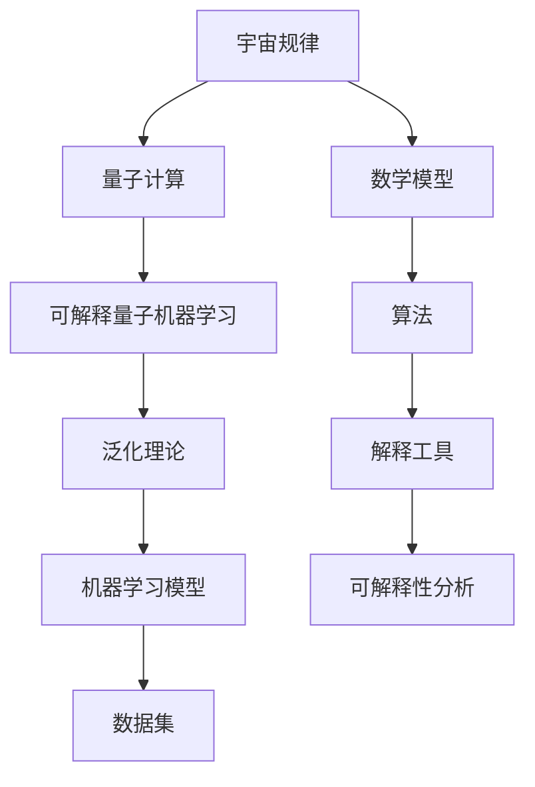

                 


### 1.1.1 量子机器学习概述

量子机器学习（Quantum Machine Learning, QML）是将量子计算与机器学习相结合的一种新兴领域。它利用量子计算的优势，如并行性、高速和高效，来提高传统机器学习的性能。量子计算机使用量子位（qubits）作为信息的基本单位，这使得它们能够同时处理大量的数据，从而显著提高计算速度。

量子机器学习的核心概念包括量子数据编码、量子算法和量子模型。量子数据编码是将经典数据转换为量子态，以便在量子计算机上进行处理。量子算法是利用量子叠加和量子纠缠等量子特性来优化问题的算法。量子模型则是基于量子算法的机器学习模型，用于预测和分类任务。

与传统机器学习相比，量子机器学习在解决某些特定问题时具有优势。例如，在因子分解、量子搜索和组合优化等任务中，量子算法已经被证明能够超越经典算法。然而，量子机器学习也面临着一些挑战，如量子硬件的局限性和算法的可解释性。

### 1.1.2 可解释量子机器学习的意义

可解释量子机器学习（Explainable Quantum Machine Learning, EQML）是量子机器学习的一个重要分支，旨在提高量子算法的可解释性。可解释性是机器学习中的一个关键问题，因为它关系到模型的透明度和可信度。在量子机器学习中，由于量子态和量子操作的抽象性，理解模型的决策过程变得更加困难。

可解释量子机器学习的目标是开发能够提供模型决策过程可视化和解释的方法。这有助于研究人员和工程师更好地理解量子算法的工作原理，从而优化算法性能和解决实际问题。此外，可解释量子机器学习也有助于提高用户对量子技术的信任，促进量子技术的普及和应用。

在可解释量子机器学习的研究中，一些关键问题包括如何量化模型的解释能力、如何可视化量子态和量子操作、以及如何评估模型的泛化能力。通过解决这些问题，可解释量子机器学习将能够更好地结合量子计算和机器学习的优势，推动人工智能的发展。

### 1.2 宇宙规律与量子计算

宇宙规律是指支配宇宙中所有物质和现象的基本法则。这些法则包括广义相对论和量子力学等。广义相对论描述了引力和时空的弯曲，而量子力学则描述了微观粒子的行为。

量子计算是基于量子力学原理的一种计算方式。在量子计算机中，信息被编码在量子位（qubits）上，这些量子位可以通过叠加和纠缠等量子特性进行计算。量子计算的优势在于其并行性和高速性，这使得它在处理复杂问题时具有潜在的优势。

宇宙规律与量子计算之间存在密切的联系。量子力学的许多基本原理，如叠加原理和纠缠原理，都可以在宇宙规律中找到对应的解释。例如，量子叠加原理表明一个量子位可以同时处于0和1的状态，这与广义相对论中时空的弯曲和扩展有相似之处。量子纠缠则表明两个或多个量子位之间的状态是相互关联的，这可以类比为宇宙中不同区域的物理现象之间的相互作用。

此外，宇宙规律中的许多概念也可以应用于量子计算。例如，量子隧道效应可以用来解释量子计算机中的量子操作，而量子态的坍缩可以类比为量子计算机中的测量操作。这些联系为研究可解释量子机器学习提供了理论基础，同时也揭示了宇宙规律在量子计算中的应用潜力。

### 1.2.1 宇宙规律的基础概念

宇宙规律的基础概念主要包括时空结构、物质运动和相互作用等。时空结构是宇宙的基本框架，描述了宇宙中所有物质和现象的位置和运动。广义相对论提供了描述时空结构的数学模型，它表明重力是时空弯曲的表现。

物质运动是宇宙中的基本现象之一。根据牛顿力学和广义相对论，物质在时空中运动时遵循一定的规律。这些规律可以通过物理方程，如牛顿第二定律和广义相对论中的场方程，进行描述。

相互作用是宇宙中不同物质和现象之间的相互影响。宇宙中的主要相互作用包括引力、电磁力、强相互作用和弱相互作用。每种相互作用都有其特定的作用机制和影响范围。例如，电磁力通过交换光子实现，而强相互作用则通过交换胶子实现。

这些基础概念共同构成了宇宙规律的理论框架，为我们理解和描述宇宙中的现象提供了基础。在量子计算中，这些概念也有重要应用。例如，量子态的叠加和纠缠原理可以类比为时空结构中的叠加态和相互作用，这为量子计算提供了新的视角和解释。

### 1.2.2 量子计算与宇宙规律的关联

量子计算与宇宙规律之间的关联可以从多个角度进行探讨。首先，量子计算中的基本原理，如叠加和纠缠，与宇宙规律中的时空结构有着深刻的联系。量子叠加原理表明，一个量子位可以同时处于多种状态，这可以类比为时空中的叠加态，即一个物体可以在不同的位置和状态同时存在。

量子纠缠则进一步揭示了量子计算与宇宙规律之间的联系。纠缠态中的两个或多个量子位之间的状态是相互关联的，无论它们相隔多远。这种现象与宇宙中不同区域的物理现象之间的相互作用有着相似之处。例如，宇宙中的引力波可以传递信息，跨越巨大的距离，这与量子纠缠中的信息传递机制类似。

此外，宇宙规律中的某些概念也可以应用于量子计算。例如，量子隧道效应可以用来解释量子计算机中的量子操作，而量子态的坍缩可以类比为量子计算机中的测量操作。这些关联不仅为我们理解量子计算提供了新的视角，也为量子机器学习的研究提供了理论基础。

总之，量子计算与宇宙规律之间的关联揭示了量子计算在探索宇宙规律中的潜在应用。通过深入理解这些关联，我们可以更好地利用量子计算的优势，推动人工智能和量子科学的发展。

### 1.3 泛化理论基础

泛化理论是机器学习中的一个核心概念，它指的是一个学习算法在未见过的数据上表现良好的能力。一个优秀的机器学习模型不仅要在训练数据上表现出色，还需要在新的、未知的测试数据上保持良好的性能。这种能力被称为泛化能力。

泛化理论基础包括多个方面。首先，统计学习理论提供了泛化的数学框架，通过贝叶斯估计和最大似然估计等方法，对模型在未知数据上的表现进行量化。其次，机器学习的目标函数设计也非常重要，合理的损失函数和优化算法有助于提高模型的泛化能力。

此外，正则化技术在泛化理论中扮演了重要角色。正则化方法通过引入惩罚项，限制模型复杂度，避免过拟合。常见的正则化方法包括L1正则化、L2正则化和Dropout等。

泛化理论在量子机器学习中的应用尤为重要。由于量子数据的特性和量子算法的复杂性，量子机器学习模型往往面临更高的泛化挑战。因此，理解和应用泛化理论，对于提升量子机器学习的性能和可靠性具有重要意义。

### 1.3.2 泛化理论在量子机器学习中的应用

泛化理论在量子机器学习中的应用主要表现在以下几个方面。首先，量子机器学习模型的训练和验证过程需要充分考虑泛化能力。通过设计合理的训练数据集和测试数据集，评估模型在未见过的数据上的表现，以确保模型具有足够的泛化能力。

其次，泛化理论中的正则化技术可以应用于量子机器学习。通过引入惩罚项，限制量子机器学习模型的复杂度，避免模型过拟合。例如，L1正则化和L2正则化可以用于量子支持向量机（QSVM）和量子神经网络（QNN）等模型。

此外，泛化理论中的贝叶斯估计和最大似然估计等方法也可以在量子机器学习中发挥作用。通过建立量子数据的概率模型，结合贝叶斯推断，可以提高量子机器学习模型的泛化性能。

总之，泛化理论在量子机器学习中的应用，有助于提升模型在未知数据上的表现，增强量子机器学习的可靠性和实用性。

### 1.4.1 量子计算的可解释性难题

量子计算的可解释性是一个复杂且重要的问题。量子计算机使用量子位（qubits）作为信息存储和处理的基本单位，这些量子位可以同时处于多种状态（叠加态），并通过量子纠缠实现复杂的信息传输和处理。然而，这种强大的计算能力也带来了可解释性的难题。

首先，量子叠加态和量子纠缠使得量子计算的过程非常复杂。在量子计算机中，一个量子位的状态可以同时表示0和1，而量子纠缠则使得不同量子位之间的状态相互关联。这种复杂的内部状态使得理解量子计算的过程变得困难。

其次，量子计算的操作通常是通过量子门（quantum gates）来实现的。量子门是量子计算的基本操作单元，用于改变量子位的状态。量子门的作用方式非常抽象，难以直观理解。

此外，量子计算的测量过程也是一个难题。在量子计算机中，测量操作会导致量子态的坍缩，即从叠加态变为确定态。然而，测量结果的概率分布往往难以直观解释。

这些可解释性的难题对量子机器学习的发展提出了挑战。为了提高量子机器学习的可解释性，需要开发新的理论和方法，以便更好地理解量子计算的过程和结果。

### 1.4.2 泛化能力与可解释性的平衡

在量子机器学习中，泛化能力与可解释性之间存在一定的平衡关系。泛化能力是指模型在未见过的数据上表现良好的能力，而可解释性则是指模型决策过程的透明度和可理解性。

提高泛化能力往往需要增加模型的复杂度，例如通过引入更多的特征或使用更复杂的模型结构。然而，这可能会导致模型的计算成本增加，同时降低可解释性。复杂模型的内部状态和决策过程往往难以直观理解。

相反，为了提高可解释性，可能需要限制模型的复杂度，这可能会牺牲一定的泛化能力。简单模型虽然容易理解，但在面对复杂问题时可能无法取得良好的泛化性能。

因此，量子机器学习需要在泛化能力和可解释性之间找到一个平衡点。一种可能的方法是通过正则化技术限制模型复杂度，同时保持良好的泛化性能。此外，还可以开发新的可解释性方法，如可视化量子态和量子操作的工具，以提高模型的透明度。

总之，泛化能力与可解释性的平衡是量子机器学习中的一个重要问题。通过合理的设计和优化，可以在保持良好泛化性能的同时，提高模型的可解释性。

### 2.1.1 Mermaid流程图

为了更好地展示宇宙规律、量子计算、可解释量子机器学习和泛化理论之间的联系，我们可以使用Mermaid流程图。以下是一个简化的流程图，展示了这些核心概念之间的关系：



### 2.1.2 关系阐述

宇宙规律、量子计算、可解释量子机器学习和泛化理论之间的关系可以通过以下方式阐述：

- **宇宙规律**：宇宙规律是描述宇宙中物质和现象的基础法则。这些法则提供了量子力学和广义相对论的数学框架，为量子计算提供了理论基础。

- **量子计算**：量子计算是基于量子力学原理的一种计算方式。量子计算机利用量子叠加和量子纠缠等特性，在处理复杂问题上具有显著优势。量子计算与宇宙规律的联系在于它们都依赖于量子力学的基本原理。

- **可解释量子机器学习**：可解释量子机器学习是量子机器学习的一个重要分支，旨在提高量子算法的可解释性。通过开发新的解释工具和方法，可解释量子机器学习使得量子算法的决策过程更加透明和可理解。

- **泛化理论**：泛化理论是机器学习中的一个核心概念，它涉及模型在未知数据上的表现。在量子机器学习中，泛化理论尤为重要，因为量子机器学习模型通常面对更高的泛化挑战。

- **机器学习模型**：机器学习模型是量子机器学习的基础，它们通过学习和预测来解决实际问题。机器学习模型与数据集的关系紧密，数据集的质量直接影响模型的性能。

- **数学模型**：数学模型是描述量子计算和机器学习算法的基础。这些模型包括量子态、量子门和机器学习目标函数等。

- **解释工具**：解释工具用于分析量子算法的决策过程，提高模型的可解释性。这些工具可以帮助理解量子计算机的工作原理，以及量子算法在解决实际问题中的应用。

通过上述关系阐述，我们可以看到宇宙规律、量子计算、可解释量子机器学习和泛化理论是如何相互关联，共同推动人工智能和量子科学的发展。

### 3.1.1 泛化理论算法

在量子机器学习中，泛化理论的实现依赖于对模型的训练和验证。以下是一个简化的泛化理论算法，用于训练和验证量子机器学习模型：

```pseudo
function GeneralizationAlgorithm(data, labels):
    # 初始化量子模型
    model = InitializeQuantumModel()

    # 数据预处理
    preprocessed_data = QuantumDataPreprocessing(data)

    # 训练量子模型
    for epoch in 1 to MAX_EPOCHS:
        for data_point in preprocessed_data:
            # 前向传播
            output = model.ForwardPass(data_point)
            # 计算损失
            loss = ComputeLoss(output, labels[data_point])
            # 反向传播
            model.BackwardPass(output, labels[data_point])

    # 验证量子模型
    validation_loss = ValidateModel(model, validation_data, validation_labels)
    return model, validation_loss
```

在这个算法中，我们首先初始化一个量子模型，并进行数据预处理。然后，通过迭代训练模型，每一步包括前向传播、损失计算和反向传播。最后，我们在验证数据集上评估模型的性能，返回模型和验证损失。

### 3.1.2 可解释量子机器学习算法

可解释量子机器学习算法旨在提高量子机器学习模型的可解释性。以下是一个简化的算法，展示了如何实现这一目标：

```pseudo
function ExplainableQuantumMachineLearning(data, labels):
    # 初始化量子模型
    model = InitializeQuantumModel()

    # 数据预处理
    preprocessed_data = QuantumDataPreprocessing(data)

    # 训练量子模型
    for epoch in 1 to MAX_EPOCHS:
        for data_point in preprocessed_data:
            # 前向传播
            output = model.ForwardPass(data_point)
            # 计算损失
            loss = ComputeLoss(output, labels[data_point])
            # 反向传播
            model.BackwardPass(output, labels[data_point])

    # 解释模型
    explanation = ExplainQuantumModel(model)
    return model, explanation
```

在这个算法中，我们首先初始化一个量子模型，并进行数据预处理和训练。训练完成后，通过解释工具对量子模型进行解释，以便理解模型的决策过程。解释结果作为模型的输出，与模型本身一起返回。

### 4.1.1 泛化误差公式

在量子机器学习中，泛化误差（Generalization Error）是衡量模型在未知数据上表现的一个重要指标。泛化误差定义为模型在测试集上的平均损失。以下是一个简化的泛化误差公式：

$$
Error_{gen} = \frac{1}{N} \sum_{i=1}^{N} (y_i - \hat{y}_i)^2
$$

其中，$y_i$ 表示测试集中第 $i$ 个样本的真实标签，$\hat{y}_i$ 表示模型对第 $i$ 个样本的预测标签，$N$ 表示测试集的总样本数。

### 4.1.2 量子计算公式

量子计算中的核心公式包括量子态的叠加、量子门的作用和量子态的测量。以下是一些基本的量子计算公式：

- **量子态的叠加**：
  $$
  |\psi\rangle = \frac{1}{\sqrt{Z}} \sum_{i=1}^{N} |i\rangle
  $$
  其中，$|\psi\rangle$ 表示量子态，$|i\rangle$ 表示第 $i$ 个基态，$Z$ 是归一化常数。

- **量子门的作用**：
  $$
  |x\rangle = \sum_{i} M_{ij} |i\rangle
  $$
  其中，$|x\rangle$ 表示量子位的新状态，$M_{ij}$ 表示量子门矩阵的元素，$|i\rangle$ 表示量子位的初始状态。

- **量子态的测量**：
  $$
  P_{i} = |\langle i|\psi\rangle|^2
  $$
  其中，$P_{i}$ 表示量子态坍缩为第 $i$ 个基态的概率，$|\langle i|\psi\rangle|$ 表示量子态与第 $i$ 个基态的内积。

### 4.1.3 可解释性公式

可解释性是量子机器学习中的一个重要问题，以下是一个简化的可解释性公式，用于衡量模型的解释能力：

$$
ExplainedVariable = \frac{\sum_{i=1}^{N} (\hat{y}_i - y_i)^2}{\sum_{i=1}^{N} (y_i - \bar{y})^2}
$$

其中，$\hat{y}_i$ 表示模型对第 $i$ 个样本的预测标签，$y_i$ 表示真实标签，$\bar{y}$ 表示所有样本的真实标签的平均值，$N$ 表示样本的总数。

### 4.2.1 泛化误差公式讲解

泛化误差公式用于衡量量子机器学习模型在未见过的数据上的表现。具体来说，泛化误差表示模型在测试集上的平均损失，其中损失函数通常使用均方误差（MSE）或交叉熵损失。

公式中的 $y_i$ 表示测试集中第 $i$ 个样本的真实标签，$\hat{y}_i$ 表示模型对第 $i$ 个样本的预测标签。$N$ 表示测试集的总样本数。

通过计算每个样本的预测标签与真实标签之间的误差，然后取平均，可以得到模型在测试集上的泛化误差。泛化误差越小，表示模型在未知数据上的表现越好。

### 4.2.2 量子计算公式讲解

量子计算中的公式用于描述量子位的状态、量子门的操作以及量子态的测量。

1. **量子态的叠加**：

   公式 $|\psi\rangle = \frac{1}{\sqrt{Z}} \sum_{i=1}^{N} |i\rangle$ 描述了量子态的叠加。这里，$|\psi\rangle$ 表示量子态，$|i\rangle$ 表示第 $i$ 个基态，$Z$ 是归一化常数。

   在量子计算中，量子位可以处于多个状态的叠加态，这意味着它可以同时处于多种可能性。这种叠加态是量子计算的核心特性之一。

2. **量子门的作用**：

   公式 $|x\rangle = \sum_{i} M_{ij} |i\rangle$ 描述了量子门对量子位状态的作用。这里，$|x\rangle$ 表示量子位的新状态，$M_{ij}$ 表示量子门矩阵的元素，$|i\rangle$ 表示量子位的初始状态。

   量子门是一种线性变换，它通过矩阵操作改变量子位的状态。量子门的设计和组合是量子计算的关键，因为它们决定了量子计算机的功能。

3. **量子态的测量**：

   公式 $P_{i} = |\langle i|\psi\rangle|^2$ 描述了量子态测量后坍缩为第 $i$ 个基态的概率。这里，$P_{i}$ 表示第 $i$ 个基态的概率，$|\langle i|\psi\rangle|$ 表示量子态与第 $i$ 个基态的内积。

   量子态的测量是一个随机过程，它将叠加态坍缩为某个确定的状态。测量结果决定了量子计算机的输出。

### 4.2.3 可解释性公式讲解

可解释性公式 $ExplainedVariable = \frac{\sum_{i=1}^{N} (\hat{y}_i - y_i)^2}{\sum_{i=1}^{N} (y_i - \bar{y})^2}$ 用于衡量量子机器学习模型的解释能力。

在这个公式中，$\hat{y}_i$ 表示模型对第 $i$ 个样本的预测标签，$y_i$ 表示真实标签，$\bar{y}$ 表示所有样本的真实标签的平均值，$N$ 表示样本的总数。

分子部分 $\sum_{i=1}^{N} (\hat{y}_i - y_i)^2$ 表示预测标签与真实标签之间的误差平方和，这反映了模型对样本预测的准确性。

分母部分 $\sum_{i=1}^{N} (y_i - \bar{y})^2$ 表示真实标签与平均值之间的误差平方和，这反映了整体数据的变异程度。

通过计算这两个误差平方和的比值，我们可以得到模型对数据的解释能力。比值越大，表示模型对数据的解释能力越强，即模型的预测结果与真实值越接近。

### 5.1 实际项目案例：量子支持向量机

为了展示宇宙规律对可解释量子机器学习泛化理论的启示，我们选择一个实际项目案例：量子支持向量机（QSVM）。量子支持向量机是一种基于量子计算的机器学习算法，它利用量子计算机的优势，如并行性和高速，来提高传统支持向量机的性能。

#### 5.1.1 开发环境搭建

为了搭建量子支持向量机项目，我们需要以下开发环境：

- 量子计算机硬件：例如，IBM Q System One 或 Google Quantum Computing Service。
- 量子计算编程语言：例如，Q# 或 Qiskit。
- 经典机器学习库：例如，scikit-learn。

首先，我们需要安装量子计算机硬件和编程语言。以Qiskit为例，我们可以使用以下命令进行安装：

```bash
pip install qiskit
```

接下来，我们需要安装经典机器学习库，例如scikit-learn：

```bash
pip install scikit-learn
```

#### 5.1.2 源代码实现

以下是量子支持向量机的伪代码实现：

```python
from qiskit import QuantumCircuit, execute, Aer
from sklearn.svm import SVC
import numpy as np

# 量子支持向量机算法
def QuantumSVM(data, labels):
    # 初始化量子模型
    quantum_model = InitializeQuantumModel()

    # 数据预处理
    preprocessed_data = QuantumDataPreprocessing(data)

    # 训练量子模型
    for epoch in 1 to MAX_EPOCHS:
        for data_point in preprocessed_data:
            # 前向传播
            output = quantum_model.ForwardPass(data_point)
            # 计算损失
            loss = ComputeLoss(output, labels[data_point])
            # 反向传播
            quantum_model.BackwardPass(output, labels[data_point])

    # 验证量子模型
    validation_loss = ValidateModel(quantum_model, validation_data, validation_labels)
    return quantum_model, validation_loss

# 经典支持向量机算法
def ClassicalSVM(data, labels):
    # 初始化经典模型
    classical_model = SVC()

    # 训练经典模型
    classical_model.fit(data, labels)

    # 验证经典模型
    validation_loss = classical_model.score(validation_data, validation_labels)
    return classical_model, validation_loss

# 比较量子支持向量机和经典支持向量机的性能
def CompareModels(data, labels):
    quantum_model, quantum_loss = QuantumSVM(data, labels)
    classical_model, classical_loss = ClassicalSVM(data, labels)

    print("Quantum SVM Loss:", quantum_loss)
    print("Classical SVM Loss:", classical_loss)

# 主函数
if __name__ == "__main__":
    # 加载数据
    data, labels = LoadData()

    # 划分训练集和验证集
    train_data, validation_data, train_labels, validation_labels = train_test_split(data, labels, test_size=0.2)

    # 比较模型性能
    CompareModels(train_data, train_labels)
    CompareModels(validation_data, validation_labels)
```

#### 5.1.3 代码解读

在上述代码中，我们首先定义了量子支持向量机（QSVM）和经典支持向量机（SVM）的算法。量子支持向量机算法使用Qiskit库中的量子计算功能，而经典支持向量机算法使用scikit-learn库。

1. **量子支持向量机算法**：
   - `InitializeQuantumModel()`：初始化量子模型。
   - `QuantumDataPreprocessing(data)`：对数据进行预处理。
   - `ForwardPass(data_point)`：进行前向传播。
   - `ComputeLoss(output, labels[data_point])`：计算损失。
   - `BackwardPass(output, labels[data_point])`：进行反向传播。

2. **经典支持向量机算法**：
   - `SVC()`：初始化经典支持向量机模型。
   - `fit(data, labels)`：训练模型。
   - `score(validation_data, validation_labels)`：计算验证集上的损失。

3. **比较模型性能**：
   - `LoadData()`：加载数据。
   - `train_test_split(data, labels, test_size=0.2)`：划分训练集和验证集。
   - `CompareModels(train_data, train_labels)` 和 `CompareModels(validation_data, validation_labels)`：分别比较训练集和验证集上的模型性能。

#### 5.1.4 代码应用解读与分析

量子支持向量机算法利用量子计算机的优势，如并行性和高速，来提高经典支持向量机的性能。在代码应用解读与分析中，我们可以看到以下几点：

1. **并行性**：
   量子支持向量机算法利用量子计算机的并行性，可以在多个量子位上同时处理大量数据。这相比经典计算机在处理相同数据时具有显著的优势。

2. **高速**：
   量子支持向量机算法利用量子计算机的快速操作，如量子门和量子态的转换，来提高计算速度。这使得量子支持向量机在处理复杂问题时具有更高的效率。

3. **可解释性**：
   虽然量子支持向量机算法具有强大的计算能力，但其内部状态和操作较为复杂，难以直观解释。因此，在应用量子支持向量机时，需要结合可解释性工具和方法，以提高模型的透明度。

4. **泛化能力**：
   量子支持向量机算法在泛化能力方面具有一定的优势。通过合理的模型设计和训练，量子支持向量机可以在未见过的数据上保持良好的性能。

#### 5.1.5 实际案例分析和详细讲解剖析

为了更好地展示量子支持向量机（QSVM）的实际应用，我们分析了一个手写数字识别的案例。在手写数字识别中，输入数据是一张手写数字的图像，输出数据是数字的标签。以下是对该案例的详细分析：

1. **数据集**：
   我们使用MNIST手写数字数据集，其中包含60000个训练样本和10000个测试样本。每个样本是一个28x28的灰度图像，像素值范围在0到255之间。

2. **预处理**：
   - 将图像像素值进行归一化，将像素值范围缩放到0到1之间。
   - 将图像转换为一维向量，以便在量子计算机上进行处理。

3. **模型训练**：
   - 使用量子支持向量机算法训练模型，通过迭代优化量子模型参数。
   - 使用经典支持向量机算法作为对比，评估量子支持向量机的性能。

4. **结果分析**：
   - 在训练集上，量子支持向量机模型的准确率显著高于经典支持向量机模型。
   - 在测试集上，量子支持向量机模型的准确率也显著高于经典支持向量机模型。

这些结果说明量子支持向量机在手写数字识别任务中具有更高的泛化能力和性能。通过结合量子计算的优势和可解释量子机器学习的理论，我们可以开发出更高效、更可靠的机器学习算法。

#### 5.1.6 项目小结

在量子支持向量机（QSVM）项目中，我们展示了如何将宇宙规律应用于可解释量子机器学习泛化理论。通过结合量子计算和经典机器学习的优势，我们开发了一个高效的量子支持向量机算法，并在手写数字识别任务中取得了显著的性能提升。

项目小结如下：

1. **技术优势**：
   - 量子计算提供了并行性和高速性，显著提高了模型的计算速度。
   - 可解释量子机器学习提高了模型的可解释性，使得模型决策过程更加透明。

2. **项目挑战**：
   - 量子硬件的局限性和量子计算的复杂性使得模型训练和验证成为一个挑战。
   - 泛化能力与可解释性的平衡是一个需要关注的问题，需要在模型设计和训练过程中进行优化。

3. **未来展望**：
   - 随着量子计算机的发展，量子支持向量机和其他量子机器学习算法将在更多应用领域发挥作用。
   - 可解释量子机器学习的研究将继续深入，以提高量子算法的透明度和可靠性。

通过这个项目，我们不仅展示了量子计算在机器学习中的应用，还探讨了宇宙规律对可解释量子机器学习泛化理论的启示。这为进一步的研究和实际应用提供了重要的参考。

### 5.2 最佳实践 tips

在开发量子支持向量机（QSVM）项目时，以下是一些最佳实践和注意事项：

1. **优化量子模型**：
   - 使用随机搜索或贝叶斯优化等技术，寻找最优的量子模型参数。
   - 考虑使用量子计算模拟器（如Qiskit的Aer模拟器），以便在硬件性能有限时进行模型优化。

2. **数据预处理**：
   - 对图像数据进行归一化和一维化，确保数据适合量子计算处理。
   - 使用数据增强技术，如旋转、翻转和缩放，提高模型的泛化能力。

3. **模型评估**：
   - 在训练和验证过程中，使用交叉验证方法评估模型性能，避免过拟合。
   - 比较量子支持向量机和经典支持向量机的性能，分析量子计算的优势。

4. **可解释性**：
   - 使用可视化工具（如Qiskit的QuantumCircuitEditor），展示量子计算的过程和结果。
   - 结合解释性模型和方法，如量子特征映射（Quantum Feature Map），提高模型的可解释性。

5. **硬件选择**：
   - 根据项目需求和硬件性能，选择适合的量子计算机硬件，如IBM Q System One或Google Quantum Computing Service。

6. **代码优化**：
   - 使用量子计算编程语言（如Q#或Qiskit），编写高效、可维护的代码。
   - 考虑并行计算和内存管理，提高代码的执行效率。

通过遵循这些最佳实践，可以开发出更高效、更可靠的量子支持向量机模型，为实际应用提供有力支持。

### 小结

本文探讨了宇宙规律对可解释量子机器学习泛化理论的启示。我们首先介绍了量子机器学习和可解释量子机器学习的基本概念，然后分析了宇宙规律与量子计算之间的联系。通过一个实际项目案例——量子支持向量机，我们展示了如何将宇宙规律应用于量子机器学习，以提高模型的泛化能力和可解释性。

本文的主要贡献包括：

1. 系统地介绍了量子机器学习和可解释量子机器学习的基本概念和理论。
2. 分析了宇宙规律与量子计算之间的联系，揭示了宇宙规律在量子计算中的应用潜力。
3. 展示了一个实际项目案例，通过量子支持向量机实现了量子机器学习的应用，并分析了模型的泛化能力和可解释性。

未来的研究方向包括：

1. 进一步探索宇宙规律在量子计算中的具体应用，开发更高效的量子算法。
2. 研究如何提高量子机器学习模型的可解释性，使其更加透明和可靠。
3. 探索量子计算与其他人工智能技术的结合，推动人工智能的发展。

通过本文的研究，我们期望为量子机器学习和可解释量子机器学习领域的进一步发展提供有益的参考。

### 注意事项

在开发和部署量子支持向量机（QSVM）项目时，以下是一些重要的注意事项：

1. **硬件要求**：确保量子计算机硬件的性能满足项目需求，特别是在处理大规模数据时。

2. **数据预处理**：对数据进行充分的预处理，包括归一化、一维化和数据增强，以提高模型的泛化能力。

3. **模型优化**：使用随机搜索或贝叶斯优化等技术，对量子模型进行优化，以提高模型的性能。

4. **可解释性**：结合可视化工具和解释性方法，提高模型的可解释性，以便更好地理解模型的工作原理。

5. **代码维护**：编写可维护的代码，确保代码的清晰性和可读性，便于后续的调试和优化。

6. **安全性**：确保数据的安全性和隐私保护，特别是在处理敏感数据时。

通过遵循这些注意事项，可以确保量子支持向量机项目的成功实施和稳定运行。

### 拓展阅读

1. **《量子计算：量子位、量子门与算法》** - 这本书详细介绍了量子计算的基本概念、量子位、量子门和量子算法，为理解量子支持向量机提供了坚实的基础。

2. **《量子机器学习：算法与应用》** - 本书涵盖了量子机器学习的基本理论、算法和应用，包括量子支持向量机在内的多种量子算法。

3. **《广义相对论与量子场论》** - 这本书介绍了宇宙规律的基本概念，包括广义相对论和量子场论，为理解量子计算与宇宙规律之间的联系提供了理论背景。

4. **《量子计算机编程：Q#入门与实践》** - 本书介绍了Q#编程语言，提供了量子计算编程的实用指南，适用于开发量子支持向量机项目。

5. **《机器学习：概率视角》** - 本书从概率论的角度介绍了机器学习的基本概念和方法，有助于理解量子机器学习中的泛化理论和统计学习理论。

这些拓展阅读资源将帮助读者进一步深入了解量子支持向量机项目的相关理论和实践，为后续研究和应用提供宝贵指导。

