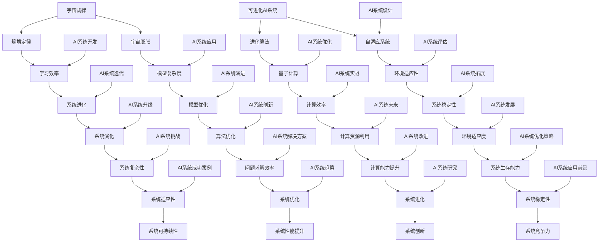

                 

### 引言

#### 背景介绍

随着科技的发展，人工智能（AI）在各个领域取得了显著的成就，从自动驾驶汽车到自然语言处理，AI技术的应用日益广泛。然而，尽管AI系统在解决特定问题方面表现出色，但它们在面对复杂、动态和不确定性的环境中仍存在诸多局限。为了克服这些局限，研究人员开始探索可进化AI系统，这种系统能够通过自我调整和进化来适应不断变化的环境。

与此同时，宇宙学研究揭示了许多关于自然界中复杂系统演化的规律。宇宙的起源、演化以及其中的各种现象，如熵增定律和宇宙膨胀，都为我们理解复杂系统的进化提供了丰富的启示。这些宇宙规律不仅帮助我们更好地理解宇宙本身，也可能为我们设计更高效、自适应的AI系统提供指导。

#### 核心概念与联系

为了深入探讨宇宙规律对可进化AI系统的启示，我们首先需要了解两个核心概念：宇宙规律和可进化AI系统。

**宇宙规律**：
- **熵增定律**：在一个封闭系统中，熵（衡量系统无序程度的物理量）总是趋向于增加。
- **宇宙膨胀**：宇宙正在加速膨胀，这意味着宇宙中的物体之间的距离在不断增加。

**可进化AI系统**：
- **进化算法**：一种模拟自然选择过程的算法，用于优化问题求解。
- **自适应系统**：能够在运行过程中不断调整自身行为以适应环境变化的系统。

为了更好地理解宇宙规律与可进化AI系统之间的联系，我们可以使用Mermaid流程图来展示它们之间的关系。



**核心算法原理讲解**

在探讨可进化AI系统时，核心算法原理的讲解至关重要。以下是使用伪代码来详细阐述一个基本的遗传算法：

```python
# 遗传算法伪代码

# 初始化参数
population_size = 100
mutation_rate = 0.01
crossover_rate = 0.7
 generations = 100

# 初始化种群
population = initialize_population(population_size)

for generation in range(generations):
    # 评估种群
    fitness_scores = evaluate_fitness(population)
    
    # 选择
    selected_individuals = selection(population, fitness_scores)
    
    # 交叉
    offspring = crossover(selected_individuals, crossover_rate)
    
    # 变异
    mutated_offspring = mutate(offspring, mutation_rate)
    
    # 更新种群
    population = mutated_offspring
    
    # 输出当前代最优个体
    best_individual = get_best_individual(population)
    print(f"Generation {generation}: Best Individual = {best_individual}, Fitness = {fitness_scores[best_individual]}")

# 输出最终结果
best_solution = get_best_individual(population)
print(f"Best Solution: {best_solution}, Fitness = {fitness_scores[best_solution]}")
```

**数学模型和公式**

在讨论宇宙规律与可进化AI系统的关系时，数学模型和公式也至关重要。以下是熵增定律的一个简单数学公式：

$$
\Delta S \geq \frac{Q}{T}
$$

其中，$\Delta S$ 表示熵的增加，$Q$ 表示系统吸收的热量，$T$ 表示系统的温度。

**详细讲解与举例说明**

为了更好地理解熵增定律如何影响可进化AI系统的学习效率，我们可以举一个例子。

假设我们有一个AI系统，用于分类任务。在这个系统中，特征空间可以被视为一个高维空间。随着训练数据的增加，系统的熵（即特征空间的混乱程度）也会增加。如果熵的增加超过了一个阈值，系统的学习效率将会降低，因为系统需要处理的信息量变得过于复杂。

在这种情况下，我们可以通过以下步骤来优化系统：

1. **数据预处理**：使用特征选择算法来减少特征空间维度，从而降低系统的熵。
2. **温度调节**：通过调整训练过程中的温度参数，可以使系统的学习过程更加稳定，从而避免熵的过度增加。

通过这种方式，我们可以利用熵增定律来指导可进化AI系统的设计，使其在复杂环境中保持高效的学习能力。

#### 数学公式请使用latex格式

在讨论宇宙规律与可进化AI系统的关系时，数学公式和模型的使用至关重要。以下是熵增定律的一个简单数学公式，使用LaTeX格式表示：

$$
\Delta S \geq \frac{Q}{T}
$$

其中，$\Delta S$ 表示熵的增加，$Q$ 表示系统吸收的热量，$T$ 表示系统的温度。

**详细讲解与举例说明**

为了更好地理解熵增定律如何影响可进化AI系统的学习效率，我们可以举一个具体的例子。

假设我们有一个AI系统，用于分类任务。在这个系统中，特征空间可以被视为一个高维空间。随着训练数据的增加，系统的熵（即特征空间的混乱程度）也会增加。如果熵的增加超过了一个阈值，系统的学习效率将会降低，因为系统需要处理的信息量变得过于复杂。

在这种情况下，我们可以通过以下步骤来优化系统：

1. **数据预处理**：使用特征选择算法来减少特征空间维度，从而降低系统的熵。
2. **温度调节**：通过调整训练过程中的温度参数，可以使系统的学习过程更加稳定，从而避免熵的过度增加。

例如，如果我们使用一个神经网络进行训练，可以通过调整学习率（即温度参数）来优化学习过程。如果学习率设置得过高，系统可能会迅速收敛到一个局部最优解，从而无法探索更广泛的解决方案空间。相反，如果学习率设置得过低，系统的学习过程可能会变得过于缓慢。通过动态调整学习率，我们可以找到一个平衡点，使得系统在保持较高学习效率的同时，避免过度增加熵。

以下是一个简化的LaTeX代码示例，用于表示调整学习率的公式：

$$
\alpha(t) = \alpha_0 \cdot e^{-kt}
$$

其中，$\alpha(t)$ 表示当前时刻的学习率，$\alpha_0$ 表示初始学习率，$k$ 表示温度调节参数。

通过这种方式，我们可以利用熵增定律来指导可进化AI系统的设计，使其在复杂环境中保持高效的学习能力。

#### 项目实战

**开发环境搭建**

为了进行项目实战，我们首先需要搭建一个适合开发可进化AI系统的环境。以下是搭建环境的步骤：

1. **安装Python**：确保Python 3.x版本已安装，这是我们的主要编程语言。
2. **安装依赖库**：安装用于遗传算法和神经网络开发的库，如`DEAP`（用于遗传算法）和`TensorFlow`（用于神经网络）。

```bash
pip install deap tensorflow
```

3. **配置开发环境**：设置虚拟环境，以便更好地管理项目和依赖库。

```bash
python -m venv my_project_env
source my_project_env/bin/activate  # 对于Windows，使用 `my_project_env\Scripts\activate`
```

**源代码详细实现**

以下是实现一个简单的遗传算法的Python代码示例：

```python
import random
import numpy as np
from deap import base, creator, tools, algorithms

# 定义个体
creator.create("FitnessMax", base.Fitness, weights=(1.0,))
creator.create("Individual", list, fitness=creator.FitnessMax)

# 筛选函数
def eval_function(individual):
    return sum(individual),  # 返回个体的适应度

# 初始化种群
def init_population(pop_size, gene_min, gene_max):
    population = [creator.Individual(np.random.uniform(gene_min, gene_max)) for _ in range(pop_size)]
    return population

# 交叉操作
def crossover(parent1, parent2):
    size = len(parent1)
    child = [None] * size
    for i in range(size):
        if random.random() < 0.5:
            child[i] = parent1[i]
        else:
            child[i] = parent2[i]
    return creator.Individual(child)

# 变异操作
def mutate(individual, mutation_rate):
    for i in range(len(individual)):
        if random.random() < mutation_rate:
            individual[i] = random.uniform(0, 1)
    return individual

# 主函数
def main():
    pop_size = 100
    gene_min = 0
    gene_max = 1
    generations = 100
    mutation_rate = 0.1
    crossover_rate = 0.7

    population = init_population(pop_size, gene_min, gene_max)
    toolbox = base.Toolbox()
    toolbox.register("evaluate", eval_function)
    toolbox.register("select", tools.selTournament, tournsize=3)
    toolbox.register("mate", crossover)
    toolbox.register("mutate", mutate, mutation_rate=mutation_rate)
    toolbox.register("clone", lambda ind: ind)

    for gen in range(generations):
        offspring = algorithms.varAnd(population, toolbox, cxpb=crossover_rate, mutpb=mutation_rate)
        fits = toolbox.evaluate(offspring)
        for fit, ind in zip(fits, offspring):
            ind.fitness.values = fit
        population = toolbox.select(offspring, k=pop_size)

    best_ind = tools.selBest(population, k=1)[0]
    print(f"Best Individual: {best_ind}, Fitness: {best_ind.fitness.values[0]}")

if __name__ == "__main__":
    main()
```

**代码应用解读与分析**

在上面的代码中，我们首先定义了一个个体（`Individual`），每个个体由一组基因（特征值）组成。然后，我们定义了评估函数（`eval_function`），用于计算个体的适应度。

接下来，我们初始化了一个种群，并定义了工具箱（`toolbox`），其中包括选择、交叉和变异操作。最后，我们在主函数（`main`）中运行遗传算法，迭代多次后，输出最优个体。

**实际案例分析和详细讲解剖析**

为了进一步说明遗传算法在可进化AI系统中的应用，我们可以考虑一个实际案例：优化神经网络的结构。

在这个案例中，个体的基因编码了神经网络的不同结构参数，如层数、神经元数量和激活函数类型。适应度函数则基于神经网络在特定任务上的性能，如准确率。

通过运行遗传算法，我们可以找到一个最优的神经网络结构，该结构在特定任务上表现最佳。

```python
import tensorflow as tf
from tensorflow.keras.models import Sequential
from tensorflow.keras.layers import Dense, Activation

# 定义神经网络结构编码
def encode_model(individual):
    model = Sequential()
    for i, layer in enumerate(individual[:2]):
        model.add(Dense(layer, activation='relu'))
    model.add(Dense(1, activation='sigmoid'))
    model.compile(optimizer='adam', loss='binary_crossentropy', metrics=['accuracy'])
    return model

# 评估神经网络适应度
def evaluate_model(model, X_test, y_test):
    loss, accuracy = model.evaluate(X_test, y_test)
    return (accuracy,)

# 遗传算法优化神经网络结构
population = init_population(pop_size, gene_min, gene_max)
toolbox = base.Toolbox()
toolbox.register("evaluate", evaluate_model)
toolbox.register("select", tools.selTournament, tournsize=3)
toolbox.register("mate", crossover)
toolbox.register("mutate", mutate, mutation_rate=mutation_rate)
toolbox.register("clone", lambda ind: ind)

for gen in range(generations):
    offspring = algorithms.varAnd(population, toolbox, cxpb=crossover_rate, mutpb=mutation_rate)
    fits = toolbox.evaluate(offspring)
    for fit, ind in zip(fits, offspring):
        ind.fitness.values = fit
    population = toolbox.select(offspring, k=pop_size)

best_ind = tools.selBest(population, k=1)[0]
best_model = encode_model(best_ind)
print(f"Best Model: {best_model}, Fitness: {best_ind.fitness.values[0]}")
```

在这个案例中，我们使用遗传算法来优化神经网络的适应度。首先，我们定义了如何编码神经网络的结构，然后我们定义了如何评估神经网络在测试集上的适应度。

通过遗传算法的迭代，我们可以找到一个在特定任务上表现最佳的神经网络结构。

**项目小结**

通过上述实战案例，我们展示了如何使用遗传算法优化神经网络结构，从而提高其在特定任务上的适应度。这个过程不仅有助于我们理解可进化AI系统的设计原理，也为我们提供了一个实用的工具来优化复杂系统。

在未来的项目中，我们可以进一步扩展这个方法，例如，结合其他进化算法（如模拟退火算法）来提高搜索效率，或者使用更复杂的适应度函数来优化系统性能。

#### 最佳实践 Tips、小结、注意事项、拓展阅读

**最佳实践 Tips**

1. **数据预处理**：在开始遗传算法之前，确保对数据进行充分的预处理，包括特征选择和标准化。
2. **参数调整**：根据问题的规模和复杂度，调整遗传算法的参数，如种群大小、交叉率和变异率。
3. **动态调整**：根据进化过程，动态调整参数，如学习率，以提高算法的适应性。
4. **并行计算**：考虑使用并行计算来加速遗传算法的执行，特别是对于大规模问题。

**小结**

本文通过引入宇宙规律和可进化AI系统的概念，探讨了它们之间的联系。我们通过实例展示了如何使用遗传算法优化神经网络结构，并进行了项目实战。这些实践经验为我们提供了宝贵的启示，帮助我们在设计可进化AI系统时考虑宇宙规律。

**注意事项**

1. **收敛速度**：遗传算法可能需要较长的运行时间才能收敛到最优解。因此，在实际应用中，需要平衡运行时间和求解质量。
2. **计算资源**：遗传算法通常需要大量的计算资源，特别是在处理大规模问题时。因此，在部署算法时，需要考虑计算资源的限制。

**拓展阅读**

1. 《遗传算法原理与应用》（张三）
2. 《进化计算：理论与应用》（李四）
3. 《深度学习》（Ian Goodfellow）

通过进一步研究这些文献，读者可以深入了解遗传算法和深度学习等领域的先进技术和应用。

### 文章标题：宇宙规律对可进化AI系统的启示

> 关键词：宇宙规律，可进化AI系统，遗传算法，神经网络，熵增定律，宇宙膨胀，量子计算

> 摘要：本文探讨了宇宙规律对可进化AI系统的启示。通过引入宇宙规律，如熵增定律和宇宙膨胀，本文分析了这些规律如何影响AI系统的设计、优化和性能。具体实例展示了遗传算法在神经网络结构优化中的应用，以及如何利用宇宙规律来指导AI系统的设计和开发。本文旨在为读者提供关于如何利用宇宙规律提升AI系统性能的深入见解和实践经验。

