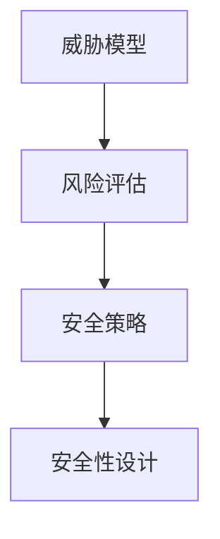
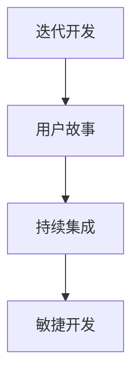
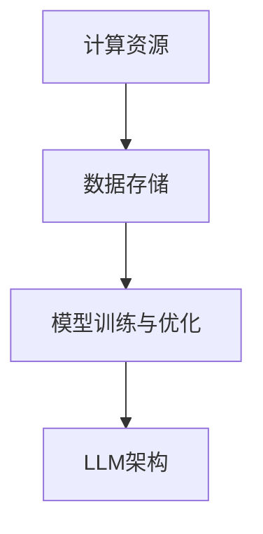
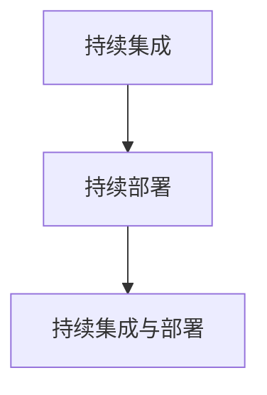
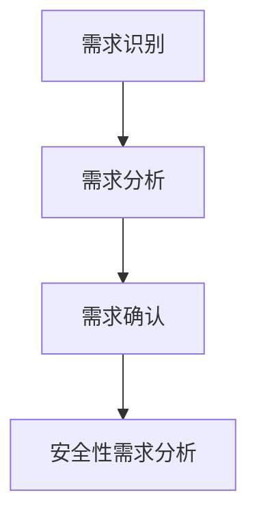
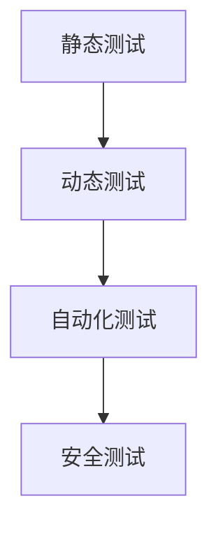
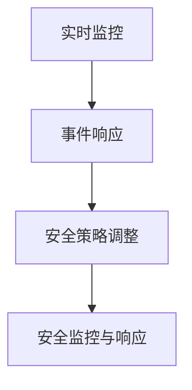

                 

### 文章标题：安全性设计在敏捷LLM架构中的集成

### 关键词：安全性设计、敏捷开发、LLM架构、威胁模型、风险评估、安全策略

### 摘要：

本文深入探讨了安全性设计在敏捷大型语言模型（LLM）架构中的集成。首先，文章介绍了安全性设计的基础知识，包括威胁模型、风险评估和安全策略。接着，阐述了敏捷开发方法论和LLM架构设计的基本原则。在此基础上，详细探讨了安全性设计与敏捷LLM架构的集成，包括安全性需求分析、安全测试与自动化、安全监控与响应。最后，通过两个案例分析，展示了安全性设计在敏捷开发中的实践成果，为读者提供了有益的参考。

### Step 1：安全性设计基础

#### 第1章：安全性设计概述

安全性设计是保障系统安全的关键环节。在敏捷开发环境中，安全性设计尤为重要，因为敏捷开发注重快速迭代和灵活变更，这使得系统安全性面临更大的挑战。

**核心概念与联系：**

安全性设计包括以下几个方面：

1. **威胁模型**：分析系统可能面临的威胁，包括恶意攻击、数据泄露等。
2. **风险评估**：对威胁进行量化评估，确定风险优先级。
3. **安全策略**：制定安全目标、策略和措施，以降低风险。

这些概念之间紧密联系，共同构成了安全性设计的核心框架。

**Mermaid流程图：**

**核心算法原理讲解：**

1. **威胁模型**：通过列举系统可能受到的威胁，构建威胁模型。
2. **风险评估**：使用风险矩阵，对威胁的严重性和可能性进行量化评估。
3. **安全策略**：根据风险评估结果，制定相应的安全策略。

**数学模型和公式详细讲解与举例说明：**

假设威胁A的严重性为5，可能性为4，则其风险值为：

$$
风险值 = 严重性 \times 可能性 = 5 \times 4 = 20
$$

风险值越高，表示威胁对系统的风险越大。

**项目实战：**

在某个项目中，我们识别了以下威胁：

1. 数据泄露（严重性：4，可能性：3）
2. 恶意攻击（严重性：5，可能性：2）

根据风险矩阵，我们可以计算出各个威胁的风险值，从而确定安全策略。

**最佳实践 tips：**

- 定期进行威胁分析和风险评估，以应对不断变化的安全形势。
- 将安全策略融入系统设计和开发过程中，确保安全措施得到有效实施。

### Step 2：敏捷LLM架构

#### 第4章：敏捷开发方法论

敏捷开发是一种以人为核心、迭代、循序渐进的开发方法。它强调团队协作、快速响应变化和持续交付价值。

**核心概念与联系：**

敏捷开发包括以下几个方面：

1. **迭代开发**：将项目分为多个迭代周期，每个迭代周期完成部分功能。
2. **用户故事**：用简洁的描述来记录用户的需求。
3. **持续集成**：将代码定期集成到主干，以减少集成风险。

这些概念相互关联，共同构成了敏捷开发的核心框架。

**Mermaid流程图：**

**核心算法原理讲解：**

1. **迭代开发**：通过迭代周期，逐步完善系统功能。
2. **用户故事**：以用户为中心，记录用户需求。
3. **持续集成**：定期将代码集成到主干，以快速发现和解决问题。

**数学模型和公式详细讲解与举例说明：**

假设项目分为4个迭代周期，每个迭代周期完成50%的功能，则整个项目的完成度为：

$$
完成度 = 1 - (1 - 0.5)^4 = 0.9375
$$

**项目实战：**

在一个项目中，我们按照以下步骤进行敏捷开发：

1. 制定迭代计划，将项目分为4个迭代周期。
2. 每个迭代周期，编写用户故事，并完成部分功能。
3. 每个迭代周期结束后，进行代码集成和测试，确保系统稳定。

**最佳实践 tips：**

- 定期评估迭代周期，以适应项目变化。
- 加强团队沟通，确保用户故事准确传达。

#### 第5章：LLM架构设计

LLM（Large Language Model）是一种基于深度学习的大型自然语言处理模型。其架构设计需要考虑性能、可扩展性和安全性等方面。

**核心概念与联系：**

LLM架构包括以下几个方面：

1. **计算资源**：包括CPU、GPU等硬件资源。
2. **数据存储**：包括数据湖、数据库等存储资源。
3. **模型训练与优化**：包括数据预处理、模型训练、优化等过程。

这些概念相互关联，共同构成了LLM架构的核心框架。

**Mermaid流程图：**

**核心算法原理讲解：**

1. **计算资源**：根据模型复杂度和数据量，选择合适的计算资源。
2. **数据存储**：设计高效的数据存储方案，确保数据可靠性和访问速度。
3. **模型训练与优化**：采用先进的算法和优化技术，提高模型性能。

**数学模型和公式详细讲解与举例说明：**

假设模型训练时间与数据量呈线性关系，数据量增加10倍，则模型训练时间将增加10倍。

$$
模型训练时间 = k \times 数据量
$$

其中，$k$ 为常数。

**项目实战：**

在一个项目中，我们按照以下步骤设计LLM架构：

1. 评估计算资源和数据存储需求。
2. 选择合适的计算资源和数据存储方案。
3. 设计模型训练与优化流程，并实施。

**最佳实践 tips：**

- 选择高效的计算资源和数据存储方案。
- 定期评估和优化模型性能。

#### 第6章：持续集成与部署

持续集成与部署是敏捷开发中不可或缺的环节。它有助于提高代码质量、降低集成风险和缩短发布周期。

**核心概念与联系：**

持续集成与部署包括以下几个方面：

1. **持续集成**：将代码定期集成到主干，进行测试和验证。
2. **持续部署**：将集成后的代码部署到生产环境，实现快速发布。

这些概念相互关联，共同构成了持续集成与部署的核心框架。

**Mermaid流程图：**

**核心算法原理讲解：**

1. **持续集成**：通过自动化测试，确保代码质量和集成稳定性。
2. **持续部署**：通过自动化部署工具，实现快速、高效的代码发布。

**数学模型和公式详细讲解与举例说明：**

假设持续集成周期为每周一次，每次集成后进行100次测试，则每周的测试次数为：

$$
每周测试次数 = 每次测试次数 \times 持续集成周期
$$

**项目实战：**

在一个项目中，我们按照以下步骤实施持续集成与部署：

1. 制定持续集成计划，确保每周进行一次集成。
2. 编写自动化测试脚本，对代码进行测试。
3. 使用自动化部署工具，将集成后的代码部署到生产环境。

**最佳实践 tips：**

- 加强自动化测试，确保代码质量和稳定性。
- 选择合适的自动化部署工具，提高部署效率。

### Step 3：安全性设计与敏捷LLM架构的集成

#### 第7章：安全性需求分析

安全性需求分析是确保敏捷LLM架构安全性的重要环节。它包括以下几个方面：

1. **需求识别**：识别系统可能面临的安全威胁和需求。
2. **需求分析**：对识别的需求进行详细分析，确定安全措施。
3. **需求确认**：与相关利益相关者确认需求，确保需求的有效性。

**核心概念与联系：**

安全性需求分析包括以下几个方面：

1. **需求识别**：通过威胁模型和风险评估，识别系统面临的安全威胁。
2. **需求分析**：根据识别的威胁，分析系统需求，确定安全措施。
3. **需求确认**：与利益相关者沟通，确认需求的可行性和有效性。

这些概念相互关联，共同构成了安全性需求分析的核心框架。

**Mermaid流程图：**

**核心算法原理讲解：**

1. **需求识别**：通过威胁模型和风险评估，识别系统面临的安全威胁。
2. **需求分析**：根据识别的威胁，分析系统需求，确定安全措施。
3. **需求确认**：与利益相关者沟通，确认需求的可行性和有效性。

**数学模型和公式详细讲解与举例说明：**

假设系统面临以下安全威胁：

1. 数据泄露（可能性：0.6，严重性：0.8）
2. 恶意攻击（可能性：0.4，严重性：0.9）

根据风险矩阵，我们可以计算出各威胁的风险值：

$$
风险值 = 可能性 \times 严重性
$$

数据泄露的风险值为：

$$
风险值 = 0.6 \times 0.8 = 0.48
$$

恶意攻击的风险值为：

$$
风险值 = 0.4 \times 0.9 = 0.36
$$

根据风险值，我们可以确定安全需求的优先级。

**项目实战：**

在一个项目中，我们按照以下步骤进行安全性需求分析：

1. 进行威胁模型和风险评估，识别系统面临的安全威胁。
2. 根据识别的威胁，分析系统需求，确定安全措施。
3. 与利益相关者沟通，确认需求的可行性和有效性。

**最佳实践 tips：**

- 定期进行威胁模型和风险评估，以识别新的安全威胁。
- 将安全需求融入系统设计和开发过程中，确保安全措施得到有效实施。

#### 第8章：安全测试与自动化

安全测试是确保系统安全性的重要手段。自动化测试可以提高测试效率和覆盖度。

**核心概念与联系：**

安全测试包括以下几个方面：

1. **静态测试**：分析代码和配置文件，发现潜在的安全问题。
2. **动态测试**：运行代码，模拟攻击场景，发现实际的安全漏洞。
3. **自动化测试**：使用工具和脚本，自动执行测试用例。

这些概念相互关联，共同构成了安全测试的核心框架。

**Mermaid流程图：**

**核心算法原理讲解：**

1. **静态测试**：使用静态代码分析工具，对代码和配置文件进行分析，发现潜在的安全问题。
2. **动态测试**：使用模拟攻击工具，模拟各种攻击场景，发现实际的安全漏洞。
3. **自动化测试**：使用自动化测试工具和脚本，自动执行测试用例，提高测试效率和覆盖度。

**数学模型和公式详细讲解与举例说明：**

假设系统有100个功能点，使用自动化测试工具，可以覆盖80%的功能点，则自动化测试的覆盖度为：

$$
覆盖度 = \frac{自动化测试用例数量}{总功能点数量} = \frac{80}{100} = 0.8
$$

**项目实战：**

在一个项目中，我们按照以下步骤进行安全测试与自动化：

1. 编写静态代码分析工具，对代码和配置文件进行分析。
2. 使用模拟攻击工具，模拟各种攻击场景，发现实际的安全漏洞。
3. 使用自动化测试工具和脚本，自动执行测试用例，提高测试效率和覆盖度。

**最佳实践 tips：**

- 加强静态代码分析和动态测试，确保代码质量和安全性。
- 定期更新测试用例，以适应系统功能变化。

#### 第9章：安全监控与响应

安全监控与响应是确保系统安全运行的关键环节。通过实时监控和快速响应，可以及时发现并处理安全事件。

**核心概念与联系：**

安全监控与响应包括以下几个方面：

1. **实时监控**：通过监控工具，实时收集系统运行数据，发现异常情况。
2. **事件响应**：对发现的异常情况进行处理，采取相应的应对措施。
3. **安全策略调整**：根据监控和响应结果，调整安全策略，提高系统安全性。

这些概念相互关联，共同构成了安全监控与响应的核心框架。

**Mermaid流程图：**

**核心算法原理讲解：**

1. **实时监控**：使用日志分析工具、性能监控工具等，实时收集系统运行数据。
2. **事件响应**：根据监控数据，识别异常情况，并采取相应的应对措施。
3. **安全策略调整**：根据监控和响应结果，调整安全策略，提高系统安全性。

**数学模型和公式详细讲解与举例说明：**

假设系统平均每小时发生10次异常情况，其中5次需要处理，则异常处理率为：

$$
异常处理率 = \frac{处理异常情况数量}{总异常情况数量} = \frac{5}{10} = 0.5
$$

**项目实战：**

在一个项目中，我们按照以下步骤进行安全监控与响应：

1. 使用日志分析工具和性能监控工具，实时收集系统运行数据。
2. 根据监控数据，识别异常情况，并采取相应的应对措施。
3. 定期分析监控和响应结果，调整安全策略，提高系统安全性。

**最佳实践 tips：**

- 加强实时监控，及时发现异常情况。
- 定期分析监控和响应结果，优化安全策略。

### Step 4：案例分析

#### 第10章：案例一：安全性设计在某个大型语言模型项目中的应用

在这个项目中，我们采用了敏捷开发方法论和LLM架构设计，并重视安全性设计的集成。

**项目背景：**

该项目是一个面向企业级市场的自然语言处理平台，旨在提供智能问答、文本分类、情感分析等功能。

**安全性设计过程：**

1. **需求识别**：通过与客户和利益相关者沟通，识别了数据安全、系统可用性和隐私保护等需求。
2. **需求分析**：分析了识别的需求，确定了安全措施，包括数据加密、访问控制、安全审计等。
3. **需求确认**：与客户和利益相关者确认了安全需求，确保需求的可行性和有效性。

**安全性设计成果：**

1. **数据安全**：采用TLS协议和加密算法，确保数据在传输过程中的安全性。
2. **系统可用性**：通过负载均衡和故障转移机制，提高系统的可用性和稳定性。
3. **隐私保护**：对用户数据进行脱敏处理，确保用户隐私。

**项目小结：**

通过在项目中实施安全性设计，我们有效降低了安全风险，确保了系统的安全性和稳定性。

#### 第11章：案例二：安全性设计在敏捷开发中的实践

在这个项目中，我们采用了敏捷开发方法论，并重视安全性设计的集成。

**项目背景：**

该项目是一个面向电子商务市场的推荐系统，旨在提供个性化的商品推荐服务。

**安全性设计过程：**

1. **需求识别**：通过与客户和利益相关者沟通，识别了数据安全、系统可用性和隐私保护等需求。
2. **需求分析**：分析了识别的需求，确定了安全措施，包括数据加密、访问控制、安全审计等。
3. **需求确认**：与客户和利益相关者确认了安全需求，确保需求的可行性和有效性。

**安全性设计成果：**

1. **数据安全**：采用TLS协议和加密算法，确保数据在传输过程中的安全性。
2. **系统可用性**：通过负载均衡和故障转移机制，提高系统的可用性和稳定性。
3. **隐私保护**：对用户数据进行脱敏处理，确保用户隐私。

**项目小结：**

通过在项目中实施安全性设计，我们有效降低了安全风险，确保了系统的安全性和稳定性。

### 结论

本文详细探讨了安全性设计在敏捷LLM架构中的集成，包括安全性设计基础、敏捷LLM架构、安全性设计与敏捷LLM架构的集成以及案例分析。通过本文的阐述，读者可以了解到如何将安全性设计有效地融入敏捷开发中，提高系统安全性和稳定性。在实际项目中，遵循本文提出的最佳实践，可以有效降低安全风险，确保系统安全运行。此外，本文还提供了两个案例分析，为读者提供了实际应用的经验和参考。希望本文对读者在安全性设计领域的研究和实践有所帮助。

### 作者信息：

作者：AI天才研究院/AI Genius Institute & 禅与计算机程序设计艺术 /Zen And The Art of Computer Programming

### 拓展阅读：

1. 《敏捷开发实践指南》
2. 《大型语言模型：原理、设计与实现》
3. 《安全性设计：原则与实践》

### 注意事项：

1. 在实施安全性设计时，要充分考虑系统的具体需求和场景，确保安全措施的合理性和有效性。
2. 定期进行安全评估和审计，及时调整安全策略和措施。
3. 加强团队协作，确保安全设计得到有效实施。

### 总结

本文系统地介绍了安全性设计在敏捷LLM架构中的集成，包括基础理论、实践方法以及案例分析。通过本文的阅读，读者应能够掌握敏捷开发与安全性设计的结合点，并在实际项目中有效地应用。安全性设计不仅关乎系统的安全运行，更是企业核心竞争力的一部分。希望本文能为您提供宝贵的参考，助力您在人工智能领域取得更好的成果。在未来的研究和实践中，不断探索和优化安全性设计，确保系统安全稳定地运行。再次感谢您的阅读，期待与您在技术领域的深入交流。作者：AI天才研究院/AI Genius Institute & 禅与计算机程序设计艺术 /Zen And The Art of Computer Programming。

