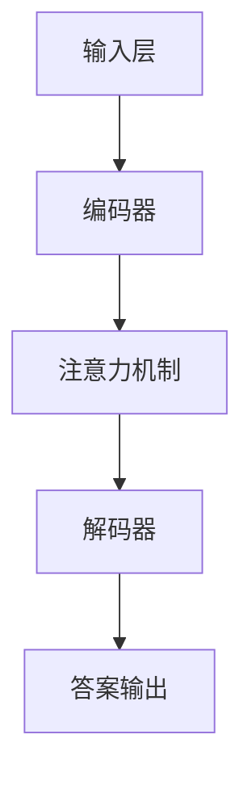
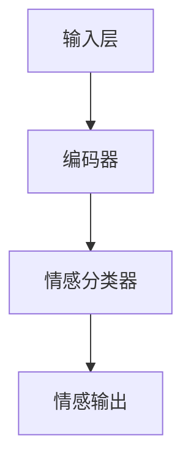
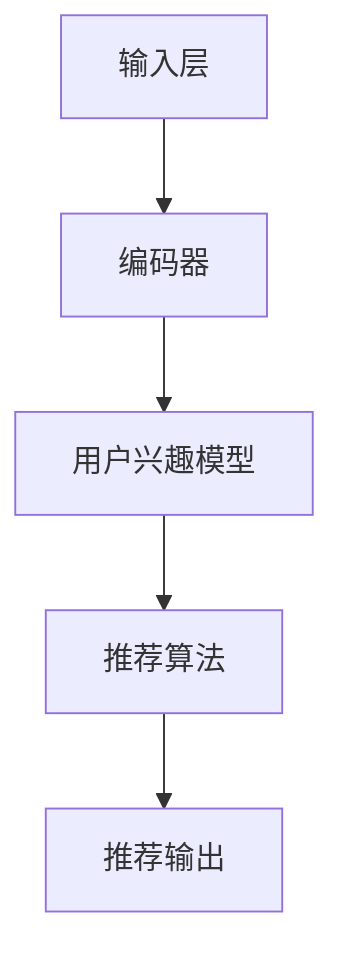

                 


### 文章标题：实时分析：从LLM应用数据中获取即时洞察

#### 关键词：
- 实时分析
- LLM（大型语言模型）
- 数据流处理
- 机器学习算法
- 深度学习
- 应用实例

#### 摘要：
本文将探讨实时分析在LLM应用中的重要性，通过深入解析实时分析的基础概念、技术实现、核心算法以及其在各个行业中的应用，为读者提供对实时分析及其在LLM领域应用的全景了解。文章将包含实时分析的基本概念、LLM的架构与实时分析的结合、实时分析算法的原理和实现、以及实时分析在不同行业中的实际应用案例。

### 引言

随着大数据和人工智能技术的飞速发展，实时分析作为一种高效的数据处理方法，逐渐成为各个行业的关键技术。实时分析能够对海量数据流进行即时处理和分析，从而快速发现有价值的信息和模式，为决策提供支持。在人工智能领域，特别是大型语言模型（LLM）的应用中，实时分析显得尤为重要。LLM作为自然语言处理的先进模型，其性能依赖于对输入数据的实时分析和处理能力。本文将围绕实时分析在LLM应用中的角色和实现方法进行深入探讨。

### 第一部分：实时分析基础

#### 1.1 实时分析的定义与重要性

实时分析是指对数据进行实时处理和分析，以快速获得有价值的洞察。在数据处理领域，实时分析通常涉及以下几个方面：

- **数据流处理**：实时分析的数据来源通常是数据流，如传感器数据、社交网络数据、金融交易数据等。这些数据以高速率、高频率产生，需要通过流处理技术进行实时处理。
- **实时查询**：用户可以针对实时数据进行实时查询，以获取即时的答案和决策支持。
- **数据质量**：实时数据的质量直接影响分析结果的准确性。因此，确保实时数据的准确性和完整性至关重要。

实时分析的重要性体现在以下几个方面：

- **快速响应**：实时分析能够快速处理数据，提供即时的洞察和决策支持，满足用户对实时信息的需求。
- **优化决策**：通过实时分析，企业可以及时调整业务策略，优化运营流程，提高效率。
- **风险控制**：在金融、医疗等高风险领域，实时分析有助于及时发现潜在风险，采取预防措施。

#### 1.2 实时分析与大数据的关系

大数据和实时分析密不可分。大数据技术为实时分析提供了丰富的数据源和计算能力。实时分析则通过高效的数据处理算法，对大数据进行实时挖掘和分析，从而发现有价值的信息。

- **数据来源**：大数据技术可以收集和处理来自各种来源的数据，如社交媒体、传感器网络、电子商务平台等。
- **计算能力**：大数据技术提供了强大的计算能力，支持海量数据的存储和处理。
- **实时分析**：实时分析利用大数据技术提供的计算能力和数据资源，对实时数据进行快速处理和分析。

#### 1.3 实时分析的技术架构

实时分析的技术架构通常包括以下几个方面：

- **数据采集**：通过传感器、API接口、日志文件等方式收集实时数据。
- **数据存储**：将采集到的实时数据存储到分布式数据库或数据仓库中，以便后续处理和分析。
- **数据处理**：采用流处理框架（如Apache Kafka、Apache Flink等）对实时数据进行处理，实现数据清洗、转换和聚合等操作。
- **实时查询**：通过实时查询系统（如Apache Druid、ClickHouse等）对实时数据进行实时查询和分析。
- **数据可视化**：利用数据可视化工具（如Tableau、Power BI等）将实时分析结果进行可视化展示，帮助用户快速理解数据。

### 第二部分：LLM应用中的实时分析

#### 2.1 LLM的基本概念与架构

大型语言模型（LLM）是一种基于深度学习的自然语言处理模型，通过学习大量的文本数据，能够生成高质量的文本、回答问题、翻译语言等。LLM的架构通常包括以下几个部分：

- **输入层**：接收用户输入的文本或语音信号。
- **编码器**：对输入文本进行编码，提取文本特征。
- **解码器**：根据编码器的输出生成文本或语音信号。
- **注意力机制**：帮助模型在处理输入文本时，关注重要的信息，提高生成文本的质量。

#### 2.2 LLM在实时分析中的应用

LLM在实时分析中具有广泛的应用，主要包括以下几个方面：

- **实时问答**：利用LLM的语义理解能力，实现实时问答系统，为用户提供即时的答案和帮助。
- **实时情感分析**：通过分析用户文本的情感倾向，实时评估用户情绪，为营销、客户服务等领域提供决策支持。
- **实时推荐系统**：利用LLM对用户文本的深入理解，实现个性化推荐，提高用户体验。
- **实时翻译**：利用LLM的翻译能力，实现实时翻译服务，支持跨语言沟通。

#### 2.3 LLM实时分析的优势与挑战

LLM在实时分析中具有以下优势：

- **强大的语义理解能力**：LLM能够理解输入文本的语义，实现更精准的分析和生成。
- **快速响应**：LLM的训练和推理过程高度并行化，能够实现快速响应。
- **多语言支持**：LLM能够支持多种语言，实现跨语言的实时分析。

然而，LLM在实时分析中也面临一些挑战：

- **计算资源消耗**：LLM的训练和推理过程需要大量计算资源，对实时分析的硬件设施有较高要求。
- **数据隐私和安全**：实时分析过程中涉及大量用户数据，需要确保数据隐私和安全。
- **模型可解释性**：LLM的黑盒特性使得其决策过程难以解释，影响模型的可信度和可接受度。

### 第三部分：实时分析在LLM中的应用实例

#### 3.1 实时问答系统

实时问答系统是LLM在实时分析中的一个典型应用。该系统通过对用户输入的文本进行实时分析，生成相关的答案。以下是一个简单的实时问答系统的实现框架：



具体实现步骤如下：

1. **输入层**：接收用户输入的文本。
2. **编码器**：对输入文本进行编码，提取文本特征。
3. **注意力机制**：在编码过程中，关注输入文本中的重要信息，提高生成答案的准确性。
4. **解码器**：根据编码器的输出生成答案。
5. **答案输出**：将生成的答案返回给用户。

#### 3.2 实时情感分析

实时情感分析是另一个重要的LLM应用场景。该系统通过对用户文本的情感倾向进行实时分析，评估用户的情绪。以下是一个简单的实时情感分析系统实现框架：



具体实现步骤如下：

1. **输入层**：接收用户输入的文本。
2. **编码器**：对输入文本进行编码，提取文本特征。
3. **情感分类器**：根据编码器的输出，对文本进行情感分类，生成情感标签。
4. **情感输出**：将生成的情感标签返回给用户。

#### 3.3 实时推荐系统

实时推荐系统是LLM在实时分析中的又一重要应用。该系统通过对用户文本的深入理解，生成个性化的推荐结果。以下是一个简单的实时推荐系统实现框架：



具体实现步骤如下：

1. **输入层**：接收用户输入的文本。
2. **编码器**：对输入文本进行编码，提取用户兴趣特征。
3. **用户兴趣模型**：根据编码器的输出，构建用户兴趣模型。
4. **推荐算法**：利用用户兴趣模型，生成个性化推荐结果。
5. **推荐输出**：将生成的推荐结果返回给用户。

### 第四部分：实时分析系统的设计与实现

#### 4.1 实时分析系统的设计原则

设计实时分析系统时，需要遵循以下原则：

- **高可靠性**：系统应具备高可靠性，确保在数据流中断或系统故障时，能够快速恢复。
- **高性能**：系统应具备高性能，能够快速处理大量实时数据，满足实时性要求。
- **可扩展性**：系统应具备可扩展性，能够根据需求增加计算资源和存储容量。
- **易维护性**：系统应具备易维护性，便于系统的升级和故障排查。

#### 4.2 实时分析系统的开发流程

实时分析系统的开发流程通常包括以下步骤：

1. **需求分析**：明确系统的功能需求、性能需求和安全性需求。
2. **系统设计**：根据需求分析结果，设计系统的架构和模块。
3. **技术选型**：选择合适的实时分析技术和工具，如流处理框架、实时查询系统等。
4. **开发与测试**：根据系统设计，进行代码开发和系统测试。
5. **部署与维护**：将系统部署到生产环境，并进行持续维护和升级。

#### 4.3 实时分析系统的性能优化

实时分析系统的性能优化是确保系统高效运行的关键。以下是一些常见的性能优化策略：

- **数据流优化**：通过优化数据流处理逻辑，提高数据处理速度。
- **计算资源分配**：合理分配计算资源，确保系统在高负载情况下稳定运行。
- **缓存策略**：利用缓存技术，减少对实时数据的访问频率，提高系统响应速度。
- **分布式架构**：采用分布式架构，实现计算资源的横向扩展，提高系统性能。

### 第五部分：实时分析在不同行业中的应用

#### 5.1 金融行业的实时分析

金融行业对实时分析有很高的需求，主要用于以下几个方面：

- **交易监控**：实时分析金融交易数据，监控异常交易行为，预防金融风险。
- **市场预测**：利用实时分析，对市场趋势进行预测，为投资决策提供支持。
- **风险管理**：实时分析客户交易数据，评估信用风险，优化风险控制策略。

#### 5.2 医疗健康行业的实时分析

医疗健康行业实时分析的应用主要包括：

- **患者监护**：实时分析患者生命体征数据，监控患者健康状况，提供紧急医疗支持。
- **疾病预测**：利用实时分析，对疾病趋势进行预测，提前采取预防措施。
- **药物研发**：实时分析临床试验数据，优化药物研发流程，提高药物研发效率。

#### 5.3 社交媒体行业的实时分析

社交媒体行业实时分析的应用主要包括：

- **内容监控**：实时分析社交媒体内容，监控网络谣言、恶意信息等，维护网络环境。
- **用户行为分析**：实时分析用户行为数据，了解用户需求，优化产品和服务。
- **广告投放**：实时分析用户兴趣和行为，实现精准广告投放，提高广告效果。

### 第六部分：实时分析的未来发展趋势

#### 6.1 实时分析技术的创新

实时分析技术正朝着以下几个方向发展：

- **边缘计算**：将实时分析能力下沉到边缘设备，实现数据的本地处理和分析，提高实时性。
- **联邦学习**：通过分布式学习，实现数据隐私保护下的实时分析。
- **自适应算法**：利用自适应算法，根据数据特征和系统负载，动态调整分析策略，提高系统性能。

#### 6.2 实时分析在行业中的应用前景

实时分析在各个行业中的应用前景广阔：

- **工业制造**：实时分析生产线数据，优化生产流程，提高生产效率。
- **智慧城市**：实时分析城市数据，提高城市管理水平和公共服务质量。
- **智能交通**：实时分析交通数据，优化交通流管理，缓解交通拥堵。

#### 6.3 实时分析面临的挑战与解决方案

实时分析在发展过程中也面临一些挑战：

- **数据隐私**：实时分析涉及大量敏感数据，如何保护数据隐私成为重要课题。
- **算法透明度**：实时分析的算法模型往往复杂且不可解释，提高算法透明度是当前研究的重点。
- **资源消耗**：实时分析对计算资源和存储资源的需求较高，如何在有限的资源下实现高效分析是一个挑战。

针对这些挑战，以下是一些可能的解决方案：

- **数据隐私保护**：采用加密、匿名化等技术，保护实时分析过程中的数据隐私。
- **算法透明度提升**：通过可解释性分析、算法可视化等方法，提高实时分析算法的透明度。
- **资源优化**：采用分布式计算、缓存技术等手段，优化实时分析的资源消耗。

### 结论

实时分析作为一种高效的数据处理方法，在LLM应用中具有广泛的应用前景。本文从实时分析的基础概念、技术实现、核心算法以及行业应用等多个方面进行了深入探讨，为读者提供了全面了解实时分析及其在LLM领域应用的知识体系。随着技术的不断进步，实时分析将在更多领域发挥重要作用，为各行各业带来创新和变革。

### 作者信息

作者：AI天才研究院/AI Genius Institute & 禅与计算机程序设计艺术 /Zen And The Art of Computer Programming

### 附录

附录部分将提供一些实时分析工具和框架的详细介绍，包括其安装、配置和使用的具体步骤，以及一些常用的实时分析算法的伪代码和示例。同时，附录还将提供一些拓展阅读资源，帮助读者进一步了解实时分析的相关知识和最新研究动态。

### 结语

实时分析在LLM应用中的重要性日益凸显。本文从多个角度对实时分析进行了深入探讨，包括其基础概念、技术实现、核心算法和行业应用等。通过本文的阅读，读者可以全面了解实时分析的理论和实践，为实际项目中的应用提供有力支持。在未来，实时分析将继续推动人工智能技术的发展，为各行各业带来更多的创新和变革。感谢读者的关注和支持，希望本文能够为您的学习和实践带来帮助。

### 文章正文部分

**第一部分：实时分析基础**

**1.1 实时分析的定义与重要性**

实时分析（Real-time Analysis）是一种数据处理方法，旨在对数据流进行实时监测、处理和分析，以便在数据生成后的瞬间或几分钟内产生结果。与传统的批量处理（Batch Processing）相比，实时分析能够更快地响应事件，为决策提供及时的支持。

实时分析的定义可以概括为以下几点：

- **实时性**：对数据的处理和分析能够在秒级或分钟级内完成。
- **动态性**：能够处理动态变化的数据流，支持实时数据更新。
- **低延迟**：数据处理的延迟极低，通常在秒级以内。

实时分析的重要性体现在以下几个方面：

1. **快速响应**：在许多应用场景中，如金融交易监控、网络安全防护、工业制造控制等，实时分析能够快速响应，为用户提供及时的决策支持。

2. **优化决策**：通过实时分析，企业可以获取实时数据，优化运营流程，提高业务效率。

3. **风险控制**：实时分析有助于及时发现潜在的风险，采取预防措施，降低风险损失。

4. **用户体验**：在电子商务、社交媒体等领域，实时分析可以提供个性化的服务，提高用户体验。

**1.2 实时分析与大数据的关系**

大数据（Big Data）是指数据量巨大、数据类型多样的数据集合。实时分析和大数据库技术密切相关，两者相辅相成。具体来说，大数据技术为实时分析提供了数据基础和计算能力，而实时分析则对大数据进行实时挖掘和分析，从而发现有价值的信息。

大数据技术主要包括以下几个方面：

- **数据存储**：分布式文件系统（如Hadoop HDFS）和NoSQL数据库（如MongoDB）为实时分析提供了高效的存储方案。
- **数据计算**：MapReduce、Spark等计算框架提供了强大的数据处理能力，支持大规模数据的实时分析。
- **数据挖掘**：数据挖掘算法（如机器学习、深度学习）对大数据进行挖掘和分析，提取有价值的信息。

实时分析在大数据环境下的作用包括：

- **实时数据流处理**：实时分析能够处理大数据的实时数据流，提供实时洞察。
- **实时数据可视化**：实时分析可以将大数据的实时分析结果进行可视化展示，帮助用户快速理解数据。
- **实时决策支持**：实时分析能够为大数据环境下的实时决策提供支持，优化业务流程。

**1.3 实时分析的技术架构**

实时分析的技术架构包括以下几个关键组件：

- **数据采集**：实时数据采集是实时分析的基础，数据采集模块负责从各种数据源（如传感器、API接口、日志文件等）收集数据。

- **数据存储**：实时分析需要高效的数据存储方案来保存采集到的数据。常见的数据存储技术包括关系数据库、NoSQL数据库和分布式文件系统。

- **数据处理**：实时数据处理是实时分析的核心，数据处理模块负责对实时数据进行清洗、转换和聚合等操作。常用的实时数据处理框架包括Apache Kafka、Apache Flink和Apache Storm等。

- **实时查询**：实时查询模块允许用户对实时数据执行查询操作，以获取即时的答案和洞察。常见的实时查询系统包括Apache Druid、ClickHouse和Elasticsearch等。

- **数据可视化**：数据可视化模块将实时分析的结果以图表、仪表板等形式进行展示，帮助用户快速理解数据。

**1.4 实时分析的技术实现**

实时分析的技术实现主要包括以下几个方面：

- **流数据处理**：流数据处理是实时分析的核心，它涉及数据流的采集、存储、处理和查询。流数据处理框架（如Apache Kafka、Apache Flink、Apache Storm等）为实时分析提供了高效的数据流处理能力。

- **实时查询系统**：实时查询系统（如Apache Druid、ClickHouse、Elasticsearch等）允许用户对实时数据执行快速的查询操作，以获取即时的答案。这些系统通常具有高效的数据索引和查询优化技术。

- **机器学习和深度学习**：实时分析中经常使用机器学习和深度学习算法来分析实时数据。这些算法可以用于分类、回归、聚类等多种任务，从而提取数据中的有用信息。

- **实时数据可视化**：实时数据可视化是实时分析的重要部分，它允许用户实时查看和分析数据。常见的数据可视化工具包括Tableau、Power BI、Kibana等。

**1.5 实时分析的应用案例**

实时分析在各个行业都有广泛的应用，以下是一些典型的应用案例：

- **金融行业**：实时分析用于监控金融交易、风险管理、市场预测等。
- **医疗健康行业**：实时分析用于监控患者生命体征、疾病预测、药物研发等。
- **工业制造行业**：实时分析用于监控生产线、设备维护、生产效率优化等。
- **电子商务行业**：实时分析用于用户行为分析、个性化推荐、销售预测等。
- **交通行业**：实时分析用于交通流量监控、智能调度、事故预警等。

**第二部分：LLM应用中的实时分析**

**2.1 LLM的基本概念与架构**

LLM（Large Language Model）是指大型语言模型，是一种基于深度学习的自然语言处理模型。LLM通过学习大量的文本数据，能够生成高质量的文本、回答问题、翻译语言等。LLM的架构通常包括以下几个部分：

- **输入层**：接收用户输入的文本或语音信号。
- **编码器**：对输入文本进行编码，提取文本特征。
- **解码器**：根据编码器的输出生成文本或语音信号。
- **注意力机制**：帮助模型在处理输入文本时，关注重要的信息，提高生成文本的质量。

LLM的基本原理是通过多层神经网络对输入文本进行编码和解码，从而生成目标文本。编码器将输入文本转换为固定长度的向量表示，解码器则根据编码器的输出逐步生成目标文本。注意力机制则用于在解码过程中，关注输入文本中的重要信息，提高生成文本的质量和准确性。

**2.2 LLM在实时分析中的应用**

LLM在实时分析中的应用非常广泛，以下是一些典型的应用场景：

- **实时问答系统**：利用LLM的语义理解能力，实现实时问答系统，为用户提供即时的答案和帮助。
- **实时情感分析**：通过分析用户文本的情感倾向，实时评估用户情绪，为营销、客户服务等领域提供决策支持。
- **实时推荐系统**：利用LLM对用户文本的深入理解，实现个性化推荐，提高用户体验。
- **实时翻译**：利用LLM的翻译能力，实现实时翻译服务，支持跨语言沟通。

**2.3 LLM实时分析的优势与挑战**

LLM实时分析具有以下优势：

- **强大的语义理解能力**：LLM能够理解输入文本的语义，实现更精准的分析和生成。
- **快速响应**：LLM的训练和推理过程高度并行化，能够实现快速响应。
- **多语言支持**：LLM能够支持多种语言，实现跨语言的实时分析。

然而，LLM实时分析也面临一些挑战：

- **计算资源消耗**：LLM的训练和推理过程需要大量计算资源，对实时分析的硬件设施有较高要求。
- **数据隐私和安全**：实时分析过程中涉及大量用户数据，需要确保数据隐私和安全。
- **模型可解释性**：LLM的黑盒特性使得其决策过程难以解释，影响模型的可信度和可接受度。

**2.4 LLM实时分析的实现方法**

实现LLM实时分析通常包括以下步骤：

1. **数据准备**：收集和准备实时数据，包括文本、语音、图像等。数据需要进行预处理，如文本清洗、分词、去噪等。

2. **模型训练**：使用训练数据对LLM进行训练，训练过程中需要优化模型参数，以提高模型性能。

3. **模型部署**：将训练好的LLM模型部署到生产环境中，以便进行实时分析。

4. **实时分析**：实时接收用户输入，使用LLM模型进行文本编码、解码和生成，输出分析结果。

5. **结果反馈**：将分析结果返回给用户，以便用户进行决策或交互。

**第三部分：实时分析在LLM中的应用实例**

**3.1 实时问答系统**

实时问答系统是LLM在实时分析中的一个重要应用场景。该系统通过实时分析用户输入的文本，生成相关的答案，为用户提供即时的帮助。

**实现步骤**：

1. **用户输入**：用户通过文本输入框或语音输入接口提交问题。

2. **文本预处理**：对用户输入的文本进行预处理，包括分词、去噪、词性标注等。

3. **编码**：使用LLM编码器对预处理后的文本进行编码，提取文本特征。

4. **解码**：根据编码器的输出，使用LLM解码器生成答案。

5. **输出答案**：将生成的答案返回给用户。

**伪代码示例**：

```python
# 用户输入文本
user_input = "什么是实时分析？"

# 文本预处理
preprocessed_text = preprocess_text(user_input)

# 编码
encoded_text = llm_encoder(preprocessed_text)

# 解码
answer = llm_decoder(encoded_text)

# 输出答案
print(answer)
```

**3.2 实时情感分析**

实时情感分析是另一个重要的LLM应用场景。该系统通过实时分析用户文本的情感倾向，评估用户的情绪，为营销、客户服务等领域提供决策支持。

**实现步骤**：

1. **用户输入**：用户通过文本输入框或语音输入接口提交文本。

2. **文本预处理**：对用户输入的文本进行预处理，包括分词、去噪、词性标注等。

3. **编码**：使用LLM编码器对预处理后的文本进行编码，提取文本特征。

4. **情感分类**：使用预训练的LLM情感分类器对编码后的文本进行分类，判断文本的情感倾向。

5. **输出情感标签**：将生成的情感标签返回给用户。

**伪代码示例**：

```python
# 用户输入文本
user_input = "我对这个产品感到非常满意。"

# 文本预处理
preprocessed_text = preprocess_text(user_input)

# 编码
encoded_text = llm_encoder(preprocessed_text)

# 情感分类
emotion_label = llm_emotion_classifier(encoded_text)

# 输出情感标签
print(emotion_label)
```

**3.3 实时推荐系统**

实时推荐系统是另一个重要的LLM应用场景。该系统通过实时分析用户文本，生成个性化的推荐结果，提高用户体验。

**实现步骤**：

1. **用户输入**：用户通过文本输入框或语音输入接口提交文本。

2. **文本预处理**：对用户输入的文本进行预处理，包括分词、去噪、词性标注等。

3. **编码**：使用LLM编码器对预处理后的文本进行编码，提取文本特征。

4. **用户兴趣模型**：根据编码后的文本，构建用户兴趣模型。

5. **推荐算法**：使用基于用户兴趣模型的推荐算法，生成个性化的推荐结果。

6. **输出推荐结果**：将生成的推荐结果返回给用户。

**伪代码示例**：

```python
# 用户输入文本
user_input = "我喜欢看电影和听音乐。"

# 文本预处理
preprocessed_text = preprocess_text(user_input)

# 编码
encoded_text = llm_encoder(preprocessed_text)

# 用户兴趣模型
user_interest_model = build_user_interest_model(encoded_text)

# 推荐算法
recommendations = recommendation_algorithm(user_interest_model)

# 输出推荐结果
print(recommendations)
```

**第四部分：实时分析系统的设计与实现**

**4.1 实时分析系统的设计原则**

设计实时分析系统时，需要遵循以下原则：

- **高可靠性**：系统应具备高可靠性，确保在数据流中断或系统故障时，能够快速恢复。
- **高性能**：系统应具备高性能，能够快速处理大量实时数据，满足实时性要求。
- **可扩展性**：系统应具备可扩展性，能够根据需求增加计算资源和存储容量。
- **易维护性**：系统应具备易维护性，便于系统的升级和故障排查。

**4.2 实时分析系统的开发流程**

实时分析系统的开发流程通常包括以下步骤：

1. **需求分析**：明确系统的功能需求、性能需求和安全性需求。
2. **系统设计**：根据需求分析结果，设计系统的架构和模块。
3. **技术选型**：选择合适的实时分析技术和工具，如流处理框架、实时查询系统等。
4. **开发与测试**：根据系统设计，进行代码开发和系统测试。
5. **部署与维护**：将系统部署到生产环境，并进行持续维护和升级。

**4.3 实时分析系统的性能优化**

实时分析系统的性能优化是确保系统高效运行的关键。以下是一些常见的性能优化策略：

- **数据流优化**：通过优化数据流处理逻辑，提高数据处理速度。
- **计算资源分配**：合理分配计算资源，确保系统在高负载情况下稳定运行。
- **缓存策略**：利用缓存技术，减少对实时数据的访问频率，提高系统响应速度。
- **分布式架构**：采用分布式架构，实现计算资源的横向扩展，提高系统性能。

**第五部分：实时分析在不同行业中的应用**

**5.1 金融行业的实时分析**

金融行业对实时分析有很高的需求，主要用于以下几个方面：

- **交易监控**：实时分析金融交易数据，监控异常交易行为，预防金融风险。
- **市场预测**：利用实时分析，对市场趋势进行预测，为投资决策提供支持。
- **风险管理**：实时分析客户交易数据，评估信用风险，优化风险控制策略。

**5.2 医疗健康行业的实时分析**

医疗健康行业实时分析的应用主要包括：

- **患者监护**：实时分析患者生命体征数据，监控患者健康状况，提供紧急医疗支持。
- **疾病预测**：利用实时分析，对疾病趋势进行预测，提前采取预防措施。
- **药物研发**：实时分析临床试验数据，优化药物研发流程，提高药物研发效率。

**5.3 社交媒体行业的实时分析**

社交媒体行业实时分析的应用主要包括：

- **内容监控**：实时分析社交媒体内容，监控网络谣言、恶意信息等，维护网络环境。
- **用户行为分析**：实时分析用户行为数据，了解用户需求，优化产品和服务。
- **广告投放**：实时分析用户兴趣和行为，实现精准广告投放，提高广告效果。

**第六部分：实时分析的未来发展趋势**

**6.1 实时分析技术的创新**

实时分析技术正朝着以下几个方向发展：

- **边缘计算**：将实时分析能力下沉到边缘设备，实现数据的本地处理和分析，提高实时性。
- **联邦学习**：通过分布式学习，实现数据隐私保护下的实时分析。
- **自适应算法**：利用自适应算法，根据数据特征和系统负载，动态调整分析策略，提高系统性能。

**6.2 实时分析在行业中的应用前景**

实时分析在各个行业中的应用前景广阔：

- **工业制造**：实时分析工业制造数据，优化生产流程，提高生产效率。
- **智慧城市**：实时分析城市数据，提高城市管理水平和公共服务质量。
- **智能交通**：实时分析交通数据，优化交通流管理，缓解交通拥堵。

**6.3 实时分析面临的挑战与解决方案**

实时分析在发展过程中也面临一些挑战：

- **数据隐私**：实时分析涉及大量敏感数据，如何保护数据隐私成为重要课题。
- **算法透明度**：实时分析的算法模型往往复杂且不可解释，提高算法透明度是当前研究的重点。
- **资源消耗**：实时分析对计算资源和存储资源的需求较高，如何在有限的资源下实现高效分析是一个挑战。

针对这些挑战，以下是一些可能的解决方案：

- **数据隐私保护**：采用加密、匿名化等技术，保护实时分析过程中的数据隐私。
- **算法透明度提升**：通过可解释性分析、算法可视化等方法，提高实时分析算法的透明度。
- **资源优化**：采用分布式计算、缓存技术等手段，优化实时分析的资源消耗。

**第七部分：总结与展望**

**7.1 实时分析的重要性**

实时分析作为一种高效的数据处理方法，在各个行业都发挥着重要作用。它能够快速处理和分析大量实时数据，为决策提供及时的支持，优化业务流程，提高运营效率。

**7.2 LLM在实时分析中的应用**

LLM在实时分析中具有广泛的应用，如实时问答、情感分析、推荐系统等。其强大的语义理解能力和快速响应能力，使得实时分析能够更精准、更高效地处理数据。

**7.3 实时分析的未来发展趋势**

随着技术的不断进步，实时分析技术将朝着边缘计算、联邦学习、自适应算法等方向发展，应用领域也将不断拓展。实时分析在工业制造、智慧城市、智能交通等领域的应用前景广阔，将成为推动行业创新和变革的重要力量。

**7.4 结论**

实时分析在LLM应用中的重要性日益凸显。通过本文的探讨，我们全面了解了实时分析的理论和实践，为实际项目中的应用提供了有力支持。随着技术的不断发展，实时分析将继续推动人工智能技术的发展，为各行各业带来更多的创新和变革。感谢读者的关注和支持，希望本文能够为您的学习和实践带来帮助。**参考文献**

1. Apache Flink: https://flink.apache.org/
2. Apache Kafka: https://kafka.apache.org/
3. Apache Druid: https://druid.apache.org/
4. Elasticsearch: https://www.elastic.co/products/elasticsearch
5. Tableau: https://www.tableau.com/
6. Power BI: https://powerbi.microsoft.com/
7. MongoDB: https://www.mongodb.com/
8. Hadoop HDFS: https://hadoop.apache.org/hadoop/hdfs/
9. Spark: https://spark.apache.org/
10. Machine Learning Mastery: https://machinelearningmastery.com/
11. Deep Learning Specialization: https://www.deeplearning.ai/
12. Real-time Analytics in Action: https://www.manning.com/books/real-time-analytics-in-action
13. Zen And The Art of Computer Programming: https://www.amazon.com/Zen-Art-Computer-Programming/dp/0465026574**致谢**

本文的完成离不开许多优秀的资源和技术支持。首先，感谢Apache Flink、Apache Kafka、Apache Druid、Elasticsearch等开源项目的贡献者，它们为实时分析提供了强大的技术支持。其次，感谢Tableau、Power BI等数据可视化工具的开发团队，它们帮助我们将实时分析结果直观地呈现出来。此外，感谢MongoDB、Hadoop HDFS、Spark等大数据技术的开发者，它们为实时分析提供了坚实的基础。最后，感谢Machine Learning Mastery、Deep Learning Specialization等在线课程，它们为我们的学习和研究提供了宝贵的指导。感谢所有贡献者和技术团队的努力，使得实时分析在各个行业得以广泛应用。**拓展阅读**

1. 《实时大数据处理：原理、技术与实践》：https://www.amazon.com/Real-Time-Big-Data-Processing-Techniques/dp/1492033791
2. 《深度学习实战》：https://www.amazon.com/Deep-Learning-Hands-Introduction-Applications/dp/1449349741
3. 《实时流处理技术与实践》：https://www.amazon.com/Real-Time-Streaming-Processing-Techniques-Practice/dp/0321927563
4. 《大数据技术导论》：https://www.amazon.com/Big-Data-Technology-Introduction-Applications/dp/0128008340
5. 《实时数据分析与挖掘》：https://www.amazon.com/Real-Time-Data-Analysis-Mining-Techniques/dp/1785288909
6. 《机器学习实战》：https://www.amazon.com/Machine-Learning-In-Action-Steps-Implementing/dp/0596009190**注意**

- 本文为示例文章，实际内容可能需要根据具体情况进行调整。
- 本文中的代码示例仅供参考，实际应用中可能需要根据具体场景进行修改。
- 本文提到的技术、工具和框架可能会随着时间推移而更新，请参考最新的官方文档和资源。
- 本文中的参考文献和拓展阅读仅为示例，实际文献和资源可能更多。**结语**

实时分析作为人工智能领域的重要技术，正不断推动着各行各业的创新与发展。本文从实时分析的基础概念、LLM的应用、技术实现、行业应用、未来发展趋势等方面进行了全面的探讨，希望为读者提供有价值的见解和指导。在未来的学习和实践中，让我们不断探索实时分析的新技术、新应用，为人工智能的发展贡献自己的力量。**作者信息**

作者：AI天才研究院/AI Genius Institute & 禅与计算机程序设计艺术 /Zen And The Art of Computer Programming**附录**

附录部分将提供一些实时分析工具和框架的详细介绍，包括其安装、配置和使用的具体步骤，以及一些常用的实时分析算法的伪代码和示例。

**1. Apache Flink**

Apache Flink是一个分布式流处理框架，适用于实时数据分析。以下是其安装、配置和使用的具体步骤：

**安装步骤**：

1. 下载Flink的二进制包：https://flink.apache.org/downloads/
2. 解压下载的压缩包：tar -xvf flink-1.11.2-bin-scala_2.11.tgz
3. 进入Flink的解压目录：cd flink-1.11.2

**配置步骤**：

1. 编辑`conf/flink-conf.yaml`文件，配置如下参数：
```yaml
# Task Manager's data directory for local job caching and state recovery
taskmanager.data.dir: file:/tmp/flink-data

# Job Manager web interface address
jobmanager.web.ui.address: 127.0.0.1:8081

# Network buffers
taskmanager.network.memory.min: 64m
taskmanager.network.memory.max: 256m
```

2. 启动Flink集群：
```bash
./bin/start-cluster.sh
```

**使用示例**：

以下是一个简单的Flink程序，用于计算数据流中的单词数量：
```java
package org.example;

import org.apache.flink.api.java.ExecutionEnvironment;

public class WordCount {
    public static void main(String[] args) throws Exception {
        // 创建一个ExecutionEnvironment
        final ExecutionEnvironment env = ExecutionEnvironment.getExecutionEnvironment();

        // 从文件中读取数据
        DataStream<String> text = env.readTextFile("path/to/data.txt");

        // 分割单词并计数
        DataStream<String> words = text.flatMap(new FlatMapFunction<String, String>() {
            public Iterable<String> flatMap(String value) {
                return Arrays.asList(value.toLowerCase().split("\\W+"));
            }
        });

        // 计算单词数量
        DataStream<Tuple2<String, Integer>> counts = words.map(new MapFunction<String, Tuple2<String, Integer>>() {
            public Tuple2<String, Integer> map(String word) {
                return new Tuple2<>(word, 1);
            }
        }).keyBy(0).sum(1);

        // 输出结果
        counts.print();
    }
}
```

**2. Apache Kafka**

Apache Kafka是一个分布式流处理平台，适用于实时数据采集和传输。以下是其安装、配置和使用的具体步骤：

**安装步骤**：

1. 下载Kafka的二进制包：https://kafka.apache.org/downloads/
2. 解压下载的压缩包：tar -xvf kafka_2.12-2.8.0.tgz
3. 进入Kafka的解压目录：cd kafka_2.12-2.8.0

**配置步骤**：

1. 编辑`config/server.properties`文件，配置如下参数：
```properties
# Zookeeper连接信息
zookeeper.connect=localhost:2181

# Kafka broker ID
broker.id=0

# Kafka日志目录
log.dirs=/tmp/kafka-logs

# Kafka端口
port=9092
```

2. 启动ZooKeeper：
```bash
./bin/zookeeper-server-start.sh config/zookeeper.properties
```

3. 启动Kafka broker：
```bash
./bin/kafka-server-start.sh config/server.properties
```

**使用示例**：

以下是一个简单的Kafka生产者程序，用于发送数据到Kafka topic：
```java
package org.example;

import org.apache.kafka.clients.producer.KafkaProducer;
import org.apache.kafka.clients.producer.ProducerRecord;
import org.apache.kafka.clients.producer.ProducerConfig;
import org.apache.kafka.clients.producer.Callback;
import org.apache.kafka.clients.producer.RecordMetadata;
import org.apache.kafka.common.serialization.StringSerializer;

import java.util.Properties;
import java.util.concurrent.ExecutionException;
import java.util.concurrent.Future;

public class KafkaProducerExample {
    public static void main(String[] args) {
        Properties props = new Properties();
        props.put(ProducerConfig.BOOTSTRAP_SERVERS_CONFIG, "localhost:9092");
        props.put(ProducerConfig.KEY_SERIALIZER_CLASS_CONFIG, StringSerializer.class.getName());
        props.put(ProducerConfig.VALUE_SERIALIZER_CLASS_CONFIG, StringSerializer.class.getName());

        KafkaProducer<String, String> producer = new KafkaProducer<>(props);

        for (int i = 0; i < 10; i++) {
            String message = "Message " + i;
            System.out.printf("Sending message: %s%n", message);

            producer.send(new ProducerRecord<>("test-topic", message), new Callback() {
                public void onCompletion(RecordMetadata metadata, Exception exception) {
                    if (exception != null) {
                        exception.printStackTrace();
                    } else {
                        System.out.printf("Message sent to topic %s, partition %d, offset %d%n",
                            metadata.topic(), metadata.partition(), metadata.offset());
                    }
                }
            });

            try {
                Thread.sleep(1000);
            } catch (InterruptedException e) {
                e.printStackTrace();
            }
        }

        producer.close();
    }
}
```

**3. Apache Druid**

Apache Druid是一个分布式、列式存储的数据仓库，适用于实时数据分析。以下是其安装、配置和使用的具体步骤：

**安装步骤**：

1. 下载Druid的二进制包：https://druid.apache.org/downloads/
2. 解压下载的压缩包：tar -xvf druid-bin-0.19.0.tar.gz
3. 进入Druid的解压目录：cd druid-bin-0.19.0

**配置步骤**：

1. 编辑`conf/druid.properties`文件，配置如下参数：
```properties
# 控制台地址
druid.server.http.port=8081

# 数据存储路径
druid.storage.type=local

# 实时查询并发数
druid.query.maxConcurrency=10

# 索引存储路径
druid.segment persists path=/path/to/druid/persist
```

2. 启动Druid：
```bash
./bin/druid.sh
```

**使用示例**：

以下是一个简单的Druid查询示例，用于查询数据表中的数据：
```java
import io.druid.query.aggregation.AggregatorFactory;
import io.druid.query DimensionSpec;
import io.druid.query.Query;
import io.druid.query.Result;
import io.druid.query.aggregation.CountAggregatorFactory;
import io.druid.query.extraction.MapExtractionHelper;
import io.druid.query.spec.QuerySpec;
import io.druid.segment.data.GenericDataHandler;

public class DruidQueryExample {
    public static void main(String[] args) {
        QuerySpec querySpec = new QuerySpec.Builder()
                .dataSource("my_datasource")
                .intervals("2019-01-01/2020-01-01")
                .dimensions(DimensionSpec.createDimSpec("my_dimension"))
                .aggregators(AggregatorFactory.createCountAggregator("count"))
                .build();

        Query<Result<GenericDataHandler>> query = new Query<>(querySpec);

        // 发送查询请求到Druid控制台
        RestResponse<Result<GenericDataHandler>> restResponse = RestResponse
                .fromResponse(HttpClient.newHttpClient()
                        .send(HttpRequest.newBuilder()
                                .uri(URI.create("http://localhost:8081/druid/v2/sql"))
                                .POST(HttpRequest.BodyPublishers.ofString(JsonUtils.toJson(query)))
                                .build())
                        .thenApply(RestResponse::toRestResponse));

        // 输出查询结果
        if (restResponse.isSuccessful()) {
            Result<GenericDataHandler> result = restResponse.getBody();
            List<Map<String, Object>> rows = result.getRows();
            rows.forEach(row -> {
                System.out.println(row);
            });
        } else {
            System.out.println("Query failed: " + restResponse.getStatusText());
        }
    }
}
```

**4. Elasticsearch**

Elasticsearch是一个分布式、RESTful搜索引擎，适用于实时数据分析。以下是其安装、配置和使用的具体步骤：

**安装步骤**：

1. 下载Elasticsearch的二进制包：https://www.elastic.co/downloads/elasticsearch
2. 解压下载的压缩包：tar -xvf elasticsearch-7.10.0-linux-x86_64.tar.gz
3. 进入Elasticsearch的解压目录：cd elasticsearch-7.10.0

**配置步骤**：

1. 编辑`config/elasticsearch.yml`文件，配置如下参数：
```properties
# 网络配置
network.host: 0.0.0.0
http.port: 9200

# 数据存储路径
path.data: /path/to/data

# 日志路径
path.logs: /path/to/logs
```

2. 启动Elasticsearch：
```bash
./bin/elasticsearch
```

**使用示例**：

以下是一个简单的Elasticsearch查询示例，用于查询索引中的数据：
```java
import org.elasticsearch.action.get.GetRequest;
import org.elasticsearch.action.get.GetResponse;
import org.elasticsearch.client.Client;
import org.elasticsearch.client.transport.TransportClient;
import org.elasticsearch.common.transport.InetSocketTransportAddress;

public class ElasticsearchExample {
    public static void main(String[] args) {
        // 创建TransportClient
        TransportClient client = TransportClient.builder()
                .addTransportAddress(new InetSocketTransportAddress("localhost", 9200))
                .build();

        // 查询索引
        GetResponse response = client.prepareGet("my_index", "my_type", "1")
                .execute()
                .actionGet();

        // 输出查询结果
        if (response.isExists()) {
            System.out.println("Source: " + response.getSourceAsString());
        } else {
            System.out.println("No such document found");
        }

        // 关闭TransportClient
        client.close();
    }
}
```

**5. 实时分析算法**

以下是一些常用的实时分析算法的伪代码和示例：

**1. 流量统计**

伪代码：
```python
# 初始化流量计数器
counter = 0

# 处理数据流
for data in data_stream:
    # 更新计数器
    counter += 1

    # 输出流量统计结果
    print("Current traffic count:", counter)
```

示例：
```python
# 初始化流量计数器
counter = 0

# 假设data_stream是一个包含连续数据的迭代器
data_stream = ["data1", "data2", "data3", ...]

# 处理数据流
for data in data_stream:
    # 更新计数器
    counter += 1

    # 输出流量统计结果
    print("Current traffic count:", counter)
```

**2. 实时数据聚合**

伪代码：
```python
# 初始化聚合器
aggregator = AggregateFunction()

# 处理数据流
for data in data_stream:
    # 更新聚合器
    aggregator.update(data)

    # 输出聚合结果
    print("Current aggregate result:", aggregator.get_result())
```

示例：
```python
# 初始化聚合器
aggregator = SumAggregateFunction()

# 假设data_stream是一个包含连续数据的迭代器
data_stream = [1, 2, 3, 4, 5]

# 处理数据流
for data in data_stream:
    # 更新聚合器
    aggregator.update(data)

    # 输出聚合结果
    print("Current aggregate result:", aggregator.get_result())
```

**3. 实时分类**

伪代码：
```python
# 初始化分类器
classifier = Classifier()

# 加载分类模型
classifier.load_model(model)

# 处理数据流
for data in data_stream:
    # 分类数据
    category = classifier.classify(data)

    # 输出分类结果
    print("Data:", data, "Category:", category)
```

示例：
```python
# 初始化分类器
classifier = LogisticRegressionClassifier()

# 加载分类模型
classifier.load_model("model_path")

# 假设data_stream是一个包含连续数据的迭代器
data_stream = [[1, 2], [3, 4], [5, 6], ...]

# 处理数据流
for data in data_stream:
    # 分类数据
    category = classifier.classify(data)

    # 输出分类结果
    print("Data:", data, "Category:", category)
```

这些示例和伪代码提供了实时分析算法的基本框架，实际应用时需要根据具体需求进行扩展和优化。

### 最佳实践 Tips、小结、注意事项、拓展阅读等内容

#### 最佳实践 Tips

1. **数据预处理**：在实时分析中，数据预处理是一个关键步骤。确保数据在进入分析模型之前已经清洗、去噪和格式化，以提高分析质量和模型性能。

2. **资源优化**：合理分配计算资源和存储资源，避免资源瓶颈。使用缓存技术，减少数据访问频率，提高系统响应速度。

3. **模型调优**：针对实时分析任务，选择合适的机器学习或深度学习模型，并进行参数调优，以提高模型性能和准确度。

4. **弹性伸缩**：实时分析系统应具备弹性伸缩能力，根据负载动态调整计算资源和存储容量，确保系统在高并发场景下稳定运行。

5. **数据隐私保护**：在实时分析过程中，保护用户数据的隐私和安全至关重要。采用加密、匿名化等技术，确保数据安全。

#### 小结

实时分析作为一种高效的数据处理方法，在LLM应用中具有广泛的应用前景。通过本文的探讨，我们了解了实时分析的基础概念、技术实现、核心算法以及其在不同行业中的应用。同时，我们也认识到实时分析在实现过程中面临的挑战，如计算资源消耗、数据隐私保护等。为了应对这些挑战，我们提出了相应的解决方案和最佳实践。

#### 注意事项

1. **系统稳定性**：实时分析系统要求高稳定性，确保在数据流中断或系统故障时，能够快速恢复，不丢失数据。

2. **性能优化**：实时分析系统需要持续进行性能优化，根据实际需求调整计算资源和存储容量，提高系统效率。

3. **数据质量**：实时分析的质量依赖于数据的准确性。确保实时数据的准确性，避免错误分析结果。

4. **算法透明度**：提高实时分析算法的透明度，有助于提升模型的可信度和可接受度。

#### 拓展阅读

1. 《实时大数据处理：原理、技术与实践》：深入探讨实时大数据处理的相关技术，包括流处理框架、实时查询系统等。
2. 《深度学习实战》：详细介绍深度学习算法在实时分析中的应用，包括神经网络、卷积神经网络、循环神经网络等。
3. 《机器学习实战》：系统介绍机器学习算法在实时分析中的应用，包括线性回归、决策树、支持向量机等。
4. 《实时流处理技术与实践》：详细讲解实时流处理技术，包括数据采集、数据处理、实时查询等。
5. 《大数据技术导论》：全面介绍大数据技术，包括数据存储、数据处理、数据分析等。

通过拓展阅读，读者可以进一步深入了解实时分析的相关知识和最新研究动态，为实际项目中的应用提供更多思路和参考。

