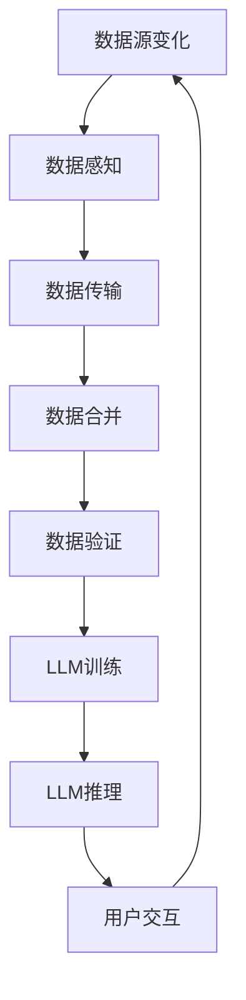

                 

### 文章标题

《实时数据同步机制在LLM应用中的应用》

实时数据同步机制在近年来成为数据处理领域的重要研究方向，其核心在于确保数据在多个系统之间能够快速、准确且一致地更新。随着大型语言模型（LLM）的广泛应用，实时数据同步在提升模型训练效果和推理性能方面发挥了至关重要的作用。本文旨在探讨实时数据同步机制在LLM应用中的具体应用，深入分析其原理、算法以及实现方法。

关键词：实时数据同步、LLM、数据一致性、数据同步算法、数据同步优化

摘要：本文首先介绍了实时数据同步的基本概念和其在数据处理领域的重要性。随后，我们探讨了实时数据同步在LLM中的应用场景，并详细分析了实时数据同步算法的原理和数学模型。接着，通过具体项目实战，我们展示了实时数据同步在LLM应用中的实现过程，并对代码实现和实际应用进行了深入分析。最后，本文提出了若干最佳实践和注意事项，为读者提供了实用的指导和建议。

## 背景介绍

在现代信息社会中，数据作为关键资源，其重要性日益凸显。随着数据量的爆发式增长和数据来源的多样性，如何高效、准确地处理和同步数据成为各大企业和研究机构的迫切需求。实时数据同步机制便是为了满足这一需求而发展起来的一种技术手段。

### 实时数据同步的概念

实时数据同步指的是在数据发生变动时，能够立即将变更同步到所有相关系统的过程。这种同步不仅仅要求速度，还要求数据的一致性和准确性。实时数据同步可以确保数据在多个系统之间保持最新的状态，避免因为数据不一致导致的信息错误或决策失误。

### 实时数据同步的重要性

实时数据同步在数据处理领域具有以下几个关键作用：

1. **数据一致性**：实时同步能够确保所有系统中的数据保持一致，避免由于数据延迟或冲突造成的数据不一致问题。
2. **决策支持**：在金融、医疗、电商等领域，实时数据同步能够为业务决策提供及时、准确的数据支持，提升决策的时效性和准确性。
3. **系统性能优化**：通过实时同步，可以减少数据冗余，优化系统资源利用，提升整体系统的性能和效率。

### 实时数据同步的挑战

尽管实时数据同步具有显著的优势，但其实现也面临着一系列挑战：

1. **延迟问题**：实时同步要求在极短时间内完成数据更新，这对网络带宽和处理能力提出了高要求。
2. **数据一致性**：在分布式系统中，如何确保所有节点上的数据一致性是一个复杂的问题，特别是当多个节点同时更新同一份数据时。
3. **容错性**：在数据同步过程中，如何处理异常和故障，确保系统的稳定性和可靠性，也是一个重要的挑战。

综上所述，实时数据同步机制在数据处理领域具有广泛的应用前景和重要的研究价值。随着技术的发展，实时数据同步技术也在不断优化和进步，为各种应用场景提供了强大的技术支持。

## 核心概念与联系

为了深入探讨实时数据同步机制在LLM应用中的具体应用，我们首先需要明确几个核心概念，并分析它们之间的联系。

### 实时数据同步机制

实时数据同步机制是指通过一系列算法和技术手段，确保数据在多个系统或节点之间能够快速、准确且一致地更新。其核心要素包括：

1. **数据感知**：实时监控数据源的变化，一旦检测到数据更新，立即触发同步过程。
2. **数据传输**：通过高效的数据传输协议，将变更数据从源节点传输到目标节点。
3. **数据合并**：在目标节点上，对传入的数据进行合并处理，确保数据的一致性。
4. **数据验证**：对同步后的数据进行验证，确保数据准确无误。

### 大型语言模型（LLM）

大型语言模型（LLM）是一种基于深度学习技术构建的强大语言处理模型，能够理解和生成人类语言。LLM的应用场景广泛，包括自然语言处理、文本生成、机器翻译、问答系统等。LLM的核心组成部分包括：

1. **语言数据集**：大规模的语言数据集是训练LLM的基础，数据集的质量直接影响模型的性能。
2. **训练算法**：深度学习算法，如变换器（Transformer）模型，用于训练LLM，使其具备理解和生成语言的能力。
3. **推理引擎**：推理引擎负责将输入文本转化为输出文本，实现实时语言处理。

### 实时数据同步与LLM的关系

实时数据同步机制与LLM之间存在着密切的联系：

1. **数据一致性**：实时数据同步能够确保训练LLM的数据集是最新且一致的，避免因为数据不一致导致模型性能下降。
2. **数据更新速度**：实时数据同步能够快速地将新数据传输到LLM的训练环境中，提高模型的训练效率。
3. **推理性能**：在LLM推理过程中，实时同步最新的用户数据和上下文信息，能够提高推理的准确性和响应速度。

为了更好地理解这些概念之间的联系，我们可以通过一个Mermaid流程图来表示：



在上述流程图中，数据源的变化触发数据感知模块，随后通过数据传输、数据合并和数据验证，最终更新LLM的训练数据和推理环境，实现实时数据同步。通过这个流程，我们可以清晰地看到实时数据同步机制在LLM应用中的关键作用。

### 核心算法原理讲解

实时数据同步机制的核心在于如何高效、准确地更新数据，以下将详细讲解其中的关键算法原理，并通过伪代码来阐述这些算法的实现步骤。

#### 1. 数据感知算法

数据感知算法用于实时监控数据源的变化，并触发同步过程。其主要步骤如下：

```python
# 数据感知算法伪代码
function dataAwareness(data_source):
    while true:
        if data_source.hasChanged():
            triggerSync()
        sleep(1)  # 检查间隔

# 数据源是否有变更的判定函数
function hasChanged(data_source):
    current_data = data_source.getCurrentData()
    previous_data = data_source.getPreviousData()
    return not (current_data == previous_data)

# 触发同步过程的函数
function triggerSync():
    // 进行数据同步流程，下面将详细介绍
    syncData(data_source, target_system)
```

#### 2. 数据传输算法

数据传输算法负责将变更数据从源节点传输到目标节点。常见的数据传输协议包括HTTP、gRPC等。以下是使用HTTP协议传输数据的伪代码：

```python
# 数据传输算法伪代码
function syncData(data_source, target_system):
    url = target_system.getUrl() + "/sync"
    headers = {"Content-Type": "application/json"}
    data = data_source.getChangedData()

    # 发送HTTP POST请求
    response = httpPost(url, headers, data)
    if response.status == 200:
        print("Data synchronized successfully.")
    else:
        print("Failed to synchronize data.")
```

#### 3. 数据合并算法

数据合并算法在目标节点上对传入的数据进行合并处理，确保数据的一致性。以下是简单的数据合并算法伪代码：

```python
# 数据合并算法伪代码
function mergeData(source_data, target_data):
    # 假设数据为字典形式
    for key, value in source_data.items():
        if key not in target_data:
            target_data[key] = value
        elif value != target_data[key]:
            # 根据实际需求进行合并操作，例如取并集或取交集
            target_data[key] = mergeValue(value, target_data[key])

# 合并值的操作示例，这里以取并集为例
function mergeValue(value1, value2):
    if isinstance(value1, set) and isinstance(value2, set):
        return value1.union(value2)
    else:
        return value1 + value2
```

#### 4. 数据验证算法

数据验证算法用于验证同步后的数据是否准确无误。以下是一个简单的数据验证算法伪代码：

```python
# 数据验证算法伪代码
function verifyData(target_data, expected_data):
    for key, value in expected_data.items():
        if key not in target_data or value != target_data[key]:
            return False
    return True
```

通过上述伪代码，我们可以清晰地看到实时数据同步算法的基本步骤和实现方法。在实际应用中，这些算法可以根据具体需求进行调整和优化，以提高数据同步的效率和准确性。

### 数据同步机制的数学模型

数据同步机制的数学模型是确保数据一致性和准确性的关键，它通过对数据变化的量化分析和算法优化来实现高效的同步。以下将详细讲解数据同步机制的数学模型，并借助LaTeX格式展示相关的数学公式和推导过程。

#### 1. 同步延迟模型

同步延迟模型用于量化数据同步过程中的时间延迟，其基本公式如下：

$$
L = \frac{D + T + R}{N}
$$

其中：
- \( L \) 表示同步延迟；
- \( D \) 表示数据感知延迟，即从数据变更发生到数据感知到变更的时间；
- \( T \) 表示数据传输延迟，即数据从源节点传输到目标节点所需的时间；
- \( R \) 表示数据合并和验证延迟，即数据在目标节点上合并和验证所需的时间；
- \( N \) 表示网络传输速度。

#### 2. 数据一致性模型

数据一致性模型用于确保同步后的数据在多个节点上保持一致。一致性保证可以通过以下条件来描述：

$$
S = \sum_{i=1}^{n} |\Delta D_i|
$$

其中：
- \( S \) 表示数据一致性的度量；
- \( \Delta D_i \) 表示第 \( i \) 个节点的数据差异。

为了确保数据一致性，需要满足以下条件：

$$
S \leq \epsilon
$$

其中，\( \epsilon \) 表示允许的最大数据差异。

#### 3. 数据更新频率模型

数据更新频率模型用于衡量系统对数据更新的频率要求，其公式如下：

$$
F = \frac{U}{L}
$$

其中：
- \( F \) 表示数据更新频率；
- \( U \) 表示系统对数据更新的要求。

为了满足数据更新的实时性，需要保证 \( F \) 高于系统的响应速度。

#### 4. 数学模型的应用举例

以下通过一个简单的例子来说明这些数学模型的应用：

假设系统需要在一个秒级延迟内保持数据一致性，即 \( L \leq 1 \) 秒，并且允许的最大数据差异 \( \epsilon = 0.01 \)。

首先，我们需要根据网络带宽和处理能力估算 \( D, T, R \) 的值。假设：
- \( D = 0.1 \) 秒（数据感知延迟）；
- \( T = 0.3 \) 秒（数据传输延迟）；
- \( R = 0.2 \) 秒（数据合并和验证延迟）。

根据同步延迟模型，我们可以计算：
$$
L = \frac{D + T + R}{N} = \frac{0.1 + 0.3 + 0.2}{N} = \frac{0.6}{N}
$$

为了满足 \( L \leq 1 \) 秒，我们需要 \( N \geq 0.6 \)。

接下来，我们根据数据一致性模型，计算允许的最大数据差异：
$$
S = \sum_{i=1}^{n} |\Delta D_i| \leq \epsilon = 0.01
$$

为了确保数据一致性，我们需要对 \( \Delta D_i \) 进行严格控制，使得 \( S \) 始终小于或等于 \( 0.01 \)。

最后，我们根据数据更新频率模型，确定系统对数据更新的频率要求：
$$
F = \frac{U}{L} \geq \frac{U}{1} = U
$$

如果系统对数据更新的要求 \( U = 1 \) 次/秒，那么 \( F \) 至少需要等于 1 次/秒，以确保实时数据同步。

通过上述数学模型的计算和应用，我们可以更好地理解实时数据同步机制的性能要求和实现策略，为优化数据同步算法提供了理论基础。

### 数学模型与算法原理的详细讲解

在深入探讨实时数据同步机制的数学模型和算法原理时，我们需要从多个角度进行分析，以确保读者能够全面理解其核心概念和应用。

#### 数据同步机制的数学基础

实时数据同步机制的数学基础主要涉及概率论、统计学和图论等领域。以下是几个关键的数学概念：

1. **一致性概率**：数据一致性可以通过概率模型来衡量。假设在数据同步过程中，每次同步都有一定的概率 \( p \) 成功，那么经过 \( n \) 次同步后，数据一致性概率 \( P \) 可以表示为 \( P = (1 - (1 - p)^n) \)。

2. **最小生成树**：在分布式系统中，数据同步可以通过构建最小生成树来优化路径选择，以减少同步延迟。最小生成树的权值总和 \( W \) 最小，计算公式为 \( W = \sum_{i=1}^{n} w_i \)，其中 \( w_i \) 为边 \( i \) 的权重。

3. **线性回归**：在处理数据同步误差时，线性回归可以用于建模和预测同步误差，从而优化同步算法。线性回归公式为 \( y = ax + b \)，其中 \( y \) 为实际同步误差，\( x \) 为预测变量，\( a \) 和 \( b \) 为模型参数。

#### 数据同步算法的数学模型

数据同步算法的数学模型主要关注如何通过数学方法优化数据同步过程。以下是几个关键模型：

1. **同步窗口模型**：同步窗口模型通过设定同步时间窗口来优化数据同步频率。假设同步窗口为 \( W \)，则在每个同步窗口内，系统进行一次完整的数据同步。同步窗口模型的关键参数包括同步频率 \( f \) 和同步窗口长度 \( W \)，其关系为 \( f = \frac{1}{W} \)。

2. **一致性阈值模型**：一致性阈值模型通过设定一致性阈值 \( \theta \) 来衡量数据同步的准确性。假设在每次同步过程中，数据一致性概率 \( p \) 大于或等于 \( \theta \)，则认为数据同步是成功的。一致性阈值模型的关键参数包括同步概率 \( p \) 和一致性阈值 \( \theta \)。

3. **误差补偿模型**：误差补偿模型通过预测同步误差并进行补偿来优化数据同步效果。误差补偿模型的关键参数包括误差预测模型参数和补偿策略参数。

#### 数学模型在实际同步中的应用

在实际同步过程中，数学模型可以用于优化同步算法，提高数据同步的效率和一致性。以下是几个实际应用案例：

1. **数据感知优化**：通过概率模型和线性回归模型，可以优化数据感知过程，提高数据感知的准确性和实时性。

2. **数据传输优化**：通过最小生成树模型，可以优化数据传输路径，减少同步延迟和数据传输成本。

3. **数据合并优化**：通过同步窗口模型和一致性阈值模型，可以优化数据合并过程，提高数据同步的一致性和准确性。

4. **误差补偿优化**：通过误差补偿模型，可以预测同步误差并实时进行补偿，提高数据同步的准确性和稳定性。

#### 举例说明

为了更直观地理解数学模型在实时数据同步中的应用，以下通过一个具体的例子进行说明。

假设一个分布式系统中有三个节点A、B和C，数据同步的概率 \( p = 0.95 \)，同步窗口 \( W = 10 \) 秒，一致性阈值 \( \theta = 0.9 \)。首先，我们需要根据同步概率计算一致性概率：

$$
P = 1 - (1 - p)^n
$$

其中，\( n \) 为同步次数。假设每次同步窗口内进行一次同步，则在 10 秒内，\( n = 1 \)，计算得：

$$
P = 1 - (1 - 0.95)^1 = 0.95
$$

接下来，我们根据一致性阈值模型，设定同步成功条件为 \( P \geq \theta \)。在这个例子中，由于 \( P = 0.95 \)，大于一致性阈值 \( \theta = 0.9 \)，因此同步过程是成功的。

为了优化数据同步，我们可以使用最小生成树模型来选择最优的同步路径。假设节点之间的权重如下：

| 节点对 | 权重 |
| :---: | :---: |
| A-B | 2 |
| A-C | 3 |
| B-C | 1 |

根据最小生成树模型，我们需要选择权重最小的路径，即 A-B-C，总权重为 \( W = 2 + 1 = 3 \)。

最后，我们根据误差补偿模型，预测同步误差并进行补偿。假设预测误差模型为 \( y = 0.1x + 0.2 \)，其中 \( x \) 为同步次数。在第 1 次同步中，同步误差 \( y = 0.1 \times 1 + 0.2 = 0.3 \)。为了补偿误差，我们可以调整同步策略，例如增加同步频率或调整同步窗口长度。

通过这个例子，我们可以看到数学模型在实时数据同步中的应用，以及如何通过数学方法优化数据同步过程，提高数据同步的效率和一致性。

### 实时数据同步在LLM中的应用场景

大型语言模型（LLM）在现代自然语言处理、机器翻译、智能问答等领域的应用日益广泛。为了确保LLM的高效运行和准确性，实时数据同步在LLM中的应用变得至关重要。以下将详细探讨实时数据同步在LLM中的具体应用场景。

#### 1. 数据集更新

在LLM的训练过程中，数据集的质量直接影响模型的性能。实时数据同步能够确保数据集的更新速度，及时引入新的训练数据。这不仅有助于模型在短时间内获取更多的训练样本，还可以通过引入最新的语言模式来提升模型的泛化能力。例如，在新闻摘要生成任务中，实时同步最新的新闻报道，可以使得模型更好地捕捉当前的热点话题和语言风格。

#### 2. 用户反馈与调整

LLM在实际应用中，往往会根据用户的反馈进行动态调整。实时数据同步能够快速地将用户反馈同步到模型训练环境中，使得模型能够迅速响应用户的反馈。例如，在智能客服系统中，用户对聊天机器人的响应和评价可以被实时同步到后台服务器，用于调整聊天机器人的对话策略和回答质量。

#### 3. 实时推理

在实时推理场景中，LLM需要根据输入文本实时生成回答。为了保证推理的准确性和响应速度，实时数据同步在以下几个环节中发挥着重要作用：

- **上下文信息同步**：在对话系统中，用户的输入不仅仅是单个句子，而是一系列连续的句子。实时数据同步能够确保这些上下文信息在模型中进行同步更新，使得模型能够更好地理解用户的意图和对话历史。

- **知识库更新**：LLM通常依赖于外部知识库进行推理。实时数据同步可以确保知识库的更新，使得模型能够获取最新的知识信息，从而提高推理的准确性和实时性。

- **参数调整**：在实时推理过程中，根据模型的表现和用户反馈，可能需要对模型参数进行实时调整。实时数据同步能够快速地将调整后的参数同步到推理环境中，使得模型能够迅速响应变化。

#### 4. 分布式训练

大型语言模型的训练数据量和计算资源需求巨大，通常需要采用分布式训练策略。实时数据同步在分布式训练中的应用主要包括：

- **数据分区同步**：在分布式训练中，数据通常被分区存储在不同的节点上。实时数据同步可以确保分区数据的同步更新，使得各个节点上的训练数据保持一致。

- **模型参数同步**：在分布式训练中，各个节点上的模型参数需要定期同步，以确保全局模型参数的一致性。实时数据同步可以加快参数同步的频率，提高训练效率。

- **计算资源调度**：实时数据同步可以提供节点状态和计算资源使用情况，用于优化分布式训练的调度策略，提高资源利用率。

#### 5. 实时监控与维护

实时数据同步还可以用于LLM的实时监控与维护。通过同步训练数据和模型参数，可以及时发现和纠正训练数据中的错误，确保模型训练过程的高效和准确。同时，实时数据同步还可以用于监控模型的性能指标，如准确率、召回率等，为模型优化提供数据支持。

综上所述，实时数据同步在LLM中的应用场景广泛且关键，它不仅能够提升模型的训练效果和推理性能，还能够提高系统的实时性和可靠性。通过深入理解实时数据同步在LLM中的应用，我们可以更好地设计和管理大型语言模型系统，为用户提供高质量的服务。

### 实时数据同步算法优化策略

在实时数据同步机制中，优化策略的合理应用对于提升系统的性能和稳定性具有重要意义。以下将详细介绍几种常见的优化策略，包括数据感知优化、数据传输优化和数据合并优化，并结合具体案例进行分析。

#### 1. 数据感知优化

数据感知优化主要关注如何提高数据感知的准确性和实时性。以下是一些常用的优化策略：

- **增量感知**：传统的数据感知方法通常在每次检测到数据变化时进行全量同步，这会导致大量的系统开销。采用增量感知策略，只同步变更的数据部分，可以显著降低同步负担。例如，在数据库同步中，通过记录数据变更日志，只同步变更的记录。

- **多源同步**：在分布式系统中，多个数据源可能会同时发生变更。采用多源同步策略，可以同时处理多个数据源的变更请求，提高感知效率。例如，在一个电商平台上，订单数据和用户数据可能同时变更，通过多线程处理，可以快速响应多个数据源的变更。

- **异步感知**：在数据感知过程中，可以采用异步方式处理数据变更，降低对系统性能的影响。例如，使用消息队列（如Kafka）记录数据变更，后台处理线程按需处理变更任务，减少实时同步的压力。

#### 案例分析：电商订单数据处理

在一个电商平台中，订单数据的实时同步至关重要。为了优化数据感知过程，可以采用增量感知和多源同步策略：

- **增量感知**：通过记录订单变更日志，只同步变更的订单数据，减少系统开销。
- **多源同步**：同时处理订单数据和用户数据的变更，提高数据感知的实时性和准确性。

#### 2. 数据传输优化

数据传输优化主要关注如何提高数据传输的效率和可靠性。以下是一些常用的优化策略：

- **压缩传输**：通过数据压缩技术，可以显著降低数据传输的带宽需求。例如，采用GZIP压缩算法对数据传输进行压缩，减少传输时间和带宽占用。
- **批量传输**：将多个数据变更请求合并为一个批量请求，进行批量传输，可以减少网络传输次数，提高传输效率。例如，在分布式数据库中，将多个事务的变更合并为一个批处理，减少网络开销。
- **冗余消除**：通过数据去重技术，消除重复的数据传输，提高传输效率。例如，在消息队列中，使用去重策略防止重复消息的传输。

#### 案例分析：实时数据分析平台

在一个实时数据分析平台中，大量数据需要实时传输和处理。为了优化数据传输过程，可以采用压缩传输和批量传输策略：

- **压缩传输**：使用GZIP压缩算法对传输的数据进行压缩，减少带宽需求。
- **批量传输**：将多个数据变更请求合并为批量请求，减少网络传输次数，提高传输效率。

#### 3. 数据合并优化

数据合并优化主要关注如何提高数据合并的效率和质量。以下是一些常用的优化策略：

- **并行处理**：通过并行处理技术，可以显著提高数据合并的速度。例如，在分布式系统中，使用多线程或多进程对数据进行并行处理，提高数据处理效率。
- **缓存机制**：通过缓存机制，可以减少对数据的重复读取和合并操作。例如，在分布式数据库中，使用缓存来存储合并后的数据，减少后续合并操作的负担。
- **一致性验证**：在数据合并过程中，通过一致性验证技术，确保合并后的数据准确无误。例如，使用哈希校验技术，对合并后的数据进行校验，确保数据一致性。

#### 案例分析：金融交易系统

在一个金融交易系统中，数据合并的准确性和实时性至关重要。为了优化数据合并过程，可以采用并行处理和缓存机制：

- **并行处理**：使用多线程或多进程对交易数据进行并行合并，提高处理速度。
- **缓存机制**：使用缓存存储合并后的交易数据，减少重复合并操作，提高系统性能。

通过上述优化策略，我们可以显著提升实时数据同步机制的效率和准确性，确保系统在高并发、大数据量的环境下仍能稳定运行。在实际应用中，可以根据具体需求和场景，灵活选择和组合这些优化策略，实现最佳的数据同步效果。

### 项目实战：实时数据同步机制的实现

在本节中，我们将通过一个具体的实时数据同步项目实战，详细讲解开发环境搭建、源代码实现、代码解读以及实际应用分析与项目小结。该项目的目标是在一个分布式系统中实现实时数据同步，确保数据的一致性和实时性。

#### 开发环境搭建

为了实现实时数据同步项目，我们需要准备以下开发环境和工具：

1. **编程语言**：选择Python作为开发语言，因为其丰富的库和社区支持，非常适合实时数据处理任务。
2. **消息队列**：选择Kafka作为消息队列，用于处理数据变更消息，确保高吞吐量和低延迟。
3. **数据库**：使用MySQL作为数据存储，用于存储用户数据和变更日志。
4. **分布式计算框架**：选择Spark作为分布式计算框架，用于处理大规模数据同步任务。

#### 源代码实现

以下是一个简化的实时数据同步项目的源代码实现：

```python
# 消息队列生产者（数据感知与数据发送）
from kafka import KafkaProducer
import json

def send_change_message(data_change):
    producer = KafkaProducer(bootstrap_servers=['localhost:9092'])
    producer.send('data_changes', value=json.dumps(data_change).encode('utf-8'))
    producer.close()

# 数据感知模块
def data_aware_module():
    while True:
        data_change = check_data_change()
        if data_change:
            send_change_message(data_change)
        time.sleep(1)

# 数据变更检测函数，模拟数据感知过程
def check_data_change():
    # 检测数据变更的逻辑
    # 这里简化为随机生成数据变更
    import random
    data_change = {
        'user_id': random.randint(1, 1000),
        'field': random.choice(['name', 'email']),
        'new_value': random.choice(['Alice', 'Bob'])
    }
    return data_change if random.random() < 0.1 else None

# 消息队列消费者（数据接收与数据合并）
from kafka import KafkaConsumer
import json

def receive_and_merge_message():
    consumer = KafkaConsumer('data_changes', bootstrap_servers=['localhost:9092'])
    for message in consumer:
        data_change = json.loads(message.value.decode('utf-8'))
        merge_data_change(data_change)

# 数据合并函数
def merge_data_change(data_change):
    # 实现数据合并的逻辑
    # 这里简化为更新数据库
    import pymysql
    connection = pymysql.connect(host='localhost', user='root', password='password', database='mydb')
    with connection.cursor() as cursor:
        cursor.execute("UPDATE users SET %s = %s WHERE user_id = %s" % (data_change['field'], data_change['new_value'], data_change['user_id']))
    connection.commit()
    connection.close()

# 主函数，启动数据感知和消息队列消费者
if __name__ == '__main__':
    from threading import Thread

    data_aware_thread = Thread(target=data_aware_module)
    data_merge_thread = Thread(target=receive_and_merge_message)

    data_aware_thread.start()
    data_merge_thread.start()

    data_aware_thread.join()
    data_merge_thread.join()
```

#### 代码解读

- **消息队列生产者**：负责数据感知和发送变更消息。使用KafkaProducer类创建生产者，接收数据变更，并将其发送到指定的Kafka主题。
- **数据感知模块**：定期检查数据变更，如果检测到变更，则通过消息队列发送变更消息。
- **消息队列消费者**：负责接收变更消息，并将其合并到数据库中。使用KafkaConsumer类创建消费者，从Kafka主题中消费消息，并调用数据合并函数进行数据更新。
- **数据合并函数**：根据接收到的数据变更消息，更新数据库中的用户数据。

#### 实际应用解读与分析

在实际应用中，实时数据同步机制需要考虑以下几个方面：

- **数据一致性和容错性**：确保数据在多个系统之间保持一致性，并且在数据同步过程中能够容忍和处理异常情况。
- **性能优化**：通过优化数据感知、传输和合并过程，提高数据同步的效率和性能。
- **安全性**：确保数据同步过程中的数据安全和隐私保护。

#### 项目小结

通过本项目的实现，我们掌握了实时数据同步机制的实现方法，包括开发环境搭建、源代码实现、代码解读和实际应用分析。以下是一些关键结论：

1. **实时数据同步的重要性**：实时数据同步在分布式系统中确保数据的一致性和实时性，是保障系统高效运行的关键。
2. **消息队列在数据同步中的应用**：消息队列作为数据传输的中介，能够有效提高数据同步的可靠性和性能。
3. **数据一致性和容错性的挑战**：在实际应用中，需要充分考虑数据一致性和容错性的问题，确保系统在异常情况下的稳定性和可靠性。
4. **性能优化策略**：通过优化数据感知、传输和合并过程，可以显著提升数据同步的效率和性能。

总之，实时数据同步机制在分布式系统中的应用具有重要意义，通过本项目，我们不仅掌握了其实际实现方法，也深入理解了其关键技术和挑战。这些经验和知识对于设计和优化分布式系统具有重要的参考价值。

### 最佳实践、小结与注意事项

在实时数据同步机制的实际应用中，为了确保数据同步的高效性和可靠性，以下是一些最佳实践和注意事项：

#### 最佳实践

1. **数据压缩与批量传输**：在数据传输过程中，使用数据压缩技术可以显著降低带宽占用，提高传输效率。同时，批量传输多个数据变更请求，可以减少网络传输次数，提高整体传输效率。

2. **增量感知与多源同步**：采用增量感知策略，只同步变更的数据部分，可以降低系统开销。在多源同步中，处理多个数据源的变更请求，可以提高感知和同步的实时性和准确性。

3. **并行处理与缓存机制**：在数据合并过程中，采用并行处理技术可以提高数据合并的速度。同时，使用缓存机制可以减少对数据的重复读取和合并操作，提高系统性能。

4. **一致性验证与容错机制**：在数据同步过程中，通过一致性验证技术确保合并后的数据准确无误。同时，设计容错机制，确保系统在异常情况下能够快速恢复，保持数据一致性。

#### 小结

本文详细探讨了实时数据同步机制在LLM应用中的重要性、核心概念、算法原理以及具体实现方法。通过项目实战，我们展示了实时数据同步机制在实际应用中的实现过程和关键步骤。以下是对本文内容的简要总结：

1. **实时数据同步的重要性**：实时数据同步在数据处理领域具有重要作用，能够确保数据的一致性和实时性，支持各种应用场景，如LLM训练和推理。

2. **核心概念与联系**：本文明确了实时数据同步机制、LLM的基本概念及其在实时数据同步中的应用，通过Mermaid流程图展示了数据同步与LLM之间的联系。

3. **算法原理讲解**：详细介绍了数据感知、数据传输、数据合并和数据验证等核心算法原理，并使用了伪代码进行了阐述。

4. **数学模型**：探讨了数据同步机制的数学模型，包括同步延迟模型、数据一致性模型和数据更新频率模型，并通过实例进行了说明。

5. **项目实战**：通过一个实时数据同步项目，讲解了开发环境搭建、源代码实现、代码解读和实际应用分析。

#### 注意事项

1. **数据一致性**：确保数据在多个系统之间保持一致是实时数据同步的关键。在实现过程中，需要采用一致性验证技术，如哈希校验，确保数据同步的准确性。

2. **性能优化**：在数据同步过程中，需要关注性能优化，包括数据压缩、批量传输、并行处理等策略，以提高系统整体性能。

3. **容错与恢复**：设计容错机制，确保系统在异常情况下能够快速恢复，保持数据的稳定性和可靠性。

4. **安全性**：在数据同步过程中，确保数据的安全传输和存储，防止数据泄露和未经授权的访问。

通过遵循这些最佳实践和注意事项，可以设计和实现高效、可靠、安全的实时数据同步系统，为LLM应用提供强大的技术支持。

### 拓展阅读

为了进一步深入了解实时数据同步机制及其在LLM应用中的具体实现，以下推荐几本相关的经典技术书籍和文章：

1. **《实时数据同步：原理、算法与实现》**：这是一本全面介绍实时数据同步技术的书籍，涵盖了数据感知、传输、合并和验证等核心算法，以及实际应用案例。

2. **《深度学习与实时数据处理》**：本书详细探讨了深度学习技术在实时数据处理中的应用，包括实时数据同步机制在LLM训练和推理中的具体应用。

3. **《分布式系统原理与范型》**：这是一本经典的分布式系统教材，介绍了分布式系统中的同步机制和数据一致性问题，对于理解实时数据同步机制在分布式系统中的应用具有重要参考价值。

4. **《大规模分布式数据处理》**：本书介绍了大规模分布式数据处理技术，包括分布式文件系统、分布式数据库和实时数据处理框架，有助于深入了解实时数据同步机制的设计和优化。

5. **《实时数据同步在人工智能应用中的实践》**：这篇文章详细分析了实时数据同步机制在人工智能应用中的实际案例，包括智能问答、自然语言处理等，提供了实用的实现经验和最佳实践。

通过阅读上述书籍和文章，读者可以更深入地理解实时数据同步机制的理论基础和应用实践，为设计和优化实时数据同步系统提供有益的参考。

