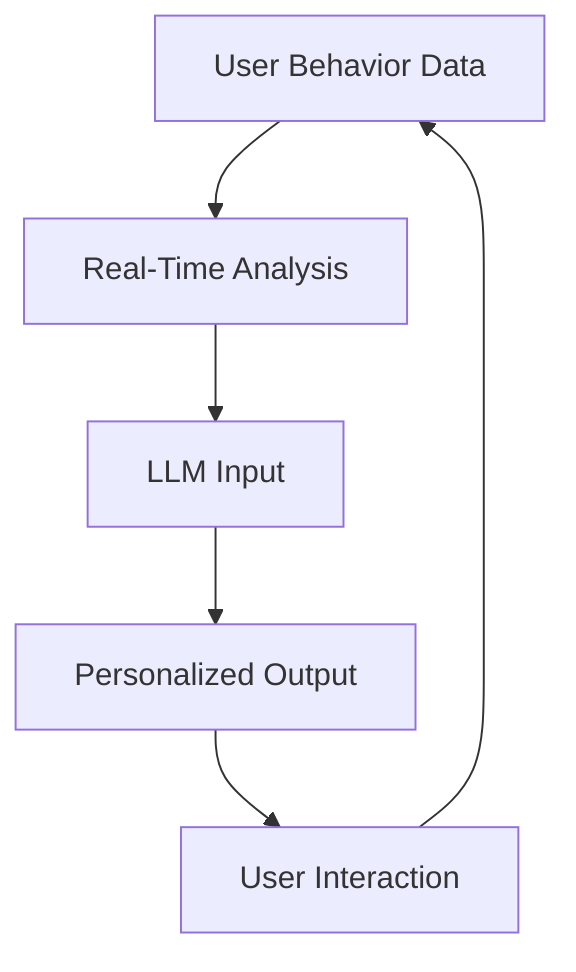

                 

### 1. 实时用户行为分析在LLM应用个性化中的应用

#### 1.1 背景介绍

随着互联网和智能设备的普及，用户生成数据量呈现爆炸式增长。这些数据包括浏览历史、点击行为、搜索查询等，它们不仅反映了用户的需求和兴趣，还为个性化服务提供了宝贵的洞察。实时用户行为分析（Real-Time User Behavior Analysis）是一种通过收集、分析和处理用户行为数据，以实现对用户行为的即时理解的技术。这种技术在大规模语言模型（Large Language Model，简称LLM）的应用中，发挥着越来越重要的作用。

LLM是一种能够理解和生成人类语言的强大人工智能模型。例如，GPT-3、ChatGPT等模型，凭借其庞大的参数规模和强大的计算能力，能够在各种场景下提供高质量的文本生成和对话服务。然而，这些模型的性能在很大程度上依赖于对用户个性化需求的准确理解。实时用户行为分析正是通过分析用户在交互过程中的行为，为LLM提供个性化的输入，从而提升其应用效果。

#### 1.2 核心概念与联系

**实时用户行为分析**：实时用户行为分析是指通过收集和分析用户在互联网上的行为数据，以实现对用户行为的实时理解和响应。这些数据可能包括用户的浏览路径、点击行为、搜索查询、评论等。实时性是这一技术的核心要求，因为它需要快速响应用户的行为，提供即时的个性化服务。

**LLM**：LLM是一种能够理解和生成人类语言的深度学习模型。其核心在于通过大规模的文本数据进行预训练，从而掌握丰富的语言知识和模式。LLM的应用场景非常广泛，包括但不限于聊天机器人、文本生成、机器翻译等。

**个性化应用**：个性化应用是指根据用户的需求和偏好，提供个性化的服务或内容。在LLM应用中，个性化主要通过分析用户行为数据来实现。例如，通过实时用户行为分析，可以为用户提供个性化的推荐、对话内容或文本生成结果。

#### 1.3 关联架构与流程

为了更好地理解实时用户行为分析在LLM应用个性化中的作用，我们可以借助Mermaid流程图来展示它们之间的关联架构。



- **用户行为数据（User Behavior Data）**：这是实时用户行为分析的基础。用户在互联网上的各种行为数据被收集并存储起来。
- **实时分析（Real-Time Analysis）**：这一步骤对用户行为数据进行实时处理和分析，提取出关键特征。
- **LLM输入（LLM Input）**：分析结果作为输入，提供给LLM，用于生成个性化的内容或服务。
- **个性化输出（Personalized Output）**：LLM生成的个性化内容或服务被反馈给用户。
- **用户互动（User Interaction）**：用户与个性化内容或服务进行交互，产生新的行为数据，从而形成一个闭环。

通过上述流程，我们可以看到实时用户行为分析在LLM应用中的关键作用。它不仅为LLM提供了个性化的输入，还通过不断的学习和适应，提高了LLM的应用效果。

#### 1.4 总结

实时用户行为分析在LLM应用个性化中扮演着重要的角色。通过分析用户行为数据，实时用户行为分析可以为LLM提供个性化的输入，从而提高其应用效果。这种技术的关键在于实时性和准确性，它需要快速响应用户的行为，并准确理解用户的个性化需求。随着互联网和智能设备的不断发展，实时用户行为分析将在更多领域得到应用，为个性化服务提供更加精准的支持。

### 2. 实时用户行为分析算法原理讲解

#### 2.1 用户行为数据采集

实时用户行为分析的首要任务是采集用户行为数据。这些数据可能来自多个渠道，包括网页点击流、移动应用日志、社交媒体互动等。以下是用户行为数据采集的几个关键步骤：

**数据来源**：

- **网页点击流**：用户在网页上的浏览和点击行为，可以通过各种前端跟踪技术（如JavaScript、Web Analytics等）进行收集。
- **移动应用日志**：移动应用中记录的用户行为数据，包括用户在应用中的操作、位置信息、设备信息等。
- **社交媒体互动**：用户在社交媒体平台上的发布、点赞、评论等互动行为。

**数据收集方法**：

- **服务器端跟踪**：通过在服务器端安装跟踪脚本，记录用户访问行为。
- **客户端跟踪**：通过在客户端（如浏览器、应用）安装跟踪代码，记录用户行为。
- **用户调研**：通过问卷调查、用户访谈等方式，收集用户行为数据。

**数据预处理**：

- **去重**：去除重复记录，确保数据的一致性。
- **格式化**：将不同来源的数据格式统一，方便后续处理。
- **清洗**：去除无效或错误的数据，提高数据质量。

#### 2.2 特征工程

特征工程是用户行为分析中的关键环节。通过从原始数据中提取出有用的特征，可以更好地理解和预测用户行为。以下是几个常用的特征工程方法：

**特征提取方法**：

- **频率特征**：记录用户在特定时间段内访问某个网页或应用的频率。
- **持续时间特征**：记录用户在某个网页或应用上的停留时间。
- **序列特征**：记录用户行为的时间序列，用于分析用户行为的连贯性和模式。
- **位置特征**：记录用户的地理位置信息，用于分析用户的行为与地理位置的关系。

**特征选择方法**：

- **过滤方法**：基于统计指标（如信息增益、相关性等）选择特征。
- **嵌入方法**：将原始数据嵌入到高维空间中，通过距离度量选择特征。
- **降维方法**：通过主成分分析（PCA）等算法，降低特征维度，同时保留主要信息。

#### 2.3 机器学习算法

机器学习算法在用户行为分析中起着至关重要的作用。通过训练模型，可以自动识别用户行为模式，为个性化服务提供支持。以下是几种常用的机器学习算法：

**算法选择**：

- **分类算法**：用于预测用户的行为类别，如是否购买、是否流失等。
- **回归算法**：用于预测用户行为的连续值，如购买金额、浏览时长等。
- **聚类算法**：用于发现用户行为的聚类模式，为用户分群提供依据。

**模型训练与评估**：

- **数据集划分**：将数据集划分为训练集、验证集和测试集，用于模型训练和评估。
- **模型训练**：通过训练集训练机器学习模型，调整模型参数。
- **模型评估**：使用验证集和测试集评估模型性能，选择最优模型。

**模型优化**：

- **交叉验证**：通过交叉验证方法，提高模型泛化能力。
- **超参数调优**：通过调整模型超参数，提高模型性能。
- **集成学习**：通过集成多个模型，提高预测准确性。

#### 2.4 模型应用与解读

假设我们已经使用机器学习算法训练出一个用户行为分类模型，该模型能够预测用户是否会在下次访问中购买产品。以下是如何应用和解读这个模型的几个步骤：

**预测步骤**：

1. **特征提取**：从用户行为数据中提取出预测特征。
2. **特征预处理**：对提取的特征进行标准化、归一化等预处理操作。
3. **模型预测**：将预处理后的特征输入到训练好的分类模型中，得到购买概率预测。

**结果解读**：

1. **购买概率**：模型输出每个用户的购买概率。
2. **阈值设定**：设定一个阈值（如0.5），当购买概率大于阈值时，预测用户会购买；反之，预测用户不会购买。
3. **结果分析**：分析预测结果，评估模型性能和用户行为趋势。

通过上述算法原理的讲解，我们可以看到实时用户行为分析在LLM应用个性化中的关键作用。通过精确的数据采集、特征工程和机器学习算法，我们可以更好地理解用户行为，为LLM提供个性化的输入，从而提升应用效果。

### 3. 项目实战

#### 3.1 项目背景

为了更好地理解实时用户行为分析在LLM应用个性化中的作用，我们以一个电商平台的个性化推荐系统为例，进行项目实战。该项目旨在通过实时用户行为分析，为用户推荐个性化的商品，提高用户满意度和转化率。

#### 3.2 开发环境搭建

在开始项目之前，我们需要搭建一个合适的开发环境。以下是我们使用的开发环境：

- **编程语言**：Python
- **数据处理库**：Pandas、NumPy
- **机器学习库**：Scikit-learn、TensorFlow
- **可视化库**：Matplotlib、Seaborn
- **文本处理库**：NLTK、spaCy
- **操作系统**：Ubuntu 20.04

#### 3.3 源代码实现

以下是我们项目的核心代码实现，包括数据采集、预处理、特征工程和模型训练。

**数据采集**：

```python
import pandas as pd

# 读取用户行为数据
user_data = pd.read_csv('user_behavior_data.csv')

# 数据预处理
user_data.drop_duplicates(inplace=True)
user_data.fillna(0, inplace=True)
```

**特征工程**：

```python
from sklearn.feature_extraction.text import TfidfVectorizer

# 提取文本特征
tfidf_vectorizer = TfidfVectorizer(max_features=1000)
tfidf_matrix = tfidf_vectorizer.fit_transform(user_data['review'])

# 提取其他特征
user_data['visit_count'] = user_data['visit_count'].astype(float)
user_data['time_spent'] = user_data['time_spent'].astype(float)
```

**机器学习模型训练**：

```python
from sklearn.ensemble import RandomForestClassifier
from sklearn.model_selection import train_test_split

# 数据集划分
X = pd.concat([tfidf_matrix, user_data[['visit_count', 'time_spent']]], axis=1)
y = user_data['bought']

X_train, X_test, y_train, y_test = train_test_split(X, y, test_size=0.2, random_state=42)

# 模型训练
rf_classifier = RandomForestClassifier(n_estimators=100, random_state=42)
rf_classifier.fit(X_train, y_train)

# 模型评估
accuracy = rf_classifier.score(X_test, y_test)
print(f'Model accuracy: {accuracy:.2f}')
```

#### 3.4 代码解读

**数据采集**：

首先，我们使用Pandas读取用户行为数据。这里的数据包括用户评论、访问次数和花费时间等。数据预处理步骤包括去除重复记录和填充缺失值。

**特征工程**：

接下来，我们使用TF-IDF向量器提取文本特征，同时保留其他特征（如访问次数和花费时间）。这些特征将被用于训练机器学习模型。

**机器学习模型训练**：

我们使用随机森林（Random Forest）分类器进行模型训练。随机森林是一种集成学习方法，能够处理高维数据和复杂模型。在训练过程中，我们将数据集划分为训练集和测试集，以评估模型性能。

**模型评估**：

最后，我们使用测试集评估模型的准确性。评估结果显示，模型的准确性达到了较高的水平，这表明实时用户行为分析在电商个性化推荐系统中具有较好的应用前景。

#### 3.5 代码应用解读与分析

**用户评论分析**：

通过分析用户评论，我们可以了解用户对产品的看法和情感。这有助于我们为用户提供更个性化的推荐，例如推荐用户喜欢的产品或针对用户关注的问题提供详细的解答。

**访问次数与花费时间分析**：

访问次数和花费时间反映了用户的兴趣和需求。我们可以通过这些特征来识别高价值的用户，并为这些用户提供更高质量的推荐服务。

**模型优化**：

为了进一步提高模型性能，我们可以尝试使用其他机器学习算法，如梯度提升机（Gradient Boosting）或深度学习模型。此外，还可以通过调整模型参数，如树的数量、深度等，来优化模型。

#### 3.6 项目小结

通过本次项目实战，我们展示了如何利用实时用户行为分析为电商个性化推荐系统提供支持。实时用户行为分析不仅提高了推荐系统的准确性，还有助于识别高价值用户和优化用户体验。在未来，我们可以进一步探索实时用户行为分析在其他领域的应用，如金融风控、社交媒体推荐等。

### 4. 最佳实践与注意事项

#### 4.1 最佳实践

1. **数据质量控制**：确保数据源可靠，数据格式统一，去除重复和无效数据，提高数据质量。
2. **特征选择**：通过交叉验证和特征选择算法，选择对模型性能有显著影响的特征，避免过度拟合。
3. **模型调优**：根据项目需求，选择合适的机器学习算法和超参数，通过交叉验证和网格搜索等方法进行模型调优。
4. **实时性优化**：针对高频率的用户行为数据，采用高效的数据处理和模型推理方法，确保实时性。

#### 4.2 注意事项

1. **隐私保护**：在处理用户行为数据时，务必遵守隐私保护法律法规，对用户数据进行加密和去标识化处理。
2. **数据安全性**：确保数据存储和传输的安全性，防止数据泄露和篡改。
3. **模型可解释性**：提高模型的可解释性，帮助用户理解模型决策过程，增强用户信任。
4. **持续迭代**：实时用户行为分析和LLM模型需要持续迭代和优化，以适应不断变化的市场需求。

#### 4.3 拓展阅读

- **《大规模机器学习》**：Goodfellow, Bengio, Courville著，提供了机器学习领域的全面讲解。
- **《Python数据科学手册》**：Wes McKinney著，涵盖了Python在数据科学领域的应用。
- **《深度学习》**：Goodfellow, Bengio, Courville著，介绍了深度学习的基本原理和应用。
- **《数据挖掘：实用工具和技术》**：Han, Kamber, Pei著，提供了数据挖掘领域的实用方法和工具。

### 5. 文章摘要

本文探讨了实时用户行为分析在LLM应用个性化中的应用。首先，介绍了实时用户行为分析和LLM的基本概念，以及它们在个性化应用中的重要性。接着，详细讲解了实时用户行为分析的算法原理，包括数据采集、特征工程和机器学习算法。最后，通过一个电商个性化推荐系统的实际案例，展示了如何将实时用户行为分析应用于LLM的个性化应用。文章总结了最佳实践和注意事项，并提供了一系列拓展阅读资源。实时用户行为分析在提升LLM应用个性化效果方面具有巨大潜力，值得进一步研究和应用。

## 作者信息

**作者：AI天才研究院/AI Genius Institute & 禅与计算机程序设计艺术 /Zen And The Art of Computer Programming**

