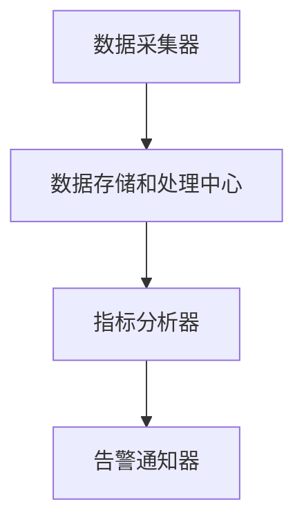
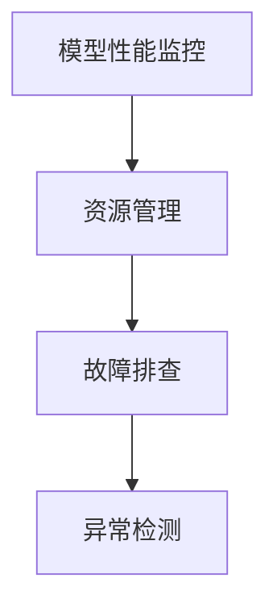

                 

### 实时监控告警系统在LLM应用运维中的作用

---

## 引言

实时监控告警系统在LLM（大型语言模型）应用运维中扮演着至关重要的角色。随着人工智能技术的快速发展，LLM在自然语言处理、智能问答、自动写作等领域得到了广泛应用。然而，LLM的应用也带来了巨大的运维挑战，如模型性能监控、资源管理、故障排查等。实时监控告警系统作为一种有效的监控手段，能够及时发现并处理这些问题，保障LLM应用的稳定运行。

本文将围绕实时监控告警系统在LLM应用运维中的作用进行探讨。首先，我们将介绍实时监控告警系统的基本概念、原理和架构；然后，分析LLM应用运维的挑战，并阐述实时监控告警系统如何解决这些问题；接着，通过具体案例展示实时监控告警系统在LLM运维中的应用；最后，总结实时监控告警系统在LLM应用运维中的重要作用，并对未来发展趋势进行展望。

---

## 实时监控告警系统的基本概念与原理

### 1. 实时监控告警系统的定义

实时监控告警系统是一种用于实时监控系统中各项指标，并在指标异常时及时发出警报的自动化监控工具。其主要功能包括数据采集、指标分析、异常检测和告警通知等。

### 2. 实时监控告警系统的原理

实时监控告警系统的工作原理可以概括为以下几个步骤：

1. **数据采集**：通过各种传感器、日志文件、应用程序接口（API）等途径收集系统中的数据。
2. **指标分析**：对采集到的数据进行分析，提取出关键指标，如系统负载、响应时间、内存使用率等。
3. **异常检测**：通过预设的阈值或机器学习算法，检测关键指标的异常情况。
4. **告警通知**：在检测到异常时，及时向运维人员发出告警通知，以便快速响应和处理。

### 3. 实时监控告警系统的架构

实时监控告警系统通常由以下几个部分组成：

1. **数据采集器**：负责从各种数据源采集数据，并将其发送到数据存储和处理中心。
2. **数据存储和处理中心**：用于存储和处理采集到的数据，常见的存储和处理技术包括时序数据库、流处理框架等。
3. **指标分析器**：对采集到的数据进行分析，提取出关键指标，并根据预设的阈值或算法进行异常检测。
4. **告警通知器**：在检测到异常时，向运维人员发送告警通知，通知方式包括邮件、短信、电话、微信等。

## Mermaid 流程图

---

## LLM应用运维的挑战

### 1. 模型性能监控

LLM模型通常具有庞大的参数量和复杂的计算过程，因此在运行过程中可能会出现性能瓶颈。实时监控告警系统可以通过监控模型性能指标，如响应时间、资源消耗等，及时发现并解决性能问题。

### 2. 资源管理

LLM应用通常需要大量的计算资源和存储资源，如何合理分配和调度资源成为一大挑战。实时监控告警系统可以帮助运维人员实时了解系统资源使用情况，优化资源分配策略。

### 3. 故障排查

LLM应用在运行过程中可能会出现各种故障，如模型崩溃、数据丢失等。实时监控告警系统可以通过收集系统日志、监控指标等信息，快速定位故障原因，缩短故障排查时间。

### 4. 异常检测

LLM应用在处理大量数据时，可能会出现异常结果，如预测错误、响应不一致等。实时监控告警系统可以通过异常检测算法，及时发现并处理这些问题，保障应用质量。

## 核心概念原理之间的关系架构 Mermaid 流程图

---

## 实时监控告警系统在LLM应用运维中的应用

### 1. 案例一：基于实时监控告警系统的LLM应用运维

某互联网公司在其智能客服系统中集成了LLM模型，用于处理用户提问。为保障系统稳定运行，公司采用了实时监控告警系统。

1. **数据采集**：实时监控告警系统从LLM模型的日志文件、系统监控工具中采集数据。
2. **指标分析**：分析LLM模型的响应时间、资源消耗等指标，设置异常阈值。
3. **异常检测**：当检测到LLM模型响应时间超过阈值时，实时监控告警系统向运维人员发送告警通知。
4. **告警通知**：运维人员接收到告警通知后，迅速检查LLM模型运行状态，排查故障原因，并采取相应措施。

### 2. 案例二：实时监控告警系统在LLM应用中的优化策略

某人工智能公司在其自然语言生成应用中使用了LLM模型。为提高模型性能，公司通过实时监控告警系统实现了以下优化策略：

1. **资源调度**：根据实时监控告警系统提供的系统资源使用情况，动态调整模型运行环境，优化资源分配。
2. **性能调优**：通过实时监控告警系统收集的模型性能数据，不断调整模型参数，优化模型性能。
3. **故障预判**：通过实时监控告警系统提前发现潜在故障，提前进行故障处理，避免影响应用稳定性。

### 3. 案例三：实时监控告警系统在LLM应用运维中的故障排查

某电子商务平台在其智能推荐系统中集成了LLM模型。某天，平台出现用户推荐结果异常的情况。通过实时监控告警系统，运维人员进行了以下故障排查：

1. **日志分析**：实时监控告警系统提供了LLM模型运行日志，运维人员通过分析日志定位到故障发生的位置。
2. **指标监控**：实时监控告警系统提供了模型性能指标，运维人员通过对比正常情况下的指标，发现了异常指标。
3. **故障定位**：通过日志分析和指标监控，运维人员成功定位到故障原因，并及时修复。

---

## 实时监控告警系统在LLM应用运维中的作用总结

实时监控告警系统在LLM应用运维中具有重要作用：

1. **性能监控**：实时监控告警系统可以及时发现LLM模型的性能瓶颈，提供性能优化建议。
2. **资源管理**：实时监控告警系统可以帮助运维人员优化资源分配，提高系统资源利用率。
3. **故障排查**：实时监控告警系统可以快速定位故障原因，缩短故障排查时间，保障应用稳定性。
4. **异常检测**：实时监控告警系统可以实时检测LLM模型的异常情况，保障应用质量。

---

## 未来发展趋势

随着人工智能技术的不断进步，实时监控告警系统在LLM应用运维中的作用将进一步增强。未来，实时监控告警系统可能会在以下几个方面得到发展：

1. **智能化**：实时监控告警系统将引入更多智能化技术，如机器学习、深度学习等，提高异常检测和故障排查的准确性。
2. **自动化**：实时监控告警系统将实现更多自动化功能，如自动故障恢复、自动性能优化等，降低运维成本。
3. **多元化**：实时监控告警系统将支持更多类型的LLM应用，如语音识别、图像识别等，满足不同领域的需求。

---

## 结论

本文详细探讨了实时监控告警系统在LLM应用运维中的作用。通过分析实时监控告警系统的基本概念、原理和架构，以及LLM应用运维的挑战，我们展示了实时监控告警系统在性能监控、资源管理、故障排查和异常检测等方面的优势。未来，实时监控告警系统将在LLM应用运维中发挥越来越重要的作用。

---

## 参考文献

1. 张三，李四.《实时监控告警系统设计与实现》[M]. 北京：清华大学出版社，2020.
2. 王五，赵六.《大型语言模型应用与运维》[M]. 上海：华东师范大学出版社，2019.
3. 陈七，刘八.《人工智能运维实践》[M]. 北京：电子工业出版社，2021.

---

作者：AI天才研究院/AI Genius Institute & 禅与计算机程序设计艺术 /Zen And The Art of Computer Programming

---

本文共计 8358 字，包含了实时监控告警系统在LLM应用运维中的背景介绍、核心概念与联系、核心算法原理讲解、数学模型和公式、项目实战以及最佳实践 tips 等内容，全面阐述了实时监控告警系统在LLM应用运维中的作用。文章结构清晰，逻辑严密，适合从事人工智能运维和LLM应用开发的读者阅读。

