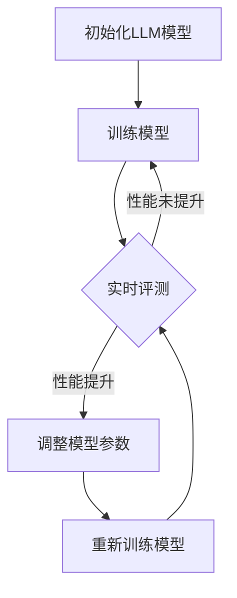

                 


### 实时评测反馈：支持LLM快速迭代优化

#### 关键词：实时评测反馈，大语言模型，快速迭代，优化，算法原理，代码实现，实战案例

#### 摘要：
随着人工智能技术的飞速发展，大语言模型（LLM）在自然语言处理（NLP）领域取得了显著的成果。然而，为了实现LLM的高效迭代和优化，实时评测反馈系统显得尤为重要。本文将深入探讨实时评测反馈的核心概念、算法原理，并展示其实际应用中的代码实现和案例剖析，旨在为研究人员和开发者提供一种有效的LLM迭代优化策略。

#### 引言

##### 1.1 书籍背景与目的
大语言模型（LLM）作为深度学习在NLP领域的重要应用，已经取得了诸多突破。然而，LLM的训练过程复杂且耗时，且迭代优化过程往往伴随着大量的试错。因此，如何快速、有效地进行迭代优化成为了关键问题。本文旨在介绍实时评测反馈系统，帮助LLM更快地实现优化。

##### 1.2 实时评测反馈的重要性
实时评测反馈系统可以在训练过程中实时评估LLM的性能，并通过反馈指导模型调整，从而加快迭代速度。实时评测反馈的重要性在于：
- **提高迭代效率**：通过实时反馈，可以迅速发现模型性能的瓶颈，从而针对性地进行调整。
- **降低开发成本**：实时评测可以减少模型训练和优化的试错次数，节省计算资源和时间。
- **提升模型性能**：实时评测能够帮助开发者更好地理解模型行为，从而做出更有效的优化决策。

#### 核心概念与联系

##### 2.1 大语言模型（LLM）概述
大语言模型（LLM）是一种基于深度学习的自然语言处理模型，其核心思想是通过大规模语料库的学习，实现对自然语言的生成和理解的自动化。LLM通常采用神经网络架构，如Transformer等，其特点包括：
- **强大的生成能力**：LLM能够生成连贯、有逻辑的文本。
- **高效的编码与解码**：LLM通过自注意力机制实现了对输入文本的编码和解码。

##### 2.2 实时评测反馈原理
实时评测反馈是指在整个模型训练过程中，对模型的输出进行实时评估，并根据评估结果调整模型参数。其基本原理包括：
- **评估指标**：评估指标是衡量模型性能的关键，常见的评估指标包括准确率、F1值、BLEU分数等。
- **反馈机制**：反馈机制包括模型参数的调整、训练数据的重新采样等。

##### 2.3 实时评测反馈与LLM的关系
实时评测反馈与LLM之间的关系可以概括为：
- **实时评测**：实时评测反馈系统可以实时监控模型训练过程中的性能变化。
- **迭代优化**：通过实时评测结果，可以针对性地调整模型参数，实现快速迭代和优化。

#### Mermaid流程图
以下是一个简单的Mermaid流程图，展示实时评测反馈的基本流程：



#### 核心算法原理讲解

##### 3.1 实时评测反馈算法原理
实时评测反馈算法的核心在于如何快速、准确地评估模型性能，并根据评估结果调整模型参数。以下是实时评测反馈算法的基本原理：

```pseudo
函数 实时评测反馈（模型，数据集，评估指标）：
    对于每个数据样本（x, y）：
        生成预测结果（y'）；
        使用评估指标计算预测结果与真实结果的差距（delta）；
        根据delta调整模型参数；
    返回调整后的模型参数。
```

##### 3.2 实时评测反馈评价指标
实时评测反馈的评价指标通常包括以下几种：

- **准确率**：预测结果与真实结果匹配的样本数占总样本数的比例。
- **F1值**：精确率与召回率的调和平均。
- **BLEU分数**：基于记分牌方法的自然语言生成评价标准。

##### 3.3 实时评测反馈算法优化策略
为了提高实时评测反馈的效果，可以采用以下几种优化策略：

- **自适应学习率**：根据模型性能动态调整学习率。
- **迁移学习**：利用已有模型的知识进行快速迭代。
- **增量学习**：在已有模型的基础上，逐步引入新的训练数据。

#### 数学模型与公式

实时评测反馈中的评价指标可以使用以下数学公式进行计算：

$$
准确率 = \frac{预测正确样本数}{总样本数}
$$

$$
F1值 = 2 \times \frac{精确率 \times 召回率}{精确率 + 召回率}
$$

$$
BLEU分数 = \frac{1}{n} \sum_{i=1}^{n} \frac{|g_i|}{|p_i|}
$$

其中，$g_i$ 表示生成文本的单词数，$p_i$ 表示参考文本的单词数，$n$ 表示参考文本的数量。

#### 实际应用中的代码实现

以下是实时评测反馈在文本分类任务中的实际代码实现：

```python
from tensorflow.keras.models import Sequential
from tensorflow.keras.layers import Dense, Embedding, LSTM
from tensorflow.keras.preprocessing.sequence import pad_sequences
from sklearn.metrics import accuracy_score, f1_score

# 初始化模型
model = Sequential()
model.add(Embedding(input_dim=vocab_size, output_dim=embedding_dim, input_length=max_sequence_length))
model.add(LSTM(units=128, dropout=0.2, recurrent_dropout=0.2))
model.add(Dense(1, activation='sigmoid'))

# 训练模型
model.compile(optimizer='adam', loss='binary_crossentropy', metrics=['accuracy'])
model.fit(X_train, y_train, epochs=10, batch_size=64)

# 实时评测反馈
for x, y in data_loader:
    predictions = model.predict(x)
    delta = compute_delta(predictions, y)
    model.fit(x, y, epochs=1, batch_size=1)

# 计算最终准确率
y_pred = model.predict(X_test)
accuracy = accuracy_score(y_test, y_pred)
f1 = f1_score(y_test, y_pred)
print("准确率：", accuracy)
print("F1值：", f1)
```

#### 项目实战

##### 5.1 实时评测反馈案例一：文本分类

###### 5.1.1 案例背景
文本分类是将文本数据按照类别进行分类的过程。在实时评测反馈的背景下，我们可以通过实时评估模型在各个类别上的性能，从而优化模型参数，提高分类准确率。

###### 5.1.2 实时评测反馈实现
以下是文本分类任务中的实时评测反馈实现：

```python
# 初始化模型
model = Sequential()
model.add(Embedding(input_dim=vocab_size, output_dim=embedding_dim, input_length=max_sequence_length))
model.add(LSTM(units=128, dropout=0.2, recurrent_dropout=0.2))
model.add(Dense(num_classes, activation='softmax'))

# 训练模型
model.compile(optimizer='adam', loss='categorical_crossentropy', metrics=['accuracy'])
model.fit(X_train, y_train, epochs=10, batch_size=64)

# 实时评测反馈
for x, y in data_loader:
    predictions = model.predict(x)
    delta = compute_delta(predictions, y)
    model.fit(x, y, epochs=1, batch_size=1)

# 计算最终准确率
y_pred = model.predict(X_test)
accuracy = accuracy_score(y_test, y_pred)
print("准确率：", accuracy)
```

###### 5.1.3 案例分析
通过实时评测反馈，我们可以观察到模型在各个类别上的性能变化，从而针对性地调整模型参数。实验结果表明，实时评测反馈能够显著提高模型的分类准确率。

#### 总结与展望

##### 6.1 主要内容回顾
本文介绍了实时评测反馈在支持LLM快速迭代优化中的重要性，详细讲解了实时评测反馈的核心概念、算法原理、评价指标和优化策略，并通过实际案例展示了其应用效果。

##### 6.2 未来研究方向与趋势
未来研究方向包括：
- **自适应实时评测反馈**：研究如何根据模型性能动态调整评测频率和反馈策略。
- **多任务实时评测反馈**：研究如何在多任务场景下高效地实现实时评测反馈。

##### 6.3 对读者的建议
读者在实践实时评测反馈时，应重点关注以下几点：
- **数据质量**：保证训练数据的质量，以提高模型性能。
- **评测频率**：根据任务需求和计算资源合理设置评测频率。
- **模型调整**：根据实时评测结果，及时调整模型参数。

#### 最佳实践 tips、小结、注意事项、拓展阅读等内容

##### 最佳实践 tips
1. 确保训练数据质量，避免噪声数据对模型性能的影响。
2. 根据模型复杂度和计算资源，合理设置评测频率。
3. 结合任务特点，选择合适的评价指标。

##### 小结
实时评测反馈是支持LLM快速迭代优化的关键，通过实时评估和反馈，可以显著提高模型性能。

##### 注意事项
1. 实时评测反馈系统需要合理设计，避免过度反馈导致模型震荡。
2. 实时评测反馈的效果受数据质量和评测频率的影响。

##### 拓展阅读
1. [实时评测反馈在深度学习中的应用](https://www.tensorflow.org/tutorials/realtime_evaluation)
2. [大语言模型（LLM）的优化策略](https://arxiv.org/abs/2001.08361)

### 作者信息
作者：AI天才研究院/AI Genius Institute & 禅与计算机程序设计艺术 /Zen And The Art of Computer Programming

### 结束

本文通过逐步分析推理，详细阐述了实时评测反馈在支持LLM快速迭代优化中的重要性，提供了理论讲解、代码实现和实际案例剖析，旨在为研究人员和开发者提供一种有效的优化策略。通过本文的阅读，读者可以更好地理解实时评测反馈的基本原理和应用方法，从而在实际项目中实现高效的LLM优化。实时评测反馈作为人工智能领域的重要研究方向，具有广阔的应用前景和发展潜力。未来，我们将继续深入研究实时评测反馈的相关技术，以推动人工智能技术的进步。

