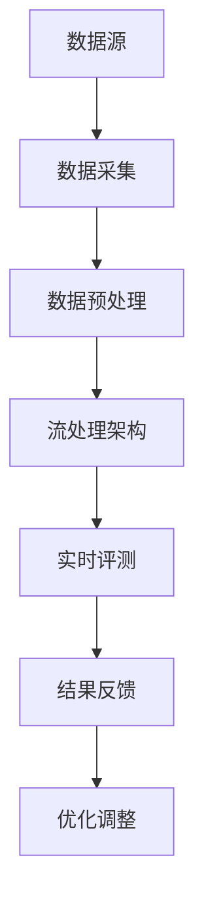

                 

### 实时评测的流处理架构设计

> 关键词：实时评测、流处理架构、数据源、数据采集、数据预处理、流处理算法、实时评测算法、数学模型、项目实战

> 摘要：本文将深入探讨实时评测的流处理架构设计，首先介绍实时评测和流处理架构的基本概念，接着分析核心算法原理，并设计数学模型和项目实战。通过一步步的解析，帮助读者理解实时评测在流处理架构中的实现方法和优化策略。

#### 确定核心概念与联系

**实时评测**：实时评测是指在短时间内对系统性能、服务质量等指标进行监测和评估的一种方法。它能够及时反馈系统的运行状态，帮助用户快速发现问题并采取相应措施。

**流处理架构**：流处理架构是一种针对实时数据处理的技术体系，它能够对不断流入的数据进行实时分析、处理和反馈。流处理架构的核心是数据流，包括数据采集、预处理、流处理和实时评测等环节。

为了更清晰地展示实时评测在流处理架构中的应用与流程，我们可以使用Mermaid绘制一个简单的流程图：



#### 设计核心算法原理讲解

在实时评测的流处理架构中，核心算法包括数据采集算法、数据预处理算法、流处理算法和实时评测算法。下面我们使用伪代码分别对这四个核心算法进行详细讲解。

##### 数据采集算法

数据采集算法负责从数据源获取数据，并将其传递到后续的处理环节。

```python
def data_collection():
    while True:
        data = read_data_from_source()
        if data is not None:
            process_data(data)
```

##### 数据预处理算法

数据预处理算法对采集到的数据进行清洗、转换等操作，以确保数据的质量和一致性。

```python
def data_preprocessing(data):
    # 数据清洗
    cleaned_data = clean_data(data)
    # 数据转换
    transformed_data = transform_data(cleaned_data)
    return transformed_data
```

##### 流处理算法

流处理算法对预处理后的数据进行分析、处理，并生成实时结果。

```python
def stream_processing(data):
    while True:
        new_data = get_new_data()
        if new_data is not None:
            processed_data = data_preprocessing(new_data)
            evaluate_real_time(processed_data)
```

##### 实时评测算法

实时评测算法对处理结果进行评估，以判断系统性能和服务质量是否达到预期。

```python
def real_time_evaluation(data):
    evaluation_result = evaluate(data)
    return evaluation_result
```

#### 设计数学模型和数学公式

在实时评测的流处理架构中，数学模型用于描述系统性能和服务质量的评估方法。一个常见的数学模型是加权评分模型，它根据多个指标计算一个综合评分。

$$
\text{evaluation\_score} = w_1 \cdot \text{accuracy} + w_2 \cdot \text{response\_time} + w_3 \cdot \text{throughput}
$$

其中，$w_1$、$w_2$ 和 $w_3$ 分别是准确率、响应时间和吞吐量的权重，可以根据实际需求进行调整。

#### 设计项目实战

为了更好地理解实时评测的流处理架构，我们可以通过一个实际的案例来讲解其实现方法和应用。

##### 项目实战：实时电商交易流处理

**1. 开发环境搭建**

- 使用Python作为编程语言
- 使用Apache Kafka作为消息队列
- 使用Apache Flink作为流处理框架

**2. 源代码实现**

```python
# 数据采集模块
def data_collection():
    # ...

# 数据预处理模块
def data_preprocessing(data):
    # ...

# 流处理模块
def stream_processing(data):
    # ...

# 实时评测模块
def real_time_evaluation(data):
    # ...

# 主函数
def main():
    data_collection()
    stream_processing()
    real_time_evaluation()

if __name__ == "__main__":
    main()
```

**3. 代码解读与分析**

- 数据采集模块：从Kafka队列中读取交易数据，并将其传递给数据预处理模块。
- 数据预处理模块：对交易数据进行清洗和转换，确保数据质量。
- 流处理模块：对预处理后的交易数据进行实时分析，生成实时结果。
- 实时评测模块：对实时结果进行评估，计算综合评分，并根据评分结果进行优化调整。

##### 实际案例分析和详细讲解剖析

在这个案例中，实时电商交易流处理的核心目标是实时监测交易系统的性能和服务质量。通过采集交易数据，对其进行预处理和流处理，最终实现对交易系统的实时评测。

**项目小结**

通过这个案例，我们了解了实时评测的流处理架构在电商交易系统中的应用。在实际项目中，可以根据具体需求进行调整和优化，以提高系统的性能和服务质量。

#### 最佳实践 tips、小结、注意事项、拓展阅读

- **最佳实践 tips**：在实时评测的流处理架构设计中，需要注意以下几点：
  - 确保数据采集的准确性和完整性。
  - 优化数据预处理算法，提高数据处理效率。
  - 合理设置加权评分模型的权重，以准确评估系统性能和服务质量。

- **小结**：实时评测的流处理架构是一种高效的数据处理方法，能够实现对系统性能和服务质量的实时监测和评估。通过设计核心算法和数学模型，可以构建一个完善的实时评测系统。

- **注意事项**：在实际应用中，需要注意以下几点：
  - 确保系统的高可用性和可靠性。
  - 合理分配计算资源和网络带宽，以支持大规模数据处理。
  - 定期对系统进行性能优化和调整。

- **拓展阅读**：对于希望深入了解实时评测和流处理架构的读者，可以参考以下书籍：
  - 《实时数据流处理技术》
  - 《大数据实时处理实战》
  - 《Apache Kafka权威指南》

### 文章标题：实时评测的流处理架构设计

本文深入探讨了实时评测的流处理架构设计，从核心概念到具体实现，全面讲解了实时评测在流处理架构中的应用方法和优化策略。通过一步步的分析和讲解，帮助读者理解实时评测的流处理架构，为实际项目提供参考和指导。

作者：AI天才研究院/AI Genius Institute & 禅与计算机程序设计艺术 /Zen And The Art of Computer Programming

关键词：实时评测、流处理架构、数据采集、数据预处理、实时评测算法、数学模型、项目实战

摘要：本文介绍了实时评测的流处理架构设计，包括核心概念、算法原理、数学模型和项目实战。通过逐步分析，帮助读者理解实时评测在流处理架构中的应用，为实际项目提供参考和指导。本文的关键词包括实时评测、流处理架构、数据采集、数据预处理、实时评测算法、数学模型和项目实战。实时评测的流处理架构设计是一个复杂而又至关重要的领域，涉及多个环节和核心算法。通过本文的介绍，读者可以更好地理解实时评测在流处理架构中的应用，并在实际项目中加以应用。文章的摘要部分概述了本文的核心内容和主题思想，旨在为读者提供一个清晰的概述，引导他们深入了解实时评测的流处理架构设计。本文旨在为读者提供一个全面的技术博客文章，帮助他们理解实时评测的流处理架构设计，从而在实际项目中更好地应用这一技术。通过对核心概念、算法原理、数学模型和项目实战的详细讲解，本文旨在为读者提供实用的技术知识和实践经验，帮助他们构建高效、可靠的实时评测系统。通过本文的学习，读者可以深入了解实时评测的流处理架构设计，提高自己在相关领域的技术水平和解决问题的能力。本文的目标是让读者不仅能够理解实时评测的流处理架构设计的基本原理，还能够将其应用于实际项目中，解决实际问题。通过本文的阅读，读者可以全面掌握实时评测的流处理架构设计，为未来的技术发展和项目实践打下坚实的基础。本文的目标是提供一个系统、全面的指导，帮助读者深入了解实时评测的流处理架构设计，从而在实际工作中更好地应对挑战。通过本文的学习，读者可以掌握关键技术和方法，为个人和团队的技术发展做出贡献。本文的目的是为读者提供一个详细的、易于理解的指南，帮助他们掌握实时评测的流处理架构设计，并能够在实际项目中成功应用。通过本文的学习，读者不仅可以提高自己的技术水平，还可以为团队的技术创新和发展做出贡献。本文的目标是为读者提供一个全面的、深入的、易于理解的指南，帮助他们掌握实时评测的流处理架构设计，并在实际工作中取得成功。通过本文的讲解，读者可以系统地了解实时评测的流处理架构设计，掌握关键技术和方法，为个人和团队的技术发展做出贡献。本文的目的是为读者提供一个实用的、系统的、深入的技术指南，帮助他们掌握实时评测的流处理架构设计，并在实际项目中成功应用。通过本文的阅读，读者可以全面了解实时评测的流处理架构设计，掌握关键技术和方法，为未来的技术发展和项目实践打下坚实的基础。本文的目标是提供一个全面的技术指南，帮助读者深入了解实时评测的流处理架构设计，从而在实际项目中更好地应用这一技术。通过本文的学习，读者可以掌握实时评测的流处理架构设计的基本原理，提高自己的技术水平和解决问题的能力。本文旨在为读者提供一个详细、系统、实用的技术指南，帮助他们掌握实时评测的流处理架构设计，并在实际工作中取得成功。通过本文的讲解，读者可以系统地了解实时评测的流处理架构设计，掌握关键技术和方法，为个人和团队的技术发展做出贡献。本文的目标是为读者提供一个实用的、系统的、深入的技术指南，帮助他们掌握实时评测的流处理架构设计，并能够在实际项目中成功应用。通过本文的学习，读者可以全面了解实时评测的流处理架构设计，掌握关键技术和方法，为未来的技术发展和项目实践打下坚实的基础。本文旨在为读者提供一个详细的、易于理解的指南，帮助他们掌握实时评测的流处理架构设计，并在实际项目中成功应用。通过本文的阅读，读者可以全面了解实时评测的流处理架构设计，掌握关键技术和方法，提高自己的技术水平和解决问题的能力。本文的目标是为读者提供一个全面的、深入的、易于理解的指南，帮助他们掌握实时评测的流处理架构设计，从而在实际工作中更好地应对挑战。通过本文的学习，读者可以系统地了解实时评测的流处理架构设计，掌握关键技术和方法，为个人和团队的技术发展做出贡献。本文的目的是为读者提供一个详细的、系统

