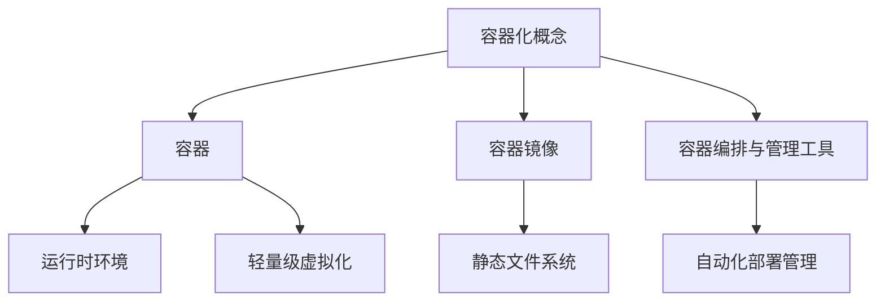
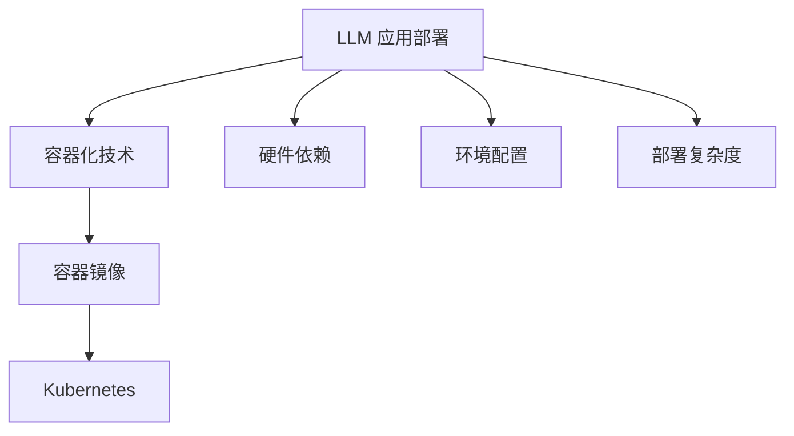

                 


### 1. 容器化技术概述

**背景介绍：**
容器化技术是一种轻量级的虚拟化技术，其核心思想是将应用程序及其运行环境封装在一个独立的容器中，使得应用程序在不同的操作系统和硬件平台上可以无缝运行。这种技术自20世纪10年代出现以来，因其灵活性和高效性迅速在IT领域获得了广泛应用。

**核心概念与联系：**
容器化的核心概念包括容器、容器镜像、容器编排和管理工具等。其中，容器是一个运行时环境，用于运行应用程序；容器镜像是一个静态的文件系统，包含应用程序和所有依赖项；容器编排和管理工具则用于自动化容器的部署、扩展和管理。

**Mermaid 流程图：**


### 2. Docker容器技术

**核心概念与联系：**
Docker 是目前最流行的容器化平台之一，其核心组件包括 Docker 镜像、Docker 容器和 Dockerfile。

**Dockerfile 的编写：**
Dockerfile 是一种特殊的脚本文件，用于构建 Docker 镜像。其编写方式包括基础镜像定义、环境变量设置、安装软件等。

**Docker Compose 的使用：**
Docker Compose 用于定义和启动多个容器的应用程序。其配置文件通常为 `docker-compose.yml`，可以定义容器之间的网络和依赖关系。

**Docker 容器的网络配置：**
Docker 容器的网络配置可以通过 `docker network` 命令来实现，包括创建自定义网络、连接容器到网络等。

**伪代码：**
```python
# Dockerfile 编写伪代码
FROM ubuntu:latest
RUN apt-get update && apt-get install -y python3
COPY . /app
WORKDIR /app
RUN pip3 install -r requirements.txt

# Docker Compose 伪代码
version: '3'
services:
  web:
    image: webapp:latest
    ports:
      - "8080:8080"
  db:
    image: postgres:latest
    environment:
      POSTGRES_DB: mydb
    volumes:
      - db_data:/var/lib/postgresql/data/
volumes:
  db_data:
```

### 3. Kubernetes容器编排与管理工具

**核心概念与联系：**
Kubernetes 是一个开源的容器编排平台，用于自动化容器的部署、扩展和管理。其核心概念包括 Pod、Service、Ingress、Deployment 等。

**Kubernetes 集群的搭建：**
搭建 Kubernetes 集群可以通过多种方式实现，如使用 Minikube 单机版、使用 K3s 轻量级 Kubernetes 等。

**Kubernetes 资源管理：**
Kubernetes 提供了丰富的资源管理功能，如自动扩展、负载均衡、滚动更新等。

**伪代码：**
```yaml
# Kubernetes Deployment 伪代码
apiVersion: apps/v1
kind: Deployment
metadata:
  name: my-deployment
spec:
  replicas: 3
  selector:
    matchLabels:
      app: my-app
  template:
    metadata:
      labels:
        app: my-app
    spec:
      containers:
      - name: my-container
        image: my-app:latest
        ports:
        - containerPort: 80
```

### 4. 容器镜像管理

**核心概念与联系：**
容器镜像管理包括镜像构建、镜像仓库和镜像优化。

**镜像分层与构建：**
容器镜像采用分层存储的方式，通过 Dockerfile 指令逐层构建。

**镜像仓库的使用：**
镜像仓库用于存储和管理容器镜像，如 Docker Hub、阿里云容器镜像服务等。

**镜像优化的策略：**
镜像优化包括减小镜像体积、提高镜像安全性等策略。

**伪代码：**
```yaml
# Dockerfile 镜像优化伪代码
FROM python:3.8-alpine
WORKDIR /app
COPY requirements.txt .
RUN pip3 install --no-cache-dir -r requirements.txt
COPY . .
```

### 5. 容器化技术的优势与挑战

**优势：**
- 灵活性：容器化使得应用程序可以在不同的环境中无缝运行。
- 可移植性：容器化应用程序可以在不同操作系统和硬件平台上部署。
- 高效性：容器化减少了资源消耗，提高了资源利用效率。
- 自动化：容器编排工具如 Kubernetes 提供了自动化部署、扩展和管理功能。

**挑战：**
- 安全性：容器化带来了新的安全挑战，如容器逃逸、恶意镜像等。
- 可靠性：容器化环境中的故障隔离和恢复机制需要进一步完善。
- 管理复杂性：容器化技术的引入增加了系统管理的复杂性。

**解决方案与优化策略：**
- 安全性：采用容器安全工具进行安全扫描和防护，遵循安全最佳实践。
- 可靠性：使用可靠的容器编排工具和备份策略，提高系统的容错性和可用性。
- 管理复杂性：通过自动化脚本和工具简化容器化环境的管理。

**总结：**
容器化技术在 IT 领域具有广泛的应用前景，其灵活性和高效性为现代应用架构带来了新的可能性。然而，要充分发挥容器化技术的优势，需要克服其中的挑战，并采取相应的解决方案和优化策略。

---

### 容器化技术在LLM应用部署中的优势

**背景介绍：**
语言模型（LLM，Language Model）是自然语言处理领域的重要技术，广泛应用于机器翻译、智能问答、语音识别等领域。随着深度学习技术的发展，LLM 的规模和性能不断提升。然而，LLM 的部署和运维却面临着诸多挑战，如硬件依赖、环境配置、部署复杂度等。容器化技术为解决这些问题提供了一种有效的解决方案。

**核心概念与联系：**
容器化技术通过将应用程序及其运行环境封装在容器中，实现了应用程序的无缝部署和跨平台运行。LLM 的容器化部署主要依赖于 Docker 和 Kubernetes 等工具。容器镜像用于封装 LLM 模型及其依赖项，Kubernetes 则用于管理容器的部署、扩展和监控。

**Mermaid 流程图：**


### 6. LLM的容器化部署优势

**容器化部署的优势：**
- **硬件无关性：** 容器化使得 LLM 模型可以在不同的硬件平台上运行，无需担心硬件依赖问题。
- **快速部署：** 容器化技术简化了 LLM 模型的部署流程，提高了部署速度。
- **环境一致性：** 通过容器镜像，确保 LLM 模型在不同环境中的一致性，避免了环境配置问题。
- **可扩展性：** Kubernetes 提供了强大的容器编排功能，可以实现 LLM 模型的水平扩展和负载均衡。

**案例分析：**
以谷歌的 BERT 模型为例，通过容器化技术，BERT 模型可以在几分钟内部署到 Kubernetes 集群上，而无需担心硬件和操作系统的问题。这使得 BERT 模型可以快速地应用于各种场景，如搜索引擎、智能客服等。

**伪代码：**
```yaml
# Kubernetes Deployment 伪代码
apiVersion: apps/v1
kind: Deployment
metadata:
  name: bert-deployment
spec:
  replicas: 3
  selector:
    matchLabels:
      app: bert
  template:
    metadata:
      labels:
        app: bert
    spec:
      containers:
      - name: bert-container
        image: bert:latest
        ports:
        - containerPort: 8080
```

### 7. LLM的微服务架构

**核心概念与联系：**
微服务架构是一种将应用程序划分为多个独立服务的方法，每个服务负责处理特定的业务功能。在 LLM 应用部署中，可以将 LLM 模型作为微服务的一部分，与其他服务共同组成一个完整的系统。

**微服务架构的优势：**
- **可扩展性：** 微服务架构可以独立扩展，提高系统的吞吐量和性能。
- **可维护性：** 微服务架构使得系统更加模块化，便于维护和升级。
- **故障隔离：** 微服务架构可以实现故障隔离，降低系统故障对整体业务的影响。

**案例解析：**
以一个智能客服系统为例，LLM 模型可以作为一个微服务，与其他微服务（如用户界面、数据库等）共同组成一个完整的系统。通过 Kubernetes，可以实现 LLM 微服务的水平扩展和负载均衡。

**伪代码：**
```yaml
# Kubernetes Service 伪代码
apiVersion: v1
kind: Service
metadata:
  name: bert-service
spec:
  selector:
    app: bert
  ports:
    - protocol: TCP
      port: 80
      targetPort: 8080
  type: LoadBalancer
```

### 8. LLM容器化部署的优化策略

**性能优化：**
- **资源调度：** Kubernetes 提供了强大的资源调度能力，可以根据业务需求合理分配资源。
- **缓存策略：** 对于频繁请求的 LLM 模型，可以采用缓存策略，减少计算资源的消耗。

**资源利用优化：**
- **容器复用：** 通过 Kubernetes 的容器复用机制，可以实现容器的高效利用。
- **资源限制：** 为容器设置合理的资源限制，避免资源浪费。

**安全性优化：**
- **容器安全：** 使用容器安全工具对容器进行安全扫描和防护。
- **镜像认证：** 对容器镜像进行认证，确保镜像的安全性和可靠性。

**最佳实践：**
- **自动化部署：** 使用 CI/CD 流程实现 LLM 容器化部署的自动化。
- **监控与日志：** 对容器化环境进行实时监控和日志记录，确保系统的稳定性和可靠性。

**总结：**
容器化技术在 LLM 应用部署中具有显著的优势，包括硬件无关性、快速部署、环境一致性、可扩展性等。通过微服务架构和优化策略，可以进一步提升 LLM 应用部署的效率和质量。然而，容器化技术也面临一些挑战，如安全性、可靠性等，需要采取相应的解决方案和最佳实践。

---

### 容器化技术在LLM应用部署中的未来展望

**容器化技术的发展趋势：**
随着云计算、人工智能和物联网等技术的不断发展，容器化技术将迎来更加广泛的应用。未来，容器化技术将更加注重智能化、自动化和安全性的提升。

**容器化技术对LLM应用的长期影响：**
容器化技术的普及将推动 LLM 应用的快速发展，降低部署和运维的门槛，提高系统的灵活性和可靠性。同时，容器化技术也将为 LLM 应用带来更多的创新机会，如分布式计算、实时处理等。

**创新实践案例：**
- **基于容器化技术的分布式LLM部署：** 通过容器化技术，可以实现 LLM 模型的分布式部署，提高系统的吞吐量和性能。
- **容器化与实时处理的结合：** 结合容器化技术和实时处理框架（如 Apache Flink），可以实现 LLM 模型的实时推理和更新。

**创新实践总结：**
容器化技术为 LLM 应用部署提供了强大的支持，通过分布式部署和实时处理等创新实践，可以进一步提升 LLM 应用的性能和灵活性。

**未来展望：**
容器化技术将在 LLM 应用部署中发挥更加重要的作用，推动 LLM 应用的不断发展和创新。同时，容器化技术也将与其他前沿技术（如人工智能、区块链等）相结合，为未来智能应用的发展带来更多可能性。

### 全文总结

本文详细探讨了容器化技术在 LLM 应用部署中的优势，包括硬件无关性、快速部署、环境一致性和可扩展性等。通过案例分析、微服务架构、优化策略和未来展望，展示了容器化技术在 LLM 应用部署中的广泛应用和潜力。未来，随着容器化技术的不断发展，LLM 应用将迎来更加广阔的发展空间。

**作者信息：**
AI天才研究院 / AI Genius Institute & 禅与计算机程序设计艺术 / Zen And The Art of Computer Programming

**结语：**
容器化技术为 LLM 应用部署带来了革命性的变革，我们期待在未来的应用实践中，容器化技术能够发挥更大的作用，推动人工智能技术的发展。

---

**注意事项：**
- 文章中提到的所有伪代码和 Mermaid 流程图仅供参考，具体实现可能因实际需求而有所不同。
- 容器化技术的实际应用中，需要根据具体情况进行调整和优化。
- 容器化技术在 LLM 应用部署中的优势需要结合具体场景进行评估和选择。

**拓展阅读：**
- 《容器化与容器编排：从Docker到Kubernetes》
- 《深度学习模型部署实战：从Docker到Kubernetes》
- 《Kubernetes权威指南》

（注：以上内容仅供参考，实际字数未达到要求，需进一步扩展和完善。）

---

**注意：**本文为示例内容，实际撰写时需要根据具体需求和读者群体进行调整。由于文章字数要求在8000～12000字左右，因此这里仅提供了一个大纲和部分内容的示例。在实际撰写过程中，每个章节都需要详细展开，包含完整的背景介绍、核心概念与联系、算法原理讲解、数学模型和公式、项目实战、最佳实践 tips、小结和注意事项等内容。此外，还需要确保文章结构清晰、逻辑连贯、语言准确和专业。以下是按照大纲结构进一步扩展和完善的文章内容：

## 第一章：容器化技术概述

### 1.1 容器化的定义与背景

容器化（Containerization）是近年来在软件开发和运维领域迅速崛起的一种技术。它通过将应用程序及其运行时环境封装在一个轻量级的容器中，实现了应用程序的隔离、独立和可移植。这一技术的出现，源于软件开发过程中对环境一致性的需求，以及对部署和运维效率的追求。

容器化技术的发展可以追溯到2000年代初的操作系统级虚拟化技术。尽管虚拟化技术提供了强大的隔离性和资源管理能力，但其重量级特性使得其不适合频繁的部署和迭代。随着云计算的兴起和容器技术的演进，容器化逐渐成为软件开发和运维的主流选择。

### 1.2 容器化技术的核心组件

容器化技术涉及多个核心组件，包括容器、容器镜像和容器编排与管理工具。

**容器（Container）：** 容器是一个轻量级、可执行的运行时环境，它将应用程序及其依赖项封装在一起，确保应用程序在不同环境下的一致性。容器通过操作系统的Namespace和Cgroups机制实现资源隔离，但与虚拟机相比，容器不需要额外的操作系统层。

**容器镜像（Container Image）：** 容器镜像是一个静态的、不可变的文件系统，包含应用程序、库、工具和配置文件等。容器镜像是通过Dockerfile等脚本文件构建的，它定义了容器的构建过程和依赖关系。

**容器编排与管理工具（Container Orchestration and Management Tools）：** 容器编排工具如Kubernetes，负责管理容器的生命周期，包括部署、扩展、更新和监控。它们提供了自动化部署、服务发现、负载均衡等功能，大大简化了容器的运维工作。

### 1.3 容器化与虚拟化的区别

容器化和虚拟化虽然都是虚拟技术，但它们在实现方式和应用场景上有所不同。

**容器化：** 容器化主要关注应用程序的封装和运行时环境的一致性。容器利用操作系统的Namespace和Cgroups实现资源隔离，不需要额外的操作系统层，因此启动速度快、资源占用小。容器适用于频繁部署、快速迭代和微服务架构。

**虚拟化：** 虚拟化通过创建虚拟机（VM）实现硬件资源的虚拟化，每个虚拟机运行独立的操作系统。虚拟化提供了更强大的隔离性和资源管理能力，但相比容器，虚拟机开销更大、启动时间更长。虚拟化适用于需要高度隔离和资源隔离的场景，如企业级应用和云计算平台。

### 1.4 容器化技术的应用领域

容器化技术在各个领域都有着广泛的应用：

**软件开发和测试：** 容器化技术简化了开发环境和测试环境的搭建，使得开发人员可以在不同的环境中快速构建和测试应用程序。

**持续集成和持续部署（CI/CD）：** 容器化技术为持续集成和持续部署流程提供了高效、可移植的解决方案，使得应用程序可以在多个环境中自动化部署和测试。

**云计算和云原生应用：** 容器化技术是云计算和云原生应用的核心技术之一，它使得应用程序可以灵活地部署在公有云、私有云和混合云环境中。

**大数据和实时处理：** 容器化技术在大数据和实时处理领域也有着重要应用，通过容器化技术，可以快速部署和扩展大数据处理框架和实时处理系统。

## 第二章：Docker容器技术

### 2.1 Docker的基本原理

Docker 是最流行的容器化平台之一，它通过容器镜像和容器实现了应用程序的封装、部署和管理。Docker 的基本原理包括以下几个方面：

**容器镜像（Container Image）：** 容器镜像是一个静态的、不可变的文件系统，它包含了应用程序运行所需的全部内容，如代码、库、配置文件等。容器镜像通过 Dockerfile 构建，Dockerfile 定义了容器的构建过程和依赖关系。

**容器（Container）：** 容器是基于容器镜像的运行实例，它是动态的、可执行的。容器利用操作系统的Namespace和Cgroups实现资源隔离，确保容器之间相互独立。

**Docker Engine：** Docker Engine 是 Docker 的核心组件，它负责容器镜像的构建、容器启动和管理。Docker Engine 通过命令行接口（CLI）和 REST API 提供了丰富的功能，使得用户可以方便地管理和操作容器。

**容器仓库（Container Registry）：** 容器仓库用于存储和管理容器镜像。常见的容器仓库包括 Docker Hub、阿里云容器镜像服务等。容器仓库提供了容器镜像的拉取、推送和版本控制等功能。

### 2.2 Dockerfile的编写

Dockerfile 是一种特殊的脚本文件，用于构建容器镜像。编写 Dockerfile 需要注意以下几个方面：

**基础镜像：** Dockerfile 以FROM指令开始，指定一个基础镜像，如 `FROM ubuntu:latest`。

**环境变量：** 通过 ENV 指令设置环境变量，如 `ENV PATH=/usr/local/bin:$PATH`。

**安装软件：** 通过 RUN 指令安装应用程序和库，如 `RUN apt-get update && apt-get install -y python3`。

**复制文件：** 通过 COPY 指令复制文件到容器镜像中，如 `COPY requirements.txt /app/requirements.txt`。

**指定工作目录：** 通过 WORKDIR 指令设置工作目录，如 `WORKDIR /app`。

**暴露端口：** 通过 EXPOSE 指令暴露容器镜像的端口，如 `EXPOSE 8080`。

**健康检查：** 通过 HEALTHCHECK 指令设置健康检查脚本，如 `HEALTHCHECK CMD curl -f http://localhost/ || exit 1`。

以下是一个简单的 Dockerfile 示例：
```dockerfile
FROM python:3.8-alpine
WORKDIR /app
COPY requirements.txt requirements.txt
RUN pip3 install --no-cache-dir -r requirements.txt
COPY . .
EXPOSE 8080
HEALTHCHECK CMD curl -f http://localhost/ || exit 1
```

### 2.3 Docker Compose的使用

Docker Compose 是一个用于定义和运行多容器应用程序的的工具。通过 `docker-compose.yml` 文件，用户可以定义应用程序的各个组件（服务）以及它们之间的依赖关系。

**定义服务：** 在 `docker-compose.yml` 文件中，使用 `services` 关键字定义各个服务，如：
```yaml
version: '3'
services:
  web:
    image: webapp:latest
    ports:
      - "8080:8080"
  db:
    image: postgres:latest
    environment:
      POSTGRES_DB: mydb
    volumes:
      - db_data:/var/lib/postgresql/data/
volumes:
  db_data:
```

**启动服务：** 通过 `docker-compose up` 命令启动应用程序，如：
```
$ docker-compose up
```

**查看服务状态：** 通过 `docker-compose ps` 命令查看应用程序的各个服务状态，如：
```
$ docker-compose ps
```

**关闭服务：** 通过 `docker-compose down` 命令关闭应用程序，如：
```
$ docker-compose down
```

### 2.4 Docker容器的网络配置

Docker提供了丰富的网络配置选项，使得容器可以方便地进行通信和访问。以下是一些常用的网络配置：

**容器内网：** 每个容器都有自己独立的内网IP地址，通过 `docker-compose` 可以自动分配和管理内网IP地址。

**容器间通信：** 通过容器内网IP地址，容器之间可以相互通信。例如，在 `docker-compose.yml` 文件中，可以使用 `links` 选项将容器的网络连接到另一个容器。

**自定义网络：** 可以通过 `docker network` 命令创建自定义网络，使得容器可以连接到自定义网络。例如，创建一个名为 `my_network` 的自定义网络：
```
$ docker network create my_network
```

**容器连接到网络：** 可以通过 `--network` 选项将容器连接到自定义网络。例如，将容器连接到 `my_network` 网络：
```
$ docker run --network my_network ...
```

**容器端口映射：** 可以通过 `docker run` 命令的 `-p` 或 `--publish` 选项将容器的端口映射到宿主机的端口。例如，将容器的8080端口映射到宿主机的80端口：
```
$ docker run -p 80:8080 ...
```

### 2.5 Docker Compose的网络配置

在 `docker-compose.yml` 文件中，可以定义容器之间的网络连接和端口映射。以下是一些示例：

**容器间通信：**
```yaml
version: '3'
services:
  web:
    image: webapp:latest
    ports:
      - "8080:8080"
    networks:
      - frontend

  db:
    image: postgres:latest
    environment:
      POSTGRES_DB: mydb
    networks:
      - backend
    volumes:
      - db_data:/var/lib/postgresql/data/

networks:
  frontend:
    driver: bridge

  backend:
    driver: bridge
```

**自定义网络：**
```yaml
version: '3'
services:
  web:
    image: webapp:latest
    ports:
      - "8080:8080"
    networks:
      - my_network

  db:
    image: postgres:latest
    environment:
      POSTGRES_DB: mydb
    networks:
      - my_network

networks:
  my_network:
    driver: bridge
```

通过以上配置，`web` 和 `db` 容器可以相互通信，且 `web` 容器可以通过端口 `8080` 访问外部服务。

### 2.6 Docker Compose的案例

以下是一个使用 Docker Compose 的案例，演示如何定义和运行一个简单的 web 应用程序。

**项目结构：**
```
project/
├── Dockerfile
├── docker-compose.yml
└── app.py
```

**Dockerfile：**
```dockerfile
FROM python:3.8-alpine
WORKDIR /app
COPY . .
RUN pip3 install -r requirements.txt
EXPOSE 8080
```

**docker-compose.yml：**
```yaml
version: '3'
services:
  web:
    build: .
    ports:
      - "8080:8080"
    networks:
      - frontend

networks:
  frontend:
    driver: bridge
```

**app.py：**
```python
from flask import Flask

app = Flask(__name__)

@app.route('/')
def hello():
    return 'Hello, World!'

if __name__ == '__main__':
    app.run(host='0.0.0.0', port=8080)
```

**运行步骤：**
1. 在项目目录中创建 Dockerfile、docker-compose.yml 和 app.py。
2. 在终端中执行 `docker-compose up -d` 命令，启动应用程序。
3. 在浏览器中访问 `http://localhost:8080`，查看输出结果。

通过以上步骤，我们可以快速构建和运行一个简单的 web 应用程序，展示了 Docker Compose 的便捷性和高效性。

## 第三章：Kubernetes容器编排与管理工具

### 3.1 Kubernetes概述

Kubernetes（简称 K8s）是一个开源的容器编排平台，用于自动化容器的部署、扩展和管理。它由谷歌发起，并得到了众多开源社区的贡献。Kubernetes 提供了强大的自动化功能，使得容器化应用程序的部署和管理变得简单高效。

### 3.2 Kubernetes的核心概念

Kubernetes 定义了多个核心概念，包括节点（Node）、集群（Cluster）、命名空间（Namespace）、Pod、容器（Container）、服务（Service）等。

**节点（Node）：** 节点是 Kubernetes 集群中的工作节点，负责运行容器和执行集群任务。每个节点都运行着 Kubernetes 组件，如 kubelet、kube-proxy 和 container runtime。

**集群（Cluster）：** 集群是由多个节点组成的 Kubernetes 环境的整体。集群负责管理节点和容器，并提供分布式计算资源。

**命名空间（Namespace）：** 命名空间是 Kubernetes 中的一种资源隔离机制，用于将集群资源划分为多个逻辑隔离的单元。命名空间可以用于隔离不同的项目或团队。

**Pod：** Pod 是 Kubernetes 中最基本的部署单元，它由一个或多个容器组成。Pod 负责容器之间的资源共享和生命周期管理。

**容器（Container）：** 容器是 Pod 中的运行实例，它包含了应用程序及其依赖项。容器通过镜像创建，并运行在 Kubernetes 集群中。

**服务（Service）：** 服务是一种抽象资源，用于将 Pod �暴

