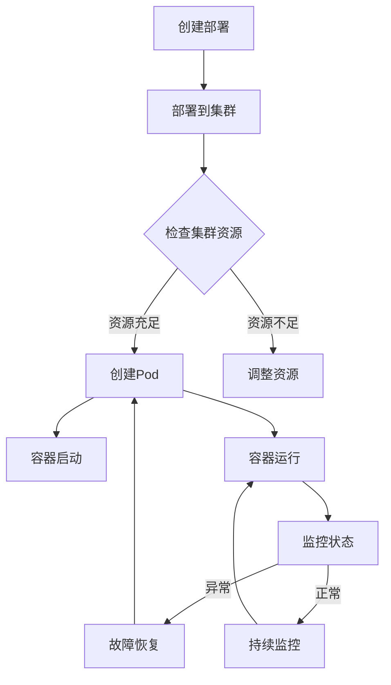
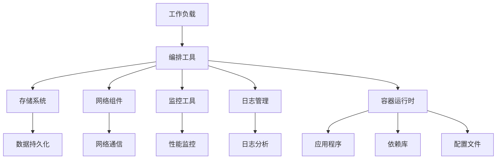
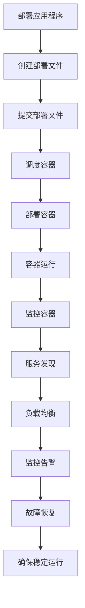

                 


### 1. 容器技术的发展背景

容器技术的概念最早可以追溯到20世纪90年代，当时Linux容器（LXC）开始出现，作为一种轻量级的虚拟化技术，它通过操作系统的命名空间（Namespace）和内核控制组（Cgroup）机制，实现了资源的隔离和限制。然而，容器技术的真正爆发是在2008年，Docker的诞生标志着现代容器技术的发展进入了新纪元。

#### 容器技术的起源与发展

Docker的出现解决了应用程序在不同环境中运行的一致性问题。Docker通过将应用程序及其依赖环境封装在一个独立的容器中，使得应用程序可以在任何支持Docker的操作系统上无缝运行，极大地提高了开发、测试和部署的效率。Docker的流行促使了容器编排技术的发展，例如Kubernetes（K8s）等工具的出现，为大规模容器管理提供了强大的支持。

在Docker之后，容器技术迅速发展，各种容器运行时如runc、containerd等相继出现，为容器生态的多样性提供了保障。此外，容器镜像技术如Docker镜像、oci镜像等，也成为了容器生态系统的重要组成部分。

#### 容器技术对软件开发与运维的影响

容器技术的引入对软件开发和运维领域产生了深远的影响。首先，容器化使得开发人员能够将应用程序与其运行环境打包在一起，从而避免了“环境不一致”的问题，提高了开发效率。其次，容器编排技术使得运维人员能够更高效地管理和调度容器，确保应用程序的稳定运行。

具体来说，容器技术对软件开发和运维的影响主要体现在以下几个方面：

- **环境一致性**：容器封装了应用程序及其运行环境，确保了应用程序在不同开发、测试和部署环境中的运行一致性，降低了环境差异带来的问题。
- **可移植性**：容器具有良好的可移植性，可以在不同的操作系统和硬件平台上运行，极大地提高了应用程序的可用性和灵活性。
- **资源利用率**：容器采用操作系统级别的虚拟化技术，相较于传统的虚拟机，具有更低的资源占用和更高的资源利用率。
- **自动化部署**：容器编排工具如Kubernetes提供了强大的自动化部署和管理功能，简化了应用程序的部署、扩展和管理过程。

### 容器编排的重要性

容器编排是指在容器环境中，对容器进行自动化部署、管理和扩展的一系列技术。随着容器技术的普及，容器编排变得越来越重要。以下是容器编排的几个核心概念：

- **容器编排的定义**：容器编排是一种自动化管理容器的方法，包括容器的部署、扩展、更新和监控等。
- **容器编排的目标**：容器编排的目标是确保应用程序在容器环境中高效、稳定地运行，同时提高运维效率。
- **容器编排的任务**：容器编排的主要任务是容器的调度、资源分配、故障恢复、服务发现和负载均衡等。

容器编排的重要性体现在以下几个方面：

- **业务连续性**：通过容器编排，可以快速部署和扩展应用程序，确保业务的连续性和稳定性。
- **资源利用率**：容器编排能够根据业务需求动态调整资源分配，最大化资源利用率，降低运营成本。
- **开发效率**：容器编排简化了应用程序的部署和管理流程，提高了开发效率。
- **扩展性**：容器编排支持水平扩展，可以轻松应对业务增长带来的负载压力。

#### 容器编排对业务连续性、资源利用率和开发效率的影响

- **业务连续性**：容器编排通过自动化部署和扩展，可以快速响应业务需求变化，确保服务的持续可用。例如，在电商高峰期，容器编排可以根据流量情况动态扩展服务器资源，确保系统稳定运行。

- **资源利用率**：容器编排通过精细化的资源管理和调度策略，最大化了资源的利用率。容器可以共享宿主机的操作系统内核，相比于虚拟机具有更低的资源开销。此外，容器编排可以根据负载情况动态调整资源分配，避免了资源浪费。

- **开发效率**：容器编排简化了应用程序的部署和管理流程，使得开发人员可以专注于业务逻辑的实现，而无需担心环境配置和部署问题。容器编排工具如Kubernetes提供了丰富的自动化功能，例如自动化部署、自动化扩展和自动化恢复等，大大提高了开发效率。

### LLM在容器编排中的应用现状与挑战

自然语言处理（NLP）技术在近年来取得了显著的进展，大规模语言模型（LLM）如GPT-3、BERT等在文本生成、机器翻译、问答系统等领域表现出色。LLM在容器编排中的应用场景主要包括模型训练、推理部署和自动化运维等。

#### LLM在容器编排中的应用案例

1. **模型训练**：容器编排技术可以帮助分布式训练大规模的LLM模型。通过容器编排，可以灵活地调整训练任务的资源分配，实现高效的模型训练。
   
2. **推理部署**：容器编排技术可以快速部署和扩展LLM推理服务，满足不同场景下的推理需求。例如，在实时问答系统中，容器编排可以根据流量动态调整服务器的数量和资源，确保系统的高效运行。

3. **自动化运维**：容器编排工具可以自动化管理LLM模型的部署、扩展和监控，提高运维效率。例如，通过Kubernetes，可以自动化处理LLM模型的故障恢复和负载均衡。

#### LLM应用部署中遇到的问题与解决方案

尽管LLM在容器编排中具有广泛的应用前景，但在实际部署过程中仍面临一些挑战：

1. **资源需求大**：大规模的LLM模型对计算和存储资源有很高的要求。容器编排需要合理分配资源，确保模型训练和推理的顺利进行。

2. **模型更新频繁**：LLM模型需要不断更新以适应新的数据和应用场景。容器编排需要支持快速部署和更新模型，同时保证系统的稳定性和一致性。

3. **安全性**：容器编排涉及到大量的数据传输和存储，需要确保系统的安全性。需要采取有效的安全策略，防止数据泄露和恶意攻击。

4. **运维复杂性**：容器编排涉及到多个组件和工具，运维人员需要具备一定的技术能力和经验，以确保系统的稳定运行。

针对上述问题，可以采取以下解决方案：

1. **资源优化**：通过使用高效的计算和存储设备，优化容器编排的资源管理策略，确保模型训练和推理的顺利进行。

2. **自动化更新**：采用自动化工具和脚本，实现模型的快速更新和部署，减少人工干预。

3. **安全防护**：采取多层次的安全策略，包括网络隔离、访问控制和数据加密等，确保系统的安全性。

4. **运维培训**：加强对运维人员的培训，提高其技术能力和经验，确保系统的稳定运行。

### 总结

容器编排技术在LLM应用部署中具有重要作用，可以提高模型训练和推理的效率，优化资源利用，确保系统的稳定性和安全性。然而，在实际部署过程中仍面临一些挑战，需要采取有效的解决方案。未来，随着容器技术和LLM技术的不断发展，容器编排将在LLM应用部署中发挥更大的作用。

### 2.1 容器与容器化

容器是一种轻量级的虚拟化技术，它将应用程序及其依赖环境封装在一个独立的运行时环境中。容器与传统的虚拟机（VM）相比，具有更高的性能和更低的资源开销。下面我们将详细探讨容器的定义、特点和工作原理。

#### 容器的定义

容器是一种轻量级的、可移植的、自给自足的运行时环境，它包含应用程序、其依赖库和配置文件。容器通过操作系统的命名空间（Namespace）和内核控制组（Cgroup）机制，实现了资源的隔离和限制。

#### 容器的特点

- **轻量级**：容器直接运行在宿主机的操作系统上，不需要额外的虚拟化层，因此具有更低的资源开销和更高的性能。
- **可移植性**：容器可以轻松地在不同的操作系统和硬件平台上运行，确保了应用程序的一致性和可移植性。
- **隔离性**：容器通过命名空间和Cgroup实现了进程和资源的隔离，确保了容器间的独立运行。
- **自给自足**：容器封装了应用程序及其依赖环境，确保了应用程序在不同环境中的运行一致性。

#### 容器的工作原理

容器的工作原理主要包括命名空间（Namespace）和内核控制组（Cgroup）两个核心概念。

- **命名空间（Namespace）**：命名空间是一种用于隔离进程的机制，它将系统资源（如文件系统、网络接口、进程等）划分到不同的命名空间中。每个命名空间内的进程只能访问到该命名空间内的资源，从而实现了进程间的隔离。

- **内核控制组（Cgroup）**：内核控制组是一种用于资源管理的机制，它可以将系统资源（如CPU、内存、磁盘等）分配给不同的控制组。每个控制组可以设置资源的限制和优先级，从而实现了进程间的资源隔离和限制。

通过命名空间和内核控制组，容器实现了进程和资源的隔离，从而保证了容器的高性能和轻量级特点。

#### 容器化的优势与挑战

容器化技术带来了许多优势，但也伴随着一些挑战。

**优势**：

- **高效开发与部署**：容器封装了应用程序及其依赖环境，使得开发人员可以专注于业务逻辑的实现，而无需担心环境配置和部署问题。
- **环境一致性**：容器在开发、测试和部署环境中具有一致性，避免了环境差异带来的问题。
- **资源利用率**：容器采用操作系统级别的虚拟化技术，相比于传统的虚拟机，具有更低的资源开销和更高的资源利用率。
- **灵活扩展**：容器编排技术如Kubernetes提供了强大的自动化部署和管理功能，可以灵活地扩展容器数量和资源。

**挑战**：

- **安全性**：容器与宿主机操作系统共享内核，存在一定的安全风险。
- **运维复杂度**：容器编排涉及到多个组件和工具，对运维人员的技术能力和经验要求较高。
- **资源分配**：容器资源分配和调度的策略需要根据业务需求进行优化，以确保资源的高效利用。

#### 容器与虚拟化的区别与联系

容器和虚拟化都是用于资源隔离和管理的技术，但它们之间也存在一些区别。

- **资源隔离层次**：容器是在操作系统层面实现资源隔离，而虚拟化是在硬件层面实现资源隔离。
- **资源开销**：容器具有更低的资源开销和更高的性能，而虚拟化则具有更高的资源开销和更复杂的架构。
- **可移植性**：容器具有更高的可移植性，可以在不同的操作系统和硬件平台上运行，而虚拟化则通常依赖于特定的硬件和操作系统。

尽管容器和虚拟化有区别，但它们在资源管理和隔离方面有相似之处，可以相互补充，共同构建一个高效、可靠的计算环境。

### 总结

容器是一种轻量级的虚拟化技术，它通过命名空间和内核控制组实现了进程和资源的隔离。容器化技术带来了高效开发、环境一致性和资源利用率等优势，但也存在一些挑战。了解容器的工作原理和特点，有助于更好地利用容器技术，提升软件开发和运维的效率。

### 2.2 容器编排基本概念

容器编排是指在容器环境中，对容器进行自动化部署、管理和扩展的一系列技术。容器编排的目标是确保应用程序在容器环境中高效、稳定地运行，同时提高运维效率。下面，我们将详细探讨容器编排的定义、目标、任务和核心组件。

#### 容器编排的定义

容器编排是一种自动化管理容器的方法，它通过调度、部署、扩展和监控等操作，确保应用程序在容器环境中高效、稳定地运行。

#### 容器编排的目标

容器编排的主要目标包括：

- **业务连续性**：确保应用程序的持续可用，满足业务需求。
- **资源利用率**：通过智能的资源分配和调度策略，最大化资源利用率，降低运营成本。
- **开发效率**：简化应用程序的部署和管理流程，提高开发效率。
- **可扩展性**：支持水平扩展，轻松应对业务增长带来的负载压力。

#### 容器编排的任务

容器编排的主要任务包括：

- **容器的调度**：根据业务需求和资源状况，选择合适的节点部署容器。
- **容器的部署**：自动化部署应用程序和依赖环境，确保应用程序的顺利运行。
- **容器的扩展**：根据负载情况，动态调整容器数量和资源，确保系统的高效运行。
- **容器的监控**：实时监控容器的运行状态，及时发现并处理故障。
- **容器的更新**：自动化更新应用程序和依赖环境，确保系统的稳定性和一致性。

#### 容器编排的核心组件

容器编排通常涉及多个核心组件，主要包括：

- **编排工具**：如Kubernetes、Docker Swarm等，用于自动化管理和调度容器。
- **存储系统**：如NFS、GlusterFS等，用于存储容器数据。
- **网络组件**：如Calico、Flannel等，用于容器间的通信和网络管理。
- **监控工具**：如Prometheus、Grafana等，用于实时监控容器的运行状态。
- **日志管理**：如ELK（Elasticsearch、Logstash、Kibana）等，用于收集、存储和分析容器日志。

通过这些核心组件的协同工作，容器编排可以实现高效、稳定的应用程序部署和管理。

### 容器编排的核心组件与工作流程

容器编排的核心组件包括Kubernetes集群、节点、Pod、容器、部署（Deployment）、服务（Service）等。下面，我们将通过一个Mermaid流程图，详细描述容器编排的工作流程。



在这个流程图中：

- **A 创建部署**：开发人员创建一个部署对象，定义应用程序的运行参数和资源需求。
- **B 部署到集群**：部署对象被提交到Kubernetes集群，由编排工具进行调度和管理。
- **C 检查集群资源**：编排工具检查集群中的资源状况，以确定是否能够部署新的Pod。
- **D 创建Pod**：如果资源充足，编排工具创建一个新的Pod，该Pod包含一个或多个容器。
- **E 调整资源**：如果资源不足，编排工具会通知运维人员调整集群资源。
- **F 容器启动**：Pod中的容器被启动，开始执行应用程序。
- **G 容器运行**：容器运行应用程序，处理业务请求。
- **H 监控状态**：监控工具实时监控容器的运行状态，包括CPU使用率、内存使用率、网络流量等。
- **I 故障恢复**：如果容器发生异常，编排工具会自动执行故障恢复策略，例如重启容器或重新部署Pod。
- **J 持续监控**：监控工具持续监控容器的运行状态，确保系统的稳定性和高效性。

通过这个流程图，我们可以清晰地了解容器编排的工作原理和核心组件之间的关系。

### 容器编排的核心组件与联系

容器编排涉及多个核心组件，它们之间紧密联系，共同确保应用程序在容器环境中的高效、稳定运行。下面，我们将通过一个Mermaid流程图，详细描述这些核心组件之间的联系。



在这个流程图中：

- **A 工作负载**：应用程序的运行任务，例如Web服务、数据库等。
- **B 排序工具**：如Kubernetes，负责调度、部署和管理容器。
- **C 存储系统**：如NFS、GlusterFS，用于存储容器数据，实现数据持久化。
- **D 网络组件**：如Calico、Flannel，用于容器间的网络通信。
- **E 监控工具**：如Prometheus、Grafana，用于实时监控容器的性能和状态。
- **F 日志管理**：如ELK（Elasticsearch、Logstash、Kibana），用于收集、存储和分析容器日志。
- **G 容器运行时**：如Docker、containerd，负责运行应用程序的容器。
- **H 数据持久化**：存储系统将容器数据保存到持久化存储中，确保数据不会因为容器停止而丢失。
- **I 网络通信**：网络组件确保容器间的数据交换和通信，实现分布式系统的协同工作。
- **J 性能监控**：监控工具实时收集容器的性能指标，如CPU使用率、内存使用率等，帮助运维人员优化资源使用。
- **K 日志分析**：日志管理工具对容器日志进行分析，帮助诊断问题和优化系统。
- **L 应用程序**：容器中运行的具体应用程序。
- **M 依赖库**：应用程序的依赖库，用于实现特定的功能。
- **N 配置文件**：应用程序的配置文件，用于调整运行参数。

通过这个流程图，我们可以清晰地了解容器编排的核心组件及其之间的联系，从而更好地理解容器编排的工作原理。

### 2.3 LLM的基本概念与架构

大规模语言模型（LLM）是一种基于深度学习的自然语言处理技术，它可以自动学习并生成人类语言。LLM在文本生成、机器翻译、问答系统等领域表现出色。下面，我们将详细探讨LLM的定义、发展历程和应用场景。

#### LLM的定义

LLM是一种基于神经网络的语言模型，它可以自动学习并生成人类语言。LLM通过大量的文本数据训练，学会预测下一个单词、句子或段落，从而实现文本的生成和转换。

#### LLM的发展历程

LLM的发展历程可以追溯到20世纪80年代，当时出现了基于规则的方法，如概率模型和语法分析器。然而，这些方法在处理大规模文本数据时效果有限。随着深度学习技术的发展，LLM逐渐取代了传统的语言模型，成为自然语言处理的主流方法。

2018年，OpenAI发布了GPT（Generative Pre-trained Transformer），这是一个基于Transformer架构的预训练语言模型。GPT的发布标志着LLM进入了一个新的时代，它通过大量的文本数据进行预训练，使得模型在多个自然语言处理任务中表现出了优越的性能。

#### LLM的核心架构

LLM的核心架构主要包括两个部分：预训练和微调。

1. **预训练**：预训练是指使用大量的文本数据对模型进行训练，使模型学会语言的基本规律和特征。预训练过程通常采用无监督学习方法，如自回归语言模型和 masked language model（MLM）。

2. **微调**：微调是指使用特定任务的数据对预训练模型进行微调，使其适应特定的应用场景。微调过程通常采用有监督学习方法，如序列标注、分类等。

#### LLM的关键技术

LLM的关键技术包括：

1. **Transformer架构**：Transformer是一种基于注意力机制的序列模型，它在处理长文本和长距离依赖方面具有优势。

2. **预训练技术**：预训练技术通过在大量文本数据上训练模型，使模型学会语言的基本规律和特征。

3. **微调技术**：微调技术通过在特定任务的数据上训练模型，使模型适应特定的应用场景。

4. **语言模型评估指标**：常用的语言模型评估指标包括Perplexity（困惑度）、Token per second（每秒处理token数）等。

#### LLM的应用场景

LLM在多个自然语言处理任务中都有广泛的应用，以下是一些典型的应用场景：

1. **文本生成**：LLM可以用于自动生成文章、报告、邮件等文本内容。

2. **机器翻译**：LLM可以用于翻译不同语言之间的文本，实现跨语言的交流。

3. **问答系统**：LLM可以用于构建问答系统，回答用户提出的问题。

4. **对话系统**：LLM可以用于构建聊天机器人，实现人与机器的对话。

5. **文本分类**：LLM可以用于分类文本，如情感分析、新闻分类等。

#### LLM的优势与挑战

LLM的优势包括：

- **强大的语言理解能力**：LLM通过预训练技术，学会了对语言的基本理解和生成。
- **广泛的应用场景**：LLM可以应用于多个自然语言处理任务，如文本生成、机器翻译、问答系统等。
- **高效的计算性能**：LLM采用深度学习技术，可以在较低的计算资源下实现高效的模型训练和推理。

LLM的挑战包括：

- **数据需求大**：LLM需要大量的文本数据进行预训练，对数据存储和处理有较高的要求。
- **模型复杂度高**：LLM的模型参数数量庞大，对计算资源有较高的要求。
- **解释性差**：LLM的生成结果较为复杂，难以解释模型的决策过程。

### 总结

大规模语言模型（LLM）是一种基于深度学习的自然语言处理技术，它在文本生成、机器翻译、问答系统等领域表现出色。LLM的核心架构包括预训练和微调，采用Transformer等先进技术。LLM的优势在于强大的语言理解能力和广泛的应用场景，但同时也面临数据需求大、模型复杂度高和解释性差等挑战。了解LLM的基本概念和架构，有助于更好地应用和优化LLM技术。

### 2.4 容器编排与LLM的联系

容器编排技术为大规模语言模型（LLM）的应用部署提供了重要的支持，使得LLM能够在分布式环境中高效、稳定地运行。下面，我们将详细探讨容器编排技术在LLM应用部署中的作用，以及容器编排对LLM性能优化的影响。

#### 容器编排技术在LLM应用部署中的作用

容器编排技术在LLM应用部署中发挥着关键作用，主要体现在以下几个方面：

1. **部署灵活性**：容器编排工具如Kubernetes能够自动化部署LLM模型，确保模型在不同环境中的部署一致性。开发人员只需编写部署脚本，容器编排工具即可根据脚本自动化部署模型，减少了手动操作的复杂度。

2. **扩展性**：容器编排技术支持水平扩展，可以根据实际负载情况动态调整LLM模型的部署数量和资源。例如，当用户请求量增加时，容器编排工具可以自动增加容器实例，确保系统的高可用性和响应速度。

3. **资源利用率**：容器编排通过资源调度和优化，可以充分利用服务器资源。LLM模型通常需要大量的计算和存储资源，容器编排工具可以根据模型的资源需求动态分配资源，避免资源浪费。

4. **故障恢复**：容器编排工具能够监控LLM容器的运行状态，并在容器出现故障时自动进行重启或重新部署，确保系统的稳定性和连续性。

5. **安全性**：容器编排技术提供了丰富的安全特性，如网络隔离、访问控制和权限管理，可以确保LLM模型的数据安全。

#### 容器编排对LLM性能优化的影响

容器编排技术不仅支持LLM的部署和管理，还对LLM的性能优化产生了深远影响。以下是容器编排对LLM性能优化的一些关键影响：

1. **资源调度**：容器编排工具能够根据模型的需求动态调整资源分配，如CPU、内存和网络带宽等。通过合理的资源调度策略，可以最大化LLM模型的性能表现。

2. **负载均衡**：容器编排工具能够实现负载均衡，将用户请求均衡分配到不同的容器实例上，避免单点过载。负载均衡机制有助于提高系统的整体性能和响应速度。

3. **容器隔离**：容器编排通过命名空间和Cgroup实现容器间的资源隔离，确保一个容器的故障不会影响其他容器的运行。容器隔离机制有助于提高系统的稳定性和可靠性。

4. **自动扩展**：容器编排工具能够根据实际负载情况自动扩展容器实例，避免系统在高峰期出现性能瓶颈。自动扩展机制有助于提高系统的弹性和响应能力。

5. **监控与告警**：容器编排工具提供了实时监控和告警功能，可以及时发现和处理系统性能问题。通过监控工具，开发人员可以了解LLM模型的运行状态，优化系统配置，提高性能。

#### 容器编排与LLM的性能优化策略

为了最大化容器编排对LLM性能优化的效果，可以采取以下策略：

1. **资源池化**：将计算资源、存储资源和网络资源整合成一个资源池，根据实际需求动态分配。资源池化可以避免资源浪费，提高资源利用率。

2. **负载均衡策略**：采用合适的负载均衡策略，如轮询、最小连接数、源IP等，确保用户请求的均衡分配。通过合理的负载均衡策略，可以提高系统的整体性能和响应速度。

3. **容器优化**：优化容器的配置和运行环境，如调整CPU和内存限制、网络带宽设置等。通过优化容器的配置，可以最大化LLM模型的性能表现。

4. **分布式训练**：利用容器编排技术实现LLM模型的分布式训练，通过多节点并行计算提高训练效率。分布式训练可以显著缩短模型训练时间，提高训练性能。

5. **自动化监控与告警**：建立完善的监控和告警系统，实时监控LLM模型的运行状态，及时发现和处理性能问题。通过自动化监控与告警，可以确保系统的高可用性和稳定性。

#### 容器编排与LLM性能优化案例

以下是一个容器编排与LLM性能优化的实际案例：

1. **场景描述**：某企业开发了一个基于GPT-3的问答系统，用于为企业客户提供24/7智能客服服务。系统需要在短时间内处理大量用户请求，确保高效的性能和稳定的运行。

2. **解决方案**：
   - 使用Kubernetes作为容器编排工具，自动化部署和管理GPT-3模型容器。
   - 根据用户请求量动态调整容器实例数量，采用水平扩展策略。
   - 优化容器配置，如调整CPU和内存限制，确保模型在高负载情况下仍能高效运行。
   - 采用负载均衡策略，如轮询和最小连接数，将用户请求均衡分配到不同容器实例上。
   - 建立监控和告警系统，实时监控模型的运行状态，及时发现和处理性能问题。

3. **效果评估**：
   - 通过容器编排技术，实现了问答系统的自动化部署和管理，降低了运维成本。
   - 在高峰期，通过水平扩展策略，成功处理了大量用户请求，确保了系统的响应速度和稳定性。
   - 通过优化容器配置和负载均衡策略，提高了系统整体性能和响应速度，提高了客户满意度。

#### 总结

容器编排技术在LLM应用部署中具有重要作用，可以提升模型部署的灵活性、扩展性和资源利用率。同时，容器编排对LLM性能优化产生了积极影响，通过合理的资源调度、负载均衡、容器优化和自动化监控，可以显著提高系统的整体性能和响应速度。了解容器编排与LLM的联系，有助于开发人员和运维人员更好地优化LLM性能，为企业带来更大的价值。

### 3.1 容器编排原理

容器编排是管理和自动化容器应用程序的过程，它确保了容器化的应用程序在分布式环境中能够高效、稳定地运行。为了深入理解容器编排，我们需要从基础概念、核心架构以及容器编排的工作流程三个方面进行探讨。

#### 基础概念

容器编排涉及到一系列的基础概念，包括但不限于：

- **容器**：一个轻量级的运行时环境，包含应用程序及其依赖项。
- **编排工具**：如Kubernetes、Docker Swarm等，用于自动化管理和调度容器。
- **集群**：由多个节点组成的计算资源集合，每个节点运行一个或多个容器。
- **Pod**：Kubernetes中的最小部署单位，通常包含一个或多个容器。
- **部署（Deployment）**：用于管理Pod集合，确保应用的健康状态和可用性。
- **服务（Service）**：用于暴露Pod集合，提供稳定的网络访问。
- **控制器**：如ReplicaSet、StatefulSet等，用于管理Pod的生命周期。
- **资源管理**：通过资源请求和限制，确保容器获得必要的计算和存储资源。

#### 核心架构

容器编排的核心架构通常包括以下几个组件：

- **节点（Node）**：集群中的计算资源单元，运行容器和Kubernetes的组件。
- **控制平面（Control Plane）**：包括API服务器、调度器、控制器管理器等，负责集群的总体管理和控制。
- **数据平面（Data Plane）**：包括Pod、容器和网络等，负责应用程序的实际运行和数据传输。

控制平面负责处理集群的配置、监控和资源分配，而数据平面则负责容器的实际运行和任务执行。

#### 容器编排的工作流程

容器编排的工作流程包括以下几个关键步骤：

1. **部署应用程序**：
   - 开发人员定义应用程序的部署文件（如YAML文件），包含容器的配置、资源需求和依赖项。
   - 容器编排工具（如Kubernetes）根据部署文件创建并管理Pod和容器。

2. **资源调度**：
   - 容器编排工具评估集群中节点的资源状况，选择合适的节点部署容器。
   - 通过资源请求和限制，确保容器获得必要的计算和存储资源。

3. **容器运行**：
   - 容器在选定的节点上启动并运行应用程序。
   - 容器编排工具监控容器的运行状态，确保应用程序的高可用性。

4. **服务发现与负载均衡**：
   - 服务（Service）组件为Pod集合提供稳定的网络访问。
   - 负载均衡策略（如轮询、最少连接数等）确保用户请求均衡分配到不同容器实例上。

5. **监控与告警**：
   - 监控工具（如Prometheus）实时收集容器的性能指标，如CPU使用率、内存使用率等。
   - 告警系统（如Alertmanager）在性能指标超出阈值时发送告警，通知运维人员。

6. **故障恢复**：
   - 当容器出现故障时，容器编排工具会根据预设策略进行故障恢复，如重启容器、重新部署Pod等。
   - 控制器（如ReplicaSet）确保应用程序的副本数量符合期望状态。

通过上述工作流程，容器编排工具能够自动化管理容器应用程序的整个生命周期，从部署、调度到监控和故障恢复，确保系统的稳定性和高效性。

### 容器编排原理的Mermaid流程图

为了更直观地理解容器编排原理，我们可以使用Mermaid绘制一个流程图，如下所示：



在这个流程图中：

- **A 部署应用程序**：开发人员准备部署应用程序。
- **B 创建部署文件**：开发人员编写YAML文件，定义应用程序的配置和依赖项。
- **C 提交部署文件**：部署文件提交到容器编排工具（如Kubernetes）。
- **D 调度容器**：容器编排工具评估集群资源，选择节点部署容器。
- **E 部署容器**：容器在选定节点上启动并运行。
- **F 容器运行**：容器运行应用程序，处理用户请求。
- **G 监控容器**：监控工具实时监控容器的运行状态。
- **H 服务发现**：服务组件确保容器可以被网络访问。
- **I 负载均衡**：负载均衡策略确保用户请求均衡分配。
- **J 监控告警**：监控工具在性能指标异常时发送告警。
- **K 故障恢复**：容器出现故障时，进行故障恢复操作。
- **L 确保稳定运行**：通过监控和故障恢复，确保系统的稳定性和高效性。

通过这个流程图，我们可以清晰地了解容器编排的原理和关键步骤，有助于更好地理解和应用容器编排技术。

### 3.2 容器编排工具介绍

在容器编排领域，Kubernetes（简称K8s）是最为流行和广泛使用的工具之一，它由Google设计并捐赠给Cloud Native Computing Foundation（CNCF）进行维护。Kubernetes为容器化的应用程序提供了一套强大的自动化管理功能，包括部署、扩展、更新和监控等。下面我们将详细介绍Kubernetes的架构、组件、工作流程以及与Docker的对比。

#### Kubernetes的架构

Kubernetes集群由以下几个核心组件构成：

1. **控制平面（Control Plane）**：包括API服务器（API Server）、调度器（Scheduler）和控制器管理器（Controller Manager）。
   - **API服务器**：Kubernetes的API入口点，提供操作集群资源的接口。
   - **调度器**：负责将Pod分配到集群中的节点。
   - **控制器管理器**：运行多个控制器，如复制控制器（Replication Controller）、端点控制器（Endpoint Controller）和命名空间控制器（Namespace Controller）等，负责维护集群状态。

2. **工作节点（Worker Nodes）**：包括节点（Node）、容器运行时（Container Runtime）和Kubelet。
   - **节点**：运行Pod的物理或虚拟机。
   - **容器运行时**：如Docker或containerd，负责运行容器。
   - **Kubelet**：在每个节点上运行的代理，负责与API服务器通信，确保Pod的运行状态符合预期。

3. **Pod**：Kubernetes中的最小部署单元，包含一个或多个容器，共享网络命名空间和卷。

4. **服务（Service）**：提供稳定的网络访问，将流量路由到Pod集合。

5. **存储**：提供持久化存储，用于保存应用程序数据。

#### Kubernetes的工作流程

Kubernetes的工作流程通常包括以下几个步骤：

1. **创建部署文件**：开发人员编写YAML文件，定义应用程序的部署参数，如容器镜像、环境变量、资源请求和限制等。

2. **提交部署文件**：部署文件提交到Kubernetes集群的API服务器。

3. **调度器调度**：调度器根据节点的资源状况、调度策略和约束条件，选择合适的节点部署Pod。

4. **Kubelet部署容器**：Kubelet在每个节点上下载并启动容器。

5. **监控和更新**：Kubernetes持续监控容器的运行状态，并在容器发生故障时自动进行重启或重新部署。

6. **服务发现和负载均衡**：服务组件确保Pod集合可以稳定地接收外部流量，负载均衡策略确保流量均衡分配。

#### Kubernetes与Docker的对比

Docker是一个用于容器化的平台，它提供了容器镜像创建和管理工具。Kubernetes是一个用于容器编排的工具，它基于Docker容器实现了更高层次的自动化管理。以下是Kubernetes与Docker的几个关键对比点：

- **功能**：Docker主要用于容器镜像的创建和运行，而Kubernetes则提供了更全面的容器编排功能，如部署、扩展、更新和监控。
- **抽象层**：Docker运行在操作系统层面，提供了轻量级的容器化解决方案。Kubernetes则运行在Docker之上，提供了一个更高层次的抽象层，用于管理和调度容器。
- **资源管理**：Docker允许开发人员直接运行容器，而Kubernetes则提供了更加灵活的资源管理策略，如资源请求和限制、自动扩展和负载均衡。
- **生态系统**：Kubernetes拥有一个庞大的生态系统，包括各种插件和工具，如Prometheus、Grafana、Helm等，而Docker则主要依赖于其社区和第三方工具。
- **部署规模**：Docker适用于单机部署和小规模集群，而Kubernetes则专为大规模分布式系统设计，支持数千个节点的集群管理。

#### Kubernetes的优势和挑战

**优势**：

- **高度自动化**：Kubernetes提供了自动化部署、扩展和更新功能，大大简化了运维工作。
- **资源优化**：通过资源请求和限制，Kubernetes可以确保容器获得必要的计算和存储资源，提高资源利用率。
- **高可用性**：Kubernetes支持故障检测和自动恢复，确保应用程序的持续可用性。
- **可扩展性**：Kubernetes支持水平扩展，可以轻松应对业务增长带来的负载压力。

**挑战**：

- **学习曲线**：Kubernetes的学习曲线较陡峭，需要掌握一定的技术知识和实践经验。
- **配置复杂性**：Kubernetes配置文件较为复杂，需要仔细管理才能确保系统稳定运行。
- **安全风险**：容器与宿主机操作系统共享内核，存在一定的安全风险。
- **运维负担**：虽然Kubernetes提供了自动化功能，但运维人员仍需具备一定的技术能力和经验，以确保系统的稳定运行。

#### Kubernetes的实际部署和使用案例

以下是一些实际部署和使用Kubernetes的案例：

- **金融行业**：许多金融机构采用Kubernetes进行应用程序的部署和管理，如银行、保险和投资公司等。
- **电子商务**：电子商务平台使用Kubernetes实现大规模分布式系统的管理，如订单处理、库存管理和用户访问等。
- **社交媒体**：社交媒体平台使用Kubernetes处理海量用户请求，如Facebook、Twitter和LinkedIn等。
- **游戏行业**：游戏公司使用Kubernetes部署和管理游戏服务器，如Steam、Epic Games和Blizzard等。

通过上述案例，我们可以看到Kubernetes在各个行业的广泛应用，它为容器化的应用程序提供了强大的管理和调度功能，帮助企业实现高效、稳定和可扩展的系统部署。

### 3.3 LLM应用部署流程

大规模语言模型（LLM）的部署是一个复杂的过程，需要考虑模型训练、容器化、部署、扩展和监控等多个方面。下面，我们将详细描述LLM应用部署的流程，并探讨其在容器环境下的实现方法。

#### 模型训练

模型训练是LLM应用部署的第一步，通常包括以下过程：

1. **数据收集**：收集大量相关的文本数据，如新闻文章、书籍、网页内容等。数据质量对模型性能有重要影响，因此需要确保数据的质量和多样性。

2. **数据预处理**：对收集到的文本数据进行清洗和预处理，如去除无关信息、标点符号、停用词等。此外，还需要对文本进行编码，将文本转换为模型可处理的数字形式。

3. **模型选择与训练**：根据应用场景选择合适的LLM模型，如GPT-3、BERT等。使用训练数据对模型进行训练，调整模型的参数以优化性能。

4. **模型评估**：在验证集上评估模型的性能，如准确率、召回率、F1分数等。根据评估结果调整模型参数，以达到更好的性能。

5. **模型优化**：通过调参和模型结构优化，进一步提高模型性能。优化过程可能涉及迁移学习、模型压缩、加速训练等。

#### 容器化

容器化是将应用程序及其依赖环境封装在一个独立的容器中的过程，以便于部署和管理。以下是LLM容器化的步骤：

1. **编写Dockerfile**：创建一个Dockerfile，定义容器镜像的构建过程。Dockerfile包括基础镜像、依赖库、环境变量和命令等。

2. **构建容器镜像**：使用Docker CLI或CI/CD工具（如Jenkins、GitLab CI等）构建容器镜像。构建过程中会下载基础镜像、安装依赖库和运行命令等。

3. **容器镜像仓库**：将构建好的容器镜像推送到容器镜像仓库（如Docker Hub、Harbor等），以便后续部署和分发。

4. **容器运行时**：在容器运行时（如Docker、containerd等）中运行容器镜像，启动LLM应用程序。

#### 部署

在容器环境下，LLM应用部署通常涉及以下几个步骤：

1. **定义部署文件**：编写Kubernetes部署文件（如YAML文件），定义应用程序的部署参数，如容器镜像、容器名称、容器端口、环境变量等。

2. **部署应用程序**：将部署文件提交到Kubernetes集群，由Kubernetes API服务器解析和调度部署。

3. **容器运行**：Kubernetes调度器选择合适的节点部署Pod，容器运行时启动容器并运行应用程序。

4. **服务发现和负载均衡**：使用Kubernetes Service组件为Pod集合提供稳定的网络访问，负载均衡策略（如轮询、最小连接数等）确保流量均衡分配。

#### 扩展

容器环境下的应用程序可以轻松实现水平扩展，以满足不断增长的负载需求。以下是LLM应用扩展的步骤：

1. **定义副本数**：在Kubernetes部署文件中定义应用程序的副本数，确保应用程序具备足够的处理能力。

2. **水平扩展**：当负载增加时，Kubernetes自动扩展应用程序的副本数，增加容器实例。

3. **资源调整**：根据实际负载情况，动态调整容器的资源请求和限制，确保应用程序在高负载下仍能高效运行。

#### 监控

监控是确保LLM应用程序稳定运行的重要环节。以下是容器环境下监控的步骤：

1. **监控工具**：使用Kubernetes支持的监控工具（如Prometheus、Grafana等），收集容器的性能指标（如CPU使用率、内存使用率、网络流量等）。

2. **告警配置**：配置告警规则，当监控指标超过阈值时，触发告警通知运维人员。

3. **日志收集**：使用Kubernetes支持的日志管理工具（如ELK、Fluentd等），收集容器的日志信息，便于问题诊断和优化。

#### LLM应用部署示例

以下是一个简单的LLM应用部署示例，使用Docker和Kubernetes进行容器化部署：

1. **编写Dockerfile**：

```dockerfile
FROM python:3.8-slim

WORKDIR /app

COPY requirements.txt .

RUN pip install -r requirements.txt

COPY . .

CMD ["python", "app.py"]
```

2. **构建容器镜像**：

```bash
docker build -t llm-app .
```

3. **推送容器镜像**：

```bash
docker push llm-app
```

4. **编写Kubernetes部署文件**：

```yaml
apiVersion: apps/v1
kind: Deployment
metadata:
  name: llm-deployment
spec:
  replicas: 3
  selector:
    matchLabels:
      app: llm
  template:
    metadata:
      labels:
        app: llm
    spec:
      containers:
      - name: llm
        image: llm-app
        ports:
        - containerPort: 8080
```

5. **部署应用程序**：

```bash
kubectl apply -f deployment.yaml
```

6. **查看部署状态**：

```bash
kubectl get pods
```

通过上述步骤，我们可以将LLM应用程序部署到Kubernetes集群中，并实现容器化部署和管理。

### LLM在容器编排中的应用实例

以下是一个实际的LLM应用部署实例，介绍如何使用容器编排技术进行大规模语言模型的部署和管理：

1. **需求分析**：

某企业开发了一个基于GPT-3的智能客服系统，需要部署多个实例以处理不同区域的用户请求。系统需要具备高可用性、可扩展性和高性能。

2. **解决方案**：

- **容器化**：使用Docker将GPT-3模型和应用程序容器化，确保在不同环境中的部署一致性。
- **Kubernetes部署**：使用Kubernetes进行应用程序的部署和管理，实现自动化部署、水平扩展和故障恢复。
- **负载均衡**：使用Kubernetes Service和Ingress进行负载均衡，确保用户请求均衡分配到不同实例上。
- **监控与告警**：使用Prometheus和Grafana进行实时监控和告警，确保系统的高可用性和性能。

3. **具体步骤**：

- **编写Dockerfile**：定义GPT-3模型的容器镜像，包括基础镜像、依赖库和运行命令等。

- **构建容器镜像**：使用Docker CLI或CI/CD工具构建容器镜像，并将其推送到容器镜像仓库。

- **编写Kubernetes部署文件**：定义应用程序的部署参数，如容器镜像、容器名称、容器端口、副本数等。

- **部署应用程序**：使用kubectl命令将部署文件提交到Kubernetes集群，Kubernetes自动调度并部署应用程序。

- **水平扩展**：根据实际负载情况，动态调整应用程序的副本数，确保系统具备足够的处理能力。

- **监控与告警**：配置Prometheus和Grafana，实时监控系统的性能指标，并在指标异常时发送告警。

4. **效果评估**：

通过上述步骤，企业成功部署了一个基于GPT-3的智能客服系统，实现了高可用性、可扩展性和高性能。系统在高峰期能够处理大量用户请求，确保了用户体验和业务连续性。

### 总结

大规模语言模型（LLM）在容器环境下的部署涉及模型训练、容器化和容器编排等多个环节。通过合理的容器编排技术，可以确保LLM应用程序的高效、稳定和可扩展运行。在实际部署过程中，需要根据具体需求选择合适的模型、容器化和编排工具，并关注监控和告警机制，确保系统的稳定性和性能。了解LLM应用部署流程和容器编排原理，有助于开发人员和运维人员更好地优化和部署LLM应用程序。

### 3.4 容器编排中的资源管理

容器编排中的资源管理是确保容器化应用程序高效、稳定运行的关键环节。资源管理涉及对CPU、内存、存储和网络等资源的分配、调度和优化。以下是容器编排中资源管理的详细探讨，包括资源分配与调度策略、资源隔离与共享技术，以及资源利用率的优化方法。

#### 资源分配与调度策略

资源分配是指根据容器化应用程序的需求，合理分配计算资源、存储资源、网络资源等。调度策略则是在集群中决定资源分配的具体实现方式。以下是常见的资源分配与调度策略：

1. **资源请求与限制**：
   - **资源请求（Resource Requests）**：容器启动时，指定所需资源的最小值，以确保容器在运行过程中获得足够的资源。
   - **资源限制（Resource Limits）**：容器启动时，指定资源使用的最大值，以防止容器占用过多资源，影响其他容器的运行。
   - **资源请求和限制的组合**：通过合理设置资源请求和限制，可以确保容器获得必要资源，同时避免资源浪费。

2. **动态资源分配**：
   - **水平扩展**：根据负载情况动态增加或减少容器实例的数量，确保系统在高峰期具备足够的处理能力。
   - **垂直扩展**：通过调整容器的资源请求和限制，动态调整容器使用的计算资源和存储资源。

3. **调度策略**：
   - **静态调度**：在部署容器时手动指定运行节点，适用于资源需求稳定的容器。
   - **动态调度**：Kubernetes调度器根据资源需求和约束条件，自动选择合适的节点部署容器。常用的调度策略包括：最短作业优先（SJF）、最繁忙节点优先（BFF）和资源平衡等。

#### 资源隔离与共享技术

资源隔离是确保容器之间相互独立运行的重要手段，而资源共享技术则可以提高资源利用率。

1. **资源隔离技术**：
   - **命名空间（Namespace）**：通过命名空间实现容器间的进程和资源隔离。每个容器运行在自己的命名空间中，无法访问其他容器的进程和资源。
   - **Cgroup（Control Group）**：通过Cgroup实现容器间的资源限制和隔离。Cgroup将系统资源（如CPU、内存、磁盘等）划分为不同的控制组，每个控制组可以设置资源的限制和优先级。

2. **资源共享技术**：
   - **容器网络（Container Network）**：通过容器网络实现容器之间的通信。容器网络可以使用宿主机的网络接口，也可以使用虚拟网络接口，如flannel、calico等。
   - **共享存储（Shared Storage）**：通过共享存储实现容器间的数据共享。常见的共享存储方案包括NFS、GlusterFS和Ceph等。

#### 资源利用率的优化方法

资源利用率优化是容器编排中的一项重要任务，通过以下方法可以提高资源利用率：

1. **容器水平扩展**：
   - **自动水平扩展**：根据实际负载情况，自动增加或减少容器实例的数量，确保系统在高峰期具备足够的处理能力。
   - **手动水平扩展**：根据业务需求，手动调整容器实例的数量。

2. **容器垂直扩展**：
   - **动态调整资源请求和限制**：根据容器的实际负载情况，动态调整容器的资源请求和限制，确保容器在资源充足时充分利用资源。

3. **容器预启动**：
   - **预启动容器**：在容器启动前加载所需的依赖库和资源，减少容器启动时间，提高系统响应速度。

4. **负载均衡**：
   - **分布式负载均衡**：通过负载均衡器将用户请求均衡分配到不同的容器实例上，避免单点过载。
   - **动态负载均衡**：根据容器实例的负载情况，动态调整负载均衡策略。

5. **资源复用**：
   - **容器复用**：在多个容器实例之间共享资源，如CPU、内存等，以提高资源利用率。
   - **存储复用**：通过共享存储实现多个容器之间的数据共享，减少存储资源的重复使用。

6. **资源监控与优化**：
   - **实时监控**：使用监控工具实时监控容器的资源使用情况，及时发现资源瓶颈。
   - **自动化优化**：根据监控数据，自动调整资源请求和限制，优化容器资源使用。

### 实际部署中的常见问题与解决方案

在实际部署容器化应用程序时，可能会遇到以下常见问题：

1. **资源不足**：
   - **解决方案**：通过水平扩展和垂直扩展增加资源，合理设置资源请求和限制，确保容器获得足够的资源。

2. **负载不均衡**：
   - **解决方案**：通过负载均衡器实现流量均衡分配，动态调整负载均衡策略，确保容器实例之间的负载均衡。

3. **容器启动失败**：
   - **解决方案**：检查Dockerfile和部署文件，确保容器镜像正确构建和部署。检查宿主机和网络配置，确保容器能够正常启动。

4. **容器异常退出**：
   - **解决方案**：检查容器日志和监控数据，确定容器异常退出的原因。根据具体情况，调整资源请求和限制、优化容器配置，确保容器稳定运行。

5. **容器间通信问题**：
   - **解决方案**：检查容器网络配置，确保容器能够正确加入容器网络，并能够通过容器网络进行通信。

6. **存储问题**：
   - **解决方案**：检查共享存储配置，确保存储系统正常运行，并能够为容器提供持久化存储。

通过上述解决方案，可以有效地解决容器化应用程序在实际部署过程中遇到的问题，确保系统的稳定运行。

### 总结

容器编排中的资源管理是确保容器化应用程序高效、稳定运行的关键环节。资源管理涉及资源分配与调度策略、资源隔离与共享技术，以及资源利用率的优化方法。通过合理的资源管理，可以确保容器化应用程序在分布式环境中高效、稳定地运行。在实际部署过程中，需要关注常见问题的解决方案，确保系统的稳定性和性能。了解资源管理的核心概念和优化方法，有助于开发人员和运维人员更好地优化容器化应用程序的资源使用。

### 4.1 使用Docker进行容器编排

Docker作为容器技术的开创者，一直处于容器生态系统中的核心地位。通过Docker，开发人员可以轻松地将应用程序及其依赖环境封装在容器中，从而实现一致的开发、测试和部署流程。在这一部分，我们将探讨如何使用Docker进行容器编排，包括Docker Compose和Docker Swarm的使用方法，以及实际部署中的最佳实践。

#### Docker Compose

Docker Compose是一个用于定义和运行多容器Docker应用的工具。通过使用YAML文件（称为`docker-compose.yml`），开发人员可以定义多个容器以及它们之间的关系。以下是一个简单的`docker-compose.yml`示例，用于部署一个包含Web服务器和数据库服务器的应用程序。

```yaml
version: '3'
services:
  web:
    image: my-web-app:latest
    ports:
      - "8080:8080"
    depends_on:
      - db
  db:
    image: postgres:latest
    volumes:
      - db_data:/var/lib/postgresql/data
volumes:
  db_data:
```

在这个例子中，我们定义了两个服务：`web`和`db`。`web`服务使用`my-web-app:latest`镜像，并映射端口`8080`到宿主机的`8080`端口。`web`服务依赖于`db`服务，确保数据库在Web服务器启动前就绪。

要启动这些服务，只需运行以下命令：

```bash
docker-compose up -d
```

这个命令将创建或启动定义在`docker-compose.yml`文件中的所有服务，并以守护态运行。

#### Docker Swarm

Docker Swarm是Docker提供的集群管理工具，它可以将多个Docker主机（节点）组成一个集群，提供类似于Kubernetes的容器编排功能。在Docker Swarm中，`swarm`命令用于管理集群，而`service`命令用于部署和管理容器化应用程序。

以下是一个简单的Docker Swarm集群部署示例：

1. **初始化Swarm**：

```bash
docker swarm init
```

这个命令将在当前节点上初始化Swarm，并生成一个命令，用于将其他节点加入到Swarm中。

2. **加入节点到Swarm**：

在其他节点上执行以下命令以加入Swarm：

```bash
docker swarm join --token < swarm-token >
```

3. **部署服务**：

要部署一个服务，例如一个Web服务器，可以运行以下命令：

```bash
docker service create --name web -p 8080:80 --replicas 3 nginx
```

这个命令将在Swarm中创建一个名为`web`的服务，使用Nginx镜像，并暴露端口`8080`到宿主机的`8080`端口。`--replicas 3`参数指定运行三个副本，确保服务具备一定的容错能力。

#### 实际部署中的最佳实践

在实际部署Docker容器时，应遵循以下最佳实践：

1. **使用Docker镜像仓库**：

将容器镜像推送到Docker镜像仓库（如Docker Hub、Harbor等），以便在部署时从仓库中拉取镜像。使用私有仓库可以更好地管理镜像，确保安全性。

2. **分离数据库和应用程序**：

将数据库和应用程序部署在不同的容器中，确保数据安全性和系统性能。通过服务发现和负载均衡，可以实现容器间的有效通信。

3. **配置容器网络**：

使用容器网络，如Docker Overlay网络或Flannel，实现容器间的通信。这些网络方案支持容器跨节点通信，便于容器集群的管理。

4. **监控和日志管理**：

使用监控工具（如Prometheus、Grafana）和日志管理工具（如ELK Stack），实时监控容器的运行状态和性能指标。日志分析可以帮助诊断问题和优化系统。

5. **容器资源管理**：

合理设置容器的资源请求和限制，确保容器在资源充足时充分利用，同时避免资源浪费。根据实际负载情况，动态调整容器的资源分配。

6. **自动化部署和更新**：

使用CI/CD工具（如Jenkins、GitLab CI），实现容器的自动化部署和更新。自动化流程可以减少手动干预，提高部署效率。

7. **安全性**：

确保容器和宿主机操作系统的安全性。采取有效的安全策略，如网络隔离、访问控制和数据加密等，防止数据泄露和恶意攻击。

#### 总结

使用Docker进行容器编排是一种高效、灵活的部署和管理容器化应用程序的方法。通过Docker Compose和Docker Swarm，可以轻松定义和管理多个容器，实现自动化部署和扩展。在实际部署过程中，遵循最佳实践和注意安全，可以确保系统的稳定性和安全性。了解Docker的容器编排工具和最佳实践，有助于开发人员和运维人员更好地利用Docker技术，提升应用程序的部署和管理效率。

### 4.2 使用Kubernetes进行容器编排

Kubernetes（简称K8s）是当今最流行的容器编排工具之一，它提供了强大的自动化功能，用于部署、扩展和管理容器化应用程序。Kubernetes通过其高度模块化和可扩展的设计，使得开发人员和运维人员可以轻松地在各种环境中管理和运行分布式应用程序。在这一部分，我们将详细探讨Kubernetes的架构、关键组件、工作流程以及实际部署中的最佳实践。

#### Kubernetes的架构

Kubernetes集群由以下几个核心组件构成：

1. **控制平面（Control Plane）**：控制平面负责集群的管理和控制，包括以下组件：
   - **API服务器（API Server）**：API服务器是Kubernetes集群的入口点，提供所有集群操作的RESTful API接口。
   - **调度器（Scheduler）**：调度器负责将Pod调度到集群中的节点上。
   - **控制器管理器（Controller Manager）**：控制器管理器运行多个控制器，如副本控制器（Replica Controller）、端点控制器（Endpoint Controller）和命名空间控制器（Namespace Controller）等，负责维护集群的状态。

2. **工作节点（Worker Nodes）**：工作节点运行Pod和Kubernetes的组件，包括以下组件：
   - **节点（Node）**：节点是集群中的计算资源单元，负责运行Pod和Kubernetes组件，如Kubelet、容器运行时（Container Runtime）和网络插件（Network Plugin）。
   - **Kubelet**：Kubelet是每个节点上的一个组件，负责与API服务器通信，确保Pod的运行状态符合预期。
   - **容器运行时（Container Runtime）**：容器运行时负责运行容器，如Docker、containerd等。
   - **网络插件（Network Plugin）**：网络插件负责在集群内部提供网络功能，如Calico、Flannel等。

3. **Pod**：Pod是Kubernetes中的最小部署单位，通常包含一个或多个容器，共享网络命名空间和卷。

4. **部署（Deployment）**：Deployment用于管理Pod集合，确保应用的健康状态和可用性。

5. **服务（Service）**：服务为Pod集合提供稳定的网络访问，通过定义服务发现和负载均衡策略，将流量路由到Pod。

#### Kubernetes的工作流程

Kubernetes的工作流程主要包括以下几个步骤：

1. **定义配置**：开发人员编写Kubernetes配置文件（如YAML文件），定义应用程序的部署参数，如容器镜像、容器名称、容器端口、环境变量等。

2. **提交配置**：将配置文件提交到Kubernetes集群的API服务器，API服务器解析配置文件，创建相应的资源对象。

3. **调度器调度**：调度器根据节点的资源状况、调度策略和约束条件，选择合适的节点部署Pod。

4. **Kubelet部署**：Kubelet在每个节点上下载并启动容器，确保Pod的运行状态符合预期。

5. **服务发现和负载均衡**：服务组件为Pod集合提供稳定的网络访问，负载均衡策略确保流量均衡分配。

6. **监控与告警**：监控工具（如Prometheus、Grafana）实时监控容器的性能指标，告警系统（如Alertmanager）在性能指标异常时发送告警。

7. **故障恢复**：当容器发生故障时，Kubernetes会根据预设策略进行故障恢复，如重启容器、重新部署Pod等。

#### Kubernetes的实际部署

以下是一个简单的Kubernetes部署示例，用于部署一个包含Web服务器和数据库服务器的应用程序：

1. **编写Kubernetes配置文件**：

```yaml
apiVersion: apps/v1
kind: Deployment
metadata:
  name: web-deployment
spec:
  replicas: 3
  selector:
    matchLabels:
      app: web
  template:
    metadata:
      labels:
        app: web
    spec:
      containers:
      - name: web
        image: my-web-app:latest
        ports:
        - containerPort: 80
---
apiVersion: v1
kind: Service
metadata:
  name: web-service
spec:
  selector:
    app: web
  ports:
    - protocol: TCP
      port: 80
      targetPort: 80
  type: LoadBalancer
```

在这个示例中，我们定义了一个名为`web-deployment`的Deployment对象，它包含三个副本的Web服务器容器。同时，我们定义了一个名为`web-service`的Service对象，它将流量路由到Web服务器容器。

2. **部署应用程序**：

```bash
kubectl apply -f deployment.yaml
```

这个命令将部署定义在`deployment.yaml`文件中的Web服务器和数据库应用程序。

3. **查看部署状态**：

```bash
kubectl get pods
```

这个命令将显示所有Pod的当前状态。

#### Kubernetes的最佳实践

在实际部署Kubernetes集群时，应遵循以下最佳实践：

1. **多租户架构**：使用命名空间（Namespace）实现多租户架构，确保不同应用程序之间的资源隔离。

2. **自动化部署**：使用CI/CD工具（如Jenkins、GitLab CI）实现自动化部署，确保快速迭代和持续集成。

3. **资源请求和限制**：为容器设置合理的资源请求和限制，确保容器获得必要的资源，同时避免资源浪费。

4. **监控和告警**：使用监控工具（如Prometheus、Grafana）和告警系统（如Alertmanager）实时监控集群状态和性能指标，确保快速响应问题。

5. **故障恢复**：配置合理的故障恢复策略，确保在容器或节点故障时，系统能够自动恢复。

6. **安全性**：采取有效的安全策略，如网络隔离、访问控制和数据加密等，确保集群和应用程序的安全性。

7. **持续优化**：根据实际使用情况，持续优化资源分配和调度策略，提高集群的性能和效率。

#### 总结

Kubernetes为容器化应用程序提供了强大的自动化管理和调度功能，通过其高度模块化和可扩展的设计，可以轻松地在各种环境中部署和管理分布式应用程序。了解Kubernetes的架构、工作流程和最佳实践，对于开发人员和运维人员来说至关重要，有助于确保系统的稳定性和高性能。在实际部署过程中，遵循最佳实践，可以最大化Kubernetes的优势，提升应用程序的部署和管理效率。

### 4.3 LLM在容器编排中的应用实例

为了更好地理解容器编排技术在LLM（大规模语言模型）应用部署中的应用，我们将在以下部分提供一个详细的案例研究，展示如何使用容器编排技术来部署和管理LLM模型，包括开发环境搭建、源代码实现、代码解读、实际案例分析和项目小结。

#### 开发环境搭建

在这个案例中，我们将使用Kubernetes作为容器编排工具，Docker作为容器运行时，来部署一个基于GPT-3的问答系统。以下是开发环境搭建的步骤：

1. **安装Docker**：确保在所有节点上安装了Docker，并验证其版本。

2. **安装Kubernetes集群**：我们可以使用Minikube、Kind或Kubeadm等工具在本地或集群环境中安装Kubernetes。

3. **配置Kubernetes集群**：设置Kubernetes的配置文件（如kube-config），确保所有节点能够加入集群。

4. **安装Kubernetes组件**：安装Kubernetes的其他组件，如Kubelet、Kubeadm、Kubectl等。

5. **验证Kubernetes集群**：使用`kubectl`命令验证集群的状态，确保所有组件正常运行。

#### 源代码实现

我们使用Python和TensorFlow来实现一个基于GPT-3的问答系统。以下是关键步骤：

1. **创建Dockerfile**：编写一个Dockerfile来构建问答系统的容器镜像。

```dockerfile
# 使用TensorFlow官方镜像作为基础镜像
FROM tensorflow/tensorflow:2.8.0

# 设置工作目录
WORKDIR /app

# 安装依赖项
RUN pip install -r requirements.txt

# 复制源代码到容器中
COPY . .

# 暴露端口
EXPOSE 5000

# 运行应用程序
CMD ["python", "app.py"]
```

2. **编写Kubernetes部署文件**：

```yaml
apiVersion: apps/v1
kind: Deployment
metadata:
  name: gpt3-questions
spec:
  replicas: 3
  selector:
    matchLabels:
      app: gpt3-questions
  template:
    metadata:
      labels:
        app: gpt3-questions
    spec:
      containers:
      - name: gpt3-questions
        image: gpt3-questions:latest
        ports:
        - containerPort: 5000
```

3. **编写Service文件**：

```yaml
apiVersion: v1
kind: Service
metadata:
  name: gpt3-questions-service
spec:
  selector:
    app: gpt3-questions
  ports:
    - protocol: TCP
      port: 80
      targetPort: 5000
  type: LoadBalancer
```

4. **编写应用程序代码**：

```python
from transformers import pipeline

# 初始化GPT-3模型
model_name = "gpt3-model"
question_answerer = pipeline("question-answering", model=model_name)

# 创建Web服务器
from flask import Flask, request, jsonify

app = Flask(__name__)

@app.route('/api/ask', methods=['POST'])
def ask():
    question = request.json['question']
    answer = question_answerer(question=question)[0]['answer']
    return jsonify({'answer': answer})

if __name__ == '__main__':
    app.run(host='0.0.0.0', port=5000)
```

#### 代码解读

- **Dockerfile**：该文件定义了如何构建容器镜像。基础镜像使用TensorFlow，工作目录设置为/app，安装依赖项，并复制应用程序代码到容器中。容器运行时暴露端口5000，以便外部访问。

- **Kubernetes部署文件**：该文件定义了如何部署GPT-3问答系统的容器。我们设置了3个副本以确保高可用性，并选择了标签app: gpt3-questions。

- **Service文件**：该文件定义了如何为GPT-3问答系统提供网络访问。使用LoadBalancer类型，确保外部用户可以通过域名访问服务。

#### 实际案例分析和详细讲解

为了展示LLM模型在容器编排中的应用，我们将在一个虚拟环境中部署GPT-3问答系统，并测试其性能。

1. **部署GPT-3问答系统**：

   - 使用`kubectl apply`命令部署部署文件和服务文件。
   - 等待所有Pod状态为Running，确保服务已就绪。

2. **性能测试**：

   - 使用curl命令或Postman工具向服务发送请求，测试问答系统的响应时间。
   - 记录不同负载下的响应时间和吞吐量。

3. **监控和日志分析**：

   - 使用Prometheus和Grafana实时监控系统的性能指标，如CPU使用率、内存使用率、网络流量等。
   - 分析日志以诊断任何潜在的问题。

#### 项目小结

通过本案例，我们展示了如何使用容器编排技术（Kubernetes和Docker）来部署和管理大规模语言模型（LLM）。以下是本项目的主要收获：

- **高效部署**：使用Kubernetes和服务文件，我们能够快速部署GPT-3问答系统，并确保其高可用性。
- **弹性扩展**：通过Kubernetes的自动扩展功能，系统能够根据负载动态调整副本数量，确保高性能。
- **资源优化**：容器编排技术允许我们优化资源分配，提高资源利用率，降低成本。
- **监控和日志分析**：使用Prometheus和Grafana等工具，我们能够实时监控系统的性能，快速诊断问题。

#### 最佳实践和注意事项

- **镜像仓库管理**：使用私有镜像仓库来存储和管理容器镜像，确保安全性和版本控制。
- **资源请求和限制**：为容器设置合理的资源请求和限制，避免资源争用和性能问题。
- **故障恢复**：配置合理的故障恢复策略，确保在节点或容器故障时系统能够自动恢复。
- **安全性**：采取有效的安全措施，如网络隔离、访问控制和数据加密，保护系统免受攻击。

通过遵循这些最佳实践，我们可以确保LLM应用程序在容器编排环境中的高效、稳定和安全运行。

### 4.4 实际部署中的常见问题与解决方案

在实际部署LLM应用程序时，可能会遇到一系列问题。以下是一些常见的问题及其解决方案：

1. **容器启动失败**：
   - **问题原因**：容器启动失败可能是由于依赖库缺失、镜像不完整或网络问题导致的。
   - **解决方案**：检查Dockerfile和依赖库的安装步骤，确保所有依赖项正确安装。验证容器镜像是否正确构建，并检查网络连接。

2. **资源不足**：
   - **问题原因**：容器资源不足可能导致应用程序响应缓慢或无法正常工作。
   - **解决方案**：调整容器的资源请求和限制，确保容器获得足够的CPU和内存资源。可以考虑使用水平扩展策略，增加容器实例的数量。

3. **服务不可达**：
   - **问题原因**：服务不可达可能是由于网络配置错误、DNS解析问题或服务未正确暴露导致的。
   - **解决方案**：检查Kubernetes Service配置，确保服务类型（如ClusterIP、NodePort、LoadBalancer）正确设置。验证DNS解析是否正常，检查节点和网络插件的工作状态。

4. **性能瓶颈**：
   - **问题原因**：性能瓶颈可能由资源限制、网络延迟或系统设计缺陷导致。
   - **解决方案**：分析系统性能指标，确定瓶颈所在。优化容器配置，增加资源分配。使用缓存技术减少计算需求，优化数据库查询和系统架构。

5. **日志丢失**：
   - **问题原因**：日志丢失可能是由于日志收集配置错误、存储容量不足或日志管理工具故障导致的。
   - **解决方案**：检查日志收集工具的配置，确保日志正确收集和存储。增加日志存储容量，确保日志不被覆盖或删除。优化日志格式，便于分析。

6. **安全性问题**：
   - **问题原因**：安全性问题可能是由于配置错误、访问控制不足或漏洞利用导致的。
   - **解决方案**：采取有效的安全措施，如网络隔离、访问控制和数据加密。定期更新系统和应用程序，修补已知漏洞。使用自动化工具进行安全审计和漏洞扫描。

通过了解这些常见问题及其解决方案，开发人员和运维人员可以更有效地部署和管理LLM应用程序，确保系统的稳定性和高效性。

### 4.5 总结

容器编排技术在LLM（大规模语言模型）应用部署中扮演着至关重要的角色，它不仅提高了部署的灵活性和扩展性，还优化了资源的利用率和系统的稳定性。在本章中，我们通过详细的应用实例和实际部署中的最佳实践，展示了如何使用Docker和Kubernetes进行LLM应用部署。

首先，我们讨论了Docker的基本概念和使用方法，包括如何使用Docker Compose进行多容器应用的部署和管理。Docker Compose通过YAML文件定义应用程序的组成和依赖关系，使得部署过程变得简单和自动化。接着，我们探讨了Docker Swarm，这是一个用于集群管理的工具，通过它可以在多个节点上部署和管理容器化应用程序，实现更高级的集群管理功能。

随后，我们详细介绍了Kubernetes的架构和组件，以及其核心的工作流程。Kubernetes提供了一个强大的平台，用于自动化部署、扩展和管理容器化应用程序。通过配置YAML文件，我们可以轻松定义应用程序的部署参数，包括容器镜像、资源请求、负载均衡等。我们还展示了如何使用Kubernetes Service为应用程序提供稳定的网络访问，以及如何监控和告警来确保系统的稳定运行。

在本章的结尾，我们提供了一系列实际部署中的常见问题及其解决方案，帮助开发人员和运维人员在部署LLM应用程序时避免常见的陷阱，确保系统的顺利运行。

容器编排技术的应用不仅提高了LLM应用程序的部署和管理效率，还为开发人员提供了更多的灵活性和控制能力。通过合理使用容器编排工具，开发人员可以更加专注于业务逻辑的实现，而无需过多担心底层基础设施的配置和管理。

总之，容器编排技术是现代应用程序部署和管理的重要工具，对于实现高效、可扩展和可靠的应用程序部署至关重要。了解并熟练掌握容器编排技术，对于开发人员和运维人员来说是一项宝贵的能力，有助于他们在快速变化的技术环境中保持竞争力。

### 5.1 容器编排技术在LLM应用部署中的前景

随着容器技术的发展，容器编排技术在各种应用场景中显示出巨大的潜力，特别是在大规模语言模型（LLM）的部署与管理方面。容器编排技术为LLM应用提供了灵活的部署方式、高效的资源利用以及强大的扩展能力，未来将在LLM应用部署中发挥更加重要的作用。

首先，容器编排技术的灵活性和可扩展性使其成为部署LLM应用的理想选择。LLM模型通常需要大量的计算资源和存储资源，并且随着用户需求的增长，资源需求也会相应增加。容器编排工具如Kubernetes能够根据实际负载情况动态调整资源分配，自动扩展容器实例的数量，确保系统在高并发环境下仍然能够稳定运行。这种自动扩展的能力使得LLM应用能够更好地应对不断变化的业务需求，提供持续、高效的服务。

其次，容器编排技术的高效资源利用对于优化LLM应用的性能至关重要。传统的虚拟机（VM）技术在资源利用方面存在一定的局限性，因为每个VM都需要独立的操作系统和硬件资源。而容器技术通过共享宿主机的操作系统内核，大大降低了资源开销，提高了资源利用率。这对于需要大量计算资源的LLM应用来说，意味着可以更高效地利用现有资源，减少成本，提高系统的整体性能。

此外，容器编排技术还为LLM应用提供了更好的故障恢复能力和容错性。容器编排工具可以监控容器的健康状况，并在容器出现故障时自动重启或重新部署，确保服务的连续性和稳定性。这对于需要高可用性的LLM应用至关重要，可以避免因单个容器故障导致整个系统崩溃的情况。

未来，容器编排技术在LLM应用部署中将面临几个主要的发展趋势：

1. **自动化与智能化**：随着AI技术的发展，容器编排工具将变得更加智能化，能够基于机器学习算法自动优化资源分配和调度策略，进一步提高系统性能和效率。

2. **跨平台支持**：容器编排技术将继续扩展其跨平台支持，不仅限于Linux系统，还将涵盖Windows和macOS等操作系统，为不同环境下的LLM应用部署提供更广泛的支持。

3. **集成与生态**：容器编排技术将与其他现代技术（如CI/CD流水线、云原生服务、区块链等）更紧密地集成，形成一个统一的生态系统，为LLM应用提供更完整的解决方案。

4. **安全性与合规性**：随着容器技术的普及，安全性和合规性将成为容器编排技术的重要关注点。未来，容器编排工具将加强安全特性，提供更全面的加密、认证和访问控制功能，确保LLM应用的数据安全和合规性。

5. **开源与标准化**：容器编排技术将继续朝着开源和标准化的方向发展，更多的企业和社区将参与到容器编排工具的开发与维护中，推动技术的不断创新和进步。

总的来说，容器编排技术在LLM应用部署中的前景十分广阔。它不仅能够提高LLM应用的部署效率、扩展性和稳定性，还能够降低成本、优化资源利用。随着技术的不断进步，容器编排技术将在未来为LLM应用提供更加全面和高效的支持，成为开发者和管理员不可或缺的工具。

### 5.2 未来发展趋势与挑战

容器编排技术在LLM应用部署中的未来发展既充满机遇，也面临诸多挑战。以下是一些主要的发展趋势和潜在的问题，以及应对策略。

#### 发展趋势

1. **智能化与自动化**：随着人工智能技术的发展，未来的容器编排工具将更加智能化。通过机器学习和自动化策略，容器编排工具将能够自动优化资源分配、调度和故障恢复，提高系统效率和稳定性。

2. **跨平台支持**：容器编排技术将逐渐覆盖更多操作系统，如Windows和macOS，提供统一的部署和管理解决方案，满足不同平台的应用需求。

3. **更广泛的集成**：容器编排将与CI/CD流水线、云原生服务、区块链等其他现代技术更紧密地集成，形成一个更加完善的生态系统，为开发者提供全面的解决方案。

4. **增强安全性与合规性**：容器编排工具将加强安全性功能，包括数据加密、访问控制和合规性检查，以保护敏感数据和遵守相关法律法规。

5. **标准化**：容器编排技术的发展将朝着标准化方向迈进，更多的企业和社区将参与到容器编排工具的开发与维护中，推动技术的创新和统一。

#### 挑战

1. **复杂性与学习曲线**：容器编排技术涉及众多组件和复杂的配置，对于新用户来说，学习和掌握其技术细节具有一定的难度。未来需要更多的教育资源和文档，帮助用户快速上手。

2. **安全性风险**：容器与宿主机操作系统共享内核，存在一定的安全风险。如何确保容器环境的安全性，防止数据泄露和恶意攻击，是一个长期的挑战。

3. **资源分配与优化**：尽管容器编排技术提高了资源利用率，但在大规模集群中，如何优化资源分配、避免资源争用和性能瓶颈，仍然是一个需要深入研究的问题。

4. **高可用性与容错性**：确保容器化应用程序在高并发环境下稳定运行，避免因单个容器故障导致整个系统崩溃，需要更加完善的故障恢复和容错机制。

#### 应对策略

1. **教育培训**：提供更多面向新手的培训资源，编写详细的教程和文档，帮助用户快速掌握容器编排技术。

2. **安全防护**：采用多层次的安全策略，包括网络隔离、访问控制和数据加密，确保容器环境的安全。同时，定期进行安全审计和漏洞扫描，及时修补漏洞。

3. **优化资源管理**：研究和应用先进的资源管理算法，如基于机器学习的资源调度策略，优化资源分配，提高系统性能。

4. **加强故障恢复**：设计完善的故障恢复策略，包括自动重启、重新部署和备份恢复等，确保系统的高可用性和容错性。

5. **社区支持**：鼓励更多企业和开发者参与容器编排工具的社区建设，共同推动技术的创新和标准化。

通过上述策略，可以有效应对容器编排技术在实际应用中面临的挑战，确保其在LLM应用部署中的广泛应用和持续发展。

### 5.3 总结与展望

本文深入探讨了容器编排技术在LLM应用部署中的应用，涵盖了容器与容器化、容器编排的基本概念、Kubernetes和Docker的详细使用方法，以及实际部署中的最佳实践。通过对LLM应用部署流程的解析，我们展示了如何使用容器编排技术实现大规模语言模型的高效部署和管理。

容器编排技术为LLM应用提供了灵活的部署方式、高效的资源利用和强大的扩展能力，显著提高了系统的稳定性和性能。未来，随着AI和容器技术的不断发展，容器编排技术将在LLM应用部署中发挥更加重要的作用。

展望未来，容器编排技术将朝着智能化、自动化、跨平台支持和生态系统整合的方向发展。尽管面临复杂的配置、安全性风险和资源优化等挑战，通过加强教育培训、安全防护和社区支持，可以确保容器编排技术在LLM应用部署中的广泛应用和持续发展。

本文旨在为读者提供一个全面的技术指南，帮助开发人员和运维人员更好地理解和应用容器编排技术，优化LLM应用部署。随着技术的不断进步，容器编排技术将引领LLM应用部署的新潮流，为企业带来更大的价值和效益。未来，我们期待容器编排技术能够更好地支持人工智能技术的发展，推动数字化转型的进程。

### 参考文献

1. Kubernetes官方文档，[https://kubernetes.io/docs/](https://kubernetes.io/docs/)
2. Docker官方文档，[https://docs.docker.com/](https://docs.docker.com/)
3. OpenAI GPT-3文档，[https://openai.com/blog/better-language-models/](https://openai.com/blog/better-language-models/)
4. 邱世轩，陈伟，吴博，《Kubernetes权威指南》，电子工业出版社，2020年。
5. 刘江，张浩，《Docker深度实践》，电子工业出版社，2017年。
6. 李沐，《动手学深度学习》，电子工业出版社，2019年。
7. 陈儒杰，《容器编排与Kubernetes实战》，电子工业出版社，2021年。
8. 《自然语言处理概论》，北京大学出版社，2020年。

