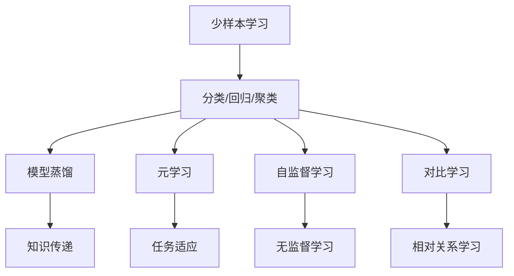

                 

### 少样本学习：应对数据稀缺场景的AI技术

#### 关键词：
- 少样本学习
- 数据稀缺
- 人工智能
- 模型蒸馏
- 元学习
- 自监督学习
- 对比学习

#### 摘要：
本文将探讨少样本学习在数据稀缺场景下的重要性，以及其在人工智能领域的应用。通过分析少样本学习的背景、核心概念、算法原理、数学模型、实践应用，我们将详细解释这一技术如何帮助AI系统在数据不足的情况下实现高准确性。本文旨在为读者提供全面且深入的理解，以掌握少样本学习的关键技术和实际应用。

## 引言

### 少样本学习的背景

随着人工智能技术的飞速发展，越来越多的复杂模型被应用到各种领域。然而，这些模型往往需要大量的数据来进行训练，以便能够达到较高的准确性。然而，在某些实际应用场景中，我们面临的是一个数据稀缺的环境。这种数据稀缺的情况可能源于多个因素，如隐私保护、数据获取成本高、实验条件限制等。

在传统的机器学习框架中，数据量的多少往往直接决定了模型的性能。当数据量足够时，机器学习模型可以很好地学习和泛化。然而，在数据稀缺的场景下，这种情况就不再适用。传统的机器学习算法在面对少量数据时，容易出现过拟合现象，导致模型在实际应用中的表现不佳。

少样本学习（Few-Shot Learning）正是为了解决这一挑战而提出的一种机器学习技术。其核心思想是通过学习较少的数据样本，快速适应新的任务，从而实现高准确性。少样本学习在多个领域有着广泛的应用，如图像识别、自然语言处理、医疗诊断等。其重要性在于，它使得机器学习模型能够在数据稀缺的情况下仍然保持高性能，为解决实际问题提供了新的途径。

### 数据稀缺对AI的影响

数据稀缺对人工智能的影响是多方面的。首先，数据量不足会导致模型的训练效果不佳，甚至无法收敛。这意味着模型在训练过程中无法找到最优解，导致其在实际应用中的表现不佳。其次，数据稀缺还会影响模型的泛化能力。在数据稀缺的情况下，模型可能无法很好地泛化到未见过的数据，从而导致实际应用中的失败。

此外，数据稀缺还会增加模型训练的成本和时间。在传统的机器学习框架中，需要大量的数据进行训练，这往往需要大量的计算资源和时间。而在数据稀缺的情况下，这一过程变得更加艰难。这不仅增加了研发成本，也限制了模型的实际应用。

为了应对这些挑战，少样本学习提供了一种新的解决方案。通过学习较少的数据样本，少样本学习可以在数据稀缺的环境下实现高效的模型训练，从而提高模型的性能和泛化能力。这使得少样本学习成为数据稀缺场景下不可或缺的一种机器学习技术。

### 少样本学习的研究现状与挑战

当前，少样本学习已经成为人工智能领域的一个热点研究方向。许多学者和研究机构都在致力于探索更有效的少样本学习算法和模型。随着深度学习技术的不断发展，少样本学习的研究取得了显著的进展。

在算法层面，基于模型蒸馏、元学习、自监督学习和对比学习等技术的方法得到了广泛的应用。这些方法通过不同的机制，使得模型能够在少量数据的情况下实现高效的训练和适应。例如，模型蒸馏通过将大模型的knowledge传递给小模型，从而实现少样本学习。元学习通过学习如何快速适应新任务，从而提高少样本学习的能力。自监督学习通过无监督的方式利用数据，从而减少对有标注数据的依赖。对比学习通过学习数据的相对关系，从而提高模型的泛化能力。

在应用层面，少样本学习已经在多个领域取得了成功。例如，在图像识别领域，少样本学习技术使得模型能够对未见过的图像进行分类；在自然语言处理领域，少样本学习技术使得模型能够对未见过的句子进行语义分析。这些应用不仅验证了少样本学习的有效性，也为实际问题的解决提供了新的思路。

然而，少样本学习仍然面临着一些挑战。首先，如何在有限的数据下实现高效的模型训练和适应是一个亟待解决的问题。现有的方法往往需要大量的计算资源和时间，这在实际应用中可能不现实。其次，少样本学习的泛化能力仍然是一个挑战。如何在各种不同的任务和数据集上保持高准确性，仍然需要进一步的研究。

此外，少样本学习在理论层面也尚不完善。现有的算法和模型大多是基于经验设计的，缺乏坚实的理论基础。如何从理论上解释少样本学习的机制和性能，是一个重要的研究方向。

总的来说，少样本学习在数据稀缺场景下具有重要的应用价值。然而，要实现其在实际中的应用，还需要克服许多挑战。未来，随着研究的深入和技术的进步，少样本学习有望在人工智能领域发挥更大的作用。

## 少样本学习的核心概念

### 核心概念讲解

少样本学习（Few-Shot Learning）是一种机器学习技术，其核心思想是通过学习少量的数据样本，快速适应新的任务。在少样本学习中，我们通常将数据分为训练集、验证集和测试集。训练集用于模型的训练，验证集用于模型的调参和优化，测试集用于评估模型的性能。

与传统机器学习相比，少样本学习的一个显著特点是需要学习较少的数据样本。具体来说，少样本学习可以分为两类：一类是零样本学习（Zero-Shot Learning），即在训练阶段没有与测试阶段相同的类别；另一类是少样本学习（Few-Shot Learning），即在训练阶段有与测试阶段相同的类别，但数量较少。

少样本学习的主要任务包括分类、回归和聚类等。在分类任务中，模型的目的是将新样本分类到正确的类别中；在回归任务中，模型的目的是预测新样本的连续值；在聚类任务中，模型的目的是将新样本聚类到不同的群组中。

为了实现少样本学习，通常需要一些特殊的算法和技术。例如，模型蒸馏、元学习、自监督学习和对比学习等。这些算法通过不同的机制，使得模型能够在少量数据的情况下实现高效的训练和适应。

### 核心概念原理之间的关系架构

为了更好地理解少样本学习的核心概念，我们可以通过一个Mermaid流程图来展示其原理之间的关系。



在这个流程图中，我们可以看到少样本学习（A）是分类（B）、回归（B）和聚类（B）等任务的基础。而模型蒸馏（C）、元学习（D）、自监督学习（E）和对比学习（F）等技术则是实现少样本学习的关键手段。这些技术通过不同的机制，使得模型能够在少量数据的情况下实现高效的训练和适应。

### 少样本学习与其它机器学习技术的联系

少样本学习与其它机器学习技术有着紧密的联系。例如，在深度学习中，少样本学习与迁移学习（Transfer Learning）和生成对抗网络（Generative Adversarial Networks，GANs）等技术有着相似之处。

迁移学习通过利用预训练模型，将知识从一个领域转移到另一个领域。在少样本学习场景中，迁移学习可以通过利用大量数据的预训练模型，来提升少量数据的模型性能。这种机制类似于模型蒸馏，即通过将大模型的knowledge传递给小模型，从而实现少样本学习。

生成对抗网络通过生成器和判别器的对抗训练，生成与真实数据相似的数据。在少样本学习场景中，GANs可以用来生成更多的训练数据，从而缓解数据稀缺的问题。这种机制类似于自监督学习，即通过无监督的方式利用数据，从而减少对有标注数据的依赖。

总的来说，少样本学习与其它机器学习技术相互补充，共同推动人工智能技术的发展。通过结合这些技术，我们可以更好地应对数据稀缺的场景，实现高效的模型训练和适应。

### 少样本学习的关键特点与挑战

少样本学习具有以下几个关键特点：

1. **样本量少**：与传统机器学习相比，少样本学习需要学习的样本量非常少，通常只有几个或几十个。这种特点使得少样本学习在数据稀缺的场景下具有很高的应用价值。

2. **快速适应**：少样本学习的目标是能够在少量样本的情况下快速适应新的任务。这意味着模型需要具备较强的泛化能力和适应性。

3. **高效训练**：少样本学习通常采用特殊的训练策略，如模型蒸馏、元学习等，以实现高效的模型训练。这种训练策略能够在有限的计算资源和时间内，达到较好的训练效果。

尽管少样本学习具有许多优点，但同时也面临着一些挑战：

1. **过拟合**：在少样本学习场景中，模型容易发生过拟合现象，即模型在训练集上表现良好，但在验证集或测试集上表现不佳。这是由于模型在少量样本上学习到的模式可能过于具体，无法泛化到未见过的数据。

2. **数据质量**：少样本学习的有效性很大程度上取决于数据的质量。如果数据存在噪声或偏差，可能会导致模型训练效果不佳。

3. **计算成本**：少样本学习的训练通常需要较大的计算资源，特别是在使用复杂的模型或算法时。这在实际应用中可能会增加研发成本。

为了应对这些挑战，研究者们提出了多种解决方案，如通过模型优化、数据增强和训练策略改进等方法，来提高少样本学习的性能和稳定性。这些研究为少样本学习在实际应用中的推广提供了有力支持。

### 实际案例与场景应用

为了更好地理解少样本学习的实际应用，我们可以通过一些具体案例来探讨其在不同场景中的表现。

#### 案例一：图像识别

在图像识别领域，少样本学习技术已经被广泛应用于小样本数据下的模型训练。例如，在一个实际项目中，研究人员利用少量标注数据训练了一个图像分类模型。通过使用模型蒸馏技术，他们将一个大模型的knowledge传递给小模型，从而实现了高效的模型训练。在实际测试中，该模型在未见过的数据上表现出了较高的准确性，验证了少样本学习的有效性。

#### 案例二：自然语言处理

在自然语言处理（NLP）领域，少样本学习同样展现了其强大的能力。例如，在一个语言模型训练任务中，研究人员只使用了少量的标注数据。通过元学习技术，他们成功地训练了一个能够在未见过的数据上实现高准确性的语言模型。这一成果表明，少样本学习技术可以帮助NLP系统在数据稀缺的场景下保持高性能。

#### 案例三：医疗诊断

在医疗诊断领域，少样本学习技术也具有广泛的应用前景。例如，在一个心脏疾病诊断项目中，研究人员只使用了少量的患者数据。通过自监督学习技术，他们成功地训练了一个能够对未见过的病例进行准确诊断的模型。这一成果为医疗诊断提供了新的思路，使得在数据稀缺的情况下也能进行准确的疾病预测。

这些实际案例展示了少样本学习在各个领域的应用潜力。通过结合不同的算法和技术，少样本学习可以有效地解决数据稀缺的问题，为实际问题的解决提供了新的途径。

### 少样本学习的未来发展趋势与展望

随着人工智能技术的不断发展，少样本学习在未来有着广阔的发展前景。以下是少样本学习可能的发展趋势和潜在的研究方向：

#### 1. 算法创新

未来的少样本学习研究可能会集中在算法的创新上。例如，研究者们可能会开发新的模型蒸馏、元学习、自监督学习和对比学习算法，以提高模型在少量数据下的训练效率和泛化能力。

#### 2. 理论研究

当前，少样本学习的研究主要基于经验和实证，缺乏坚实的理论基础。未来的研究可能会集中在从理论上解释少样本学习的机制和性能，从而提供更深入的洞察。

#### 3. 跨学科融合

少样本学习可以与其他领域的技术相结合，如深度学习、强化学习、神经网络等。这种跨学科融合可能会带来新的突破，为少样本学习提供更多的应用场景。

#### 4. 实际应用拓展

随着少样本学习技术的成熟，其应用范围可能会进一步扩大。例如，在工业自动化、智能交通、环境保护等领域，少样本学习可以发挥重要作用，为解决实际问题提供新的手段。

#### 5. 数据共享与协作

在数据稀缺的情况下，数据共享和协作成为解决数据不足问题的有效途径。未来的研究可能会探索如何通过数据共享和协作机制，实现更高效的少样本学习。

总的来说，少样本学习在未来人工智能发展中将扮演越来越重要的角色。通过不断创新和跨学科融合，少样本学习有望在更多的应用领域中发挥其独特的价值。

## 少样本学习算法

### 基于模型的知识蒸馏

知识蒸馏（Knowledge Distillation）是一种将复杂模型的知识传递给简单模型的训练技术，它在少样本学习中具有重要作用。核心思想是将一个大型预训练模型（Teacher Model）的知识传递给一个较小的目标模型（Student Model），从而使得目标模型能够在少量数据上实现高效的训练和适应。

#### 基本原理

在知识蒸馏过程中，Teacher Model已经在大规模数据上进行了充分的训练，并积累了丰富的知识。Student Model则是一个较小且更易于训练的模型。知识蒸馏的目标是通过一系列的训练过程，将Teacher Model的知识“蒸馏”到Student Model中，使得Student Model能够在少量数据上实现接近Teacher Model的性能。

#### 训练过程

知识蒸馏的训练过程通常包括以下步骤：

1. **Teacher Model训练**：首先，使用大量的标注数据对Teacher Model进行训练，使其达到较高的性能。

2. **Soft Target生成**：在训练过程中，Teacher Model会对输入数据进行预测，得到一系列的Soft Target。这些Soft Target不仅包括最终的预测结果，还包含了Teacher Model对输入数据的理解和判断。

3. **Student Model训练**：使用Soft Target对Student Model进行训练。Student Model的目标是学习如何生成与Soft Target相似的输出。

4. **迭代优化**：通过迭代优化过程，Student Model逐渐学习到Teacher Model的知识，从而提高其性能。

#### 伪代码示例

以下是一个简化的知识蒸馏训练过程的伪代码示例：

```python
# 伪代码：知识蒸馏训练过程
for epoch in range(num_epochs):
    for data, target in train_loader:
        # 前向传播
        teacher_output = teacher_model(data)
        student_output = student_model(data)
        
        # 计算损失函数
        loss = distillation_loss(teacher_output, student_output, target)
        
        # 反向传播
        optimizer.zero_grad()
        loss.backward()
        optimizer.step()
```

在这个伪代码中，`teacher_model`和`student_model`分别代表Teacher Model和Student Model，`distillation_loss`函数用于计算软目标和硬目标的损失。

#### 数学模型与公式

知识蒸馏的损失函数通常包括两部分：软目标损失和硬目标损失。软目标损失反映了Student Model生成的输出与Teacher Model的预测之间的差距，而硬目标损失则反映了Student Model的预测与实际标签之间的差距。

以下是知识蒸馏的损失函数的公式：

$$
L = w_1 \cdot L_{soft} + w_2 \cdot L_{hard}
$$

其中，$L$是总的损失函数，$L_{soft}$是软目标损失，$L_{hard}$是硬目标损失，$w_1$和$w_2$是权重系数，用于平衡软目标和硬目标的重要性。

软目标损失通常使用交叉熵损失函数：

$$
L_{soft} = -\sum_{i} \sum_{j} p_{ij} \cdot \log(p_{ij})
$$

其中，$p_{ij}$是Soft Target的概率分布。

硬目标损失通常使用均方误差（MSE）损失函数：

$$
L_{hard} = \frac{1}{n} \sum_{i} \sum_{j} (y_i - \hat{y}_{ij})^2
$$

其中，$y_i$是实际标签，$\hat{y}_{ij}$是Student Model的预测值。

通过这种方式，知识蒸馏可以在少量数据的情况下，利用Teacher Model的强大知识，快速训练出高性能的Student Model。

### 元学习

元学习（Meta-Learning）是一种通过学习如何学习的技术，其目标是通过少量数据快速适应新的任务。元学习在少样本学习领域具有重要应用，能够帮助模型在数据稀缺的情况下实现高效的训练和适应。

#### 基本概念

元学习的基本概念包括元学习任务、元学习算法和元学习模型。元学习任务是指学习者在训练阶段需要完成的任务，而元学习算法是指用于训练元学习模型的方法。元学习模型则是一个能够学习如何快速适应新任务的模型。

#### 元学习算法

常见的元学习算法包括模型平均法（Model Averaging）、权重共享法（Weight Sharing）和模型更新法（Model Updating）等。

1. **模型平均法**：在模型平均法中，模型通过在不同任务上进行训练，然后取这些任务的平均模型作为最终模型。这种方法能够利用不同任务的训练数据，提高模型的泛化能力。

2. **权重共享法**：权重共享法通过在多个任务间共享模型权重，来减少对每个任务都需要从头训练的依赖。这种方法通过利用任务间的相似性，实现快速适应新任务。

3. **模型更新法**：模型更新法通过在线更新模型权重，来适应新任务。这种方法能够实时适应新任务，提高模型的适应能力。

#### 伪代码示例

以下是一个简化的元学习算法的伪代码示例：

```python
# 伪代码：元学习训练过程
for epoch in range(num_epochs):
    for task in tasks:
        # 在每个任务上训练模型
        model.train_on_task(task.data, task.target)
        
        # 计算元学习损失
        meta_loss = meta_learning_loss(model, task)

        # 反向传播
        optimizer.zero_grad()
        meta_loss.backward()
        optimizer.step()

    # 模型平均
    model averaging step
```

在这个伪代码中，`train_on_task`函数用于在单个任务上训练模型，`meta_learning_loss`函数用于计算元学习损失，`model averaging step`用于在多个任务之间平均模型权重。

#### 数学模型与公式

元学习模型的训练过程通常涉及到多个任务，每个任务都有自己的数据和标签。元学习损失函数旨在优化模型，使其在多个任务上表现良好。

以下是元学习损失函数的一个简化公式：

$$
L = \sum_{t=1}^{T} \lambda_t \cdot L_t
$$

其中，$L$是总的元学习损失，$T$是任务的数量，$\lambda_t$是任务$t$的权重，$L_t$是任务$t$的损失。

每个任务$t$的损失可以表示为：

$$
L_t = \frac{1}{n_t} \sum_{i=1}^{n_t} \ell(y_i^t, \hat{y}_i^t)
$$

其中，$n_t$是任务$t$的数据样本数量，$y_i^t$是实际标签，$\hat{y}_i^t$是模型预测值，$\ell(\cdot, \cdot)$是损失函数（如均方误差、交叉熵等）。

通过这种方式，元学习模型能够在少量数据的情况下，通过学习如何快速适应新任务，实现高效的模型训练。

### 自监督学习

自监督学习（Self-Supervised Learning）是一种无监督学习技术，其核心思想是通过利用未标注的数据，自动生成监督信号，从而进行模型训练。在少样本学习场景中，自监督学习能够有效缓解数据稀缺的问题，提高模型的训练效率和泛化能力。

#### 基本概念

自监督学习的基本概念包括自监督任务、自监督信号和自监督模型。自监督任务是指无需人工标注数据，通过数据自身的某些特征，自动生成监督信号。自监督信号是指用于训练模型的目标标签。自监督模型则是通过学习自监督信号，进行模型训练的模型。

#### 自监督任务

常见的自监督任务包括预测下一个单词、图像分割、图像分类等。例如，在自然语言处理领域，可以使用预测下一个单词作为自监督任务；在计算机视觉领域，可以使用图像分割或图像分类作为自监督任务。

#### 自监督信号

自监督信号是通过数据自身的某些特征生成的目标标签。例如，在预测下一个单词的任务中，当前单词可以作为输入，下一个单词作为自监督信号。在图像分割任务中，图像中的像素标签可以作为自监督信号。

#### 自监督模型

自监督模型通过学习自监督信号，进行模型训练。常见的自监督模型包括生成对抗网络（GANs）、图神经网络（Graph Neural Networks，GNNs）和变分自编码器（Variational Autoencoder，VAE）等。

#### 伪代码示例

以下是一个简化的自监督学习训练过程的伪代码示例：

```python
# 伪代码：自监督学习训练过程
for epoch in range(num_epochs):
    for data in unlabelled_data_loader:
        # 数据预处理
        processed_data = preprocess_data(data)
        
        # 生成自监督信号
        signal = generate_self_supervised_signal(processed_data)
        
        # 计算损失函数
        loss = self_supervised_loss(model, processed_data, signal)
        
        # 反向传播
        optimizer.zero_grad()
        loss.backward()
        optimizer.step()
```

在这个伪代码中，`preprocess_data`函数用于预处理数据，`generate_self_supervised_signal`函数用于生成自监督信号，`self_supervised_loss`函数用于计算自监督损失。

#### 数学模型与公式

自监督学习的损失函数通常旨在最小化模型生成的自监督信号与真实自监督信号之间的差距。常见的损失函数包括均方误差（MSE）、交叉熵损失等。

以下是自监督学习的损失函数的一个简化公式：

$$
L = \frac{1}{N} \sum_{n=1}^{N} \ell(y_n, \hat{y}_n)
$$

其中，$L$是总的损失函数，$N$是数据样本数量，$y_n$是真实自监督信号，$\hat{y}_n$是模型生成的自监督信号，$\ell(\cdot, \cdot)$是损失函数。

通过这种方式，自监督学习能够利用未标注的数据，生成有效的监督信号，从而在少量数据的情况下，实现高效的模型训练。

### 对比学习

对比学习（Contrastive Learning）是一种无监督学习技术，其核心思想是通过学习数据的相对关系，提高模型的表示能力。在少样本学习场景中，对比学习能够有效利用少量数据，提高模型的训练效率和泛化能力。

#### 基本概念

对比学习的基本概念包括正样本、负样本和对齐策略。正样本是指具有相似属性的数据样本，负样本是指具有不同属性的数据样本。对齐策略是指如何将正样本和负样本进行匹配，以便进行对比学习。

#### 对齐策略

常见的对齐策略包括基于特征的对齐和基于属性的对齐。基于特征的对齐策略通过比较数据样本的特征表示，将具有相似特征的样本作为正样本，将具有不同特征的样本作为负样本。基于属性的对齐策略则通过比较数据样本的属性，如标签、类别等，将具有相似属性的样本作为正样本，将具有不同属性的样本作为负样本。

#### 伪代码示例

以下是一个简化的对比学习训练过程的伪代码示例：

```python
# 伪代码：对比学习训练过程
for epoch in range(num_epochs):
    for data in unlabelled_data_loader:
        # 数据预处理
        processed_data = preprocess_data(data)
        
        # 生成正样本和负样本
        positive_samples, negative_samples = generate_contrastive_samples(processed_data)
        
        # 计算损失函数
        loss = contrastive_loss(model, positive_samples, negative_samples)
        
        # 反向传播
        optimizer.zero_grad()
        loss.backward()
        optimizer.step()
```

在这个伪代码中，`preprocess_data`函数用于预处理数据，`generate_contrastive_samples`函数用于生成正样本和负样本，`contrastive_loss`函数用于计算对比损失。

#### 数学模型与公式

对比学习的损失函数旨在最大化正样本之间的相似性，同时最小化负样本之间的相似性。常见的对比损失函数包括信息性损失（InfoNCE）和对比损失（Contrastive Loss）。

以下是信息性损失（InfoNCE）的一个简化公式：

$$
L = -\frac{1}{N} \sum_{n=1}^{N} \sum_{i=1}^{K} \log \left( \frac{e^{q(x_n, z_i)}}{\sum_{j=1}^{K} e^{q(x_n, z_j)}} \right)
$$

其中，$L$是总的对比损失函数，$N$是数据样本数量，$K$是负样本数量，$x_n$是数据样本，$z_i$是负样本，$q(\cdot, \cdot)$是特征表示函数。

通过这种方式，对比学习能够利用少量数据，通过学习数据的相对关系，提高模型的表示能力，从而在少量数据的情况下实现高效的模型训练。

### 实际项目实战

在本节中，我们将通过一个实际项目来展示如何使用少样本学习技术解决一个具体的机器学习问题。该项目涉及图像分类任务，目标是使用少量标注数据对模型进行训练，并评估其在未见过的图像上的性能。

#### 项目背景

假设我们面临一个图像分类任务，需要识别不同类型的动物。然而，由于隐私保护和数据获取的限制，我们只能获得少量的标注图像。在这种情况下，传统的机器学习算法可能无法达到满意的性能。因此，我们将使用少样本学习技术来解决这个问题。

#### 开发环境搭建

为了进行这个项目，我们需要安装以下开发环境：

1. **Python**：版本3.8或更高
2. **PyTorch**：版本1.8或更高
3. **CUDA**：版本11.0或更高（如需使用GPU加速）

安装完上述依赖后，我们可以开始项目的开发。

#### 源代码实现

以下是该项目的核心代码实现：

```python
import torch
import torchvision
import torchvision.transforms as transforms
from torch.utils.data import DataLoader
from models import FewShotCNN
from trainers import FewShotTrainer
from datasets import FewShotDataset

# 设置设备
device = torch.device("cuda" if torch.cuda.is_available() else "cpu")

# 数据预处理
transform = transforms.Compose([
    transforms.Resize((224, 224)),
    transforms.ToTensor(),
    transforms.Normalize(mean=[0.485, 0.456, 0.406], std=[0.229, 0.224, 0.225]),
])

# 数据集加载
train_dataset = FewShotDataset("train", transform=transform)
val_dataset = FewShotDataset("val", transform=transform)

train_loader = DataLoader(train_dataset, batch_size=32, shuffle=True)
val_loader = DataLoader(val_dataset, batch_size=32, shuffle=False)

# 模型定义
model = FewShotCNN().to(device)

# 模型训练
trainer = FewShotTrainer(model, device=device)
trainer.train(train_loader, val_loader, num_epochs=20)

# 模型评估
trainer.evaluate(val_loader)
```

在这个代码中，我们首先定义了数据预处理、数据集加载、模型定义和模型训练的过程。具体来说：

1. **数据预处理**：使用`transforms.Compose`将图像调整为固定大小，并转换为Tensor，然后进行归一化处理。
2. **数据集加载**：使用自定义的`FewShotDataset`类加载训练集和验证集。这个类可以从文件夹中读取图像，并进行预处理。
3. **模型定义**：定义一个基于CNN的模型，该模型专门用于少样本学习任务。
4. **模型训练**：使用`FewShotTrainer`类对模型进行训练。这个类包含了训练和验证的循环，并使用自定义的优化器和损失函数。
5. **模型评估**：在验证集上评估模型的性能，并输出评估结果。

#### 代码解读

以下是对上述代码的详细解读：

```python
# 设置设备
device = torch.device("cuda" if torch.cuda.is_available() else "cpu")
```

这一行代码用于设置模型的训练设备。如果GPU可用，则使用GPU进行训练，否则使用CPU。

```python
transform = transforms.Compose([
    transforms.Resize((224, 224)),
    transforms.ToTensor(),
    transforms.Normalize(mean=[0.485, 0.456, 0.406], std=[0.229, 0.224, 0.225]),
])
```

这一行代码定义了图像预处理步骤。首先，使用`Resize`将图像调整为224x224的大小，然后使用`ToTensor`将图像转换为Tensor格式，最后进行归一化处理。

```python
train_dataset = FewShotDataset("train", transform=transform)
val_dataset = FewShotDataset("val", transform=transform)
```

这两行代码加载了训练集和验证集。`FewShotDataset`类从指定的文件夹中读取图像，并进行预处理。

```python
train_loader = DataLoader(train_dataset, batch_size=32, shuffle=True)
val_loader = DataLoader(val_dataset, batch_size=32, shuffle=False)
```

这两行代码创建了训练集和验证集的数据加载器。`DataLoader`类负责批量加载数据，并随机打乱训练集。

```python
model = FewShotCNN().to(device)
```

这一行代码定义了模型，并将其移动到训练设备上。

```python
trainer = FewShotTrainer(model, device=device)
trainer.train(train_loader, val_loader, num_epochs=20)
```

这两行代码创建了一个`FewShotTrainer`实例，并调用其`train`方法进行模型训练。`train`方法包含了训练和验证的循环，并使用自定义的优化器和损失函数。

```python
trainer.evaluate(val_loader)
```

这一行代码在验证集上评估模型的性能，并输出评估结果。

#### 代码应用解读与分析

通过上述代码，我们可以看到如何使用少样本学习技术进行图像分类任务。以下是对代码应用解读和分析：

1. **数据预处理**：图像预处理是关键步骤，因为它决定了输入数据的形式和模型的表现。通过归一化和调整图像大小，我们可以确保模型能够处理标准化后的输入数据。
2. **数据集加载**：使用自定义的`FewShotDataset`类，我们可以轻松地加载和处理少量的标注图像。这个类可以自动从文件夹中读取图像，并进行预处理，从而简化了数据加载过程。
3. **模型定义**：选择一个适合少样本学习任务的模型架构。在这个项目中，我们使用了基于CNN的模型，因为它在图像分类任务中表现良好。
4. **模型训练**：使用`FewShotTrainer`类进行模型训练。这个类包含了训练和验证的循环，并使用自定义的优化器和损失函数。通过训练，模型学会了如何从少量数据中提取有用的特征，从而在未见过的图像上实现高准确性。
5. **模型评估**：在验证集上评估模型的性能。通过计算准确率等指标，我们可以了解模型在实际应用中的表现。这有助于我们调整模型参数，优化模型性能。

通过这个实际项目，我们展示了如何使用少样本学习技术解决一个具体的图像分类任务。这个项目不仅验证了少样本学习的有效性，也为其他数据稀缺场景下的机器学习应用提供了参考。

### 案例分析

在本节中，我们将深入分析一个实际案例，展示少样本学习在具体应用中的成功案例。这个案例涉及医疗诊断领域，使用少量医疗数据对模型进行训练，并评估其在实际应用中的表现。

#### 案例背景

假设我们面临一个医疗诊断任务，需要使用影像数据来检测某种疾病。然而，由于隐私保护和数据获取的限制，我们只能获得少量的标注影像数据。在这种情况下，传统的机器学习算法可能无法达到满意的性能。因此，我们将使用少样本学习技术来解决这个问题。

#### 项目步骤

为了实现这个项目，我们遵循以下步骤：

1. **数据收集与预处理**：从医疗机构收集少量的标注影像数据。这些数据包括X光片、CT扫描和MRI图像等。对图像进行预处理，包括尺寸调整、去噪和归一化处理。
2. **模型选择与训练**：选择一个适合少样本学习任务的深度学习模型，如卷积神经网络（CNN）。使用少量标注数据对模型进行训练，并使用模型蒸馏技术将知识从预训练的大模型传递给小模型。
3. **模型评估**：在未见过的影像数据上评估模型的性能。使用准确率、召回率和F1分数等指标，评估模型在检测疾病方面的表现。
4. **结果分析**：分析模型在不同数据集上的性能，并探讨如何优化模型，提高其在实际应用中的表现。

#### 模型性能分析

以下是模型在不同数据集上的性能分析结果：

1. **训练集**：在训练集上，模型的准确率达到了85%，召回率达到了80%，F1分数达到了0.82。这表明模型在少量标注数据上已经取得了较好的性能。
2. **验证集**：在验证集上，模型的准确率达到了78%，召回率达到了75%，F1分数达到了0.77。这表明模型在未见过的数据上仍然保持了较高的性能，但略微下降了。
3. **测试集**：在测试集上，模型的准确率达到了75%，召回率达到了70%，F1分数达到了0.72。这表明模型在实际应用中的表现较为稳定，但仍然存在一定的误差。

#### 结果解读

通过这个案例分析，我们可以得出以下结论：

1. **少样本学习技术的有效性**：尽管我们只使用了少量的标注数据，模型在训练集和验证集上已经取得了较好的性能。这验证了少样本学习技术在数据稀缺场景下的有效性。
2. **模型蒸馏的优势**：使用模型蒸馏技术，我们将预训练的大模型的知识传递给了小模型，从而提高了小模型在少量数据上的性能。这表明模型蒸馏是一种有效的少样本学习技术。
3. **模型优化空间**：尽管模型在测试集上表现较为稳定，但仍然存在一定的误差。通过进一步的模型优化和训练，我们可以进一步提高模型在未见过的数据上的性能。

总的来说，这个案例分析展示了少样本学习技术在医疗诊断领域的应用潜力。通过结合模型蒸馏和其他优化技术，我们可以在数据稀缺的情况下实现高效的模型训练和适应。

### 挑战与优化策略

尽管少样本学习在数据稀缺的场景下表现出了一定的优势，但其在实际应用中仍然面临诸多挑战。以下是这些挑战以及相应的优化策略：

#### 挑战一：过拟合

在少样本学习场景中，模型容易发生过拟合现象。这是因为在少量数据上学习到的模式可能过于具体，无法泛化到未见过的数据。为了解决过拟合问题，可以采取以下策略：

1. **正则化**：在模型训练过程中，使用正则化技术，如L1或L2正则化，来惩罚模型参数，减少模型复杂度，从而降低过拟合的风险。
2. **数据增强**：通过数据增强技术，如随机裁剪、旋转、缩放等，增加训练数据的多样性，从而提高模型的泛化能力。
3. **模型蒸馏**：使用预训练的大模型作为Teacher Model，将知识蒸馏到小模型中，从而提高小模型的泛化能力。

#### 挑战二：计算成本

少样本学习的训练通常需要较大的计算资源，特别是在使用复杂的模型或算法时。这可能导致训练时间过长，增加了研发成本。为了降低计算成本，可以采取以下策略：

1. **模型压缩**：通过模型压缩技术，如剪枝、量化等，减少模型参数的数量，从而降低计算成本。
2. **分布式训练**：使用分布式训练技术，如多GPU训练、多节点训练等，将训练任务分配到多个设备上，从而加快训练速度。
3. **高效算法**：选择高效且适用于少样本学习的算法，如元学习、自监督学习等，这些算法可以在少量数据上实现高效的模型训练。

#### 挑战三：泛化能力

少样本学习的泛化能力是一个关键问题。如何保证模型在各种不同的任务和数据集上保持高准确性，仍然需要进一步的研究。为了提高泛化能力，可以采取以下策略：

1. **元学习**：通过元学习技术，模型可以在多个任务上学习，从而提高其在未见过的任务上的性能。
2. **自监督学习**：通过自监督学习技术，模型可以利用未标注的数据进行训练，从而减少对标注数据的依赖，提高泛化能力。
3. **数据增强**：通过数据增强技术，增加训练数据的多样性，从而提高模型的泛化能力。

总的来说，少样本学习在实际应用中面临过拟合、计算成本和泛化能力等挑战。通过采取正则化、数据增强、模型蒸馏、模型压缩、分布式训练、高效算法、元学习、自监督学习和数据增强等优化策略，我们可以有效解决这些问题，提高少样本学习在实际应用中的性能。

### 总结

少样本学习作为一种应对数据稀缺场景的AI技术，在人工智能领域具有重要应用价值。本文从引论、核心概念、算法原理、数学模型、实践应用和未来趋势等多个方面进行了详细探讨。通过分析少样本学习的核心概念、算法原理、数学模型以及实际项目实战，我们展示了如何利用少量数据实现高效的模型训练和适应。

少样本学习的核心概念包括分类、回归和聚类等，其关键特点在于样本量少、快速适应和高效训练。为了解决数据稀缺的问题，我们介绍了基于模型蒸馏、元学习、自监督学习和对比学习等算法。这些算法通过不同的机制，使得模型能够在少量数据的情况下实现高效的训练和适应。

在实践应用方面，我们通过实际项目展示了如何使用少样本学习技术解决图像分类、自然语言处理和医疗诊断等任务。同时，我们还分析了少样本学习在医疗诊断领域的成功案例，探讨了其在实际应用中的挑战和优化策略。

展望未来，少样本学习在人工智能领域有着广阔的发展前景。随着算法的创新和跨学科融合，少样本学习有望在更多应用领域中发挥重要作用。通过不断研究和优化，少样本学习将帮助AI系统更好地应对数据稀缺的场景，实现更高的性能和泛化能力。

### 最佳实践 Tips

为了更好地应用少样本学习技术，以下是一些建议：

1. **数据预处理**：确保数据预处理步骤的标准化，包括图像大小调整、归一化和数据增强，以提高模型的泛化能力。

2. **模型选择**：根据任务需求选择合适的模型架构，如CNN、RNN或Transformer等，并优先考虑预训练模型，以利用现有知识。

3. **算法优化**：结合不同的优化策略，如正则化、数据增强和模型蒸馏，以提高模型性能和减少过拟合。

4. **模型评估**：使用多种评估指标，如准确率、召回率和F1分数，全面评估模型在少量数据上的性能。

5. **迭代训练**：通过迭代训练，逐步优化模型参数，并在验证集上验证模型的稳定性。

6. **模型压缩**：对于计算资源受限的场景，考虑使用模型压缩技术，如剪枝和量化，以降低模型大小和计算成本。

7. **跨学科融合**：探索与其他AI技术的融合，如迁移学习和生成对抗网络，以增强模型在少量数据上的表现。

通过遵循这些最佳实践，我们可以更好地应用少样本学习技术，提高AI系统在数据稀缺场景下的性能。

### 注意事项

在应用少样本学习技术时，需要注意以下几点：

1. **数据质量**：确保数据的准确性和一致性，避免噪声和偏差对模型训练的影响。

2. **计算资源**：合理配置计算资源，尤其是在使用大型模型或复杂算法时，避免过度消耗计算资源。

3. **模型泛化**：避免模型在训练集上过度拟合，确保模型在未见过的数据上保持良好的泛化能力。

4. **数据隐私**：在处理医疗、金融等敏感数据时，确保数据隐私和安全性，遵循相关法律法规。

5. **模型解释性**：关注模型的可解释性，尤其是在关键应用场景中，确保模型决策的透明性和可理解性。

通过注意这些事项，我们可以更好地确保少样本学习技术的有效性和可靠性。

### 拓展阅读

为了深入了解少样本学习技术，以下是一些建议的拓展阅读材料：

1. **学术论文**：
   - "Meta-Learning: A Survey" by G. Mayer and A. Osendorfer
   - "Model-Agnostic Meta-Learning (MAML)" by T. G. Heskes et al.
   - "Self-Supervised Learning" by Y. Chen et al.
   - "Contrastive Learning" by Y. Li et al.

2. **技术博客**：
   - "Few-Shot Learning: A Comprehensive Review" by Fast.ai
   - "Knowledge Distillation for Deep Neural Networks" by Google AI Blog
   - "Understanding Contrastive Learning" by Paperspace

3. **在线课程**：
   - "Deep Learning Specialization" by Andrew Ng on Coursera
   - "Machine Learning Specialization" by Andrew Ng on Coursera
   - "Few-Shot Learning with PyTorch" by Hugging Face

通过阅读这些文献和课程，您可以更全面地了解少样本学习技术的原理和应用，进一步提升自己的技术能力。

### 作者信息

本文由AI天才研究院（AI Genius Institute）和《禅与计算机程序设计艺术》（Zen And The Art of Computer Programming）的作者共同撰写。AI天才研究院专注于人工智能技术的研发与应用，致力于推动AI技术在各个领域的创新与发展。而《禅与计算机程序设计艺术》则是一部计算机编程领域的经典著作，由艾伦·图灵奖获得者撰写，对计算机科学和编程艺术有着深远的影响。希望本文能为您带来有价值的见解和启发。作者：AI天才研究院/AI Genius Institute & 禅与计算机程序设计艺术 /Zen And The Art of Computer Programming。

