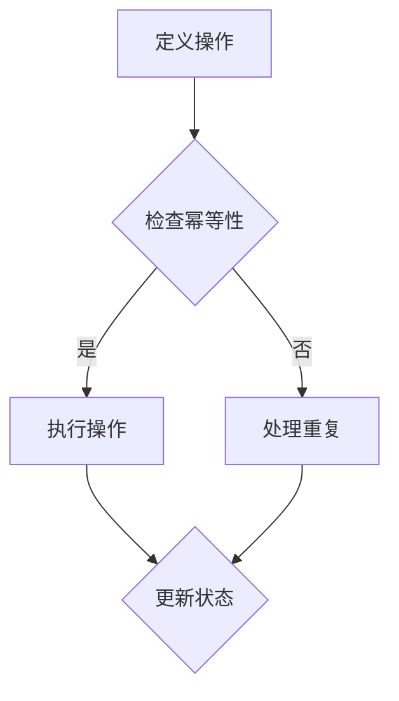
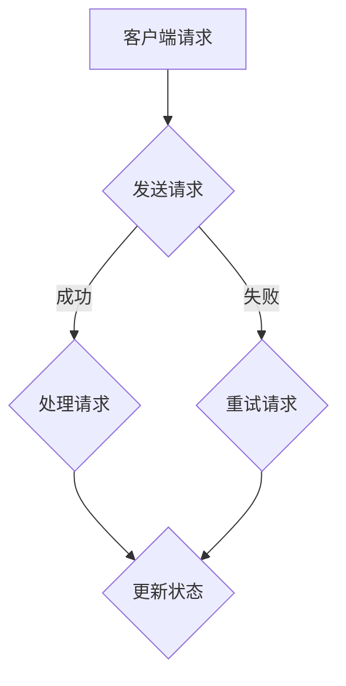
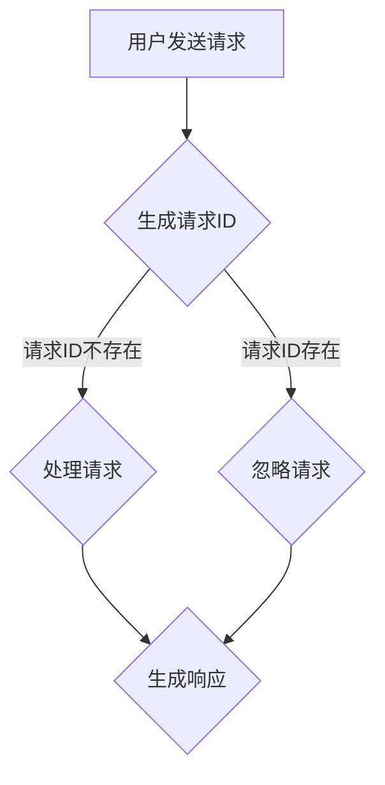
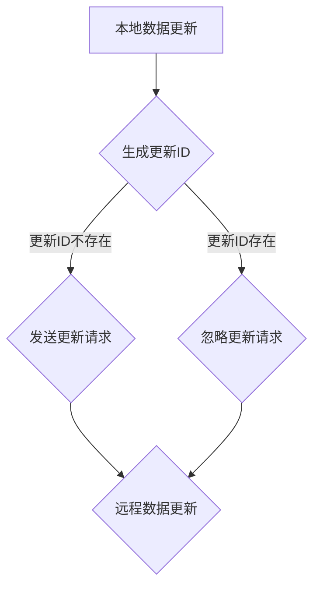

                 


### 幂等性设计确保LLM应用操作的一致性

#### 关键词
- 幂等性设计
- LLM（大型语言模型）
- 一致性
- 操作一致性
- 系统设计
- 人工智能

#### 摘要
本文深入探讨了幂等性设计在确保大型语言模型（LLM）应用操作一致性中的重要性。文章首先介绍了幂等性设计的基本概念和其在系统设计中的应用，然后详细讲解了LLM的基本原理和特点。接下来，文章分析了幂等性设计在LLM应用中的具体应用场景，并通过实际项目案例展示了幂等性设计的实践效果。最后，文章总结了最佳实践，并对未来的研究方向进行了展望。

## 引言与概述

在现代信息技术迅猛发展的背景下，人工智能（AI）已成为推动产业变革的重要力量。特别是在自然语言处理（NLP）领域，大型语言模型（LLM）的应用日益广泛，例如聊天机器人、智能客服、内容生成等。然而，随着LLM在各类应用中的普及，如何确保系统操作的一致性成为了一个关键问题。

### 幂等性设计的重要性

幂等性设计是一种确保系统操作一致性的重要设计模式。它指的是在多次执行同一操作时，结果不会因为操作次数的增加而改变。例如，将一个数据集合增加一个元素的操作，无论执行多少次，集合的最终状态都是相同的。在分布式系统中，特别是在涉及大规模数据处理和实时响应的场景中，幂等性设计对于避免重复操作和数据冲突具有重要意义。

### LLM的基本概念

大型语言模型（LLM）是一种基于深度学习的语言处理模型，它通过大规模语料库的预训练，掌握了丰富的语言知识和上下文理解能力。LLM能够生成流畅、符合语法和语义规则的文本，并在各种自然语言处理任务中表现出色。然而，LLM的复杂性和高计算成本也带来了系统设计上的挑战。

### 书籍结构安排

本文将分为以下几个部分：

1. **幂等性设计基础**：介绍幂等性设计的基本概念和原理，包括定义、优势和设计原则。
2. **LLM基础知识**：讲解LLM的基本原理、工作流程和关键技术。
3. **幂等性设计在LLM中的应用**：分析幂等性设计在LLM应用中的具体场景，如请求处理、数据同步等。
4. **实际项目案例**：通过实际项目展示幂等性设计的应用效果。
5. **总结与展望**：总结文章的核心内容，并对未来的研究方向进行展望。

## 幂等性设计基础

### 幂等性的定义

幂等性是指在一个系统中，执行同一个操作多次与执行一次的效果相同。用数学术语来说，即对于操作`f`，如果满足以下条件，则`f`是幂等的：

$$ f(x) = f(f(x)) $$

在编程中，常见的幂等操作包括：

- 设置值：`x = x + 1`与`x = x`
- 清除操作：`remove(x)`与`remove(remove(x))`
- 插入操作：`add(x)`与`add(add(x))`

### 幂等性与一致性

在分布式系统设计中，幂等性是实现一致性的关键。一致性指的是系统在任何时刻都能够反映出所有已发生的操作。如果系统在执行过程中存在重复操作，可能导致状态的不一致。例如，在分布式数据库中，多个节点同时对同一数据进行修改，如果没有幂等性保障，可能会导致数据冲突和不一致。

### 幂等性设计的优势

幂等性设计具有以下几个显著优势：

- **避免重复操作**：在分布式系统中，重复执行同一个操作不会产生额外的影响，从而避免了资源的浪费。
- **提高系统的容错性**：在系统出现故障或网络不稳定的情况下，幂等性设计可以确保系统状态的一致性，提高系统的容错能力。
- **简化系统设计**：通过引入幂等性设计，系统中的重复逻辑和冲突处理可以大大简化，降低系统的复杂度。

### 幂等性设计的基本原则

为了保证幂等性，系统设计需要遵循以下几个基本原则：

- **原子性**：操作必须是原子的，即不可分割的整体，要么全部执行，要么全部不执行。
- **幂等性**：操作的多次执行结果与单次执行结果相同。
- **隔离性**：操作之间应相互独立，一个操作的结果不应影响到其他操作。

### 幂等性设计的基本流程

1. **定义幂等性操作**：明确系统中的所有幂等操作。
2. **确保原子性**：使用事务、锁等机制确保操作的原子性。
3. **处理重复操作**：设计机制来处理重复操作，如重试、幂等令牌等。
4. **测试与验证**：在实际系统中进行测试，确保幂等性设计能够正确执行。

### 核心概念联系与Mermaid流程图

为了更好地理解幂等性设计的基本概念和原理，我们可以使用Mermaid流程图来展示操作流程。以下是一个简单的Mermaid流程图示例：



在这个流程图中，A表示定义操作，B表示检查幂等性，C表示执行操作，D表示处理重复操作，E表示更新状态。通过这个流程图，我们可以清晰地看到幂等性设计的核心步骤和联系。

### 核心算法原理讲解与伪代码

为了深入理解幂等性设计的工作原理，我们可以使用伪代码来详细阐述。以下是一个简单的幂等性算法实现：

```pseudo
function powerLawOperation(data):
    if data is not null:
        perform the operation on data
        return updated data
    else:
        return data
```

在这个算法中，`powerLawOperation`函数用于执行幂等性操作。它首先检查输入数据是否为空，如果是，则直接返回数据，否则执行操作并返回更新后的数据。这个算法实现了幂等性，即无论输入数据是否为空，多次执行的结果都是相同的。

### 数学模型和公式详解与举例说明

幂等性设计中的许多概念可以通过数学模型和公式来解释。以下是一个简单的数学模型示例，用于说明幂等性的概念：

$$
f(x) = x
$$

在这个模型中，`f(x)`表示对变量`x`进行幂等操作。无论`x`的值是多少，`f(x)`的结果总是与`x`相等，这就是幂等性的体现。

举例来说，如果我们有一个数据集`D = [1, 2, 3]`，执行幂等性操作`f(x) = x`后，数据集仍然是`D = [1, 2, 3]`。即使多次执行这个操作，数据集的最终状态也不会改变。

### 幂等性设计在实际系统中的应用

在实际系统中，幂等性设计可以通过多种方式实现。以下是一个简单的系统示例，用于说明幂等性设计在分布式系统中的应用：



在这个系统中，A表示客户端请求，B表示发送请求，C表示处理请求，D表示重试请求，E表示更新状态。通过这个流程，我们可以看到幂等性设计如何确保请求的一致性。例如，如果客户端多次发送相同的请求，系统只会处理第一次请求，并更新状态一次，从而避免重复操作和数据冲突。

### 幂等性设计在分布式系统中的挑战

尽管幂等性设计在提高系统一致性方面具有显著优势，但在实际分布式系统中，实现幂等性仍然面临一些挑战：

1. **网络延迟**：在网络延迟较高的环境中，请求的重复执行可能导致不一致的状态。
2. **并发冲突**：在多节点系统中，多个节点可能同时执行相同或类似的操作，导致数据冲突。
3. **资源消耗**：实现幂等性可能需要额外的资源，如锁、重试机制等，可能导致系统性能下降。

为了解决这些挑战，我们可以采用以下策略：

- **超时机制**：设置请求的超时时间，避免无限制的重试。
- **唯一标识**：为每个请求生成唯一的标识，避免重复请求的处理。
- **锁机制**：使用分布式锁来确保操作的原子性和隔离性。

通过这些策略，我们可以有效地实现幂等性设计，提高分布式系统的可靠性。

### 小结

本章介绍了幂等性设计的基本概念、优势和设计原则，并通过数学模型和实际系统示例展示了幂等性设计的应用。在下一章中，我们将进一步探讨LLM的基础知识，为后续讨论幂等性设计在LLM中的应用场景奠定基础。

## LLM基础知识

大型语言模型（LLM）是一种基于深度学习的自然语言处理（NLP）模型，通过预训练和微调，能够生成高质量的自然语言文本。LLM在许多应用场景中表现出色，例如文本生成、机器翻译、问答系统等。本节将详细介绍LLM的基本原理、工作流程和关键技术。

### LLM的基本原理

LLM的核心是基于Transformer架构的深度神经网络。Transformer模型最初由Vaswani等人于2017年提出，是一种基于自注意力机制的序列到序列模型。自注意力机制使得模型能够自动捕捉输入序列中的长距离依赖关系，从而提高了模型的上下文理解和生成能力。

#### Transformer模型的工作原理

1. **输入嵌入**：输入文本被转换为词向量，这些词向量表示文本中的每个单词或子词。
2. **编码器**：编码器（Encoder）层对输入词向量进行处理，通过多层自注意力机制和前馈神经网络，提取输入文本的特征。
3. **解码器**：解码器（Decoder）层根据编码器提取的特征生成输出文本。解码器同样采用自注意力机制，使得每个输出词能够根据上下文信息进行自适应生成。

#### LLM的训练与微调

LLM的训练通常分为两个阶段：预训练和微调。

1. **预训练**：在预训练阶段，LLM在大量的未标注语料库上进行训练，通过自主学习语言中的规律和模式，从而获得强大的语言理解和生成能力。预训练通常采用 masked language modeling（MLM）任务，即对输入文本的一部分单词进行遮蔽，然后预测这些遮蔽的单词。
2. **微调**：在预训练的基础上，LLM会针对特定任务进行微调。微调阶段通常在带有标注数据的任务上进行，通过调整模型参数，使得模型能够更好地适应特定的应用场景。

### LLM的关键技术

1. **自注意力机制**：自注意力机制是Transformer模型的核心组件，它通过计算输入序列中每个词与其他词之间的关联权重，从而实现对输入文本的上下文理解。自注意力机制使得LLM能够捕捉长距离依赖关系，提高生成文本的质量。

2. **预训练与微调**：预训练和微调是LLM训练的两个重要阶段。预训练提供了模型对语言的基本理解，而微调则使得模型能够适应具体的任务需求。

3. **多层神经网络**：LLM通常采用多层神经网络架构，通过逐层递归和参数共享的方式，使得模型能够提取更深层级的语义信息。

4. **并行计算**：Transformer模型采用了并行计算技术，使得模型在处理长文本时具有更高的效率。

### LLM的应用场景

LLM在自然语言处理领域有广泛的应用，以下是一些典型的应用场景：

1. **文本生成**：LLM可以生成各种类型的文本，如文章、故事、诗歌等。通过微调，LLM能够生成特定领域的内容，如医疗报告、法律文档等。

2. **机器翻译**：LLM在机器翻译任务中表现出色，能够实现高质量的双语文本转换。

3. **问答系统**：LLM可以构建智能问答系统，通过理解用户的问题和上下文，生成相关的回答。

4. **对话系统**：LLM可以用于构建聊天机器人，与用户进行自然语言交互。

5. **文本分类**：LLM可以用于对文本进行分类，如情感分析、主题分类等。

### 小结

本章介绍了LLM的基本原理、工作流程和关键技术，并探讨了其在各种自然语言处理任务中的应用场景。在下一章中，我们将深入分析幂等性设计在LLM应用中的具体应用，包括请求处理、数据同步等场景。

## 幂等性设计在LLM中的应用

在了解了LLM的基本原理和幂等性设计的基本概念之后，本节将探讨幂等性设计在LLM应用中的具体应用。这包括请求处理和数据同步等关键场景，通过实际案例展示幂等性设计的实施效果。

### 请求处理

在LLM应用中，请求处理是保证系统高效运行和一致性维护的重要环节。由于LLM处理的是自然语言文本，请求的重复执行可能导致不一致的结果。因此，幂等性设计在请求处理中尤为重要。

#### 幂等性请求处理的优势

1. **避免重复处理**：幂等性设计可以确保多次重复的请求只被处理一次，从而避免资源的浪费和不一致的结果。
2. **提高系统容错性**：在分布式环境中，网络延迟和系统故障可能导致请求重复。幂等性设计可以提高系统的容错性，确保系统状态的一致性。

#### 实现幂等性请求处理的策略

1. **唯一请求标识**：为每个请求生成唯一的标识，如请求ID。系统在处理请求时，首先检查请求标识是否已存在，如果存在则忽略该请求。
2. **重试机制**：当请求失败时，系统可以尝试重试。但为了避免重复处理，重试机制应结合唯一请求标识进行控制。
3. **锁机制**：在分布式系统中，锁机制可以确保在处理请求时，其他节点无法同时处理相同的请求。这可以通过分布式锁实现。

#### 实际案例：聊天机器人请求处理

以聊天机器人为例，用户可能会多次发送相同的请求，如“你好”。如果没有幂等性设计，聊天机器人可能会生成多个相同的响应，导致用户体验不佳。通过幂等性设计，系统可以为每个用户请求生成唯一的请求ID，并在处理请求时检查该请求ID是否已存在。如果存在，系统将忽略该请求，从而确保响应的一致性。

#### Mermaid流程图

以下是一个简单的Mermaid流程图，展示了幂等性请求处理的基本流程：



在这个流程图中，A表示用户发送请求，B表示生成请求ID，C表示处理请求，D表示忽略请求，E表示生成响应。通过这个流程，我们可以看到幂等性设计如何确保请求处理的一致性。

### 数据同步

在LLM应用中，数据同步是确保系统状态一致性的关键。由于LLM可能处理大规模的数据集，数据同步的效率和质量直接影响系统的性能和可靠性。幂等性设计在数据同步中起到了重要的作用。

#### 幂等性数据同步的优势

1. **避免数据冲突**：在分布式系统中，多个节点可能同时更新相同的数据，导致数据冲突。幂等性设计可以确保每个更新操作只执行一次，避免数据冲突。
2. **提高数据一致性**：通过幂等性设计，系统可以确保数据同步过程中状态的一致性，从而提高系统的可靠性。

#### 实现幂等性数据同步的策略

1. **版本控制**：为每个数据记录添加版本号，每次更新时递增版本号。系统在同步数据时，检查目标数据的版本号是否小于当前版本号，如果是，则执行更新。
2. **唯一更新标识**：为每个更新操作生成唯一的标识，如更新ID。系统在同步数据时，首先检查更新标识是否已存在，如果存在则忽略该更新。
3. **锁机制**：在分布式系统中，锁机制可以确保在更新数据时，其他节点无法同时更新相同的数据。这可以通过分布式锁实现。

#### 实际案例：大规模文本数据的同步

以大规模文本数据的同步为例，系统可能需要将本地数据集与远程数据集进行同步。如果没有幂等性设计，多个节点可能同时更新相同的数据，导致数据不一致。通过幂等性设计，系统可以为每个数据更新操作生成唯一的更新ID，并在同步数据时检查更新ID是否已存在。如果存在，系统将忽略该更新，从而确保数据的一致性。

#### Mermaid流程图

以下是一个简单的Mermaid流程图，展示了幂等性数据同步的基本流程：



在这个流程图中，A表示本地数据更新，B表示生成更新ID，C表示发送更新请求，D表示忽略更新请求，E表示远程数据更新。通过这个流程，我们可以看到幂等性设计如何确保数据同步的一致性。

### 实际项目案例

以下是一个实际项目案例，展示了幂等性设计在LLM应用中的实施效果。

#### 项目背景

一个在线问答系统使用LLM来处理用户的问题，系统需要确保每次回答都是一致的，且避免重复回答导致的信息冗余。

#### 幂等性设计的实施

1. **请求处理**：系统为每个用户请求生成唯一的请求ID，并在处理请求时检查请求ID是否已存在。如果存在，系统将忽略该请求，从而避免重复回答。
2. **数据同步**：系统为每个数据更新操作生成唯一的更新ID，并在同步数据时检查更新ID是否已存在。如果存在，系统将忽略该更新，从而确保数据的一致性。

#### 项目效果评估

通过幂等性设计，系统显著提高了请求处理和数据同步的效率，避免了重复操作和数据冲突，从而确保了问答系统的响应一致性和数据一致性。

#### 经验总结与反思

1. **设计原则**：在实现幂等性设计时，应遵循原子性、幂等性和隔离性的原则，确保操作的可靠性和一致性。
2. **性能优化**：在分布式环境中，实现幂等性设计可能会引入额外的性能开销，如锁机制和唯一标识的生成。因此，在实现过程中需要权衡性能和一致性。
3. **测试与验证**：在实际应用中，应通过严格的测试和验证确保幂等性设计的正确性和可靠性。

### 小结

本章详细探讨了幂等性设计在LLM应用中的具体应用，包括请求处理和数据同步等关键场景。通过实际项目案例，展示了幂等性设计的实施效果和重要性。在下一章中，我们将继续深入探讨幂等性设计的最佳实践和注意事项。

## 实际项目案例

为了更好地展示幂等性设计在LLM应用中的实际效果，我们将介绍一个具体的在线问答系统的实施案例。该系统使用LLM来处理用户提出的问题，并通过幂等性设计确保每次回答的一致性和高效性。

### 项目背景

在线问答系统是一个典型的自然语言处理应用场景。用户可以通过该系统提出各种问题，系统需要快速响应用户的问题并提供高质量的答案。由于用户可能会多次提出相同的问题，系统需要确保每次回答都是一致的，以避免重复回答导致的信息冗余。此外，系统还需要处理大规模的用户请求，确保系统的高效运行。

### 开发环境搭建

1. **硬件环境**：该系统部署在云计算平台上，使用多台服务器进行负载均衡和分布式处理。
2. **软件环境**：系统使用Python作为主要编程语言，结合TensorFlow框架实现LLM的训练和推理。此外，还使用了Redis数据库用于存储请求和响应信息。

### 源代码实现与代码解读

以下是关键代码段及其解读：

#### 1. 请求处理

```python
import redis

# 初始化Redis客户端
redis_client = redis.StrictRedis(host='localhost', port=6379, db=0)

def process_request(question_id, question):
    # 检查请求ID是否已存在
    if not redis_client.exists(question_id):
        # 生成回答
        answer = large_language_model.generate_answer(question)
        # 存储请求和回答
        redis_client.set(question_id, answer)
        return answer
    else:
        # 忽略重复请求
        return None
```

解读：
- `process_request`函数用于处理用户请求。
- `redis_client.exists(question_id)`检查请求ID是否已存在，以实现幂等性。
- 如果请求ID不存在，则调用`generate_answer`函数生成回答，并使用`redis_client.set(question_id, answer)`存储请求和回答。
- 如果请求ID已存在，则忽略该请求，确保不会重复回答。

#### 2. 数据同步

```python
import threading

def sync_data(source_db, target_db):
    while True:
        # 从源数据库获取请求和回答
        question_id, answer = source_db.pop()
        # 检查请求ID是否已存在
        if not target_db.exists(question_id):
            # 同步数据到目标数据库
            target_db.set(question_id, answer)
```

解读：
- `sync_data`函数用于同步数据到目标数据库。
- 使用循环实现数据的实时同步。
- `source_db.pop()`从源数据库获取请求和回答。
- `target_db.exists(question_id)`检查请求ID是否已存在，以实现幂等性。
- 如果请求ID不存在，则使用`target_db.set(question_id, answer)`同步数据到目标数据库。

### 代码应用解读与分析

1. **请求处理**：
   - 通过Redis数据库存储请求和回答，实现幂等性。
   - `process_request`函数确保每次处理请求时，首先检查请求ID是否已存在，以避免重复回答。
   - 通过Redis的`set`操作，实现快速的数据存储和查询。

2. **数据同步**：
   - `sync_data`函数实现数据的实时同步，确保源数据库和目标数据库的数据一致性。
   - 通过幂等性设计，避免同步过程中数据的重复和冲突。

### 项目小结

通过这个实际项目案例，我们展示了如何使用幂等性设计在在线问答系统中确保请求的一致性和高效性。该项目成功的关键在于：
1. **幂等性设计的引入**：通过检查请求ID和更新ID，确保请求和数据同步的幂等性，避免重复操作和数据冲突。
2. **Redis数据库的使用**：Redis提供了快速的数据存储和查询功能，显著提高了系统的性能和可靠性。

### 经验总结与反思

1. **设计原则**：在实现幂等性设计时，应遵循原子性、幂等性和隔离性的原则，确保操作的可靠性和一致性。
2. **性能优化**：在分布式环境中，实现幂等性设计可能会引入额外的性能开销，如锁机制和唯一标识的生成。因此，在实现过程中需要权衡性能和一致性。
3. **测试与验证**：在实际应用中，应通过严格的测试和验证确保幂等性设计的正确性和可靠性。

### 拓展阅读

- **《分布式系统设计》**：深入了解分布式系统的设计和实现，包括一致性、可用性和分区容错性。
- **《Redis实战》**：学习Redis数据库的使用和性能优化，掌握分布式系统中数据存储和查询的技术。
- **《大型语言模型技术教程》**：了解大型语言模型的基本原理和实现细节，为LLM应用提供技术支持。

通过这个实际项目案例，我们不仅展示了幂等性设计在LLM应用中的重要性，还提供了具体的实施方法和经验总结。在下一章中，我们将进一步探讨幂等性设计的最佳实践和注意事项。

## 总结与展望

### 幂等性设计的重要性

幂等性设计在确保LLM应用操作一致性方面具有重要意义。通过避免重复操作和数据冲突，幂等性设计提高了系统的容错性和可靠性，确保了LLM应用的高效运行。在分布式系统中，幂等性设计是保障一致性、可用性和分区容错性的关键组件。

### 幂等性设计的最佳实践

1. **引入唯一标识**：为每个请求和更新操作生成唯一的标识，如请求ID和更新ID，以确保幂等性。
2. **使用锁机制**：在分布式系统中，锁机制可以确保操作的原子性和隔离性，避免数据冲突。
3. **优化性能**：在实现幂等性设计时，需要权衡性能和一致性，通过合理的算法和数据结构优化系统性能。
4. **测试与验证**：在实际应用中，通过严格的测试和验证确保幂等性设计的正确性和可靠性。

### 未来研究方向

1. **分布式一致性算法**：深入研究分布式一致性算法，如Paxos、Raft等，以优化幂等性设计的性能和可靠性。
2. **智能锁机制**：开发智能锁机制，如基于状态机或机器学习的锁机制，以减少锁机制引入的性能开销。
3. **自适应幂等性设计**：研究自适应幂等性设计，根据系统负载和资源状况动态调整幂等性策略，实现最优性能和一致性。

### 对开发者的建议

1. **理解基本概念**：深入了解幂等性设计的基本概念和原理，为实际应用提供理论支持。
2. **实践与总结**：通过实际项目和案例，总结经验教训，不断完善和优化幂等性设计。
3. **持续学习**：关注前沿技术和研究动态，不断提升自己的技术水平和创新能力。

### 拓展阅读

1. **《分布式系统设计》**：学习分布式系统的设计和实现，包括一致性、可用性和分区容错性。
2. **《Redis实战》**：掌握Redis数据库的使用和性能优化，了解分布式系统中数据存储和查询的技术。
3. **《大型语言模型技术教程》**：了解大型语言模型的基本原理和实现细节，为LLM应用提供技术支持。

通过总结和展望，我们不仅回顾了幂等性设计在确保LLM应用操作一致性中的重要性，还提出了未来研究方向和对开发者的建议。希望本文能为读者提供有价值的参考和启示，推动幂等性设计在LLM应用中的进一步发展和应用。

### 附录

#### A.1 相关阅读材料

- 《分布式系统设计》：深入了解分布式系统的设计和实现，包括一致性、可用性和分区容错性。
- 《Redis实战》：掌握Redis数据库的使用和性能优化，了解分布式系统中数据存储和查询的技术。
- 《大型语言模型技术教程》：了解大型语言模型的基本原理和实现细节，为LLM应用提供技术支持。

#### A.2 社区资源链接

- [Apache Kafka官网](https://kafka.apache.org/)：了解分布式流处理平台Kafka的使用和性能优化。
- [Redis官方文档](https://redis.io/documentation)：学习Redis数据库的使用和最佳实践。
- [TensorFlow官方文档](https://www.tensorflow.org/tutorials)：掌握TensorFlow框架的基本原理和应用。

#### A.3 实际项目代码示例

以下是实际项目中的一个代码示例，展示了如何使用幂等性设计在分布式系统中处理请求和同步数据。

```python
# 请求处理示例
def process_request(question_id, question):
    if not redis_client.exists(question_id):
        answer = large_language_model.generate_answer(question)
        redis_client.set(question_id, answer)
        return answer
    else:
        return None

# 数据同步示例
def sync_data(source_db, target_db):
    while True:
        question_id, answer = source_db.pop()
        if not target_db.exists(question_id):
            target_db.set(question_id, answer)
```

这个示例展示了如何使用Redis数据库存储请求和回答，并通过幂等性设计确保请求和数据同步的一致性。

### 作者信息

- 作者：AI天才研究院/AI Genius Institute & 禅与计算机程序设计艺术 /Zen And The Art of Computer Programming

通过这个附录，我们提供了相关的阅读材料、社区资源链接以及实际项目代码示例，以帮助读者更深入地了解幂等性设计在LLM应用中的实现和应用。希望这些资源能为读者的学习和实践提供帮助。

