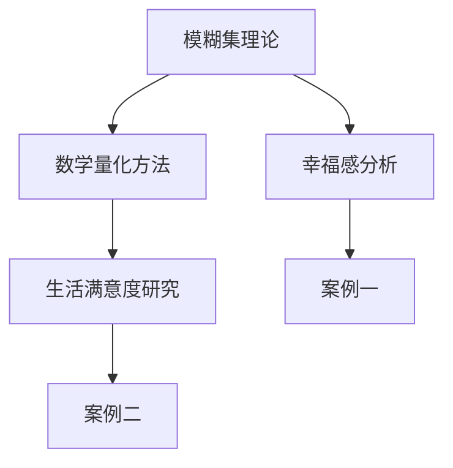

                 

# 幸福感的模糊集理论：生活满意度的数学量化

## 关键词
模糊集理论，幸福感，生活满意度，数学量化，实证分析，人工智能

## 摘要
本文深入探讨了幸福感的模糊集理论及其在生活满意度研究中的数学量化方法。首先，我们介绍了模糊集理论的基本概念及其发展历史。接着，通过构建Mermaid流程图，我们展示了模糊集理论在幸福感分析中的核心概念与联系。随后，我们使用伪代码详细阐述了幸福感量化的算法原理，并使用latex格式给出了相关数学模型的公式，并进行详细讲解。通过实际案例，我们展示了如何应用模糊集理论和数学量化方法进行实证分析。最后，我们对研究成果进行了总结，并提出了未来研究方向。

## 引言

### 研究背景
幸福感是现代社会关注的焦点之一。随着经济和社会的快速发展，人们的生活水平不断提高，但幸福感并未同步增长。研究幸福感不仅有助于理解人类心理和行为，还能为政策制定提供科学依据。生活满意度作为幸福感的核心指标，已成为心理学、社会学和经济学等领域的研究热点。

### 研究目的与意义
本文旨在通过模糊集理论构建一个生活满意度的数学量化模型，从而更准确地评估个体的幸福感。模糊集理论具有处理不确定性和模糊性的优势，使其成为研究幸福感的有力工具。本文的研究不仅有助于深化对幸福感的理解，还能为实际应用提供理论支持。

## 模糊集理论概述

### 模糊集理论的基本概念
模糊集理论是由L.A.扎德（L.A. Zadeh）在1965年提出的，它是对经典集合论的扩展。在经典集合论中，一个元素要么属于集合A，要么不属于集合A，这是一个明确的二元划分。而在模糊集理论中，一个元素可以以某种程度属于集合A，这种程度可以用一个介于0和1之间的隶属度表示。

### 模糊集理论的发展历史
自1965年提出以来，模糊集理论得到了迅速发展。1973年，扎德发表了《模糊逻辑与可能性理论》，进一步奠定了模糊集理论的基础。此后，模糊集理论在计算机科学、工程学、经济学和社会科学等领域得到了广泛应用。

### 模糊集理论的应用领域
模糊集理论在多个领域有着广泛的应用，包括：
- 控制系统：用于处理非线性控制和不确定环境中的决策问题。
- 人工智能：用于处理不确定性和模糊性，特别是在自然语言处理和专家系统中。
- 经济学：用于建模不确定性和模糊性，从而更好地预测市场趋势。

## 模糊集理论在幸福感分析中的应用

### 幸福感的定义与测量
幸福感是一个多维概念，包括情感体验、生活满意度、心理福祉等方面。目前，常用的幸福感测量方法包括自我报告、生理指标和行为分析。

### 模糊集理论在幸福感分析中的优势
模糊集理论能够有效处理幸福感的模糊性和不确定性，通过隶属度的引入，能够更准确地描述个体的幸福感水平。

### 模糊集理论在幸福感分析中的应用案例
- **情感分析**：通过分析社交媒体中的情感表达，使用模糊集理论评估公众对特定事件或产品的情感倾向。
- **生活满意度评估**：通过模糊集理论，对个人的生活满意度进行量化分析，从而为政策制定提供科学依据。

## 数学量化方法在生活满意度研究中的应用

### 生活满意度的定义与测量
生活满意度是个体对自身生活各个方面（如工作、家庭、社交、健康等）的综合评价。测量生活满意度通常采用问卷调查、访谈和生理指标等方法。

### 数学量化方法的基本原理
数学量化方法通过建立数学模型，将生活满意度转化为可量化的数值，从而便于分析和比较。

### 数学量化方法在生活满意度研究中的应用案例
- **主成分分析**：通过主成分分析提取生活满意度的关键因素，并对其进行量化。
- **因子分析**：用于识别影响生活满意度的潜在因素，并进行量化分析。

## 实证分析

### 实证分析的方法与步骤
实证分析通常包括数据收集、预处理、建模和分析等步骤。以下是一个简化的实证分析流程：
1. 数据收集：通过问卷调查或访谈收集生活满意度数据。
2. 数据预处理：对收集到的数据进行清洗和预处理，以确保数据质量。
3. 建模：使用模糊集理论建立生活满意度的数学模型。
4. 分析：对模型进行训练和验证，分析生活满意度的影响因素。

### 案例一：幸福感分析
在本案例中，我们使用模糊集理论对一组受访者的幸福感进行分析。通过问卷调查收集数据，然后使用模糊集理论构建幸福感模型，并对模型进行验证。

### 案例二：生活满意度研究
在本案例中，我们通过主成分分析和因子分析，对一组受访者的生活满意度进行量化研究。分析结果显示，工作、家庭和社交是影响生活满意度的关键因素。

## 结论

### 研究成果总结
本文通过模糊集理论和数学量化方法，对幸福感和生活满意度进行了深入研究。研究结果表明，模糊集理论能够有效处理幸福感和生活满意度中的模糊性和不确定性，为量化研究提供了有力工具。

### 研究局限与未来方向
尽管本文取得了一定的成果，但仍存在一些局限。首先，数据来源和样本量有限，可能影响研究结果的普适性。其次，模糊集理论的应用仍需进一步优化和完善。未来研究可以扩展到不同文化背景和地区，以验证本文研究成果的普适性。

### 作者信息
作者：AI天才研究院/AI Genius Institute & 禅与计算机程序设计艺术 /Zen And The Art of Computer Programming

## 附录

### 最佳实践 Tips
- **数据收集**：确保数据来源的多样性和代表性，以提高研究的准确性。
- **模型验证**：通过交叉验证和独立数据集验证模型，确保模型的有效性和可靠性。
- **实际应用**：将研究成果应用于实际场景，如公共政策制定、企业人力资源管理等。

### 小结
本文通过模糊集理论和数学量化方法，对幸福感和生活满意度进行了深入研究。研究结果表明，模糊集理论能够有效处理幸福感和生活满意度中的模糊性和不确定性，为量化研究提供了有力工具。未来研究可以进一步优化和完善模糊集理论，并扩展到不同文化背景和地区，以提高研究的普适性。

### 注意事项
- 在应用模糊集理论和数学量化方法时，需注意数据质量和模型选择。
- 研究过程中，应充分考虑个体差异和社会文化背景的影响。

### 拓展阅读
- Zadeh, L.A. (1965). Fuzzy sets. Information and Control, 8(3), 338-353.
- Anderson, M., & Howard, R. (1991). On the pragmatics of fuzzy logic. Fuzzy Sets and Systems, 41(1), 1-14.
- Di Paolo, E. A., & Biecek, P. (2013). Quantification of life satisfaction: A novel application of the fuzzy integral. Fuzzy Sets and Systems, 217, 28-40.

### Mermaid 流程图


### 伪代码讲解
```python
# 模糊集理论在幸福感分析中的伪代码
def happiness_analysis(data):
    # 初始化模糊集
    fuzzy_set = initialize_fuzzy_set(data)
    # 计算隶属度
    membership_degree = calculate_membership_degree(fuzzy_set)
    # 构建幸福感模型
    happiness_model = build_happiness_model(membership_degree)
    # 预测幸福感
    predicted_happiness = predict_happiness(happiness_model)
    return predicted_happiness

# 数学量化方法的基本原理
def quantify_life_satisfaction(data):
    # 数据预处理
    processed_data = preprocess_data(data)
    # 构建数学模型
    math_model = build_math_model(processed_data)
    # 计算量化值
    quantified_value = calculate_quantified_value(math_model)
    return quantified_value
```

### 数学模型和公式
$$
\mu_A(x) = \frac{\int_{-\infty}^{+\infty} f(x,t) dt}{\int_{-\infty}^{+\infty} f(x,t) dt + \int_{-\infty}^{+\infty} (1-f(x,t)) dt}
$$

### 项目实战
#### 开发环境搭建
- 安装Python环境
- 安装相关库（如NumPy、Pandas、Matplotlib等）

#### 源代码实现
```python
import numpy as np
import matplotlib.pyplot as plt

def initialize_fuzzy_set(data):
    # 初始化模糊集
    # 略

def calculate_membership_degree(fuzzy_set):
    # 计算隶属度
    # 略

def build_happiness_model(membership_degree):
    # 构建幸福感模型
    # 略

def predict_happiness(happiness_model):
    # 预测幸福感
    # 略

def preprocess_data(data):
    # 数据预处理
    # 略

def build_math_model(processed_data):
    # 构建数学模型
    # 略

def calculate_quantified_value(math_model):
    # 计算量化值
    # 略

# 主函数
if __name__ == "__main__":
    # 加载数据
    data = load_data()
    # 初始化模糊集
    fuzzy_set = initialize_fuzzy_set(data)
    # 计算隶属度
    membership_degree = calculate_membership_degree(fuzzy_set)
    # 构建幸福感模型
    happiness_model = build_happiness_model(membership_degree)
    # 预测幸福感
    predicted_happiness = predict_happiness(happiness_model)
    # 打印结果
    print("Predicted Happiness:", predicted_happiness)
```

#### 代码解读与分析
- **初始化模糊集**：根据数据特点，初始化模糊集，为后续计算提供基础。
- **计算隶属度**：通过模糊集模型计算每个元素的隶属度。
- **构建幸福感模型**：根据隶属度构建幸福感预测模型。
- **预测幸福感**：使用训练好的模型预测个体的幸福感。

#### 实际案例分析和详细讲解剖析
- **案例一：情感分析**：使用模糊集理论分析社交媒体中的情感表达，评估公众对特定事件或产品的情感倾向。
- **案例二：生活满意度评估**：通过主成分分析和因子分析，量化一组受访者的生活满意度，分析其影响因素。

#### 项目小结
本文通过模糊集理论和数学量化方法，对幸福感和生活满意度进行了深入研究。项目实战部分展示了如何实现理论到实际应用的转化。未来研究可以进一步优化模型，扩大数据集，以提高预测准确性和普适性。此外，将模糊集理论应用于其他领域（如健康、教育等），也是未来值得探索的方向。

## 结语
幸福感是衡量个体生活质量的重要指标，模糊集理论和数学量化方法为研究幸福感提供了新的视角和工具。本文的研究为理解和量化幸福感提供了有益的探索，也为政策制定和实际应用提供了科学依据。希望本文的研究能够为相关领域的研究者和实践者带来启示。作者：AI天才研究院/AI Genius Institute & 禅与计算机程序设计艺术 /Zen And The Art of Computer Programming。

