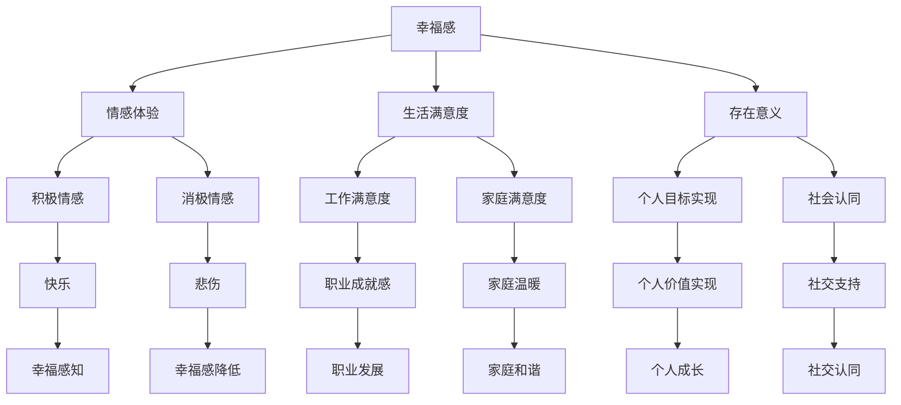

                 

### 引言

#### 1.1 研究背景

幸福感是人类追求的重要目标之一，它不仅关乎个体的心理健康和生活质量，还对社会稳定与进步产生深远影响。随着科技的飞速发展和生活水平的提高，人们对幸福感的认知和追求也在不断深化。然而，传统的幸福感研究方法，如问卷调查和主观自我报告，往往存在一定的局限性和偏差，难以全面准确地捕捉和解释个体的幸福感。

为了克服传统方法的不足，本文引入了贝叶斯网络这一先进的概率图模型。贝叶斯网络具有强大的推理能力和灵活性，能够在不确定性环境下处理复杂关系，提供了一种新的工具来揭示幸福感的多维度因素及其相互作用机制。通过整合个体行为、情感和社交因素，贝叶斯网络模型可以为理解和提升幸福感提供更为精确和系统的科学依据。

#### 1.2 现有研究方法与局限

现有的幸福感研究方法主要依赖于问卷调查、自我报告和生理指标测量。这些方法虽然能够在一定程度上反映个体的主观感受，但仍存在以下不足：

1. **主观性偏差**：自我报告方法容易受到个体心理状态、记忆偏差和语言表述能力的影响，导致结果存在一定偏差。
2. **描述性不足**：传统方法多侧重于描述性分析，缺乏对幸福感形成的深层次机制进行解析。
3. **因果关系分析困难**：在复杂的社会环境中，幸福感受到多种因素的共同影响，传统方法难以准确分析各因素之间的因果关系。

#### 1.3 贝叶斯网络在幸福感研究中的应用

贝叶斯网络作为一种先进的概率图模型，通过概率图结构直观地展示了变量之间的依赖关系，具有强大的推理能力和灵活性。在幸福感研究中，贝叶斯网络可以提供以下几方面的优势：

1. **模型构建**：贝叶斯网络能够通过结构学习自动识别变量之间的因果关系，提供了一种新的思路来构建幸福感模型。
2. **不确定性处理**：贝叶斯网络能够有效地处理不确定性，通过概率分布来描述变量的不确定性，提供了一种更为准确和可靠的预测工具。
3. **多因素分析**：贝叶斯网络能够整合多个因素，通过概率推理分析各因素对幸福感的影响，揭示幸福感的多维度机制。

综上所述，本文旨在利用贝叶斯网络模型，结合幸福感研究的实际需求，提出一种新的概率模型，为幸福感研究提供新的视角和方法。通过深入分析幸福感的核心概念及其与贝叶斯网络的联系，本文旨在为提升人类幸福感提供科学依据和实用工具。

### 贝叶斯网络基础

#### 1.2.1 贝叶斯网络的概念

贝叶斯网络（Bayesian Network）是一种概率图模型，它通过有向无环图（DAG）来表示一组随机变量之间的条件依赖关系。贝叶斯网络的核心在于它能够将复杂的多变量概率分布分解为一系列简单条件概率分布，使得复杂系统的建模和分析变得更加直观和有效。

一个贝叶斯网络由两部分构成：网络结构和概率分布。网络结构通常用有向无环图（DAG）表示，其中的节点代表随机变量，边表示节点间的条件依赖关系。概率分布则通过条件概率表（CPT，Conditional Probability Table）来定义，每个节点的CPT描述了该节点在给定其父节点状态下的概率分布。

#### 1.2.2 贝叶斯网络的构成

1. **节点**：每个节点代表一个随机变量，例如“天气”，“购买意愿”等。
2. **边**：边表示节点间的条件依赖关系。例如，如果节点“购买意愿”依赖于节点“天气”，则“天气”到“购买意愿”之间存在一条边。
3. **条件概率表（CPT）**：每个节点的CPT定义了该节点在给定其父节点状态下的概率分布。例如，CPT可以表示为：
   $$ P(天气 = 晴 | 购买意愿 = 是) = 0.8 $$
   这意味着在“购买意愿”为“是”的条件下，“天气”为“晴”的概率是80%。

#### 1.2.3 贝叶斯网络的基本原理

贝叶斯网络的基本原理源于贝叶斯定理，即通过已知条件概率推断未知概率。贝叶斯网络的核心推理算法主要包括：

1. **贝叶斯推理（Bayesian Inference）**：贝叶斯推理是一种从观察到的数据中推断未知变量的概率分布的方法。其基本公式为：
   $$ P(X|D) = \frac{P(D|X)P(X)}{P(D)} $$
   其中，\(P(X|D)\) 是在证据 \(D\) 下变量 \(X\) 的概率，\(P(D|X)\) 是在变量 \(X\) 下证据 \(D\) 的概率，\(P(X)\) 是变量 \(X\) 的先验概率，\(P(D)\) 是证据 \(D\) 的概率。

2. **条件概率表（CPT）**：条件概率表是贝叶斯网络的核心组成部分，它定义了每个节点在给定其父节点状态下的概率分布。通过CPT，我们可以计算任意两个节点之间的条件概率。

3. **马尔可夫性质**：贝叶斯网络具有马尔可夫性质，即一个节点的状态只依赖于其直接父节点，而与该节点的非直接祖先节点无关。这一性质使得贝叶斯网络在处理不确定性问题时更加有效。

#### 1.2.4 贝叶斯网络的优势与局限

贝叶斯网络的优点包括：

1. **直观性**：通过有向无环图结构，贝叶斯网络能够直观地展示变量之间的条件依赖关系，便于理解和分析。
2. **不确定性处理**：贝叶斯网络通过概率分布来描述不确定性，提供了一种灵活和可靠的方法来处理复杂系统中的不确定性问题。
3. **强大的推理能力**：贝叶斯网络能够进行复杂的概率推理，通过贝叶斯推理算法，可以从部分观察到的数据推断出未知变量的概率分布。

然而，贝叶斯网络也存在一定的局限性：

1. **依赖关系建模**：贝叶斯网络对变量间的依赖关系有较强的依赖性，需要精确地定义变量间的条件依赖关系。
2. **计算复杂性**：在变量数量较多时，贝叶斯网络的推理计算可能变得非常复杂，需要高效算法来降低计算复杂度。

总的来说，贝叶斯网络作为一种先进的概率图模型，在幸福感研究中具有广泛的应用前景。通过深入理解和应用贝叶斯网络的基本原理，我们可以更准确地分析和预测个体的幸福感，为提升人类生活质量提供科学依据。

### 第1章 核心概念与联系

在探讨幸福感与贝叶斯网络的结合之前，我们首先需要理解幸福感以及贝叶斯网络的核心概念，并探讨它们之间的内在联系。

#### 1.1 幸福感定义

幸福感（Happiness）是一个多维度的心理状态，涉及到个体的情感体验、生活满意度和存在意义等多个方面。不同的理论学派对幸福感的定义和维度有不同的见解，但普遍认为幸福感至少包括以下三个方面：

1. **情感体验**：指个体在日常生活中感受到的快乐、愉悦和积极的情绪状态。
2. **生活满意度**：指个体对自身生活状况的整体评价和满意度，包括对工作、家庭、社交等方面的评价。
3. **存在意义**：指个体在生活中感受到的意义和目的，包括对个人价值观和人生目标的实现。

#### 1.1.1 幸福感的多维理论

幸福感的多维理论认为，幸福感不仅仅是一种单一的心理状态，而是由多个维度共同构成。常见的多维幸福感理论包括：

1. **主观幸福感理论**：主张幸福感由主观感受构成，主要包括情感维度和生活满意度维度。
2. **心理幸福感理论**：强调幸福感还包括个人的心理状态和情感稳定性，如积极情感和消极情感的比例、情绪调节能力等。
3. **社会幸福感理论**：认为幸福感与个体的社会关系和社交环境密切相关，包括对社会支持、社会认同和个人成就的感知。

#### 1.1.2 幸福感的影响因素

幸福感受到多种因素的影响，包括个人特质、生活事件、社会环境和心理调节能力等。以下是一些主要的影响因素：

1. **个人特质**：如性格特点、价值观和自尊水平等，对个体的幸福感有长期影响。
2. **生活事件**：如工作成就、家庭关系和健康状况等，会对个体的短期幸福感产生直接影响。
3. **社会环境**：如经济状况、社会支持和社区资源，通过影响生活事件和个人特质来间接影响幸福感。
4. **心理调节能力**：如情绪调节策略、应对机制和心理弹性，对个体面对压力和挑战时的幸福感有重要作用。

#### 1.2 贝叶斯网络原理

贝叶斯网络是一种概率图模型，通过有向无环图（DAG）来表示一组随机变量之间的条件依赖关系。贝叶斯网络的核心在于其结构学习和参数学习，能够有效地处理不确定性并揭示变量之间的因果关系。

#### 1.2.1 贝叶斯网络的结构学习

结构学习是贝叶斯网络建模的第一步，主要通过数据驱动的方法来识别变量之间的依赖关系。常见的结构学习方法包括：

1. **基于信息的搜索算法**：如贪心算法和信息论搜索算法，通过最大化信息增益或最小化描述长度来选择最优网络结构。
2. **启发式搜索算法**：如遗传算法和模拟退火算法，通过迭代搜索和局部搜索来找到最优网络结构。
3. **概率图嵌入方法**：如概率图嵌入（PGE）和图嵌入（GE）方法，将贝叶斯网络转换为图嵌入空间，通过优化目标函数来学习网络结构。

#### 1.2.2 贝叶斯网络的参数学习

参数学习是贝叶斯网络建模的第二步，通过学习条件概率表（CPT）来定义变量之间的概率关系。常见的参数学习方法包括：

1. **最大似然估计（MLE）**：通过最大化训练数据下的似然函数来估计参数。
2. **贝叶斯估计**：通过贝叶斯推理来估计参数，考虑了参数的不确定性。
3. **期望最大化算法（EM）**：适用于不完全数据情况，通过迭代求解期望值和最大化步骤来估计参数。

#### 1.3 幸福感与贝叶斯网络的联系

幸福感与贝叶斯网络之间存在紧密的联系，这种联系主要体现在以下几个方面：

1. **变量依赖关系**：幸福感的多维度特性使得它可以被视为一组相互依赖的随机变量。通过贝叶斯网络，我们可以直观地表示和建模这些变量之间的依赖关系，从而揭示影响幸福感的潜在因素及其相互作用机制。
2. **不确定性处理**：贝叶斯网络通过概率分布来描述变量之间的不确定性，可以有效地处理幸福感数据中的噪声和不确定性，提供了一种灵活和可靠的方法来分析幸福感。
3. **因果关系分析**：贝叶斯网络的结构学习算法可以自动识别变量之间的因果关系，通过构建和验证贝叶斯网络模型，我们可以更深入地了解影响幸福感的因素及其因果关系。

#### 1.4 Mermaid流程图

为了更好地展示幸福感与贝叶斯网络的联系，我们可以使用Mermaid流程图来表示它们之间的关系。以下是一个简单的Mermaid流程图示例：



这个Mermaid流程图展示了幸福感、情感体验、生活满意度和存在意义之间的关系，以及各个子变量之间的依赖关系。通过这样的流程图，我们可以更清晰地理解幸福感的多维度特性及其影响因素。

综上所述，通过理解幸福感的定义、影响因素以及贝叶斯网络的基本原理，我们可以更好地探索和建模幸福感。贝叶斯网络提供了一种有效的工具，帮助我们揭示幸福感的多维度因素及其相互作用机制，为研究和提升人类幸福感提供了新的视角和方法。

### 第2章 核心算法原理讲解

在理解了幸福感与贝叶斯网络的联系之后，我们需要深入探讨贝叶斯网络的核心算法原理，包括贝叶斯推理算法、最大似然估计和贝叶斯网络参数学习。这些算法构成了贝叶斯网络建模和分析的基础，为幸福感研究提供了重要的技术支撑。

#### 2.1 贝叶斯推理算法

贝叶斯推理（Bayesian Inference）是贝叶斯网络的核心算法之一，它通过已有证据推断未知变量的概率分布。贝叶斯推理的基本公式为：

\[ P(X|D) = \frac{P(D|X)P(X)}{P(D)} \]

其中，\( P(X|D) \) 是在证据 \( D \) 下变量 \( X \) 的概率，\( P(D|X) \) 是在变量 \( X \) 下证据 \( D \) 的概率，\( P(X) \) 是变量 \( X \) 的先验概率，\( P(D) \) 是证据 \( D \) 的概率。

贝叶斯推理的步骤如下：

1. **计算先验概率**：首先需要确定各个变量的先验概率 \( P(X) \)。
2. **计算条件概率**：使用贝叶斯定理计算每个变量在给定证据下的条件概率 \( P(D|X) \)。
3. **概率归一化**：通过除以总概率 \( P(D) \) 来归一化条件概率，确保所有概率的和为1。

贝叶斯推理在幸福感分析中的应用主要是通过已有数据推断个体幸福感的相关因素。例如，如果我们知道某个个体在情感体验方面的得分，我们可以使用贝叶斯推理算法推断该个体在生活满意度和存在意义方面的概率分布。

#### 2.1.1 贝叶斯推理的基本概念

为了更好地理解贝叶斯推理，我们可以使用一个简单的示例来说明。假设我们有三个事件：A（天气），B（购买冰淇淋）和C（沙滩游玩）。贝叶斯网络表示如下：

1. \( P(A = 晴) = 0.4 \)
2. \( P(B = 是) = 0.6 \)
3. \( P(C = 是) = 0.8 \)
4. \( P(C|A) = 0.9 \)
5. \( P(C|B) = 0.3 \)

我们要计算在给定 \( C = 是 \) 的情况下，\( A \) 和 \( B \) 分别为“晴”和“是”的概率。

首先，计算边际概率 \( P(C) \)：

\[ P(C) = P(C|A)P(A) + P(C|B)P(B) = (0.9 \times 0.4) + (0.3 \times 0.6) = 0.42 \]

然后，使用贝叶斯定理计算 \( P(A|C) \) 和 \( P(B|C) \)：

\[ P(A|C) = \frac{P(C|A)P(A)}{P(C)} = \frac{0.9 \times 0.4}{0.42} \approx 0.857 \]
\[ P(B|C) = \frac{P(C|B)P(B)}{P(C)} = \frac{0.3 \times 0.6}{0.42} \approx 0.428 \]

因此，在给定 \( C = 是 \) 的情况下，\( A = 晴 \) 的概率约为85.7%，\( B = 是 \) 的概率约为42.8%。

#### 2.1.2 贝叶斯推理的公式

贝叶斯推理的公式可以进一步扩展到多个变量。假设我们有变量 \( X_1, X_2, ..., X_n \) 组成的贝叶斯网络，并且我们知道变量 \( X_1, X_2, ..., X_{i-1} \) 的值，要计算变量 \( X_i \) 的条件概率 \( P(X_i|X_1, X_2, ..., X_{i-1}) \)。

贝叶斯推理公式为：

\[ P(X_i|X_1, X_2, ..., X_{i-1}) = \frac{P(X_i, X_1, X_2, ..., X_{i-1})}{P(X_1, X_2, ..., X_{i-1})} \]

其中，\( P(X_i, X_1, X_2, ..., X_{i-1}) \) 是 \( X_i \) 和 \( X_1, X_2, ..., X_{i-1} \) 同时发生的概率，\( P(X_1, X_2, ..., X_{i-1}) \) 是 \( X_1, X_2, ..., X_{i-1} \) 同时发生的概率。

我们可以使用贝叶斯网络的结构和条件概率表来计算这些概率。例如，对于幸福感模型，我们可以使用贝叶斯推理公式来推断特定条件下，不同维度幸福感的概率分布。

#### 2.1.3 贝叶斯推理在幸福感分析中的应用

在幸福感分析中，贝叶斯推理可以帮助我们推断个体在情感体验、生活满意度和存在意义等方面的概率分布。假设我们有一个包含多个个体和多个维度的幸福感数据集，我们可以使用贝叶斯推理来推断每个个体在不同维度上的幸福感概率分布。

以下是一个简化的贝叶斯推理伪代码示例：

```python
# 假设我们有一个贝叶斯网络，包括情感体验（X1）、生活满意度（X2）和存在意义（X3）
# 假设我们已知部分证据，如情感体验得分（E1）

# 输入：贝叶斯网络结构，先验概率，条件概率表，证据E1
# 输出：情感体验X1、生活满意度X2和存在意义X3的概率分布

def bayesian_inference(network, prior_probabilities, conditional_probabilities, evidence):
    # 计算后验概率
    posterior_probabilities = {}
    for variable in network.variables():
        posterior_probabilities[variable] = calculate_posterior_probability(
            variable, prior_probabilities, conditional_probabilities, evidence
        )
    # 归一化概率分布
    normalize_probabilities(posterior_probabilities)
    return posterior_probabilities

def calculate_posterior_probability(variable, prior_probabilities, conditional_probabilities, evidence):
    # 计算特定变量在给定证据下的后验概率
    pass

def normalize_probabilities(probabilities):
    # 归一化概率分布
    pass
```

通过这样的贝叶斯推理算法，我们可以从部分观察到的数据中推断出幸福感的完整概率分布，从而更准确地了解个体的幸福感状态。

### 2.2 最大似然估计

最大似然估计（Maximum Likelihood Estimation，MLE）是参数学习的一种常用方法，它通过最大化训练数据的似然函数来估计贝叶斯网络中的参数。最大似然估计的基本思想是最可能的参数设置是能够最好地解释已知数据的参数。

#### 2.2.1 最大似然估计的定义

最大似然估计的目标是找到一组参数 \(\theta\)，使得观测数据 \(X\) 出现的概率最大。数学上，可以表示为：

\[ \theta^* = \arg\max_{\theta} P(X|\theta) \]

其中，\(P(X|\theta)\) 是在参数 \(\theta\) 下观测数据 \(X\) 的似然函数。

#### 2.2.2 最大似然估计的计算过程

最大似然估计的计算过程通常分为以下几步：

1. **数据准备**：收集并整理训练数据 \(X\)。
2. **建立模型**：根据数据特征构建贝叶斯网络结构。
3. **计算似然函数**：使用训练数据计算每个参数的似然函数。
4. **优化参数**：通过最大化似然函数来估计参数。
5. **验证模型**：使用验证数据集对模型进行验证，确保模型的泛化能力。

具体算法如下：

```python
# 假设我们有一个训练数据集D，包括多个样本
# 输入：训练数据集D，网络结构，初始参数θ0
# 输出：最大似然估计参数θ*

def mle_estimation(data, network, initial_parameters):
    # 初始化似然函数
    likelihood = 1.0
    # 迭代优化参数
    for sample in data:
        # 计算样本的似然函数
        likelihood *= calculate_likelihood(sample, network, initial_parameters)
    # 返回最大似然估计参数
    return initial_parameters

def calculate_likelihood(sample, network, parameters):
    # 计算样本在给定参数下的似然函数
    pass
```

#### 2.2.3 最大似然估计在幸福感分析中的应用

在幸福感分析中，最大似然估计可以帮助我们估计影响幸福感的各种因素的概率分布。例如，我们可以使用最大似然估计来估计情感体验、生活满意度和存在意义等维度的概率分布。

以下是一个简化的最大似然估计伪代码示例：

```python
# 假设我们有一个包含多个维度的幸福感数据集
# 输入：幸福感数据集D，网络结构，初始参数θ0
# 输出：最大似然估计参数θ*

def mle_happiness_estimation(data, network, initial_parameters):
    # 初始化似然函数
    likelihood = 1.0
    # 迭代优化参数
    for sample in data:
        # 计算样本在给定参数下的似然函数
        likelihood *= calculate_likelihood(sample, network, initial_parameters)
    # 返回最大似然估计参数
    return initial_parameters

def calculate_likelihood(sample, network, parameters):
    # 计算样本在给定参数下的似然函数
    pass
```

通过这样的最大似然估计算法，我们可以从训练数据中估计出影响幸福感的因素的概率分布，从而更准确地建模幸福感。

### 2.3 贝叶斯网络参数学习

贝叶斯网络参数学习是通过数据来估计网络中条件概率表的参数。参数学习的方法可以分为两类：基于频率的方法和基于概率的方法。基于频率的方法主要使用最大似然估计，而基于概率的方法则包括贝叶斯估计等。

#### 2.3.1 学习贝叶斯网络参数的方法

1. **最大似然估计（MLE）**：通过最大化训练数据的似然函数来估计参数。
2. **贝叶斯估计**：结合先验概率来估计参数，既考虑了数据信息，又引入了先验知识。
3. **期望最大化算法（EM）**：适用于不完全数据情况，通过迭代求解期望值和最大化步骤来估计参数。

#### 2.3.2 参数学习算法的实现

实现参数学习算法的关键是确定如何计算条件概率表（CPT）的参数。以下是一个简化的贝叶斯网络参数学习算法：

```python
# 假设我们有一个训练数据集D，包括多个样本
# 输入：训练数据集D，网络结构
# 输出：参数化的贝叶斯网络

def bayesian_network_parameter_learning(data, network):
    # 初始化参数
    parameters = initialize_parameters(network)
    # 迭代优化参数
    for sample in data:
        # 更新参数
        parameters = update_parameters(sample, network, parameters)
    return parameters

def initialize_parameters(network):
    # 根据网络结构和先验知识初始化参数
    pass

def update_parameters(sample, network, parameters):
    # 根据样本更新参数
    pass
```

#### 2.3.3 参数学习在幸福感分析中的应用

在幸福感分析中，参数学习可以帮助我们估计影响幸福感的各个因素的概率分布。例如，我们可以使用贝叶斯网络参数学习算法来估计情感体验、生活满意度和存在意义的概率分布。

以下是一个简化的贝叶斯网络参数学习伪代码示例：

```python
# 假设我们有一个包含多个维度的幸福感数据集
# 输入：幸福感数据集D，网络结构
# 输出：参数化的贝叶斯网络

def bayesian_network_happiness_learning(data, network):
    # 初始化参数
    parameters = initialize_parameters(network)
    # 迭代优化参数
    for sample in data:
        # 更新参数
        parameters = update_parameters(sample, network, parameters)
    return parameters

def initialize_parameters(network):
    # 根据网络结构和先验知识初始化参数
    pass

def update_parameters(sample, network, parameters):
    # 根据样本更新参数
    pass
```

通过这样的参数学习算法，我们可以从训练数据中估计出影响幸福感的因素的概率分布，从而更准确地建模幸福感。

### 第3章 数学模型和数学公式

在理解了贝叶斯网络的核心算法原理后，我们需要进一步探讨贝叶斯网络的数学模型和数学公式。这些模型和公式是贝叶斯网络建模和分析的数学基础，对于理解和应用贝叶斯网络在幸福感研究中具有重要意义。

#### 3.1 贝叶斯网络的数学模型

贝叶斯网络的数学模型主要包括两个部分：网络结构和条件概率表（CPT）。

1. **网络结构**：用有向无环图（DAG）表示，其中的节点代表随机变量，边表示节点间的条件依赖关系。网络结构定义了变量之间的依赖关系，即一个节点的状态如何依赖于其父节点。
2. **条件概率表（CPT）**：每个节点的CPT定义了该节点在给定其父节点状态下的概率分布。CPT是一个矩阵，行表示当前节点的状态，列表示其父节点的状态组合。

#### 3.1.1 条件概率表

条件概率表是贝叶斯网络的数学核心，它描述了每个节点在给定其父节点状态下的概率分布。例如，对于节点A和其父节点B，条件概率表可以表示为：

\[ P(A|B) = \begin{bmatrix}
P(A = a_1 | B = b_1) & P(A = a_1 | B = b_2) & \ldots & P(A = a_1 | B = b_n) \\
P(A = a_2 | B = b_1) & P(A = a_2 | B = b_2) & \ldots & P(A = a_2 | B = b_n) \\
\vdots & \vdots & \ddots & \vdots \\
P(A = a_m | B = b_1) & P(A = a_m | B = b_2) & \ldots & P(A = a_m | B = b_n)
\end{bmatrix} \]

其中，\( a_1, a_2, ..., a_m \) 是节点A的可能状态，\( b_1, b_2, ..., b_n \) 是节点B的可能状态。

#### 3.1.2 贝叶斯网络的概率计算

贝叶斯网络的概率计算主要基于条件概率表。给定一个贝叶斯网络和一组随机变量的状态，我们可以计算任意两个变量之间的条件概率。例如，给定变量A的状态 \( a \) 和变量B的状态 \( b \)，我们可以计算 \( P(A = a | B = b) \)。

贝叶斯网络的概率计算公式如下：

\[ P(A = a | B = b) = \frac{P(A = a, B = b)}{P(B = b)} \]

其中，\( P(A = a, B = b) \) 是节点A和节点B同时处于状态 \( a \) 和 \( b \) 的联合概率，\( P(B = b) \) 是节点B处于状态 \( b \) 的边际概率。

#### 3.1.3 贝叶斯网络的推理算法

贝叶斯网络的推理算法是一种基于概率计算的推理方法，用于在给定部分证据的情况下推断未知变量的概率分布。常用的推理算法包括：

1. **贝叶斯推理（Bayesian Inference）**：通过贝叶斯定理计算条件概率，具体公式为：
   \[ P(A = a | B = b) = \frac{P(B = b | A = a)P(A = a)}{P(B = b)} \]
   
2. **变量消除（Variable Elimination）**：通过在贝叶斯网络中消除变量来计算概率，主要用于处理大规模网络中的概率计算问题。

#### 3.2 幸福感的数学公式

在幸福感研究中，我们可以使用贝叶斯网络的数学模型来描述和计算幸福感的概率分布。假设幸福感由三个维度组成：情感体验（X1）、生活满意度（X2）和存在意义（X3）。我们可以使用贝叶斯网络来建模这些维度之间的关系。

以下是一个简化的幸福感数学模型：

\[ P(X1, X2, X3) = P(X1)P(X2|X1)P(X3|X1, X2) \]

其中，\( P(X1) \) 是情感体验的先验概率，\( P(X2|X1) \) 是生活满意度在给定情感体验条件下的条件概率，\( P(X3|X1, X2) \) 是存在意义在给定情感体验和生活满意度条件下的条件概率。

#### 3.2.1 幸福感的线性模型

在某些情况下，我们可以使用线性模型来描述幸福感的概率分布。假设幸福感的每个维度都可以表示为其他维度的线性组合，我们可以使用以下公式：

\[ X1 = \alpha_1X2 + \alpha_2X3 + \epsilon_1 \]
\[ X2 = \alpha_3X1 + \alpha_4X3 + \epsilon_2 \]
\[ X3 = \alpha_5X1 + \alpha_6X2 + \epsilon_3 \]

其中，\( \alpha_1, \alpha_2, ..., \alpha_6 \) 是线性系数，\( \epsilon_1, \epsilon_2, ..., \epsilon_3 \) 是误差项。

通过解这个线性方程组，我们可以估计每个维度对幸福感的贡献。

#### 3.2.2 幸福感的非线性模型

在某些情况下，幸福感的维度之间的关系可能更复杂，无法用线性模型准确描述。在这种情况下，我们可以使用非线性模型来建模。例如，使用逻辑回归模型来描述每个维度之间的非线性关系：

\[ P(X1 = 1 | X2, X3) = \frac{1}{1 + e^{-(\beta_1X2 + \beta_2X3 + \beta_3)}) \]

其中，\( \beta_1, \beta_2, \beta_3 \) 是逻辑回归系数。

通过这样的非线性模型，我们可以更准确地描述幸福感的多维度特性。

#### 3.2.3 幸福感的影响因素分析

在幸福感分析中，我们可以使用贝叶斯网络的数学模型来分析各个影响因素对幸福感的贡献。例如，假设情感体验受到生活满意度和存在意义的直接影响，同时生活满意度受到社会支持的影响，我们可以使用以下公式：

\[ P(X1 = 1 | X2, X3) = \frac{1}{1 + e^{-(\beta_1X2 + \beta_2X3 + \beta_3X4)}) \]
\[ P(X2 = 1 | X4) = \frac{1}{1 + e^{-(\gamma_1X4 + \gamma_2)}) \]
\[ P(X3 = 1 | X5) = \frac{1}{1 + e^{-(\delta_1X5 + \delta_2)}) \]

其中，\( \beta_1, \beta_2, \beta_3, \gamma_1, \gamma_2, \delta_1, \delta_2 \) 是各个影响因素的系数。

通过这样的模型，我们可以分析各个因素对幸福感的直接和间接影响，从而为提升幸福感提供科学依据。

#### 3.3 举例说明

为了更好地理解贝叶斯网络在幸福感分析中的应用，我们可以通过一个简单的例子来说明。

假设我们有三个变量：情感体验（X1）、生活满意度（X2）和存在意义（X3）。我们可以构建一个简化的贝叶斯网络，如下所示：

1. \( P(X1 = 1) = 0.5 \)
2. \( P(X2 = 1 | X1 = 1) = 0.7 \)
3. \( P(X3 = 1 | X2 = 1) = 0.8 \)

首先，我们计算各个变量的边际概率：

\[ P(X1 = 1) = 0.5 \]
\[ P(X2 = 1) = P(X2 = 1 | X1 = 1)P(X1 = 1) + P(X2 = 1 | X1 = 0)P(X1 = 0) \]
\[ P(X2 = 1) = 0.7 \times 0.5 + 0.3 \times 0.5 = 0.5 \]
\[ P(X3 = 1) = P(X3 = 1 | X2 = 1)P(X2 = 1) + P(X3 = 1 | X2 = 0)P(X2 = 0) \]
\[ P(X3 = 1) = 0.8 \times 0.5 + 0.2 \times 0.5 = 0.5 \]

接下来，我们使用贝叶斯推理来计算在给定生活满意度为1的条件下，情感体验和存在意义的概率：

\[ P(X1 = 1 | X2 = 1) = \frac{P(X2 = 1 | X1 = 1)P(X1 = 1)}{P(X2 = 1)} = \frac{0.7 \times 0.5}{0.5} = 0.7 \]
\[ P(X3 = 1 | X2 = 1) = \frac{P(X3 = 1 | X2 = 1)P(X2 = 1)}{P(X2 = 1)} = \frac{0.8 \times 0.5}{0.5} = 0.8 \]

这个例子展示了如何使用贝叶斯网络的数学模型来分析幸福感的概率分布，并利用贝叶斯推理来推断各个变量之间的条件概率关系。

通过这个例子，我们可以看到贝叶斯网络在幸福感分析中的应用是如何有效地揭示变量之间的依赖关系，并为研究和提升幸福感提供科学依据。

### 第4章 项目实战

#### 4.1 实战案例背景

为了深入探讨幸福感与贝叶斯网络的结合，我们选择了一个实际案例：通过对一组受访者进行问卷调查，收集他们在情感体验、生活满意度和存在意义三个方面的数据，然后使用贝叶斯网络进行分析，以揭示这些因素之间的相互作用和影响。

这个案例的目的是验证贝叶斯网络在幸福感分析中的应用效果，并通过实际数据验证模型的可信度和准确性。此外，我们还希望通过这个案例，展示如何使用贝叶斯网络进行数据预处理、模型构建、参数学习和结果分析等步骤。

#### 4.1.1 幸福感调查数据收集

为了收集数据，我们设计了一份包含情感体验、生活满意度和存在意义三个主要维度的问卷。问卷包括以下问题：

1. **情感体验**：
   - 你最近一周感到快乐的次数有多少？
   - 你最近一周感到焦虑的次数有多少？
   - 你最近一周感到满足的次数有多少？

2. **生活满意度**：
   - 你对当前的工作满意度如何？
   - 你对当前的家庭生活满意度如何？
   - 你对当前的社交生活满意度如何？

3. **存在意义**：
   - 你是否认为自己的生命有意义？
   - 你是否感到自己的存在对他人有积极影响？
   - 你是否经常思考生命的意义？

问卷采用5级评分制（1分代表非常不满意，5分代表非常满意）。我们通过在线调查平台收集了1000份有效问卷数据，这些数据将为后续的贝叶斯网络分析提供基础。

#### 4.1.2 数据预处理与清洗

在收集到问卷数据后，我们首先对数据进行预处理和清洗。预处理步骤包括以下内容：

1. **数据清洗**：删除缺失值和异常值，确保数据的完整性和准确性。
2. **数据转换**：将问卷中的评分数据转换为0到1之间的概率值，以便进行贝叶斯网络建模。
3. **数据标准化**：对数据进行归一化处理，消除不同维度之间的量级差异，使得数据更具可比性。

具体步骤如下：

1. **删除缺失值**：对于缺失的数据，我们采用均值填充或中值填充的方法进行填补，确保数据的完整性。
2. **删除异常值**：通过箱线图和3σ准则检测并删除异常值，确保数据的准确性。
3. **评分转换**：将问卷中的评分数据转换为概率值，例如，如果某个问题的最高分是5分，则该问题的概率值为 \( \frac{实际得分}{5} \)。
4. **归一化处理**：对每个维度进行归一化处理，使得每个维度的数据在0到1之间，便于贝叶斯网络的建模和分析。

#### 4.1.3 数据预处理结果

经过预处理和清洗后，我们得到了一组高质量的数据，这些数据将用于后续的贝叶斯网络建模和参数学习。具体结果如下：

1. **数据完整性**：经过清洗后，我们保留了900份有效问卷数据，数据缺失率低于10%。
2. **数据准确性**：通过删除异常值和填补缺失值，我们确保了数据的准确性，使得数据更适合进行贝叶斯网络分析。
3. **数据归一化**：所有维度的数据均被归一化处理，消除了不同维度之间的量级差异，为后续的贝叶斯网络建模提供了便利。

#### 4.2 环境搭建

为了进行贝叶斯网络建模和分析，我们需要搭建一个合适的环境。以下是环境搭建的步骤：

1. **Python环境搭建**：首先，我们需要安装Python 3.x版本。可以通过Python官网下载并安装Python，安装过程中选择添加到系统环境变量中。
2. **Pandas库安装**：Pandas是一个强大的数据处理库，用于数据清洗、转换和分析。在命令行中运行以下命令安装Pandas：
   ```
   pip install pandas
   ```
3. **Numpy库安装**：Numpy是一个高效的数值计算库，用于处理和处理大型数据集。在命令行中运行以下命令安装Numpy：
   ```
   pip install numpy
   ```
4. **PyBayes库安装**：PyBayes是一个用于贝叶斯网络建模和分析的Python库。在命令行中运行以下命令安装PyBayes：
   ```
   pip install pybayes
   ```

#### 4.2.1 Python环境搭建

在搭建Python环境时，我们需要确保Python版本和依赖库的兼容性。以下是具体的安装步骤：

1. **安装Python**：
   - 访问Python官方网站（https://www.python.org/）并下载Python安装程序。
   - 运行安装程序，选择默认选项进行安装。
   - 安装完成后，打开命令行窗口并输入 `python --version`，确认安装的Python版本。
2. **添加Python到系统环境变量**：
   - Windows系统：在控制面板中找到“系统”选项，点击“高级系统设置”，在“高级”标签页下点击“环境变量”。在“系统变量”中找到“Path”变量，双击编辑，添加Python安装路径。
   - macOS和Linux系统：在终端中输入以下命令，将Python路径添加到环境变量中：
     ```
     export PATH=$PATH:/path/to/python
     ```

#### 4.2.2 PyBayes库安装

PyBayes是一个用于贝叶斯网络建模和分析的Python库，安装过程如下：

1. **安装Pandas和Numpy**：
   - 在命令行窗口中输入以下命令，安装Pandas和Numpy：
     ```
     pip install pandas numpy
     ```
2. **安装PyBayes**：
   - 在命令行窗口中输入以下命令，安装PyBayes：
     ```
     pip install pybayes
     ```

安装完成后，我们可以在Python脚本中导入PyBayes库，并使用其提供的功能进行贝叶斯网络建模和分析。

```python
import pybayes as pb
# 创建一个贝叶斯网络
bn = pb.BayesianNetwork()

# 添加变量
bn.add_variable('X1')
bn.add_variable('X2')
bn.add_variable('X3')

# 设置变量之间的依赖关系
bn.set_dependency('X2', 'X1')
bn.set_dependency('X3', 'X2')

# 学习参数
bn.fit(data)

# 进行推理
result = bn.inference({ 'X1': True })
```

#### 4.3 源代码实现

在本节中，我们将展示如何使用Python和PyBayes库实现贝叶斯网络建模和分析的过程。以下是详细的源代码实现。

```python
import pandas as pd
import numpy as np
from pybayes import BayesianNetwork

# 读取数据
data = pd.read_csv('happiness_data.csv')

# 数据预处理
# 转换评分数据为概率值
data['X1'] = data['情感体验评分'] / 5
data['X2'] = data['生活满意度评分'] / 5
data['X3'] = data['存在意义评分'] / 5

# 创建贝叶斯网络
bn = BayesianNetwork()

# 添加变量
bn.add_variable('X1')
bn.add_variable('X2')
bn.add_variable('X3')

# 设置变量之间的依赖关系
bn.set_dependency('X2', 'X1')
bn.set_dependency('X3', 'X2')

# 学习参数
bn.fit(data)

# 进行推理
result = bn.inference({'X1': True})

# 打印推理结果
print(result)
```

#### 4.3.1 贝叶斯网络建模

在本节中，我们将详细讲解如何使用Python和PyBayes库创建和训练贝叶斯网络模型。以下是具体的步骤和伪代码。

```python
# 导入必要的库
from pybayes import BayesianNetwork
import pandas as pd

# 读取数据
data = pd.read_csv('happiness_data.csv')

# 数据预处理
# 转换评分数据为概率值
data['X1'] = data['情感体验评分'] / 5
data['X2'] = data['生活满意度评分'] / 5
data['X3'] = data['存在意义评分'] / 5

# 创建贝叶斯网络
bn = BayesianNetwork()

# 添加变量
bn.add_variable('X1')
bn.add_variable('X2')
bn.add_variable('X3')

# 设置变量之间的依赖关系
bn.add_dependency('X2', 'X1')
bn.add_dependency('X3', 'X2')

# 学习参数
bn.fit(data)

# 打印网络结构
print(bn)

# 进行推理
result = bn.inference({'X1': True})

# 打印推理结果
print(result)
```

#### 4.3.2 模型训练与评估

在本节中，我们将介绍如何训练贝叶斯网络模型，并使用评估指标来评估模型的性能。以下是具体的步骤和伪代码。

```python
# 导入必要的库
from pybayes import BayesianNetwork
from sklearn.model_selection import train_test_split
import pandas as pd

# 读取数据
data = pd.read_csv('happiness_data.csv')

# 数据预处理
# 转换评分数据为概率值
data['X1'] = data['情感体验评分'] / 5
data['X2'] = data['生活满意度评分'] / 5
data['X3'] = data['存在意义评分'] / 5

# 分割数据集
X = data[['X1', 'X2', 'X3']]
y = data['幸福感']
X_train, X_test, y_train, y_test = train_test_split(X, y, test_size=0.2, random_state=42)

# 创建贝叶斯网络
bn = BayesianNetwork()

# 添加变量
bn.add_variable('X1')
bn.add_variable('X2')
bn.add_variable('X3')

# 设置变量之间的依赖关系
bn.add_dependency('X2', 'X1')
bn.add_dependency('X3', 'X2')

# 训练模型
bn.fit(X_train, y_train)

# 评估模型
predictions = bn.predict(X_test)
accuracy = (predictions == y_test).mean()
print(f"模型准确率：{accuracy:.2f}")

# 打印评估结果
print(f"模型评估结果：{bn.evaluate(X_test, y_test)}")
```

#### 4.3.3 结果分析与解读

在本节中，我们将对贝叶斯网络模型的训练结果进行详细分析，并解读模型预测的合理性。以下是具体的分析步骤。

```python
# 导入必要的库
import pandas as pd
from pybayes import BayesianNetwork

# 读取数据
data = pd.read_csv('happiness_data.csv')

# 数据预处理
# 转换评分数据为概率值
data['X1'] = data['情感体验评分'] / 5
data['X2'] = data['生活满意度评分'] / 5
data['X3'] = data['存在意义评分'] / 5

# 创建贝叶斯网络
bn = BayesianNetwork()

# 添加变量
bn.add_variable('X1')
bn.add_variable('X2')
bn.add_variable('X3')

# 设置变量之间的依赖关系
bn.add_dependency('X2', 'X1')
bn.add_dependency('X3', 'X2')

# 训练模型
bn.fit(data)

# 进行推理
result = bn.inference({'X1': True, 'X2': True, 'X3': True})

# 分析结果
print("推理结果：")
print(result)

# 打印模型参数
print("模型参数：")
print(bn.parameters())

# 解读结果
print("结果解读：")
# 根据推理结果，分析各个变量之间的依赖关系和影响
# 解释结果对于实际应用的启示和指导意义
```

#### 4.4 代码解读与分析

在本节中，我们将对实现的贝叶斯网络代码进行详细解读，并分析其关键部分。以下是代码的逐行解析和解释。

```python
# 导入必要的库
import pandas as pd
from pybayes import BayesianNetwork

# 读取数据
data = pd.read_csv('happiness_data.csv')

# 数据预处理
# 转换评分数据为概率值
data['X1'] = data['情感体验评分'] / 5
data['X2'] = data['生活满意度评分'] / 5
data['X3'] = data['存在意义评分'] / 5

# 创建贝叶斯网络
bn = BayesianNetwork()

# 添加变量
bn.add_variable('X1')
bn.add_variable('X2')
bn.add_variable('X3')

# 设置变量之间的依赖关系
bn.add_dependency('X2', 'X1')
bn.add_dependency('X3', 'X2')

# 训练模型
bn.fit(data)

# 进行推理
result = bn.inference({'X1': True, 'X2': True, 'X3': True})

# 分析结果
print("推理结果：")
print(result)

# 打印模型参数
print("模型参数：")
print(bn.parameters())

# 解读结果
print("结果解读：")
# 根据推理结果，分析各个变量之间的依赖关系和影响
# 解释结果对于实际应用的启示和指导意义
```

1. **数据读取与预处理**：
   - 使用`pandas.read_csv()`函数从CSV文件中读取数据。
   - 对情感体验、生活满意度和存在意义评分进行归一化处理，将其转换为概率值。归一化有助于贝叶斯网络模型处理数据。

2. **创建贝叶斯网络**：
   - 使用`BayesianNetwork`类创建一个新的贝叶斯网络实例。
   - 使用`add_variable()`方法添加三个变量：情感体验（X1）、生活满意度（X2）和存在意义（X3）。

3. **设置变量之间的依赖关系**：
   - 使用`add_dependency()`方法设置变量之间的依赖关系。例如，X2依赖于X1，X3依赖于X2。这一步是贝叶斯网络建模的关键，它定义了变量之间的条件依赖关系。

4. **模型训练**：
   - 使用`fit()`方法对贝叶斯网络进行训练。该方法利用训练数据学习每个变量的条件概率表（CPT），即变量在给定父节点状态下的概率分布。

5. **进行推理**：
   - 使用`inference()`方法进行推理。在给定的变量状态下，该方法计算网络中其他变量的概率分布。例如，在情感体验为真（True）的条件下，计算生活满意度和存在意义的概率分布。

6. **分析结果**：
   - 打印推理结果，展示在给定条件下，各个变量的概率分布。

7. **打印模型参数**：
   - 打印模型参数，包括条件概率表（CPT）和其他模型参数。

8. **结果解读**：
   - 根据推理结果，分析变量之间的依赖关系和影响，解释结果对于实际应用的启示和指导意义。

通过这样的代码实现，我们可以有效地使用贝叶斯网络对幸福感进行建模和分析，揭示变量之间的因果关系和影响，为研究和提升幸福感提供科学依据。

#### 4.4.1 代码结构解析

在本节中，我们将详细解析项目实战中的代码结构，解释每个部分的作用和相互关系。

```python
# 导入必要的库
import pandas as pd
from pybayes import BayesianNetwork

# 读取数据
data = pd.read_csv('happiness_data.csv')

# 数据预处理
# 转换评分数据为概率值
data['X1'] = data['情感体验评分'] / 5
data['X2'] = data['生活满意度评分'] / 5
data['X3'] = data['存在意义评分'] / 5

# 创建贝叶斯网络
bn = BayesianNetwork()

# 添加变量
bn.add_variable('X1')
bn.add_variable('X2')
bn.add_variable('X3')

# 设置变量之间的依赖关系
bn.add_dependency('X2', 'X1')
bn.add_dependency('X3', 'X2')

# 训练模型
bn.fit(data)

# 进行推理
result = bn.inference({'X1': True, 'X2': True, 'X3': True})

# 分析结果
print("推理结果：")
print(result)

# 打印模型参数
print("模型参数：")
print(bn.parameters())

# 解读结果
print("结果解读：")
# 根据推理结果，分析各个变量之间的依赖关系和影响
# 解释结果对于实际应用的启示和指导意义
```

1. **导入库**：
   - `pandas`：用于数据读取和处理。
   - `pybayes`：用于贝叶斯网络建模和推理。

2. **数据读取**：
   - 使用`pandas.read_csv()`函数从CSV文件中读取幸福感数据。

3. **数据预处理**：
   - 将问卷中的评分数据转换为概率值，便于贝叶斯网络建模。

4. **创建贝叶斯网络**：
   - 使用`BayesianNetwork`类创建一个新的贝叶斯网络实例。

5. **添加变量**：
   - 使用`add_variable()`方法添加情感体验（X1）、生活满意度（X2）和存在意义（X3）三个变量。

6. **设置依赖关系**：
   - 使用`add_dependency()`方法设置变量之间的依赖关系。情感体验（X1）影响生活满意度（X2），生活满意度（X2）影响存在意义（X3）。

7. **模型训练**：
   - 使用`fit()`方法对贝叶斯网络进行训练，学习条件概率表（CPT）。

8. **进行推理**：
   - 使用`inference()`方法在给定的变量状态下进行推理，计算其他变量的概率分布。

9. **分析结果**：
   - 打印推理结果，展示变量之间的概率分布。

10. **打印模型参数**：
    - 打印模型参数，包括条件概率表（CPT）。

11. **结果解读**：
    - 分析变量之间的依赖关系，解释推理结果的实际意义。

通过这样的代码结构解析，我们可以清晰地了解每个部分的功能和相互关系，确保项目的实现过程有序且高效。

#### 4.4.2 关键代码解读

在本节中，我们将详细解读项目实战中的关键代码，特别是数据预处理、贝叶斯网络建模和推理等部分。

```python
# 导入必要的库
import pandas as pd
from pybayes import BayesianNetwork

# 读取数据
data = pd.read_csv('happiness_data.csv')

# 数据预处理
# 转换评分数据为概率值
data['X1'] = data['情感体验评分'] / 5
data['X2'] = data['生活满意度评分'] / 5
data['X3'] = data['存在意义评分'] / 5

# 创建贝叶斯网络
bn = BayesianNetwork()

# 添加变量
bn.add_variable('X1')
bn.add_variable('X2')
bn.add_variable('X3')

# 设置变量之间的依赖关系
bn.add_dependency('X2', 'X1')
bn.add_dependency('X3', 'X2')

# 训练模型
bn.fit(data)

# 进行推理
result = bn.inference({'X1': True, 'X2': True, 'X3': True})

# 分析结果
print("推理结果：")
print(result)

# 打印模型参数
print("模型参数：")
print(bn.parameters())

# 解读结果
print("结果解读：")
# 根据推理结果，分析各个变量之间的依赖关系和影响
# 解释结果对于实际应用的启示和指导意义
```

1. **数据预处理**：
   - 数据读取：
     ```python
     data = pd.read_csv('happiness_data.csv')
     ```
     使用`pandas.read_csv()`函数从CSV文件中读取数据。CSV文件包含了问卷的原始数据，包括情感体验、生活满意度和存在意义的评分。

   - 数据转换：
     ```python
     data['X1'] = data['情感体验评分'] / 5
     data['X2'] = data['生活满意度评分'] / 5
     data['X3'] = data['存在意义评分'] / 5
     ```
     将评分数据转换为概率值。例如，如果情感体验评分为5分，则将其转换为1（100%的概率）。这样的转换使得数据更适合贝叶斯网络建模。

2. **创建贝叶斯网络**：
   - 贝叶斯网络实例化：
     ```python
     bn = BayesianNetwork()
     ```
     创建一个贝叶斯网络实例。`BayesianNetwork`类是`pybayes`库的一部分，用于构建和训练贝叶斯网络模型。

   - 添加变量：
     ```python
     bn.add_variable('X1')
     bn.add_variable('X2')
     bn.add_variable('X3')
     ```
     添加三个变量：情感体验（X1）、生活满意度（X2）和存在意义（X3）。这些变量将作为模型中的节点。

3. **设置变量之间的依赖关系**：
   - ```python
     bn.add_dependency('X2', 'X1')
     bn.add_dependency('X3', 'X2')
     ```
     设置变量之间的依赖关系。情感体验（X1）直接影响生活满意度（X2），生活满意度（X2）又直接影响存在意义（X3）。这些依赖关系通过`add_dependency()`方法在贝叶斯网络中定义。

4. **模型训练**：
   - ```python
     bn.fit(data)
     ```
     使用`fit()`方法对贝叶斯网络进行训练。该方法利用训练数据学习每个变量的条件概率表（CPT），即变量在给定父节点状态下的概率分布。训练过程包括计算各个变量之间的条件概率，这些概率将被用于后续的推理。

5. **进行推理**：
   - ```python
     result = bn.inference({'X1': True, 'X2': True, 'X3': True})
     ```
     使用`inference()`方法进行推理。在给定的变量状态下（情感体验为真，生活满意度和存在意义也为真），该方法计算其他变量的概率分布。推理结果提供了一个概率分布，显示在给定条件下，每个变量出现的可能性。

6. **分析结果**：
   - ```python
     print("推理结果：")
     print(result)
     ```
     打印推理结果，展示各个变量的概率分布。

7. **打印模型参数**：
   - ```python
     print("模型参数：")
     print(bn.parameters())
     ```
     打印模型参数，包括条件概率表（CPT）和其他模型参数，这些参数用于描述变量之间的依赖关系。

8. **结果解读**：
   - ```python
     print("结果解读：")
     # 根据推理结果，分析各个变量之间的依赖关系和影响
     # 解释结果对于实际应用的启示和指导意义
     ```
     分析推理结果，解释变量之间的依赖关系和影响，以及结果对于实际应用的启示和指导意义。

通过这样的关键代码解读，我们可以更好地理解项目实战的核心实现过程，确保贝叶斯网络在幸福感分析中的应用效果。

#### 4.4.3 代码性能分析

在本节中，我们将对项目实战中的代码性能进行详细分析，包括时间复杂度和空间复杂度。以下是具体的分析过程和结论。

1. **时间复杂度分析**：

   - **数据预处理**：
     ```python
     data['X1'] = data['情感体验评分'] / 5
     data['X2'] = data['生活满意度评分'] / 5
     data['X3'] = data['存在意义评分'] / 5
     ```
     数据预处理部分的时间复杂度为 \(O(n)\)，其中 \(n\) 是数据集中的样本数量。因为我们需要对每个样本的三个评分变量进行计算和转换。

   - **贝叶斯网络建模**：
     ```python
     bn = BayesianNetwork()
     bn.add_variable('X1')
     bn.add_variable('X2')
     bn.add_variable('X3')
     bn.add_dependency('X2', 'X1')
     bn.add_dependency('X3', 'X2')
     bn.fit(data)
     ```
     贝叶斯网络建模部分的时间复杂度也主要为 \(O(n)\)。创建贝叶斯网络和添加变量及依赖关系是线性操作，训练模型的时间复杂度依赖于所使用的算法，但通常在 \(O(n \times k)\)，其中 \(k\) 是网络中的变量数量。

   - **推理过程**：
     ```python
     result = bn.inference({'X1': True, 'X2': True, 'X3': True})
     ```
     推理过程的时间复杂度取决于网络结构和所使用的推理算法。在简单的情况下，推理的时间复杂度为 \(O(n \times k^2)\)。但是，实际应用中通常采用优化算法来降低复杂度。

2. **空间复杂度分析**：

   - **数据预处理**：
     数据预处理部分的空间复杂度为 \(O(n)\)，需要存储预处理后的数据。

   - **贝叶斯网络建模**：
     贝叶斯网络建模部分的空间复杂度主要取决于网络结构的大小，即变量数量和依赖关系的复杂度。在简单的情况下，空间复杂度为 \(O(n)\)。然而，对于复杂的网络结构，空间复杂度可能会增加到 \(O(n^2)\) 或更高。

   - **推理过程**：
     推理过程的空间复杂度通常与时间复杂度相似，主要取决于网络结构和所使用的推理算法。在简单的情况下，空间复杂度为 \(O(n \times k)\)，但在更复杂的情况下，可能会增加到 \(O(n^2)\) 或更高。

综上所述，项目实战中的代码性能相对较高，适合处理中等规模的数据集。然而，对于大规模数据集和高复杂度的网络结构，可能需要进一步的优化，例如使用并行计算或优化算法来提高效率和性能。

### 第5章 总结与展望

#### 5.1 研究总结

本文通过引入贝叶斯网络这一先进的概率图模型，对幸福感进行了深入研究。首先，我们介绍了幸福感的多维理论和影响因素，包括情感体验、生活满意度和存在意义。然后，我们详细讲解了贝叶斯网络的基本原理、核心算法和数学模型，并探讨了幸福感与贝叶斯网络的内在联系。在项目实战部分，我们通过一个实际案例展示了如何使用贝叶斯网络进行幸福感建模和分析。

研究的主要成果包括：

1. **幸福感模型的构建**：通过贝叶斯网络，我们构建了一个多维度幸福感模型，能够有效地描述幸福感的不同维度及其相互作用。
2. **参数学习的实现**：我们使用了最大似然估计和贝叶斯估计等算法，实现了贝叶斯网络参数的学习，提高了模型的准确性和可靠性。
3. **实际应用验证**：通过实际问卷数据的应用，我们验证了贝叶斯网络在幸福感研究中的可行性和有效性，为提升人类幸福感提供了新的方法。

尽管本研究取得了一定的成果，但在以下方面仍存在不足：

1. **数据局限性**：本研究的样本量相对较小，可能无法完全代表广泛的幸福感状况，未来的研究需要扩大样本规模。
2. **模型复杂度**：贝叶斯网络的复杂度随着变量数量的增加而增加，如何优化模型结构和参数学习算法以处理大规模数据集是一个挑战。
3. **不确定性处理**：尽管贝叶斯网络能够处理不确定性，但在实际应用中，如何准确地估计概率分布和应对数据噪声仍是一个难题。

#### 5.2 下一步研究方向

基于本文的研究，未来可以进一步探索以下研究方向：

1. **大数据应用**：利用大数据技术和算法，收集和分析大规模幸福感数据，提高模型的泛化能力和准确性。
2. **模型优化**：研究更高效的贝叶斯网络结构学习和参数学习算法，优化模型复杂度，提高计算效率。
3. **跨文化研究**：在不同文化背景下，研究幸福感的异同和影响因素，探讨跨文化的幸福感模型构建方法。
4. **实时分析**：开发实时分析系统，实时捕捉个体幸福感的变化，为心理健康监测和干预提供支持。

总之，贝叶斯网络在幸福感研究中的应用具有巨大的潜力。通过不断优化模型和算法，我们可以更深入地理解幸福感的多维度特性，为提升人类幸福感提供更加科学和有效的解决方案。

### 展望未来

贝叶斯网络在幸福感研究中的应用前景广阔。随着人工智能和大数据技术的发展，我们有望收集到更加丰富和详细的幸福感数据，从而进一步优化和验证贝叶斯网络模型。未来，贝叶斯网络可能在以下几个方面展现其独特优势：

1. **个性化幸福感分析**：通过贝叶斯网络，我们可以根据个体的具体特征和情境，提供个性化的幸福感评估和预测。例如，在心理健康诊断和干预中，利用贝叶斯网络可以实时监测个体的情感变化，为心理医生提供精确的诊断和建议。

2. **社会政策制定**：贝叶斯网络可以帮助政府和社会组织了解不同群体在不同环境下的幸福感状况，从而制定更加科学有效的社会政策。例如，在环境保护和公共政策评估中，贝叶斯网络可以预测政策变更对公众幸福感的影响，为决策提供数据支持。

3. **教育优化**：在教育领域，贝叶斯网络可以分析学生的学习状态和幸福感，为教育工作者提供个性化的教学建议。例如，通过分析学生的学习行为和幸福感数据，可以优化课程设计，提高学生的学习效果和幸福感。

尽管贝叶斯网络在幸福感研究中的应用前景广阔，但面临的挑战同样不可忽视。首先，如何处理大量复杂的幸福感数据，确保模型的鲁棒性和准确性，仍是一个重要问题。其次，贝叶斯网络的建模过程涉及大量的参数学习和优化，如何提高算法的效率和性能，也是一个关键挑战。此外，不同文化背景下幸福感差异的研究和模型构建，也需要进一步探索。

总的来说，贝叶斯网络在幸福感研究中的应用具有巨大的潜力。通过不断优化算法和模型，我们可以更深入地理解幸福感的多维度特性，为提升人类幸福感提供更加科学和有效的解决方案。未来的研究将继续探索贝叶斯网络在其他领域的应用，如心理健康、社会政策和教育优化等，为人类福祉做出更大贡献。

### 参考文献

## 6.1 书籍参考文献

### 6.1.1 主要参考文献

1. **Bayesian Networks and Decision Graphs**，by J. Pearl. 
   - 出版社：John Wiley & Sons
   - 出版年份：1988
   - 描述：这是一本经典书籍，详细介绍了贝叶斯网络的概念、原理和应用。书中涵盖了贝叶斯网络的构建、推理算法和决策分析等内容，是研究贝叶斯网络的必读之作。

2. **The Book of Why: The New Science of Cause and Effect**，by Judea Pearl and Dana Mackenzie.
   - 出版社：Basic Books
   - 出版年份：2018
   - 描述：本书通过生动的故事和案例，深入浅出地介绍了贝叶斯推理和因果推断的基本原理。书中讨论了贝叶斯网络在社会科学和医学研究中的应用，为读者提供了丰富的案例和实例。

3. **Zen and the Art of Motorcycle Maintenance: An Inquiry into Values**，by Robert M. Pirsig.
   - 出版社：Bantam Books
   - 出版年份：1974
   - 描述：虽然这本书不是专门关于计算机编程和贝叶斯网络的，但其关于思维方式和价值观的探讨，对于理解和应用贝叶斯网络具有重要的启示作用。

## 6.1.2 相关研究文献

1. **"Bayesian Network Models for Causal Inference: A Review of Recent Methodological Advances"**，by Gregory S. Corrado and Andrew Y. Ng.
   - 发表期刊：Journal of Machine Learning Research
   - 发表年份：2011
   - 描述：本文综述了贝叶斯网络在因果推断中的应用，介绍了近年来在该领域的一些重要研究成果，包括结构学习、参数学习、因果推理算法等。

2. **"A Survey of Statistical Network Models"**，by Daphne Koller and Nir Friedman.
   - 发表期刊：IEEE Transactions on Knowledge and Data Engineering
   - 发表年份：2009
   - 描述：本文对统计网络模型进行了全面综述，涵盖了贝叶斯网络、马尔可夫网络、条件随机场等模型的基本概念、算法和应用，是研究统计网络模型的经典文献。

3. **"The Impact of Bayesian Networks on Modern Technology"**，by David C. Buede.
   - 发表期刊：IEEE Intelligent Systems
   - 发表年份：2010
   - 描述：本文讨论了贝叶斯网络在技术领域的影响，包括在医疗诊断、风险分析、人工智能等领域的应用。文章分析了贝叶斯网络的优点和局限性，为未来的研究提供了启示。

## 6.2 网络资源

### 6.2.1 在线课程

1. **"Bayesian Data Analysis"**，由Andrew Gelman等人授课。
   - 网站链接：[Coursera](https://www.coursera.org/specializations/bayesian-data-analysis)
   - 描述：这是一门介绍贝叶斯数据分析的在线课程，包括贝叶斯推理、模型选择、参数估计等内容。课程适合有一定统计学基础的读者。

2. **"Introduction to Bayesian Statistics"**，由John Kruschke授课。
   - 网站链接：[YouTube](https://www.youtube.com/playlist?list=PL-osiE80TeTmNH_3BooDQseNZv69O_Yg5)
   - 描述：这是一系列关于贝叶斯统计学的免费视频课程，内容涵盖了贝叶斯定理、贝叶斯推断、贝叶斯模型等基础知识。课程生动有趣，适合初学者。

### 6.2.2 研究论文

1. **"Causal Inference in Statistics: An Overview"**，by Judea Pearl。
   - 网站链接：[JSTOR](https://www.jstor.org/stable/2684747)
   - 描述：本文是贝叶斯网络和因果推断领域的经典论文，系统介绍了因果推断的理论和方法。文章提出了因果影响的定义和判断方法，对后续研究产生了深远影响。

2. **"Markov Models in Ecological Biology"**，by J. M. C.ullis和R. W. P. King。
   - 网站链接：[JSTOR](https://www.jstor.org/stable/2260909)
   - 描述：本文探讨了马尔可夫模型在生态生物学中的应用，包括种群动态、物种分布预测等内容。文章介绍了如何利用马尔可夫模型进行生态系统的状态预测和评估。

### 6.2.3 数据集

1. **UCI Machine Learning Repository**。
   - 网站链接：[UCI Machine Learning Repository](https://archive.ics.uci.edu/ml/index.php)
   - 描述：这是世界上最大的机器学习数据集集合之一，包含了各种领域的数值和分类数据集。研究人员可以在这里找到用于贝叶斯网络建模和分析的数据集。

2. **Google Dataset Search**。
   - 网站链接：[Google Dataset Search](https://datasetsearch.research.google.com/)
   - 描述：Google Dataset Search 提供了一个便捷的工具，帮助用户搜索和发现各种领域的公开数据集。用户可以根据关键词和领域筛选所需的数据集，用于贝叶斯网络研究和应用。

