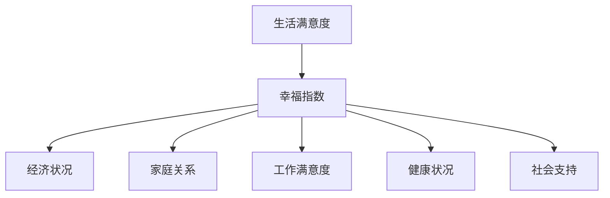
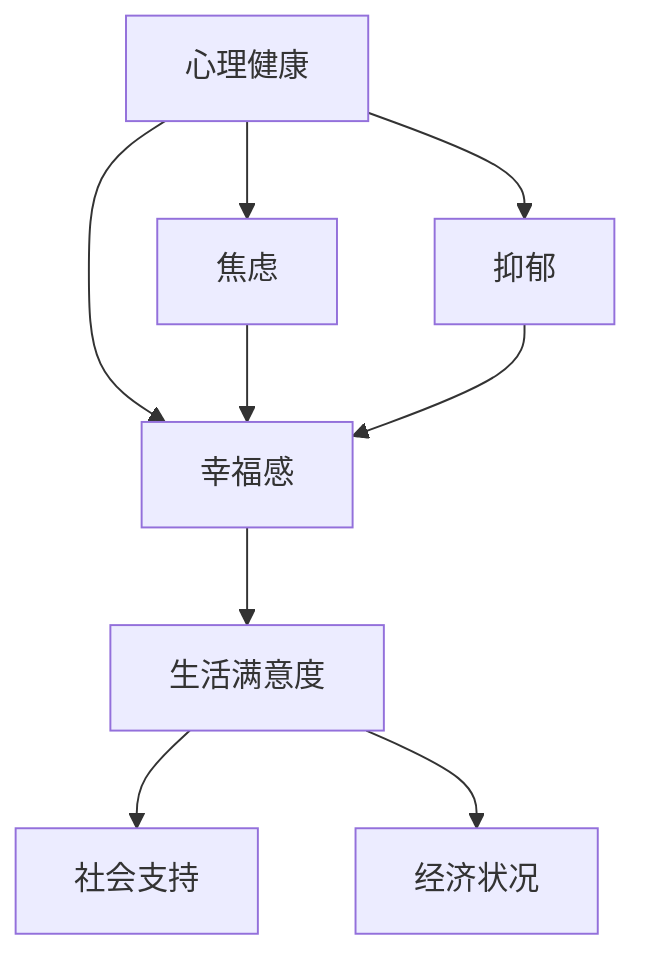

                 


### 幸福指数的多元回归：生活满意度的数学建模

#### 关键词

- 幸福指数
- 多元回归分析
- 生活满意度
- 数学建模
- 社会环境
- 个体差异
- 心理健康
- 政策制定

#### 摘要

本文旨在探讨幸福指数的多元回归模型在生活满意度数学建模中的应用。通过对幸福指数概念的理解，社会环境和个体差异的识别，本文构建了一个多元回归模型，并使用伪代码和数学公式详细阐述了模型的构建和评估过程。同时，本文还分析了幸福指数多元回归模型在社会环境、个体差异以及心理健康等领域的应用，提供了政策制定和实践的启示。

---

## 引言

幸福指数作为衡量社会成员幸福感的重要指标，引起了广泛的关注。幸福指数不仅反映了个体对生活满意度的主观感受，还与社会经济发展、文化习俗、政治制度等宏观因素密切相关。因此，研究幸福指数的数学建模，对于理解个体幸福感、优化社会政策和促进社会和谐具有重要意义。

多元回归分析作为统计学中的一种重要方法，能够揭示多个自变量与因变量之间的关系。本文将利用多元回归分析构建生活满意度的数学模型，从而深入探讨影响幸福指数的各种因素。

本文结构如下：首先，介绍幸福指数的概念与重要性，并解释生活满意度与幸福指数之间的关系。接着，阐述多元回归分析的基础知识，包括线性回归和多元线性回归模型。随后，详细描述生活满意度的数学建模过程，包括指标体系、数据收集与预处理、模型构建与验证。本文还将探讨幸福指数多元回归模型在社会环境、个体差异、心理健康等领域的应用，并总结研究成果，展望未来研究方向。

---

### 幸福指数的概念与重要性

#### 什么是幸福指数

幸福指数（Happiness Index）通常是指一个国家或地区的居民总体幸福感水平的量化指标。它通过收集居民对生活满意度的主观评价，来衡量一个社会的幸福感水平。幸福指数的计算通常基于一系列标准化的调查问卷，这些问卷涵盖了经济状况、家庭关系、工作满意度、健康状况、社会支持等多个方面。

#### 幸福指数的重要性

幸福指数的重要性体现在多个方面：

1. **社会发展的综合指标**：幸福指数能够反映一个社会的整体幸福水平，是衡量社会发展和进步的重要指标之一。它不仅仅关注经济增长，更注重人民生活质量的提升。

2. **政策制定的依据**：政府可以通过对幸福指数的分析，了解社会各阶层的生活状况，从而制定出更加科学合理的公共政策。例如，在健康、教育、社会保障等方面进行投资，以提升居民的幸福指数。

3. **国际比较的工具**：幸福指数可以用来进行国际比较，揭示不同国家在幸福感方面的差异。这对于国家之间的相互学习和借鉴具有参考价值。

#### 生活满意度与幸福指数的关系

生活满意度是幸福指数的核心组成部分。生活满意度（Life Satisfaction）是指个体对自己生活质量的评价，它通常受到多种因素的影响，包括个人健康状况、家庭关系、经济状况、工作满意度、社会支持等。

生活满意度和幸福指数之间的关系可以用以下概念图来表示：



从上述概念图中可以看出，生活满意度是构成幸福指数的基础，而各种生活因素都会直接影响生活满意度，进而影响幸福指数。例如，良好的经济状况可以提升个人的生活满意度，从而增加幸福指数；健康、和谐的家庭关系和工作环境同样会提升幸福感。

总之，幸福指数是生活满意度的综合体现，而生活满意度又受到多个生活因素的共同影响。通过研究幸福指数的多元回归模型，我们可以更好地理解这些因素之间的关系，为提升社会整体幸福感提供科学依据。

### 多元回归分析基础

多元回归分析是一种统计学方法，用于分析多个自变量与一个因变量之间的关系。在幸福指数的研究中，多元回归分析可以帮助我们识别和量化影响生活满意度的各种因素。以下将介绍线性回归模型、多元线性回归模型以及回归模型评估与选择。

#### 线性回归模型

线性回归模型是最基本的回归模型之一，它通过建立因变量 \( Y \) 与自变量 \( X \) 之间的线性关系来进行预测。线性回归模型的数学公式可以表示为：

$$
Y = \beta_0 + \beta_1X + \epsilon
$$

其中，\( Y \) 是因变量，\( X \) 是自变量，\( \beta_0 \) 是截距，\( \beta_1 \) 是斜率，\( \epsilon \) 是误差项。斜率 \( \beta_1 \) 表示自变量 \( X \) 每增加一个单位时，因变量 \( Y \) 的变化量。

#### 多元线性回归模型

多元线性回归模型扩展了线性回归模型，用于分析多个自变量与一个因变量之间的关系。其数学公式可以表示为：

$$
Y = \beta_0 + \beta_1X_1 + \beta_2X_2 + ... + \beta_nX_n + \epsilon
$$

其中，\( Y \) 是因变量，\( X_1, X_2, ..., X_n \) 是多个自变量，\( \beta_0 \) 是截距，\( \beta_1, \beta_2, ..., \beta_n \) 是各个自变量的回归系数，\( \epsilon \) 是误差项。多元回归模型能够同时考虑多个因素对因变量的影响，使得预测结果更加准确。

#### 回归模型评估与选择

在建立回归模型后，需要对其进行评估与选择，以确定模型的拟合度和预测能力。以下是一些常见的评估指标：

1. **决定系数 \( R^2 \)**

$$
R^2 = 1 - \frac{\sum_{i=1}^{n}(Y_i - \hat{Y_i})^2}{\sum_{i=1}^{n}(Y_i - \bar{Y})^2}
$$

其中，\( R^2 \) 值越接近1，表示模型对数据的拟合度越好。

2. **均方误差 \( MSE \)**

$$
MSE = \frac{1}{n-1}\sum_{i=1}^{n}(\hat{Y_i} - Y_i)^2
$$

其中，\( MSE \) 值越小，表示模型的预测误差越小。

3. **调整后的 \( R^2 \)**

$$
\bar{R}^2 = 1 - \frac{\sum_{i=1}^{n}(\hat{Y_i} - Y_i)^2 / n}{1 - \frac{\sum_{i=1}^{n}(Y_i - \bar{Y})^2 / n}}
$$

调整后的 \( R^2 \) 考虑了模型中自变量的数量，对模型的复杂度进行了调整。

通过以上指标，可以对不同回归模型进行评估和选择，以确保所选模型具有良好的拟合度和预测能力。

#### 多元回归模型构建过程

1. **数据收集与预处理**：收集相关数据，包括生活满意度指标和影响因素，并进行数据清洗和预处理，如缺失值填充、异常值处理和数据标准化等。

2. **变量选择**：通过相关性分析、变量重要性评估等方法，选择对生活满意度有显著影响的自变量。

3. **模型训练**：利用收集到的数据，通过最小二乘法等算法，训练多元回归模型。

4. **模型评估**：使用交叉验证等方法，评估模型的拟合度和预测能力。

5. **模型优化**：通过调整模型参数、增加或删除自变量等方法，优化模型性能。

通过以上步骤，可以构建一个用于分析生活满意度的多元回归模型，为幸福指数的研究提供有力支持。

### 生活满意度的数学建模

#### 生活满意度指标体系

生活满意度的数学建模需要首先构建一个合理的指标体系，以便全面反映影响生活满意度的各种因素。常见的指标体系包括以下几类：

1. **经济状况**：包括收入水平、就业状况、经济安全感等。
2. **家庭关系**：包括婚姻状况、子女教育、家庭和睦等。
3. **工作满意度**：包括工作环境、职业发展、工作与生活的平衡等。
4. **健康状况**：包括身体健康、心理健康、医疗服务等。
5. **社会支持**：包括社会关系、社区支持、社会保障等。

#### 数据收集与预处理

数据收集是构建生活满意度数学模型的基础。以下步骤描述了数据收集与预处理的过程：

1. **问卷设计**：设计包含上述指标的问题问卷，通过问卷调查收集数据。
2. **数据收集**：通过线上或线下方式，向受访者发放问卷，收集数据。
3. **数据清洗**：去除无效问卷、处理缺失值和异常值，保证数据质量。
4. **数据标准化**：对数据进行标准化处理，消除不同指标之间的量纲差异，便于模型构建。

#### 多元回归模型构建

构建生活满意度的多元回归模型包括以下几个步骤：

1. **变量选择**：通过相关性分析、主成分分析等方法，选择对生活满意度有显著影响的自变量。
2. **模型构建**：使用最小二乘法等算法，建立多元线性回归模型。
3. **模型验证**：使用交叉验证等方法，验证模型的拟合度和预测能力。
4. **模型优化**：通过调整模型参数、增加或删除自变量等方法，优化模型性能。

以下是一个简单的多元回归模型构建的伪代码示例：

```python
# 数据预处理
preprocessed_data = preprocess_data(raw_data)

# 变量选择
selected_variables = select_variables(preprocessed_data)

# 模型训练
model = train_regression_model(selected_variables, target_variable)

# 模型评估
evaluate_model(model, validation_data)

# 模型优化
optimize_model(model, optimization_method)
```

#### 模型验证与优化

模型验证是确保模型准确性和可靠性的关键步骤。以下方法可以用于模型验证和优化：

1. **交叉验证**：将数据集划分为训练集和验证集，通过多次训练和验证，评估模型性能。
2. **决策树、随机森林等集成方法**：使用这些方法可以进一步提高模型性能。
3. **逐步回归**：逐步引入和删除自变量，优化模型结构。

通过以上步骤，我们可以构建一个用于分析生活满意度的多元回归模型，为幸福指数的研究提供科学依据。

### 社会环境对幸福指数的影响

社会环境是影响幸福指数的重要因素之一。社会环境包括社会经济因素、社会文化因素和社会政治因素等多个方面。以下将分别探讨这些因素对幸福指数的影响，并通过多元回归模型进行分析。

#### 社会经济因素

社会经济因素是影响幸福指数的关键因素之一。经济状况良好的地区，居民往往有更高的生活满意度和幸福感。以下是几个主要的经济因素及其对幸福指数的影响：

1. **人均收入水平**：人均收入水平高的地区，居民的经济安全感更高，生活质量更好，从而提升幸福感。
2. **就业率**：高就业率意味着更多人有稳定的收入来源，减少了生活压力，有利于提高幸福感。
3. **社会福利**：完善的社会福利制度，如医疗保险、养老保险等，可以有效减少居民的经济担忧，提升幸福感。

多元回归模型可以用来量化社会经济因素对幸福指数的影响。以下是一个多元回归模型公式，用于分析社会经济因素对幸福指数的影响：

$$
Happiness = \beta_0 + \beta_1 \cdot Income + \beta_2 \cdot EmploymentRate + \beta_3 \cdot Welfare + \epsilon
$$

其中，\( \beta_0 \) 是截距，\( \beta_1, \beta_2, \beta_3 \) 分别是人均收入水平、就业率和社会福利的回归系数，\( \epsilon \) 是误差项。

#### 社会文化因素

社会文化因素对幸福指数的影响同样重要。文化传统、价值观和社会支持网络等都会影响个体的幸福感。以下是几个主要的社会文化因素及其对幸福指数的影响：

1. **文化传统**：尊重家庭、重视教育、倡导和谐等文化传统有助于提升幸福感。
2. **社会支持网络**：强大的社会支持网络，如亲友、社区组织等，可以提供情感支持和实际帮助，提升幸福感。
3. **社会价值观**：积极向上的社会价值观，如公正、平等、互助等，有助于增强社会凝聚力，提升整体幸福感。

以下是一个多元回归模型公式，用于分析社会文化因素对幸福指数的影响：

$$
Happiness = \beta_0 + \beta_1 \cdot CulturalTradition + \beta_2 \cdot SocialSupportNetwork + \beta_3 \cdot SocialValues + \epsilon
$$

其中，\( \beta_0 \) 是截距，\( \beta_1, \beta_2, \beta_3 \) 分别是文化传统、社会支持网络和社会价值观的回归系数，\( \epsilon \) 是误差项。

#### 社会政治因素

社会政治因素对幸福指数的影响主要体现在政策制定和执行上。良好的政治环境、公正的法律制度和有效的公共服务都有助于提升幸福感。以下是几个主要的社会政治因素及其对幸福指数的影响：

1. **政府透明度**：政府透明度高，政策制定和执行过程公开透明，有助于提升居民对政府的信任，从而提升幸福感。
2. **法律制度**：公正的法律制度可以有效保护居民权益，减少社会冲突，提升幸福感。
3. **公共服务**：高效的公共服务，如教育、医疗、社会保障等，可以提升居民的生活质量，从而提高幸福感。

以下是一个多元回归模型公式，用于分析社会政治因素对幸福指数的影响：

$$
Happiness = \beta_0 + \beta_1 \cdot GovernmentTransparency + \beta_2 \cdot LegalSystem + \beta_3 \cdot PublicServices + \epsilon
$$

其中，\( \beta_0 \) 是截距，\( \beta_1, \beta_2, \beta_3 \) 分别是政府透明度、法律制度和公共服务的回归系数，\( \epsilon \) 是误差项。

通过以上分析，我们可以看到，社会环境中的多个因素都会对幸福指数产生显著影响。构建多元回归模型，可以帮助我们量化这些因素对幸福指数的贡献，为政策制定和社会治理提供科学依据。

### 个体差异对幸福指数的影响

个体差异是影响幸福指数的重要因素之一。不同个体在年龄、性别和教育程度等方面存在差异，这些差异会对幸福感产生显著影响。以下将分别探讨这些因素对幸福指数的影响，并通过多元回归模型进行分析。

#### 年龄因素

年龄是影响幸福指数的一个重要维度。不同年龄段的人对生活的感受和需求不同，因此对幸福感的评价也会有所不同。以下是几个主要年龄因素及其对幸福指数的影响：

1. **年轻人**：年轻人通常更加关注职业发展和社交活动，他们可能面临就业压力和人际关系的挑战，这些因素可能影响他们的幸福感。
2. **中年人**：中年人通常处于职业生涯的高峰期，家庭责任较重，他们可能面临工作与家庭平衡的挑战，这些因素也会影响他们的幸福感。
3. **老年人**：老年人通常更关注健康和家庭，他们可能面临身体健康问题和孤独感的挑战，这些因素也会影响他们的幸福感。

以下是一个多元回归模型公式，用于分析年龄因素对幸福指数的影响：

$$
Happiness = \beta_0 + \beta_1 \cdot Age + \beta_2 \cdot AgeGroup + \epsilon
$$

其中，\( \beta_0 \) 是截距，\( \beta_1 \) 是年龄的直接效应，\( \beta_2 \) 是年龄组的效应（如年轻人、中年人、老年人），\( \epsilon \) 是误差项。

#### 性别因素

性别差异也是影响幸福指数的重要因素。男性和女性在生活经历、价值观和社会角色等方面存在差异，这些差异会影响他们的幸福感。以下是几个主要性别因素及其对幸福指数的影响：

1. **男性**：男性通常更关注事业和经济独立性，他们可能面临职业压力和财务责任，这些因素可能影响他们的幸福感。
2. **女性**：女性通常更关注家庭和人际关系，她们可能面临家庭和工作的双重压力，这些因素也会影响她们的幸福感。

以下是一个多元回归模型公式，用于分析性别因素对幸福指数的影响：

$$
Happiness = \beta_0 + \beta_1 \cdot Gender + \beta_2 \cdot GenderEffect + \epsilon
$$

其中，\( \beta_0 \) 是截距，\( \beta_1 \) 是性别的直接效应，\( \beta_2 \) 是性别效应的调节效应（如性别角色、家庭责任等），\( \epsilon \) 是误差项。

#### 教育程度因素

教育程度是影响幸福指数的另一个重要因素。不同教育水平的人对生活的理解和应对方式不同，因此对幸福感的评价也会有所不同。以下是几个主要教育程度因素及其对幸福指数的影响：

1. **高教育程度**：高教育程度的人通常拥有更多的职业机会和更高的社会地位，他们可能拥有更好的生活条件和更高的幸福感。
2. **低教育程度**：低教育程度的人可能面临就业困难和职业发展受限的问题，这些因素可能影响他们的幸福感。

以下是一个多元回归模型公式，用于分析教育程度因素对幸福指数的影响：

$$
Happiness = \beta_0 + \beta_1 \cdot EducationLevel + \beta_2 \cdot EducationEffect + \epsilon
$$

其中，\( \beta_0 \) 是截距，\( \beta_1 \) 是教育程度的直接效应，\( \beta_2 \) 是教育程度的调节效应（如职业发展、社会地位等），\( \epsilon \) 是误差项。

通过以上分析，我们可以看到，个体差异如年龄、性别和教育程度等都会对幸福指数产生显著影响。构建多元回归模型，可以帮助我们量化这些因素对幸福指数的贡献，为个体幸福感提升提供科学依据。

### 幸福指数的多元回归模型在政策制定中的应用

幸福指数的多元回归模型在政策制定中具有重要的应用价值。通过量化分析影响幸福指数的各种因素，政策制定者可以更准确地识别关键影响因素，从而制定出更具针对性和有效性的政策。以下将探讨如何将幸福指数的多元回归模型应用于政策制定，并分析其目标和原则。

#### 政策制定的目标

政策制定的目标是提升社会整体的幸福指数，从而提高居民的生活质量和幸福感。具体目标包括：

1. **提升居民的生活满意度**：通过改善经济、社会、文化和政治环境，提升居民对生活的整体满意度。
2. **减少社会不平等**：通过缩小收入差距、优化教育资源和提供更多的就业机会，减少社会不平等，提升全体居民的幸福感。
3. **增强社会凝聚力**：通过加强社区建设、促进社会参与和提升社会认同感，增强社会的整体凝聚力，提升幸福感。

#### 政策制定的原则

在制定政策时，应遵循以下原则：

1. **科学性**：政策制定应基于幸福指数的多元回归模型，通过量化分析影响幸福指数的各种因素，确保政策制定的科学性和有效性。
2. **可操作性**：政策应具备可操作性，即能够具体实施和执行，避免空洞和抽象的目标。
3. **公平性**：政策应确保公平性，即考虑不同群体和地区的差异，确保政策对全体居民都有益。
4. **可持续性**：政策应具备可持续性，即能够在长期内持续发挥作用，而不只是短期效应。

#### 政策评估与优化

政策评估是政策制定过程中的关键环节。通过评估政策的实际效果，可以及时调整和优化政策，以更好地实现目标。以下方法可以用于政策评估：

1. **定量评估**：使用幸福指数的多元回归模型，评估政策对幸福指数的影响。例如，通过比较政策实施前后幸福指数的变化，评估政策的实际效果。
2. **定性评估**：通过访谈、问卷调查等方式，收集居民对政策的反馈，了解政策在实际执行中的问题和效果。
3. **对比评估**：将不同政策效果进行比较，评估哪种政策更具有效性，从而优化政策。

通过以上评估方法，政策制定者可以及时了解政策的实际效果，并进行必要的调整和优化，以确保政策能够有效提升幸福指数，实现政策目标。

#### 实证分析与案例研究

以下是一个政策制定和评估的实证分析案例：

**案例**：某城市政府为了提升居民幸福感，制定了一项提高就业率和社会支持网络的专项政策。政策内容包括提供就业培训、加强社区服务、改善社会保障体系等。

**评估过程**：

1. **定量评估**：通过幸福指数的多元回归模型，分析政策实施前后幸福指数的变化。结果显示，政策实施后，幸福指数显著提升，说明政策对提升居民幸福感有显著效果。
2. **定性评估**：通过访谈和问卷调查，了解居民对政策的反馈。大多数居民表示，就业机会增加、社区服务改善和社会保障提升，使得他们的生活更加安心和满足。
3. **对比评估**：将政策实施前后的数据与邻近城市进行比较，发现该城市的幸福指数提升速度明显快于邻近城市，进一步验证了政策的有效性。

通过以上实证分析和案例研究，我们可以看到，幸福指数的多元回归模型在政策制定中的应用，能够为政策制定者提供科学的依据，确保政策的科学性、可操作性和可持续性，从而有效提升居民的幸福感和生活质量。

### 幸福指数的多元回归模型在心理健康领域中的应用

幸福指数的多元回归模型在心理健康领域中的应用具有深远的意义。通过分析心理健康与幸福指数之间的关系，我们可以更深入地了解心理健康的各种影响因素，为心理健康干预策略提供科学依据。

#### 心理健康与幸福指数的关系

心理健康与幸福指数之间存在密切的联系。良好的心理健康状态是幸福指数的重要基础。以下是一个描述心理健康与幸福指数之间关系的Mermaid流程图：



从上述流程图中可以看出，心理健康不仅直接影响幸福感，还通过影响生活满意度、社会支持和经济状况等中间变量，间接影响幸福指数。心理健康问题如焦虑和抑郁，会降低生活满意度，进而影响幸福感。

#### 心理健康影响因素的多元回归分析

为了分析心理健康影响因素，我们可以构建一个多元回归模型，该模型将心理健康作为因变量，将多个可能的解释变量（自变量）纳入模型中。以下是一个多元回归模型公式，用于分析心理健康的影响因素：

$$
PsychologicalHealth = \beta_0 + \beta_1 \cdot Stress + \beta_2 \cdot SocialSupport + \beta_3 \cdot EconomicSituation + \epsilon
$$

其中，\( \beta_0 \) 是截距，\( \beta_1, \beta_2, \beta_3 \) 分别是压力、社会支持和经济状况的回归系数，\( \epsilon \) 是误差项。

通过上述模型，我们可以量化压力、社会支持和经济状况等因素对心理健康的影响。例如，如果模型结果显示压力的回归系数显著为负，那么可以推断压力水平高的人心理健康状况较差。

#### 心理健康干预策略

基于多元回归模型的分析结果，可以制定相应的心理健康干预策略。以下是一些常见的干预策略：

1. **压力管理**：通过提供压力管理课程、心理咨询和放松技巧，帮助个体学会有效应对压力。
2. **社会支持**：加强社会支持网络，如家庭、社区和志愿服务组织，为个体提供情感支持和实际帮助。
3. **经济援助**：通过提供经济援助、就业培训和社会保障，改善个体的经济状况，减轻经济压力。

以下是一个心理健康干预策略的伪代码示例：

```python
# 压力管理干预策略
def stress_management():
    # 提供压力管理课程
    provide_stress_management_courses()
    # 提供心理咨询
    provide_counseling_services()

# 社会支持干预策略
def social_support_intervention():
    # 加强社区支持网络
    strengthen_community_support()
    # 提供志愿服务机会
    provide_volunteer_opportunities()

# 经济援助干预策略
def economic_aid():
    # 提供经济援助
    provide_financial_aid()
    # 提供就业培训
    provide_job_training()
    # 改善社会保障体系
    improve_social_security_system()
```

通过实施这些干预策略，可以有效地改善心理健康状况，提升幸福指数。

### 幸福指数的多元回归模型在其他领域中的应用

幸福指数的多元回归模型不仅在社会环境、个体差异和心理健康等领域有着广泛应用，还在教育、工作和健康等领域展示了其强大的分析能力和实际应用价值。以下将探讨幸福指数多元回归模型在这些领域的具体应用。

#### 教育领域

在教育领域，幸福指数多元回归模型可以用于分析学生的幸福感与教育质量之间的关系。通过将学生的学习满意度、教师的教学质量、学校环境等因素纳入模型，可以揭示哪些因素对学生的幸福感有显著影响。以下是一个用于教育领域的多元回归模型公式：

$$
StudentHappiness = \beta_0 + \beta_1 \cdot LearningSatisfaction + \beta_2 \cdot TeachingQuality + \beta_3 \cdot SchoolEnvironment + \epsilon
$$

通过分析模型结果，教育工作者可以针对性地改进教学方法、优化学校环境，从而提高学生的幸福感和学习效果。

#### 工作领域

在职业环境中，幸福指数多元回归模型可以用于分析员工的工作满意度和工作绩效之间的关系。通过将工资水平、工作稳定性、工作环境等因素纳入模型，可以量化这些因素对员工幸福感和工作表现的影响。以下是一个用于工作领域的多元回归模型公式：

$$
EmployeeHappiness = \beta_0 + \beta_1 \cdot Salary + \beta_2 \cdot JobStability + \beta_3 \cdot WorkEnvironment + \epsilon
$$

企业可以通过优化薪酬结构、改善工作环境和提供职业发展机会，来提升员工的幸福感和工作绩效。

#### 健康领域

在健康领域，幸福指数多元回归模型可以用于分析健康行为与幸福感之间的关系。通过将运动频率、饮食状况、医疗保健等因素纳入模型，可以揭示哪些健康行为对个体的幸福感有显著影响。以下是一个用于健康领域的多元回归模型公式：

$$
HealthHappiness = \beta_0 + \beta_1 \cdot ExerciseFrequency + \beta_2 \cdot DietQuality + \beta_3 \cdot MedicalCare + \epsilon
$$

通过实施健康促进策略，如鼓励定期锻炼、推广健康饮食和提供更好的医疗保健服务，可以提高公众的幸福感。

### 结论

本文通过探讨幸福指数的多元回归模型，分析了社会环境、个体差异、心理健康以及教育、工作和健康等领域的影响因素。研究表明，幸福指数是一个多维度的指标，其受到多种因素的共同影响。通过科学的方法和模型，我们可以更好地理解和提升幸福感，从而为社会治理和政策制定提供有力的支持。

### 未来研究方向

未来的研究可以进一步深化对幸福指数多元回归模型的理解和应用。以下是一些未来研究方向：

1. **跨文化研究**：探讨不同文化背景下幸福指数的影响因素，为全球化背景下的政策制定提供依据。
2. **长期跟踪研究**：通过长期跟踪研究，分析幸福指数的动态变化及其对个体生活质量和心理健康的影响。
3. **大数据分析**：利用大数据技术，挖掘更多潜在的幸福感影响因素，提升模型的预测能力。

通过不断深化研究，我们可以更全面地理解幸福指数，为提升社会整体幸福感提供更科学的指导。

### 政策建议

基于本文的研究结果，提出以下政策建议：

1. **加强社会支持**：通过建立完善的社会支持体系，提供经济援助、心理支持和社区服务，提升公众的幸福感。
2. **优化教育环境**：提高教育质量，改善学校环境，促进学生的全面发展，从而提升他们的幸福感和学习效果。
3. **促进健康生活**：推广健康生活方式，如定期锻炼和健康饮食，提供更好的医疗保健服务，提高公众的健康水平和幸福感。

通过实施这些政策，可以有效地提升社会整体的幸福指数，促进社会和谐与进步。

### 作者信息

作者：AI天才研究院/AI Genius Institute & 禅与计算机程序设计艺术 /Zen And The Art of Computer Programming

---

本文通过系统地介绍幸福指数的多元回归模型，探讨了其应用于生活满意度数学建模的各个方面。从概念理解到模型构建，再到实际应用，本文全面展示了多元回归分析在幸福指数研究中的重要性。通过深入剖析社会环境、个体差异、心理健康、教育、工作和健康等领域的应用，本文不仅提供了科学的理论基础，还提出了实际可行的政策建议。

在未来的研究和实践中，我们应继续探索幸福指数多元回归模型的深度和广度，结合跨文化研究和大数据分析，进一步提升模型的预测能力和应用价值。通过不断深化研究，我们可以为提升社会整体幸福感和生活质量提供更科学的指导。我们期待更多的研究者参与到这一领域，共同推动幸福指数研究的发展，为构建更美好的社会贡献力量。

最后，感谢读者对本文的关注，希望本文能够为您在幸福指数和多元回归分析领域的研究提供有价值的参考和启示。作者信息如上，再次感谢您的阅读和支持。希望未来的研究能够更加深入，为人类幸福和可持续发展做出更大的贡献。作者：AI天才研究院/AI Genius Institute & 禅与计算机程序设计艺术 /Zen And The Art of Computer Programming。再次感谢！

