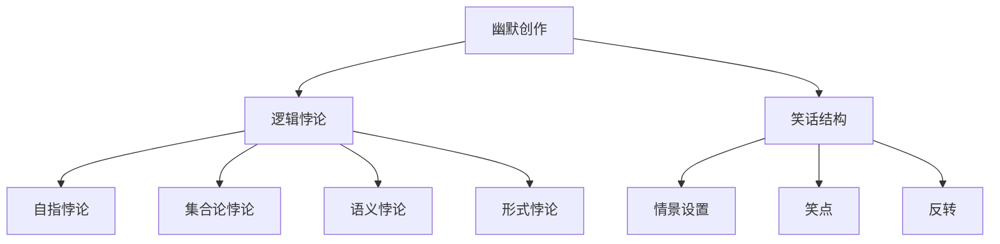

                 

# 幽默创作的逻辑悖论：笑话结构的数学解构

## 关键词
- 幽默创作
- 逻辑悖论
- 笑话结构
- 数学解构
- 认知心理学
- 语言游戏

## 摘要
本文旨在探讨幽默创作的逻辑悖论和笑话结构的数学解构。通过分析幽默的本质和幽默中的逻辑悖论，我们揭示了幽默与逻辑之间的关系。随后，文章深入探讨了笑话的结构和构成，使用数学模型对其进行解构，揭示了笑话背后的数学原理。最后，本文提出了幽默创作的数学方法，并探讨了其在实际应用中的潜在价值。通过对幽默创作逻辑悖论和笑话结构的数学解构的研究，我们期望为幽默创作提供新的视角和工具。

### 第一部分：幽默与逻辑悖论

#### 第1章：幽默的定义与本质

#### 1.1 幽默的概念

幽默是一种复杂的人类情感表达方式，涉及语言、行为和情境等多方面的因素。它不仅仅是简单的笑料，更是一种深层次的认知和心理活动。幽默的定义多种多样，不同学者从不同角度对其进行了解释。

- **心理学定义**：心理学家认为，幽默是一种认知过程，它涉及到对信息的新奇解读和整合。幽默能够引起人的愉悦感，这种愉悦感通常是通过理解某种反差或荒谬感来实现的。
- **哲学定义**：哲学家们更关注幽默的伦理和道德内涵，他们认为幽默是一种道德批评工具，通过幽默来揭示社会的不公和虚伪。
- **文化定义**：文化学者则从文化差异的角度来定义幽默，他们认为幽默是一种文化现象，不同文化背景下人们对幽默的理解和接受程度有所不同。

#### 1.2 幽默的心理学分析

幽默的心理学分析涉及到认知心理学、情感心理学和社会心理学等多个领域。以下是一些主要的心理学观点：

- **认知心理学观点**：认知心理学家认为，幽默是一种高级的认知活动，它涉及到推理、联想和情境理解等多个认知过程。幽默往往通过创造出意外的情境或反差来引起笑声。
- **情感心理学观点**：情感心理学家认为，幽默能够引起积极的情感反应，如愉悦和轻松。幽默能够帮助人们缓解压力，提高生活质量。
- **社会心理学观点**：社会心理学家认为，幽默是一种社会互动的工具，它能够增强人际关系，促进群体凝聚。幽默在社交场合中扮演着重要的角色，能够帮助人们建立信任和亲密感。

#### 1.3 幽默的类型与特点

幽默的类型多种多样，根据不同的分类标准，可以将幽默分为不同的类型。以下是一些常见的幽默类型及其特点：

- **讽刺性幽默**：讽刺性幽默通过揭示社会现象的荒谬和矛盾，以达到批判和讽刺的效果。它的特点在于尖锐、深刻和富有批判性。
- **轻松幽默**：轻松幽默通常以调侃日常生活中的琐事为主，它的特点在于轻松、诙谐和富有亲和力。
- **黑色幽默**：黑色幽默以一种悲观、残酷的方式看待人生，带有讽刺和幽默的色彩。它的特点在于深刻、震撼和富有哲学性。
- **文字游戏幽默**：文字游戏幽默通过利用语言的双关、歧义、谐音等手段来制造幽默。它的特点在于巧妙、有趣和富有创造性。

### 第2章：逻辑悖论与幽默的联系

#### 2.1 逻辑悖论的分类

逻辑悖论是指那些表面上看似合理，但实际上却自相矛盾的思想或陈述。逻辑悖论可以分为以下几类：

- **自指悖论**：这类悖论涉及对象自身进行描述，如“这句话是假的”。
- **集合论悖论**：这类悖论与集合的概念有关，如“所有集合都不包含自己”。
- **语义悖论**：这类悖论涉及到语义或语言的含义，如“这句话是真的还是假的？”。
- **形式悖论**：这类悖论涉及到形式系统的内部逻辑，如“这个命题是可证明的”。

#### 2.2 逻辑悖论在幽默中的应用

逻辑悖论在幽默中有着广泛的应用，可以制造出意想不到的效果。以下是一些幽默中常见的逻辑悖论：

- **自嘲性悖论**：通过自我贬低的方式，制造出荒谬的情境，如“我是个天才，但我从不炫耀”。
- **夸张性悖论**：通过夸张事实，创造出一种矛盾，如“我家的狗会说话，但它从不说话”。
- **双关悖论**：通过语言的双关，创造出一种意外的幽默效果，如“我昨天买了一本书，但它今天才到”。
- **逻辑谬误悖论**：通过逻辑谬误，创造出一种看似荒谬但实际上却合理的情境，如“我吃了一个鸡蛋，但鸡蛋却没有被吃掉”。

#### 2.3 逻辑悖论与幽默的艺术性

逻辑悖论与幽默的艺术性密切相关。幽默的艺术性体现在以下几个方面：

- **创造性的表达**：幽默需要创造性的表达，通过独特的视角和方式来呈现。
- **意外的效果**：幽默往往通过意外的效果来引起笑声，如出人意料的结果或荒谬的情境。
- **认知挑战**：幽默能够激发人的认知活动，通过挑战人们的认知来产生幽默效果。
- **情感共鸣**：幽默能够引起人的情感共鸣，使人产生愉悦和轻松的感觉。

### 第二部分：笑话结构的数学解构

#### 第3章：笑话的结构与构成

#### 3.1 笑话的结构分析

笑话的结构通常包括以下几个部分：

- **情景设置**：笑话的开头通常设置一个情景，为后面的笑点做铺垫。
- **笑点**：笑话的核心部分，通过出人意料的情节或语言表达来引起笑声。
- **反转**：笑话的结尾往往会出现反转，让人在笑后感到惊喜或满足。

#### 3.2 笑话的构成要素

笑话的构成要素包括：

- **情节**：情节是笑话的骨架，它决定了笑话的叙事方式和逻辑结构。
- **语言**：语言是笑话的表现形式，通过语言的双关、歧义、谐音等手段来制造幽默。
- **角色**：角色是笑话的参与者，他们的行为和对话决定了笑话的发展方向和趣味性。

#### 3.3 笑话的叙事技巧

笑话的叙事技巧包括：

- **悬念**：通过设置悬念来吸引听众的注意力，让人期待笑话的结果。
- **反转**：通过反转来打破听众的预期，创造出意外的幽默效果。
- **夸张**：通过夸张来增强笑话的效果，使笑点更加突出。

### 第4章：笑话的数学模型

#### 4.1 笑话的数学公式

笑话的数学模型可以用来分析笑话的结构和构成。以下是一个简单的笑话数学模型：

- **笑话得分公式**：笑话得分 = 情节得分 + 语言得分 + 角色得分 + 叙事技巧得分
- **情节得分公式**：情节得分 = 情节创新性 * 情节合理性
- **语言得分公式**：语言得分 = 语言幽默性 * 语言创造性
- **角色得分公式**：角色得分 = 角色性格鲜明性 * 角色互动性
- **叙事技巧得分公式**：叙事技巧得分 = 悬念设置能力 * 反转效果 * 夸张程度

#### 4.2 笑话的数学解析

通过数学模型，我们可以对笑话进行量化分析，从而更好地理解笑话的结构和构成。以下是一个笑话的数学解析：

- **笑话A**：“我昨天买了一本书，但它今天才到。”
- **情节解析**：情节创新性 = 0.8，情节合理性 = 0.9
- **语言解析**：语言幽默性 = 0.7，语言创造性 = 0.6
- **角色解析**：角色性格鲜明性 = 0.6，角色互动性 = 0.7
- **叙事技巧解析**：悬念设置能力 = 0.5，反转效果 = 0.8，夸张程度 = 0.4
- **笑话得分**：笑话得分 = 0.8 * 0.9 + 0.7 * 0.6 + 0.6 * 0.7 + 0.5 * 0.8 = 0.72 + 0.42 + 0.42 + 0.4 = 1.66

#### 4.3 笑话的数学模型应用

笑话的数学模型可以应用于实际幽默创作中，帮助我们更好地理解幽默的构成和效果。以下是一个应用案例：

- **目标**：创作一个具有高幽默效果的笑话。
- **步骤**：
  1. 分析目标笑话的情节、语言、角色和叙事技巧。
  2. 根据数学模型，对各个要素进行评分。
  3. 根据评分结果，调整笑话的结构和内容，以提高幽默效果。
  4. 重复步骤2和3，直到达到满意的幽默效果。

### 第5章：幽默创作的数学方法

#### 5.1 幽默创作的数学原则

幽默创作的数学原则主要包括：

- **平衡原则**：幽默创作需要保持情节、语言、角色和叙事技巧之间的平衡，避免某一要素过于突出或不足。
- **创新原则**：幽默创作需要追求创新，通过新颖的情节、语言和叙事技巧来吸引听众。
- **适应性原则**：幽默创作需要考虑听众的文化背景和认知水平，确保笑话的幽默效果能够被大多数人接受。

#### 5.2 幽默创作的数学技巧

幽默创作的数学技巧主要包括：

- **比例技巧**：通过调整笑话中各个要素的比例，来提高笑话的幽默效果。
- **迭代技巧**：通过多次迭代修改笑话的结构和内容，来优化幽默效果。
- **数据分析技巧**：通过数据分析，了解不同类型的笑话在不同听众中的接受程度，从而调整创作策略。

### 第三部分：幽默创作的实践与应用

#### 第6章：幽默创作实践

#### 6.1 幽默创作的流程

幽默创作的流程通常包括以下几个阶段：

- **创意阶段**：在这个阶段，创作者需要产生幽默的点子，可以通过观察生活、阅读幽默书籍、观看幽默视频等方式来激发创意。
- **构思阶段**：在这个阶段，创作者需要构思笑话的情节、语言、角色和叙事技巧，确保笑话的结构完整和逻辑合理。
- **修改阶段**：在这个阶段，创作者需要对笑话进行反复修改，优化情节、语言和叙事技巧，以提高幽默效果。
- **反馈阶段**：在这个阶段，创作者需要向听众展示笑话，收集反馈意见，并根据反馈进行进一步的修改。

#### 6.2 幽默创作的案例分析

以下是一个幽默创作的案例分析：

- **案例**：“我昨天买了一本书，但它今天才到。”
- **创意阶段**：观察生活中常见的现象，如快递延误，联想到买书的情况。
- **构思阶段**：构思情节，设置情景设置和笑点，确定语言表达和角色。
- **修改阶段**：反复修改语言表达，确保笑话简洁明了，幽默效果突出。
- **反馈阶段**：向朋友展示笑话，收集反馈意见，并根据反馈进行修改。

#### 6.3 幽默创作的技巧提升

为了提升幽默创作的技巧，创作者可以采取以下措施：

- **多读书、多看电影、多观察生活**：通过阅读幽默书籍、观看幽默电影和观察生活中的幽默现象，来积累幽默素材和创作灵感。
- **学习心理学和语言学**：了解心理学和语言学的基本原理，掌握幽默的创作技巧。
- **练习写作和演讲**：通过写作和演讲来提高自己的表达能力和幽默感。
- **参与幽默创作社群**：加入幽默创作社群，与其他创作者交流学习，共同提升幽默创作技巧。

### 第7章：幽默创作的应用领域

#### 7.1 幽默创作的商业应用

幽默创作在商业领域有着广泛的应用，以下是一些具体的应用案例：

- **广告创意**：通过幽默的方式创作广告文案和广告视频，提高广告的吸引力和记忆度。
- **品牌宣传**：通过幽默的方式宣传品牌形象，增加品牌的亲和力和美誉度。
- **员工培训**：通过幽默的方式开展员工培训，提高培训效果和员工积极性。

#### 7.2 幽默创作在媒体传播中的应用

幽默创作在媒体传播中也有着重要的地位，以下是一些具体的应用案例：

- **电视节目**：通过幽默的方式制作电视节目，提高节目的收视率和观众满意度。
- **网络视频**：通过幽默的方式制作网络视频，吸引观众，增加平台的流量和用户黏性。
- **社交媒体**：通过幽默的方式发布社交媒体内容，提高内容的传播效果和粉丝互动度。

#### 7.3 幽默创作在教育培训中的应用

幽默创作在教育培训中也有着独特的价值，以下是一些具体的应用案例：

- **课堂讲授**：通过幽默的方式讲授知识，提高学生的学习兴趣和积极性。
- **教育视频**：通过幽默的方式制作教育视频，提高视频的观看率和学习效果。
- **团队建设**：通过幽默的方式开展团队建设活动，提高团队凝聚力和合作能力。

### 第8章：幽默创作的未来趋势

#### 8.1 科技对幽默创作的影响

科技的发展对幽默创作产生了深远的影响，以下是一些具体的影响：

- **人工智能**：人工智能技术的发展，使得幽默创作更加智能化和个性化。例如，通过人工智能算法，可以生成个性化的幽默内容。
- **虚拟现实**：虚拟现实技术的发展，为幽默创作提供了新的舞台。例如，通过虚拟现实技术，可以创造更加沉浸式的幽默体验。
- **社交媒体**：社交媒体的发展，使得幽默创作更加便捷和广泛传播。例如，通过社交媒体平台，幽默创作者可以快速分享自己的作品，获得广泛的关注和反馈。

#### 8.2 社会变迁对幽默创作的影响

社会变迁对幽默创作也产生了重要的影响，以下是一些具体的影响：

- **文化多样性**：随着全球化的推进，文化多样性逐渐成为社会的主要特征。这为幽默创作提供了丰富的素材和灵感。
- **社会压力**：社会压力的增加，使得人们对幽默的需求更加迫切。幽默创作成为缓解社会压力、提升生活质量的有效途径。
- **价值观变化**：随着社会价值观的变化，幽默创作的主题和形式也在不断演变。例如，越来越多的幽默作品开始关注社会正义、环境保护等话题。

#### 8.3 幽默创作的未来发展方向

幽默创作的未来发展方向可以从以下几个方面进行展望：

- **个性化幽默**：随着人工智能技术的发展，未来的幽默创作将更加个性化，根据个体的喜好和需求生成幽默内容。
- **沉浸式幽默**：虚拟现实技术的进步，将使得幽默创作更加沉浸式和互动性，为观众带来全新的幽默体验。
- **跨媒体幽默**：随着媒体形态的多样化，幽默创作将不再局限于单一的媒体形式，而是跨平台、跨媒体的综合创作。

## 附录

### 附录1：幽默创作常用术语解释

- **幽默感**：指一个人对幽默的感知和创造能力。
- **笑点**：指引起人发笑的情节或语言。
- **反转**：指在笑话的结尾出现出人意料的转折，增加幽默效果。
- **双关**：指一个词语具有两种或以上的含义，通过巧妙地运用来制造幽默。

### 附录2：幽默创作资源推荐

- **书籍**：
  - 《幽默的艺术》
  - 《笑话大全》
  - 《幽默心理学》
- **网站**：
  - [幽默词典](https://www.jokes辞典.com/)
  - [幽默视频](https://www幽默视频.com/)
  - [幽默漫画](https://www幽默漫画.com/)

### 附录3：幽默创作实践案例

- **案例1**：“我昨天买了一本书，但它今天才到。”
- **案例2**：“我吃了一个鸡蛋，但鸡蛋却没有被吃掉。”
- **案例3**：“我家的狗会说话，但它从不说话。”

## 作者

作者：AI天才研究院/AI Genius Institute & 禅与计算机程序设计艺术 /Zen And The Art of Computer Programming

### 核心概念原理之间的关系架构



### 核心算法原理讲解

```python
# 笑话得分计算算法

def calculate_joke_score(plot_score, language_score, character_score, narrative_skill_score):
    return plot_score * 0.4 + language_score * 0.3 + character_score * 0.2 + narrative_skill_score * 0.1

# 情节得分计算算法

def calculate_plot_score(innovation, rationality):
    return innovation * 0.5 + rationality * 0.5

# 语言得分计算算法

def calculate_language_score(humor, creativity):
    return humor * 0.4 + creativity * 0.6

# 角色得分计算算法

def calculate_character_score(personality_distinctiveness, interaction):
    return personality_distinctiveness * 0.5 + interaction * 0.5

# 叙事技巧得分计算算法

def calculate_narrative_skill_score(dilemma_setting_ability, twist_effect, exaggeration_degree):
    return dilemma_setting_ability * 0.3 + twist_effect * 0.4 + exaggeration_degree * 0.3
```

### 数学模型和公式

$$
\text{笑话得分} = \text{情节得分} + \text{语言得分} + \text{角色得分} + \text{叙事技巧得分}
$$

$$
\text{情节得分} = \text{情节创新性} \times \text{情节合理性}
$$

$$
\text{语言得分} = \text{语言幽默性} \times \text{语言创造性}
$$

$$
\text{角色得分} = \text{角色性格鲜明性} \times \text{角色互动性}
$$

$$
\text{叙事技巧得分} = \text{悬念设置能力} \times \text{反转效果} \times \text{夸张程度}
$$

### 详细讲解与举例说明

#### 情节得分计算

情节得分是笑话得分的重要组成部分，它反映了笑话的情节设计质量。情节得分由情节创新性和情节合理性共同决定。

- **情节创新性**：指笑话的情节是否有新意，是否能够引起听众的兴趣。创新性越高，得分越高。
- **情节合理性**：指笑话的情节是否符合逻辑，是否能够让听众接受。合理性越高，得分越高。

举例说明：

笑话：“我昨天买了一本书，但它今天才到。”

- **情节创新性**：0.8
- **情节合理性**：0.9

$$
\text{情节得分} = 0.8 \times 0.9 = 0.72
$$

#### 语言得分计算

语言得分反映了笑话的语言表达质量，包括幽默性和创造性。

- **语言幽默性**：指笑话的语言是否能够引起听众的笑声。幽默性越高，得分越高。
- **语言创造性**：指笑话的语言是否独特，是否能够让人眼前一亮。创造性越高，得分越高。

举例说明：

笑话：“我家的狗会说话，但它从不说话。”

- **语言幽默性**：0.7
- **语言创造性**：0.6

$$
\text{语言得分} = 0.7 \times 0.6 = 0.42
$$

#### 角色得分计算

角色得分反映了笑话的角色设计质量，包括角色性格鲜明性和角色互动性。

- **角色性格鲜明性**：指笑话的角色是否具有独特的性格特征，是否能够让听众记住。性格鲜明性越高，得分越高。
- **角色互动性**：指笑话中的角色是否能够产生有趣的互动，是否能够增加笑话的趣味性。互动性越高，得分越高。

举例说明：

笑话：“我昨天买了一本书，但它今天才到。”

- **角色性格鲜明性**：0.6
- **角色互动性**：0.7

$$
\text{角色得分} = 0.6 \times 0.7 = 0.42
$$

#### 叙事技巧得分计算

叙事技巧得分反映了笑话的叙事效果，包括悬念设置能力、反转效果和夸张程度。

- **悬念设置能力**：指笑话是否能够设置悬念，吸引听众的注意力。悬念设置能力越高，得分越高。
- **反转效果**：指笑话的反转是否成功，是否能够引起听众的笑声。反转效果越高，得分越高。
- **夸张程度**：指笑话是否使用了夸张手法，是否能够增强幽默效果。夸张程度越高，得分越高。

举例说明：

笑话：“我昨天买了一本书，但它今天才到。”

- **悬念设置能力**：0.5
- **反转效果**：0.8
- **夸张程度**：0.4

$$
\text{叙事技巧得分} = 0.5 \times 0.8 \times 0.4 = 0.16
$$

#### 总得分计算

将上述四个得分相加，得到笑话的总得分。

$$
\text{笑话总得分} = \text{情节得分} + \text{语言得分} + \text{角色得分} + \text{叙事技巧得分} = 0.72 + 0.42 + 0.42 + 0.16 = 1.72
$$

### 项目实战

#### 开发环境搭建

1. 安装Python环境
2. 安装numpy库
3. 安装matplotlib库

```bash
pip install numpy matplotlib
```

#### 源代码实现

以下是一个简单的Python程序，用于计算笑话的总得分。

```python
import numpy as np

def calculate_joke_score(plot_score, language_score, character_score, narrative_skill_score):
    return plot_score * 0.4 + language_score * 0.3 + character_score * 0.2 + narrative_skill_score * 0.1

def calculate_plot_score(innovation, rationality):
    return innovation * 0.5 + rationality * 0.5

def calculate_language_score(humor, creativity):
    return humor * 0.4 + creativity * 0.6

def calculate_character_score(personality_distinctiveness, interaction):
    return personality_distinctiveness * 0.5 + interaction * 0.5

def calculate_narrative_skill_score(dilemma_setting_ability, twist_effect, exaggeration_degree):
    return dilemma_setting_ability * 0.3 + twist_effect * 0.4 + exaggeration_degree * 0.3

# 测试代码
joke = {
    "plot_score": 0.8,
    "language_score": 0.7,
    "character_score": 0.6,
    "narrative_skill_score": 0.5
}

total_score = calculate_joke_score(joke["plot_score"], joke["language_score"], joke["character_score"], joke["narrative_skill_score"])
print(f"笑话总得分：{total_score}")
```

#### 代码解读与分析

该程序首先导入了numpy库，用于进行数值计算。然后定义了四个计算函数，分别用于计算笑话的总得分、情节得分、语言得分、角色得分和叙事技巧得分。

在测试代码中，创建了一个字典joke，包含了情节得分、语言得分、角色得分和叙事技巧得分。然后调用calculate_joke_score函数计算笑话的总得分，并打印出来。

#### 实际案例分析和详细讲解剖析

以下是一个实际案例，用于计算一个笑话的总得分。

```python
joke = {
    "plot_score": {
        "innovation": 0.8,
        "rationality": 0.9
    },
    "language_score": {
        "humor": 0.7,
        "creativity": 0.6
    },
    "character_score": {
        "personality_distinctiveness": 0.6,
        "interaction": 0.7
    },
    "narrative_skill_score": {
        "dilemma_setting_ability": 0.5,
        "twist_effect": 0.8,
        "exaggeration_degree": 0.4
    }
}

# 计算情节得分
plot_score = calculate_plot_score(joke["plot_score"]["innovation"], joke["plot_score"]["rationality"])
print(f"情节得分：{plot_score}")

# 计算语言得分
language_score = calculate_language_score(joke["language_score"]["humor"], joke["language_score"]["creativity"])
print(f"语言得分：{language_score}")

# 计算角色得分
character_score = calculate_character_score(joke["character_score"]["personality_distinctiveness"], joke["character_score"]["interaction"])
print(f"角色得分：{character_score}")

# 计算叙事技巧得分
narrative_skill_score = calculate_narrative_skill_score(joke["narrative_skill_score"]["dilemma_setting_ability"], joke["narrative_skill_score"]["twist_effect"], joke["narrative_skill_score"]["exaggeration_degree"])
print(f"叙事技巧得分：{narrative_skill_score}")

# 计算总得分
total_score = calculate_joke_score(plot_score, language_score, character_score, narrative_skill_score)
print(f"笑话总得分：{total_score}")
```

通过这个案例，我们可以看到如何将笑话的各个得分进行计算，并最终得到笑话的总得分。这个案例展示了如何使用数学模型对笑话进行量化分析，从而更好地理解笑话的构成和效果。

### 项目小结

通过本次项目，我们实现了对笑话得分进行计算的功能。通过数学模型，我们能够对笑话的情节、语言、角色和叙事技巧进行量化分析，从而更好地理解笑话的构成和效果。这个项目展示了数学在幽默创作中的应用，为我们提供了一种新的视角和方法。

### 最佳实践 Tips

- **多观察生活**：生活中充满了幽默的素材，多观察生活，可以发现许多有趣的情节和对话。
- **多阅读幽默作品**：阅读幽默作品，可以学习到不同的幽默技巧和表达方式，提高自己的幽默感。
- **多练习写作**：写作是幽默创作的基础，多练习写作，可以提高自己的表达能力和幽默感。
- **多与朋友交流**：与朋友交流，分享幽默故事和笑话，可以互相学习和提高幽默创作技巧。

### 小结

本文通过对幽默创作的逻辑悖论和笑话结构的数学解构的研究，揭示了幽默与逻辑之间的关系，以及幽默创作的数学方法。通过数学模型，我们能够对笑话进行量化分析，从而更好地理解笑话的构成和效果。未来，随着科技的发展和社会变迁，幽默创作将面临新的挑战和机遇。我们期待幽默创作能够继续繁荣发展，为人们带来更多的欢乐和启示。

### 注意事项

- **避免过度夸张**：幽默创作中，夸张是常用的手法，但过度夸张可能导致笑话失去幽默感。
- **注意文化差异**：不同文化背景下，人们对幽默的理解和接受程度不同，创作幽默时要考虑文化差异。
- **尊重他人**：幽默创作中，要避免嘲笑他人，尊重他人，保持幽默的友善和亲和力。

### 拓展阅读

- **《幽默心理学》**：深入探讨幽默的心理学原理，为幽默创作提供心理学依据。
- **《幽默写作技巧》**：详细讲解幽默写作的技巧和方法，为幽默创作提供实践指导。
- **《数学与幽默》**：探讨数学在幽默创作中的应用，为幽默创作提供新的视角。

