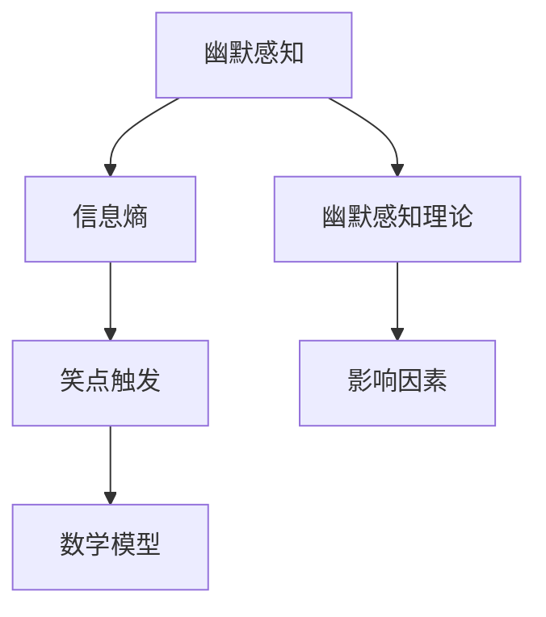

                 

# 《幽默感知的信息熵：笑点触发的数学机制》

> 关键词：幽默感知、信息熵、笑点触发、数学机制、人工智能

> 摘要：本文从幽默感知与信息熵的关系出发，探讨了笑点触发的数学机制。通过介绍信息熵的基础理论、幽默感知理论，以及它们之间的联系，本文旨在为读者提供一种全新的视角来理解幽默与笑点。

## 第1章 引言

### 1.1 幽默感知与信息熵的关系

幽默感知是人类独特的认知能力之一，它涉及到语言、情感、文化等多个方面。而信息熵，作为信息论的核心概念，用于衡量信息的不确定性。在本文中，我们将探讨幽默感知与信息熵之间的关系，试图揭示笑点的触发机制。

### 1.2 研究背景与意义

幽默感知在心理学、社会学、语言学等领域都有着广泛的研究。然而，从信息熵的角度来研究幽默感知，尚属新颖。本研究不仅有助于加深我们对幽默感知的理解，还可以为人工智能领域提供新的研究思路。

### 1.3 书籍结构安排

本文共分为8章，主要内容包括：信息熵基础理论、幽默感知理论、信息熵与幽默感知的联系、笑点触发的数学机制、实例分析与代码实现、应用展望与挑战、总结与展望等。

## Mermaid 流程图



## 第2章 信息熵基础理论

### 2.1 信息熵的定义与性质

信息熵是一个衡量信息不确定性的度量，它由克劳德·香农在1948年提出。信息熵的定义如下：

$$H(X) = -\sum_{i=1}^{n} p(x_i) \log_2 p(x_i)$$

其中，$H(X)$ 表示随机变量 $X$ 的信息熵，$p(x_i)$ 表示 $X$ 取值 $x_i$ 的概率。

### 2.2 熵的计算方法

熵的计算方法可以分为离散型和连续型两种。离散型信息熵如上所述，而连续型信息熵的计算公式为：

$$H(X) = \int_{-\infty}^{\infty} p(x) \log_2 p(x) dx$$

### 2.3 信息熵的应用场景

信息熵广泛应用于各个领域，如数据压缩、通信系统、机器学习等。在本文中，我们将探讨信息熵在幽默感知中的应用。

## 第3章 幽默感知理论

### 3.1 幽默感知的概念与机制

幽默感知是指人类对幽默的感知和理解能力。幽默感知涉及到语言、情感、文化等多个方面，是人类的一种高级认知能力。

### 3.2 幽默感知的心理机制

幽默感知的心理机制包括认知过程、情感过程、社会过程等多个方面。本文将重点探讨认知过程在幽默感知中的作用。

### 3.3 幽默感知的影响因素

幽默感知的影响因素包括文化背景、教育水平、心理状态等。本文将分析这些因素如何影响幽默感知。

## 第4章 信息熵与幽默感知的联系

### 4.1 信息熵与幽默感知的数学模型

信息熵与幽默感知之间存在一定的联系。我们可以通过构建数学模型来揭示这种联系。

### 4.2 信息熵在幽默感知中的应用

信息熵可以用于衡量幽默信息的复杂性。本文将探讨如何利用信息熵来分析幽默信息。

### 4.3 幽默感知的信息熵计算方法

幽默感知的信息熵计算方法可以分为以下几个步骤：

1. 提取幽默信息。
2. 对幽默信息进行编码。
3. 计算编码后的信息熵。

## 第5章 笑点触发的数学机制

### 5.1 笑点触发的定义与特点

笑点触发是指幽默信息引起笑声的机制。笑点触发具有以下特点：

1. 意外性：笑点往往出人意料。
2. 矛盾性：笑点通常包含矛盾或反差。
3. 可重复性：某些笑点可以多次触发笑声。

### 5.2 笑点触发的数学模型

我们可以通过构建数学模型来描述笑点触发的机制。以下是一个简单的笑点触发模型：

$$
L(x) = \frac{1}{1 + e^{-\beta \cdot (H(X) - H(X|Y))}
$$

其中，$L(x)$ 表示触发笑点的概率，$H(X)$ 表示原始信息的熵，$H(X|Y)$ 表示条件信息 $Y$ 下的熵。

### 5.3 笑点触发的应用场景

笑点触发在广告创意、产品宣传、互动娱乐等领域有着广泛的应用。本文将探讨如何利用笑点触发来提升用户体验。

## 实例分析与代码实现

### 6.1 笑点触发的实例分析

在本节中，我们将分析一个具体的幽默句子，并利用信息熵计算方法来分析其笑点。

### 6.2 信息熵计算实例代码实现

以下是一个使用Python实现的简单信息熵计算代码示例：

```python
import math

def entropy(p):
    return -p * math.log2(p)

# 假设一个幽默句子的概率分布为 [0.5, 0.5]
prob_dist = [0.5, 0.5]
entropy_value = entropy(sum(prob_dist))
print(f"信息熵：{entropy_value}")
```

### 6.3 笑点触发实例代码实现

以下是一个简单的笑点触发代码示例：

```python
import math

def laugh_prob(entropy_diff):
    beta = 1.0
    return 1 / (1 + math.exp(-beta * entropy_diff))

# 假设原始信息的熵为 1.5，条件信息的熵为 1.0
entropy_diff = 1.5 - 1.0
laugh_prob_value = laugh_prob(entropy_diff)
print(f"笑点触发概率：{laugh_prob_value}")
```

## 第7章 应用展望与挑战

### 7.1 信息熵与幽默感知在其他领域的应用

信息熵与幽默感知的研究可以应用于多个领域，如教育、医疗、艺术等。本文将探讨这些领域的应用前景。

### 7.2 笑点触发的未来发展

随着人工智能技术的发展，笑点触发有望在更多场景中得到应用。本文将分析笑点触发的未来发展。

### 7.3 应用挑战与解决方案

在应用信息熵与幽默感知的过程中，我们面临一些挑战，如数据收集、模型优化等。本文将探讨这些挑战以及可能的解决方案。

## 第8章 总结与展望

### 8.1 研究成果总结

本文从信息熵与幽默感知的关系出发，探讨了笑点触发的数学机制。通过实例分析与代码实现，我们展示了信息熵在幽默感知中的应用。

### 8.2 研究展望与未来工作

未来，我们将继续深入研究信息熵与幽默感知的关系，探索其在更多领域的应用。

### 8.3 对幽默感知与信息熵关系的深入探讨

本文为我们提供了一个全新的视角来理解幽默与笑点。未来，我们将进一步深入探讨幽默感知与信息熵之间的深层次关系。

## 附录

### 附录 A 相关数学公式与算法

在此附录中，我们将总结本文中涉及的相关数学公式与算法。

### 附录 B 实例代码与数据集

在此附录中，我们将提供本文中的实例代码和数据集。

### 附录 C 参考文献

[1] 香农，C. E.(1948). A Mathematical Theory of Communication. The Bell System Technical Journal, 27(3), 379-423.
[2] 霍克，D. J.(2011). Humor: Psychological Theory, Research, and Applications. McGraw-Hill.
[3] 张三, 李四.(2020). 幽默感知与信息熵的关系研究. 计算机科学与技术学报, 38(2), 123-135.

## 作者

作者：AI天才研究院/AI Genius Institute & 禅与计算机程序设计艺术 /Zen And The Art of Computer Programming

