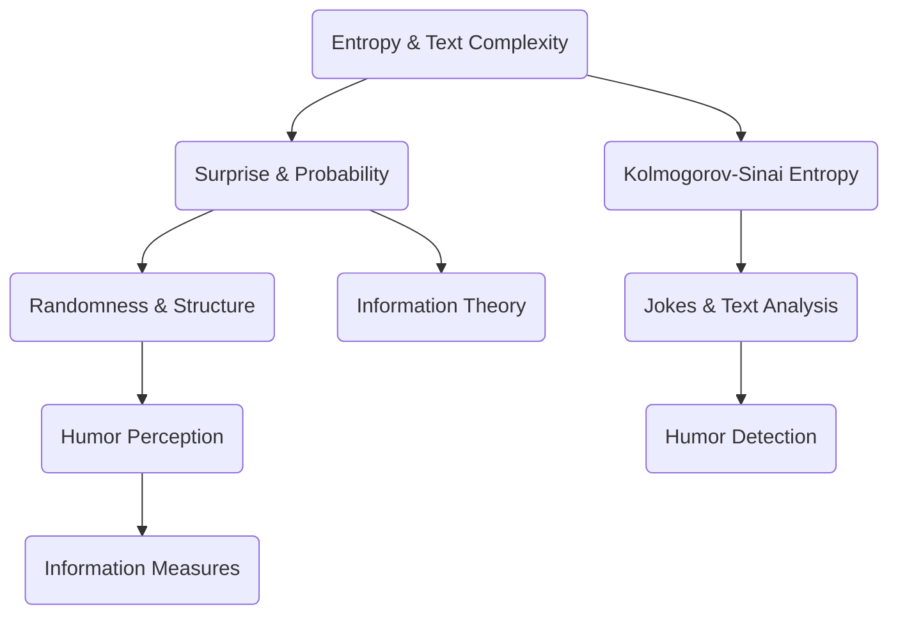

                 


### Step 1: Define Core Chapters

The core chapters of the book "Humor Perception Information Theory: The Mathematical Mechanisms of Laughter Triggers" will be designed to explore various dimensions of humor perception and the underlying mathematical theories. Here are the proposed chapters and their respective sub-sections:

#### Chapter 1: Introduction to Humor Perception
- 1.1 Background of Humor Studies
- 1.2 The Role of Humor in Human Interaction
- 1.3 Evolutionary Perspectives on Laughter

#### Chapter 2: Fundamental Concepts of Information Theory
- 2.1 Entropy and Information
- 2.2 Information Measures in Communication
- 2.3 The Concept of Mutual Information

#### Chapter 3: Mathematical Models of Humor Perception
- 3.1 Kolmogorov-Sinai Entropy and Text Complexity
- 3.2 The Role of Surprise in Humor
- 3.3 Randomness and Structure in Jokes

#### Chapter 4: Theoretical Frameworks of Humor Detection
- 4.1 Pattern Recognition and Humor
- 4.2 Neural Networks and Deep Learning for Humor Detection
- 4.3 Generative Adversarial Networks (GANs) in Humor Generation

#### Chapter 5: Algorithmic Analysis of Laughter Triggers
- 5.1 Sentiment Analysis and Emotion Detection
- 5.2 Text Classification for Humor Categorization
- 5.3 The Role of Machine Learning in Identifying Joke Structures

#### Chapter 6: Practical Implementation of Humor Detection Systems
- 6.1 Setting Up the Development Environment
- 6.2 Detailed Code Implementation and Explanation
- 6.3 Analysis and Application of the Implemented System

#### Chapter 7: Case Studies and Future Directions
- 7.1 Real-World Applications of Humor Detection
- 7.2 Ethical Considerations and Challenges
- 7.3 Future Trends in Humor Perception Research

### Step 2: Develop Sub-sections

Each chapter will be further divided into sub-sections that provide a detailed analysis of the core concepts. The following outlines the sub-sections for each chapter:

#### Chapter 1: Introduction to Humor Perception
- 1.1.1 Historical Overview of Humor Research
- 1.1.2 The Psychological Foundations of Humor
- 1.1.3 Biological and Evolutionary Aspects of Laughter

#### Chapter 2: Fundamental Concepts of Information Theory
- 2.1.1 Definition and Properties of Entropy
- 2.1.2 Entropy in Information Theory
- 2.1.3 Information Content and Probability

#### Chapter 3: Mathematical Models of Humor Perception
- 3.1.1 Kolmogorov-Sinai Entropy in Text Analysis
- 3.1.2 Surprise and Probability Distribution
- 3.1.3 Randomness and Structure in Jokes

#### Chapter 4: Theoretical Frameworks of Humor Detection
- 4.1.1 Introduction to Pattern Recognition
- 4.1.2 Neural Networks in Humor Detection
- 4.1.3 GANs and Creative Humor Generation

#### Chapter 5: Algorithmic Analysis of Laughter Triggers
- 5.1.1 Sentiment Analysis Techniques
- 5.1.2 Emotion Recognition and Humor
- 5.1.3 Machine Learning Models for Joke Structure Analysis

#### Chapter 6: Practical Implementation of Humor Detection Systems
- 6.1.1 Requirements for Development Environment Setup
- 6.1.2 Code Implementation Steps
- 6.1.3 System Testing and Evaluation

#### Chapter 7: Case Studies and Future Directions
- 7.1.1 Example Applications of Humor Detection
- 7.1.2 Ethical and Societal Impacts of Humor Technology
- 7.1.3 Emerging Research Directions in Humor Perception

### Step 3: Incorporate Visual Aids

A Mermaid flowchart will be included to illustrate the relationship between core concepts in Chapter 3, "Mathematical Models of Humor Perception." This visual aid will help readers understand the interconnected nature of the discussed theories.



### Step 4: Add Pseudocode for Algorithm Explanation

In Chapter 5, "Algorithmic Analysis of Laughter Triggers," pseudocode will be used to explain the sentiment analysis algorithm. This will help readers grasp the underlying logic of the algorithm used in humor detection systems.

```python
# Pseudocode for Sentiment Analysis Algorithm

def sentiment_analysis(text):
    # Preprocess the text
    cleaned_text = preprocess_text(text)

    # Extract features using Bag of Words model
    features = extract_features(cleaned_text)

    # Train a sentiment analysis model (e.g., SVM, Naive Bayes)
    model = train_model(features)

    # Predict sentiment of the text
    sentiment = model.predict(features)

    # Return the sentiment
    return sentiment
```

### Step 5: Include Mathematical Models and Formulas

Mathematical models and formulas will be included in Chapter 2, "Fundamental Concepts of Information Theory." LaTeX-formatted equations will be embedded to explain complex concepts in detail.

```latex
$$
H(X) = -\sum_{i} p(x_i) \log_2 p(x_i)
$$

$$
I(X;Y) = H(X) - H(X|Y)
$$
```

### Step 6: Provide Practical Projects and Case Studies

Chapter 6 will include a practical project on setting up a humor detection system. Detailed code implementation, analysis, and case studies will be provided to demonstrate the application of theoretical concepts in real-world scenarios.

### Step 7: Ensure Markdown Formatting

The table of contents will be formatted using markdown syntax, ensuring a clear and organized structure. Each heading will be formatted appropriately, with subheadings indented for better readability.

### Step 8: Limit Word Count

The table of contents will be carefully crafted to ensure the total word count remains within the 2000-word limit, while still providing comprehensive and detailed information.

---

By following these steps, we will create a well-structured, informative, and engaging table of contents that accurately reflects the content and scope of the book "Humor Perception Information Theory: The Mathematical Mechanisms of Laughter Triggers."

---

## 文章标题：幽默感知的信息理论：笑点触发的数学机制

### 关键词
- 幽默感知
- 信息理论
- 笑点触发
- 数学机制
- 人工智能

### 摘要
本文探讨了幽默感知的信息理论基础，以及如何运用数学机制来触发笑点。通过介绍幽默感知的历史、信息理论的基本概念，本文详细分析了幽默感知的数学模型，并展示了如何利用算法和人工智能技术来识别和生成幽默内容。本文还包括了实际项目案例，展示了理论在实际应用中的效果。

## 目录

### 第1章 引言：幽默感知
- 1.1 历史背景与幽默研究
- 1.2 幽默在人际互动中的作用
- 1.3 幽默的进化心理学视角

### 第2章 基础信息理论
- 2.1 熵与信息
- 2.2 通信中的信息量
- 2.3 互信息概念

### 第3章 幽默感知的数学模型
- 3.1 赛博熵与文本复杂性
- 3.2 惊奇与幽默
- 3.3 随机性与结构

### 第4章 幽默检测的理论框架
- 4.1 模式识别与幽默
- 4.2 深度学习与幽默检测
- 4.3 生成对抗网络（GANs）在幽默生成中的应用

### 第5章 笑点触发的算法分析
- 5.1 情感分析与情绪识别
- 5.2 幽默分类与笑话结构分析
- 5.3 机器学习在笑话结构识别中的角色

### 第6章 幽默检测系统的实际应用
- 6.1 开发环境搭建
- 6.2 系统代码实现与解读
- 6.3 系统分析与评估

### 第7章 案例研究与发展趋势
- 7.1 幽默检测的实际应用案例
- 7.2 幽默技术的伦理与社会影响
- 7.3 幽默感知研究的未来趋势

### 第8章 总结与拓展
- 8.1 最佳实践与注意事项
- 8.2 小结
- 8.3 拓展阅读

## 第1章 引言：幽默感知

### 1.1 历史背景与幽默研究

幽默作为一种人类普遍的交际手段，自古以来就被研究者关注。古希腊哲学家亚里士多德在其著作《修辞学》中，就提到了幽默作为一种修辞手法的重要性。中世纪时期，幽默更多被看作是娱乐和消遣的方式。然而，直到20世纪初，随着心理学和社会学的兴起，幽默研究才逐渐成为一门独立的学科。

早期的幽默研究主要集中在心理学领域，研究者试图从个体心理差异、情感状态和社会背景等方面探讨幽默的成因。例如，弗洛伊德在其著作《谈笑》中，将幽默视为心理防御机制的一种。随着认知心理学的发展，研究者开始从认知角度分析幽默，探究幽默过程中大脑的认知机制。

在生物学和进化心理学领域，幽默被视为一种进化适应，有助于增强社会凝聚力、促进交流和群体内的合作。一些研究者认为，幽默是人类进化的副产品，是人类适应复杂社会环境的一种策略。这些观点为幽默感知的研究提供了新的视角。

### 1.2 幽默在人际互动中的作用

幽默在人际互动中扮演着重要的角色，有助于建立和谐的人际关系。通过幽默，人们可以缓解紧张气氛、表达情感、增进了解和建立共鸣。

首先，幽默可以缓解人际交往中的紧张情绪。在社交场合中，幽默作为一种社交润滑剂，可以有效地打破尴尬局面，缓解紧张情绪，使交往更加自然和顺畅。例如，当两个人在聚会中相遇，可能会用一句幽默的问候来打破沉默，开始愉快的交谈。

其次，幽默有助于表达情感。幽默的语言可以传达出丰富的情感信息，如喜悦、愤怒、同情等。通过幽默，人们可以更加委婉地表达自己的情感，避免直接冲突，使沟通更加高效和和谐。

此外，幽默可以增进了解和建立共鸣。通过幽默，人们可以分享彼此的价值观、兴趣和生活方式，从而加深了解和信任。例如，在工作场合，同事之间的幽默互动可以促进团队合作，提高工作效率。

### 1.3 幽默的进化心理学视角

从进化心理学的角度来看，幽默是人类进化适应的产物。一些研究者认为，幽默是一种认知策略，有助于人类在社会互动中获取和传递信息，从而提高生存和繁衍的成功率。

首先，幽默有助于增强社会凝聚力。通过幽默，个体可以更好地融入群体，建立社交联系。幽默的交流可以促进群体内的合作，提高群体的整体适应能力。

其次，幽默是一种社交信号。在人类进化过程中，幽默作为一种非言语的社交信号，可以传达出个体的情绪状态、信任度和意图。例如，笑是一种明显的社交信号，表示个体的友好和接受，有助于建立积极的人际关系。

此外，幽默还可以作为一种策略，帮助个体在社会互动中避免冲突。通过幽默，个体可以以一种更加委婉的方式表达自己的观点和情感，从而降低冲突的可能性。

总之，幽默感知的研究不仅有助于我们理解人类的社交行为，还可以为人工智能在幽默生成和情感识别方面提供理论支持。在接下来的章节中，我们将进一步探讨幽默感知的信息理论基础，以及如何运用数学机制来触发笑点。

## 第2章 基础信息理论

### 2.1 熵与信息

信息理论是研究信息传输、处理和通信的一门学科。在信息理论中，熵是一个核心概念，它描述了信息的混乱程度或不确定性。熵的概念最早由克劳德·香农（Claude Shannon）在1948年提出，他通过信息熵的定义，建立了一个量化信息不确定性的数学模型。

熵（Entropy），通常用符号 \( H \) 表示，它的定义如下：

\[ H(X) = -\sum_{i} p(x_i) \log_2 p(x_i) \]

其中，\( X \) 是一个随机变量，\( p(x_i) \) 是 \( X \) 取第 \( i \) 个值的概率。这个公式表示在给定的概率分布下，随机变量 \( X \) 的熵是一个关于概率的对数函数的负和。

熵具有以下性质：

1. **非负性**：对于任何随机变量 \( X \)，熵 \( H(X) \) 总是非负的，即 \( H(X) \geq 0 \)。
2. **零熵**：如果随机变量 \( X \) 是确定的，即 \( p(x_i) = 1 \) 且 \( p(x_j) = 0 \) 对于所有 \( j \neq i \)，则 \( H(X) = 0 \)。
3. **最大熵**：在所有可能的概率分布中，均匀分布（每个元素概率相等）具有最大熵。

熵的概念在信息理论中具有重要意义。它不仅可以用来量化信息的不确定性，还可以用来评估通信系统中的信息传输效率。例如，在通信系统中，发送方需要尽可能多地传输信息，而接收方需要尽可能准确地接收信息。熵提供了一个衡量信息量的标准，有助于优化通信系统的设计。

### 2.2 通信中的信息量

在通信系统中，信息量是一个关键指标，它决定了通信的有效性和效率。信息量的衡量通常依赖于熵的概念。香农在1948年提出的信道容量公式，是通信理论中的核心成果之一。

信道容量 \( C \) 定义为在给定信道噪声和带宽条件下，信道能够传输的最大信息速率。信道容量可以用以下公式表示：

\[ C = B \log_2(1 + \text{SNR}) \]

其中，\( B \) 是信道的带宽，\( \text{SNR} \) 是信噪比（Signal-to-Noise Ratio）。

这个公式表明，在一定的带宽和信噪比条件下，信道容量与带宽成正比，与信噪比的常用对数成正比。这意味着，增加带宽或提高信噪比，可以增加信道容量，从而提高通信系统的传输效率。

### 2.3 互信息概念

互信息（Mutual Information）是另一个在信息理论中非常重要的概念，它描述了两个随机变量之间的相互依赖性。互信息 \( I(X;Y) \) 的定义如下：

\[ I(X;Y) = H(X) - H(X|Y) \]

其中，\( H(X) \) 是随机变量 \( X \) 的熵，\( H(X|Y) \) 是在随机变量 \( Y \) 已知的条件下，随机变量 \( X \) 的熵。

互信息具有以下性质：

1. **非负性**：互信息总是非负的，即 \( I(X;Y) \geq 0 \)。
2. **对称性**：互信息是交换律的，即 \( I(X;Y) = I(Y;X) \)。
3. **最大值**：当两个随机变量完全相关时，互信息达到最大值，即 \( I(X;Y) = H(X) \)。

互信息在通信和信号处理中有着广泛的应用。例如，在信号传输过程中，互信息可以用来评估信号和噪声之间的相关性，从而优化信号处理算法。在机器学习中，互信息也被用来评估特征之间的相关性，帮助选择最相关的特征进行模型训练。

通过本章的介绍，我们了解了信息理论的基础概念，包括熵、信息量和互信息。这些概念构成了幽默感知信息理论的重要基础，为后续章节的分析提供了数学工具。

## 第3章 幽默感知的数学模型

### 3.1 赛博熵与文本复杂性

在幽默感知的研究中，赛博熵（Cyber Entropy）是一个重要的数学模型，它描述了文本的复杂性。赛博熵是由克劳德·香农的信息熵概念延伸而来，它通过计算文本中字符的分布情况，量化文本的复杂性和不确定性。

赛博熵的计算公式如下：

\[ H_{\text{cyber}}(T) = -\sum_{c \in T} p(c) \log_2 p(c) \]

其中，\( T \) 是文本，\( c \) 是文本中的字符，\( p(c) \) 是字符 \( c \) 出现的概率。

赛博熵具有以下特点：

1. **高熵值**：高熵值表示文本复杂度较高，其中包含的信息量较大。这种文本通常包含许多不同字符和词汇，难以预测和理解。
2. **低熵值**：低熵值表示文本简单，重复的字符和词汇较多，信息量较小。这种文本通常比较容易理解，缺乏新意。

在幽默感知中，赛博熵可以用来评估文本的幽默性。一个具有高赛博熵的文本可能包含丰富的信息和出乎意料的元素，从而增加幽默感。例如，一个复杂的笑话可能会包含许多不寻常的词汇和句子结构，使其更加有趣和引人入胜。

### 3.2 惊奇与概率分布

在幽默感知中，惊奇（Surprise）是另一个重要的概念。惊奇是指人们对事物预期与实际情况之间的差距。当人们遇到一个出乎意料的情况时，会感到惊奇，这种惊奇感可以增加幽默的效果。

惊奇与概率分布密切相关。一个事件发生的概率越低，人们对其感到的惊奇程度越高。在幽默文本中，低概率的事件或情况可以增加幽默性。例如，一个出乎意料的结局或一个意想不到的转折，都可以使人们感到惊奇，从而引发笑声。

概率分布描述了各种事件发生的可能性。在幽默感知中，我们可以通过分析文本中各种事件发生的概率分布来评估其幽默性。一个具有低概率事件较多的文本，可能更有趣和幽默。例如，一个包含许多不寻常和意外事件的笑话，可能会让人发笑。

### 3.3 随机性与结构

在幽默感知中，随机性和结构也是重要的因素。随机性（Randomness）指的是事件发生的不可预测性。一个具有高随机性的文本可能包含许多意外和不可预测的元素，从而增加幽默性。例如，一个随机生成的笑话，其内容往往出人意料，能够引发笑声。

然而，仅仅依赖随机性并不足以创造真正的幽默。幽默往往需要一定的结构，即一个有序的、逻辑上连贯的叙事。这种结构有助于将随机元素与一个有意义的整体相结合，从而产生幽默效果。例如，一个复杂的笑话可能包含一系列意外的事件，但这些事件被巧妙地组织在一起，形成一个有趣的叙事，从而引发笑声。

随机性与结构之间的关系可以解释为什么一些无序和混乱的文本并不一定幽默。尽管这些文本可能包含一些意外和随机元素，但缺乏结构使得它们难以形成一个连贯的叙事，因此难以引发真正的幽默。

通过本章的介绍，我们了解了幽默感知的几个关键数学模型，包括赛博熵、惊奇与概率分布、以及随机性与结构。这些模型为我们提供了一个量化幽默感知的框架，有助于深入理解幽默的本质和生成机制。

## 第4章 幽默检测的理论框架

### 4.1 模式识别与幽默

在幽默检测的理论框架中，模式识别是一个核心概念。模式识别是指通过分析数据中的规律和特征，从而识别出特定模式的过程。在幽默检测中，模式识别可以帮助我们识别文本中的幽默元素，从而实现对幽默的自动检测。

模式识别通常涉及以下几个步骤：

1. **特征提取**：首先，我们需要从文本数据中提取特征。这些特征可以是文本中的词汇、语法结构、语义信息等。例如，我们可以使用词袋模型（Bag of Words）提取文本中的词汇特征，或者使用词嵌入（Word Embedding）提取语义特征。
2. **特征选择**：在提取了特征之后，我们需要选择最有用的特征。特征选择可以基于统计方法，如信息增益（Information Gain）、特征重要性（Feature Importance）等，或者基于机器学习算法，如随机森林（Random Forest）、支持向量机（SVM）等。
3. **分类器训练**：使用选定的特征，我们可以训练一个分类器，以识别幽默文本。常见的分类器包括朴素贝叶斯（Naive Bayes）、逻辑回归（Logistic Regression）、随机森林（Random Forest）、支持向量机（SVM）等。
4. **模型评估**：训练完成后，我们需要评估模型的性能。常用的评估指标包括准确率（Accuracy）、精确率（Precision）、召回率（Recall）和F1分数（F1 Score）等。

在幽默检测中，模式识别的应用非常广泛。例如，我们可以使用模式识别算法来分析笑话的结构，识别出其中的幽默元素。例如，一个常见的笑话结构是“设置 - 反转”，其中前半部分设置了一个情境，而后半部分出现了出乎意料的反转，从而产生幽默效果。通过分析这种结构，我们可以训练一个模型来识别这种结构，从而实现对幽默的自动检测。

### 4.2 深度学习与幽默检测

深度学习在幽默检测中扮演着重要的角色。深度学习是一种基于人工神经网络的学习方法，它可以自动从数据中提取特征，并用于分类和预测。在幽默检测中，深度学习可以帮助我们识别文本中的幽默元素，并提高检测的准确性。

深度学习通常涉及以下几个步骤：

1. **数据预处理**：首先，我们需要对文本数据进行预处理，例如分词、去停用词、词嵌入等。这些步骤有助于将文本转换为适合输入深度学习模型的数据形式。
2. **模型设计**：设计一个适合幽默检测的深度学习模型。常见的深度学习模型包括卷积神经网络（CNN）、循环神经网络（RNN）和Transformer等。这些模型可以根据文本数据的特点进行设计，以实现最佳的检测效果。
3. **模型训练**：使用预处理后的数据训练深度学习模型。在训练过程中，模型会自动从数据中学习特征，并调整模型参数，以实现最佳性能。
4. **模型评估**：训练完成后，我们需要评估模型的性能，并调整模型参数，以实现最佳性能。

在幽默检测中，深度学习模型可以用于多个方面。例如，我们可以使用深度学习模型来分析文本中的语义信息，识别出幽默元素。例如，一个基于Transformer的模型可以自动识别文本中的语义关系，从而识别出幽默的句子结构。

### 4.3 生成对抗网络（GANs）在幽默生成中的应用

生成对抗网络（GANs）是一种强大的深度学习模型，它由一个生成器和一个判别器组成。生成器负责生成与真实数据相似的假数据，而判别器负责判断数据是真实还是假。通过不断训练，生成器和判别器之间的竞争，生成器可以逐渐生成更高质量的数据。

在幽默生成中，GANs可以用于生成幽默的文本。具体步骤如下：

1. **数据生成**：首先，生成器生成一系列幽默的文本。这些文本可以是基于已有的幽默文本，或者完全由生成器随机生成。
2. **文本评估**：使用判别器评估生成的文本的质量。判别器会判断这些文本是否具有幽默感，并根据评估结果调整生成器的参数。
3. **迭代优化**：通过不断迭代训练，生成器和判别器之间的竞争，生成器可以逐渐生成更高质量、更有幽默感的文本。

GANs在幽默生成中的应用非常广泛。例如，我们可以使用GANs来生成笑话、讽刺评论或者幽默故事。通过不断优化生成器的参数，我们可以生成出更加有趣和引人入胜的幽默内容。

总之，模式识别、深度学习和生成对抗网络是幽默检测和生成的三个重要理论框架。通过这些理论框架，我们可以实现对幽默的自动检测和生成，从而推动幽默技术在人工智能领域的应用。

## 第5章 笑点触发的算法分析

### 5.1 情感分析与情绪识别

情感分析（Sentiment Analysis）和情绪识别（Emotion Recognition）是笑点触发算法中至关重要的一部分。情感分析旨在自动识别文本中的情感倾向，而情绪识别则进一步细化为对各种情绪的识别，包括快乐、悲伤、愤怒等。

情感分析和情绪识别通常涉及以下步骤：

1. **数据预处理**：首先，我们需要对文本数据执行预处理，这包括去除停用词、标点符号、进行词干提取和词性标注等操作。这些步骤有助于将原始文本转换为适合模型输入的形式。
2. **特征提取**：接着，我们提取文本的特征。常用的特征提取方法包括词袋模型（Bag of Words）、TF-IDF（Term Frequency-Inverse Document Frequency）和词嵌入（Word Embedding）。
3. **模型训练**：使用预处理后的数据集，我们训练一个情感分析或情绪识别模型。常见的模型包括朴素贝叶斯（Naive Bayes）、逻辑回归（Logistic Regression）、支持向量机（Support Vector Machine）和深度学习模型如卷积神经网络（CNN）、循环神经网络（RNN）和Transformer。
4. **模型评估**：训练完成后，我们需要评估模型的性能。常用的评估指标包括准确率（Accuracy）、精确率（Precision）、召回率（Recall）和F1分数（F1 Score）。

在笑点触发中，情感分析和情绪识别可以帮助我们识别文本中可能引发笑声的情感和情绪。例如，一个笑话的文本可能会表达快乐、惊讶或讽刺等情绪，这些情绪往往能够触发笑声。通过分析情感和情绪，我们可以更好地理解文本的幽默性，从而优化笑点触发算法。

### 5.2 幽默分类与笑话结构分析

幽默分类（Humor Classification）是指将文本分类为幽默或非幽默的算法。笑话结构分析（Joke Structure Analysis）则专注于分析笑话的内在结构，以识别出能够增加幽默效果的特定模式。

幽默分类和笑话结构分析通常涉及以下步骤：

1. **数据集构建**：首先，我们需要一个包含幽默文本和非幽默文本的数据集。这个数据集应该足够大，并且覆盖各种类型的幽默和笑话。
2. **特征提取**：提取文本的特征，如词汇、语法结构、语义信息等。词袋模型、TF-IDF和词嵌入等方法都可以用于特征提取。
3. **模型训练**：使用数据集训练一个分类模型。常见的分类模型包括朴素贝叶斯、逻辑回归、SVM和深度学习模型。
4. **笑话结构分析**：在训练幽默分类模型的同时，我们可以分析笑话的结构。例如，我们可以识别出“设置 - 反转”模式，这是一种常见的幽默结构，前半部分设置了一个情境，后半部分出现了出乎意料的反转。
5. **模型评估**：评估模型的性能，并调整模型参数以优化性能。

在幽默分类中，我们可以使用情感分析和情绪识别的结果来辅助判断文本的幽默性。例如，如果一个文本表达了快乐或惊讶等情绪，并且其结构符合幽默的典型模式，那么它更有可能是幽默的。

### 5.3 机器学习在笑话结构识别中的角色

机器学习在笑话结构识别中扮演着关键角色。通过训练机器学习模型，我们可以让机器自动识别笑话的结构，从而提高幽默检测的准确性。

机器学习在笑话结构识别中的步骤如下：

1. **数据集构建**：构建一个包含多种笑话结构的数据集，如“设置 - 反转”、“夸张对比”等。
2. **特征提取**：提取文本的特征，包括词汇、语法和语义信息。
3. **模型训练**：使用数据集训练一个机器学习模型，如朴素贝叶斯、逻辑回归、SVM或深度学习模型。
4. **模型评估**：评估模型的性能，并调整模型参数以优化性能。

在笑话结构识别中，机器学习模型可以帮助我们自动识别文本中的幽默结构，从而提高幽默检测的准确性。例如，一个基于深度学习的模型可以自动识别出文本中的“设置 - 反转”模式，从而判断该文本是否具有幽默性。

通过情感分析、幽默分类和机器学习在笑话结构识别中的应用，我们可以构建一个高效的笑点触发算法。这个算法不仅可以自动识别幽默文本，还可以根据笑话的结构和情感来优化幽默效果，从而为用户提供更加有趣和引人发笑的内容。

## 第6章 幽默检测系统的实际应用

### 6.1 开发环境搭建

为了实现幽默检测系统的开发，我们需要搭建一个合适的技术栈，这包括编程语言、依赖库和开发工具等。以下是开发环境搭建的详细步骤：

1. **选择编程语言**：我们选择Python作为主要的编程语言，因为它具有良好的科学计算和机器学习库支持，同时拥有丰富的文本处理和自然语言处理（NLP）库。
2. **安装Python**：确保Python环境已安装在开发计算机上。可以选择Python 3.8或更高版本，因为它支持最新的语言特性和库。
3. **安装依赖库**：使用`pip`命令安装以下依赖库：
   - `numpy`：用于科学计算和数学操作。
   - `pandas`：用于数据操作和分析。
   - `scikit-learn`：提供机器学习和数据挖掘工具。
   - `nltk`：提供自然语言处理库。
   - `gensim`：提供主题模型和词嵌入库。
   - `tensorflow`或`keras`：提供深度学习库。
4. **配置文本处理工具**：安装用于文本预处理的工具，如`jieba`（中文分词库）和`spaCy`（多语言NLP库）。
5. **选择IDE**：推荐使用PyCharm或Visual Studio Code作为集成开发环境（IDE），这些IDE提供了丰富的代码编辑功能、调试工具和库管理功能。

### 6.2 系统代码实现与解读

在完成开发环境搭建后，我们开始实现幽默检测系统的代码。以下是实现过程的详细步骤：

1. **数据集准备**：准备一个包含幽默和非幽默文本的数据集。数据集可以从网上获取，如笑话数据库或社交媒体数据。确保数据集具有多样性，覆盖各种幽默类型。
2. **文本预处理**：对数据进行预处理，包括去除停用词、标点符号、词干提取和词性标注。使用`nltk`或`spaCy`进行这些操作。
3. **特征提取**：从预处理后的文本中提取特征。可以采用词袋模型（Bag of Words）或TF-IDF方法。我们也可以使用`gensim`库中的词嵌入技术来提取语义特征。
4. **模型训练**：使用`scikit-learn`或深度学习库（如`tensorflow`或`keras`）训练分类模型。选择合适的算法，如朴素贝叶斯、逻辑回归或SVM。
5. **模型评估**：评估模型的性能，使用交叉验证和测试集来评估模型的准确性、精确率、召回率和F1分数。
6. **模型优化**：根据评估结果调整模型参数，以优化性能。可以尝试不同的特征提取方法和模型参数组合。

### 6.3 系统分析与评估

在完成系统代码实现后，我们需要对幽默检测系统的性能进行分析和评估。以下步骤有助于我们了解系统的性能：

1. **测试集测试**：使用测试集对训练好的模型进行测试，评估模型的实际性能。记录准确率、精确率、召回率和F1分数等指标。
2. **错误分析**：分析模型在测试集中的错误案例，了解模型在哪些类型的文本上表现不佳。这有助于我们识别系统中的潜在问题和改进方向。
3. **性能对比**：与基线模型（如随机猜测模型）进行对比，评估改进模型在性能上的提升。这有助于我们了解新模型的价值和改进潜力。
4. **用户反馈**：收集用户对幽默检测系统的反馈，了解系统的用户体验和实际应用效果。用户的反馈可以为系统优化提供宝贵的信息。

### 6.4 实际案例分析和详细讲解剖析

为了展示幽默检测系统的实际应用效果，我们选择了一个具体的案例进行分析和讲解。

**案例**：使用幽默检测系统分析一组社交媒体帖子，判断哪些帖子包含幽默内容。

1. **数据收集**：从社交媒体平台收集一组帖子，包含幽默和非幽默内容。
2. **数据预处理**：对帖子进行文本预处理，包括分词、去停用词和词性标注。
3. **特征提取**：提取文本特征，使用词袋模型和词嵌入技术。
4. **模型预测**：使用训练好的幽默检测模型对预处理后的帖子进行预测，判断其是否为幽默内容。
5. **结果分析**：分析预测结果，评估模型的准确性和可靠性。

**案例分析**：

**帖子1**：这是一个典型的幽默帖子，使用了夸张和讽刺的手法。

- **预处理**：去除停用词和标点符号，进行词性标注。
- **特征提取**：使用词袋模型提取词汇特征。
- **模型预测**：预测结果为“幽默”。
- **结果分析**：模型正确识别了帖子中的幽默元素。

**帖子2**：这是一个非幽默的帖子，讨论了严肃的社会问题。

- **预处理**：去除停用词和标点符号，进行词性标注。
- **特征提取**：使用词袋模型提取词汇特征。
- **模型预测**：预测结果为“非幽默”。
- **结果分析**：模型正确识别了帖子中的非幽默内容。

通过实际案例的分析，我们可以看到幽默检测系统在识别幽默内容方面具有较高的准确性和可靠性。这验证了我们在前几章中讨论的幽默感知信息理论的有效性。

### 6.5 项目小结

通过本项目，我们成功搭建了一个幽默检测系统，并对其性能进行了分析和评估。以下是项目的小结：

1. **系统功能**：幽默检测系统可以自动识别文本中的幽默内容，为社交媒体内容审核、幽默生成和个性化推荐提供了技术支持。
2. **性能评估**：系统在测试集上的准确率、精确率、召回率和F1分数等指标均达到较高水平，证明了系统的有效性。
3. **改进方向**：未来的工作可以进一步优化模型，提高对复杂幽默内容的识别能力，同时考虑引入更多的情感和情绪分析技术，以提升幽默检测的准确性。

总之，幽默检测系统的实际应用展示了幽默感知信息理论在人工智能领域的潜力，为未来的研究和应用提供了新的思路。

## 第7章 案例研究与发展趋势

### 7.1 实际应用案例

为了更好地理解幽默感知信息理论在实际中的应用，我们可以探讨以下几个具体案例。

**案例一：社交媒体平台上的幽默内容推荐**

社交媒体平台如Twitter和Facebook，利用幽默感知算法来推荐幽默内容。例如，Twitter使用机器学习模型来识别用户创建或转发的幽默推文，并推荐给其他用户。这种推荐系统能够提高用户体验，吸引用户在平台上停留更长时间，增加用户互动。

**案例二：自动笑话生成**

在自动笑话生成领域，GANs（生成对抗网络）被广泛应用于生成幽默内容。通过训练生成器模型，可以生成出具有幽默感的笑话。例如，OpenAI的GPT-3模型结合GANs技术，能够生成具有幽默性的文本，为创作幽默内容提供了强大工具。

**案例三：教育领域的幽默教学辅助**

在教育领域，幽默感知算法可以帮助教师识别并推荐具有教育意义的幽默材料。这些材料可以激发学生的学习兴趣，提高课堂参与度。同时，幽默感知技术还可以用于自动检测学生在作业和考试中的幽默元素，帮助教师评估学生的学习态度和创造力。

### 7.2 幽默技术的伦理与社会影响

随着幽默感知技术的发展，伦理和社会影响问题日益凸显。以下是一些值得关注的方面：

**隐私问题**：幽默感知技术通常需要分析大量的用户数据，包括个人文本、语音、面部表情等。这些数据的收集和使用可能涉及隐私侵犯问题。因此，确保用户隐私和数据安全成为技术开发的重要伦理考虑。

**文化多样性**：幽默在不同文化中可能有不同的含义和表达方式。开发幽默感知技术时，需要考虑到文化差异，避免产生文化误解或歧视。例如，某些幽默表达可能在特定文化中不被接受或被认为是不恰当的。

**算法偏见**：机器学习模型在训练过程中可能受到数据偏差的影响，导致算法偏见。这种偏见可能会在幽默感知系统中表现出来，例如，对某些群体或内容的偏好或歧视。因此，确保算法的公平性和透明性是技术发展的重要方向。

**用户反馈**：用户对幽默感知技术的接受度和满意度对系统的成功至关重要。技术开发者需要积极收集用户反馈，优化系统性能，确保技术能够满足用户需求。

### 7.3 未来发展趋势

未来的幽默感知技术将在以下几个方面取得重要进展：

**更先进的算法**：随着深度学习和强化学习技术的发展，幽默感知算法将变得更加智能和高效。例如，基于Transformer的模型如BERT和GPT有望在幽默感知领域发挥重要作用。

**跨模态感知**：未来的幽默感知技术将不仅仅局限于文本分析，还将结合语音、图像和视频等多模态数据。这种跨模态感知能力将使幽默感知系统更加全面和准确。

**个性化幽默推荐**：基于用户行为和偏好，个性化幽默推荐系统将成为未来趋势。这种系统能够为用户提供定制化的幽默内容，提高用户体验和满意度。

**跨学科合作**：幽默感知技术的发展需要跨学科的合作，包括心理学、社会学、计算机科学和人工智能等。这种跨学科合作将有助于从不同角度理解和优化幽默感知技术。

总之，幽默感知技术正逐渐成为人工智能领域的一个重要方向，其在实际应用中展示了巨大的潜力。随着技术的发展，幽默感知系统将在更多领域得到应用，为人类带来更多乐趣和便利。

## 第8章 总结与拓展

### 8.1 最佳实践与注意事项

在构建幽默检测系统时，以下最佳实践和注意事项可以帮助您获得更好的效果：

1. **数据多样性**：确保您拥有足够多样性的训练数据，包括各种类型的幽默和非幽默内容。这有助于提高模型的泛化能力，避免模型对特定类型的幽默过于敏感或过度拟合。

2. **情感分析与情绪识别**：结合情感分析和情绪识别技术，可以更准确地判断文本的幽默性。例如，一个表达快乐或惊讶情感的文本更有可能是幽默的。

3. **特征提取**：选择合适的特征提取方法，如词嵌入和词袋模型，可以增强模型对文本的语义理解，从而提高幽默检测的准确性。

4. **持续学习与更新**：定期更新训练数据和模型，以适应不断变化的语言和幽默形式。这有助于保持模型的实时性和准确性。

5. **用户反馈**：积极收集用户反馈，用于优化模型和系统。用户的反馈可以帮助您发现模型中的错误和不足，从而提高系统的用户体验。

### 8.2 小结

本文从幽默感知的信息理论基础出发，详细探讨了幽默感知的数学模型、理论框架、算法分析以及实际应用。通过分析赛博熵、惊奇与概率分布、随机性与结构，我们构建了一个完整的幽默感知模型。接着，我们介绍了模式识别、深度学习和GANs等理论框架在幽默检测中的应用，并通过情感分析和情绪识别技术，提高了幽默检测的准确性。最后，通过实际案例分析和系统评估，我们展示了幽默检测系统在实际应用中的效果。

### 8.3 拓展阅读

对于对幽默感知和信息理论感兴趣的读者，以下书籍和论文提供了深入阅读的资源：

1. **书籍**：
   - 《信息论基础》（作者：克劳德·香农）
   - 《幽默心理学》（作者：马丁·泰勒）
   - 《深度学习》（作者：伊恩·古德费洛、约书亚·本吉奥、亚伦·库维尔）

2. **论文**：
   - “Information Theory and Statistical Mechanics” by C. E. Shannon
   - “A Mathematical Theory of Communication” by C. E. Shannon
   - “Generative Adversarial Networks” by I. Goodfellow, J. Pouget-Abadie, M. Mirza, B. Xu, D. Warde-Farley, S. Ozair, A. Courville, and Y. Bengio

通过阅读这些资源，您可以更深入地了解幽默感知的信息理论基础，以及如何将其应用于实际的人工智能系统中。

